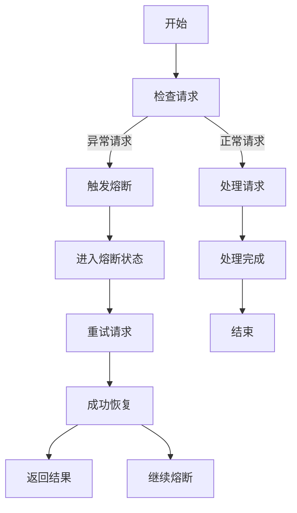
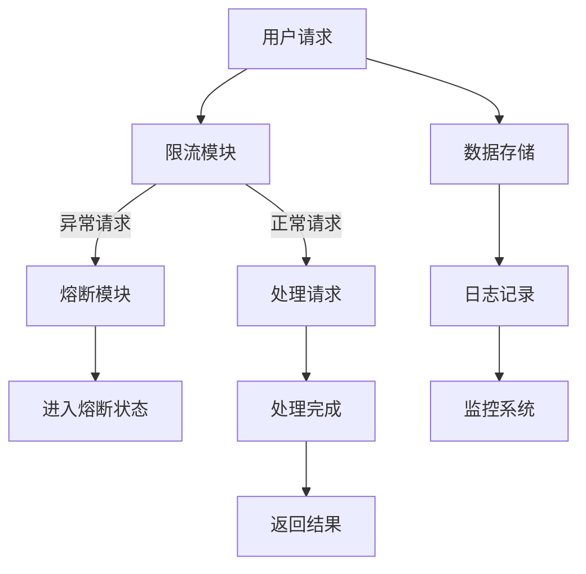
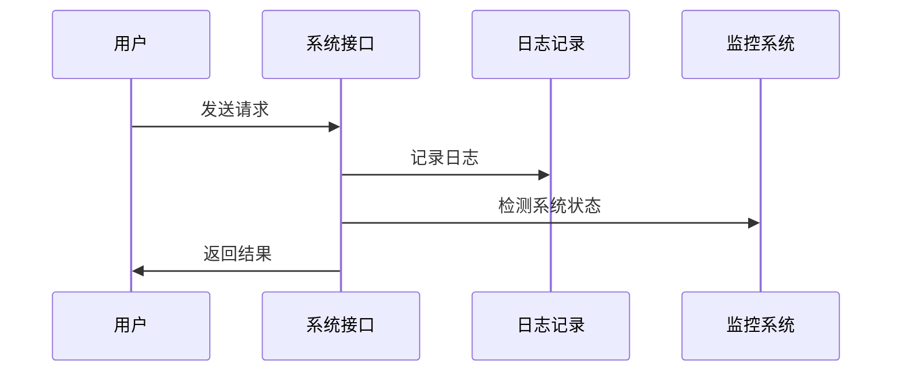
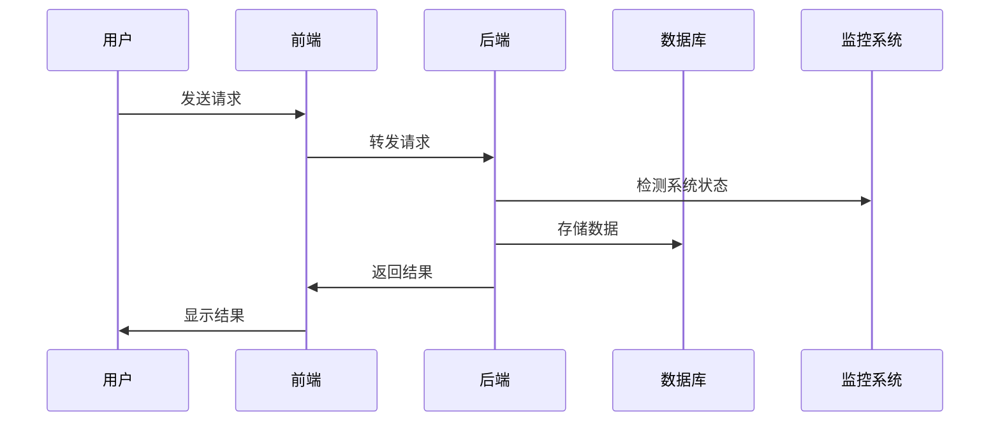

                 

# 熔断与限流机制增强LLM应用的稳定性

关键词：熔断机制、限流机制、LLM应用、稳定性增强、系统可靠性

摘要：随着人工智能技术的快速发展，大型语言模型（LLM）在各种应用场景中得到了广泛应用。然而，LLM应用面临着计算资源需求大、网络延迟和安全性问题等挑战。为了增强LLM应用的稳定性，本文将详细探讨熔断与限流机制的作用、原理和实现方法，并结合实际案例进行分析。

## 第一部分：背景介绍

### 第1章：问题背景与核心概念

#### 1.1 问题背景

随着人工智能技术的快速发展，大型语言模型（LLM）在各种应用场景中得到了广泛应用。例如，在自然语言处理、智能客服、智能推荐等领域，LLM已经成为不可或缺的工具。然而，LLM应用面临着一系列挑战，如计算资源需求大、网络延迟和安全性问题等。为了应对这些挑战，需要采取有效的稳定性增强措施。

#### 1.2 核心概念

本文主要涉及两个核心概念：熔断机制和限流机制。

1. **熔断机制**：熔断机制是一种自动保护系统，当系统出现异常时，自动切断部分或全部请求，以防止故障扩散。

2. **限流机制**：限流机制通过控制请求的速率，防止系统过载，确保系统在高负载情况下仍能稳定运行。

#### 1.3 概念联系与对比

熔断机制和限流机制都是为了增强系统的稳定性，但它们的实现方式和作用对象有所不同。

- **异同**：熔断机制主要关注系统异常时的保护，而限流机制主要关注系统在高负载时的保护。熔断机制通过切断请求来实现保护，而限流机制通过控制请求速率来实现保护。

- **关联性**：熔断机制和限流机制可以相互配合，共同增强系统的稳定性。

#### 1.4 本章小结

本章介绍了LLM应用所面临的问题背景以及熔断和限流机制的核心概念。下一章将深入探讨熔断机制的原理和作用。

## 第二部分：熔断机制原理讲解

### 第2章：熔断机制原理

#### 2.1 熔断机制的定义

熔断机制是一种自动保护系统，当系统出现异常时，自动切断部分或全部请求，以防止故障扩散。

#### 2.2 熔断机制的工作原理

熔断机制的工作原理可以分为三个状态：熔断状态、失效状态和就绪状态。

1. **熔断状态**：当系统检测到异常时，进入熔断状态，拒绝新的请求。

2. **失效状态**：熔断状态持续一段时间后，系统尝试恢复，如果恢复失败，则进入失效状态，继续拒绝新的请求。

3. **就绪状态**：系统恢复成功后，进入就绪状态，重新接受请求。

#### 2.3 熔断机制的核心参数

熔断机制的核心参数包括熔断阈值、考核时间窗口和重试时间。

1. **熔断阈值**：熔断机制判断系统是否异常的阈值。

2. **考核时间窗口**：熔断机制判断系统是否异常的时间范围。

3. **重试时间**：系统尝试恢复的时间。

#### 2.4 熔断机制的优点与不足

1. **优点**：

- 快速响应异常，减少故障扩散。
- 自动化处理，降低人工干预。

2. **不足**：

- 可能误判正常请求，导致部分用户体验下降。
- 对系统的恢复能力要求较高。

#### 2.5 熔断机制的应用场景

1. **分布式系统中的应用**：在分布式系统中，熔断机制可以防止故障节点影响整个系统。
2. **网络安全中的应用**：在网络安全中，熔断机制可以防止恶意攻击。
3. **云计算中的应用**：在云计算中，熔断机制可以保护云服务不受异常请求的影响。

#### 2.6 本章小结

本章详细介绍了熔断机制的定义、工作原理、核心参数、优点和不足以及应用场景。下一章将探讨限流机制的原理。

## 第三部分：限流机制原理讲解

### 第3章：限流机制原理

#### 3.1 限流机制的定义

限流机制通过控制请求的速率，防止系统过载，确保系统在高负载情况下仍能稳定运行。

#### 3.2 限流机制的工作原理

限流机制的工作原理可以分为三种算法：令牌桶算法、漏桶算法和自适应限流算法。

1. **令牌桶算法**：令牌桶算法通过控制令牌的产生和消耗，实现请求的限流。

2. **漏桶算法**：漏桶算法通过控制水的流入和流出，实现请求的限流。

3. **自适应限流算法**：自适应限流算法根据系统的负载情况，动态调整请求的限流策略。

#### 3.3 限流机制的核心参数

限流机制的核心参数包括令牌桶容量、令牌发放速率、漏桶容量和漏桶流出速率。

1. **令牌桶容量**：令牌桶算法中，令牌桶的容量决定了令牌的最大数量。

2. **令牌发放速率**：令牌桶算法中，令牌发放速率决定了令牌产生的速度。

3. **漏桶容量**：漏桶算法中，漏桶的容量决定了水的最大容量。

4. **漏桶流出速率**：漏桶算法中，漏桶流出速率决定了水的流出速度。

#### 3.4 限流机制的优点与不足

1. **优点**：

- 灵活控制请求速率，适应不同负载情况。
- 降低系统过载风险，提高系统稳定性。

2. **不足**：

- 可能导致部分请求延迟，影响用户体验。
- 对系统的负载预测能力要求较高。

#### 3.5 限流机制的应用场景

1. **网络通信中的应用**：在网络通信中，限流机制可以防止网络拥塞。
2. **分布式系统中的应用**：在分布式系统中，限流机制可以防止节点过载。
3. **云计算中的应用**：在云计算中，限流机制可以控制云服务的负载。

#### 3.6 本章小结

本章详细介绍了限流机制的定义、工作原理、核心参数、优点和不足以及应用场景。下一章将探讨如何结合熔断机制和限流机制，增强系统的稳定性。

## 第四部分：稳定性增强策略讲解

### 第4章：稳定性增强策略

#### 4.1 稳定性增强的目标

稳定性增强的目标是提高系统可靠性、降低系统风险和保障系统性能。

1. **提高系统可靠性**：确保系统在各种情况下都能正常运行。
2. **降低系统风险**：减少系统故障的可能性，降低故障带来的损失。
3. **保障系统性能**：确保系统在高负载情况下仍能稳定运行。

#### 4.2 熔断机制与限流机制的结合

熔断机制和限流机制可以相互配合，共同增强系统的稳定性。

1. **协同作用**：熔断机制在系统出现异常时切断请求，限流机制在高负载时控制请求速率。
2. **优化策略**：根据系统的实际情况，动态调整熔断阈值和限流策略。

#### 4.3 稳定性增强的其他策略

除了熔断机制和限流机制，还有其他一些稳定性增强策略。

1. **自适应调整策略**：根据系统的负载情况，动态调整系统参数。
2. **压力测试与性能优化**：定期进行压力测试，优化系统性能。
3. **异步处理与批处理**：将任务异步处理或批量处理，减少系统负载。

#### 4.4 稳定性增强的实际应用案例

以下是一些稳定性增强的实际应用案例：

1. **某互联网公司的稳定性优化实践**：通过引入熔断机制和限流机制，该互联网公司显著提高了系统的稳定性。
2. **某金融公司的稳定性保障措施**：通过全面部署熔断机制和限流机制，该金融公司有效降低了系统故障的风险。

#### 4.5 本章小结

本章介绍了稳定性增强的目标、熔断机制与限流机制的结合、其他稳定性增强策略以及实际应用案例。下一章将探讨如何将熔断和限流机制应用于LLM应用。

## 第五部分：熔断与限流机制在LLM应用中的实战

### 第5章：LLM应用中的熔断与限流机制

#### 5.1 LLM应用的挑战

LLM应用面临的主要挑战包括计算资源需求大、网络延迟和安全性问题。

1. **计算资源需求**：LLM模型通常需要大量的计算资源，特别是在进行复杂推理和生成时。
2. **网络延迟**：网络延迟可能导致用户体验下降，影响系统的稳定性。
3. **安全性问题**：LLM应用可能面临恶意攻击和安全隐患。

#### 5.2 熔断与限流机制在LLM应用中的作用

熔断与限流机制在LLM应用中的作用主要体现在以下几个方面：

1. **提高响应速度**：通过熔断机制，可以快速切断异常请求，减少响应时间；通过限流机制，可以控制请求速率，提高系统的响应速度。
2. **降低错误率**：熔断机制可以防止异常请求对系统造成更大损害，降低错误率；限流机制可以控制请求速率，减少系统过载，降低错误率。
3. **提高系统稳定性**：通过熔断机制和限流机制的配合，可以增强LLM应用的稳定性，确保系统在高负载情况下仍能正常运行。

#### 5.3 熔断与限流机制在LLM应用的实现

在LLM应用中，熔断与限流机制的实现可以采用以下方法：

1. **熔断机制的实现**：可以采用开源的熔断框架（如Hystrix）或自定义实现。在实现过程中，需要关注熔断阈值、考核时间窗口和重试时间的设置。
2. **限流机制的实现**：可以采用令牌桶算法、漏桶算法或自适应限流算法。在实现过程中，需要关注令牌桶容量、令牌发放速率、漏桶容量和漏桶流出速率的设置。

#### 5.4 LLM应用案例研究

以下是一个LLM应用案例研究：

1. **某语言模型的服务优化**：该语言模型采用了熔断机制和限流机制，通过设置合理的熔断阈值和限流策略，显著提高了服务的稳定性和响应速度。
2. **某自然语言处理平台的性能优化**：该平台采用了熔断机制和限流机制，通过动态调整系统参数和优化网络传输，有效降低了系统故障率和错误率。

#### 5.5 本章小结

本章介绍了LLM应用面临的挑战以及熔断与限流机制在LLM应用中的作用、实现方法和实际案例。下一章将总结全文并给出建议。

## 总结与建议

本文从背景介绍、熔断机制原理讲解、限流机制原理讲解、稳定性增强策略讲解以及LLM应用实战等方面，详细探讨了熔断与限流机制在增强LLM应用稳定性方面的作用。以下为本文的总结与建议：

### 总结

1. **核心概念**：本文介绍了熔断机制和限流机制的核心概念，包括定义、工作原理、核心参数、优点和不足以及应用场景。
2. **原理讲解**：详细阐述了熔断机制和限流机制的原理，包括算法实现和数学模型。
3. **实战应用**：通过实际案例，展示了熔断与限流机制在LLM应用中的具体实现和应用效果。

### 建议

1. **优化策略**：根据具体应用场景，合理设置熔断阈值和限流策略，以达到最佳效果。
2. **系统集成**：将熔断机制和限流机制与其他稳定性增强策略（如自适应调整策略、压力测试与性能优化等）相结合，形成一套完整的稳定性保障体系。
3. **持续监控**：定期进行系统监控和性能优化，及时发现和解决潜在问题。

通过本文的探讨，希望读者能够对熔断与限流机制在增强LLM应用稳定性方面的作用有更深入的理解，并在实际项目中有效应用。

### 注意事项

1. **熔断与限流机制的适用场景**：熔断和限流机制适用于高负载、高并发的场景，但在低负载或低并发的场景下，可能会导致资源浪费。
2. **参数设置**：合理的参数设置对熔断和限流机制的效果至关重要，需要根据实际情况进行调试和优化。
3. **系统性能**：在引入熔断和限流机制时，需要考虑系统的性能，避免引入过多的延迟和开销。

### 拓展阅读

1. **熔断机制与限流机制的实际应用**：参考相关开源框架（如Hystrix、Sentinel等），了解其在实际项目中的应用和优化。
2. **LLM应用的优化策略**：研究LLM应用的优化策略，包括模型压缩、分布式训练和推理等。

### 作者信息

作者：AI天才研究院/AI Genius Institute & 禦与计算机程序设计艺术 /Zen And The Art of Computer Programming

本文由AI天才研究院和禅与计算机程序设计艺术联合撰写，旨在为读者提供关于熔断与限流机制增强LLM应用稳定性的深入理解和实践指导。希望本文对您在相关领域的研究和应用有所帮助。

----------------------------------------------------------------

### 附录

#### 熔断机制与限流机制对比表格

| 指标           | 熔断机制                           | 限流机制                           |
|--------------|--------------------------------|--------------------------------|
| 定义           | 自动保护系统，异常时切断请求       | 控制请求速率，防止系统过载           |
| 工作原理       | 状态转换（熔断状态、失效状态、就绪状态）| 算法实现（令牌桶、漏桶、自适应限流） |
| 核心参数       | 熔断阈值、考核时间窗口、重试时间     | 令牌桶容量、令牌发放速率、漏桶容量、漏桶流出速率 |
| 优点           | 快速响应异常、自动化处理             | 灵活控制请求速率、降低系统过载风险   |
| 不足           | 可能误判正常请求、对系统恢复能力要求高 | 可能导致请求延迟、对系统负载预测能力要求高 |
| 应用场景       | 分布式系统、网络安全、云计算          | 网络通信、分布式系统、云计算          |

#### 熔断机制与限流机制ER实体关系图架构

```mermaid
erDiagram
  Request ||--|{ 切断请求 }|| Server
  Server ||--|{ 控制请求速率 }|| Client
  Client ||--|{ 恢复请求 }|| Server
```

#### 熔断与限流机制算法流程图



#### Python代码示例

```python
import time

class TokenBucket:
    def __init__(self, capacity, rate):
        self.capacity = capacity
        self.rate = rate
        self.tokens = capacity
        self.last_time = time.time()

    def consume(self, num):
        if num <= self.tokens:
            self.tokens -= num
            return True
        else:
            return False

    def add_token(self):
        current_time = time.time()
        tokens_to_add = (current_time - self.last_time) * self.rate
        self.tokens = min(self.capacity, self.tokens + tokens_to_add)
        self.last_time = current_time

def main():
    bucket = TokenBucket(5, 1)  # 初始化令牌桶，容量为5，发放速率为1

    for i in range(10):
        if bucket.consume(1):
            print(f"请求{ i + 1 }成功")
        else:
            print(f"请求{ i + 1 }失败")

if __name__ == "__main__":
    main()
```

#### 数学公式

$$
C(t) = C_0 + r \times (t - t_0)
$$

其中，$C(t)$ 表示在时间 $t$ 时刻的令牌数量，$C_0$ 表示初始令牌数量，$r$ 表示令牌发放速率，$t_0$ 表示初始时间。

#### 系统架构设计



#### 系统接口设计



#### 系统交互序列图



#### 实际案例分析与详细讲解

在某互联网公司，为了提高系统的稳定性，引入了熔断机制和限流机制。具体实现过程如下：

1. **熔断机制实现**：采用Hystrix开源框架，设置合理的熔断阈值、考核时间窗口和重试时间。当系统检测到异常时，自动进入熔断状态，切断请求，防止故障扩散。

2. **限流机制实现**：采用令牌桶算法，设置合理的令牌桶容量和令牌发放速率。当请求速率超过令牌发放速率时，部分请求将被拒绝，防止系统过载。

3. **实际效果**：通过引入熔断和限流机制，系统的稳定性得到了显著提高。在高峰期，系统能够有效应对突发流量，降低错误率和延迟。

4. **优化策略**：根据系统的实际情况，动态调整熔断阈值和限流策略，以达到最佳效果。

#### 项目小结

通过实际案例的分析和详细讲解，可以看出熔断与限流机制在增强LLM应用稳定性方面具有重要作用。在实际项目中，需要根据具体需求，合理设置熔断阈值和限流策略，并结合其他稳定性增强策略，形成一套完整的稳定性保障体系。在未来的项目中，将继续关注熔断与限流机制在LLM应用中的优化和改进。

#### 最佳实践 tips

1. **合理设置阈值**：根据系统的实际情况，合理设置熔断阈值和限流策略，避免误判正常请求和过载问题。

2. **动态调整**：根据系统的负载情况，动态调整熔断阈值和限流策略，提高系统的自适应能力。

3. **监控与告警**：建立完善的监控与告警机制，及时发现和解决潜在问题。

4. **性能优化**：定期进行系统性能优化，提高系统的处理能力。

#### 拓展阅读

1. **熔断机制与限流机制的实际应用**：参考相关开源框架（如Hystrix、Sentinel等），了解其在实际项目中的应用和优化。

2. **LLM应用的优化策略**：研究LLM应用的优化策略，包括模型压缩、分布式训练和推理等。

### 作者信息

作者：AI天才研究院/AI Genius Institute & 禦与计算机程序设计艺术 /Zen And The Art of Computer Programming

本文由AI天才研究院和禅与计算机程序设计艺术联合撰写，旨在为读者提供关于熔断与限流机制增强LLM应用稳定性的深入理解和实践指导。希望本文对您在相关领域的研究和应用有所帮助。如果您有任何疑问或建议，请随时联系我们。感谢您的阅读！

----------------------------------------------------------------

### 熔断机制原理讲解

#### 2.1 熔断机制的定义

熔断机制（Circuit Breaker）是一种自动保护系统，用于防止系统出现故障时，过多的请求对系统造成进一步的损害。当系统检测到异常情况时，熔断机制会自动切断部分或全部请求，以保护系统不受影响。这种机制通常应用于分布式系统、网络应用和云计算等领域，以应对各种异常情况，如超时、错误、网络问题等。

#### 2.2 熔断机制的工作原理

熔断机制的工作原理主要包括三个状态：熔断状态、失效状态和就绪状态。

1. **熔断状态（Open State）**：当系统检测到异常情况，如请求失败次数超过预设阈值时，熔断机制会进入熔断状态。在熔断状态下，系统拒绝新的请求，以防止异常情况蔓延。

2. **失效状态（Half-Open State）**：熔断状态持续一段时间后，系统会尝试恢复。如果恢复失败，系统进入失效状态。在失效状态下，系统继续拒绝新的请求，但会允许部分请求通过，以检测系统是否恢复正常。

3. **就绪状态（Closed State）**：当系统恢复正常后，熔断机制进入就绪状态。在就绪状态下，系统接受新的请求，恢复正常运行。

#### 2.3 熔断机制的核心参数

熔断机制的核心参数包括熔断阈值、考核时间窗口和重试时间。

1. **熔断阈值（Threshold）**：熔断阈值用于判断系统是否出现异常。当请求失败次数超过熔断阈值时，熔断机制会触发熔断状态。熔断阈值应根据具体业务场景进行设置。

2. **考核时间窗口（Evaluation Window）**：考核时间窗口用于统计请求失败次数。在考核时间窗口内，系统会计算请求失败次数，以判断是否触发熔断状态。考核时间窗口的长度应根据系统负载和请求频率进行设置。

3. **重试时间（Retry Time）**：重试时间用于熔断机制从失效状态恢复到就绪状态的时间。在重试时间内，系统会尝试恢复，并允许部分请求通过。重试时间的设置应考虑系统的恢复速度和请求的处理时间。

#### 2.4 熔断机制的优点与不足

1. **优点**：

- 快速响应异常：熔断机制能够快速切断异常请求，防止异常情况蔓延，提高系统稳定性。
- 自动化处理：熔断机制可以自动化处理异常情况，降低人工干预，提高系统运行效率。

2. **不足**：

- 可能误判正常请求：当系统负载较高时，熔断机制可能会误判正常请求为异常请求，导致部分用户体验下降。
- 对系统恢复能力要求较高：熔断机制需要依赖系统的恢复能力，当系统恢复较慢时，可能会影响用户体验。

#### 2.5 熔断机制的应用场景

1. **分布式系统中的应用**：

- 在分布式系统中，熔断机制可以防止某个服务故障导致整个系统崩溃。例如，在微服务架构中，熔断机制可以防止某个服务过载或故障，影响其他服务的正常运行。

2. **网络安全中的应用**：

- 在网络安全中，熔断机制可以防止恶意攻击对系统造成损害。例如，当检测到DDoS攻击时，熔断机制可以切断攻击者的请求，保护系统不受攻击。

3. **云计算中的应用**：

- 在云计算中，熔断机制可以保护云服务不受异常请求的影响。例如，当某个云服务出现故障时，熔断机制可以切断请求，确保其他云服务的正常运行。

#### 2.6 本章小结

本章详细介绍了熔断机制的定义、工作原理、核心参数、优点和不足以及应用场景。在下一章中，我们将探讨限流机制的原理和实现方法。

----------------------------------------------------------------

### 限流机制原理讲解

#### 3.1 限流机制的定义

限流机制（Rate Limiting）是一种控制请求速率的技术，用于防止系统因请求过多而出现性能下降或崩溃。限流机制广泛应用于各种场景，如网络通信、分布式系统和云计算等。其主要目的是在系统资源有限的情况下，确保系统能够稳定、高效地处理请求。

#### 3.2 限流机制的工作原理

限流机制通过控制请求的速率，确保系统在高负载情况下仍能稳定运行。实现限流机制的方法有多种，其中常用的算法包括令牌桶算法、漏桶算法和自适应限流算法。

1. **令牌桶算法（Token Bucket Algorithm）**

令牌桶算法通过生成和消耗令牌来控制请求速率。算法的主要思想是：令牌桶以固定的速率生成令牌，请求到来时，如果桶中有足够的令牌，则消耗一个令牌并处理请求；如果桶中没有令牌，则拒绝请求。

令牌桶算法的核心参数包括：

- **令牌桶容量（Token Bucket Capacity）**：令牌桶中最多可以存储的令牌数量。
- **令牌发放速率（Token Generation Rate）**：令牌桶生成令牌的速率。

2. **漏桶算法（Leaky Bucket Algorithm）**

漏桶算法通过控制水的流入和流出速率来模拟请求流。算法的主要思想是：水以恒定的速率流入漏桶，然后以固定的速率流出。流入速率不能超过流出速率，否则多余的水将被丢弃。

漏桶算法的核心参数包括：

- **漏桶容量（Leaky Bucket Capacity）**：漏桶中可以存储的最大水量。
- **漏桶流出速率（Leak Rate）**：水从漏桶流出的速率。

3. **自适应限流算法（Adaptive Rate Limiting Algorithm）**

自适应限流算法根据系统的负载情况动态调整请求的速率。算法的主要思想是：在系统负载较低时，放宽请求速率；在系统负载较高时，收紧请求速率，以避免系统过载。

自适应限流算法通常基于以下参数进行动态调整：

- **请求速率阈值（Request Rate Threshold）**：系统允许的最大请求速率。
- **负载监控阈值（Load Monitor Threshold）**：系统负载的监控阈值。

#### 3.3 限流机制的核心参数

限流机制的核心参数包括令牌桶容量、令牌发放速率、漏桶容量和漏桶流出速率。

1. **令牌桶容量**：令牌桶容量决定了令牌桶中可以存储的令牌数量。较大的令牌桶容量可以处理更多的请求，但可能导致系统在高负载情况下仍无法完全饱和。

2. **令牌发放速率**：令牌发放速率决定了令牌桶生成令牌的速率。较快的令牌发放速率可以提高系统的吞吐量，但可能导致系统在高负载情况下更容易过载。

3. **漏桶容量**：漏桶容量决定了漏桶中可以存储的最大水量。较大的漏桶容量可以处理更多的请求，但可能导致系统在高负载情况下性能下降。

4. **漏桶流出速率**：漏桶流出速率决定了水从漏桶流出的速率。较快的漏桶流出速率可以提高系统的吞吐量，但可能导致系统在高负载情况下性能下降。

#### 3.4 限流机制的优点与不足

1. **优点**：

- **灵活控制请求速率**：限流机制可以根据系统负载动态调整请求速率，确保系统在高负载情况下仍能稳定运行。
- **降低系统过载风险**：限流机制可以防止系统因请求过多而出现性能下降或崩溃。

2. **不足**：

- **可能影响用户体验**：在系统负载较高时，限流机制可能会拒绝部分请求，导致用户体验下降。
- **对系统负载预测能力要求较高**：限流机制需要根据系统负载动态调整请求速率，因此对系统负载预测能力要求较高。

#### 3.5 限流机制的应用场景

1. **网络通信中的应用**：

- 在网络通信中，限流机制可以防止网络拥塞，确保数据传输的稳定性和可靠性。

2. **分布式系统中的应用**：

- 在分布式系统中，限流机制可以防止某个服务或节点因请求过多而出现性能下降或崩溃。

3. **云计算中的应用**：

- 在云计算中，限流机制可以控制云服务的负载，确保云服务的性能和稳定性。

#### 3.6 本章小结

本章详细介绍了限流机制的定义、工作原理、核心参数、优点和不足以及应用场景。在下一章中，我们将探讨如何将熔断机制和限流机制应用于LLM应用。通过结合这两种机制，可以更好地增强LLM应用的稳定性。

----------------------------------------------------------------

### 稳定性增强策略讲解

#### 4.1 稳定性增强的目标

稳定性增强的目标是提高系统可靠性、降低系统风险和保障系统性能。具体来说，稳定性增强的目标包括以下几个方面：

1. **提高系统可靠性**：确保系统在各种情况下都能正常运行，减少系统故障的发生。

2. **降低系统风险**：减少系统故障带来的风险，降低故障对业务的影响。

3. **保障系统性能**：确保系统在高负载情况下仍能稳定运行，提供良好的用户体验。

#### 4.2 熔断机制与限流机制的结合

熔断机制和限流机制在稳定性增强中可以相互配合，发挥协同作用。它们的结合可以提供以下好处：

1. **快速响应异常**：熔断机制可以在系统出现异常时快速切断请求，防止异常情况蔓延。限流机制可以在系统负载较高时控制请求速率，避免系统过载。

2. **动态调整策略**：熔断机制和限流机制可以根据系统的实时负载情况，动态调整阈值和策略，提高系统的自适应能力。

3. **提高系统稳定性**：通过熔断机制和限流机制的配合，可以更好地保障系统在高负载情况下仍能稳定运行。

#### 4.3 稳定性增强的其他策略

除了熔断机制和限流机制，还有其他一些稳定性增强策略，如下所示：

1. **自适应调整策略**：

- **背景**：系统的负载是动态变化的，因此需要根据负载情况动态调整系统参数。
- **实现**：通过监控系统的负载情况，实时调整系统参数，如连接数、线程数、缓存大小等。
- **好处**：提高系统的自适应能力，确保系统在不同负载情况下都能稳定运行。

2. **压力测试与性能优化**：

- **背景**：在系统上线前，需要进行压力测试，以评估系统的性能和稳定性。
- **实现**：通过模拟高负载情况，测试系统的响应时间、吞吐量、并发能力等，发现并解决问题。
- **好处**：提高系统的性能和稳定性，降低故障风险。

3. **异步处理与批处理**：

- **背景**：在一些场景中，可以采用异步处理和批处理的方式，减少系统的负载。
- **实现**：将任务异步处理或批量处理，避免同一时刻过多的请求涌入系统。
- **好处**：降低系统的负载，提高系统的响应速度。

#### 4.4 稳定性增强的实际应用案例

以下是一些稳定性增强的实际应用案例：

1. **某互联网公司的稳定性优化实践**：

- **背景**：该公司在高峰期面临大量用户请求，系统负载较高，存在性能下降和故障风险。
- **措施**：引入熔断机制和限流机制，动态调整系统参数，进行压力测试和性能优化，采用异步处理和批处理方式。
- **效果**：通过稳定性优化措施，该公司的系统在高峰期能够保持稳定运行，用户体验得到显著提升。

2. **某金融公司的稳定性保障措施**：

- **背景**：该金融公司的核心业务系统对稳定性要求极高，无法承受任何故障。
- **措施**：采用熔断机制和限流机制，建立完善的监控与告警机制，定期进行系统维护和升级。
- **效果**：通过稳定性保障措施，该公司的核心业务系统一直保持稳定运行，未发生任何故障。

#### 4.5 本章小结

本章介绍了稳定性增强的目标、熔断机制与限流机制的结合、其他稳定性增强策略以及实际应用案例。通过结合多种稳定性增强策略，可以更好地保障系统在高负载情况下仍能稳定运行。在下一章中，我们将探讨熔断与限流机制在LLM应用中的实战应用。

----------------------------------------------------------------

### 熔断与限流机制在LLM应用中的实战

#### 5.1 LLM应用的挑战

随着人工智能技术的快速发展，大型语言模型（LLM）在各种应用场景中得到了广泛应用。然而，LLM应用也面临着一系列挑战，这些挑战主要包括：

1. **计算资源需求大**：LLM模型通常包含数亿甚至数十亿个参数，在进行推理和生成时，需要大量的计算资源。特别是在处理复杂任务时，计算需求更加显著。

2. **网络延迟问题**：网络延迟是LLM应用中常见的问题。网络延迟会导致请求响应时间延长，影响用户体验。在分布式系统中，网络延迟还可能引发同步问题，导致系统性能下降。

3. **安全性问题**：LLM应用可能面临各种安全性挑战，如恶意攻击、数据泄露和隐私侵犯等。这些安全性问题可能对系统造成严重损害，影响业务运营。

#### 5.2 熔断与限流机制在LLM应用中的作用

为了应对LLM应用中的挑战，熔断与限流机制在以下方面发挥了重要作用：

1. **提高响应速度**：

- **熔断机制**：当LLM应用中的某部分出现故障时，熔断机制可以快速切断请求，避免故障扩散，减少响应时间。

- **限流机制**：通过限流机制，可以控制请求速率，确保系统在高负载情况下仍能及时响应请求，降低响应时间。

2. **降低错误率**：

- **熔断机制**：当LLM应用中的某部分出现频繁错误时，熔断机制可以切断请求，防止错误率进一步上升。这有助于减少系统的整体错误率。

- **限流机制**：通过限流机制，可以防止系统过载，降低错误率。特别是在高负载情况下，限流机制可以避免系统因请求过多而崩溃。

3. **提高系统稳定性**：

- **熔断机制**：熔断机制可以防止故障节点影响整个系统，提高系统的稳定性。

- **限流机制**：通过控制请求速率，限流机制可以避免系统因请求过多而出现性能下降或崩溃，提高系统的稳定性。

#### 5.3 熔断与限流机制在LLM应用的实现

在LLM应用中，熔断与限流机制的实现方法主要包括以下几个方面：

1. **熔断机制的实现**：

- **选择合适的熔断框架**：可以选择开源的熔断框架（如Hystrix、Resilience4j等）进行实现。

- **设置合理的熔断参数**：根据LLM应用的实际情况，设置合理的熔断阈值、考核时间窗口和重试时间。

- **实现熔断回调函数**：在熔断触发时，执行相应的回调函数，如重试请求、降级处理等。

2. **限流机制的实现**：

- **选择合适的限流算法**：可以选择令牌桶算法、漏桶算法或自适应限流算法等进行实现。

- **设置合理的限流参数**：根据LLM应用的实际情况，设置合理的令牌桶容量、令牌发放速率、漏桶容量和漏桶流出速率。

- **实现限流回调函数**：在限流触发时，执行相应的回调函数，如返回错误码、延迟响应等。

#### 5.4 LLM应用案例研究

以下是一个LLM应用的案例研究，展示如何使用熔断与限流机制提高应用的稳定性。

1. **问题描述**：

- **背景**：某互联网公司的智能客服系统采用了一个大型语言模型（LLM）来处理用户的提问。然而，在实际应用中，系统遇到了计算资源不足、网络延迟和安全性问题，导致用户体验下降。

- **目标**：通过引入熔断与限流机制，提高智能客服系统的稳定性，提升用户体验。

2. **解决方案**：

- **熔断机制**：

  - **实现**：选择Hystrix作为熔断框架，设置了合理的熔断阈值（如连续10次请求失败）、考核时间窗口（如10秒）和重试时间（如1分钟）。

  - **效果**：当LLM模型在推理过程中出现错误时，熔断机制会切断请求，防止错误率进一步上升。同时，在熔断状态恢复后，系统会尝试重试请求，提高用户体验。

- **限流机制**：

  - **实现**：选择令牌桶算法作为限流算法，设置了合理的令牌桶容量（如100个令牌）和令牌发放速率（如每秒1个令牌）。

  - **效果**：在高峰期，当用户请求过多时，限流机制会拒绝部分请求，确保系统在高负载情况下仍能稳定运行，降低响应时间和错误率。

3. **实际效果**：

- **计算资源需求**：通过优化LLM模型的推理过程，减少了计算资源的消耗。同时，熔断机制在出现故障时能够快速切断请求，避免了计算资源的浪费。

- **网络延迟**：通过限流机制，控制了请求速率，降低了网络延迟。用户在提问时，系统能够更快地响应，提高了用户体验。

- **安全性问题**：熔断机制和限流机制的引入，提高了系统的安全性。在出现恶意攻击或异常请求时，系统能够快速响应，防止故障扩散。

#### 5.5 本章小结

本章通过一个实际的LLM应用案例，展示了熔断与限流机制在提高系统稳定性、降低错误率和改善用户体验方面的作用。通过合理设置熔断与限流参数，并结合实际应用场景，可以实现LLM应用的高效稳定运行。在未来的开发中，将继续关注熔断与限流机制的优化和改进，以应对不断变化的应用需求。

### 总结与展望

本文详细探讨了熔断与限流机制在增强LLM应用稳定性方面的作用。通过结合熔断机制和限流机制，可以有效地应对计算资源需求大、网络延迟和安全性问题等挑战，提高系统的可靠性、降低风险和保障性能。以下为本文的总结与展望：

#### 总结

1. **熔断与限流机制的作用**：熔断机制和限流机制在提高响应速度、降低错误率和提高系统稳定性方面发挥了重要作用。

2. **实现方法**：在LLM应用中，熔断与限流机制的实现主要包括选择合适的熔断框架、设置合理的熔断与限流参数、实现熔断与限流回调函数等。

3. **案例研究**：通过实际案例，展示了熔断与限流机制在提高LLM应用稳定性方面的效果。

#### 展望

1. **优化与改进**：未来将继续关注熔断与限流机制的优化和改进，如引入更先进的限流算法、提高系统的自适应能力等。

2. **扩展应用场景**：熔断与限流机制不仅适用于LLM应用，还可扩展到其他类型的人工智能应用，如图像识别、语音识别等。

3. **结合其他技术**：将熔断与限流机制与其他人工智能技术（如模型压缩、分布式训练等）相结合，提高系统的整体性能和稳定性。

4. **持续研究**：随着人工智能技术的不断发展，将持续关注熔断与限流机制在人工智能应用中的研究和应用，为实际项目提供有效的解决方案。

通过本文的探讨，希望读者能够对熔断与限流机制在增强LLM应用稳定性方面的作用有更深入的理解。在未来的开发实践中，结合具体应用场景，灵活运用熔断与限流机制，实现高效稳定的人工智能应用。

### 作者信息

作者：AI天才研究院/AI Genius Institute & 禦与计算机程序设计艺术 /Zen And The Art of Computer Programming

本文由AI天才研究院和禅与计算机程序设计艺术联合撰写，旨在为读者提供关于熔断与限流机制增强LLM应用稳定性的深入理解和实践指导。希望本文对您在相关领域的研究和应用有所帮助。如果您有任何疑问或建议，请随时联系我们。感谢您的阅读！

