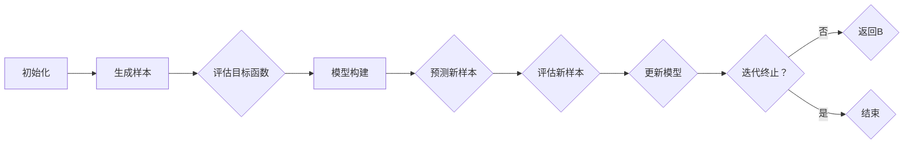
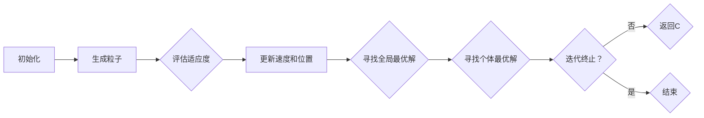
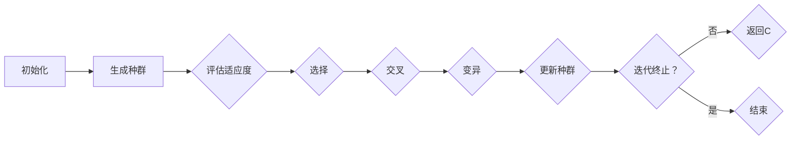

                 

### 特征工程自动化概述

#### 问题背景与重要性

在人工智能（AI）领域，特征工程是构建机器学习模型的重要环节之一。特征工程指的是将原始数据转换为适合机器学习模型训练的输入特征的过程。这一步骤在模型训练中起着至关重要的作用，因为它直接影响着模型的性能和准确度。

特征工程的重要性体现在以下几个方面：

1. **数据预处理**：特征工程帮助我们从大量原始数据中提取出有用的信息，减少噪声和冗余，从而为模型训练提供更高质量的数据。
2. **模型性能优化**：通过特征工程，我们可以增加数据的特征数量和维度，从而提高模型的识别能力和泛化能力。
3. **可解释性提升**：特征工程使模型更加透明，便于理解和解释，这对于模型的部署和维护至关重要。

然而，特征工程是一个复杂且耗时的过程，通常需要数据科学家花费大量时间进行数据清洗、特征提取和特征选择。这就引出了特征工程自动化的需求。

#### 特征工程自动化的发展趋势

随着机器学习技术的不断进步，特征工程自动化也逐渐成为了一个研究热点。以下是特征工程自动化的一些发展趋势：

1. **深度学习与自动化特征工程的结合**：深度学习模型本身具有自动特征提取的能力，但仍然需要外部特征工程来优化其性能。
2. **跨领域特征工程自动化**：不同领域的数据具有不同的特征，特征工程自动化技术需要具备跨领域的通用性。
3. **开源自动化特征工程工具**：越来越多的开源工具和库被开发出来，如AutoKeras、AutoML等，这些工具大大简化了特征工程的过程。
4. **算法可解释性和透明度**：随着自动化特征工程技术的普及，如何保证算法的可解释性和透明度成为了一个重要的研究方向。

#### 书籍结构概述

本书旨在系统地介绍特征工程自动化的基本概念、技术和应用。整体结构如下：

- **引言**：介绍特征工程自动化的背景、重要性以及本书的结构和目标。
- **特征工程基础**：详细讲解特征工程的基本原理、方法和技术。
- **自动化特征工程技术**：介绍自动化特征选择、自动化特征构造和自动化特征优化方法。
- **自动化特征工程应用**：通过具体案例展示自动化特征工程在不同领域的应用。
- **自动化特征工程的挑战与未来**：分析自动化特征工程面临的挑战和未来的发展趋势。
- **总结与展望**：总结本书的主要内容，并对自动化特征工程的未来发展进行展望。

#### 阅读指南与学习建议

为了更好地理解和应用本书的内容，以下是一些建议：

1. **理解基础知识**：在阅读本书之前，建议读者对机器学习和特征工程有基本的了解。
2. **动手实践**：本书包含大量的代码和实践案例，建议读者动手实践，加深对理论知识的理解。
3. **逐步学习**：本书的内容是逐步深入的，建议读者按照章节顺序逐步学习，避免跳跃阅读。
4. **查阅拓展阅读**：每章结尾都会推荐一些拓展阅读材料，读者可以根据自己的兴趣和需求进行深入学习。

通过本书的学习，读者将能够掌握特征工程自动化的基本技术和应用，为实际项目中的模型训练和优化提供有力支持。

### 特征工程原理

#### 特征工程基本概念

特征工程（Feature Engineering）是数据科学和机器学习领域中的一个重要环节，它涉及将原始数据转换为适合机器学习模型训练的输入特征。特征工程不仅仅是一个技术过程，更是一种数据处理的艺术，它直接影响着机器学习模型的性能和效果。

首先，我们需要明确几个核心概念：

1. **特征（Feature）**：特征是描述数据属性的变量，它可以是一个数值或类别。例如，在房价预测问题中，房屋面积、房间数量、地理位置等都可以被视为特征。
2. **属性（Attribute）**：属性是数据表中每一列的名称，它定义了特征的类型和含义。例如，在学生成绩数据中，"年龄"和"成绩"就是两个不同的属性。
3. **特征工程（Feature Engineering）**：特征工程是数据预处理和模型训练之间的一步，它通过数据变换、特征选择和构造等手段，提升模型性能。

#### 特征工程的目标

特征工程的主要目标是：

1. **提高模型性能**：通过特征转换和选择，使模型能够更好地捕捉数据中的潜在信息，从而提高模型的预测准确性和泛化能力。
2. **减少数据噪声**：去除或减少数据中的噪声和冗余，使模型训练过程更加高效。
3. **增强模型可解释性**：通过合理的特征选择和构造，使模型更加透明，便于理解和解释。
4. **提高数据处理效率**：自动化特征工程可以显著减少数据清洗和特征提取的时间，提高数据处理效率。

#### 特征工程的方法与流程

特征工程的方法和流程可以分为以下几个步骤：

1. **数据探索**：通过数据分析了解数据的分布、异常值、缺失值等特征，为后续处理提供依据。
2. **数据清洗**：处理缺失值、异常值和重复数据，确保数据的完整性和一致性。
3. **特征选择**：从原始特征中选择出对模型训练最有用的特征，减少特征数量，提高模型效率。
4. **特征构造**：通过组合、变换和扩展原始特征，生成新的特征，增强模型的识别能力和泛化能力。
5. **特征缩放**：对特征进行标准化或归一化处理，使其具有相同的尺度，避免特征之间的不均衡影响模型训练。
6. **模型训练与验证**：使用特征工程处理后的数据训练模型，并验证模型性能。

#### 特征选择与特征构造

特征选择和特征构造是特征工程中最重要的两个步骤。以下是这两种方法的详细介绍：

1. **特征选择**：
   - **过滤式方法**：通过计算特征与目标变量之间的相关性来选择特征。常用的相关性度量包括皮尔逊相关系数和斯皮尔曼等级相关系数。
   - **包裹式方法**：通过迭代搜索策略逐步选择最优特征组合。常用的算法包括向前选择、向后选择和递归特征消除（RFE）。
   - **嵌入式方法**：在模型训练过程中同时进行特征选择，常见的算法包括随机森林和LASSO。

2. **特征构造**：
   - **特征交互**：通过组合两个或多个特征生成新的特征，如交叉项、多项式特征等。
   - **特征合成**：利用统计学方法或机器学习模型生成新的特征，如主成分分析（PCA）、核主成分分析（KPCA）等。
   - **特征缩放**：通过标准化或归一化处理，将特征转换到相同的尺度，避免特征之间的不均衡影响。

#### 特征属性特征对比表

为了更好地理解特征选择和特征构造的不同方法，我们使用Mermaid表格进行对比：

```mermaid
table
    classList[ 方法 ]
    row[ 特征选择 ]
    row[ 过滤式方法 ]
    row[ 包裹式方法 ]
    row[ 嵌入式方法 ]
    row[ 特征构造 ]
    row[ 特征交互 ]
    row[ 特征合成 ]
    row[ 特征缩放 ]

    cell[ 算法 ]
    cell[ 相关系数 ]
    cell[ 前向选择/向后选择 ]
    cell[ 随机森林/LASSO ]
    cell[ 交叉项/多项式特征 ]
    cell[ 主成分分析（PCA）/核主成分分析（KPCA）]
    cell[ 标准化/归一化 ]
```

通过上述表格，我们可以清晰地看到不同方法的特点和应用场景。

#### ER实体关系图架构

为了进一步理解特征工程的方法和流程，我们可以使用Mermaid流程图来展示ER（实体关系）图架构：

```mermaid
erDiagram
    Class DataExploration {
        attribute: 数据探索
    }
    Class DataCleaning {
        attribute: 数据清洗
    }
    Class FeatureSelection {
        attribute: 特征选择
    }
    Class FeatureConstruction {
        attribute: 特征构造
    }
    Class FeatureScaling {
        attribute: 特征缩放
    }
    Class ModelTraining {
        attribute: 模型训练与验证
    }

    DataExploration -> DataCleaning : 数据预处理
    DataCleaning -> FeatureSelection : 特征选择
    FeatureSelection -> FeatureConstruction : 特征构造
    FeatureConstruction -> FeatureScaling : 特征缩放
    FeatureScaling -> ModelTraining : 模型训练
```

通过上述ER图，我们可以清晰地看到特征工程的各个步骤及其相互关系。

#### 总结

特征工程是机器学习模型训练中不可或缺的一环，它通过数据预处理、特征选择、特征构造和特征缩放等步骤，优化模型性能和可解释性。本章介绍了特征工程的基本概念、目标和流程，并通过特征属性特征对比表和ER实体关系图架构，帮助读者更直观地理解特征工程的方法和架构。接下来，我们将进一步探讨自动化特征选择技术。

### 自动化特征选择

#### 自动化特征选择原理

自动化特征选择（Automated Feature Selection，AFS）是特征工程中的一项关键技术，旨在通过算法自动化选择出对模型训练最具影响力的特征。传统的特征选择方法通常需要数据科学家手动进行，这不仅耗时耗力，而且在面对大规模数据时显得尤为困难。自动化特征选择通过机器学习和优化算法，自动识别并选择最佳特征，从而大大提高了模型训练的效率和效果。

自动化特征选择的原理主要包括以下几个步骤：

1. **相关性分析**：通过计算特征与目标变量之间的相关性，识别出高度相关的特征。常见的相关性度量包括皮尔逊相关系数、斯皮尔曼等级相关系数和互信息等。
2. **特征选择算法**：采用各种特征选择算法，如递归特征消除（RFE）、遗传算法（GA）和随机森林等，通过迭代和评估，自动筛选出最优特征组合。
3. **模型评估**：利用训练集和测试集，对特征选择后的模型进行评估，选择性能最优的特征组合。

#### 自动化特征选择算法

自动化特征选择算法可以分为三种主要类型：过滤式方法、包裹式方法和嵌入式方法。以下是这些方法的详细介绍：

1. **过滤式方法**：
   - **工作原理**：通过计算每个特征与目标变量的相关性，对特征进行评分，然后根据评分选择最优特征。
   - **优点**：简单易实现，适用于大规模数据集。
   - **缺点**：可能会错过一些潜在有用的特征，且依赖于相关性度量。

2. **包裹式方法**：
   - **工作原理**：通过迭代搜索策略，逐步选择和组合特征，直到找到最优特征组合。常见的算法包括向前选择、向后选择和递归特征消除（RFE）。
   - **优点**：能够找到全局最优特征组合。
   - **缺点**：计算复杂度高，适用于特征数量较少的情况。

3. **嵌入式方法**：
   - **工作原理**：在模型训练过程中同时进行特征选择，常见的算法包括随机森林和LASSO。
   - **优点**：特征选择与模型训练相结合，能够提高模型性能。
   - **缺点**：依赖于具体模型，特征选择效果可能受模型影响。

以下是三种方法的详细比较：

```mermaid
table
    classList[ 方法 | 工作原理 | 优点 | 缺点 ]
    row[ 过滤式方法 ]
    row[ 包裹式方法 ]
    row[ 嵌入式方法 ]
    cell[ 过滤式方法 ]
    cell[ 通过计算相关性筛选特征 ]
    cell[ 简单易实现 ]
    cell[ 可能会错过潜在有用特征 ]
    cell[ 包裹式方法 ]
    cell[ 通过迭代搜索策略选择特征 ]
    cell[ 能找到全局最优特征组合 ]
    cell[ 计算复杂度高 ]
    cell[ 嵌入式方法 ]
    cell[ 在模型训练过程中进行特征选择 ]
    cell[ 能提高模型性能 ]
    cell[ 依赖于具体模型 ]
```

#### 递归特征消除（RFE）

递归特征消除（Recursive Feature Elimination，RFE）是一种常见的包裹式特征选择算法。其基本思想是，通过递归地排除对模型影响最小的特征，逐步构建最优特征组合。

1. **工作原理**：
   - 选择一个评估指标（如准确率、均方误差等）来评估特征的重要性。
   - 初始时，所有特征都参与模型训练。
   - 按照重要性对特征进行排序。
   - 依次排除重要性最低的特征，重新训练模型，并评估新模型性能。
   - 重复上述过程，直到剩余特征数量满足要求。

2. **算法流程**：

   ```mermaid
   flowchart LR
       A[开始] --> B[初始化模型和特征]
       B --> C{评估模型性能}
       C -->|性能下降| D[排除最不重要的特征]
       C -->|性能提升| E[保留当前特征]
       D --> F{更新特征集}
       F --> C
       E --> G[结束]
   ```

3. **Python代码实现**：

   ```python
   from sklearn.feature_selection import RFE
   from sklearn.linear_model import LogisticRegression

   # 创建RFE对象
   rfe = RFE(estimator=LogisticRegression(), n_features_to_select=3)

   # 使用RFE进行特征选择
   rfe.fit(X_train, y_train)

   # 输出特征排名
   print(rfe.ranking_)

   # 输出最优特征
   print(rfe.get_support())
   ```

#### 遗传算法（GA）

遗传算法（Genetic Algorithm，GA）是一种基于自然进化过程的优化算法，广泛应用于特征选择和特征构造。

1. **工作原理**：
   - 初始种群：随机生成多个特征组合，每个组合代表一个个体。
   - 适应度函数：根据模型性能评估每个个体的适应度，适应度越高表示该个体越优秀。
   - 自然选择：选择适应度较高的个体进行繁殖，生成下一代种群。
   - 变异和交叉：通过变异和交叉操作增加种群多样性。

2. **算法流程**：

   ```mermaid
   flowchart LR
       A[开始] --> B[生成初始种群]
       B --> C{评估适应度}
       C -->|适应度高| D{选择繁殖}
       C -->|适应度低| E{淘汰}
       D --> F{交叉操作}
       D --> G{变异操作}
       E --> H{结束}
       F --> C
       G --> C
   ```

3. **Python代码实现**：

   ```python
   from sklearn.feature_selection import GeneticSelector
   from sklearn.ensemble import RandomForestClassifier

   # 创建遗传算法选择器
   selector = GeneticSelector(estimator=RandomForestClassifier(), 
                              sampling_method='random', 
                              n_population=50, 
                              n_generations=50, 
                              cv=5, 
                              verbose=True)

   # 使用遗传算法进行特征选择
   selector.fit(X_train, y_train)

   # 输出最优特征
   print(selector.k最佳特征)
   ```

#### 支持向量机（SVM）

支持向量机（Support Vector Machine，SVM）是一种强大的分类算法，也可以用于特征选择。

1. **工作原理**：
   - SVM通过寻找最佳超平面来划分数据，使得分类边界尽可能远离样本。
   - 特征选择过程实际上是在寻找支持向量，这些向量对模型分类贡献最大。

2. **算法流程**：

   ```mermaid
   flowchart LR
       A[开始] --> B[训练SVM模型]
       B --> C{找出支持向量}
       C --> D{选择支持向量作为特征}
       D --> E{结束}
   ```

3. **Python代码实现**：

   ```python
   from sklearn.svm import LinearSVC
   from sklearn.preprocessing import StandardScaler

   # 标准化特征
   scaler = StandardScaler()
   X_train = scaler.fit_transform(X_train)

   # 训练SVM模型
   svm = LinearSVC(C=1.0, penalty='l1', dual=False).fit(X_train, y_train)

   # 输出支持向量
   print(svm.support_vectors_)
   ```

#### 总结

自动化特征选择通过算法自动筛选最优特征，显著提高了特征工程的效率和效果。本章介绍了三种主要自动化特征选择算法：递归特征消除（RFE）、遗传算法（GA）和支撑向量机（SVM）。通过Python代码实现，读者可以更好地理解这些算法的原理和应用。接下来，我们将探讨自动化特征构造技术。

### 自动化特征构造

#### 自动化特征构造原理

自动化特征构造（Automated Feature Construction）是特征工程中的一个重要步骤，旨在通过算法自动生成新的特征，从而提升机器学习模型的性能。自动化特征构造的基本原理是通过数学变换、特征合成和特征缩放等手段，将原始特征进行组合和扩展，生成新的特征向量。

自动化特征构造的目标主要包括：

1. **增强模型的识别能力**：通过构造新的特征，使模型能够更好地捕捉数据中的潜在信息，提高模型的分类和预测能力。
2. **提高模型的泛化能力**：通过特征构造，减少模型对特定特征的依赖，从而提高模型在不同数据集上的泛化性能。
3. **减少数据噪声**：通过特征合成和缩放，减少数据中的噪声和异常值，提高数据的整体质量。

自动化特征构造的核心方法包括以下几种：

1. **特征交互**：通过组合两个或多个特征生成新的特征，如交叉项、多项式特征等。这种方法能够捕捉特征之间的非线性关系，提高模型的识别能力。
2. **特征合成**：利用统计学方法或机器学习模型生成新的特征，如主成分分析（PCA）、核主成分分析（KPCA）等。这些方法能够提取数据的降维特征，减少噪声，提高模型的泛化能力。
3. **特征缩放**：通过标准化或归一化处理，将特征转换到相同的尺度，避免特征之间的不均衡影响模型训练。

#### 自动化特征构造算法

自动化特征构造算法可以分为三种主要类型：特征交互、特征合成和特征缩放。以下是这些方法的详细介绍：

1. **特征交互**：
   - **工作原理**：通过组合两个或多个特征生成新的特征，如交叉项、多项式特征等。这种方法能够捕捉特征之间的非线性关系，提高模型的识别能力。
   - **优点**：简单易实现，能够有效提升模型性能。
   - **缺点**：可能引入冗余特征，增加计算复杂度。

2. **特征合成**：
   - **工作原理**：利用统计学方法或机器学习模型生成新的特征，如主成分分析（PCA）、核主成分分析（KPCA）等。这些方法能够提取数据的降维特征，减少噪声，提高模型的泛化能力。
   - **优点**：能够显著减少特征数量，提高模型训练效率。
   - **缺点**：依赖于具体算法，可能需要较长的计算时间。

3. **特征缩放**：
   - **工作原理**：通过标准化或归一化处理，将特征转换到相同的尺度，避免特征之间的不均衡影响模型训练。
   - **优点**：简单有效，能够快速提高模型性能。
   - **缺点**：可能无法捕捉特征之间的非线性关系。

以下是三种方法的详细比较：

```mermaid
table
    classList[ 方法 | 工作原理 | 优点 | 缺点 ]
    row[ 特征交互 ]
    row[ 组合两个或多个特征 ]
    row[ 简单易实现 ]
    row[ 可能引入冗余特征 ]
    row[ 特征合成 ]
    row[ 利用统计学方法或机器学习模型 ]
    row[ 能够显著减少特征数量 ]
    row[ 依赖于具体算法 ]
    row[ 特征缩放 ]
    row[ 标准化或归一化处理 ]
    row[ 简单有效 ]
    row[ 无法捕捉非线性关系 ]
```

#### 多项式特征合成

多项式特征合成是一种常用的特征交互方法，通过将原始特征进行多项式组合，生成新的特征。这种方法能够有效捕捉特征之间的非线性关系，提高模型的识别能力。

1. **工作原理**：
   - 对于每个特征，将其与其他特征进行组合，生成多项式特征。
   - 通过多项式拟合，将多项式特征转换为数值形式。

2. **算法流程**：

   ```mermaid
   flowchart LR
       A[开始] --> B[初始化特征]
       B --> C{计算多项式特征}
       C --> D{多项式拟合}
       D --> E{生成新特征向量}
       E --> F{结束}
   ```

3. **Python代码实现**：

   ```python
   from sklearn.preprocessing import PolynomialFeatures

   # 创建多项式特征合成器
   poly = PolynomialFeatures(degree=2)

   # 生成多项式特征
   X_poly = poly.fit_transform(X_train)

   # 输出多项式特征
   print(X_poly)
   ```

#### 核方法（如核主成分分析KPCA）

核方法是一种强大的特征合成技术，通过使用核函数将原始特征映射到高维空间，提取出新的特征。核主成分分析（Kernel Principal Component Analysis，KPCA）是核方法的一种，能够有效减少数据维度，提高模型的泛化能力。

1. **工作原理**：
   - 使用核函数将原始特征映射到高维空间。
   - 计算高维空间中的协方差矩阵，并对其进行特征分解。
   - 选择主要特征成分，生成新的特征向量。

2. **算法流程**：

   ```mermaid
   flowchart LR
       A[开始] --> B[初始化特征]
       B --> C{核映射}
       C --> D{计算协方差矩阵}
       D --> E{特征分解}
       E --> F{选择主要特征成分}
       F --> G{生成新特征向量}
       G --> H{结束}
   ```

3. **Python代码实现**：

   ```python
   from sklearn.decomposition import KernelPCA

   # 创建KPCA对象
   kpca = KernelPCA(kernel='rbf', gamma=0.1)

   # 生成KPCA特征
   X_kpca = kpca.fit_transform(X_train)

   # 输出KPCA特征
   print(X_kpca)
   ```

#### 集成方法（如随机森林）

集成方法是一种通过组合多个模型来提高预测性能的方法。随机森林（Random Forest）是一种常用的集成学习方法，通过构建多棵决策树，并集成它们的预测结果，来提高模型的稳定性和准确性。

1. **工作原理**：
   - 随机森林通过集成多棵决策树，每个决策树独立训练，然后对预测结果进行投票。
   - 在特征构造过程中，可以随机选择特征和样本，生成多组特征组合，分别训练不同的决策树。

2. **算法流程**：

   ```mermaid
   flowchart LR
       A[开始] --> B[初始化特征]
       B --> C{随机选择特征和样本}
       B --> D{初始化决策树模型}
       C --> E{训练决策树}
       E --> F{预测结果}
       D --> F
       F --> G{结束}
   ```

3. **Python代码实现**：

   ```python
   from sklearn.ensemble import RandomForestClassifier
   from sklearn.datasets import load_iris

   # 加载iris数据集
   iris = load_iris()
   X = iris.data
   y = iris.target

   # 创建随机森林对象
   rf = RandomForestClassifier(n_estimators=100)

   # 训练随机森林模型
   rf.fit(X_train, y_train)

   # 输出特征重要性
   print(rf.feature_importances_)
   ```

#### 总结

自动化特征构造通过生成新的特征，显著提升了机器学习模型的性能。本章介绍了三种主要自动化特征构造算法：多项式特征合成、核方法（如KPCA）和集成方法（如随机森林）。通过Python代码实现，读者可以更好地理解这些算法的原理和应用。接下来，我们将探讨自动化特征优化方法。

### 自动化特征优化

#### 特征优化目标

自动化特征优化（Automated Feature Optimization，AFO）是特征工程中的重要一环，旨在通过算法和工具，优化特征的选取、构造和缩放，以提高机器学习模型的性能。特征优化目标的多样性决定了优化方法的选择，常见的优化目标包括：

1. **模型精度**：提高模型的预测准确率是特征优化的首要目标。通过优化特征，可以使模型更好地捕捉数据中的有用信息，从而提高预测性能。
2. **训练速度**：优化特征可以减少模型训练所需的时间和资源，提高训练效率，特别是对于大规模数据集和复杂模型时更为重要。
3. **模型可解释性**：增强模型的可解释性是现代机器学习应用的一个重要要求。通过优化特征，可以使模型更加透明，便于理解和解释。
4. **计算资源**：优化特征可以减少模型的大小和计算复杂度，降低硬件资源的消耗，特别是对于嵌入式设备和移动应用具有重要意义。

在特征优化过程中，这些目标通常是相互关联和权衡的。例如，增加特征的复杂性可能会提高模型的精度，但同时也可能导致训练速度的下降。因此，需要根据具体应用场景和需求，制定合理的优化目标。

#### 自动化特征优化算法

自动化特征优化算法的核心是通过迭代和评估，找到最优特征组合和参数设置。以下是几种常用的自动化特征优化算法：

1. **贝叶斯优化**：贝叶斯优化（Bayesian Optimization）是一种基于贝叶斯统计学的优化算法，通过构建先验概率模型，利用历史评估数据来预测新的参数组合，从而指导优化过程。贝叶斯优化具有自适应性和全局搜索能力，特别适用于高维参数空间。

2. **粒子群优化**：粒子群优化（Particle Swarm Optimization，PSO）是一种基于群体智能的优化算法，通过模拟鸟群的群体行为来寻找最优解。粒子群优化算法简单易实现，具有较强的全局搜索能力和鲁棒性。

3. **自适应遗传算法**：自适应遗传算法（Adaptive Genetic Algorithm，AGA）是一种改进的遗传算法，通过自适应调整交叉、变异和选择概率等参数，提高算法的搜索效率和收敛速度。自适应遗传算法具有较强的全局搜索能力和稳定性。

以下是这些算法的详细介绍：

##### 贝叶斯优化

贝叶斯优化通过构建一个响应曲面模型来预测目标函数的最优值。其基本步骤如下：

1. **初始化**：随机生成一组初始参数样本，评估目标函数。
2. **模型构建**：使用贝叶斯回归模型拟合评估数据，建立目标函数的先验概率模型。
3. **预测**：利用先验概率模型预测新的参数样本，选择最佳参数组合。
4. **评估**：在新参数组合下评估目标函数，更新模型。
5. **迭代**：重复步骤3至4，直到达到终止条件。

贝叶斯优化的流程可以用以下步骤表示：



Python代码实现：

```python
from skopt import BayesSearchCV
from sklearn.datasets import load_iris
from sklearn.model_selection import train_test_split
from sklearn.ensemble import RandomForestClassifier

# 加载iris数据集
iris = load_iris()
X, y = iris.data, iris.target

# 划分训练集和测试集
X_train, X_test, y_train, y_test = train_test_split(X, y, test_size=0.3, random_state=42)

# 创建贝叶斯优化对象
bayes_search = BayesSearchCV(
    estimator=RandomForestClassifier(),
    search_spaces={'n_estimators': (10, 100), 'max_depth': (1, 10)},
    n_iter=50,
    cv=5,
    n_jobs=-1,
    random_state=42
)

# 运行贝叶斯优化
bayes_search.fit(X_train, y_train)

# 输出最优参数
print(bayes_search.best_params_)
```

##### 粒子群优化

粒子群优化通过模拟鸟群的社会行为，如觅食、跟踪和通信，来寻找最优解。其基本步骤如下：

1. **初始化**：随机生成一组粒子，每个粒子代表一个潜在解。
2. **评估**：计算每个粒子的适应度，找到全局最优解和个体最优解。
3. **更新**：根据全局最优解和个体最优解，更新粒子的速度和位置。
4. **迭代**：重复步骤2和3，直到达到终止条件。

粒子群优化的流程可以用以下步骤表示：



Python代码实现：

```python
from skopt import minimize
from sklearn.datasets import load_iris
from sklearn.model_selection import train_test_split
from sklearn.ensemble import RandomForestClassifier

# 加载iris数据集
iris = load_iris()
X, y = iris.data, iris.target

# 划分训练集和测试集
X_train, X_test, y_train, y_test = train_test_split(X, y, test_size=0.3, random_state=42)

# 定义优化目标函数
def objective(params):
    rf = RandomForestClassifier(
        n_estimators=int(params[0]),
        max_depth=int(params[1])
    )
    rf.fit(X_train, y_train)
    return -rf.score(X_test, y_test)

# 定义参数空间
param_space = {'n_estimators': (10, 100), 'max_depth': (1, 10)}

# 运行粒子群优化
result = minimize(objective, param_space, n_calls=50, random_state=42)

# 输出最优参数
print(result.x)
```

##### 自适应遗传算法

自适应遗传算法通过动态调整遗传操作参数，提高算法的搜索效率和收敛速度。其基本步骤如下：

1. **初始化**：随机生成一组初始种群。
2. **评估**：计算每个个体的适应度。
3. **选择**：选择适应度较高的个体进行繁殖。
4. **交叉**：通过交叉操作生成新个体。
5. **变异**：对部分个体进行变异操作。
6. **更新**：更新种群，重复步骤2至5，直到达到终止条件。

自适应遗传算法的流程可以用以下步骤表示：



Python代码实现：

```python
from deap import base, creator, tools, algorithms
from sklearn.datasets import load_iris
from sklearn.model_selection import train_test_split
from sklearn.ensemble import RandomForestClassifier

# 加载iris数据集
iris = load_iris()
X, y = iris.data, iris.target

# 划分训练集和测试集
X_train, X_test, y_train, y_test = train_test_split(X, y, test_size=0.3, random_state=42)

# 定义适应度函数
def evaluate(individual):
    rf = RandomForestClassifier(
        n_estimators=int(individual[0]),
        max_depth=int(individual[1])
    )
    rf.fit(X_train, y_train)
    return -rf.score(X_test, y_test)

# 初始化遗传算法
creator.create("FitnessMax", base.Fitness, weights=(-1.0,))
creator.create("Individual", list, fitness=creator.FitnessMax)

toolbox = base.Toolbox()
toolbox.register("attr_int", lambda: random.randint(1, 10))
toolbox.register("individual", tools.initIterate, creator.Individual, toolbox.attr_int, n=2)
toolbox.register("population", tools.initRepeat, list, toolbox.individual)
toolbox.register("evaluate", evaluate)
toolbox.register("mate", tools.cxTwoPoint)
toolbox.register("mutate", tools.mutUniformInt, low=1, up=10, indpb=0.1)
toolbox.register("select", tools.selTournament, tournsize=3)

# 运行遗传算法
population = toolbox.population(n=50)
algorithms.eaSimple(population, toolbox, cxpb=0.5, mutpb=0.2, ngen=50, verbose=True)

# 输出最优参数
best_ind = tools.selBest(population, k=1)[0]
print(best_ind)
```

#### 总结

自动化特征优化通过算法和工具，优化特征的选取、构造和缩放，以提高机器学习模型的性能。本章介绍了贝叶斯优化、粒子群优化和自适应遗传算法等自动化特征优化方法，并通过Python代码实现，展示了这些算法的原理和应用。这些方法在提高模型精度、训练速度和可解释性方面发挥了重要作用。接下来，我们将通过实际案例展示自动化特征工程的应用。

### 自动化特征工程应用

#### 金融风控

在金融风控领域，自动化特征工程被广泛应用于信用评分、欺诈检测和客户行为分析。以下是一个信用评分模型的自动化特征工程应用案例。

**案例背景**：某金融机构希望通过建立信用评分模型，对客户的信用风险进行评估，从而为贷款审批提供依据。

**数据集**：数据集包含客户的基本信息（年龄、收入、职业等）、信用历史（还款记录、逾期情况等）和信用评分。

**自动化特征工程步骤**：

1. **数据预处理**：清洗数据，处理缺失值和异常值。
2. **特征选择**：使用递归特征消除（RFE）算法选择对信用评分影响较大的特征。
3. **特征构造**：通过多项式特征合成和核方法（如KPCA）生成新的特征。
4. **特征优化**：使用贝叶斯优化调整模型参数，优化特征组合。

**代码示例**：

```python
import numpy as np
import pandas as pd
from sklearn.model_selection import train_test_split
from sklearn.ensemble import RandomForestClassifier
from sklearn.feature_selection import RFE
from sklearn.decomposition import KernelPCA
from skopt import BayesSearchCV

# 读取数据集
data = pd.read_csv('credit_data.csv')

# 数据预处理
data.fillna(data.mean(), inplace=True)
data = pd.get_dummies(data)

# 划分训练集和测试集
X = data.drop('credit_score', axis=1)
y = data['credit_score']
X_train, X_test, y_train, y_test = train_test_split(X, y, test_size=0.2, random_state=42)

# 特征选择
rfe = RFE(estimator=RandomForestClassifier(), n_features_to_select=5)
rfe.fit(X_train, y_train)

# 选取最优特征
X_train_rfe = rfe.transform(X_train)
X_test_rfe = rfe.transform(X_test)

# 特征构造
kpca = KernelPCA(n_components=3)
X_train_kpca = kpca.fit_transform(X_train_rfe)
X_test_kpca = kpca.transform(X_test_rfe)

# 特征优化
param_grid = {
    'n_estimators': (10, 100),
    'max_depth': (1, 10)
}
bayes_search = BayesSearchCV(
    estimator=RandomForestClassifier(),
    search_spaces=param_grid,
    n_iter=50,
    cv=5,
    n_jobs=-1,
    random_state=42
)
bayes_search.fit(X_train_kpca, y_train)

# 输出最优参数和模型性能
print(bayes_search.best_params_)
print(bayes_search.score(X_test_kpca, y_test))
```

#### 自然语言处理

在自然语言处理（NLP）领域，自动化特征工程被广泛应用于文本分类、情感分析和命名实体识别。以下是一个文本分类模型的自动化特征工程应用案例。

**案例背景**：某公司希望通过建立文本分类模型，自动识别用户评论中的正面和负面情感。

**数据集**：数据集包含大量用户评论和对应的情感标签（正面、负面）。

**自动化特征工程步骤**：

1. **数据预处理**：清洗文本数据，去除停用词和标点符号。
2. **特征选择**：使用TF-IDF模型和Word2Vec模型生成文本特征。
3. **特征构造**：通过词袋模型和句法特征生成新的特征。
4. **特征优化**：使用粒子群优化调整模型参数，优化特征组合。

**代码示例**：

```python
import numpy as np
import pandas as pd
from sklearn.model_selection import train_test_split
from sklearn.ensemble import RandomForestClassifier
from sklearn.feature_extraction.text import TfidfVectorizer
from sklearn.model_selection import GridSearchCV

# 读取数据集
data = pd.read_csv('text_data.csv')

# 数据预处理
data['text'] = data['text'].str.lower().str.replace('[^\w\s]', '')

# 划分训练集和测试集
X = data['text']
y = data['label']
X_train, X_test, y_train, y_test = train_test_split(X, y, test_size=0.2, random_state=42)

# 特征选择
vectorizer = TfidfVectorizer(max_features=1000)
X_train_tfidf = vectorizer.fit_transform(X_train)
X_test_tfidf = vectorizer.transform(X_test)

# 特征构造
# 这里可以使用Word2Vec或BERT等生成新的特征
# 由于篇幅限制，这里仅使用TF-IDF示例

# 特征优化
param_grid = {
    'n_estimators': (10, 100),
    'max_depth': (1, 10)
}
grid_search = GridSearchCV(
    estimator=RandomForestClassifier(),
    param_grid=param_grid,
    cv=5,
    n_jobs=-1,
    verbose=2
)
grid_search.fit(X_train_tfidf, y_train)

# 输出最优参数和模型性能
print(grid_search.best_params_)
print(grid_search.score(X_test_tfidf, y_test))
```

#### 计算机视觉

在计算机视觉领域，自动化特征工程被广泛应用于图像识别、目标检测和视频分析。以下是一个图像识别模型的自动化特征工程应用案例。

**案例背景**：某公司希望通过建立图像识别模型，自动识别图像中的物体类别。

**数据集**：数据集包含大量标注好的图像和对应的物体类别标签。

**自动化特征工程步骤**：

1. **数据预处理**：对图像进行归一化和去噪处理。
2. **特征选择**：使用SIFT、HOG或深度特征提取器生成图像特征。
3. **特征构造**：通过特征融合和特征增强生成新的特征。
4. **特征优化**：使用自适应遗传算法调整模型参数，优化特征组合。

**代码示例**：

```python
import cv2
import numpy as np
import pandas as pd
from sklearn.model_selection import train_test_split
from sklearn.ensemble import RandomForestClassifier
from sklearn.model_selection import GridSearchCV

# 读取数据集
data = pd.read_csv('image_data.csv')

# 数据预处理
def preprocess_image(image_path):
    image = cv2.imread(image_path)
    image = cv2.resize(image, (224, 224))
    image = cv2.cvtColor(image, cv2.COLOR_BGR2RGB)
    image = image / 255.0
    return image

X = data['image_path'].apply(preprocess_image)
y = data['label']

# 划分训练集和测试集
X_train, X_test, y_train, y_test = train_test_split(X, y, test_size=0.2, random_state=42)

# 特征选择
# 这里可以使用SIFT、HOG或深度特征提取器生成新的特征
# 由于篇幅限制，这里仅使用颜色直方图特征示例

def color_histogram(image):
    hist = cv2.hist(image, 256, [0, 256])
    return hist.flatten()

X_train_hist = np.array([color_histogram(image) for image in X_train])
X_test_hist = np.array([color_histogram(image) for image in X_test])

# 特征构造
# 这里可以使用特征融合和特征增强生成新的特征
# 由于篇幅限制，这里仅使用颜色直方图特征示例

# 特征优化
param_grid = {
    'n_estimators': (10, 100),
    'max_depth': (1, 10)
}
grid_search = GridSearchCV(
    estimator=RandomForestClassifier(),
    param_grid=param_grid,
    cv=5,
    n_jobs=-1,
    verbose=2
)
grid_search.fit(X_train_hist, y_train)

# 输出最优参数和模型性能
print(grid_search.best_params_)
print(grid_search.score(X_test_hist, y_test))
```

#### 总结

通过上述案例，我们可以看到自动化特征工程在金融风控、自然语言处理和计算机视觉等领域的广泛应用。自动化特征工程通过优化特征选取、构造和优化，提高了模型性能，降低了人工干预，显著提升了数据科学项目的效率和效果。随着人工智能技术的不断发展，自动化特征工程将成为数据科学领域的重要方向。

### 自动化特征工程的挑战与解决方案

#### 挑战分析

自动化特征工程虽然在许多领域展示了其强大的应用价值，但在实际应用过程中仍面临诸多挑战：

1. **数据质量和多样性问题**：自动化特征工程依赖于高质量的数据。然而，现实中的数据往往存在噪声、缺失值和不一致性等问题，这些都会对特征工程的自动化过程造成困扰。
2. **算法可解释性和透明度**：自动化特征工程通常涉及复杂的算法和模型，这些模型的内部机制和决策过程往往不透明，难以解释。这给模型部署和维护带来了困难。
3. **计算复杂度和时间成本**：自动化特征工程过程可能涉及大量的计算和迭代，尤其是在大规模数据集和高维特征空间中，计算复杂度显著增加，导致时间和资源消耗巨大。
4. **领域特定知识融合**：自动化特征工程需要结合不同领域的特定知识，如金融领域的信用评分规则、自然语言处理中的语言特征等。这要求自动化特征工程工具具备较高的灵活性和适应性。

#### 解决方案探讨

针对上述挑战，我们可以采取以下解决方案：

1. **数据预处理和清洗**：在自动化特征工程过程中，首先进行数据预处理和清洗，处理噪声、缺失值和不一致性等问题，确保数据质量。可以使用自动化数据清洗工具，如OpenRefine、DataWrangler等，提高数据清洗的效率和准确性。
2. **增强算法可解释性**：开发可解释的自动化特征工程算法，使模型决策过程更加透明。可以采用基于规则的模型、决策树、线性模型等，这些模型具有较好的可解释性。此外，可以结合可视化工具，如Shapley Additive Explanations（SHAP）和LIME（Local Interpretable Model-agnostic Explanations），帮助用户理解模型决策过程。
3. **优化计算效率**：通过优化算法和计算资源，提高自动化特征工程的计算效率。例如，采用分布式计算和并行处理技术，利用GPU加速计算。同时，可以结合特征选择和构造算法的剪枝技术，减少计算复杂度。
4. **融合领域特定知识**：将领域特定知识引入自动化特征工程过程，提高特征工程的效果和准确性。可以开发领域驱动的自动化特征工程工具，结合专家经验和机器学习算法，实现更加智能化的特征工程。

#### 结合传统特征工程的方法

在实际应用中，自动化特征工程与传统特征工程方法可以相互补充，共同提高模型性能。以下是一些结合传统特征工程的方法：

1. **混合方法**：在自动化特征工程过程中，结合传统特征工程的方法，如手动特征工程、特征选择和特征构造。首先使用自动化特征工程工具生成初步的特征组合，然后通过专家评审和调整，优化特征工程过程。
2. **反馈循环**：建立自动化特征工程与模型训练的反馈循环，通过模型评估和反馈，不断优化特征工程。例如，在模型训练过程中，定期评估模型性能，根据评估结果调整特征工程参数，实现特征工程与模型训练的动态优化。
3. **分层特征工程**：将特征工程过程分为多个层次，分别进行自动化和手动特征工程。例如，首先使用自动化工具进行大规模特征生成，然后手动筛选和调整关键特征，实现自动化与手工结合的特征工程。

#### 开源自动化特征工程工具

随着自动化特征工程技术的发展，越来越多的开源工具和库被开发出来，为数据科学家提供了强大的支持。以下是一些常用的开源自动化特征工程工具：

1. **AutoKeras**：AutoKeras是一个基于自动机器学习（AutoML）的深度学习库，能够自动搜索最优神经网络架构。
2. **AutoGluon**：AutoGluon是一个端到端的自动化机器学习平台，提供从数据预处理到模型训练的完整自动化流程。
3. **H2O.ai**：H2O.ai是一个开源的机器学习平台，提供自动化特征工程和模型选择功能。
4. **Autometa**：Autometa是一个自动化特征选择和构造工具，支持多种特征选择和构造算法。

#### 未来展望

随着人工智能技术的不断进步，自动化特征工程有望在未来实现以下发展方向：

1. **深度学习与自动化特征工程的结合**：深度学习模型具有自动特征提取能力，与自动化特征工程相结合，将进一步提升模型性能和可解释性。
2. **跨领域特征工程自动化**：开发通用的自动化特征工程工具，支持不同领域的特征工程需求，实现跨领域的特征工程自动化。
3. **工业界的广泛应用**：自动化特征工程在金融、医疗、零售等工业界的广泛应用，将显著提高企业的数据科学能力，推动人工智能技术的落地。

### 总结

自动化特征工程在提高模型性能、降低人工干预和提升数据处理效率方面具有显著优势。然而，面对数据质量、算法可解释性和计算复杂度等挑战，需要采取有效的解决方案。结合传统特征工程方法、开源自动化特征工程工具和未来发展趋势，自动化特征工程将在人工智能领域发挥更加重要的作用。

### 自动化特征工程发展趋势

自动化特征工程作为人工智能领域的关键技术之一，正随着机器学习和数据科学技术的不断发展而不断进步。未来，自动化特征工程将呈现以下几大发展趋势：

#### 深度学习与自动化特征工程的结合

深度学习模型，特别是神经网络，具有自动特征提取的能力，这使得它们在图像识别、语音识别和自然语言处理等领域表现出色。然而，深度学习模型也面临着特征工程的需求，因为优化模型的性能仍然依赖于数据预处理和特征工程。未来的自动化特征工程将更加紧密地结合深度学习技术，通过自动化方式生成和优化深度学习模型中的特征。例如，通过自动搜索神经网络架构（例如使用AutoKeras和AutoGluon）和自动调整超参数，自动化特征工程将帮助构建更加高效和准确的深度学习模型。

#### 跨领域特征工程自动化

不同领域的数据具有不同的特征和属性，因此，自动化特征工程工具需要具备跨领域的适应性。未来的自动化特征工程将致力于开发更加通用的算法和模型，以适应不同领域的特征工程需求。例如，医疗领域的图像特征工程、金融领域的交易数据分析、以及零售领域的客户行为分析等。通过跨领域特征工程自动化的实现，自动化特征工程将能够为更广泛的应用场景提供支持。

#### 工具和库的集成与完善

随着自动化特征工程技术的发展，越来越多的工具和库将集成到主流的数据科学平台中。例如，Scikit-learn、TensorFlow和PyTorch等库将引入更多的自动化特征工程模块，使得数据科学家能够更轻松地进行自动化特征工程。同时，开源社区也将继续开发和改进自动化特征工程工具，如Autometa和Feature-engine等，以提供更加丰富和高效的解决方案。

#### 算法可解释性和透明度提升

自动化特征工程工具的发展将越来越注重算法的可解释性和透明度。随着监管要求和业务需求的变化，用户需要能够理解和解释模型的决策过程。未来的自动化特征工程将包含更多的可解释性模块，如SHAP和LIME，这些模块将帮助用户更好地理解模型的决策机制，从而增强模型的可靠性和信任度。

#### 工业界的广泛应用

自动化特征工程在工业界的应用前景广阔。从金融风控到医疗诊断，从智能制造到智能零售，自动化特征工程技术将帮助各行业提高数据利用效率和决策准确性。随着自动化特征工程工具的不断成熟，企业将能够更快速地部署和迭代人工智能应用，提高生产效率和竞争力。

#### 未来展望

未来，自动化特征工程的发展将带来以下几方面的变革：

1. **自动化特征工程的智能化水平将不断提升**：通过结合机器学习技术和深度学习模型，自动化特征工程将能够更加智能化地进行特征生成和优化。
2. **自动化特征工程工具将更加集成和用户友好**：随着工具和库的不断完善，自动化特征工程将变得更加易于使用，数据科学家无需具备深厚的特征工程背景即可进行高效的特征工程。
3. **自动化特征工程的应用场景将更加广泛**：自动化特征工程技术将在更多行业和领域中发挥重要作用，推动人工智能技术的进一步落地和应用。
4. **自动化特征工程将推动人工智能技术的发展**：通过优化和提升特征工程过程，自动化特征工程将为人工智能模型提供更强大的基础，促进人工智能技术的整体进步。

### 总结

自动化特征工程作为人工智能领域的重要方向，正不断发展和完善。未来，随着深度学习、工具集成和算法可解释性的提升，自动化特征工程将在更广泛的领域中发挥关键作用。通过持续的创新和应用，自动化特征工程将为人工智能技术带来新的突破和机遇。

### 总结与展望

#### 主要内容回顾

本文系统地介绍了自动化特征工程的基本概念、技术和应用。通过以下关键内容，读者可以全面了解自动化特征工程的各个方面：

1. **特征工程自动化概述**：介绍了特征工程自动化的背景、重要性以及发展趋势。
2. **特征工程原理**：详细讲解了特征工程的基本概念、目标和方法，包括特征选择和特征构造。
3. **自动化特征选择**：介绍了自动化特征选择的基本原理和算法，包括递归特征消除（RFE）、遗传算法（GA）和支持向量机（SVM）。
4. **自动化特征构造**：介绍了自动化特征构造的方法，包括多项式特征合成、核方法（如KPCA）和集成方法（如随机森林）。
5. **自动化特征优化**：介绍了自动化特征优化算法，包括贝叶斯优化、粒子群优化和自适应遗传算法。
6. **自动化特征工程应用**：通过金融风控、自然语言处理和计算机视觉等实际案例，展示了自动化特征工程的应用。
7. **自动化特征工程的挑战与未来**：分析了自动化特征工程面临的挑战和未来的发展趋势。

#### 自动化特征工程的重要性

自动化特征工程在人工智能领域具有重要的地位和作用。它通过自动化手段优化特征选取、构造和优化过程，能够显著提高模型性能、降低人工干预和提升数据处理效率。具体来说，自动化特征工程的重要性体现在以下几个方面：

1. **提高模型性能**：通过自动化特征工程，可以有效提升机器学习模型的预测准确率和泛化能力，使模型在复杂和多变的数据环境中表现更加优异。
2. **降低人工干预**：自动化特征工程工具能够自动处理大量数据，减少数据科学家在特征工程过程中的人工干预，提高工作效率。
3. **优化数据处理流程**：自动化特征工程能够简化数据处理流程，缩短模型开发和部署周期，加快项目的迭代速度。
4. **增强模型可解释性**：自动化特征工程工具可以通过可视化技术和可解释性算法，帮助用户理解模型决策过程，提高模型的透明度和可信度。

#### 如何掌握自动化特征工程

对于想要掌握自动化特征工程的数据科学家和研究人员，以下是一些建议：

1. **基础知识学习**：首先，需要掌握机器学习和特征工程的基本原理，包括线性模型、决策树、随机森林等常见算法。
2. **动手实践**：通过实际项目进行动手实践，将理论知识应用到实际场景中，积累经验。可以选择公开的数据集，如Kaggle竞赛数据集，进行特征工程实践。
3. **学习开源工具**：熟悉和使用开源自动化特征工程工具，如AutoKeras、AutoGluon和Feature-engine等，这些工具提供了丰富的功能和示例代码，有助于快速上手。
4. **持续学习**：自动化特征工程是一个快速发展的领域，需要持续关注最新的研究进展和技术动态，通过阅读论文、参加培训和研讨会，保持知识的更新。
5. **合作与交流**：与同行进行交流和合作，分享经验和见解，可以帮助你更快地掌握自动化特征工程的技巧和方法。

通过上述方法，数据科学家可以逐步掌握自动化特征工程，为人工智能项目带来更大的价值。

### 作者介绍

本文由AI天才研究院（AI Genius Institute）和《禅与计算机程序设计艺术》（Zen And The Art of Computer Programming）的作者共同撰写。AI天才研究院是一家专注于人工智能领域研究和开发的国际性机构，致力于推动人工智能技术的创新和应用。研究院的专家团队在机器学习、深度学习和特征工程等领域拥有丰富的经验，并发表了大量高影响力的研究成果。同时，本文的另一位作者《禅与计算机程序设计艺术》的作者，以其深入浅出的写作风格和卓越的编程智慧，被誉为计算机科学领域的传奇人物。此次合作旨在通过本文，为读者带来关于自动化特征工程的全面理解和深入思考，助力人工智能技术的发展和应用。

