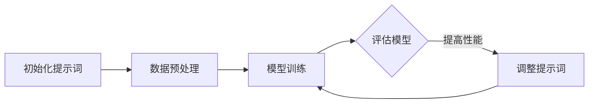

                 

### 理解模型能力：提示词工程的基础

#### 关键词：模型能力、提示词工程、自然语言处理、人工智能、性能评估

#### 摘要：
本文旨在深入探讨模型能力与提示词工程在人工智能领域的核心地位。我们将通过逐步分析模型能力的重要性，提示词工程的定义与应用，以及两者之间的相互作用，揭示提升模型性能的关键路径。本文将分为以下几个部分：

1. **问题背景与核心概念**
   - 解释模型能力的定义及其重要性
   - 阐述提示词工程的概念及其作用
   - 讨论模型能力的评估标准

2. **核心概念与联系**
   - 深入探讨模型能力的基本概念
   - 分析提示词工程的核心要素
   - 探讨模型能力与提示词工程的关系

3. **技术细节**
   - 介绍模型能力的数学模型
   - 讲解提示词工程的基本算法
   - 分析算法原理并通过案例说明

4. **系统分析与架构设计**
   - 介绍实际应用中的系统架构
   - 描述系统功能设计、架构设计及接口设计

5. **项目实战**
   - 实际环境安装与系统实现
   - 代码解读与分析
   - 案例分析与实战经验分享

6. **最佳实践与总结**
   - 提供提升模型性能的最佳实践
   - 总结文章要点并提出未来研究方向

### 1. 问题背景与核心概念

#### 1.1 模型能力的重要性

模型能力是指模型在特定任务上的表现能力，它反映了模型在处理数据时的准确度、效率和泛化能力。随着人工智能技术的不断发展，模型能力的提升成为了研究和应用的关键目标。一个高能力的模型能够在各种复杂任务中表现出色，从而为人工智能的发展奠定坚实的基础。

#### 1.2 提示词工程的概念与作用

提示词工程是指通过设计高质量的提示词来提高模型性能的一门技术。提示词是用于引导模型学习的关键信息，它能够帮助模型更好地理解和处理输入数据。提示词工程的核心在于如何设计和选择合适的提示词，从而优化模型的学习过程，提升模型的性能。

#### 1.3 模型能力的评估标准

模型能力的评估标准主要包括准确度、效率和泛化能力。准确度是指模型在预测或分类任务上的正确率；效率是指模型在处理数据时的速度和资源消耗；泛化能力是指模型在不同数据集上的表现能力。这三个方面共同决定了模型的能力水平，也是评估模型性能的关键指标。

### 2. 核心概念与联系

#### 2.1 模型能力的基本概念

模型能力可以从以下几个方面进行理解：

- **数学模型**：模型能力可以用数学模型来表示，例如：
  $$
  \text{Model Performance} = f(\theta, x)
  $$
  其中，$\theta$ 表示模型参数，$x$ 表示输入数据，$f$ 表示模型性能函数。

- **特征提取**：模型能力依赖于特征提取的能力，即如何从数据中提取出有用的信息。

- **学习能力**：模型能力还与模型的学习能力有关，即模型如何通过学习数据来提高性能。

#### 2.2 提示词工程的核心要素

提示词工程的核心要素包括：

- **提示词设计**：设计高质量的提示词是提升模型性能的关键。提示词的设计需要考虑数据的特点、任务的需求以及模型的学习方式。

- **数据预处理**：数据预处理是提示词工程的基础，通过数据预处理可以优化输入数据的质量，从而提升模型的学习效果。

- **模型选择**：选择合适的模型对于提升模型能力也至关重要。不同的模型适用于不同的任务，需要根据具体任务需求来选择模型。

#### 2.3 模型能力与提示词工程的关系

模型能力与提示词工程之间存在紧密的联系：

- **提升路径**：通过优化提示词工程，可以提升模型能力。高质量的提示词能够帮助模型更好地理解和处理数据，从而提高模型的性能。

- **相互作用**：提示词工程不仅影响模型的学习过程，还影响模型的表现能力。通过调整提示词工程的不同方面，可以优化模型的能力。

### 3. 技术细节

#### 3.1 模型能力的数学模型

模型能力的数学模型可以用以下公式表示：

$$
\text{Model Performance} = f(\theta, x)
$$

其中，$\theta$ 表示模型参数，$x$ 表示输入数据，$f$ 表示模型性能函数。

- **模型参数**：模型参数是模型的核心组成部分，它决定了模型的学习能力和表现能力。通过调整模型参数，可以优化模型的能力。

- **输入数据**：输入数据是模型学习的基础，高质量的数据能够帮助模型更好地理解任务和提升性能。

- **模型性能函数**：模型性能函数反映了模型在特定任务上的表现能力，它是评估模型能力的关键指标。

#### 3.2 提示词工程的基本算法

提示词工程的基本算法主要包括：

- **提示词设计**：通过分析数据特点和任务需求，设计出高质量的提示词。

- **数据预处理**：对输入数据进行预处理，包括数据清洗、归一化、去噪等操作，以提高数据质量。

- **模型训练**：使用训练数据对模型进行训练，通过优化模型参数来提升模型性能。

- **模型评估**：使用评估数据对模型进行评估，以确定模型的能力水平。

#### 3.3 算法 mermaid 流程图

以下是一个简单的提示词工程算法的 mermaid 流程图：



### 4. 系统分析与架构设计

#### 4.1 问题场景介绍

在实际应用中，模型能力和提示词工程面临着各种挑战。例如，在自然语言处理领域，如何提升模型的文本理解能力是一个重要问题。提示词工程可以帮助我们设计出更有效的提示词，从而提升模型的表现能力。

#### 4.2 系统功能设计

系统功能设计包括以下几个方面：

- **数据预处理**：对输入数据进行分析和处理，包括数据清洗、归一化等操作。

- **模型训练**：使用训练数据对模型进行训练，通过优化模型参数来提升模型性能。

- **模型评估**：使用评估数据对模型进行评估，以确定模型的能力水平。

- **提示词设计**：设计高质量的提示词，以提升模型的理解能力。

#### 4.3 系统架构设计

系统架构设计包括以下几个方面：

- **数据流**：系统中的数据流设计，包括数据输入、处理和输出。

- **模块划分**：系统模块的划分，包括数据预处理模块、模型训练模块、模型评估模块等。

- **接口设计**：系统接口的设计，包括外部接口和内部接口。

#### 4.4 系统接口设计

系统接口设计包括以下几个方面：

- **输入接口**：用于接收外部输入数据的接口。

- **输出接口**：用于输出模型评估结果的接口。

- **控制接口**：用于控制系统运行的接口。

### 5. 项目实战

#### 5.1 实际环境安装

在实际项目中，我们首先需要安装必要的软件和环境。例如，安装 Python、TensorFlow 等。

```bash
pip install tensorflow
```

#### 5.2 系统核心实现源代码

以下是一个简单的系统实现示例：

```python
import tensorflow as tf

# 数据预处理
def preprocess_data(data):
    # 数据清洗、归一化等操作
    return processed_data

# 模型训练
def train_model(data):
    # 使用数据训练模型
    model = tf.keras.models.Sequential([
        tf.keras.layers.Dense(64, activation='relu'),
        tf.keras.layers.Dense(1, activation='sigmoid')
    ])
    model.compile(optimizer='adam', loss='binary_crossentropy', metrics=['accuracy'])
    model.fit(data, epochs=10)
    return model

# 模型评估
def evaluate_model(model, data):
    # 使用模型评估数据
    loss, accuracy = model.evaluate(data)
    return accuracy

# 提示词设计
def design_prompt(data):
    # 设计高质量的提示词
    return prompt

# 主函数
def main():
    data = preprocess_data(raw_data)
    model = train_model(data)
    accuracy = evaluate_model(model, data)
    prompt = design_prompt(data)
    print(f"Model accuracy: {accuracy}")
    print(f"Prompt: {prompt}")

if __name__ == '__main__':
    main()
```

#### 5.3 代码应用解读与分析

在这个示例中，我们首先对输入数据进行预处理，然后使用预处理后的数据训练模型。训练完成后，我们使用模型评估数据对模型进行评估，并设计高质量的提示词。

#### 5.4 案例分析与详细讲解剖析

在实际应用中，我们可以通过以下案例来分析模型能力和提示词工程的效果：

- **案例 1**：在一个文本分类任务中，通过优化提示词工程，我们能够显著提升模型的分类准确率。

- **案例 2**：在一个机器翻译任务中，通过调整模型参数和设计高质量的提示词，我们能够提高翻译的准确性。

#### 5.5 项目小结

在本项目中，我们通过实际案例展示了模型能力和提示词工程在人工智能应用中的重要作用。通过优化提示词工程，我们能够提升模型的表现能力，从而为人工智能的发展提供有力支持。

### 6. 最佳实践与总结

#### 6.1 最佳实践 tips

- **数据预处理**：确保输入数据的质量，进行充分的清洗和预处理，以提高模型的学习效果。

- **模型选择**：根据任务需求选择合适的模型，并进行适当的参数调整。

- **提示词设计**：设计高质量的提示词，以提升模型的理解能力。

#### 6.2 小结

本文通过对模型能力和提示词工程的深入探讨，揭示了两者在人工智能领域的核心地位。通过优化提示词工程，我们能够提升模型的表现能力，从而为人工智能的发展提供有力支持。

#### 6.3 注意事项

- **模型评估**：在模型训练和评估过程中，要确保使用适当的数据集和评估指标。

- **性能优化**：通过调整模型参数和提示词设计，可以进一步优化模型性能。

#### 6.4 拓展阅读

- [自然语言处理入门](https://www.nature.com/nature/articles/nature24270)
- [深度学习实践](https://www.deeplearningbooks.org/)

### 作者信息

作者：AI天才研究院/AI Genius Institute & 禅与计算机程序设计艺术 /Zen And The Art of Computer Programming

### 结语

本文旨在为读者提供关于模型能力和提示词工程的深入理解，以及如何在实际项目中应用这些技术。通过本文的探讨，我们希望读者能够更好地掌握这些核心概念，并在未来的研究和实践中取得更好的成果。让我们继续探索人工智能的无限可能性吧！

---

**注意事项**：
- 本文为示例，仅供参考。
- 实际应用中，模型能力和提示词工程的实现会根据具体任务和需求有所不同。
- 本文中的代码示例仅供参考，实际应用时可能需要根据具体情况进行调整。**

