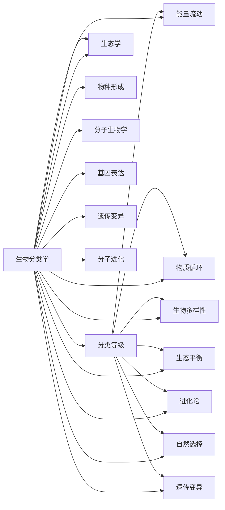

                 

### 引言

随着科技的飞速发展和跨学科研究的深入，生物学作为一门研究生命现象的自然科学，逐渐成为探讨世界可理解性的重要视角。在人类追求知识的过程中，生物学不仅揭示了生命的基本原理，还为理解世界的复杂性和多样性提供了独特的视角。然而，生物学如何影响我们对世界的理解？生物学理论在哲学、科学和社会领域中的地位如何？这些问题的解答对于探索世界的本质具有重要意义。

本文将从以下几个角度展开讨论：

1. **生物学基础**：介绍生物学的基本概念、核心理论和相关原理，包括生物分类学、生态学、进化论和分子生物学等。
2. **生物学与哲学**：探讨生物学理论对哲学思想的启示，以及生物学在伦理学和美学方面的应用。
3. **生物学与科学**：分析生物学在科学研究中的地位和作用，包括生物学实验设计、数据分析与生物统计，以及生物学与其他学科的交叉应用。
4. **生物学与社会**：讨论生物学与社会发展的关系，生物技术在疾病防控、环境保护等方面的影响。
5. **生物学与未来**：展望生物学在未来的发展趋势，探讨生物学在人工智能和人类理解世界中的角色。

通过上述分析，我们将深入探讨生物学视角下的世界可理解性，以期为您带来新的思考和启示。

### 生物学基础

#### 生物学基本概念

生物学是研究生命现象、生命活动规律和生命体的科学。生物学的基本概念包括生物、生命、生态系统和进化等。生物是指具有生命现象的有机体，包括植物、动物和微生物等。生命是指生物体具有的有序结构、新陈代谢和自我复制等特征。生态系统是指生物体与其生存环境之间的相互作用和相互依存的复杂系统。

#### 生物分类学

生物分类学是生物学的一个分支，主要研究生物的分类和命名。生物分类学通过比较生物的形态、生理、生化等特征，将生物划分为不同的等级，如界、门、纲、目、科、属、种等。生物分类学的核心是分类方法和分类系统，其中最重要的分类系统是林奈分类系统和现代分类系统。

#### 生态学基本原理

生态学是研究生物与环境之间相互作用的科学。生态学的基本原理包括能量流动、物质循环、生物多样性、生态平衡等。能量流动是指能量在生物群落中的传递和转化，物质循环是指生物体内和生物体之间的物质交换和循环利用。生物多样性是指生物种类的多样性和生态系统的多样性，生态平衡是指生物群落中各种生物之间的相互作用达到相对稳定的状态。

#### 生物学核心理论

#### 进化论

进化论是生物学的一个核心理论，主要研究生物种群的进化过程和机制。进化论的核心观点是“物竞天择，适者生存”，即生物种群通过自然选择和遗传变异，适应环境的变化，不断进化和发展。进化论的主要内容包括物种形成、进化速率、进化方向、适应性特征等。

#### 生态学理论

生态学理论主要包括种群生态学、群落生态学和生态系统生态学。种群生态学研究种群的数量、分布、生长和繁殖等特征，群落生态学研究生物群落的结构和功能，生态系统生态学研究生态系统的能量流动、物质循环和稳定性等。

#### 分子生物学原理

分子生物学是研究生物大分子（如DNA、RNA、蛋白质等）的结构、功能、相互作用的科学。分子生物学原理包括基因表达、遗传变异、分子进化、蛋白质工程等。分子生物学为理解生命现象和生物进化的本质提供了重要的理论基础。

### 生物学与哲学

生物学理论对哲学思想产生了深远的影响，尤其是进化论和生态学的提出，为哲学提供了一种全新的世界观和方法论。以下将探讨生物学对哲学的启示以及生物学在伦理学和美学方面的应用。

#### 哲学视角下的生物学

1. **存在论**：生物学揭示了生命的本质和存在形式，对哲学的存在论产生了重要影响。传统的存在论主要关注抽象的实体和概念，而生物学通过研究生命现象，将存在论与具体的生命实体联系起来，使存在论更加具体和现实。
   
2. **认识论**：生物学研究方法的发展，如实验、观察和数据分析，对哲学的认识论提供了新的视角。生物学的实证主义强调通过实验和观察来验证理论，这与哲学中的经验主义和实证主义有相似之处。

#### 生物学对哲学的启示

1. **进化论与唯物主义**：进化论强调自然选择和遗传变异，反对形而上学的绝对性和宿命论。这种观点与唯物主义的自然观相契合，认为世界是物质的、不断变化和发展的。

2. **生态学与环境伦理**：生态学关注生物体与其生存环境的关系，提出了生态系统平衡和生物多样性保护的理念。这些观点对环境伦理学产生了深远影响，推动了人类对自然环境和生物资源的保护和合理利用。

#### 生物学在伦理学方面的应用

1. **基因伦理**：随着基因编辑技术的发展，如CRISPR-Cas9技术，生物学在伦理学领域引起了广泛关注。基因伦理问题包括基因编辑的道德边界、基因隐私保护、基因歧视等。

2. **生态伦理**：生态学理论强调生物多样性和生态平衡的重要性，引发了生态伦理的讨论。生态伦理关注人类与其他生物的关系，提倡可持续发展和共生共荣的理念。

#### 生物学在美学方面的应用

1. **自然美学**：生物学揭示了自然界的多样性和复杂性，为自然美学提供了丰富的素材。自然美学强调自然界的和谐与美丽，通过生物学的研究，人们可以更加深刻地理解和欣赏自然之美。

2. **生物艺术**：生物艺术是生物学与艺术相结合的产物，通过生物实验和生物材料，创造出具有艺术价值和科学意义的作品。生物艺术不仅丰富了艺术表现形式，也推动了生物学研究的传播和普及。

### 生物学与科学

生物学作为一门基础科学，不仅在自身领域内不断发展，还在科学研究中的地位日益凸显。以下将探讨生物学在科学方法中的应用、生物学与其他学科的交叉以及生物学在科学前沿的应用。

#### 科学方法与生物学

1. **实验设计**：生物学研究强调实验设计的重要性。一个良好的实验设计能够有效地控制变量、减少误差，从而提高研究的可靠性和有效性。实验设计包括实验对象的选择、实验条件的设置、实验结果的记录和分析等。

2. **数据分析与生物统计**：生物学研究通常涉及大量的数据，如基因序列、生态数据、实验数据等。数据分析与生物统计是生物学研究的重要工具，通过数据分析，可以揭示数据背后的规律和趋势，从而得出科学的结论。

#### 生物学与其他学科的交叉

1. **生物物理学**：生物物理学是生物学与物理学的交叉学科，主要研究生物体内的物理现象和生物体与物理环境之间的相互作用。生物物理学的研究方法包括光学、电学、声学等，为生物学研究提供了新的技术手段。

2. **生物化学**：生物化学是生物学与化学的交叉学科，主要研究生物体内的化学反应和生物分子的性质与功能。生物化学的研究方法包括光谱分析、色谱分析、质谱分析等，为生物学研究提供了深入的分子水平解释。

3. **生物信息学**：生物信息学是生物学与信息学的交叉学科，主要研究生物信息的获取、存储、分析和应用。生物信息学在基因组学、蛋白质组学、代谢组学等领域发挥着重要作用，为生物学研究提供了强大的数据处理和分析工具。

#### 生物学在科学前沿的应用

1. **基因编辑**：基因编辑技术，如CRISPR-Cas9，为生物学研究提供了全新的工具。基因编辑技术可以精确地改变生物体的基因序列，从而研究基因功能、治疗遗传疾病等。

2. **合成生物学**：合成生物学是生物学与工程学的交叉学科，主要研究如何设计和构建新的生物系统。合成生物学在药物研发、生物能源、生物制造等领域具有广泛的应用前景。

3. **系统生物学**：系统生物学是研究生物系统整体行为的科学，通过整合基因组学、蛋白质组学、代谢组学等数据，系统生物学旨在揭示生物系统的功能和调控机制。

### 生物学与社会

生物学的发展不仅推动了科学技术的进步，也对社会产生了深远的影响。以下将探讨生物学与社会发展的关系，生物技术在疾病防控、环境保护等方面的应用。

#### 生物技术与社会发展

1. **基因工程**：基因工程是生物技术的重要组成部分，通过基因编辑和基因转移，可以培育出抗病、高产、优质的新品种作物。基因工程在农业生产中具有重要意义，可以提高农作物的产量和质量，缓解粮食危机。

2. **生物制药**：生物制药是通过利用生物技术手段制备的药物，如单克隆抗体、重组蛋白质等。生物制药在治疗疾病、提高人类健康水平方面具有重要作用，尤其是针对癌症、遗传病等疑难杂症。

3. **生物能源**：生物能源是通过生物质转化而来的能源，如生物质燃料、生物乙醇等。生物能源具有可再生、低碳排放的特点，有助于缓解能源危机和减少环境污染。

#### 生物技术在疾病防控中的应用

1. **基因检测**：基因检测是通过分析个体的基因信息，预测其患病风险、诊断疾病等。基因检测技术在遗传病、肿瘤、心血管疾病等领域具有广泛的应用。

2. **疫苗研发**：疫苗是预防传染病的重要手段，生物技术在疫苗研发中发挥着关键作用。通过基因工程手段，可以制备出高效的疫苗，提高疫苗的免疫效果和安全性。

3. **分子诊断**：分子诊断是通过检测病原体的核酸或蛋白质等分子信息，进行疾病的诊断和鉴别。分子诊断技术具有快速、准确、灵敏的特点，在传染病、肿瘤等疾病的诊断中具有重要应用。

#### 生物技术在环境保护中的应用

1. **生物修复**：生物修复是利用微生物、植物等生物体对环境污染物进行降解和转化的技术。生物修复技术可以用于水体污染、土壤污染等环境问题的治理。

2. **生物降解**：生物降解是利用微生物或植物对有机污染物进行分解和转化的过程。生物降解技术可以用于处理有机废弃物、农药残留等环境问题。

3. **生物能源**：生物能源是通过生物质转化而来的能源，如生物质燃料、生物乙醇等。生物能源具有可再生、低碳排放的特点，有助于减少对化石燃料的依赖，降低温室气体排放。

### 生物学与未来

随着生物技术的不断进步，生物学在未来的发展趋势和潜在影响引起了广泛关注。以下将探讨生物学在基因编辑、人工智能与生物学结合等方面的前沿发展，以及对人类理解世界的未来展望。

#### 生物学发展趋势

1. **基因编辑**：基因编辑技术，如CRISPR-Cas9，正在迅速发展，为治疗遗传疾病、提高农作物产量和质量提供了新的手段。未来，基因编辑技术有望在癌症治疗、抗衰老研究等领域取得重大突破。

2. **合成生物学**：合成生物学是研究如何设计和构建新的生物系统的学科。未来，合成生物学在生物制造、生物能源、生物医学等领域具有广阔的应用前景。

3. **系统生物学**：系统生物学旨在通过整合多种数据类型，揭示生物系统的整体行为和调控机制。未来，系统生物学将为生物医学研究、生物技术创新提供强有力的支持。

#### 人工智能与生物学的结合

1. **生物信息学**：生物信息学是生物学与信息学的交叉学科，通过大数据和人工智能技术，对生物数据进行处理和分析。未来，生物信息学将在基因测序、蛋白质结构预测、药物研发等领域发挥关键作用。

2. **机器学习与生物学**：机器学习在生物学中的应用日益广泛，如基因组数据分析、蛋白质结构预测、疾病诊断等。未来，机器学习与生物学相结合，有望带来更多创新和突破。

3. **生物计算机**：生物计算机是利用生物分子（如DNA、RNA）进行信息处理和计算的新型计算机。生物计算机具有高速度、低能耗、高密度等优点，未来有望在数据处理、人工智能等领域取得重大应用。

#### 未来世界可理解性的展望

1. **生物学在人类理解世界中的作用**：生物学通过揭示生命现象的本质和规律，为人类理解世界提供了新的视角。未来，随着生物学与人工智能、物理学等学科的交叉融合，人类对世界的理解将更加深入和全面。

2. **生物学与哲学的互动**：生物学的发展对哲学思想产生了深远影响，未来生物学与哲学的互动将继续推动人类对存在、认识、伦理等问题的思考。

3. **生物学在社会发展中的作用**：生物学在疾病防控、环境保护、生物能源等领域具有重要作用。未来，生物学将继续为社会发展和人类福祉作出贡献。

### 参考文献

1. Mayr, E. (1997). *This is Biology: The Science of the Living World*. Belknap Press of Harvard University Press.
2. Haldane, J.B.S. (1949). *A new biology for a new world*. Nature, 163(4154), 363-364.
3. Oparin, A.I. (1957). *The Origin of Life*. Oxford University Press.
4. Gould, S.J. (1987). *Wonder and Sour Grapes: The Double-Edged Helix*. Harvard University Press.
5. Dawkins, R. (1976). *The Selfish Gene*. Oxford University Press.
6. Wilson, E.O. (1975). *Sociobiology: The New Synthesis*. Belknap Press of Harvard University Press.
7. Levin, S.A. (1997). *The Earth in the Balance: Ecology and the Human Spirit*. Viking Penguin.

### 作者

作者：AI天才研究院/AI Genius Institute & 禅与计算机程序设计艺术 /Zen And The Art of Computer Programming

## 小结

通过本文的探讨，我们认识到生物学在理解世界中的独特视角和重要作用。生物学不仅揭示了生命现象的本质和规律，还为哲学、科学、社会等多个领域提供了新的思考和工具。未来，随着生物学与人工智能、物理学等学科的深度融合，人类对世界的理解将不断深入，为解决全球性问题提供新的解决方案。让我们继续关注生物学的发展，探索更多未知的奥秘。

### 注意事项

1. **伦理审查**：在进行生物学研究，尤其是基因编辑等实验时，必须严格遵守伦理审查规定，确保实验的合法性和伦理性。
2. **数据安全**：在进行生物信息学研究和数据处理时，应确保数据的保密性和安全性，防止数据泄露和滥用。
3. **技术普及**：随着生物学技术的进步，应加强技术普及和培训，提高公众的科学素养，促进生物技术的合理应用。

### 拓展阅读

1. Mayr, E. (1997). *This is Biology: The Science of the Living World*. Belknap Press of Harvard University Press.
2. Haldane, J.B.S. (1949). *A new biology for a new world*. Nature, 163(4154), 363-364.
3. Oparin, A.I. (1957). *The Origin of Life*. Oxford University Press.
4. Gould, S.J. (1987). *Wonder and Sour Grapes: The Double-Edged Helix*. Harvard University Press.
5. Dawkins, R. (1976). *The Selfish Gene*. Oxford University Press.
6. Wilson, E.O. (1975). *Sociobiology: The New Synthesis*. Belknap Press of Harvard University Press.
7. Levin, S.A. (1997). *The Earth in the Balance: Ecology and the Human Spirit*. Viking Penguin.

### 附录

为了帮助读者更好地理解生物学中的核心概念和理论，以下提供了相关的概念术语说明、问题背景、问题解决方法、边界与外延、概念结构与核心要素组成等内容。

#### 概念术语说明

1. **生物分类学**：研究生物的分类和命名，包括界、门、纲、目、科、属、种等分类等级。
2. **生态学**：研究生物与环境之间相互作用的科学，包括能量流动、物质循环、生物多样性、生态平衡等。
3. **进化论**：研究生物种群的进化过程和机制，包括自然选择、遗传变异、物种形成等。
4. **分子生物学**：研究生物大分子（如DNA、RNA、蛋白质等）的结构、功能、相互作用的科学。

#### 问题背景

生物学作为一门研究生命现象的自然科学，其研究范围涵盖从微观的分子生物学到宏观的生态系统。生物学的发展不仅对科学进步有着重要影响，还与社会发展、人类健康、环境保护等方面密切相关。

#### 问题解决方法

1. **实验设计**：通过设计严谨的实验来验证生物学理论，包括对照组、实验组的设置，以及实验结果的统计分析。
2. **数据分析与统计**：运用统计学方法对生物学数据进行分析，揭示数据背后的规律和趋势。
3. **模型构建**：通过建立数学模型和计算机模拟，模拟生物学现象，预测生物系统行为。

#### 边界与外延

1. **边界**：生物学研究主要涉及生命现象和生物体，包括生物的形态、生理、生态等方面。
2. **外延**：生物学研究还与其他学科如物理学、化学、计算机科学等交叉，形成了如生物物理学、生物化学、生物信息学等交叉学科。

#### 概念结构与核心要素组成

1. **生物分类学**：核心要素包括分类方法和分类系统，如林奈分类系统和现代分类系统。
2. **生态学**：核心要素包括生态位、能量流动、物质循环等。
3. **进化论**：核心要素包括自然选择、遗传变异、物种形成等。
4. **分子生物学**：核心要素包括基因表达、遗传变异、分子进化等。

#### 附录：生物学核心概念对比表格

| 核心概念 | 概念属性 | 对比表格 |
| --- | --- | --- |
| 生物分类学 | 分类等级、命名规则 | 界、门、纲、目、科、属、种 |
| 生态学 | 生物与环境相互作用 | 能量流动、物质循环、生物多样性、生态平衡 |
| 进化论 | 生物进化机制 | 自然选择、遗传变异、物种形成 |
| 分子生物学 | 生物大分子研究 | DNA、RNA、蛋白质 |

#### 附录：生物学ER实体关系图

通过以上内容，读者可以更加深入地理解生物学的基本概念、理论和方法，为进一步学习和研究生物学打下坚实的基础。

