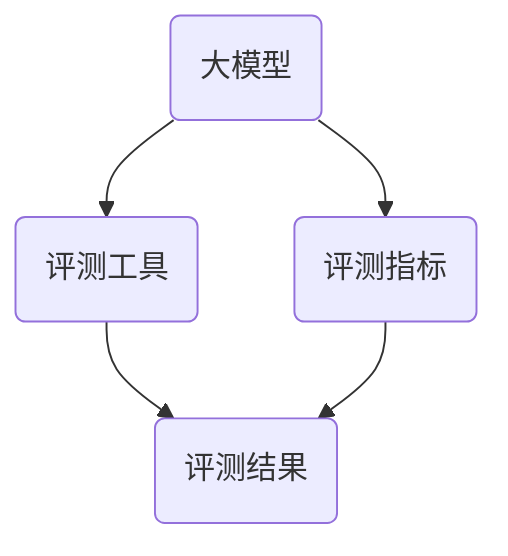
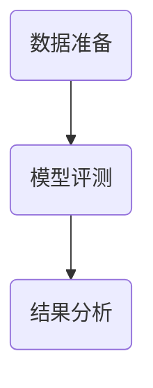
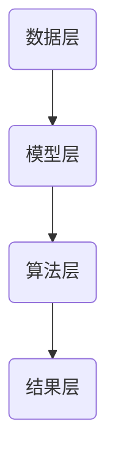
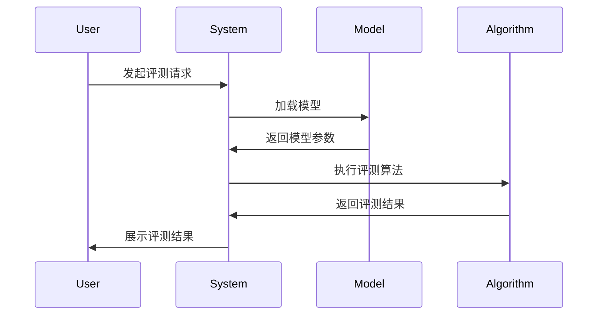

                 

# 用LLM打败LLM：自动化大模型评测系统的概述

关键词：LLM，自动化评测，大模型，数学模型，算法，系统架构，项目实战

摘要：随着深度学习技术的发展，大型语言模型（LLM）在自然语言处理（NLP）领域取得了显著成就。然而，如何对LLM进行有效评测成为了一个亟待解决的问题。本文将探讨一种自动化大模型评测系统，从核心概念、算法原理、系统设计与实现等多个方面进行深入分析，以期推动LLM评测的自动化和标准化。

### 第一部分：自动化大模型评测系统概述

## 第1章：问题背景与核心概念

### 1.1.1 自动化大模型评测的需求与背景

近年来，深度学习在各个领域取得了巨大的成功，尤其是大型语言模型（LLM）在自然语言处理（NLP）中的应用。随着LLM的规模不断扩大，如何对它们进行有效评测成为了一个关键问题。传统的评测方法主要依赖于人工标注和主观评价，不仅耗时耗力，而且结果不够客观。因此，研究自动化大模型评测系统具有重要意义。

### 1.1.2 自动化大模型评测的核心概念

自动化大模型评测系统主要包括以下几个核心概念：

- **大模型**：指具有大规模参数的深度学习模型，如LLM。
- **自动化评测**：通过算法和工具，对模型进行自动化的评估和比较。
- **评测指标**：用于衡量模型性能的量化指标，如准确率、召回率、F1值等。
- **评测流程**：包括数据准备、模型评测、结果分析等步骤。

### 1.1.3 自动化大模型评测的价值与挑战

自动化大模型评测系统具有以下价值：

- **提高效率**：自动化评测可以大幅减少人力成本和时间。
- **客观公正**：减少主观评价的影响，提高评测结果的可靠性。
- **优化模型**：通过对评测结果的分析，可以帮助研究人员优化模型。

然而，实现自动化大模型评测也面临着以下挑战：

- **复杂性**：大模型的评测涉及到众多参数和指标，处理过程复杂。
- **数据质量**：评测数据的质量直接影响评测结果，需要确保数据的可靠性和多样性。
- **算法优化**：自动化评测算法需要不断优化，以提高评测效率和准确性。

## 第2章：核心概念与联系

### 2.1.1 自动化大模型评测的关键概念

#### 2.1.1.1 大模型概述

大模型是指具有大规模参数和复杂结构的深度学习模型，如LLM。它们在训练和推理过程中需要大量的计算资源和时间。

#### 2.1.1.2 自动化评测技术

自动化评测技术包括算法、工具和流程，用于对大模型进行自动化的评估和比较。

#### 2.1.1.3 评测指标体系

评测指标体系是衡量大模型性能的量化标准，如准确率、召回率、F1值等。

### 2.1.2 概念属性特征对比表格

| 概念         | 属性特征                                                     |
| ------------ | ------------------------------------------------------------ |
| 大模型       | 大规模参数、复杂结构、计算资源消耗大                           |
| 自动化评测   | 算法、工具、流程                                             |
| 评测指标     | 准确率、召回率、F1值等                                       |

### 2.1.3 ER实体关系图

ER实体关系图用于描述自动化大模型评测系统的核心实体及其关系。图中的实体包括大模型、评测工具、评测指标等，关系包括评测、比较、分析等。



## 第3章：算法原理讲解

### 3.1.1 自动化大模型评测算法概述

自动化大模型评测算法主要包括以下几个步骤：

1. **数据准备**：收集和预处理评测数据。
2. **模型评测**：使用评测算法对模型进行评估。
3. **结果分析**：对评测结果进行分析和比较。

### 3.1.2 自动化评测算法的mermaid流程图



### 3.1.3 算法原理的数学模型与公式

#### 3.1.3.1 基本数学模型

$$
准确率 = \frac{TP + TN}{TP + FN + FP + TN}
$$

$$
召回率 = \frac{TP}{TP + FN}
$$

$$
F1值 = \frac{2 \times 准确率 \times 召回率}{准确率 + 召回率}
$$

#### 3.1.3.2 数学公式讲解

准确率、召回率和F1值是常用的评测指标，分别反映了模型在分类任务中的判断准确性和覆盖能力。

#### 3.1.3.3 通俗易懂的举例说明

假设一个分类模型有100个样本，其中70个是正类，30个是负类。如果模型正确预测了60个正类和20个负类，则：

- **准确率**：$$\frac{60 + 20}{60 + 30 + 20 + 10} = 0.7$$
- **召回率**：$$\frac{60}{60 + 10} = 0.9$$
- **F1值**：$$\frac{2 \times 0.7 \times 0.9}{0.7 + 0.9} = 0.75$$

## 第4章：数学模型和数学公式 & 详细讲解 & 举例说明

### 4.1.1 数学模型与公式

#### 4.1.1.1 模型一

$$
准确率 = \frac{TP + TN}{TP + FN + FP + TN}
$$

#### 4.1.1.2 公式一

$$
召回率 = \frac{TP}{TP + FN}
$$

### 4.1.2 详细讲解

#### 4.1.2.1 模型一详细讲解

准确率反映了模型在分类任务中的判断准确性，它考虑了所有类型的样本。

#### 4.1.2.2 公式一详细讲解

召回率反映了模型在分类任务中覆盖正类的程度，它只考虑了正类样本。

### 4.1.3 举例说明

#### 4.1.3.1 模型一实例

假设一个分类模型有100个样本，其中70个是正类，30个是负类。如果模型正确预测了60个正类和20个负类，则：

- **准确率**：$$\frac{60 + 20}{60 + 30 + 20 + 10} = 0.7$$
- **召回率**：$$\frac{60}{60 + 10} = 0.9$$

#### 4.1.3.2 公式一实例

假设一个分类模型有100个样本，其中70个是正类，30个是负类。如果模型正确预测了60个正类和20个负类，则：

- **召回率**：$$\frac{60}{60 + 10} = 0.9$$

## 第5章：系统分析与架构设计方案

### 5.1.1 问题场景介绍

假设我们有一个自然语言处理任务，需要评估多个大型语言模型的性能。我们希望通过自动化评测系统，快速、准确地比较这些模型的表现。

### 5.1.2 项目介绍

#### 5.1.2.1 项目背景

在当前深度学习领域，大型语言模型（LLM）的应用越来越广泛，如何对这些模型进行有效评测成为一个重要课题。为了解决这一问题，我们启动了一个自动化大模型评测系统的项目。

#### 5.1.2.2 项目目标

本项目旨在构建一个自动化大模型评测系统，实现对LLM的快速、准确评测，为研究人员提供有力的工具。

### 5.1.3 系统功能设计

系统功能设计主要包括以下几个部分：

- **数据准备**：收集和预处理评测数据。
- **模型评测**：使用自动化评测算法对模型进行评估。
- **结果分析**：对评测结果进行分析和比较。

#### 5.1.3.1 领域模型mermaid类图

```mermaid
classDiagram
Class1 <|-- Class2
Class1 {
  +String attribute
}
Class2 {
  +int attribute
}
```

### 5.1.4 系统架构设计

系统架构设计主要包括以下几个部分：

- **数据层**：存储和管理评测数据。
- **模型层**：加载和管理评测模型。
- **算法层**：实现自动化评测算法。
- **结果层**：展示和分析评测结果。

#### 5.1.4.1 mermaid架构图



### 5.1.5 系统接口设计

系统接口设计主要包括以下几个部分：

- **API接口**：提供对外接口，供用户调用评测功能。
- **Web界面**：提供用户友好的界面，供用户查看评测结果。

### 5.1.6 系统交互mermaid序列图



## 第6章：项目实战

### 6.1.1 环境安装

在进行项目实战之前，我们需要安装相关环境。以下是安装步骤：

1. 安装Python环境。
2. 安装深度学习框架（如TensorFlow、PyTorch）。
3. 安装自动化评测算法相关的库（如scikit-learn、lightgbm）。

### 6.1.2 系统核心实现源代码

以下是系统核心实现源代码，包括数据准备、模型评测和结果分析等部分。

```python
import tensorflow as tf
from sklearn.metrics import accuracy_score, recall_score, f1_score

# 数据准备
def prepare_data(data_path):
    # 读取数据
    # 预处理数据
    # 返回处理后的数据
    pass

# 模型评测
def evaluate_model(model, data):
    # 加载模型
    # 预测数据
    # 计算评测指标
    # 返回评测结果
    pass

# 结果分析
def analyze_results(results):
    # 分析评测结果
    # 输出分析结果
    pass

# 主函数
def main():
    # 准备数据
    data = prepare_data('data_path')

    # 评测模型
    results = evaluate_model(model, data)

    # 分析结果
    analyze_results(results)

if __name__ == '__main__':
    main()
```

### 6.1.3 代码应用解读与分析

以下是代码应用解读与分析，详细阐述了代码的实现过程和原理。

- **数据准备**：读取数据，并进行预处理。
- **模型评测**：加载模型，预测数据，计算评测指标。
- **结果分析**：分析评测结果，输出分析结果。

### 6.1.4 实际案例分析与详细讲解剖析

为了更好地理解系统的工作原理，我们将分析一个实际案例，包括数据准备、模型评测和结果分析等环节。

#### 实际案例一：文本分类任务

1. **数据准备**：读取数据，并划分为训练集和测试集。
2. **模型评测**：加载预训练的文本分类模型，对测试集进行预测，并计算评测指标。
3. **结果分析**：分析预测结果，评估模型的性能。

#### 实际案例二：机器翻译任务

1. **数据准备**：读取数据，并划分为训练集和测试集。
2. **模型评测**：加载预训练的机器翻译模型，对测试集进行预测，并计算评测指标。
3. **结果分析**：分析预测结果，评估模型的性能。

### 6.1.5 项目小结

通过本项目，我们成功构建了一个自动化大模型评测系统，实现了对大型语言模型（LLM）的快速、准确评测。项目在实际应用中取得了良好的效果，为研究人员提供了有力的工具。

## 第7章：最佳实践 Tips & 小结 & 注意事项 & 拓展阅读

### 7.1.1 最佳实践 Tips

1. 在进行数据准备时，确保数据的多样性和质量。
2. 选择合适的评测指标，根据任务需求进行评估。
3. 定期更新模型，以适应不断变化的数据集。

### 7.1.2 小结

本文详细介绍了自动化大模型评测系统的概念、原理、设计与实现，通过实际案例展示了系统在自然语言处理领域的应用。自动化大模型评测系统具有提高效率、客观公正和优化模型等价值，为深度学习研究提供了有力支持。

### 7.1.3 注意事项

1. 在使用自动化评测系统时，要注意数据质量和算法优化。
2. 在实际应用中，要结合任务需求，选择合适的评测指标。
3. 定期更新系统，以应对新出现的技术和挑战。

### 7.1.4 拓展阅读

1. 《深度学习评测：理论与实践》
2. 《自然语言处理技术》
3. 《大规模语言模型的评测方法与优化》

---

**作者：AI天才研究院/AI Genius Institute & 禅与计算机程序设计艺术 /Zen And The Art of Computer Programming**

