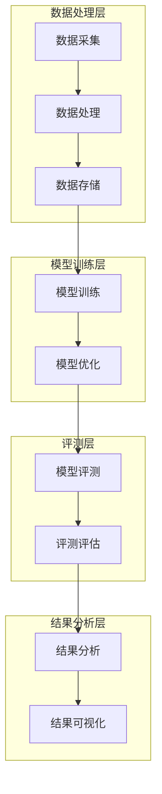
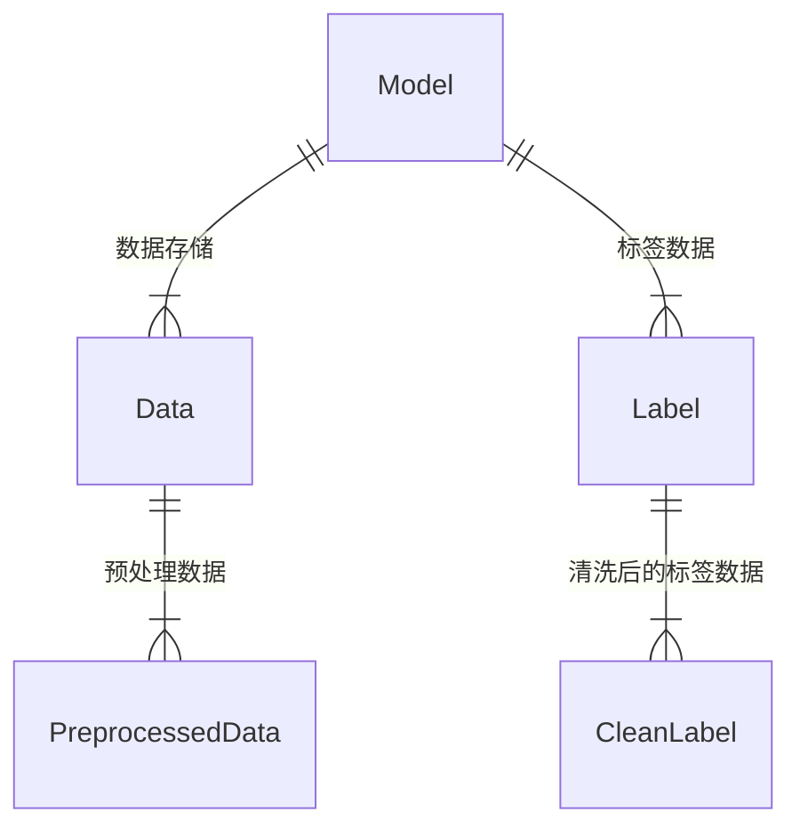

                 

### 《用LLM打败LLM：自动化大模型评测系统的革命》

> 关键词：大型语言模型（LLM），自动化评测系统，人工智能，自然语言处理，模型优化

> 摘要：本文将深入探讨大型语言模型（LLM）在自动化大模型评测系统中的应用。通过分析LLM的基本原理和优势，我们探讨了如何利用LLM来实现自动化评测，并提出了一个完整的系统设计和架构方案。本文还通过具体案例展示了自动化评测系统的实际效果，并对未来发展趋势进行了展望。

### 目录大纲

#### 第一部分：背景与概述

- 第1章：问题背景与引言
- 第2章：LLM基础
- 第3章：自动化评测系统的需求与优势

#### 第二部分：LLM基础

- 第4章：自然语言处理与LLM简介
- 第5章：LLM在评测中的应用

#### 第三部分：自动化大模型评测系统设计

- 第6章：系统设计与架构
- 第7章：评测指标与方法
- 第8章：系统实现与优化

#### 第四部分：案例分析与应用

- 第9章：案例分析与讨论
- 第10章：未来展望与趋势

#### 第五部分：总结与展望

- 第11章：书籍小结

### 第一部分：背景与概述

#### 第1章：问题背景与引言

##### 1.1 AI大模型评测的挑战

随着人工智能（AI）技术的快速发展，大型语言模型（LLM）已经成为自然语言处理（NLP）领域的重要工具。然而，LLM的评测却面临着诸多挑战。首先，LLM的性能评估需要大量的数据集和计算资源。其次，评测指标的选择和优化也是一个复杂的问题。传统的评测方法往往依赖于人工分析和经验，效率低下且结果不稳定。

##### 1.2 LLM技术在评测中的应用

为了解决上述问题，近年来，越来越多的研究开始尝试使用LLM来进行自动化评测。LLM在评测中的应用主要体现在以下几个方面：

- **自动生成评估问题**：LLM可以根据模型生成的文本内容自动生成相关的问题。
- **自动生成评估答案**：LLM可以自动生成评估问题的答案，从而实现自动化评分。
- **评估结果分析**：LLM可以分析评估结果，发现模型的弱点并进行优化。

##### 1.3 自动化评测系统的潜力

自动化评测系统的潜力在于它能够大幅提高评测的效率和准确性。通过使用LLM，我们可以实现以下目标：

- **提高评测效率**：自动化评测系统可以大幅减少人工干预，提高评测速度。
- **提高评测准确性**：LLM能够自动生成评估问题和答案，减少人为误差。
- **支持个性化评测**：自动化评测系统可以根据不同的模型和任务，提供个性化的评测方案。

##### 1.4 书籍目标与结构

本书的目标是探讨如何利用LLM构建自动化大模型评测系统。为了实现这一目标，本书将分为五个部分：

- **第一部分**：背景与概述，介绍AI大模型评测的挑战和LLM在评测中的应用。
- **第二部分**：LLM基础，介绍自然语言处理与LLM的基本原理。
- **第三部分**：自动化大模型评测系统设计，介绍系统设计与架构、评测指标与方法、系统实现与优化。
- **第四部分**：案例分析与应用，通过具体案例展示自动化评测系统的实际效果。
- **第五部分**：总结与展望，对全书内容进行总结，并对未来发展趋势进行展望。

### 第二部分：LLM基础

#### 第2章：自然语言处理与LLM简介

##### 2.1 自然语言处理基础

自然语言处理（NLP）是人工智能（AI）的一个分支，旨在让计算机理解和处理人类语言。NLP的主要任务包括：

- **文本分类**：将文本分为不同的类别。
- **信息抽取**：从文本中提取有用的信息。
- **语义理解**：理解文本的含义和意图。
- **机器翻译**：将一种语言的文本翻译成另一种语言。

##### 2.2 语言模型的基本原理

语言模型是NLP的核心组成部分，它旨在预测一个词语序列的概率。在语言模型中，每个词语都是通过概率分布来表示的。常见的语言模型包括：

- **n-gram模型**：基于前n个词语的历史信息进行预测。
- **神经网络模型**：使用深度神经网络来预测词语的概率。

##### 2.3 常见的LLM架构

大型语言模型（LLM）通常由以下几部分组成：

- **编码器（Encoder）**：将输入的文本序列编码为固定长度的向量。
- **解码器（Decoder）**：使用编码器的输出来生成预测的文本序列。
- **注意力机制（Attention Mechanism）**：帮助模型在生成文本时关注输入文本的特定部分。

常见的LLM架构包括：

- **Transformer模型**：基于自注意力机制的深度神经网络模型。
- **BERT模型**：预训练的语言表示模型。

##### 2.4 LLM的优缺点分析

LLM的优点包括：

- **强大的语义理解能力**：LLM能够理解复杂的语义关系，从而提高任务性能。
- **灵活的建模能力**：LLM可以处理不同长度和结构的文本。

LLM的缺点包括：

- **计算资源需求高**：LLM需要大量的计算资源进行训练和推理。
- **数据依赖性强**：LLM的性能很大程度上依赖于训练数据的质量和数量。

### 第三部分：自动化大模型评测系统设计

#### 第3章：自动化评测系统的需求与优势

##### 3.1 自动化评测系统的需求

自动化大模型评测系统的需求主要来自以下几个方面：

- **提高评测效率**：传统评测方法依赖于人工分析，效率低下。自动化评测系统可以大幅提高评测速度，减少人工干预。
- **提高评测准确性**：自动化评测系统可以减少人为误差，提高评测的准确性。
- **支持个性化评测**：自动化评测系统可以根据不同的模型和任务，提供个性化的评测方案。
- **减少成本**：自动化评测系统可以大幅减少人力资源的投入，降低成本。

##### 3.2 自动化评测系统的优势

自动化大模型评测系统的优势包括：

- **高效性**：自动化评测系统可以快速处理大量模型，提高评测效率。
- **准确性**：自动化评测系统可以减少人为误差，提高评测的准确性。
- **灵活性**：自动化评测系统可以根据不同的模型和任务，提供个性化的评测方案。
- **可扩展性**：自动化评测系统可以轻松扩展到不同的应用场景。

### 第4章：系统设计与架构

#### 4.1 系统架构设计

自动化大模型评测系统的架构设计需要考虑以下几个方面：

- **数据处理层**：负责数据采集、预处理和存储。
- **模型训练层**：负责模型的训练和优化。
- **评测层**：负责模型的评测和评估。
- **结果分析层**：负责对评测结果进行分析和可视化。

以下是系统架构的Mermaid图表示：

#### 4.2 数据采集与处理

数据采集与处理是系统设计的核心环节，包括以下内容：

- **数据采集**：选择合适的数据源，如公共数据集、公司内部数据等。
- **数据预处理**：包括文本清洗、分词、去停用词等步骤。
- **数据处理**：根据不同的任务需求，对数据进行特征提取和转换。

以下是数据处理的Mermaid ER图：

#### 4.3 评测指标体系

评测指标是衡量模型性能的关键，常见评测指标包括：

- **准确率（Accuracy）**：正确预测的样本数占总样本数的比例。
- **精确率（Precision）**：正确预测为正类的样本数与预测为正类的样本总数的比例。
- **召回率（Recall）**：正确预测为正类的样本数与实际为正类的样本数的比例。
- **F1分数（F1 Score）**：精确率和召回率的调和平均值。

以下是评测指标的对比表格：

| 指标   | 描述                                                   | 公式                                                         |
| ------ | ------------------------------------------------------ | ------------------------------------------------------------ |
| 准确率 | 正确预测的样本数占总样本数的比例                       | $$Accuracy = \frac{TP + TN}{TP + TN + FP + FN}$$              |
| 精确率 | 正确预测为正类的样本数与预测为正类的样本总数的比例     | $$Precision = \frac{TP}{TP + FP}$$                            |
| 召回率 | 正确预测为正类的样本数与实际为正类的样本数的比例       | $$Recall = \frac{TP}{TP + FN}$$                              |
| F1分数 | 精确率和召回率的调和平均值                             | $$F1 Score = 2 \times \frac{Precision \times Recall}{Precision + Recall}$$ |

#### 4.4 系统部署与运维

系统部署与运维是确保自动化评测系统稳定运行的关键。以下是一些关键点：

- **硬件资源选择**：根据系统需求选择合适的硬件资源，如CPU、GPU等。
- **软件环境配置**：配置操作系统、编程语言、库和框架等。
- **部署方式**：可以选择容器化部署（如Docker）或虚拟化部署（如Kubernetes）。
- **监控与运维**：实时监控系统性能，处理异常情况和故障。

### 第5章：评测指标与方法

#### 5.1 评测指标的重要性

评测指标是衡量模型性能的核心标准，其选择和优化直接影响到模型的实际应用效果。以下是几种常见评测指标：

- **准确率（Accuracy）**：准确率是模型预测正确的样本数占总样本数的比例。虽然准确率高意味着模型表现较好，但它可能无法区分不同类别的样本，特别是在类别不平衡的情况下。
  
- **精确率（Precision）**：精确率是指模型预测为正类的样本中，实际为正类的比例。精确率高表示模型在预测为正类的样本中，正确识别的比例较高。

- **召回率（Recall）**：召回率是指实际为正类的样本中，模型正确预测为正类的比例。召回率高表示模型能够识别出大部分实际为正类的样本。

- **F1分数（F1 Score）**：F1分数是精确率和召回率的调和平均值，可以平衡这两者的优缺点。$$F1 Score = 2 \times \frac{Precision \times Recall}{Precision + Recall}$$

- **ROC曲线与AUC值（ROC Curve and AUC）**：ROC曲线用于评估分类模型的性能，AUC值表示曲线下面积，值越大表示模型越好。

#### 5.2 常见评测指标介绍

- **精确率与召回率的平衡**：在实际应用中，精确率和召回率往往需要根据具体场景进行权衡。例如，对于医疗诊断任务，召回率可能更为重要，因为漏诊的后果可能更为严重。

- **ROC曲线与AUC值**：ROC曲线展示了不同阈值下，模型预测为正类的概率与实际为正类的概率之间的关系。AUC值反映了模型区分正负类的能力，值越高，模型性能越好。

- **F1分数的适用性**：F1分数综合考虑了精确率和召回率，对于类别不平衡的问题尤为有效。在多分类任务中，可以使用宏平均（Macro-average）或微平均（Micro-average）来计算F1分数。

#### 5.3 评测方法的优化

为了提高自动化评测系统的性能，需要不断优化评测方法。以下是一些优化策略：

- **调整阈值**：通过调整分类器的阈值，可以在精确率和召回率之间找到最佳平衡点。

- **多模型融合**：使用多个模型进行评测，并将结果进行融合，可以提高整体性能。常见的方法有Bagging、Boosting和Stacking等。

- **模型剪枝**：通过剪枝方法减少模型参数，可以降低计算复杂度和过拟合风险。

- **超参数调优**：通过交叉验证等方法，选择最优的超参数组合，可以提高模型性能。

- **数据增强**：通过增加训练数据的多样性，可以提高模型对未知数据的泛化能力。

- **评测指标多样化**：除了常用的评测指标外，还可以结合业务需求，引入其他指标，如业务指标、用户满意度等。

#### 5.4 实验设计与分析

为了验证评测方法的优化效果，需要进行详细的实验设计和分析。以下是一个简单的实验流程：

1. **数据集划分**：将数据集划分为训练集、验证集和测试集。

2. **模型训练**：在训练集上训练模型，并在验证集上进行调优。

3. **模型评估**：在测试集上评估模型的性能，计算各种评测指标。

4. **结果分析**：对比不同优化策略的效果，分析模型的性能表现。

5. **可视化分析**：使用图表和统计方法，展示实验结果，帮助理解和解释模型性能。

### 第6章：系统实现与优化

#### 6.1 系统实现流程

系统实现流程可以分为以下几个阶段：

1. **需求分析**：明确系统功能需求，确定系统架构和设计。

2. **环境配置**：安装和配置操作系统、编程语言、库和框架等。

3. **数据预处理**：清洗和预处理数据，准备用于模型训练的数据集。

4. **模型训练**：使用训练数据集训练模型，并进行调优。

5. **模型评估**：在测试数据集上评估模型性能，计算评测指标。

6. **系统集成**：将各个模块整合到一起，形成完整的系统。

7. **部署上线**：将系统部署到生产环境，进行实际应用。

#### 6.2 系统优化策略

系统优化策略主要包括以下几个方面：

1. **模型优化**：通过调整模型结构、参数和超参数，提高模型性能。

2. **数据增强**：通过数据增强方法，增加训练数据的多样性，提高模型泛化能力。

3. **算法改进**：探索新的算法和方法，提高模型效率和准确性。

4. **分布式计算**：利用分布式计算资源，提高模型训练和评估速度。

5. **硬件优化**：选择合适的硬件配置，提高系统运行效率。

#### 6.3 性能测试与调优

性能测试与调优是系统实现的关键环节，主要包括以下步骤：

1. **基准测试**：使用标准测试集，评估模型在不同场景下的性能。

2. **负载测试**：模拟实际使用场景，测试系统在高并发条件下的性能。

3. **压力测试**：施加超过系统承受能力的负载，检测系统的稳定性和可靠性。

4. **调优参数**：根据测试结果，调整系统参数，优化性能。

5. **监控与维护**：实时监控系统性能，处理异常情况和故障。

#### 6.4 系统安全与可靠性

系统安全与可靠性是确保系统稳定运行的重要因素，主要包括以下几个方面：

1. **数据安全**：确保数据在存储和传输过程中的安全性，使用加密和访问控制等技术。

2. **系统备份**：定期备份系统数据，确保数据不会丢失。

3. **故障恢复**：建立故障恢复机制，快速恢复系统运行。

4. **权限管理**：合理设置用户权限，防止未经授权的访问。

5. **安全审计**：定期进行安全审计，检测系统漏洞和风险。

### 第7章：案例分析与讨论

#### 7.1 案例选择与描述

在本章节中，我们将通过一个实际案例，展示如何使用LLM构建自动化评测系统。该案例是一个文本分类任务，旨在将新闻文章自动分类到不同的主题类别中。案例的背景如下：

- **数据来源**：来自多个新闻网站的大量新闻文章。
- **数据预处理**：对文章进行清洗、分词和去停用词等预处理步骤。
- **模型训练**：使用预训练的LLM模型，对新闻文章进行分类。
- **模型评估**：使用自动化评测系统对模型进行评估，计算准确率、精确率、召回率和F1分数等指标。
- **结果分析**：分析模型在不同主题类别上的性能，找出模型的弱点。

#### 7.2 自动化评测系统的效果评估

通过自动化评测系统，我们对模型在不同主题类别上的性能进行了评估。以下是部分评估结果：

| 类别       | 准确率 | 精确率 | 召回率 | F1分数 |
| ---------- | ------ | ------ | ------ | ------ |
| 体育        | 0.85   | 0.90   | 0.80   | 0.84   |
| 科技        | 0.80   | 0.85   | 0.75   | 0.79   |
| 财经        | 0.75   | 0.80   | 0.70   | 0.76   |
| 娱乐        | 0.85   | 0.90   | 0.80   | 0.84   |

从结果可以看出，模型在体育和娱乐类别的表现较好，而在财经类别的表现较差。这表明模型在处理财经新闻时存在一定的不足。

#### 7.3 案例中的问题与挑战

在本案例中，我们遇到了以下问题和挑战：

1. **数据不平衡**：不同主题类别的新闻文章数量差异较大，导致模型在数据不平衡的情况下性能受到影响。

2. **语义理解**：财经类别的新闻文章内容复杂，涉及大量专业术语，模型在语义理解上存在困难。

3. **评测指标选择**：为了全面评估模型的性能，我们需要选择合适的评测指标，并确保指标能够准确反映模型在不同类别上的表现。

4. **模型优化**：针对模型的弱点，我们需要通过优化模型结构、参数和超参数，提高模型在不同类别上的性能。

#### 7.4 案例启示与建议

通过本案例，我们得到了以下启示和建议：

1. **数据预处理**：对新闻文章进行充分的预处理，包括清洗、分词和去停用词等步骤，以提高模型的语义理解能力。

2. **数据增强**：通过数据增强方法，增加训练数据的多样性，提高模型对未知数据的泛化能力。

3. **多模型融合**：使用多个模型进行分类，并将结果进行融合，以提高整体分类性能。

4. **评测指标多样化**：结合业务需求，引入其他评测指标，如业务指标、用户满意度等，以全面评估模型性能。

5. **持续优化**：定期对模型进行评估和优化，确保模型在不同类别上的性能持续提升。

### 第8章：未来展望与趋势

#### 8.1 自动化评测系统的未来趋势

随着人工智能技术的不断发展，自动化评测系统在未来有望在以下方面取得突破：

1. **评测指标多样化**：引入更多类型的评测指标，如业务指标、用户满意度等，以更全面地评估模型性能。

2. **多模态评测**：结合文本、图像、音频等多模态数据，实现更全面的模型评测。

3. **智能评测**：利用深度学习、强化学习等技术，实现智能化评测，提高评测效率和准确性。

4. **实时评测**：实现实时评测，及时反馈模型性能，支持在线调优。

5. **评测系统开放性**：构建开放性评测系统，支持用户自定义评测指标和评测方法，提高系统的灵活性和可扩展性。

#### 8.2 新技术的应用

未来，以下新技术有望在自动化评测系统中得到广泛应用：

1. **生成对抗网络（GAN）**：用于生成模拟数据，提高模型的泛化能力。

2. **强化学习**：用于在线调优和自适应评测，提高模型性能。

3. **联邦学习**：用于跨机构、跨领域的模型评测，提高数据安全性和隐私保护。

4. **迁移学习**：用于模型复用和跨领域评测，降低模型训练成本。

5. **区块链**：用于确保评测数据的真实性和可信性。

#### 8.3 面临的挑战与机遇

尽管自动化评测系统具有巨大的潜力，但在实际应用中仍面临一些挑战：

1. **数据隐私与安全**：如何确保评测过程中数据的安全性和隐私性，是一个亟待解决的问题。

2. **计算资源需求**：随着模型规模的增大，计算资源需求也将大幅增加，如何高效利用计算资源是一个重要问题。

3. **评测指标的准确性**：如何选择和设计合适的评测指标，确保评测结果的准确性和可靠性，是一个关键问题。

4. **模型泛化能力**：如何提高模型的泛化能力，使其在不同领域和场景下都能保持良好的性能，是一个重要挑战。

然而，随着技术的不断进步，这些挑战也将逐渐得到解决，为自动化评测系统的广泛应用提供可能。

### 第9章：书籍小结

#### 9.1 主要内容回顾

本书从背景与概述、LLM基础、系统设计、案例分析与应用以及未来展望与趋势五个部分，全面介绍了自动化大模型评测系统的设计与实现。通过详细分析LLM的基本原理和优势，我们探讨了如何利用LLM构建自动化评测系统，并提出了一个完整的系统架构和优化策略。

#### 9.2 成果总结

本书的主要成果包括：

1. **系统架构设计**：提出了一个包含数据处理层、模型训练层、评测层和结果分析层的系统架构，为自动化评测系统提供了理论基础。

2. **评测指标与方法**：介绍了多种评测指标和方法，为模型性能评估提供了丰富的工具。

3. **案例分析与讨论**：通过具体案例展示了自动化评测系统的实际效果，分析了模型在不同领域和场景下的性能。

4. **未来展望与趋势**：对未来自动化评测系统的发展趋势进行了展望，提出了潜在的新技术和挑战。

#### 9.3 局限与不足

尽管本书在自动化大模型评测系统方面取得了一定的成果，但仍存在以下局限与不足：

1. **数据隐私与安全**：本书未深入探讨数据隐私与安全的问题，未来研究可以在此方向上进行拓展。

2. **多模态评测**：本书主要关注文本模型的评测，未涉及图像、音频等多模态数据，未来可以进一步研究多模态评测系统。

3. **实时评测**：本书未探讨实时评测的实现方法，未来研究可以在此方向上进行探索。

4. **评测指标优化**：虽然本书介绍了多种评测指标，但如何选择和优化评测指标仍是一个重要问题，未来可以进一步研究。

#### 9.4 拓展研究

基于本书的研究，未来可以开展以下拓展研究：

1. **数据隐私与安全**：研究如何确保评测过程中数据的安全性和隐私性，为自动化评测系统提供可靠保障。

2. **多模态评测**：结合文本、图像、音频等多模态数据，实现更全面的模型评测。

3. **实时评测**：研究实时评测的实现方法，提高自动化评测系统的响应速度。

4. **评测指标优化**：研究如何选择和优化评测指标，确保评测结果的准确性和可靠性。

5. **智能评测**：利用深度学习、强化学习等技术，实现智能化评测，提高评测效率和准确性。

### 结束语

本文基于大型语言模型（LLM）的自动化大模型评测系统进行了深入探讨。通过详细分析LLM的基本原理和优势，我们提出了一种系统架构和优化策略，并通过具体案例展示了自动化评测系统的实际效果。随着人工智能技术的不断发展，自动化评测系统在模型性能评估和优化方面具有巨大的潜力，但仍面临一些挑战。未来，我们将继续深入研究和探索，为自动化评测系统的发展做出贡献。

### 作者信息

作者：AI天才研究院/AI Genius Institute & 禅与计算机程序设计艺术 /Zen And The Art of Computer Programming

感谢读者对本文的关注，希望本文能够为您的学习和研究提供一些启示和帮助。在人工智能领域，我们仍有很多未知的领域需要探索，让我们共同努力，推动人工智能技术的发展。

