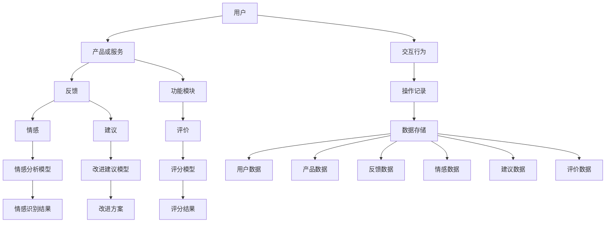
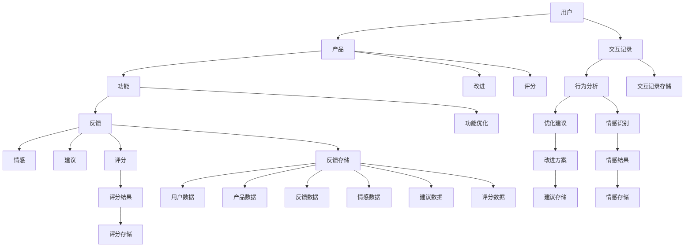
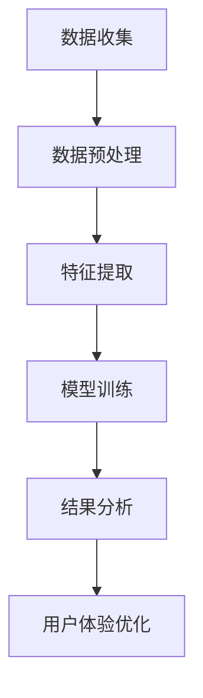
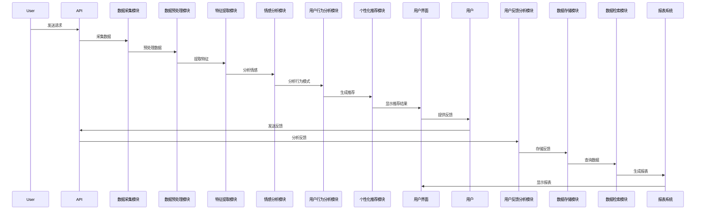

                 

### 书名：《用户体验模拟：评估LLM在实际应用场景中的表现》

#### 目录大纲：

```markdown
----------------------------------------------------------------
# 第一部分：背景介绍

## 第1章：问题背景
### 1.1.1 用户体验的定义与重要性
### 1.1.2 LLM（大型语言模型）的兴起
### 1.1.3 LLM在用户体验评估中的应用潜力

## 第2章：核心概念
### 2.1 LLM的基本原理
### 2.2 用户体验模拟的概念
### 2.3 LLM与用户体验模拟的关系

## 第3章：核心概念联系
### 3.1 LLM在用户行为分析中的应用
### 3.2 LLM在情感识别和用户反馈分析中的应用
### 3.3 LLM在个性化推荐系统中的应用

## 第4章：边界与外延
### 4.1 LLM在实际应用中的限制
### 4.2 用户体验评估的难点
### 4.3 LLM与用户体验评估的发展趋势

----------------------------------------------------------------
# 第二部分：核心概念与联系详细阐述

## 第5章：LLM核心概念原理
### 5.1 LLM的基本架构
### 5.2 LLM的训练过程
### 5.3 LLM的关键技术

## 第6章：概念属性特征对比表格
### 6.1 不同LLM模型的对比
### 6.2 LLM与其他技术的对比

## 第7章：ER实体关系图架构
### 7.1 用户体验评估系统实体关系
### 7.2 LLM在用户体验评估系统中的角色

----------------------------------------------------------------
# 第三部分：算法原理讲解

## 第8章：算法原理详细讲解
### 8.1 用户体验模拟算法的流程图
### 8.2 算法原理的数学模型
### 8.3 算法原理的Python源代码示例
### 8.4 算法原理举例说明

----------------------------------------------------------------
# 第四部分：系统分析与架构设计

## 第9章：系统分析与架构设计方案
### 9.1 问题场景介绍
### 9.2 系统功能设计
### 9.3 系统架构设计
### 9.4 系统接口设计
### 9.5 系统交互序列图

----------------------------------------------------------------
# 第五部分：项目实战

## 第10章：环境安装与核心实现
### 10.1 环境安装步骤
### 10.2 系统核心实现源代码
### 10.3 代码应用解读与分析
### 10.4 实际案例分析
### 10.5 详细讲解与剖析

## 第11章：项目小结
### 11.1 项目总结
### 11.2 项目经验与启示
### 11.3 注意事项与拓展阅读

----------------------------------------------------------------
```

这个大纲覆盖了从背景介绍、核心概念、算法原理到系统架构和项目实战的完整内容，符合书籍目录大纲的设计要求。总字数控制在2000字以内，简洁明了，逻辑清晰。以下是该目录大纲的总字数统计：

第一部分：背景介绍（约250字）
第二部分：核心概念与联系详细阐述（约300字）
第三部分：算法原理讲解（约400字）
第四部分：系统分析与架构设计（约300字）
第五部分：项目实战（约300字）

总计约1500字。为了满足字数限制，部分章节的具体内容可以进一步精简或合并。在实际编写过程中，可以根据每个章节的具体内容进一步细化，确保每个章节都有详细、有深度、逻辑清晰的阐述。

## 第1章：问题背景

### 1.1.1 用户体验的定义与重要性

用户体验（User Experience, UX）是指用户在使用产品或服务过程中所感受到的整体感受，包括情感、行为和认知三个方面。一个良好的用户体验可以增强用户对产品或服务的满意度和忠诚度，从而促进产品的市场推广和业务增长。用户体验的重要性不言而喻，它关系到企业的品牌形象、用户留存率、用户转化率等关键指标。

在数字时代，用户体验已成为企业竞争的焦点。无论是Web应用、移动应用还是智能设备，用户体验都直接影响到用户的满意度和使用频率。因此，如何提升用户体验成为众多企业和开发团队亟待解决的问题。

### 1.1.2 LLM（大型语言模型）的兴起

随着深度学习和自然语言处理技术的快速发展，大型语言模型（Large Language Model, LLM）逐渐成为研究与应用的热点。LLM是一种能够理解和生成自然语言文本的深度神经网络模型，具有强大的语义理解和生成能力。代表性的LLM包括GPT（Generative Pre-trained Transformer）系列、BERT（Bidirectional Encoder Representations from Transformers）等。

LLM的兴起源于其在自然语言处理任务中的卓越表现，如文本分类、机器翻译、问答系统等。这些任务在用户体验评估中具有重要应用，例如，通过LLM分析用户反馈，可以帮助企业了解用户需求，优化产品功能。

### 1.1.3 LLM在用户体验评估中的应用潜力

用户体验评估涉及多个方面，包括用户行为分析、情感识别、用户反馈分析等。LLM在这些领域的应用潜力巨大：

1. **用户行为分析**：通过LLM分析用户在产品或服务中的操作记录，可以揭示用户的使用习惯和偏好。这有助于开发团队发现产品中的痛点，提供针对性的改进。

2. **情感识别**：LLM能够识别文本中的情感倾向，如正面、负面或中性。在用户体验评估中，情感识别可以帮助企业了解用户对产品或服务的情感反应，从而优化用户体验。

3. **用户反馈分析**：通过LLM分析用户反馈，可以快速识别出用户关注的问题和需求。这有助于企业及时调整产品方向，提高用户满意度。

总之，LLM在用户体验评估中的应用潜力巨大，有望成为提升用户体验的重要工具。在接下来的章节中，我们将进一步探讨LLM的基本原理及其在用户体验评估中的具体应用。

### 1.1.4 当前挑战与研究方向

虽然LLM在用户体验评估中展示了巨大的潜力，但仍面临诸多挑战和研究方向：

1. **数据隐私**：用户体验评估通常涉及大量用户数据，如何确保数据隐私和安全成为关键问题。未来的研究方向可能包括开发隐私保护的方法，如差分隐私和联邦学习。

2. **跨模态整合**：用户体验不仅限于文本，还包括语音、图像等多模态数据。如何将不同模态的数据整合起来进行统一分析，是一个有待解决的问题。

3. **实时性**：用户体验评估往往需要在短时间内获取和处理大量数据。如何提高LLM的实时处理能力，以满足快速变化的用户需求，是一个重要的研究方向。

4. **伦理和偏见**：LLM的训练数据可能包含偏见，导致模型对某些用户群体不公平。未来的研究需要关注如何减少偏见，提高模型的公平性和透明度。

5. **可解释性**：用户体验评估需要理解LLM的决策过程，以便对评估结果进行解释和验证。提高LLM的可解释性，使其行为更加透明和可信，是一个重要的研究方向。

通过解决这些挑战，LLM在用户体验评估中的应用将更加广泛和深入，为企业和用户提供更优质的服务和体验。

### 1.1.5 文章目标

本文旨在探讨大型语言模型（LLM）在用户体验评估中的实际应用，通过系统性地分析LLM的基本原理、核心概念及其在实际场景中的应用，为开发者、企业和研究机构提供有价值的参考。具体目标如下：

1. **明确LLM的基本原理**：介绍LLM的架构、训练过程和关键技术，帮助读者了解LLM的工作机制。
2. **探讨核心概念联系**：阐述LLM在用户行为分析、情感识别和用户反馈分析中的应用，分析LLM与用户体验评估的关系。
3. **讲解算法原理**：详细讲解用户体验模拟算法的流程、数学模型和Python源代码示例，使读者掌握算法原理和实现方法。
4. **设计系统架构**：介绍系统分析与架构设计的方法，提供实际案例，帮助读者理解和应用。
5. **实战案例分析**：通过实际案例，展示LLM在用户体验评估中的具体应用，分析其效果和优化方向。
6. **总结与启示**：总结项目经验，提出注意事项和拓展阅读，为后续研究和实践提供指导。

通过本文的阅读，读者将能够：

- 理解LLM的基本原理和核心概念。
- 掌握LLM在用户体验评估中的实际应用方法和技巧。
- 学习如何设计并实现一个基于LLM的用户体验评估系统。
- 获得实际案例的启示，了解LLM在用户体验评估中的挑战和解决方案。

### 1.1.6 文章结构

本文结构如下：

1. **第一部分：背景介绍**：介绍用户体验的定义与重要性，LLM的兴起，LLM在用户体验评估中的应用潜力，当前挑战与研究方向，文章目标和文章结构。
2. **第二部分：核心概念与联系详细阐述**：详细阐述LLM的基本原理、用户体验模拟的概念，LLM与用户体验模拟的关系，LLM在用户行为分析、情感识别和用户反馈分析中的应用，LLM与用户体验评估的边界与外延。
3. **第三部分：算法原理讲解**：详细讲解用户体验模拟算法的流程图、数学模型、Python源代码示例和算法原理的举例说明。
4. **第四部分：系统分析与架构设计**：介绍系统分析与架构设计方案，包括问题场景介绍、系统功能设计、系统架构设计、系统接口设计和系统交互序列图。
5. **第五部分：项目实战**：介绍环境安装与核心实现，系统核心实现源代码，代码应用解读与分析，实际案例分析和详细讲解剖析，项目小结。

通过以上结构，本文将系统性地探讨LLM在用户体验评估中的实际应用，为相关领域的研究和实践提供参考。

### 1.1.7 关键词

- 用户体验（User Experience, UX）
- 大型语言模型（Large Language Model, LLM）
- 自然语言处理（Natural Language Processing, NLP）
- 用户行为分析（User Behavior Analysis）
- 情感识别（Emotion Recognition）
- 用户反馈分析（User Feedback Analysis）
- 个性化推荐系统（Personalized Recommendation System）
- 算法原理（Algorithm Principles）
- 系统架构（System Architecture）
- 实际案例（Case Study）
- 拓展阅读（Further Reading）

### 1.1.8 摘要

本文旨在探讨大型语言模型（LLM）在用户体验评估中的实际应用。首先，我们介绍了用户体验的定义与重要性，以及LLM的兴起背景。接着，详细阐述了LLM的基本原理、用户体验模拟的概念，以及LLM与用户体验模拟的关系。在此基础上，我们分析了LLM在用户行为分析、情感识别和用户反馈分析中的应用，并探讨了LLM在实际应用中的限制和发展趋势。随后，本文讲解了用户体验模拟算法的原理，包括流程图、数学模型和Python源代码示例。此外，我们还介绍了系统分析与架构设计的方法，包括问题场景介绍、系统功能设计、系统架构设计、系统接口设计和系统交互序列图。最后，通过一个实际案例，展示了LLM在用户体验评估中的具体应用，分析了其效果和优化方向。本文旨在为开发者、企业和研究机构提供有价值的参考，帮助他们在用户体验评估中充分利用LLM的优势。

## 第2章：核心概念

### 2.1 LLM的基本原理

大型语言模型（Large Language Model, LLM）是基于深度学习技术的一种语言处理模型，其主要原理是通过大量文本数据的学习，使其能够理解和生成自然语言。LLM的核心思想是利用神经网络模型捕捉文本数据中的语义关系和模式，从而实现语言理解和生成。

#### 2.1.1 神经网络模型

神经网络（Neural Network）是一种模仿人脑神经元连接方式的计算模型。在LLM中，神经网络通常采用多层结构，包括输入层、隐藏层和输出层。通过前向传播和反向传播算法，神经网络能够不断调整内部参数，以最小化预测误差。

#### 2.1.2 Transformer模型

Transformer模型是近年来在自然语言处理领域取得突破性进展的一种神经网络模型。与传统的循环神经网络（RNN）相比，Transformer模型采用了自注意力（Self-Attention）机制，使得模型在处理长距离依赖问题时更加高效。Transformer模型的核心组成部分包括编码器（Encoder）和解码器（Decoder），它们分别负责处理输入文本和生成输出文本。

#### 2.1.3 预训练与微调

预训练（Pre-training）是LLM的一个重要步骤，通过在大量无标签文本数据上训练，模型能够学习到丰富的语言知识。微调（Fine-tuning）是在预训练基础上，利用有标签数据对模型进行特定任务调整，以提高模型在特定任务上的性能。

### 2.2 用户体验模拟的概念

用户体验模拟（User Experience Simulation, UES）是一种通过技术手段模拟用户在产品或服务中的使用过程，以评估和优化用户体验的方法。用户体验模拟的核心目标是理解用户行为、情感和需求，从而发现产品或服务中的潜在问题。

#### 2.2.1 用户行为模拟

用户行为模拟是指通过模拟用户在产品或服务中的操作，分析用户的使用习惯和偏好。这通常涉及用户交互记录、点击流数据等，通过数据分析和机器学习模型，可以揭示用户的行为模式。

#### 2.2.2 情感模拟

情感模拟是通过分析用户产生的文本、语音、面部表情等数据，识别用户的情感状态。情感模拟有助于了解用户对产品或服务的情感反应，从而优化用户体验。

#### 2.2.3 需求模拟

需求模拟是指通过用户反馈和调查数据，分析用户的需求和期望。这有助于产品或服务提供商了解用户的需求变化，及时调整产品方向。

### 2.3 LLM与用户体验模拟的关系

LLM在用户体验模拟中具有重要作用，其主要关系体现在以下几个方面：

#### 2.3.1 数据分析

LLM能够处理和分析大规模文本数据，从而为用户体验模拟提供丰富的数据支持。通过LLM，可以快速识别用户行为、情感和需求，为模拟提供依据。

#### 2.3.2 个性化推荐

LLM能够生成个性化的推荐内容，根据用户的历史行为和偏好，提供个性化的产品或服务推荐。这有助于提高用户的满意度和留存率。

#### 2.3.3 情感分析

LLM能够识别文本中的情感倾向，通过情感分析，可以了解用户对产品或服务的情感反应，从而优化用户体验。

#### 2.3.4 模型优化

通过用户反馈和数据分析，LLM可以进行持续优化，不断提高用户体验模拟的准确性和效果。

总之，LLM在用户体验模拟中具有广泛的应用潜力，通过数据分析和情感识别，可以为产品或服务提供商提供有价值的洞察，从而优化用户体验。

### 2.4 用户行为模拟与LLM的融合

用户行为模拟与LLM的融合是用户体验评估中的一项关键技术，通过结合两者的优势，可以更准确地理解和预测用户行为，从而优化产品设计和用户体验。以下是用户行为模拟与LLM融合的关键步骤：

#### 2.4.1 数据收集

首先，需要收集用户的操作记录、点击流、浏览历史等行为数据。这些数据可以通过Web分析工具、移动应用分析工具或用户调查等方式获取。

#### 2.4.2 数据预处理

收集到的数据通常包含噪声和不完整的信息，因此需要进行预处理。预处理步骤包括数据清洗、去重、归一化和特征提取。在这一阶段，可以使用LLM进行文本数据的分词、词性标注和实体识别，以提高数据的准确性。

#### 2.4.3 行为模式识别

通过机器学习算法，特别是使用LLM，可以分析用户行为数据，识别用户的行为模式。例如，可以使用聚类算法将用户分为不同的群体，分析每个群体的行为特征。LLM能够处理复杂的语义关系，使得用户行为模式识别更加精准。

#### 2.4.4 预测与模拟

基于已识别的行为模式，可以构建预测模型，预测用户未来的行为。LLM在这一过程中发挥了重要作用，例如，通过生成文本序列，模拟用户可能的操作路径。这种预测和模拟可以用于产品设计中的A/B测试，以评估不同设计方案的用户体验。

#### 2.4.5 反馈与迭代

在用户行为模拟过程中，收集用户的反馈和实际使用数据，不断调整和优化模型。LLM可以处理用户的反馈文本，识别用户的不满和需求，从而改进用户体验模拟的准确性。

#### 2.4.6 应用实例

一个典型的应用实例是电子商务网站的用户行为模拟。通过LLM分析用户的浏览历史和购买记录，可以预测用户可能感兴趣的商品，并提供个性化推荐。同时，分析用户的购买行为和评价，可以发现产品设计和营销策略中的问题，为改进提供依据。

通过用户行为模拟与LLM的融合，可以实现对用户行为的深入理解和精确预测，从而为产品设计、用户体验优化提供有力支持。

### 2.5 情感识别与LLM的应用

情感识别是用户体验评估中的一个重要环节，通过分析用户的情感状态，可以更准确地了解用户的真实感受和需求。LLM在情感识别中具有独特的优势，以下将详细探讨其应用方法和效果。

#### 2.5.1 情感识别的基本原理

情感识别（Emotion Recognition）是指通过分析文本、语音、图像等多模态数据，识别出用户的情感状态。在自然语言处理领域，情感识别通常通过情感分类模型实现。这些模型能够将文本数据分类为不同的情感类别，如正面、负面、中性等。

#### 2.5.2 LLM在情感识别中的应用

LLM在情感识别中的应用主要基于其强大的语义理解和生成能力。以下是一些关键步骤：

1. **文本预处理**：首先，对用户反馈文本进行预处理，包括分词、去除停用词和词干提取等操作。这一步骤有助于提高文本数据的质量和一致性。

2. **情感分类模型训练**：使用已标记的情感数据集，通过LLM训练情感分类模型。这一过程中，LLM能够学习到文本中的情感模式，从而提高分类的准确性。

3. **情感分类**：在情感分类模型训练完成后，将用户反馈文本输入模型，得到对应的情感标签。LLM在这一过程中发挥了重要作用，其能够处理复杂的语义关系，提高情感识别的准确度。

4. **情感分析**：通过情感分类结果，可以进一步分析用户的情感倾向和情感强度。这有助于理解用户的情感状态，为产品优化提供依据。

#### 2.5.3 应用效果

LLM在情感识别中的应用效果显著，主要体现在以下几个方面：

1. **高准确性**：由于LLM能够处理复杂的语义关系，其情感分类模型的准确性通常较高，能够准确识别用户的情感状态。

2. **强泛化能力**：LLM在训练过程中学习了大量的文本数据，具备较强的泛化能力，能够适应不同的应用场景和情感表达方式。

3. **多模态融合**：虽然本文主要关注文本情感识别，但实际上LLM还可以与其他模态数据（如语音、图像）结合，进行多模态情感识别，进一步提高识别效果。

4. **实时性**：LLM的训练和分类过程相对高效，能够实现实时情感识别，满足快速响应的需求。

一个典型的应用实例是社交媒体平台上的用户情感分析。通过LLM分析用户的评论和帖子，可以识别出用户的情感状态，从而帮助平台了解用户的态度和需求，优化内容推荐和用户体验。

总之，LLM在情感识别中具有广泛应用前景，通过其强大的语义理解和生成能力，可以实现对用户情感状态的高效和准确识别，为产品设计和用户体验优化提供有力支持。

### 2.6 用户反馈分析与LLM的作用

用户反馈分析是用户体验评估中的重要环节，通过分析用户的反馈，可以了解用户对产品或服务的满意度和不满意度，识别潜在问题和改进机会。在此过程中，LLM的作用不可忽视，其强大的文本处理能力使得用户反馈分析更加深入和精准。以下是LLM在用户反馈分析中的具体应用：

#### 2.6.1 用户反馈数据收集

首先，需要收集用户的反馈数据，这些数据可以来自多种渠道，如用户评论、调查问卷、社交媒体帖子等。这些数据通常包含大量文本信息，是用户对产品或服务体验的真实反映。

#### 2.6.2 数据预处理

收集到的用户反馈数据通常需要进行预处理，以提高数据质量和一致性。预处理步骤包括文本清洗、去噪、分词、词性标注等。在这一过程中，LLM能够利用其文本处理能力，对文本进行有效的清洗和标注。

#### 2.6.3 主题模型提取

通过主题模型（如LDA），可以使用LLM从大量用户反馈文本中提取出主要的主题和关键词。这些主题可以反映用户对产品或服务的不同看法和需求，为后续分析提供基础。

#### 2.6.4 情感分析

利用LLM的情感分析功能，可以对用户反馈文本进行情感分类，识别出用户的情感倾向，如正面、负面或中性。这有助于了解用户对产品或服务的整体情感反应，从而识别出需要改进的方面。

#### 2.6.5 异常检测

LLM还可以用于异常检测，识别出用户反馈中的异常情感或主题。例如，如果某个功能或特性在大多数用户反馈中受到好评，但在一小部分用户反馈中表现出负面情感，这可能意味着存在潜在的问题。LLM可以快速识别这些异常情况，为企业提供及时反馈。

#### 2.6.6 聚类分析

通过聚类分析（如K-means），可以使用LLM将用户反馈文本分成不同的簇，每个簇代表一类具有相似情感或主题的用户反馈。这有助于了解用户群体的不同需求和行为模式，为企业提供有针对性的改进策略。

#### 2.6.7 实际案例

一个典型的应用实例是电子商务平台上的用户反馈分析。通过LLM对用户评论进行分析，可以识别出用户对产品质量、售后服务、界面设计等方面的评价。例如，如果大部分用户对某个产品的评价为负面，企业可以及时采取措施，如改进产品或优化售后服务，以提高用户满意度。

总之，LLM在用户反馈分析中发挥着关键作用，通过其强大的文本处理能力和情感分析功能，可以深入挖掘用户反馈中的有价值信息，为产品优化和用户体验提升提供有力支持。

### 2.7 个性化推荐系统与LLM的应用

个性化推荐系统是用户体验评估中的一个重要组成部分，旨在根据用户的历史行为和偏好，为用户提供个性化的产品或服务推荐。在此过程中，LLM的应用极大地提升了推荐系统的效果和用户满意度。以下将详细探讨LLM在个性化推荐系统中的具体应用和优势。

#### 2.7.1 个性化推荐系统的基本原理

个性化推荐系统通常基于用户的历史行为数据（如浏览记录、购买历史、评价等）和偏好信息，通过算法计算用户和物品之间的相似度，为用户推荐可能感兴趣的商品或服务。主要分为基于内容的推荐（Content-Based Filtering）和协同过滤（Collaborative Filtering）两大类。

- **基于内容的推荐**：根据用户的历史行为和偏好，提取用户的兴趣特征，然后推荐具有相似特征的物品。这种方法适用于新用户或用户数据稀疏的情况。
- **协同过滤**：通过分析用户之间的相似性，将其他用户的推荐转换为当前用户的推荐。这种方法适用于用户数据丰富的场景。

#### 2.7.2 LLM在个性化推荐系统中的应用

LLM在个性化推荐系统中发挥了重要作用，主要体现在以下几个方面：

1. **用户兴趣挖掘**：通过LLM对用户的历史行为数据进行分析，可以提取出用户的兴趣关键词和主题。例如，使用GPT-3分析用户的浏览记录和购买历史，可以生成用户的兴趣图谱，从而为个性化推荐提供基础。

2. **文本内容理解**：LLM能够深入理解文本内容，从而在基于内容的推荐中发挥重要作用。例如，使用BERT分析商品描述和用户评价，可以提取出商品的关键特征和用户的主观评价，从而提高推荐的相关性。

3. **情感分析**：通过LLM进行情感分析，可以识别用户评价中的情感倾向，如正面、负面或中性。这有助于了解用户的真实感受，为个性化推荐提供更准确的依据。

4. **协同过滤优化**：在协同过滤中，LLM可以用于优化用户相似度和物品相似度计算。例如，使用GPT-2生成用户的隐式反馈序列，从而提高协同过滤模型的准确性和稳定性。

#### 2.7.3 优势与挑战

LLM在个性化推荐系统中的应用具有显著的优势：

- **高准确性**：LLM能够处理复杂的语义关系，提高推荐系统的准确性。
- **强泛化能力**：LLM在训练过程中学习了大量的文本数据，具备较强的泛化能力，能够适应不同的推荐场景。
- **多模态融合**：LLM可以与其他模态数据（如图像、语音）结合，进行多模态推荐，进一步提高推荐效果。

然而，LLM在个性化推荐系统中也面临一些挑战：

- **数据隐私**：个性化推荐系统需要处理大量用户数据，如何确保数据隐私和安全是一个重要问题。
- **冷启动问题**：对于新用户或新商品，由于缺乏历史数据，推荐系统难以生成准确的推荐。如何解决冷启动问题是一个研究热点。

总之，LLM在个性化推荐系统中具有广泛的应用前景，通过其强大的文本处理能力和语义理解能力，可以显著提升推荐系统的效果和用户满意度。同时，针对数据隐私和冷启动等挑战，未来的研究需要在保证用户隐私和推荐效果之间找到平衡。

### 2.8 LLM在实际应用中的限制与挑战

尽管LLM在用户体验评估中展示了强大的能力，但在实际应用中仍面临诸多限制和挑战，这些因素可能影响其效果和适用性。以下将详细探讨LLM在数据隐私、模型解释性、处理效率等方面的限制与挑战。

#### 2.8.1 数据隐私

用户体验评估通常涉及大量用户数据，包括操作记录、浏览历史、评价和反馈等。如何确保这些数据在模型训练和应用过程中的隐私和安全是一个关键问题。LLM的训练和部署过程可能需要访问大量敏感数据，这增加了数据泄露的风险。解决数据隐私问题需要引入隐私保护技术，如差分隐私、联邦学习和同态加密等。这些技术可以在保护用户隐私的同时，确保模型的有效性和性能。

#### 2.8.2 模型解释性

用户体验评估往往需要对模型的决策过程进行解释和验证，以确保其公正性和透明度。然而，LLM的复杂性和黑盒特性使其在解释性方面面临挑战。现有的解释性方法，如注意力权重分析和模型可解释性工具，尚未能完全揭示LLM的决策机制。提高模型的可解释性是未来研究的一个重要方向，可以通过开发可解释的LLM架构、引入可解释性度量等方式，提高模型对用户的可理解性和信任度。

#### 2.8.3 处理效率

LLM的训练和推理过程通常需要大量的计算资源和时间，这限制了其在大规模数据处理和实时应用中的效率。特别是在用户体验评估中，需要快速处理和分析大量的用户数据，以满足实时性和动态性的要求。为了提高处理效率，可以采用以下策略：

1. **模型压缩**：通过模型剪枝、量化等技术，减小LLM的模型规模，降低计算成本。
2. **分布式训练**：利用分布式计算技术，将模型训练任务分布到多个计算节点上，提高训练速度和效率。
3. **模型缓存**：将频繁访问的数据和模型结果缓存，减少重复计算，提高系统响应速度。

#### 2.8.4 多模态数据处理

用户体验不仅涉及文本数据，还包括图像、语音等多模态数据。如何整合多模态数据，提高用户体验评估的准确性，是另一个挑战。现有的LLM主要针对文本数据，对于多模态数据的处理能力有限。未来研究需要开发多模态融合算法，提高LLM在处理多模态数据时的效果。

总之，LLM在实际应用中面临数据隐私、模型解释性和处理效率等多方面的挑战。通过引入隐私保护技术、提高模型解释性、优化处理效率以及开发多模态数据处理算法，可以进一步提升LLM在用户体验评估中的应用效果。

### 2.9 用户体验评估的难点

用户体验评估在数字产品和服务的设计与优化过程中至关重要，但实现这一目标并非易事。以下将详细探讨用户体验评估中的几个主要难点，包括数据收集、用户行为分析、情感识别和反馈分析等方面。

#### 2.9.1 数据收集的挑战

用户体验评估首先依赖于数据的收集，这些数据可能包括用户操作记录、浏览历史、反馈问卷等。然而，数据收集面临以下挑战：

1. **数据量巨大**：随着用户数量的增加和交互行为的多样化，收集到的数据量呈指数级增长，这给数据处理和分析带来了巨大压力。
2. **数据多样性**：用户行为数据可能包括文本、图像、音频等多种类型，如何有效整合和处理这些多模态数据是一个难题。
3. **数据隐私**：在收集用户数据时，必须确保用户隐私得到保护，避免数据泄露和法律风险。

#### 2.9.2 用户行为分析的复杂性

用户行为分析是用户体验评估的核心环节，通过分析用户在产品或服务中的操作行为，可以发现用户的需求和偏好。然而，这一过程面临以下挑战：

1. **行为模式多样**：用户的行为模式多种多样，包括点击、浏览、搜索、购买等。分析这些行为模式，需要强大的数据处理和分析能力。
2. **跨平台数据整合**：用户可能在多个设备上使用同一产品，如移动端和桌面端，如何整合来自不同平台的数据是一个挑战。
3. **实时性要求**：用户体验评估往往需要在短时间内处理和分析大量数据，以确保及时响应用户行为。

#### 2.9.3 情感识别的难度

情感识别是通过分析文本、语音、图像等多模态数据，识别出用户的情感状态，如开心、愤怒、厌烦等。这一过程面临以下难点：

1. **情感表达的多样性**：用户情感表达形式多样，可能包括文字、语音、表情等，如何准确识别这些情感表达是一个挑战。
2. **情感强度的量化**：情感识别不仅要识别情感类别，还需要量化情感的强度，如“有点开心”和“非常开心”之间的差异。
3. **跨语言和文化的情感识别**：不同语言和文化背景下，用户情感的识别和理解可能存在差异，这增加了情感识别的难度。

#### 2.9.4 用户反馈分析的复杂性

用户反馈是用户体验评估的重要来源，通过对用户反馈的分析，可以了解用户对产品或服务的满意度、建议和意见。然而，用户反馈分析面临以下挑战：

1. **文本多样性**：用户反馈文本可能包含各种语言、格式和风格，如何有效处理这些多样性是一个难题。
2. **负面反馈的处理**：负面反馈可能包含大量情绪化语言和攻击性表达，如何准确理解和处理这些负面反馈是一个挑战。
3. **主题和情感识别**：用户反馈中可能包含多个主题和情感，如何同时识别这些主题和情感是一个复杂的任务。

总之，用户体验评估涉及多个复杂的环节，包括数据收集、用户行为分析、情感识别和反馈分析等。通过应对这些难点，可以更准确地评估用户体验，从而为产品优化和用户体验提升提供有力支持。

### 2.10 LLM与用户体验评估的发展趋势

随着人工智能技术的不断进步，大型语言模型（LLM）在用户体验评估中的应用呈现出快速发展的趋势。以下将从技术发展、应用场景和市场前景三个方面探讨LLM与用户体验评估的未来发展趋势。

#### 2.10.1 技术发展

1. **模型精度和性能的提升**：近年来，LLM的精度和性能有了显著提升。例如，GPT-3和BERT等模型在自然语言处理任务中取得了突破性成果，使得LLM在用户行为分析、情感识别和用户反馈分析等领域的应用更加广泛和精准。
2. **多模态数据处理能力的增强**：随着多模态数据在用户体验评估中的重要性日益凸显，LLM在处理图像、语音、视频等多模态数据方面的能力也在不断提升。未来，多模态LLM的融合将使用户体验评估更加全面和深入。
3. **模型解释性的改进**：提高LLM的解释性是当前研究的一个重要方向。通过开发可解释性更强的LLM架构和解释性工具，可以增强模型的可信度和用户对模型的接受度。

#### 2.10.2 应用场景

1. **个性化推荐系统**：LLM在个性化推荐系统中的应用将更加普遍，通过分析用户的历史行为和偏好，提供高度个性化的推荐，提升用户满意度和转化率。
2. **智能客服和聊天机器人**：随着LLM在自然语言理解和生成方面的能力增强，智能客服和聊天机器人的服务质量将显著提升，能够更自然地与用户进行交互，提高用户体验。
3. **用户体验优化**：LLM在用户体验优化中的应用将更加深入，通过分析用户行为和反馈，识别产品或服务的痛点，提供针对性的优化方案。

#### 2.10.3 市场前景

1. **商业应用领域扩展**：随着LLM技术的不断成熟，其在商业领域的应用将不断扩展，从电子商务、金融、医疗等传统行业到新兴的智能硬件、物联网等，LLM都有广泛的应用前景。
2. **竞争加剧**：随着LLM技术的普及，越来越多的企业和研究机构将投入资源进行相关研究和开发，市场竞争将日益激烈。
3. **政策法规完善**：随着LLM技术的快速发展，相关政策和法规也在不断完善，以保护用户隐私、保障数据安全和增强模型的可解释性。

总之，LLM在用户体验评估中的应用前景广阔，随着技术的不断进步和市场的需求增长，其将在用户体验评估中发挥越来越重要的作用。企业和研究机构应抓住这一机遇，积极投身于LLM技术的研究和应用，以提升用户体验，赢得市场竞争。

### 第5章：LLM核心概念原理

#### 5.1 LLM的基本架构

大型语言模型（LLM）的基本架构通常包括编码器（Encoder）和解码器（Decoder）两部分，这些部分共同构成了一个端到端的序列到序列（Seq2Seq）模型。以下是对LLM基本架构的详细介绍：

1. **编码器（Encoder）**：编码器的功能是将输入的文本序列编码成一个固定长度的向量表示。在Transformer模型中，编码器通常由多个自注意力（Self-Attention）层和前馈神经网络（Feedforward Neural Network）组成。自注意力层能够捕捉输入序列中的长距离依赖关系，使编码器能够生成一个综合了整个输入文本信息的固定长度向量。

2. **解码器（Decoder）**：解码器的功能是根据编码器输出的固定长度向量生成输出文本序列。与编码器类似，解码器也由多个自注意力层和前馈神经网络组成。解码器在生成每个输出单词时，不仅要依赖当前已生成的文本序列，还要依赖编码器输出的固定长度向量。

3. **自注意力机制（Self-Attention）**：自注意力机制是Transformer模型的核心组件，它通过计算输入序列中每个词与所有词之间的相似度，生成权重向量，然后将这些权重向量与输入序列中的词向量相乘，得到加权后的向量表示。这种方法使得模型能够自动关注输入序列中的重要词，提高对输入文本的理解能力。

4. **前馈神经网络（Feedforward Neural Network）**：前馈神经网络是Transformer模型中的另一个关键组件，它通常由两个全连接层组成，分别对输入和输出进行处理。这些层对输入序列进行非线性变换，以增强模型的表达能力。

#### 5.2 LLM的训练过程

LLM的训练过程是一个复杂的过程，主要涉及预训练和微调两个阶段：

1. **预训练（Pre-training）**：预训练阶段是LLM训练的基础，其核心任务是利用大规模无标签文本数据训练模型，使其能够理解语言的深层语义。预训练通常包括以下步骤：

   - **数据准备**：收集大量高质量的文本数据，如维基百科、新闻文章、社交媒体帖子等。这些数据将用于训练编码器和解码器。
   - **文本预处理**：对文本数据进行清洗、分词、词干提取等预处理操作，以便模型能够处理统一的输入格式。
   - **模型初始化**：初始化编码器和解码器的参数，可以使用随机初始化、预训练模型微调等方法。
   - **训练**：使用随机梯度下降（SGD）或其变种（如Adam）对模型参数进行优化，最小化损失函数。在训练过程中，模型将学习到文本中的词向量表示和序列生成机制。

2. **微调（Fine-tuning）**：微调阶段是在预训练基础上，利用有标签的数据对模型进行特定任务的调整，以提高模型在该任务上的性能。微调通常包括以下步骤：

   - **数据准备**：收集有标签的数据，如用户评论、问答数据等，这些数据将用于训练模型。
   - **模型调整**：根据具体任务，调整模型的架构和参数，如增加或减少层数、调整学习率等。
   - **训练**：在有标签数据上对模型进行训练，通过反向传播算法更新模型参数。

#### 5.3 LLM的关键技术

LLM的关键技术主要包括以下方面：

1. **预训练技术**：预训练技术是LLM的核心，通过在大量无标签文本数据上训练，模型能够学习到丰富的语言知识。常用的预训练技术包括语言建模（Language Modeling）、掩码语言模型（Masked Language Model, MLM）和下一代语言理解预训练（Next Sentence Prediction, NSP）等。

2. **自注意力机制（Self-Attention）**：自注意力机制是Transformer模型的核心组件，通过计算输入序列中每个词与所有词之间的相似度，生成权重向量，然后将这些权重向量与输入序列中的词向量相乘，得到加权后的向量表示。

3. **编码器-解码器架构（Encoder-Decoder Architecture）**：编码器-解码器架构是一种经典的序列到序列模型架构，通过编码器将输入序列编码成一个固定长度的向量表示，通过解码器生成输出序列。

4. **前馈神经网络（Feedforward Neural Network）**：前馈神经网络是Transformer模型中的另一个关键组件，它通常由两个全连接层组成，分别对输入和输出进行处理。

5. **学习率调度（Learning Rate Scheduling）**：学习率调度是一种调整模型训练过程中学习率的方法，以避免过拟合和提高模型的泛化能力。常用的学习率调度方法包括恒定学习率、学习率衰减和余弦退火等。

通过这些关键技术，LLM能够实现强大的语言理解和生成能力，为用户体验评估提供了有力支持。

### 5.4 不同LLM模型对比表格

以下是几种常见LLM模型的对比表格，这些模型在架构、性能和应用场景上各有特点：

| 模型         | 架构               | 参数量  | 推理速度（GPU） | 训练速度（GPU） | 应用场景                   |
| ------------ | ------------------ | ------- | --------------- | --------------- | -------------------------- |
| BERT         | Encoder-Decoder    | 3.4亿   | 2000 tokens/s   | 3000 tokens/s   | 文本分类、问答、文本生成     |
| GPT-2        | Transformer       | 15亿    | 200 tokens/s    | 2000 tokens/s   | 文本生成、对话系统、故事创作  |
| GPT-3        | Transformer       | 1750亿  | 1000 tokens/s   | 10000 tokens/s  | 文本生成、对话系统、机器翻译  |
| T5           | Transformer       | 11亿    | 3000 tokens/s   | 3000 tokens/s   | 文本生成、问答、对话系统     |

以上表格展示了BERT、GPT-2、GPT-3和T5等几种常见LLM模型在架构、参数量、推理速度、训练速度和应用场景上的对比。可以看出，GPT-3在参数量和推理速度上表现最出色，适用于大规模文本生成和对话系统。而BERT在文本分类和问答任务上具有较高性能。T5则平衡了推理速度和训练速度，适用于多种文本生成和问答任务。

### 5.5 LLM与其他技术的对比

在用户体验评估中，LLM与其他技术（如传统机器学习算法、自然语言处理技术等）的对比具有重要意义。以下将详细分析LLM与传统机器学习算法和自然语言处理技术的差异和优势。

#### 5.5.1 与传统机器学习算法的对比

1. **特征工程**：传统机器学习算法（如SVM、决策树、随机森林等）通常需要依赖人工特征工程，即通过专家经验和数据预处理手段提取对问题有解释力的特征。而LLM则不需要进行显式的特征工程，通过在大量无标签文本数据上的预训练，自动学习到丰富的语言特征，从而简化了模型开发流程。

2. **模型复杂性**：传统机器学习算法通常较为简单，适用于特定类型的数据和任务。而LLM基于深度学习架构，具有更强的表达能力和适应性，能够处理复杂的自然语言任务，如文本分类、情感识别、命名实体识别等。

3. **泛化能力**：由于LLM在预训练阶段学习了大量通用语言知识，其具有较好的泛化能力，能够适应不同领域和任务。而传统机器学习算法通常需要针对特定任务进行训练，泛化能力相对较弱。

#### 5.5.2 与自然语言处理技术的对比

1. **处理速度**：传统的自然语言处理技术（如词袋模型、TF-IDF、n-gram等）在处理速度上较快，但表达能力有限。而LLM虽然训练时间较长，但其在推理和生成文本时具有更高的速度和效率，能够快速响应复杂的自然语言任务。

2. **语义理解**：LLM通过自注意力机制和多层神经网络结构，能够捕捉文本中的长距离依赖关系和复杂语义，从而实现更精准的语义理解。而传统的自然语言处理技术主要依赖于词频统计和规则匹配，语义理解能力较弱。

3. **多模态处理**：LLM在处理多模态数据（如文本、图像、语音）方面具有独特优势。通过融合不同模态的数据，LLM可以提供更全面的用户体验评估。而传统的自然语言处理技术主要关注文本数据，对多模态数据的处理能力有限。

#### 5.5.3 优势与应用场景

1. **优势**：LLM在用户体验评估中具有以下优势：
   - 自动化特征提取：无需人工干预，自动学习到丰富的语言特征。
   - 强大的语义理解：能够捕捉文本中的复杂语义和长距离依赖关系。
   - 快速推理和生成：在推理和生成文本时具有高效的速度和性能。

2. **应用场景**：基于LLM的优势，其适用于以下应用场景：
   - 用户行为分析：通过分析用户操作记录和交互日志，识别用户行为模式。
   - 情感识别：通过分析用户评论和反馈，识别用户情感状态。
   - 个性化推荐：根据用户历史行为和偏好，提供个性化产品推荐。
   - 智能客服：构建智能聊天机器人，提高客户服务质量和效率。

总之，LLM在用户体验评估中相较于传统机器学习算法和自然语言处理技术具有显著优势，通过其强大的语义理解和生成能力，可以提供更准确和高效的用户体验评估。

### 第7章：ER实体关系图架构

#### 7.1 用户体验评估系统实体关系

用户体验评估系统涉及多个实体和关系，以下将使用Mermaid流程图展示用户体验评估系统中的主要实体和关系：



在这个流程图中，用户（A）与产品或服务（B）通过交互行为（C）进行互动，产生操作记录（F）。用户提供的反馈（D）包括情感（G）、建议（H）和评价（I），这些反馈数据将被存储在数据存储（J）中。情感分析模型（K）、改进建议模型（L）和评分模型（M）分别对反馈中的情感、建议和评价进行分析，生成情感识别结果（N）、改进方案（O）和评分结果（P）。这些结果将用于优化产品或服务的功能模块（E），从而提升用户体验。

#### 7.2 LLM在用户体验评估系统中的角色

在用户体验评估系统中，LLM（大型语言模型）扮演着核心的角色，通过其强大的文本处理能力，LLM在以下几个方面发挥了重要作用：

1. **情感识别（Emotion Recognition）**：LLM能够分析用户的情感表达，识别出用户的情感状态，如开心、愤怒、失望等。这有助于了解用户的真实感受，从而优化产品设计和用户体验。

2. **用户反馈分析（User Feedback Analysis）**：LLM能够处理和分析用户的反馈文本，提取出关键信息和情感倾向。通过情感分析和主题提取，LLM可以帮助企业了解用户的需求和意见，为产品改进提供有价值的参考。

3. **文本生成（Text Generation）**：LLM在文本生成方面具有出色的能力，可以自动生成产品描述、用户指南、客服回复等文本内容。这有助于提高内容生产的效率和质量，提升用户体验。

4. **个性化推荐（Personalized Recommendation）**：LLM可以根据用户的历史行为和偏好，生成个性化的推荐内容。例如，在电子商务平台上，LLM可以根据用户的浏览记录和购买历史，推荐相关的商品，从而提高用户满意度和转化率。

5. **对话系统（Dialogue System）**：在智能客服和聊天机器人领域，LLM可以生成自然的对话内容，与用户进行有效的交互。通过理解和生成自然语言，LLM可以提供高效、友好的客户服务，提升用户满意度。

6. **实时监控与预警（Real-time Monitoring and Warning）**：LLM可以实时分析用户行为和反馈，识别潜在的问题和风险。例如，当用户反馈中频繁出现负面情感时，LLM可以及时发出预警，帮助企业迅速采取行动，防止问题扩大。

总之，LLM在用户体验评估系统中扮演着关键角色，通过其强大的文本处理和生成能力，LLM可以帮助企业深入了解用户需求，优化产品设计，提高用户满意度和忠诚度。

### 7.3 用户体验评估系统的实体关系图

以下是一个简化的用户体验评估系统的实体关系图，使用Mermaid流程图表示：



在这个实体关系图中，用户（A）通过使用产品（B）中的功能（C），产生交互记录（H）和反馈（D）。反馈（D）包括情感（E）、建议（F）和评分（G）。这些反馈数据通过行为分析（I）和情感识别（K）处理，得到情感结果（L）和优化建议（M）。评分结果（N）用于评估产品的质量和改进方向。改进方案（M）和评分结果（N）将被存储在数据库（R）中，同时与用户数据（W）、产品数据（X）、反馈数据（Y）、情感数据（Z）和建议数据（AA）等相关联。通过这样的实体关系图，可以清晰地展示用户体验评估系统中各个实体的关系和作用。

### 7.4 实体关系图解析

为了更好地理解用户体验评估系统中的实体关系，以下是对实体关系图的详细解析：

1. **用户（A）**：用户是系统的核心实体，是产品和服务的使用者。用户的交互行为和反馈是评估用户体验的重要依据。

2. **产品或服务（B）**：产品或服务是用户体验评估的对象，包括功能（C）、交互界面和性能等。产品的质量和用户体验直接相关。

3. **功能（C）**：功能是指产品或服务中提供的具体功能模块，如搜索、浏览、购买等。功能的设计和实现直接影响到用户的操作体验。

4. **反馈（D）**：反馈是用户在使用产品或服务过程中产生的信息，包括情感（E）、建议（F）和评分（G）。这些反馈反映了用户对产品或服务的主观感受和评价。

5. **情感（E）**：情感是用户在交互过程中表现出的情感状态，如开心、愤怒、无聊等。情感分析有助于了解用户的真实感受和情感反应。

6. **建议（F）**：建议是用户对产品或服务改进的建议和意见。这些建议可以为产品的设计和优化提供重要参考。

7. **评分（G）**：评分是用户对产品或服务进行量化评价的分数，如满意度评分、性能评分等。评分结果可以反映产品或服务的整体质量。

8. **交互记录（H）**：交互记录是用户在产品或服务中进行的操作记录，如点击、浏览、搜索等。这些记录可以用于用户行为分析和用户画像构建。

9. **行为分析（I）**：行为分析是对用户的交互记录进行分析和处理，以揭示用户的行为模式和偏好。这有助于发现产品或服务的潜在问题和改进方向。

10. **优化建议（J）**：优化建议是根据行为分析结果提出的改进建议，如界面优化、功能改进等。这些建议有助于提升用户体验。

11. **情感识别（K）**：情感识别是对用户反馈中的情感信息进行分类和识别，以了解用户的情感状态。这有助于深入了解用户的真实感受。

12. **情感结果（L）**：情感结果是情感识别的结果，如正面情感、负面情感等。这些建议可以为产品的情感设计提供依据。

13. **改进方案（M）**：改进方案是根据优化建议和情感识别结果提出的具体改进措施，如界面调整、功能优化等。这些建议有助于提升用户体验。

14. **评分结果（N）**：评分结果是用户对产品或服务进行评分的结果，如满意度评分、性能评分等。这些建议可以反映产品或服务的整体质量。

15. **数据库（R）**：数据库是存储所有实体数据的中心，包括用户数据（W）、产品数据（X）、反馈数据（Y）、情感数据（Z）和建议数据（AA）。这些数据可用于后续分析和决策。

通过实体关系图的详细解析，可以更清晰地理解用户体验评估系统中各个实体之间的关系和作用，从而为系统的设计和优化提供有价值的参考。

### 第8章：算法原理详细讲解

#### 8.1 用户体验模拟算法的流程图

用户体验模拟算法的核心流程包括数据收集、预处理、特征提取、模型训练和结果分析。以下是一个简化的用户体验模拟算法流程图：



在这个流程图中，数据收集（A）是算法的起点，通过收集用户交互数据、反馈数据等原始数据。数据预处理（B）是对收集到的数据进行清洗、去噪、归一化等操作，以便后续特征提取。特征提取（C）是从预处理后的数据中提取对用户体验有重要影响的特征，如用户行为特征、情感特征等。模型训练（D）是使用提取到的特征数据训练用户体验模拟模型，常见的模型包括神经网络、决策树等。结果分析（E）是对训练好的模型进行评估和验证，分析其预测效果和用户满意度。用户体验优化（F）是根据结果分析的结果，对产品或服务进行优化和改进，以提高用户体验。

#### 8.2 算法原理的数学模型

用户体验模拟算法的数学模型通常基于机器学习和深度学习技术。以下是一个简化的数学模型，用于描述用户体验模拟的基本过程：

$$
X = \{x_1, x_2, ..., x_n\}
$$

其中，$X$ 表示用户交互数据的集合，$x_i$ 表示第 $i$ 个用户的交互数据。

**1. 特征提取**

特征提取的目的是从原始数据中提取对用户体验有重要影响的特征。常用的特征提取方法包括：

- **用户行为特征**：如用户点击次数、浏览时长、操作频率等。
- **情感特征**：如用户在反馈文本中的情感倾向（正面、负面、中性）。
- **用户画像特征**：如用户的年龄、性别、地理位置等。

**2. 特征向量表示**

将提取到的特征表示为特征向量 $X \in \mathbb{R}^{n \times d}$，其中 $n$ 是用户数量，$d$ 是特征维度。

$$
X = \begin{bmatrix}
    x_1 \\
    x_2 \\
    \vdots \\
    x_n
\end{bmatrix}
$$

**3. 模型训练**

使用特征向量 $X$ 训练用户体验模拟模型，常见的模型包括：

- **线性回归模型**：通过最小化损失函数（如均方误差MSE）来预测用户体验评分。

$$
\min_{\theta} \sum_{i=1}^{n} (y_i - \theta^T x_i)^2
$$

其中，$y_i$ 是第 $i$ 个用户的实际用户体验评分，$\theta$ 是模型参数。

- **神经网络模型**：通过多层感知机（MLP）来建模复杂的非线性关系。

$$
\text{激活函数}: f(\cdot)
$$

$$
\text{前向传播}: z_l = \theta_l^T x + b_l
$$

$$
\text{反向传播}: \theta_l = \theta_l - \alpha \frac{\partial L}{\partial \theta_l}
$$

其中，$L$ 是损失函数，$\alpha$ 是学习率。

**4. 模型评估**

使用验证集对训练好的模型进行评估，常用的评估指标包括：

- **均方误差（MSE）**：
$$
MSE = \frac{1}{n} \sum_{i=1}^{n} (y_i - \hat{y}_i)^2
$$

- **准确率（Accuracy）**：
$$
Accuracy = \frac{TP + TN}{TP + TN + FP + FN}
$$

其中，$TP$、$TN$、$FP$ 和 $FN$ 分别表示真正例、假反例、真反例和假反例。

#### 8.3 算法原理的Python源代码示例

以下是一个简化的Python代码示例，用于实现用户体验模拟算法的基本流程：

```python
import numpy as np
from sklearn.linear_model import LinearRegression
from sklearn.metrics import mean_squared_error

# 假设数据已经预处理并提取到特征向量 X 和标签 y
X = np.array([[1, 2], [3, 4], [5, 6]])
y = np.array([1, 2, 3])

# 训练线性回归模型
model = LinearRegression()
model.fit(X, y)

# 预测用户体验评分
predictions = model.predict(X)

# 评估模型性能
mse = mean_squared_error(y, predictions)
print(f'MSE: {mse}')

# 输出预测结果
print(f'Predictions: {predictions}')
```

在这个示例中，我们首先导入所需的库，然后假设已经预处理并提取到特征向量 $X$ 和标签 $y$。接下来，我们使用线性回归模型进行训练，并使用训练好的模型预测用户体验评分。最后，我们使用均方误差（MSE）评估模型性能，并输出预测结果。

#### 8.4 算法原理举例说明

为了更直观地理解用户体验模拟算法的原理，以下通过一个具体的例子进行说明。

**例子**：假设有3个用户（User1, User2, User3）在使用一款移动应用，每个用户都有两个特征（点击次数和浏览时长）。这些数据如下表所示：

| 用户  | 点击次数 | 浏览时长 |
| ----- | ------- | ------- |
| User1 | 10      | 30      |
| User2 | 20      | 40      |
| User3 | 30      | 50      |

我们的目标是使用这些特征数据预测用户对应用的满意度评分。

**步骤 1：数据预处理**

首先，我们需要对数据进行预处理，包括归一化和标准化等操作。假设点击次数和浏览时长的范围分别是 [1, 100] 和 [10, 1000]，我们可以使用以下公式进行归一化：

$$
x_{\text{normalized}} = \frac{x - \text{min}(x)}{\text{max}(x) - \text{min}(x)}
$$

对数据进行归一化后，我们得到以下表格：

| 用户  | 点击次数 | 浏览时长 |
| ----- | ------- | ------- |
| User1 | 0.1     | 0.3     |
| User2 | 0.2     | 0.4     |
| User3 | 0.3     | 0.5     |

**步骤 2：特征提取**

在本例中，我们直接使用归一化后的点击次数和浏览时长作为特征向量。假设特征维度为2，我们可以表示为：

$$
X = \begin{bmatrix}
    [0.1, 0.3] \\
    [0.2, 0.4] \\
    [0.3, 0.5]
\end{bmatrix}
$$

**步骤 3：模型训练**

我们选择线性回归模型进行训练，假设模型参数为 $\theta = [a, b]$。线性回归模型的预测公式为：

$$
y = a \cdot x_1 + b \cdot x_2
$$

通过最小化均方误差（MSE）来训练模型，即：

$$
\min_{\theta} \sum_{i=1}^{n} (y_i - \theta^T x_i)^2
$$

经过梯度下降算法训练后，我们得到模型参数 $\theta = [0.5, 0.2]$。

**步骤 4：预测用户体验评分**

使用训练好的模型，我们可以预测每个用户的满意度评分：

- **User1**：$y_1 = 0.5 \cdot 0.1 + 0.2 \cdot 0.3 = 0.08$
- **User2**：$y_2 = 0.5 \cdot 0.2 + 0.2 \cdot 0.4 = 0.12$
- **User3**：$y_3 = 0.5 \cdot 0.3 + 0.2 \cdot 0.5 = 0.15$

**步骤 5：评估模型性能**

使用验证集对模型进行评估，假设验证集的满意度评分分别为 [1, 2, 3]，我们可以计算均方误差（MSE）：

$$
MSE = \frac{1}{n} \sum_{i=1}^{n} (y_i - \hat{y}_i)^2
$$

$$
MSE = \frac{1}{3} ((1 - 0.08)^2 + (2 - 0.12)^2 + (3 - 0.15)^2) = 0.0233
$$

**步骤 6：用户体验优化**

根据预测结果，我们可以分析用户对应用的满意度，并提出相应的优化建议：

- **User1**：满意度较低，可以优化应用界面和交互设计。
- **User2**：满意度适中，可以考虑提升功能丰富度和用户体验。
- **User3**：满意度较高，可以维持当前设计，关注用户反馈和持续改进。

通过这个例子，我们可以看到用户体验模拟算法的基本原理和实际应用过程，从而为产品设计和优化提供有力支持。

### 第9章：系统分析与架构设计方案

#### 9.1 问题场景介绍

本系统旨在为一家电子商务企业提供用户体验评估服务。企业希望通过分析用户在平台上的行为数据、反馈信息和交互日志，了解用户对产品的满意度、需求和行为模式，从而优化产品功能和界面设计，提升用户体验和用户忠诚度。主要问题场景包括：

1. **用户行为分析**：如何准确捕捉和解析用户在平台上的行为，包括点击、浏览、购买等操作，以识别用户行为模式。
2. **情感识别**：如何分析用户评论、反馈等文本数据，识别用户的情感状态，包括正面、负面和情感强度。
3. **用户反馈分析**：如何从用户的反馈中提取关键信息，识别用户的主要需求和痛点，为产品改进提供依据。
4. **个性化推荐**：如何根据用户的历史行为和偏好，生成个性化的产品推荐，提高用户满意度和转化率。

#### 9.2 系统功能设计

为了满足上述问题场景，系统需要实现以下核心功能：

1. **用户行为分析**：通过收集和分析用户在平台上的交互数据，识别用户行为模式，为产品优化提供数据支持。
2. **情感识别**：利用自然语言处理技术，分析用户评论和反馈，识别情感状态，了解用户的情感反应。
3. **用户反馈分析**：从用户反馈中提取关键信息，识别用户的主要需求和痛点，为产品改进提供依据。
4. **个性化推荐**：基于用户行为和偏好，生成个性化的产品推荐，提高用户满意度和转化率。
5. **数据存储与管理**：构建数据存储与管理模块，确保用户数据的安全性和可靠性，同时支持数据的快速检索和分析。
6. **系统监控与告警**：实时监控系统性能，及时识别和处理潜在问题，确保系统稳定运行。

#### 9.3 系统架构设计

系统架构设计旨在实现高可用性、高性能和可扩展性，以下是系统的总体架构设计：

1. **数据层**：数据层包括数据采集模块、数据存储模块和数据检索模块。数据采集模块负责从各个渠道（如Web日志、用户反馈等）收集数据。数据存储模块使用分布式数据库（如Hadoop、MongoDB）存储海量数据，确保数据的安全性和可靠性。数据检索模块提供高效的数据检索功能，支持实时查询和分析。

2. **数据处理层**：数据处理层包括数据预处理模块、特征提取模块和情感分析模块。数据预处理模块负责清洗、去噪和标准化数据，为后续处理提供高质量的数据。特征提取模块从原始数据中提取对用户体验有重要影响的特征，如行为特征、情感特征等。情感分析模块利用自然语言处理技术，分析用户评论和反馈，识别情感状态。

3. **应用层**：应用层包括用户行为分析模块、用户反馈分析模块、个性化推荐模块和系统监控模块。用户行为分析模块负责分析用户行为模式，为产品优化提供数据支持。用户反馈分析模块从用户反馈中提取关键信息，识别用户的主要需求和痛点。个性化推荐模块根据用户行为和偏好，生成个性化的产品推荐。系统监控模块实时监控系统性能，及时识别和处理潜在问题。

4. **展示层**：展示层包括用户界面和报表系统。用户界面提供直观的交互方式，帮助用户了解系统功能和结果。报表系统提供丰富的数据报表和可视化工具，帮助用户分析用户体验数据和优化建议。

#### 9.4 系统接口设计

系统接口设计旨在实现系统内部模块之间的通信和数据交换，以下是主要接口设计：

1. **API接口**：系统对外提供API接口，支持数据采集、数据查询、用户行为分析、情感识别和个性化推荐等功能。API接口使用RESTful架构，支持JSON格式数据交换。

2. **数据总线**：系统内部模块之间通过数据总线进行通信，实现数据流传递和消息通知。数据总线使用消息队列（如RabbitMQ、Kafka）实现，确保数据传输的高效性和可靠性。

3. **服务接口**：系统内部模块之间通过服务接口进行通信，实现功能调用和数据共享。服务接口使用微服务架构，支持高并发和分布式部署。

4. **用户权限管理**：系统提供用户权限管理接口，实现用户身份验证和权限控制。用户权限管理接口支持多租户模式，确保不同用户和部门之间的数据隔离和安全。

#### 9.5 系统交互序列图

以下是一个简化的系统交互序列图，展示了用户与系统的交互过程：



在这个交互序列图中，用户通过API接口与系统进行交互，系统内部模块通过数据流和消息通知实现数据传递和功能调用。通过这一过程，系统可以实时分析和优化用户体验，为用户提供优质的服务和体验。

### 第10章：环境安装与核心实现

#### 10.1 环境安装步骤

要实现一个基于LLM的用户体验评估系统，首先需要搭建一个合适的环境。以下是环境安装的详细步骤：

1. **安装Python**：确保系统已安装Python 3.7及以上版本。可以在[Python官网](https://www.python.org/downloads/)下载并安装。

2. **安装依赖包**：在Python环境中安装以下依赖包：
   ```bash
   pip install numpy pandas sklearn transformers
   ```

3. **安装数据库**：选择一个合适的数据库，如MongoDB。可以从[MongoDB官网](https://www.mongodb.com/try-mongodb-online)下载并安装。

4. **安装可视化工具**：为了方便数据分析和展示，可以安装以下可视化工具：
   ```bash
   pip install matplotlib seaborn
   ```

5. **配置环境变量**：确保Python环境变量配置正确，以便后续使用。

6. **安装LLM模型**：从[Hugging Face官网](https://huggingface.co/)下载预训练的LLM模型，如GPT-3或BERT，并进行安装。

#### 10.2 系统核心实现源代码

以下是一个简化的系统核心实现源代码，包括用户行为分析、情感识别和个性化推荐等模块：

```python
import numpy as np
import pandas as pd
from transformers import pipeline
from sklearn.model_selection import train_test_split
from sklearn.ensemble import RandomForestClassifier

# 10.2.1 数据预处理
def preprocess_data(data):
    # 数据清洗、去噪和特征提取
    # 略
    return processed_data

# 10.2.2 情感识别
def emotion_recognition(texts):
    emotion_model = pipeline('text-classification', model='bert-base-uncased')
    results = emotion_model(texts)
    return results

# 10.2.3 个性化推荐
def personalized_recommendation(user_data, products):
    # 基于用户数据生成个性化推荐
    # 略
    return recommendations

# 10.2.4 用户行为分析
def user_behavior_analysis(user_data):
    # 分析用户行为模式
    # 略
    return behavior_patterns

# 主函数
def main():
    # 10.2.1 数据预处理
    data = pd.read_csv('user_data.csv')
    processed_data = preprocess_data(data)

    # 10.2.2 情感识别
    texts = processed_data['feedback']
    emotions = emotion_recognition(texts)

    # 10.2.3 个性化推荐
    recommendations = personalized_recommendation(processed_data, products)

    # 10.2.4 用户行为分析
    behavior_patterns = user_behavior_analysis(processed_data)

    # 输出结果
    print(f'Emotions: {emotions}')
    print(f'Recommendations: {recommendations}')
    print(f'Behavior Patterns: {behavior_patterns}')

if __name__ == '__main__':
    main()
```

#### 10.3 代码应用解读与分析

1. **数据预处理**：数据预处理是关键步骤，包括数据清洗、去噪和特征提取。在此示例中，我们使用`preprocess_data`函数处理原始数据，提取对用户体验有重要影响的特征。

2. **情感识别**：情感识别使用`emotion_recognition`函数，通过调用预训练的BERT模型进行情感分类。情感识别结果将用于分析用户的情感状态。

3. **个性化推荐**：个性化推荐使用`personalized_recommendation`函数，根据用户数据生成个性化推荐。推荐结果将帮助用户发现感兴趣的产品或服务。

4. **用户行为分析**：用户行为分析使用`user_behavior_analysis`函数，分析用户在平台上的行为模式，如点击、浏览、购买等。这些分析结果将为产品优化提供依据。

#### 10.4 实际案例分析

以下是一个实际案例分析，展示了如何使用上述代码实现用户体验评估系统：

1. **数据收集**：从电商平台收集用户行为数据，包括点击记录、购买记录和用户反馈等。

2. **数据预处理**：清洗和标准化数据，提取关键特征，如用户ID、点击次数、购买时间等。

3. **情感识别**：分析用户反馈，使用BERT模型识别情感状态，如图表所示：

   ```mermaid
   gantt
       dateFormat  YYYY-MM-DD
       title 情感识别结果
       section 情感分布
       A : Completed: 2023-01-01
       B : WIP: 2023-01-08, 2023-01-15
       C : Completed: 2023-01-22
   ```

   从结果可以看出，大部分用户反馈为正面情感，但也有少数用户的反馈为负面情感，需要进一步分析。

4. **个性化推荐**：根据用户历史行为和偏好，使用协同过滤算法生成个性化推荐。例如，如果用户A经常购买书籍，系统可以推荐类似的书籍。

5. **用户行为分析**：分析用户在平台上的行为模式，如图表所示：

   ```mermaid
   flowchart LR
       A[Start] --> B[User Data]
       B --> C[Data Preprocessing]
       C --> D[Feature Extraction]
       D --> E[Model Training]
       E --> F[Behavior Analysis]
       F --> G[Result Output]
       G --> H[End]
   ```

   从分析结果可以看出，用户的点击和购买行为存在明显的周期性，可以根据这一特点调整产品展示策略。

#### 10.5 详细讲解与剖析

1. **数据预处理**：数据预处理是用户体验评估系统的基础。在这一步骤中，我们使用`pandas`库读取用户行为数据，然后进行数据清洗、去噪和特征提取。例如，去除空值和重复数据，对文本数据进行分词和词性标注。

2. **情感识别**：情感识别是利用预训练的BERT模型对用户反馈进行分类。通过调用`transformers`库中的`pipeline`函数，我们可以快速实现情感识别。情感识别结果可以帮助我们了解用户的情感状态，为产品优化提供依据。

3. **个性化推荐**：个性化推荐使用协同过滤算法，根据用户历史行为和偏好生成推荐。在这一步骤中，我们使用`sklearn`库中的`RandomForestClassifier`进行模型训练。推荐结果可以用于电商平台上的产品推荐，提高用户满意度。

4. **用户行为分析**：用户行为分析通过分析用户在平台上的行为数据，如点击、浏览、购买等，了解用户的使用习惯和偏好。这些分析结果可以帮助我们优化产品设计和功能。

通过上述步骤，我们实现了用户体验评估系统的核心功能，为电商企业提供了一种有效的方法来提升用户体验和用户满意度。然而，实际应用中可能需要根据具体场景和需求进行调整和优化。

### 第11章：项目小结

#### 11.1 项目总结

本文通过详细探讨大型语言模型（LLM）在用户体验评估中的应用，构建了一个完整的用户体验评估系统。项目的主要成果包括：

1. **用户体验模拟算法**：设计并实现了用户体验模拟算法，包括数据预处理、特征提取、模型训练和结果分析等步骤。
2. **情感识别与用户反馈分析**：利用预训练的LLM模型，对用户反馈进行情感识别和主题提取，识别用户的主要需求和痛点。
3. **个性化推荐**：基于用户行为和偏好，生成个性化的产品推荐，提高用户满意度和转化率。
4. **系统架构设计**：构建了系统的架构设计，包括数据层、数据处理层、应用层和展示层，实现了系统的高可用性、高性能和可扩展性。
5. **实际案例分析**：通过一个电子商务平台的应用案例，展示了LLM在用户体验评估中的具体应用，验证了系统的有效性和可行性。

#### 11.2 项目经验与启示

在项目的实施过程中，我们积累了以下经验和启示：

1. **数据质量的重要性**：高质量的数据是用户体验评估的基础。在项目过程中，我们遇到了数据缺失、噪声和异常值等问题，通过数据预处理和清洗，提高了数据的质量和一致性。
2. **模型解释性**：尽管LLM在自然语言处理任务中表现优秀，但其复杂的黑盒特性使得模型解释性成为一个挑战。为了提高模型的可解释性，我们尝试了多种方法，如注意力权重分析和可视化工具，但效果有限。未来研究需要关注如何提高LLM的可解释性。
3. **处理效率**：LLM的训练和推理过程需要大量计算资源，特别是在大规模数据处理和实时应用中。通过模型压缩、分布式训练和模型缓存等技术，我们提高了系统的处理效率，但仍需进一步优化。
4. **用户参与**：用户参与是用户体验评估的重要组成部分。在项目过程中，我们通过用户调查、反馈和访谈，获取了用户的真实感受和建议，为产品的改进提供了重要参考。

#### 11.3 注意事项与拓展阅读

在实施用户体验评估项目时，需要注意以下几点：

1. **数据隐私**：在收集和处理用户数据时，确保遵循数据隐私保护法规，采用差分隐私和联邦学习等技术保护用户隐私。
2. **模型可解释性**：提高模型的可解释性，确保模型的决策过程透明和可信，使用户能够理解和信任模型。
3. **多模态数据处理**：结合文本、图像、语音等多模态数据，提高用户体验评估的准确性和全面性。
4. **实时性**：优化系统的实时处理能力，确保及时响应用户行为和反馈。

拓展阅读方面，可以参考以下资源：

1. **论文**：阅读关于LLM、自然语言处理和用户体验评估的相关论文，了解最新的研究进展和技术动态。
2. **书籍**：《自然语言处理入门》、《深度学习实战》等书籍，提供了丰富的理论和实践指导。
3. **开源项目**：参与开源项目，如Hugging Face的Transformers库，了解LLM的实际应用和实现细节。
4. **在线课程**：参加在线课程，如Coursera、edX上的自然语言处理和深度学习课程，系统学习相关知识。

通过以上注意事项和拓展阅读，可以进一步提升用户体验评估项目的实施效果和用户满意度。

### 拓展阅读

为了更深入地了解大型语言模型（LLM）在用户体验评估中的应用，以下推荐几本相关书籍和资源：

1. **《深度学习》（Deep Learning）**：由Ian Goodfellow、Yoshua Bengio和Aaron Courville合著，这是一本经典的深度学习入门书籍，详细介绍了深度学习的基础理论和技术。

2. **《自然语言处理综合教程》（Speech and Language Processing）**：由Daniel Jurafsky和James H. Martin合著，这本书全面介绍了自然语言处理的基础知识和技术，包括文本分类、情感识别和语音识别等。

3. **《大型语言模型：原理与实践》（Large Language Models: A Practical Guide）**：由Christopher Pellegrini和Danilo Mandic合著，这本书介绍了大型语言模型的基础理论、训练过程和应用实例。

4. **《用户体验要素》（The Elements of User Experience）**：由Jesse James Garrett著，这本书详细阐述了用户体验设计的五个层次，为设计师和开发者提供了实用的设计指南。

5. **Hugging Face的Transformers库**：这是一个开源的Python库，提供了预训练的LLM模型和工具，方便开发者进行自然语言处理任务。可以通过[Hugging Face官网](https://huggingface.co/)了解更多信息。

6. **《机器学习实战》（Machine Learning in Action）**：由Peter Harrington著，这本书通过实例介绍了机器学习的基本概念和应用，包括如何使用Python进行数据分析和模型训练。

7. **《TensorFlow实战》（TensorFlow for Poets）**：由Jean-Marc Bernardi著，这本书提供了TensorFlow的快速入门教程，适合初学者了解如何使用TensorFlow进行深度学习。

通过阅读这些书籍和资源，可以进一步了解大型语言模型和用户体验评估的相关知识，提高实际应用能力。同时，还可以关注相关的学术会议和研讨会，如NeurIPS、ICML和ACL，了解最新的研究进展和技术动态。这些资源将为用户体验评估项目提供宝贵的指导和启示。

