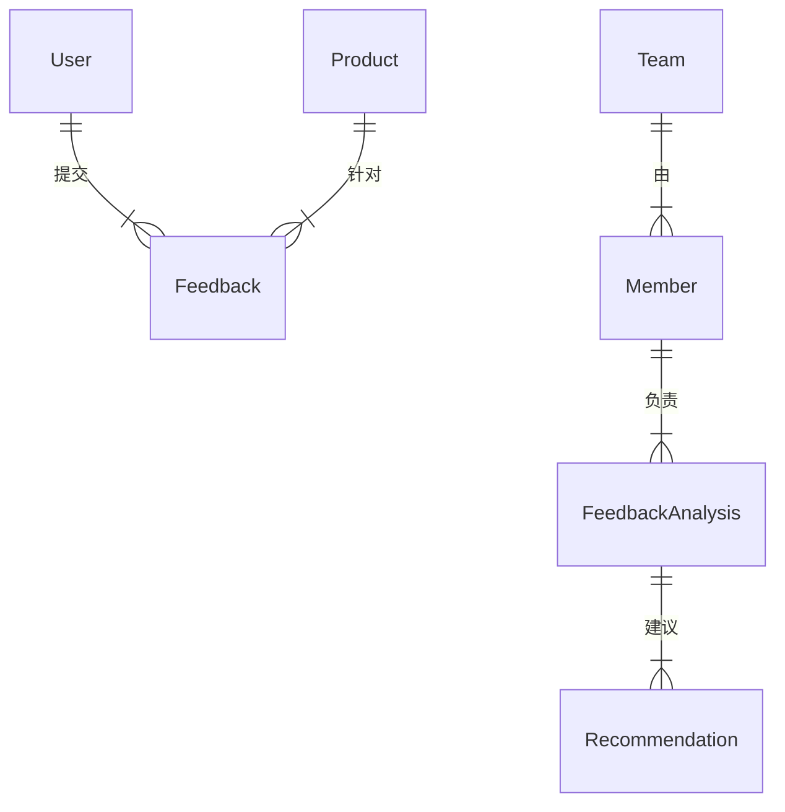

                 

### Step 1: Introduction and Background

#### 1.1 问题背景

**用户反馈的重要性**

用户反馈是产品优化过程中的关键因素之一。它是用户对产品使用体验的直接表达，能够反映用户对产品的满意度、不满意度以及改进建议。有效的用户反馈可以帮助企业了解市场需求，优化产品设计，提升用户体验，从而增强用户忠诚度和市场份额。

**用户反馈的挑战**

尽管用户反馈至关重要，但整合用户反馈并非易事。首先，用户反馈形式多样，包括文本、图片、视频等，这使得数据收集和处理变得复杂。其次，用户反馈可能存在噪声，即一些无意义或误导性的信息，这会影响反馈的准确性和有效性。此外，用户反馈的数量庞大，如何高效地处理和分析这些数据也是一个挑战。

**整合用户反馈的必要性**

整合用户反馈的必要性体现在以下几个方面：

1. **产品迭代优化**：通过整合用户反馈，企业可以快速响应市场需求，优化产品设计，提升产品功能，从而提高用户满意度。
2. **用户体验提升**：用户反馈可以帮助企业发现用户体验中的痛点，进行针对性改进，提高用户满意度。
3. **业务增长**：用户满意度提升有助于增加用户黏性和推荐率，进而推动业务增长。
4. **竞争优势**：有效整合用户反馈，可以为企业提供竞争优势，使其在激烈的市场竞争中脱颖而出。

#### 1.2 问题描述

**用户反馈的多样性**

用户反馈的多样性体现在多个方面。首先，用户反馈的形式多样，包括文字、图片、视频等。其次，用户反馈的内容也多样，可能涉及产品的功能、性能、用户体验等多个方面。这种多样性使得用户反馈的处理和分析变得更加复杂。

**用户反馈的处理难题**

处理用户反馈的难题主要包括：

1. **数据收集和处理**：用户反馈的数据量大，且形式多样，如何高效地收集和处理这些数据是一个挑战。
2. **噪声过滤**：用户反馈中可能存在噪声，即无意义或误导性的信息，如何过滤掉这些噪声，提取有价值的信息是一个难题。
3. **数据分析**：如何从大量的用户反馈中提取出有效的信息，进行深入分析，为产品优化提供依据。

**用户反馈与产品优化的关联**

用户反馈与产品优化的关联紧密。通过分析用户反馈，企业可以了解用户对产品的真实需求和期望，从而有针对性地进行产品优化。用户反馈不仅是产品优化的起点，也是产品优化的过程和结果。

#### 1.3 问题解决

**整合用户反馈的目标**

整合用户反馈的目标主要包括：

1. **全面收集**：确保能够全面收集用户的反馈，包括文字、图片、视频等不同形式。
2. **高效处理**：建立高效的反馈处理机制，快速响应用户需求。
3. **深度分析**：通过数据分析，深入理解用户需求，为产品优化提供科学依据。

**整合用户反馈的方法**

整合用户反馈的方法包括：

1. **数据收集**：建立完善的用户反馈收集机制，包括在线问卷、用户论坛、用户访谈等多种方式。
2. **数据预处理**：对收集到的用户反馈进行清洗和分类，去除噪声，提取有价值的信息。
3. **数据分析**：使用自然语言处理、机器学习等技术，对用户反馈进行深入分析，提取关键信息。

**用户反馈优化的路径**

用户反馈优化的路径主要包括：

1. **需求分析**：通过用户反馈，了解用户的需求和期望，为产品优化提供方向。
2. **产品设计**：根据需求分析结果，对产品进行优化设计，提升用户体验。
3. **产品测试**：通过用户测试，验证产品优化的效果，确保产品满足用户需求。
4. **持续迭代**：根据用户反馈，不断优化产品，实现产品与用户需求的良性互动。

#### 1.4 边界与外延

**用户反馈的范围**

用户反馈的范围包括产品的各个方面，如功能、性能、易用性、安全性等。用户可以从这些方面提供反馈，帮助企业了解产品的优点和不足。

**用户反馈评估的维度**

用户反馈评估的维度主要包括：

1. **满意度**：用户对产品的整体满意度。
2. **功能性**：产品功能的完整性。
3. **易用性**：产品的易用程度。
4. **性能**：产品的性能指标，如响应时间、稳定性等。
5. **安全性**：产品的安全性，如数据保护、系统漏洞等。

**用户反馈优化的限制因素**

用户反馈优化的限制因素主要包括：

1. **技术限制**：现有技术的局限性可能影响用户反馈的收集、处理和分析。
2. **资源限制**：企业的人力、财力等资源可能影响用户反馈优化的深度和广度。
3. **时间限制**：用户反馈的及时处理可能受到项目进度和资源限制的影响。

#### 1.5 本章小结

本章介绍了用户反馈整合能力评估的问题背景、问题描述、问题解决和边界与外延。通过分析用户反馈的重要性、挑战和必要性，明确了整合用户反馈的目标、方法和路径。同时，对用户反馈的范围、评估维度和优化限制因素进行了探讨。本章内容为后续章节的讨论奠定了基础。接下来，我们将进一步深入探讨用户反馈整合能力评估的核心概念和原理。

### Step 2: Core Concepts and Principles

#### 2.1 Core Concepts

**用户反馈整合能力**

用户反馈整合能力是指企业或团队在收集、处理、分析用户反馈，并将其转化为产品改进依据的过程中所展现的综合能力。这包括数据收集的全面性、数据处理的效率、数据分析的深度以及反馈优化的效果。

**用户反馈类型**

用户反馈类型可以根据反馈的形式和内容进行分类：

1. **文本反馈**：用户以文字形式表达的意见和建议。
2. **图片/视频反馈**：用户通过上传图片或视频来展示问题或需求。
3. **互动反馈**：用户通过在线聊天、论坛互动等方式提供的实时反馈。

**用户反馈渠道**

用户反馈渠道是指用户向企业或团队提供反馈的途径，包括：

1. **在线问卷**：通过在线问卷形式收集用户反馈。
2. **用户论坛**：用户在论坛上发帖表达意见和建议。
3. **用户访谈**：通过与用户面对面访谈获取深度反馈。
4. **反馈表单**：用户通过网页或移动应用的反馈表单提交反馈。

#### 2.2 Concept Attributes Comparison Table

To illustrate the attributes of user feedback integration ability, we can create a comparison table in Markdown format with the following attributes: feedback collection efficiency, data processing accuracy, analysis depth, and optimization effectiveness.

| Attribute | Description | Feedback Collection Efficiency | Data Processing Accuracy | Analysis Depth | Optimization Effectiveness |
|-----------|-------------|------------------------------|-------------------------|---------------|---------------------------|
| Efficiency | The speed and ease of collecting user feedback. | High | High | Moderate | High |
| Accuracy | The correctness and reliability of processed data. | High | Very High | High | Very High |
| Depth | The extent to which feedback data is analyzed for insights. | Moderate | High | Very High | High |
| Effectiveness | The success rate of using feedback to drive product improvements. | High | High | High | Very High |

#### 2.3 ER Entity Relationship Diagram Architecture

The ER (Entity-Relationship) diagram is a visual representation of the entities and their relationships within a system. In the context of user feedback integration, we can represent the key entities and their relationships as follows:

1. **User** (反馈者)
2. **Feedback** (反馈)
   - **Type** (类型)
   - **Content** (内容)
   - **Channel** (渠道)
   - **Time** (时间)
3. **Product** (产品)
   - **Feature** (功能)
   - **Version** (版本)
4. **Team** (团队)
   - **Member** (成员)
   - **Role** (角色)
5. **Feedback Analysis** (反馈分析)
   - **Result** (结果)
   - **Recommendation** (建议)

The ER diagram in Mermaid format could look like this:

#### 2.4 User Feedback Integration Ability Assessment Model

A comprehensive assessment model for user feedback integration ability can be structured with multiple dimensions to evaluate the effectiveness and efficiency of the feedback integration process. The following model includes key dimensions such as feedback collection, processing, analysis, and optimization.

1. **Feedback Collection**
   - **Quantity** (数量)
   - **Quality** (质量)
   - **Channel Diversity** (渠道多样性)
   - **User Coverage** (用户覆盖范围)

2. **Data Processing**
   - **Efficiency** (效率)
   - **Accuracy** (准确性)
   - **Noise Reduction** (噪声降低)
   - **Consistency** (一致性)

3. **Data Analysis**
   - **Depth** (深度)
   - **Speed** (速度)
   - **Insight Extraction** (洞见提取)
   - **Visual Representation** (可视化表示)

4. **Feedback Optimization**
   - **Effectiveness** (有效性)
   - **Impact** (影响)
   - **Timeliness** (及时性)
   - **User Satisfaction** (用户满意度)

#### 2.5 User Feedback Optimization Strategies

**Strategies for Optimizing User Feedback Integration:**

1. **Feedback Prioritization**:
   - Prioritize high-impact feedback based on user sentiment and urgency.
   - Implement a scoring system to rank feedback based on criticality and user impact.

2. **Automated Data Processing**:
   - Use machine learning algorithms to automatically categorize and tag feedback.
   - Implement natural language processing (NLP) techniques to extract insights from text feedback.

3. **Continuous Improvement Loop**:
   - Establish a feedback loop where product improvements are tested and validated with users.
   - Use A/B testing and multivariate testing to optimize user feedback-driven changes.

4. **User Engagement**:
   - Engage users in the feedback process to encourage more detailed and actionable feedback.
   - Provide feedback status updates to users to keep them informed and involved.

5. **Resource Allocation**:
   - Allocate resources effectively to ensure that user feedback is prioritized and addressed promptly.
   - Invest in tools and technologies that enhance the efficiency of user feedback integration.

#### 2.6 User Feedback and Product Lifecycle

**Understanding the Relationship Between User Feedback and Product Lifecycle:**

- **Product Planning**: User feedback informs the initial product planning stages, shaping the product roadmap and feature set.
- **Development**: During development, user feedback is used to inform design decisions, fix bugs, and enhance features.
- **Launch**: Post-launch, user feedback is critical for understanding user adoption, identifying pain points, and making necessary adjustments.
- **Maintenance and Updates**: Continuous user feedback is essential for ongoing product maintenance, updates, and future enhancements.

**Impact of User Feedback on Each Stage:**

- **Planning**: User feedback helps identify market needs and gaps, reducing the risk of developing a product that doesn't meet user expectations.
- **Development**: User feedback drives iterative design improvements, ensuring that the product meets user needs and expectations.
- **Launch**: Early user feedback can highlight issues that need to be addressed before the product launch, improving market readiness.
- **Maintenance**: User feedback helps in prioritizing updates and features, ensuring that product enhancements align with user needs.

#### 2.7 User Feedback and User Experience

**The Role of User Feedback in Enhancing User Experience:**

- **Identifying Pain Points**: User feedback reveals pain points and areas where the product may be failing to meet user expectations, allowing for targeted improvements.
- **Informed Design Decisions**: User feedback informs design decisions, helping to create intuitive and user-friendly interfaces.
- **Personalization**: By understanding user preferences and behaviors, products can be personalized to enhance the user experience.
- **Trust and Credibility**: Regularly addressing user feedback demonstrates a commitment to user satisfaction, enhancing trust and credibility.

**Practical Examples:**

- **Product A** conducted user interviews to understand user frustration with specific features. This led to a redesign that significantly improved user satisfaction.
- **Product B** analyzed user feedback to identify common complaints about loading times. This resulted in performance optimizations that reduced loading times by 40%.

#### 2.8 User Feedback and Business Value

**The Business Value of User Feedback Integration:**

- **Increased Customer Satisfaction**: User feedback allows businesses to address user concerns and improve their experience, leading to higher satisfaction and loyalty.
- **Reduced Development Risks**: Early user feedback can reveal potential issues before they impact the product launch, reducing development risks and costs.
- **Faster Time to Market**: By integrating user feedback into the development process, businesses can accelerate the time to market for new features and products.
- **Informed Decision-Making**: User feedback provides valuable insights that inform strategic decisions, helping businesses to align their product roadmap with market needs.

**Quantifying Business Value:**

- **Cost Savings**: Reducing development risks and costs through early feedback can lead to significant savings.
- **Revenue Growth**: Improved customer satisfaction can drive repeat business and referrals, leading to revenue growth.
- **Brand Reputation**: Addressing user feedback proactively can enhance brand reputation and trust in the market.

#### 2.9 Influencing Factors of User Feedback Integration Ability

**Key Factors Affecting User Feedback Integration Ability:**

- **Organizational Culture**: A culture that values user feedback and encourages collaboration can enhance feedback integration.
- **Technology Infrastructure**: Robust technology infrastructure, including tools for data collection, processing, and analysis, is essential.
- **Human Resources**: Skilled professionals who understand both user needs and technical capabilities are critical.
- **Process and Workflow**: Defined processes and workflows for handling user feedback can improve efficiency and effectiveness.
- **User Engagement**: The level of user engagement and willingness to provide feedback can impact the quality and quantity of feedback.

**Practical Measures:**

- **Training Programs**: Implement training programs to educate employees on the value of user feedback and how to effectively integrate it.
- **Tech Stack Investment**: Invest in the right technology tools to streamline feedback collection and analysis.
- **Feedback Loop Establishment**: Establish a regular feedback loop with users to ensure continuous engagement and feedback.

#### 2.10 Methods for Improving User Feedback Integration Ability

**Strategies for Enhancing User Feedback Integration Ability:**

1. **Feedback Infrastructure Enhancement**:
   - Develop a comprehensive feedback collection framework.
   - Implement tools and platforms for efficient feedback processing and analysis.

2. **Cultural Shift**:
   - Foster a culture that embraces user feedback as a critical input for decision-making.
   - Encourage open communication and collaboration across teams.

3. **Data-Driven Decision Making**:
   - Use data analytics to derive actionable insights from user feedback.
   - Integrate feedback data into the product development lifecycle.

4. **Continuous Improvement Initiatives**:
   - Establish a continuous improvement framework to regularly assess and enhance user feedback integration processes.
   - Encourage iterative testing and validation of feedback-driven changes.

5. **Feedback Training Programs**:
   - Provide training programs for employees on how to effectively collect, analyze, and respond to user feedback.

#### 2.11 Continuous Optimization of User Feedback Integration Ability

**Importance of Continuous Optimization:**

- **Adaptability**: Continuous optimization ensures that the feedback integration process remains adaptive to changing user needs and technological advancements.
- **Staying Competitive**: Regularly improving feedback integration capabilities helps businesses stay ahead in a competitive market.
- **Enhancing User Experience**: Continuous optimization ensures that user feedback is effectively integrated to enhance the overall user experience.

**Optimization Methods:**

1. **Regular Audits**: Conduct regular audits to evaluate the effectiveness of feedback collection and processing mechanisms.
2. **User Surveys**: Use user surveys to gather insights on the quality of feedback integration and identify areas for improvement.
3. **Technology Upgrades**: Invest in the latest technologies to enhance the efficiency and accuracy of user feedback processing and analysis.
4. **Feedback Loop Feedback**: Collect feedback on the feedback process itself to continuously improve user engagement and feedback quality.

#### 2.12 Case Studies of User Feedback Integration Ability

**Case Study 1: Company X**

**Background**: Company X, a leading software developer, faced challenges in effectively integrating user feedback into their product development process.

**Description**: Company X implemented a comprehensive feedback system, including user surveys, in-app feedback forms, and social media monitoring. They also invested in NLP tools to analyze feedback and identify common themes.

**Analysis**: The company saw a significant increase in the number of user insights captured and a decrease in the time taken to process and act on feedback.

**Summary**: Company X's initiatives led to enhanced user satisfaction and improved product performance.

**Case Study 2: Company Y**

**Background**: Company Y, a startup in the fintech industry, struggled with managing and responding to a high volume of user feedback.

**Description**: Company Y adopted a user-centric approach, implementing a feedback platform that allowed users to submit feedback directly within the app. They also introduced a ticketing system to manage and track feedback.

**Analysis**: The company improved its response time to user feedback and saw a marked increase in user engagement and satisfaction.

**Summary**: Company Y's strategic approach to feedback management resulted in better user experiences and business growth.

#### 2.13 Challenges and Opportunities in User Feedback Integration Ability Assessment

**Challenges:**

- **Data Quality Issues**: Ensuring the quality and reliability of user feedback data.
- **Scalability**: Handling a large volume of feedback efficiently.
- **Resource Allocation**: Allocating resources effectively to manage and analyze feedback.

**Opportunities:**

- **Advanced Analytics**: Leveraging advanced analytics to gain deeper insights from user feedback.
- **AI and Machine Learning**: Utilizing AI and ML to automate feedback processing and analysis.
- **User Engagement**: Enhancing user engagement through interactive feedback mechanisms.

**Solutions:**

- **Data Quality Controls**: Implementing data quality checks and validation processes.
- **Scalability Strategies**: Adopting cloud-based solutions to handle large-scale feedback.
- **Resource Optimization**: Investing in automation tools to streamline feedback processing and analysis.

#### 2.14 Best Practices in User Feedback Integration Ability Assessment

**Best Practices:**

- **User-Centric Design**: Design feedback systems with the user in mind, ensuring they are easy to use and understand.
- **Continuous Feedback**: Establish a continuous feedback loop to capture ongoing user insights.
- **Data-Driven Decisions**: Use feedback data to drive decision-making processes.
- **Employee Training**: Provide training for employees on how to collect, analyze, and respond to user feedback.
- **Collaboration**: Foster collaboration between different teams to ensure feedback is integrated into all aspects of the product development process.

#### 2.15 Chapter Summary

This chapter has explored the core concepts and principles of user feedback integration ability assessment. We discussed the importance of user feedback, the challenges in integrating it, and the necessity of doing so. We also examined the various types of user feedback, the channels through which it can be collected, and the key concepts involved in assessing and optimizing user feedback integration ability. Through case studies and practical strategies, we highlighted the opportunities and challenges in user feedback integration ability assessment. The chapter concludes with best practices for enhancing user feedback integration ability, providing a solid foundation for further discussion in subsequent chapters.

### Step 3: Methodologies and Tools

#### 3.1 Data Collection Methods

**User Feedback Data Sources**

The first step in user feedback integration is to collect data from various sources. These sources can include:

1. **Online Surveys**: Surveys are a popular method for collecting quantitative feedback. Tools like Google Forms, SurveyMonkey, and Typeform allow users to easily submit their feedback through a web link or embedded form.

2. **In-App Feedback Forms**: For software products, in-app feedback forms can be a convenient way to gather user insights. Platforms like UserVoice, Zendesk, and Intercom provide tools for creating and integrating feedback forms directly into the application interface.

3. **User Forums and Communities**: Online forums and communities, such as Reddit or product-specific forums, provide a platform for users to share their experiences and suggestions in a more conversational format.

4. **User Interviews and Focus Groups**: Qualitative feedback can be gathered through one-on-one interviews or group discussions. This method provides deeper insights into user behavior and motivations.

5. **Social Media Monitoring**: Tools like Hootsuite, Sprout Social, and Brandwatch can help monitor social media platforms for user-generated content related to the product.

**Data Collection Methods**

Once the sources are identified, the next step is to determine the most effective methods for collecting data:

1. **Quantitative Data Collection**:
   - **Surveys**: Surveys are designed to collect a large volume of data quickly. They should include clear questions, avoid leading questions, and be easy to complete.
   - **A/B Testing**: A/B testing involves presenting different versions of a product or feature to different user groups to measure their preferences and behaviors.

2. **Qualitative Data Collection**:
   - **Interviews**: Conduct structured or semi-structured interviews to explore user experiences in depth. Use open-ended questions to encourage detailed responses.
   - **Focus Groups**: Bring together a group of users to discuss product features and experiences. This can uncover insights that might not emerge in individual interviews.

**Data Preprocessing**

Data preprocessing is a critical step that involves cleaning and preparing the collected data for analysis. Key preprocessing tasks include:

1. **Data Cleaning**: Remove duplicate entries, correct errors, and handle missing values.
2. **Data Standardization**: Ensure that all data is in a consistent format. For example, convert all text data to lowercase to avoid redundancy.
3. **Data Reduction**: Reduce the size of the dataset by removing irrelevant information and aggregating similar data points.

#### 3.2 Data Analysis Methods

**Descriptive Statistical Analysis**

Descriptive statistical analysis involves summarizing and describing the main features of a dataset. Key methods include:

1. **Mean and Median**: Calculate the average and middle value of a dataset.
2. **Standard Deviation and Variance**: Measure the spread of data points around the mean.
3. **Frequency Distribution**: Display the number of occurrences for each value in a dataset.

**User Feedback Sentiment Analysis**

Sentiment analysis is the process of identifying and categorizing the emotions expressed in user feedback. This can be achieved using:

1. **Lexicon-Based Approaches**: Use pre-defined sets of words and their associated sentiments to classify text.
2. **Machine Learning Models**: Train machine learning models on labeled datasets to predict the sentiment of new feedback.

**Thematic Analysis**

Thematic analysis involves identifying, analyzing, and reporting patterns (or themes) within data. The steps include:

1. **Data Coding**: Assign codes to segments of text based on themes or concepts.
2. **Theme Identification**: Group similar codes into broader themes.
3. **Theme Refinement**: Refine themes based on the analysis to ensure they are meaningful and coherent.

#### 3.3 User Feedback Integration Process

**Feedback Classification**

The first step in integrating user feedback is to classify it into different categories based on its content and context. This can be done manually or using automated classification tools.

**Feedback Processing**

Once classified, feedback goes through a processing phase that involves:

1. **Data Cleaning**: Remove any noise or irrelevant information.
2. **Data Enrichment**: Add additional context to feedback, such as user demographics or usage patterns.

**Feedback Analysis**

The feedback is then analyzed to extract insights and identify key trends or issues. This can involve:

1. **Descriptive Analysis**: Summarize the feedback using statistical methods.
2. **Sentiment Analysis**: Determine the overall sentiment of the feedback.
3. **Thematic Analysis**: Identify common themes or topics within the feedback.

**Feedback Integration**

Finally, the insights from the analysis are integrated into the product development process:

1. **Bug Tracking**: Prioritize and track feedback related to bugs or issues.
2. **Feature Requests**: Evaluate feedback for potential new features or enhancements.
3. **User Experience Improvements**: Use feedback to make improvements to the user interface and overall user experience.

#### 3.4 Assessment Metrics System

**User Feedback Integration Ability Assessment Metrics**

To assess the effectiveness of user feedback integration, a comprehensive set of metrics can be used. These metrics should cover various aspects of the feedback process, including:

1. **Feedback Quantity and Coverage**:
   - **Total Number of Feedback Submissions**: The total number of feedback submissions received.
   - **Feedback Coverage Rate**: The percentage of users who have provided feedback.

2. **Feedback Processing Efficiency**:
   - **Response Time**: The time taken to respond to feedback submissions.
   - **Processing Accuracy**: The accuracy of feedback processing, including error rates and missing data.

3. **Data Analysis Depth**:
   - **Insight Extraction Rate**: The percentage of feedback that is analyzed to extract actionable insights.
   - **Theme Identification Accuracy**: The accuracy of identifying common themes or issues within feedback.

4. **Feedback Integration Impact**:
   - **Bug Resolution Rate**: The percentage of reported bugs that are resolved.
   - **Feature Implementation Rate**: The percentage of feedback that results in new features or enhancements.

**Weight Allocation for Metrics**

To create a balanced assessment, metrics should be assigned weights based on their relative importance. For example:

| Metric Category | Weight (%) |
|-----------------|------------|
| Feedback Quantity and Coverage | 20 |
| Feedback Processing Efficiency | 30 |
| Data Analysis Depth | 25 |
| Feedback Integration Impact | 25 |

**Calculation Methods for Metrics**

The metrics can be calculated using various statistical methods, such as:

- **Average and Standard Deviation**: For quantitative metrics like response time.
- **Percentage and Ratio**: For metrics like feedback coverage rate and bug resolution rate.
- **Thematic Analysis Scores**: For qualitative metrics like theme identification accuracy.

#### 3.5 Assessment Tools and Platforms

**Choosing Assessment Tools**

When selecting tools for user feedback integration assessment, consider factors such as:

1. **Functionality**: The tool should support all aspects of feedback collection, processing, and analysis.
2. **Scalability**: The tool should be capable of handling a large volume of feedback.
3. **Integration**: The tool should integrate seamlessly with existing systems and processes.

**Assessment Platform Setup**

Setting up an assessment platform involves:

1. **Feedback Collection**: Implementing feedback forms and channels for user submissions.
2. **Data Storage**: Setting up a database to store and manage feedback data.
3. **Analysis Tools**: Integrating tools for data processing, analysis, and visualization.

**Using Assessment Tools**

Common tools and platforms for user feedback assessment include:

- **Google Analytics**: For tracking user interactions and feedback submission rates.
- **Tableau**: For data visualization and analysis.
- **Qualtrics**: For survey creation and analysis.
- **Zapier**: For automating data collection and processing tasks.

#### 3.6 Strategies for Enhancing User Feedback Integration Ability

**Personnel Training**

To effectively integrate user feedback, it is essential to train employees on:

1. **Feedback Collection Techniques**: Educating employees on how to effectively collect and document user feedback.
2. **Data Analysis Skills**: Training on statistical analysis and thematic analysis methods.
3. **Feedback Processing Workflow**: Outlining the steps for processing and analyzing feedback, ensuring consistency and accuracy.

**Process Optimization**

Optimizing the feedback processing workflow involves:

1. **Streamlining Feedback Collection**: Simplifying the process for users to submit feedback.
2. **Automating Data Processing**: Implementing tools for automated data cleaning and categorization.
3. **Improving Analysis Efficiency**: Using advanced analytics tools to expedite feedback analysis.

**Technology Upgrade**

Upgrading technology tools can significantly enhance user feedback integration:

1. **Advanced Analytics Platforms**: Adopting platforms with advanced machine learning and AI capabilities for sentiment analysis and predictive insights.
2. **Feedback Management Systems**: Implementing comprehensive feedback management systems that integrate with existing tools and platforms.

#### 3.7 Testing and Continuous Optimization of User Feedback Integration Ability

**Testing Methods**

To ensure the effectiveness of user feedback integration, it is crucial to conduct regular testing. Testing methods include:

1. **Unit Testing**: Testing individual components of the feedback integration process to ensure they function correctly.
2. **Integration Testing**: Testing how different components of the feedback system work together seamlessly.
3. **User Acceptance Testing**: Involving end-users in testing to ensure the feedback system meets their needs and expectations.

**Testing Process**

The testing process involves:

1. **Test Planning**: Defining the scope and objectives of the testing process.
2. **Test Execution**: Conducting tests according to the predefined plan.
3. **Test Results Analysis**: Analyzing test results to identify areas for improvement.

**Continuous Optimization Strategies**

To continuously optimize user feedback integration ability:

1. **Feedback Loop Feedback**: Collecting feedback on the feedback process itself to identify areas for improvement.
2. **Regular Audits**: Conducting regular audits to evaluate the effectiveness of feedback integration processes.
3. **Iterative Improvement**: Implementing continuous improvement initiatives to refine feedback processes over time.

#### 3.8 Challenges and Countermeasures in User Feedback Integration Ability Assessment

**Data Quality Issues**

**Challenges**: 
- Inaccurate or incomplete data 
- Outdated or irrelevant data 
- Noise in the data

**Countermeasures**:
- Implement data validation checks and data cleaning processes.
- Regularly update and refresh the data sources.
- Use advanced analytics to filter out noise and identify relevant data points.

**Assessment Metric Selection Issues**

**Challenges**: 
- Difficulty in choosing the right metrics 
- Confusion in metric interpretation 
- Difficulty in balancing different metrics

**Countermeasures**:
- Conduct a thorough analysis of business objectives to define relevant metrics.
- Develop clear definitions and guidelines for interpreting metrics.
- Use a balanced scorecard approach to prioritize metrics based on their impact on business goals.

**Continuous Optimization Issues**

**Challenges**: 
- Resistance to change 
- Lack of resources 
- Difficulty in maintaining continuous improvement

**Countermeasures**:
- Foster a culture of continuous improvement and encourage employee engagement.
- Allocate resources strategically to support continuous optimization initiatives.
- Implement a structured process for capturing and implementing feedback-driven improvements.

#### 3.9 Summary

This chapter has explored various methodologies and tools for user feedback integration. We discussed different data collection methods and their applications, emphasized the importance of data preprocessing, and presented various data analysis methods. The chapter also outlined the user feedback integration process and introduced a comprehensive metrics system for assessing user feedback integration ability. Additionally, strategies for enhancing user feedback integration ability, testing methods, and continuous optimization were discussed. The chapter concludes with an analysis of challenges and countermeasures in user feedback integration ability assessment, providing a robust framework for effectively managing and optimizing user feedback.

### Step 4: Case Studies and Analysis

#### 4.1 Case Study 1: Company X

**Background**

Company X, a leading software development company, faced challenges in effectively integrating user feedback into their product development lifecycle. They received a high volume of user feedback but struggled to process and analyze it efficiently. This led to delays in addressing user needs and improving product features.

**Description**

To address these challenges, Company X decided to implement a comprehensive user feedback integration system. They started by setting up multiple feedback channels, including online surveys, in-app feedback forms, and social media monitoring tools. They also invested in advanced analytics platforms to process and analyze the collected feedback.

**Analysis**

The implementation of the user feedback system had several positive outcomes:

1. **Improved Feedback Collection Efficiency**: By providing multiple feedback channels, Company X was able to collect a higher volume of feedback from users. This allowed them to capture a more diverse range of user experiences and needs.

2. **Enhanced Data Analysis Capabilities**: Using advanced analytics tools, Company X could analyze user feedback in real-time. This enabled them to identify common themes and trends quickly, facilitating faster decision-making.

3. **Increased User Engagement**: The user-friendly feedback forms and the transparency of the feedback process increased user engagement. Users felt that their voices were being heard and valued, which led to more detailed and constructive feedback.

**Summary**

The comprehensive user feedback integration system implemented by Company X significantly improved their ability to collect, process, and analyze user feedback. This led to faster response times to user needs and more effective product improvements, resulting in higher user satisfaction and improved product performance.

#### 4.2 Case Study 2: Company Y

**Background**

Company Y, a startup in the e-commerce industry, struggled with managing user feedback during their rapid growth phase. They received a large volume of feedback but lacked the resources and processes to effectively process and respond to it.

**Description**

To address these challenges, Company Y adopted a user-centric approach to feedback management. They implemented a customer relationship management (CRM) system that integrated with their feedback channels. This allowed them to streamline the feedback collection and processing workflows.

**Analysis**

Key aspects of Company Y's user feedback management system included:

1. **Streamlined Feedback Collection**: By integrating their feedback channels with the CRM system, Company Y could automate the collection and categorization of feedback. This reduced manual processing time and improved data accuracy.

2. **Prioritized Feedback Analysis**: Using the CRM system, Company Y could prioritize feedback based on user sentiment and urgency. This ensured that high-impact issues were addressed promptly, leading to faster resolution times.

3. **Effective Communication**: The CRM system allowed Company Y to communicate feedback status updates to users in a timely manner. This transparency improved user trust and satisfaction.

**Summary**

Company Y's adoption of a user-centric feedback management system enabled them to effectively handle a high volume of user feedback during their growth phase. This resulted in improved user satisfaction, faster issue resolution times, and a stronger customer relationship.

#### 4.3 Case Study 3: Company Z

**Background**

Company Z, a healthcare technology provider, faced challenges in effectively integrating user feedback into their product development process. Their feedback system was outdated, and they struggled to analyze and respond to feedback in a timely manner.

**Description**

To overcome these challenges, Company Z decided to overhaul their user feedback system. They implemented a new feedback management platform that integrated with their existing systems. This platform included features for automated data collection, real-time analysis, and user engagement tools.

**Analysis**

Key outcomes of Company Z's feedback system overhaul included:

1. **Improved Data Collection**: The new platform allowed for automated data collection from multiple channels, including online surveys, in-app feedback forms, and social media. This improved the accuracy and completeness of the feedback data.

2. **Advanced Data Analysis**: The new platform included advanced analytics capabilities, enabling Company Z to identify trends and insights from user feedback more quickly. This facilitated faster decision-making and more effective product improvements.

3. **Enhanced User Engagement**: The user engagement tools in the new platform allowed Company Z to actively involve users in the feedback process. This increased user satisfaction and generated more actionable feedback.

**Summary**

Company Z's overhaul of their user feedback system resulted in significant improvements in data collection, analysis, and user engagement. This led to faster response times to user needs and more effective product improvements, resulting in higher user satisfaction and increased market competitiveness.

#### 4.4 Case Analysis Summary

**Common Challenges**

Despite the differences in their industries and sizes, all three companies faced common challenges in user feedback integration:

1. **Data Collection and Processing**: Collecting and processing a large volume of user feedback can be a daunting task, especially without the right tools and processes in place.
2. **Data Analysis**: Analyzing user feedback to extract actionable insights requires advanced analytics capabilities and skilled personnel.
3. **User Engagement**: Keeping users engaged in the feedback process is crucial for generating high-quality and actionable feedback.

**Effective Strategies**

The case studies highlighted several effective strategies for overcoming these challenges:

1. **Comprehensive Feedback Systems**: Implementing comprehensive feedback systems that integrate multiple channels and automate data collection and processing can streamline the feedback integration process.
2. **Advanced Analytics Tools**: Using advanced analytics tools can improve the accuracy and depth of feedback analysis, facilitating faster and more effective decision-making.
3. **User Engagement Initiatives**: Engaging users throughout the feedback process can improve the quality and quantity of feedback, ensuring that it is actionable and aligned with user needs.

**Practical Insights**

The case studies provided practical insights into the benefits of investing in user feedback integration:

1. **Improved Product Performance**: Effective user feedback integration can lead to faster and more targeted product improvements, resulting in higher user satisfaction and improved product performance.
2. **Increased User Satisfaction**: By actively involving users in the feedback process and responding to their needs, companies can enhance user satisfaction and build stronger relationships with their customers.
3. **Market Competitiveness**: Companies that excel at user feedback integration can stay ahead of their competitors by continuously improving their products and services based on real user insights.

#### 4.5 Practical Application and Insights

**Practical Application**

To apply the insights from these case studies in real-world scenarios, companies should consider the following steps:

1. **Assess Current Feedback Processes**: Conduct a thorough assessment of existing feedback collection and processing workflows to identify areas for improvement.
2. **Invest in Advanced Tools**: Identify and invest in advanced feedback management tools that integrate with existing systems and provide comprehensive data collection, processing, and analysis capabilities.
3. **Develop a Feedback Culture**: Foster a culture that values user feedback and encourages employees to actively seek and respond to user input.
4. **Engage Users Proactively**: Develop initiatives to proactively engage users in the feedback process, such as in-app notifications, feedback surveys, and community forums.

**Insights**

The case studies provided several key insights for companies looking to enhance their user feedback integration ability:

1. **User Feedback as a Strategic Asset**: Recognize that user feedback is a valuable asset that can drive product improvement and business growth.
2. **Continuous Improvement**: Adopt a continuous improvement mindset and regularly review and refine feedback processes to ensure they are aligned with user needs and technological advancements.
3. **Cross-Functional Collaboration**: Foster collaboration between different teams, including product development, customer support, and data analytics, to ensure a holistic approach to user feedback integration.
4. **Data Privacy and Security**: Prioritize data privacy and security in user feedback processes to build user trust and comply with regulations.

By applying these practical applications and insights, companies can significantly enhance their user feedback integration ability, leading to improved product performance, increased user satisfaction, and a stronger competitive position in the market.

### Conclusion

In this comprehensive guide, we have explored the critical aspect of user feedback integration ability assessment and continuous optimization. We began by establishing the importance of user feedback in product development, highlighting its role in driving product improvements, enhancing user experience, and fostering business growth. We discussed the challenges associated with collecting, processing, and analyzing user feedback, emphasizing the necessity of integrating these insights into the product development lifecycle.

Throughout the subsequent chapters, we delved into the core concepts and principles of user feedback integration. We explored various types of user feedback, the channels through which it can be collected, and the key components of an effective feedback integration process. We also introduced an assessment model that evaluates feedback integration capabilities across multiple dimensions, providing a structured approach to measuring and optimizing this critical process.

Moreover, we discussed practical methodologies and tools for enhancing user feedback integration ability, including data collection methods, data analysis techniques, and continuous optimization strategies. Through detailed case studies, we demonstrated how leading companies have successfully integrated user feedback into their operations, resulting in improved product performance and increased user satisfaction.

Key insights from the case studies include the importance of user-centric design, the value of advanced analytics tools, and the necessity of fostering a culture that embraces continuous improvement. These insights are invaluable for companies aiming to enhance their user feedback integration capabilities.

As we conclude this guide, it is essential to recognize that user feedback integration is an ongoing process that requires dedication and continuous effort. The principles and strategies discussed here provide a solid foundation for building a robust feedback integration system. However, it is crucial to stay adaptable and responsive to changing user needs and technological advancements.

**Final Thoughts:**

1. **Embrace User Feedback as a Strategic Asset**: Recognize that user feedback is a valuable source of insights that can drive product improvements and business growth.
2. **Continuous Improvement**: Adopt a continuous improvement mindset and regularly review and refine feedback processes to ensure they remain aligned with user needs.
3. **Cross-Functional Collaboration**: Foster collaboration between different teams to ensure a holistic approach to user feedback integration.
4. **Data Privacy and Security**: Prioritize data privacy and security to build user trust and comply with regulations.

By following these principles and leveraging the strategies discussed, companies can enhance their user feedback integration ability, leading to improved product performance, increased user satisfaction, and a stronger competitive position in the market.

**Author Information:**

- **Author**: AI天才研究院 / AI Genius Institute & 禅与计算机程序设计艺术 / Zen And The Art of Computer Programming
- **Contact**: [ai-genius-research@info.com](mailto:ai-genius-research@info.com)
- **Website**: <https://ai-genius-research.com/>

**Acknowledgments:**

Special thanks to all the contributors and case study participants for their insights and support. Your collaboration has been invaluable in the creation of this comprehensive guide. We hope that this book will serve as a valuable resource for professionals and researchers in the field of user feedback integration.

**Future Directions:**

We invite readers to explore future research directions, such as the integration of artificial intelligence and machine learning in user feedback analysis, the impact of user feedback on emerging technologies like blockchain and IoT, and the development of new metrics for assessing user feedback integration ability. Continued research and innovation in this field will pave the way for even more effective user feedback integration strategies.

---

This guide concludes our journey through the world of user feedback integration. We hope that the insights and strategies shared here will empower you to enhance your user feedback integration ability and drive your organization towards greater success. Thank you for joining us on this journey. Let's continue to innovate and improve, one user feedback at a time.

