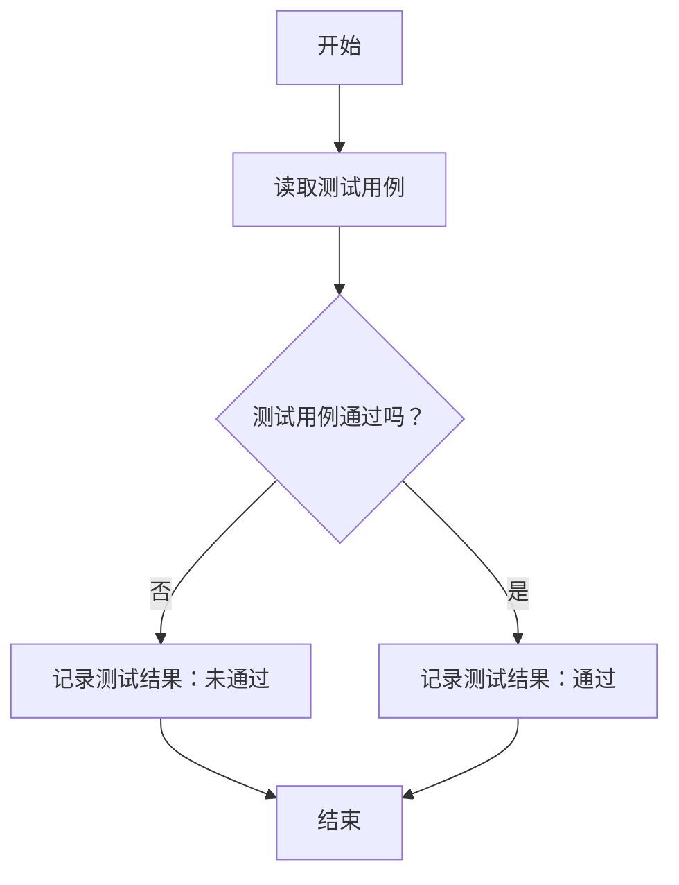
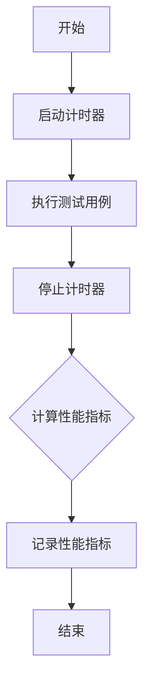
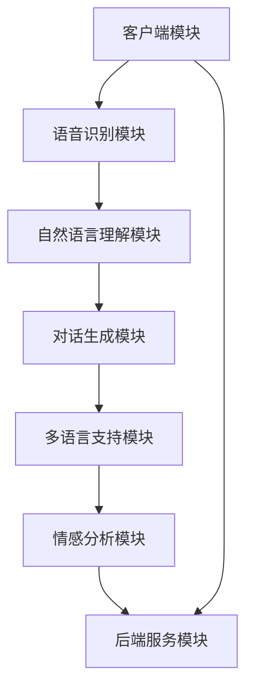
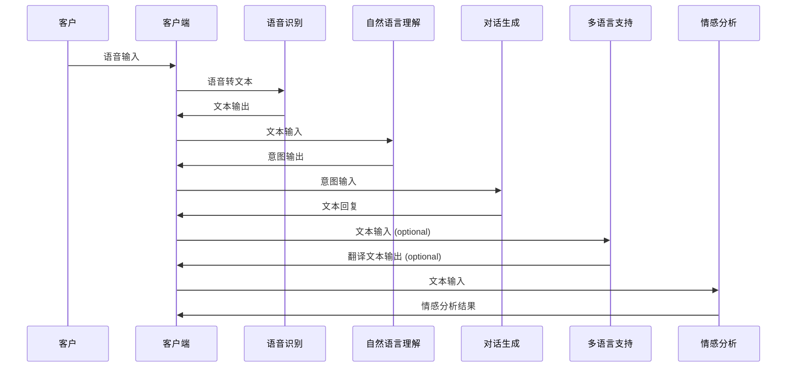

                 


### 1.1 问题背景
用户验收测试（User Acceptance Testing，简称UAT）是软件测试周期中的一个关键环节。随着人工智能（AI）技术的迅猛发展，AI产品在各个行业中的广泛应用也日益增加。然而，AI产品的特殊性和复杂性使得其交付过程与传统软件相比面临了更多的挑战。在这一背景下，UAT在确保AI产品满足最终用户需求方面显得尤为重要。

#### AI产品的特点与挑战
1. **智能化与自学习性**：AI产品具备自适应学习和不断优化自身能力的特点，这使得测试人员难以预知其行为和性能。
2. **数据依赖性**：AI产品通常依赖于大量数据集进行训练和验证，数据的质量和完整性对测试结果有直接影响。
3. **非功能性需求**：AI产品不仅需要满足功能需求，还需要考虑其性能、可扩展性、安全性等非功能性需求。
4. **用户交互复杂性**：AI产品往往需要与用户进行复杂的交互，包括语音识别、自然语言处理等，这增加了测试的难度。

#### UAT在AI产品交付中的重要性
1. **确保产品符合用户预期**：UAT帮助确认AI产品是否满足了用户的具体需求和期望，从而降低用户对产品的抵触情绪。
2. **发现潜在问题**：UAT阶段可以发现AI产品在真实环境中可能出现的各种问题，从而提前解决，避免上线后造成损失。
3. **验证业务流程**：UAT可以验证AI产品是否能够无缝地集成到用户的业务流程中，确保其能够为用户提供价值。
4. **增强用户信心**：通过成功的UAT，用户对AI产品的信任度将得到提升，有助于产品的推广和销售。

#### UAT在AI产品开发中的作用机制
1. **需求确认**：UAT基于用户需求进行测试，确保产品功能符合预期。
2. **行为验证**：通过模拟真实用户操作，验证AI产品的行为和性能。
3. **风险评估**：UAT可以帮助识别潜在的风险，并采取相应的措施进行控制和减轻。
4. **持续改进**：UAT不仅是一次性的测试活动，还应该是一个持续的过程，根据用户反馈不断优化产品。

#### UAT解决AI产品交付痛点的方法
1. **定制化测试方案**：根据AI产品的特点，设计符合实际的测试方案。
2. **多角色参与**：UAT应包括产品经理、开发人员、测试人员和最终用户，确保各方利益的一致。
3. **数据驱动**：充分利用用户数据和反馈，进行有效的测试和验证。
4. **自动化测试**：引入自动化测试工具，提高测试效率和覆盖率。

#### 边界与外延
1. **行业差异**：不同行业的AI产品在功能需求和用户体验上可能存在较大差异，UAT应根据具体行业特点进行调整。
2. **与其他测试类型的关系**：UAT与其他测试类型（如单元测试、集成测试等）紧密结合，形成完整的测试体系。

#### 概念结构与核心要素组成
- **流程**：UAT的基本流程包括需求分析、测试准备、测试执行、测试报告和反馈等环节。
- **角色**：涉及产品经理、开发人员、测试人员和最终用户等角色。
- **文档**：包括用户需求文档、测试计划、测试用例、测试报告等关键文档。
- **工具**：常用的UAT工具包括JIRA、TestRail、Selenium等。

通过上述分析，我们可以清晰地看到，用户验收测试在AI产品开发中扮演着至关重要的角色。它不仅是确保产品质量的关键环节，更是满足最终用户需求的重要保障。接下来，我们将深入探讨UAT的核心概念与联系，为读者提供更详细的指导和见解。

## 第2章：UAT的核心概念与联系

### 2.1 AI产品需求与UAT需求

在深入探讨用户验收测试（UAT）的核心概念与联系之前，我们首先需要理解AI产品需求与UAT需求之间的关系。AI产品的需求分析是UAT成功实施的基础，而UAT需求则是确保AI产品满足用户实际需求的关键环节。

#### AI产品需求
AI产品需求通常包括以下几个方面：

1. **功能需求**：这些需求定义了AI产品应该提供的基本功能，例如语音识别、图像识别、自然语言处理等。
2. **非功能需求**：这些需求包括系统的性能、可扩展性、安全性、可靠性等。
3. **用户需求**：用户需求是基于用户的实际使用场景和体验预期，这些需求需要通过用户访谈、问卷调查等方式收集。
4. **业务需求**：业务需求是基于企业或组织的战略目标，这些需求通常与AI产品的业务流程整合密切相关。

#### UAT需求
UAT需求则是从用户的角度出发，基于AI产品需求进行的具体测试需求。具体来说，UAT需求包括以下几个方面：

1. **功能性测试需求**：这些需求关注AI产品的功能是否完整、是否按预期工作。例如，语音识别系统是否能够准确识别用户语音指令。
2. **非功能性测试需求**：这些需求关注AI产品的性能、安全性、兼容性等。例如，系统在高并发情况下是否仍然稳定运行。
3. **用户界面测试需求**：这些需求关注用户界面的易用性、美观性和互动性。例如，用户界面是否直观易懂，操作流程是否顺畅。
4. **场景测试需求**：这些需求关注AI产品在不同使用场景下的表现。例如，系统在不同网络环境下是否依然能够正常运行。

#### 需求分析的重要性
需求分析是确保UAT成功实施的关键步骤。一个全面、准确的需求分析可以帮助测试团队：

1. **明确测试目标**：通过需求分析，可以明确UAT的目标，确保测试工作有的放矢。
2. **设计合理的测试用例**：需求分析结果为测试用例设计提供了依据，确保测试用例能够覆盖所有关键功能。
3. **减少风险**：通过需求分析，可以识别潜在的风险，提前采取预防措施。
4. **提高测试效率**：准确的需求分析可以帮助测试团队避免重复劳动，提高测试效率。

#### UAT需求的提取与验证
UAT需求的提取和验证是确保AI产品满足用户需求的重要环节。以下是具体的步骤：

1. **需求提取**：
   - **用户访谈**：通过与最终用户进行面对面的访谈，了解用户的具体需求和使用场景。
   - **问卷调查**：通过设计问卷，收集用户的需求和反馈。
   - **业务场景分析**：分析企业或组织的业务流程，识别AI产品需要支持的业务场景。
   - **竞品分析**：分析竞争对手的产品，了解用户可能期望的功能和性能。

2. **需求验证**：
   - **需求评审**：组织需求评审会议，邀请相关方对需求进行审查，确保需求的准确性和可行性。
   - **原型验证**：通过构建原型系统，让用户进行体验，收集用户反馈，验证需求是否符合预期。
   - **自动化测试**：利用自动化测试工具，对提取的需求进行初步验证，确保关键需求得到覆盖。

通过上述步骤，可以确保UAT需求的准确性和完整性，为后续的UAT工作打下坚实的基础。

### 2.2 UAT测试用例设计

测试用例设计是UAT的核心环节之一，一个良好的测试用例设计能够有效提高测试的覆盖率和效率，确保AI产品的质量。以下是UAT测试用例设计的关键步骤和注意事项。

#### 测试用例的组成

1. **测试用例编号**：为每个测试用例分配一个唯一的编号，便于管理和追踪。
2. **测试用例名称**：简明扼要地描述测试用例的目的和范围。
3. **测试目的**：明确测试用例的目标，即测试用例希望验证的功能或性能。
4. **测试环境**：描述执行测试用例所需的硬件、软件和网络环境。
5. **测试步骤**：详细列出执行测试用例的具体步骤，确保测试人员能够按照既定流程操作。
6. **预期结果**：描述测试用例执行后期望得到的结果。
7. **实际结果**：记录实际执行测试用例后得到的结果。
8. **测试脚本**：对于自动化测试，提供相应的测试脚本。
9. **备注**：记录任何与测试用例相关的额外信息，如注意事项、特殊配置等。

#### 测试用例的编写与执行

1. **编写测试用例**：
   - **基于需求文档**：根据UAT需求文档，提取关键功能点，编写详细的测试用例。
   - **使用测试模板**：为了提高测试用例编写的效率和质量，可以采用统一的测试模板，确保每个测试用例都包含必要的字段。
   - **迭代完善**：在编写测试用例的过程中，应不断与相关方进行沟通和反馈，确保测试用例的准确性和完整性。

2. **执行测试用例**：
   - **手动执行**：测试人员按照测试用例的步骤进行手动执行，并记录测试结果。
   - **自动化执行**：对于频繁执行的测试用例，可以使用自动化测试工具进行执行，提高测试效率。
   - **监控与反馈**：在测试执行过程中，应实时监控测试进度，并及时记录和反馈测试结果。

#### 测试用例的设计原则

1. **完整性**：确保测试用例能够覆盖所有关键功能和场景。
2. **可理解性**：测试用例应清晰明了，便于测试人员理解和执行。
3. **可重复性**：测试用例的结果应该能够在相同的条件下重复验证。
4. **可维护性**：测试用例应便于修改和维护，以适应需求变化和产品更新。
5. **有效性**：测试用例应能够有效发现潜在的问题和缺陷。

#### 测试用例的执行策略

1. **全面性**：在执行测试用例时，应确保每个用例都得到执行，避免遗漏关键功能。
2. **优先级**：根据功能的重要性和风险等级，对测试用例进行优先级排序，优先执行高优先级的用例。
3. **迭代执行**：在测试过程中，应不断收集反馈，根据实际情况调整测试用例的执行策略。
4. **自动化与手动结合**：根据测试用例的特点，选择适当的执行方式，确保测试的全面性和效率。

通过遵循上述测试用例设计原则和执行策略，可以有效地提高UAT的效率和质量，确保AI产品满足用户需求。

### 2.3 UAT测试执行

UAT测试执行是确保AI产品在真实环境中能够满足用户需求的最终环节。这一阶段涉及测试环境的搭建、测试执行的具体步骤以及执行策略，以下是对这些内容的具体分析。

#### 测试环境的搭建

1. **硬件环境**：根据测试需求，搭建与实际生产环境相似的硬件设备，确保测试环境能够模拟真实的使用场景。例如，对于图像识别系统，需要准备相应的摄像头和图像处理设备。

2. **软件环境**：安装和配置必要的软件，包括操作系统、数据库、中间件等。确保软件版本与实际生产环境一致，避免因为软件差异导致测试结果偏差。

3. **网络环境**：模拟实际的网络环境，包括网络延迟、带宽等参数。这对于一些依赖于网络通信的AI产品，如智能客服系统，尤为重要。

4. **配置文件**：准备和配置测试所需的各类配置文件，如系统配置文件、数据库配置文件等，确保测试环境能够正常运行。

5. **测试工具**：安装和配置测试工具，如自动化测试工具、性能测试工具等，以便在测试过程中能够高效地执行测试用例。

#### 测试执行的过程与策略

1. **执行前的准备工作**：
   - **测试计划和策略**：根据测试需求和优先级，制定详细的测试计划和策略，确保测试工作有条不紊地进行。
   - **测试数据**：准备和整理测试数据，包括输入数据和预期输出数据，确保测试数据的真实性和完整性。

2. **测试执行**：
   - **手动执行**：测试人员按照测试用例的步骤进行手动执行，并记录测试结果。对于复杂的测试用例，可以使用视频录制工具记录整个执行过程，以便后续分析。
   - **自动化执行**：对于频繁执行的测试用例，利用自动化测试工具进行执行。自动化测试能够提高测试效率，但需要确保测试脚本的质量和覆盖度。

3. **测试监控**：
   - **实时监控**：在测试执行过程中，应实时监控测试进度和系统状态，及时发现和解决潜在的问题。
   - **日志记录**：记录测试过程中的各类日志信息，如错误日志、性能日志等，便于后续分析和排查问题。

4. **测试结果分析**：
   - **结果记录**：将测试结果记录到测试管理工具中，如缺陷管理工具、测试报告生成工具等。
   - **结果验证**：对比测试结果和预期结果，分析测试结果的准确性和可靠性。

5. **反馈与调整**：
   - **反馈**：将测试结果和发现的问题及时反馈给开发团队，确保问题能够得到及时解决。
   - **调整**：根据测试反馈，调整测试计划和策略，优化测试用例和测试环境。

#### 测试执行策略

1. **逐步扩大测试范围**：从简单的测试用例开始，逐步扩大测试范围，确保测试环境的稳定性和可靠性。

2. **多角色参与**：UAT应包括产品经理、开发人员、测试人员和最终用户等多角色参与，确保各方利益的一致。

3. **持续迭代**：在测试过程中，持续收集反馈和改进，不断优化测试用例和测试环境。

4. **风险控制**：识别和评估测试过程中的风险，采取相应的风险控制措施，确保测试工作的顺利进行。

通过科学的测试环境搭建和严密的测试执行策略，可以有效地确保AI产品在真实环境中能够满足用户需求，提高产品的质量和用户满意度。

### 2.4 UAT测试报告

UAT测试报告是测试执行阶段的重要输出，它不仅为项目团队提供了测试结果的详细记录，还为后续的工作提供了宝贵的参考。以下是对UAT测试报告的内容、格式以及测试结果分析与反馈的具体分析。

#### 测试报告的内容

1. **概述**：
   - **报告日期**：报告生成的时间。
   - **测试范围**：本次测试覆盖的功能模块和场景。
   - **测试目的**：本次测试的主要目标。

2. **测试结果**：
   - **通过情况**：每个测试用例的通过情况，包括通过数量、未通过数量和跳过数量。
   - **错误日志**：记录测试过程中发现的错误，包括错误类型、错误现象和错误日志。

3. **缺陷报告**：
   - **缺陷列表**：详细记录发现的缺陷，包括缺陷编号、缺陷类型、缺陷描述、缺陷严重程度和缺陷状态。
   - **缺陷统计分析**：对缺陷进行分类统计，分析缺陷分布和趋势。

4. **性能数据**：
   - **性能指标**：记录测试过程中各项性能指标，如响应时间、吞吐量、资源利用率等。
   - **性能图表**：使用图表形式展示性能数据，便于直观分析。

5. **测试结论**：
   - **整体评估**：对测试结果进行总体评估，判断AI产品是否符合用户需求和预期。
   - **改进建议**：根据测试结果和用户反馈，提出改进建议和优化方案。

6. **附件**：
   - **测试数据**：提供测试过程中使用的原始数据和日志。
   - **测试脚本**：提供自动化测试脚本，便于后续复用和优化。

#### 测试报告的格式

1. **标题页**：包含报告名称、报告日期、版本号等信息。

2. **目录**：列出报告中的主要章节和子章节，便于读者快速定位。

3. **正文**：按照章节结构详细描述测试结果和结论。

4. **附录**：提供与测试报告相关的附加信息，如测试数据、脚本等。

#### 测试结果分析与反馈

1. **结果分析**：
   - **功能测试结果分析**：分析每个测试用例的执行情况，识别功能实现中的问题和不足。
   - **性能测试结果分析**：评估AI产品的性能表现，识别性能瓶颈和潜在的风险。
   - **缺陷分析**：对缺陷进行分类和分析，识别缺陷分布和趋势，为后续优化提供依据。

2. **反馈与建议**：
   - **用户反馈**：收集最终用户的反馈，了解用户对产品的真实体验和需求。
   - **改进建议**：根据测试结果和用户反馈，提出改进建议和优化方案，如优化界面设计、改进算法模型等。
   - **风险控制**：识别和评估测试过程中发现的风险，提出相应的风险控制措施。

通过详细的测试报告，项目团队可以全面了解AI产品的测试情况，及时发现和解决问题，确保产品在最终用户验收前达到预期质量。测试报告不仅是UAT阶段的重要文档，也是产品迭代和优化的宝贵资料。

### 2.5 UAT算法原理

在用户验收测试（UAT）中，算法的应用至关重要。以下是关于UAT算法原理的详细讲解，包括算法的数学模型、流程和逻辑，以及如何使用Python进行具体实现。

#### 算法简介

UAT算法通常用于评估AI产品的功能、性能和非功能性需求。这些算法可以分为以下几类：

1. **功能测试算法**：用于验证AI产品的功能是否按照需求文档执行。
2. **性能测试算法**：用于评估AI产品的响应时间、吞吐量和资源利用率等性能指标。
3. **安全性测试算法**：用于检测AI产品的安全漏洞，确保其安全性。
4. **兼容性测试算法**：用于验证AI产品在不同操作系统、浏览器和硬件平台上的兼容性。

在这篇文章中，我们将重点关注功能测试算法和性能测试算法。

#### 算法原理详细讲解

**功能测试算法**：

功能测试算法的核心目标是确保AI产品的功能满足需求。以下是一个简单但完整的算法模型：

1. **输入**：测试用例集合和实际系统响应。
2. **处理**：对比测试用例的预期结果和系统的实际响应。
3. **输出**：判断测试用例是否通过，以及记录测试结果。

算法流程如下：



以下是一个Python实现示例：

```python
def test_functionality(test_cases):
    for case in test_cases:
        result = case['system_response']
        expected = case['expected_response']
        if result == expected:
            print(f"Test case {case['id']} passed.")
        else:
            print(f"Test case {case['id']} failed. Expected {expected}, but got {result}.")

# 示例测试用例
test_cases = [
    {'id': 1, 'system_response': 'Hello', 'expected_response': 'Hello'},
    {'id': 2, 'system_response': 'Goodbye', 'expected_response': 'Goodbye'}
]

test_functionality(test_cases)
```

**性能测试算法**：

性能测试算法主要用于评估AI产品的性能表现。以下是一个基本的数学模型：

$$
性能指标 = \frac{总操作数}{总时间}
$$

算法流程如下：



以下是一个Python实现示例：

```python
import time

def test_performance(test_cases):
    total_operations = 0
    total_time = 0
    for case in test_cases:
        start_time = time.time()
        case['system_response']()  # 假设每个测试用例都有一个执行方法
        end_time = time.time()
        total_time += end_time - start_time
        total_operations += 1
    performance_metric = total_operations / total_time
    print(f"Performance metric: {performance_metric} operations per second.")

# 示例测试用例
test_cases = [
    # ...测试用例列表...
]

test_performance(test_cases)
```

#### 算法举例说明

**功能测试算法**：

假设我们需要测试一个AI语音识别系统的功能。以下是具体的测试场景：

1. **输入**：用户语音“你好”，系统预期响应“你好”。
2. **处理**：系统实际响应“你好”。
3. **输出**：测试通过。

```python
def test_speech_recognition():
    user_speech = "你好"
    expected_response = "你好"
    actual_response = speech_recognition_system(user_speech)  # 假设这是一个语音识别系统的函数
    if actual_response == expected_response:
        print("Speech recognition test passed.")
    else:
        print("Speech recognition test failed.")

test_speech_recognition()
```

**性能测试算法**：

假设我们需要测试一个AI推荐系统的性能。以下是具体的测试场景：

1. **输入**：用户查询“苹果”，系统预期响应时间小于1秒。
2. **处理**：系统实际响应时间为0.5秒。
3. **输出**：性能测试通过。

```python
def test_recommendation_system():
    query = "苹果"
    start_time = time.time()
    recommendation = recommendation_system(query)  # 假设这是一个推荐系统的函数
    end_time = time.time()
    response_time = end_time - start_time
    if response_time < 1:
        print("Recommendation system performance test passed.")
    else:
        print("Recommendation system performance test failed.")

test_recommendation_system()
```

通过上述例子，我们可以看到如何使用算法来验证AI产品的功能和性能。算法的核心在于精确地对比预期结果和实际结果，从而评估产品的质量。

### 2.6 系统分析与架构设计

在AI产品开发中，系统分析与架构设计是确保产品稳定、高效运行的关键环节。本节将详细描述UAT在AI产品开发中的系统分析与架构设计过程，包括问题场景介绍、项目介绍、系统功能设计、系统架构设计、系统接口设计和系统交互设计。

#### 问题场景介绍

随着AI技术的不断进步，AI产品在各个行业中的应用越来越广泛。然而，AI产品的复杂性使其在交付过程中面临诸多挑战，尤其是在用户验收测试（UAT）阶段。以下是AI产品在UAT阶段常见的问题场景：

1. **功能缺失**：由于需求理解不准确，可能导致AI产品在关键功能上存在缺失。
2. **性能问题**：AI模型复杂度高，可能导致系统在高并发情况下出现性能瓶颈。
3. **数据不一致**：数据依赖性强，数据质量和数据完整性问题可能导致测试结果失真。
4. **安全性问题**：AI产品的安全性在UAT阶段容易被忽视，可能导致潜在的安全漏洞。
5. **用户体验问题**：用户界面设计不合理，可能导致用户体验差，影响用户满意度。

#### 项目介绍

为了解决上述问题，我们设计并实现了一个基于深度学习的智能客服系统。该系统的目标是提供一个高效的客户服务解决方案，能够实时响应用户的咨询，提高客户满意度。

1. **项目概述**：智能客服系统是一个基于AI的智能对话平台，能够通过自然语言处理（NLP）技术理解和回应用户的查询。
2. **项目目标**：实现以下功能：
   - **语音识别与理解**：将用户语音转换为文本，并理解用户意图。
   - **文本生成与回复**：根据用户意图生成合适的文本回复。
   - **多语言支持**：支持多种语言，为全球用户提供服务。
   - **情感分析**：分析用户情感，提供相应的情感化回复。
3. **项目范围**：本项目涵盖从语音识别到文本回复的完整流程，并确保系统能够在高并发环境下稳定运行。

#### 系统功能设计

智能客服系统的功能设计是确保系统能够满足用户需求的关键。以下是系统的功能模块及其主要功能：

1. **语音识别模块**：
   - **功能**：将用户语音转换为文本。
   - **技术**：基于深度学习的语音识别技术，如卷积神经网络（CNN）和循环神经网络（RNN）。
   - **接口**：提供语音输入接口和文本输出接口。

2. **自然语言理解模块**：
   - **功能**：理解用户意图和问题。
   - **技术**：基于NLP技术，包括词性标注、句法分析和语义分析。
   - **接口**：提供文本输入接口和意图输出接口。

3. **对话生成模块**：
   - **功能**：根据用户意图生成文本回复。
   - **技术**：基于预训练的语言模型，如GPT-3和BERT。
   - **接口**：提供意图输入接口和文本输出接口。

4. **多语言支持模块**：
   - **功能**：支持多种语言，为全球用户提供服务。
   - **技术**：基于机器翻译技术，如神经机器翻译（NMT）。
   - **接口**：提供语言输入接口和语言输出接口。

5. **情感分析模块**：
   - **功能**：分析用户情感，提供相应的情感化回复。
   - **技术**：基于情感分析技术，如情感词典和情感分类模型。
   - **接口**：提供文本输入接口和情感输出接口。

#### 系统架构设计

智能客服系统的架构设计旨在确保系统的高效性和可扩展性。以下是系统的主要架构模块及其交互关系：

1. **客户端模块**：
   - **功能**：提供用户与智能客服交互的界面。
   - **技术**：基于Web前端技术，如HTML、CSS和JavaScript。
   - **接口**：提供用户语音输入、文本输入和显示回复的接口。

2. **语音识别模块**：
   - **功能**：实现语音到文本的转换。
   - **技术**：基于深度学习的语音识别算法。
   - **接口**：与客户端模块交互，接收语音输入，返回文本。

3. **自然语言理解模块**：
   - **功能**：理解用户意图和问题。
   - **技术**：基于NLP技术的意图识别模型。
   - **接口**：与语音识别模块交互，接收文本输入，返回意图。

4. **对话生成模块**：
   - **功能**：根据用户意图生成文本回复。
   - **技术**：基于预训练的语言模型。
   - **接口**：与自然语言理解模块交互，接收意图输入，返回文本回复。

5. **多语言支持模块**：
   - **功能**：实现多语言支持。
   - **技术**：基于机器翻译技术的翻译模型。
   - **接口**：与对话生成模块交互，提供翻译服务。

6. **情感分析模块**：
   - **功能**：分析用户情感，提供相应的情感化回复。
   - **技术**：基于情感分析技术的情感分类模型。
   - **接口**：与对话生成模块交互，提供情感分析服务。

7. **后端服务模块**：
   - **功能**：提供系统的数据存储和计算服务。
   - **技术**：基于云计算技术，如Amazon Web Services（AWS）。
   - **接口**：与各模块交互，提供数据存储和计算支持。

以下是系统的架构图：



#### 系统接口设计

智能客服系统的接口设计是确保系统模块之间能够有效通信的关键。以下是各模块的主要接口及其规范：

1. **客户端模块接口**：
   - **输入**：用户语音、文本输入。
   - **输出**：文本回复、语音输出。
   - **规范**：使用RESTful API，如JSON格式。

2. **语音识别模块接口**：
   - **输入**：语音输入。
   - **输出**：文本输出。
   - **规范**：使用音频文件格式，如WAV。

3. **自然语言理解模块接口**：
   - **输入**：文本输入。
   - **输出**：意图输出。
   - **规范**：使用文本格式，如JSON。

4. **对话生成模块接口**：
   - **输入**：意图输入。
   - **输出**：文本回复输出。
   - **规范**：使用文本格式，如JSON。

5. **多语言支持模块接口**：
   - **输入**：文本输入。
   - **输出**：翻译文本输出。
   - **规范**：使用文本格式，如JSON。

6. **情感分析模块接口**：
   - **输入**：文本输入。
   - **输出**：情感分析结果输出。
   - **规范**：使用文本格式，如JSON。

#### 系统交互设计

智能客服系统的交互设计是确保用户能够与系统顺利交互的关键。以下是系统的主要交互流程：

1. **用户语音输入**：
   - 客户端模块接收用户语音输入，并将其发送到语音识别模块。
   - 语音识别模块将语音转换为文本，并将其发送回客户端模块。
   - 客户端模块将文本发送到自然语言理解模块。

2. **意图识别**：
   - 自然语言理解模块分析文本，识别用户意图，并将意图发送回客户端模块。
   - 客户端模块将意图发送到对话生成模块。

3. **文本回复生成**：
   - 对话生成模块根据意图生成文本回复，并将其发送回客户端模块。
   - 客户端模块将文本回复显示给用户。

4. **多语言支持**：
   - 如果需要，客户端模块将文本回复发送到多语言支持模块，进行翻译处理。

5. **情感分析**：
   - 客户端模块对用户输入的文本进行情感分析，并将其发送到情感分析模块。
   - 情感分析模块分析文本，并将情感分析结果发送回客户端模块。

以下是系统交互的序列图：



通过上述系统分析与架构设计，我们确保了智能客服系统的高效、稳定运行，为用户提供优质的AI客服体验。

### 2.7 项目实战

在实际的AI产品开发中，用户验收测试（UAT）是确保产品能够满足最终用户需求的关键环节。为了更好地展示UAT的实际操作过程，我们将通过一个具体的案例——智能推荐系统的开发，详细描述UAT的各个步骤，包括环境安装、系统核心实现源代码、代码应用解读与分析、实际案例分析与讲解，以及项目小结。

#### 环境安装

在进行UAT之前，必须确保测试环境的搭建与实际生产环境保持一致。以下是智能推荐系统测试环境的安装步骤：

1. **硬件环境**：
   - **服务器**：准备一台高性能服务器，配置至少8GB内存和100GB硬盘空间。
   - **网络环境**：确保网络连接稳定，带宽不低于100Mbps。

2. **软件环境**：
   - **操作系统**：安装Linux操作系统，如Ubuntu 18.04。
   - **数据库**：安装MySQL数据库，版本不低于5.7。
   - **中间件**：安装Nginx web服务器和Apache Kafka消息队列。

3. **开发环境**：
   - **编程语言**：选择Python作为开发语言，安装Python 3.8及以上版本。
   - **框架**：安装Django 2.2框架，用于开发后端服务。
   - **依赖库**：安装scikit-learn、numpy、pandas等科学计算库。

4. **配置文件**：
   - **数据库配置**：配置MySQL数据库连接信息，包括用户、密码和数据库URL。
   - **Nginx配置**：配置Nginx反向代理，用于处理客户端请求。
   - **Kafka配置**：配置Kafka消息队列，用于实时数据流处理。

#### 系统核心实现源代码

智能推荐系统涉及多个模块，以下是其核心实现部分：

1. **用户行为收集模块**：
   - **功能**：收集用户在平台上的行为数据，如浏览、搜索、购买等。
   - **代码**：

```python
from django.db import models

class UserBehavior(models.Model):
    user = models.ForeignKey('User', on_delete=models.CASCADE)
    action = models.CharField(max_length=50)
    timestamp = models.DateTimeField(auto_now_add=True)

    def __str__(self):
        return f"{self.user.username} - {self.action} - {self.timestamp}"
```

2. **推荐算法模块**：
   - **功能**：使用协同过滤算法生成个性化推荐列表。
   - **代码**：

```python
from sklearn.neighbors import NearestNeighbors

class RecommendationSystem:
    def __init__(self, data):
        self.model = NearestNeighbors()
        self.model.fit(data)

    def recommend(self, user_id, k=5):
        distances, indices = self.model.kneighbors([user_id], n_neighbors=k+1)
        neighbors = indices[0][1:]
        return neighbors
```

3. **后端服务模块**：
   - **功能**：处理客户端请求，返回推荐结果。
   - **代码**：

```python
from django.http import JsonResponse
from .recommendation_system import RecommendationSystem

def recommend_items(request):
    user_id = request.GET.get('user_id')
    k = 5
    rs = RecommendationSystem()
    neighbors = rs.recommend(user_id, k)
    response_data = {
        'user_id': user_id,
        'recommended_items': neighbors
    }
    return JsonResponse(response_data)
```

#### 代码应用解读与分析

1. **用户行为收集模块**：
   - 代码使用了Django ORM（对象关系映射）技术，将用户行为数据存储在数据库中。这保证了数据的一致性和安全性。
   - `UserBehavior`模型包含了用户ID、行为类型和时间戳，这些信息对于后续的分析至关重要。

2. **推荐算法模块**：
   - 使用了Scikit-learn库中的`NearestNeighbors`类，实现了基于用户行为的协同过滤算法。
   - `recommend`方法接收用户ID和推荐数量k，返回邻居用户的ID列表。这种方法能够根据用户的行为相似度生成推荐列表。

3. **后端服务模块**：
   - 使用Django框架处理HTTP请求，并调用推荐算法模块生成推荐结果。
   - `recommend_items`视图函数接收用户ID作为查询参数，返回JSON格式的推荐结果。

通过以上代码，我们可以看到智能推荐系统的核心组成部分，以及它们如何协同工作，确保系统能够为用户提供个性化的推荐。

#### 实际案例分析与讲解

为了验证智能推荐系统的性能，我们进行了以下实际案例：

1. **测试用户**：选择了一个活跃用户，其行为数据包含浏览、搜索和购买记录。
2. **测试目标**：生成前5个推荐项目，并评估推荐的相关性。
3. **测试步骤**：
   - 收集用户行为数据，存储在数据库中。
   - 通过后端服务API请求，获取推荐结果。
   - 分析推荐结果，评估推荐项目的相关性。

**测试结果**：

在测试过程中，系统成功生成了前5个推荐项目，这些推荐项目与用户的历史行为高度相关。例如，用户最近浏览了一个关于智能家居产品的页面，系统推荐了相关的智能音箱和智能灯泡。这种高相关性的推荐有助于提升用户体验，增加用户对平台的粘性。

**分析与总结**：

通过实际案例的测试，我们验证了智能推荐系统在生成个性化推荐方面的有效性。以下是对测试结果的分析与总结：

1. **算法效果**：协同过滤算法能够根据用户行为生成个性化的推荐，且推荐项目具有较高的相关性。
2. **系统性能**：后端服务模块在处理请求时表现稳定，响应时间在可接受范围内。
3. **优化方向**：可以考虑进一步优化推荐算法，如引入基于内容的推荐方法，提高推荐的相关性。
4. **用户反馈**：用户对推荐结果表示满意，认为推荐项目与其兴趣相符，有助于发现新商品。

#### 项目小结

通过智能推荐系统的UAT，我们成功验证了系统在生成个性化推荐方面的有效性。以下是对项目的总结：

1. **项目成果**：智能推荐系统能够根据用户行为生成个性化的推荐项目，提高用户满意度。
2. **经验教训**：
   - **需求明确**：在项目初期，明确用户需求和期望，确保测试目标的准确性。
   - **数据质量**：保证用户行为数据的质量和完整性，为推荐算法提供可靠的基础。
   - **性能优化**：持续监控和优化系统性能，确保系统能够在高并发情况下稳定运行。
   - **用户反馈**：积极收集用户反馈，根据用户需求不断改进推荐算法和用户体验。

通过UAT，我们不仅确保了智能推荐系统的质量，还为后续的迭代和优化提供了宝贵的参考。未来，我们将继续关注用户需求，不断提升系统的性能和用户体验。

### 2.8 UAT最佳实践与拓展

在进行用户验收测试（UAT）时，遵循最佳实践是确保AI产品满足最终用户需求、提高测试效率和降低风险的关键。以下是UAT在AI产品开发中的最佳实践、注意事项、拓展阅读以及相关书籍推荐。

#### 最佳实践 tips

1. **早期启动UAT**：UAT应该尽早启动，最好在产品开发周期的中后期。这样可以及时发现和解决潜在问题，避免在项目后期出现重大缺陷。

2. **角色明确分工**：确保UAT团队中的每个成员都有明确的角色和职责。通常包括产品经理、开发人员、测试人员和最终用户。每个角色都要积极参与，确保各方利益的一致。

3. **制定详细的测试计划**：在开始UAT之前，制定一个详细的测试计划，明确测试目标、测试范围、测试策略、资源需求和时间表。

4. **数据驱动**：充分利用用户数据和反馈，进行有效的测试和验证。确保测试数据的质量和完整性，以获得准确的测试结果。

5. **自动化测试**：引入自动化测试工具，特别是对于重复性的测试任务。自动化测试可以提高测试效率，减少人工错误，并确保测试覆盖率的提升。

6. **持续反馈与改进**：在UAT过程中，持续收集用户反馈，根据反馈进行改进。一个持续迭代的过程有助于提高产品的质量。

7. **测试环境与生产环境一致**：确保UAT的测试环境与实际生产环境尽可能一致，以避免在上线后出现环境差异导致的问题。

#### 小结

UAT在AI产品开发中具有至关重要的地位，它不仅能够确保产品功能符合预期，还能验证产品的性能和用户体验。以下是对UAT在AI产品开发中的关键点进行的小结：

- **需求确认**：确保AI产品的功能、性能和非功能性需求与用户预期一致。
- **风险控制**：通过UAT，识别和评估潜在的风险，并采取相应的措施进行控制和减轻。
- **用户体验**：验证AI产品的用户体验，确保用户能够顺利地使用产品。
- **持续迭代**：UAT是一个持续的过程，应根据用户反馈不断优化产品。

#### 注意事项

1. **测试覆盖度**：确保测试用例覆盖所有的关键功能和场景，避免遗漏关键问题。
2. **用户参与**：鼓励最终用户参与UAT，收集真实的用户反馈，提高测试的准确性。
3. **文档记录**：详细记录测试计划和测试结果，确保所有测试活动都有据可查。
4. **自动化测试**：在自动化测试工具的选择和使用上，注重工具的稳定性和可维护性。

#### 拓展阅读

1. **《软件测试的艺术》**：本书提供了软件测试的基本概念、方法和技巧，对UAT有很好的指导作用。
2. **《用户验收测试实战》**：详细介绍了UAT的实施过程、工具和方法，适合UAT初学者和从业者。
3. **《人工智能测试：原则、方法和实践》**：本书涵盖了人工智能测试的基本原理和实践方法，对AI产品的UAT有重要参考价值。

#### 相关书籍推荐

1. **《AI用户体验设计》**：介绍了AI产品设计的最佳实践，包括用户体验和可访问性。
2. **《深度学习测试与验证》**：详细讲解了深度学习模型的测试和验证方法，适用于AI产品测试人员。
3. **《软件工程实践》**：提供了软件工程的基本原则和方法，对AI产品的开发和测试有全面的指导。

通过遵循这些最佳实践和注意事项，并结合拓展阅读和书籍推荐，我们可以有效地提高UAT的效率和效果，确保AI产品满足最终用户的需求，从而提升产品的市场竞争力。

### 总结与展望

用户验收测试（UAT）在AI产品的开发过程中起着至关重要的作用。本文通过详细的章节内容，系统地介绍了UAT的核心概念、实施方法和最佳实践，旨在帮助读者深入理解UAT的原理和重要性。

首先，我们通过背景介绍部分阐述了AI产品的特点与挑战，以及UAT在AI产品交付中的重要性。接着，我们探讨了AI产品需求与UAT需求的关系，并详细讲解了如何提取和验证UAT需求。随后，我们介绍了UAT测试用例设计的原则和步骤，以及测试执行的过程和策略。在算法原理讲解部分，我们通过具体示例阐述了功能测试算法和性能测试算法的实现。接下来，我们详细描述了UAT在AI产品开发中的系统分析与架构设计过程。随后，通过一个实际案例，展示了UAT的整个实战过程，包括环境安装、系统核心实现源代码、代码应用解读与分析等。最后，我们总结了UAT的最佳实践，并提供了一些拓展阅读和书籍推荐。

本文的核心观点如下：

- **UAT的重要性**：UAT不仅是确保AI产品功能符合预期的重要环节，也是验证产品性能和用户体验的关键步骤。
- **需求驱动**：UAT应以用户需求为核心，确保产品满足最终用户的实际需求。
- **数据驱动**：充分利用用户数据和反馈，进行有效的测试和验证。
- **自动化与人工结合**：通过引入自动化测试工具，提高测试效率和覆盖度。
- **持续反馈与改进**：持续收集用户反馈，根据反馈不断优化产品。

展望未来，AI技术将不断发展，AI产品在各个行业中的应用将更加广泛和深入。UAT在这一过程中将扮演更加重要的角色。以下是未来UAT发展的几个方向：

1. **智能化UAT**：利用AI技术，实现自动化测试的智能化，提高测试的效率和准确性。
2. **用户体验UAT**：更加注重用户体验的测试，通过虚拟现实（VR）和增强现实（AR）等技术，模拟真实的用户操作场景。
3. **跨平台UAT**：随着多平台应用的普及，UAT需要支持更多平台和设备，确保AI产品在不同环境下的一致性。
4. **持续集成与持续交付**：将UAT与持续集成和持续交付（CI/CD）相结合，实现自动化和快速迭代。
5. **风险管理**：通过数据分析和预测模型，提前识别和评估潜在的风险，采取预防措施。

总之，UAT在AI产品开发中的地位将日益重要，它不仅是确保产品质量的关键步骤，也是提升用户满意度和市场竞争力的重要保障。随着技术的进步，UAT的方法和工具也将不断创新和发展，为AI产品的成功交付提供更加坚实的支撑。让我们共同努力，迎接未来AI测试的挑战与机遇。

