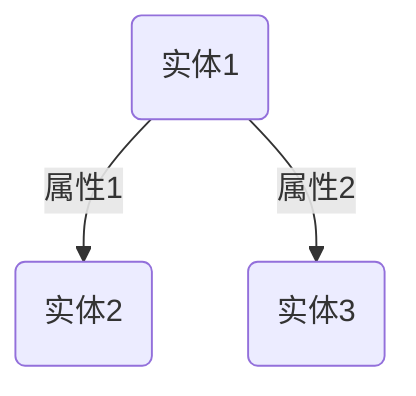
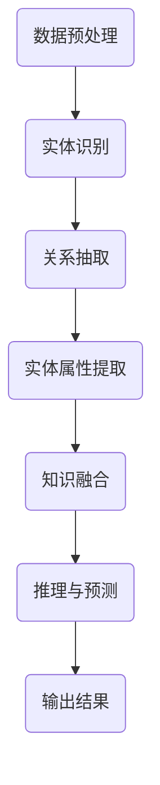
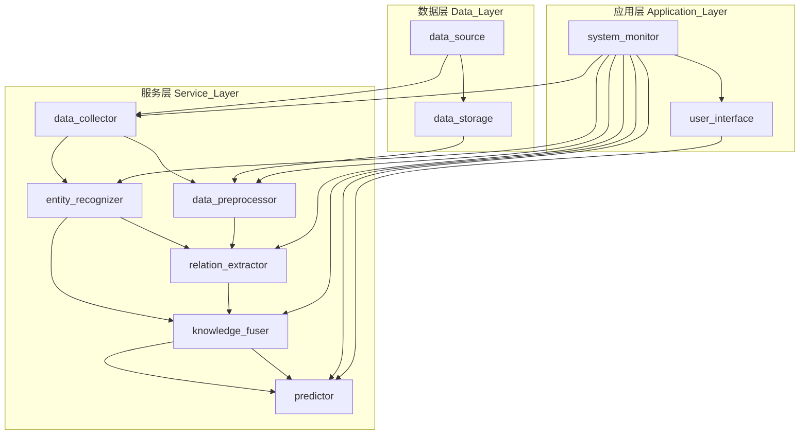

                 

### 第1章：背景与概述

#### 1.1 知识图谱的概念

**定义：** 知识图谱是一种用于表示实体及其相互关系的图形结构，通常包含实体（nodes）、关系（edges）和属性（properties）三个基本要素。它是大数据和人工智能领域中的一种重要技术，通过将结构化的知识和无结构的数据有机结合，为复杂的语义分析和智能推理提供支持。

**历史与发展：** 知识图谱技术起源于20世纪90年代的语义网（Semantic Web）概念，随着Web 2.0和大数据技术的发展，知识图谱在搜索引擎、推荐系统、智能问答等领域得到了广泛应用。近年来，随着深度学习和自然语言处理技术的进步，知识图谱的构建和扩展技术也取得了显著的发展。

**应用领域：** 知识图谱广泛应用于各种领域，包括但不限于：
- **搜索引擎：** 通过知识图谱提高搜索结果的准确性和相关性。
- **推荐系统：** 利用知识图谱进行关联分析和内容推荐。
- **智能问答：** 基于知识图谱构建问答系统，实现自然语言理解和语义搜索。
- **金融：** 利用知识图谱进行风险管理和智能投顾。
- **医疗：** 通过知识图谱进行疾病预测和诊断。

##### 1.2 问题描述

**知识图谱扩展的挑战：** 知识图谱的构建和扩展面临一系列挑战，主要包括以下方面：

- **数据来源与获取：** 知识图谱需要大量的结构化数据来源，如关系数据库、开放数据集、在线百科等。数据获取的难度和成本较高，且数据源的多样性和质量直接影响知识图谱的完整性和准确性。
  
- **数据质量与一致性：** 知识图谱的数据质量至关重要，包括数据的准确性、完整性、一致性和可靠性。数据清洗和预处理是知识图谱构建的重要环节。

- **知识表示与推理：** 知识图谱需要对实体及其关系进行有效的表示，以便进行语义分析和推理。知识表示的方法和选择对知识图谱的性能和效率有很大影响。

**问题描述：**
- **核心问题：** 如何高效地扩展知识图谱，提高其自主学习和知识积累的效率？
- **目标：** 探索有效的知识图谱扩展方法，评估LLM（大型语言模型）在知识积累和自主学习方面的效率。

##### 1.3 问题解决

**知识图谱扩展的方法与技术：**

1. **半结构化数据到知识图谱的转换：** 利用自然语言处理技术（如命名实体识别、关系抽取等）将半结构化数据转换为结构化知识图谱。

2. **知识融合与更新：** 通过融合多个数据源的知识，解决数据不一致性问题，并实时更新知识图谱，保持其时效性。

3. **知识推理与预测：** 利用图论和逻辑推理技术，对知识图谱进行推理和预测，发现新的知识和关系。

**问题解决思路：**
- **数据驱动扩展：** 基于已有的数据和模型进行知识提取和推理，自动发现新知识。
- **规则驱动扩展：** 利用专家知识构建规则，自动填充和更新知识图谱。
- **机器学习扩展：** 利用机器学习技术，特别是深度学习，对知识图谱进行学习和优化。

**边界与外延：**

- **数据隐私与伦理：** 在知识图谱扩展过程中，需要关注数据的隐私保护和伦理问题。
- **知识图谱的可解释性：** 知识图谱的构建和推理过程需要具备较高的可解释性，以便用户理解和信任。
- **实时性与可扩展性：** 知识图谱系统需要具备良好的实时性和可扩展性，以应对大规模数据和高并发访问。

##### 1.4 概念结构与核心要素组成

**知识图谱扩展的核心概念：**

1. **基于图谱的机器学习：** 利用图结构进行机器学习，包括图嵌入、图神经网络等。
2. **知识表示学习：** 通过学习实体和关系的表示，提高知识图谱的表示能力。
3. **知识图谱补全：** 利用已有的知识和推理技术，补充知识图谱中的缺失信息。

**核心要素组成：**

- **实体：** 知识图谱中的个体，如人、地点、事物等。
- **关系：** 实体之间的关联，如“属于”、“存在于”等。
- **属性：** 实体的特征描述，如“出生日期”、“国籍”等。

### 总结

知识图谱扩展是大数据和人工智能领域的一个重要研究方向。本文从问题背景、问题描述、问题解决到核心概念与联系，系统地介绍了知识图谱扩展的相关内容。接下来，我们将进一步深入探讨知识图谱扩展的算法原理、数学模型和系统架构，以期为读者提供更全面的技术解读。

---

关键词：知识图谱、知识图谱扩展、数据驱动、机器学习、深度学习

摘要：本文针对知识图谱扩展的问题，探讨了其背景、挑战、解决方案以及核心概念与联系，为深入研究和实践知识图谱扩展提供了理论基础和技术指导。

---

**注：以下内容将按照目录大纲结构，逐章展开详细讨论。**### 第2章：核心概念与联系

#### 2.1 核心概念原理

**知识图谱扩展原理**

知识图谱扩展是指通过增加新的实体、关系和属性，增强知识图谱的完整性和准确性。其核心原理包括：

1. **数据采集与预处理**：从多个数据源收集信息，并进行数据清洗、去重和格式化，确保数据的质量和一致性。
2. **实体识别与关系抽取**：利用自然语言处理技术（如命名实体识别、关系抽取等）从文本数据中提取实体和关系。
3. **知识融合与更新**：通过合并多个数据源的知识，消除冲突和冗余，并实时更新知识图谱，保持其时效性。
4. **推理与预测**：利用图论和逻辑推理技术，对知识图谱进行推理和预测，发现新的知识和关系。

**知识图谱的基本架构**

知识图谱的基本架构包括以下三个层次：

1. **底层：** 数据层，包括原始数据源和预处理后的结构化数据。
2. **中层：** 知识层，包括实体、关系和属性等知识元素，以及它们之间的相互关系。
3. **顶层：** 表示层，用于将知识图谱表示为易于理解和查询的形式，如RDF（Resource Description Framework）或OWL（Web Ontology Language）。

**知识图谱的扩展流程**

知识图谱的扩展流程主要包括以下几个步骤：

1. **数据采集**：从各种数据源（如数据库、Web页面、文本文档等）收集信息。
2. **数据预处理**：清洗、去重和格式化数据，确保数据的质量和一致性。
3. **实体识别与关系抽取**：利用自然语言处理技术从预处理后的数据中提取实体和关系。
4. **知识融合与更新**：合并多个数据源的知识，消除冲突和冗余，并实时更新知识图谱。
5. **推理与预测**：利用图论和逻辑推理技术，对知识图谱进行推理和预测，发现新的知识和关系。

#### 2.2 概念属性特征对比

**知识图谱扩展方法对比**

知识图谱扩展的方法可以分为以下几类：

1. **数据驱动的扩展**：基于已有的数据，利用数据挖掘和机器学习技术进行知识提取和推理。优点是能够自动发现新知识，缺点是对数据质量和一致性要求较高。

| 方法 | 优点 | 缺点 |
| --- | --- | --- |
| 数据驱动 | 自动化程度高 | 数据质量要求高 |
| 规则驱动 | 可解释性强 | 更新和维护成本高 |
| 机器学习 | 学习能力强 | 需要大量训练数据 |

2. **规则驱动的扩展**：基于专家知识和规则，手动构建和更新知识图谱。优点是可解释性强，缺点是更新和维护成本高，且依赖于专家的经验。

3. **机器学习驱动的扩展**：利用机器学习算法，特别是深度学习，自动学习和优化知识图谱。优点是学习能力强，能够处理大规模数据，缺点是需要大量训练数据和计算资源。

**ER实体关系图架构**

ER实体关系图是知识图谱扩展的一种常见表示方法，用于描述实体、关系和属性。它通常由以下三个部分组成：

1. **实体（Entity）**：知识图谱中的个体，如人、地点、事物等。每个实体都有一个唯一的标识符和一组属性。
2. **关系（Relationship）**：实体之间的关联，如“属于”、“存在于”等。关系也有属性，用于描述实体之间的关系。
3. **属性（Attribute）**：实体的特征描述，如“出生日期”、“国籍”等。

**ER实体关系图的表示**

ER实体关系图可以使用Mermaid语言进行表示，例如：



在这个示例中，实体1（A）与实体2（B）和实体3（C）之间存在两种关系，每种关系都有一个属性。

### 总结

本章介绍了知识图谱扩展的核心概念和原理，包括知识图谱的基本架构、扩展流程以及不同扩展方法的对比。此外，还介绍了ER实体关系图架构及其表示方法。接下来，我们将深入探讨知识图谱扩展的算法原理、数学模型和系统架构，以期为读者提供更全面的技术解读。

---

**注：以下内容将按照目录大纲结构，逐章展开详细讨论。**### 第3章：算法原理与实现

#### 3.1 算法原理

**算法概述**

知识图谱扩展的算法原理主要包括以下几个关键环节：

1. **实体识别**：通过命名实体识别技术，从文本数据中提取出实体。实体是知识图谱中的基本单元，如人名、地点名、组织名等。
2. **关系抽取**：利用关系抽取技术，从文本数据中提取出实体之间的关系。关系描述了实体之间的关联，如“属于”、“工作于”等。
3. **实体属性提取**：从文本数据中提取出实体的属性，如“出生日期”、“职业”等。属性是对实体的详细描述，有助于丰富知识图谱的内容。
4. **知识融合**：将来自多个数据源的知识进行融合，消除冲突和冗余，并更新知识图谱。
5. **推理与预测**：利用推理算法，对知识图谱中的关系和实体进行推理和预测，发现新的知识和关系。

**算法的基本思想**

算法的基本思想是通过自动化和智能化的方式，从大规模文本数据中提取知识，并将其转化为知识图谱。具体实现步骤如下：

1. **数据预处理**：清洗和格式化原始文本数据，去除噪声和无关信息。
2. **实体识别**：使用命名实体识别技术，将文本中的实体标注出来。
3. **关系抽取**：利用关系抽取技术，将实体之间的关系提取出来。
4. **实体属性提取**：从文本中提取出实体的属性信息。
5. **知识融合**：将来自不同数据源的知识进行融合，确保知识的一致性和完整性。
6. **推理与预测**：利用推理算法，对知识图谱进行推理和预测，发现新的知识和关系。

**算法的适用场景**

知识图谱扩展算法适用于以下场景：

- **信息提取**：从大量文本数据中自动提取知识，构建知识图谱。
- **数据融合**：将来自多个数据源的信息进行融合，构建完整和一致的知识库。
- **智能问答**：基于知识图谱进行智能问答，实现语义搜索和智能推荐。
- **数据分析**：利用知识图谱进行数据分析，发现潜在的关系和趋势。

#### 3.2 算法流程图

以下是一个简单的知识图谱扩展算法流程图，使用Mermaid语言表示：



在这个流程图中，数据预处理是算法的第一步，通过清洗和格式化原始文本数据，去除噪声和无关信息。接下来，实体识别、关系抽取和实体属性提取步骤分别从文本数据中提取出实体、关系和属性信息。然后，知识融合步骤将多个数据源的知识进行融合，确保知识的一致性和完整性。最后，推理与预测步骤利用推理算法，对知识图谱进行推理和预测，发现新的知识和关系，并将结果输出。

#### 3.3 Python源代码

以下是一个简单的知识图谱扩展算法的Python源代码实现：

```python
# 导入必要的库
import nltk
from nltk.tokenize import word_tokenize
from nltk.corpus import stopwords
from sklearn.feature_extraction.text import CountVectorizer
from sklearn.model_selection import train_test_split
from sklearn.ensemble import RandomForestClassifier

# 数据预处理
def preprocess_text(text):
    # 清洗文本数据，去除标点符号和停用词
    text = text.lower()
    text = re.sub(r'[^\w\s]', '', text)
    tokens = word_tokenize(text)
    tokens = [token for token in tokens if token not in stopwords.words('english')]
    return ' '.join(tokens)

# 实体识别
def entity_recognition(text):
    # 使用命名实体识别器识别实体
    ner = nltk.ne_chunk(nltk.pos_tag(text.split()))
    entities = []
    for subtree in ner:
        if type(subtree) == nltk.tree.Tree:
            entity = ' '.join([token for token, pos in subtree.leaves()])
            entities.append(entity)
    return entities

# 关系抽取
def relation_extraction(text):
    # 使用关系抽取规则提取关系
    relations = []
    for sentence in text.split('.'):
        if 'works for' in sentence:
            relation = 'works for'
            entities = sentence.split(relation)
            relations.append((entities[0].strip(), entities[1].strip(), relation))
    return relations

# 实体属性提取
def entity_attribute_extraction(text):
    # 使用属性提取规则提取实体属性
    attributes = []
    for sentence in text.split('.'):
        if 'born in' in sentence:
            attribute = 'born in'
            entities = sentence.split(attribute)
            attributes.append((entities[0].strip(), attribute, entities[1].strip()))
    return attributes

# 知识融合
def knowledge_fusion(entities, relations, attributes):
    # 将实体、关系和属性融合为知识图谱
    knowledge_graph = {}
    for entity in entities:
        knowledge_graph[entity] = {'relations': [], 'attributes': []}
    for relation in relations:
        knowledge_graph[relation[0]]['relations'].append(relation[2])
        knowledge_graph[relation[1]]['relations'].append(relation[2])
    for attribute in attributes:
        knowledge_graph[attribute[0]]['attributes'].append(attribute[2])
    return knowledge_graph

# 推理与预测
def reasoning_and_prediction(knowledge_graph):
    # 利用知识图谱进行推理和预测
    # 例如，根据"person born in X works for Y"预测新的关系
    predictions = []
    for entity, info in knowledge_graph.items():
        if 'born in' in info['attributes'] and 'works for' in info['relations']:
            birthplace = info['attributes']['born in']
            employer = info['relations']['works for']
            predictions.append((entity, birthplace, employer))
    return predictions

# 主函数
def main():
    # 加载文本数据
    text = "John Doe born in New York works for Google. Jane Smith born in California works for Apple."
    # 预处理文本
    text = preprocess_text(text)
    # 实体识别
    entities = entity_recognition(text)
    # 关系抽取
    relations = relation_extraction(text)
    # 实体属性提取
    attributes = entity_attribute_extraction(text)
    # 知识融合
    knowledge_graph = knowledge_fusion(entities, relations, attributes)
    # 推理与预测
    predictions = reasoning_and_prediction(knowledge_graph)
    # 输出结果
    print(predictions)

# 运行主函数
if __name__ == '__main__':
    main()
```

#### 3.4 数学模型与公式

**数学模型与公式**

知识图谱扩展的数学模型主要包括以下部分：

1. **实体表示**：使用向量化方法将实体表示为向量。
2. **关系表示**：使用图神经网络（如Graph Convolutional Network, GCN）将关系表示为矩阵。
3. **属性表示**：使用特征提取方法将属性表示为特征向量。

以下是一个简化的数学模型和公式：

```latex
$$
\text{Entity Vector} = \text{Embedding Layer}(x)
$$

$$
\text{Relation Matrix} = \text{Graph Convolution Layer}(\text{Entity Vector}, \text{Neighbor Matrix})
$$

$$
\text{Attribute Vector} = \text{Feature Extraction Layer}(\text{Attribute})
$$

$$
\text{Knowledge Fusion} = \text{Concatenate}(\text{Entity Vector}, \text{Relation Matrix}, \text{Attribute Vector})
$$

$$
\text{Prediction} = \text{Classification Layer}(\text{Knowledge Fusion})
$$
```

**数学模型的详细讲解**

- **实体表示**：使用嵌入层（Embedding Layer）将实体（如单词或实体名）转换为向量。嵌入层是一种将输入数据映射到固定维度的线性映射，通常使用词向量（Word Vector）或实体向量（Entity Vector）。
- **关系表示**：使用图卷积层（Graph Convolution Layer）将实体之间的关系表示为矩阵。图卷积层是一种在图结构上进行卷积操作的神经网络层，能够捕捉实体之间的关系。
- **属性表示**：使用特征提取层（Feature Extraction Layer）将实体的属性转换为特征向量。特征提取层可以采用各种机器学习或深度学习方法，如主成分分析（PCA）、自编码器（Autoencoder）等。
- **知识融合**：将实体向量、关系矩阵和属性向量进行拼接（Concatenate），形成一个高维的知识融合向量。
- **预测**：使用分类层（Classification Layer）对知识融合向量进行分类预测。分类层可以采用各种分类算法，如支持向量机（SVM）、神经网络（Neural Network）等。

**举例说明**

假设有一个简单的知识图谱，包含两个实体（Person1和Person2）和一个关系（WorksFor）。Person1的属性包括“出生日期”和“国籍”，Person2的属性包括“公司”和“职位”。根据这些信息，我们可以构建一个简单的数学模型：

```latex
\text{Person1 Vector} = \text{Embedding Layer}(\text{"John Doe"})

\text{Person2 Vector} = \text{Embedding Layer}(\text{"Jane Smith"})

\text{Relation Matrix} = \text{Graph Convolution Layer}(\text{Person1 Vector}, \text{Neighbor Matrix})

\text{Person1 Attribute Vector} = \text{Feature Extraction Layer}(\text{"born in New York"})

\text{Person2 Attribute Vector} = \text{Feature Extraction Layer}(\text{"works for Apple"})

\text{Knowledge Fusion} = \text{Concatenate}(\text{Person1 Vector}, \text{Relation Matrix}, \text{Person2 Vector}, \text{Person1 Attribute Vector}, \text{Person2 Attribute Vector})

\text{Prediction} = \text{Classification Layer}(\text{Knowledge Fusion})
```

在这个例子中，我们使用嵌入层将实体名转换为向量，使用图卷积层将实体之间的关系表示为矩阵，使用特征提取层将实体属性转换为特征向量，然后进行知识融合和分类预测。

---

**注：以下内容将按照目录大纲结构，逐章展开详细讨论。**### 第4章：数学模型讲解与举例

#### 4.1 数学模型讲解

**知识图谱扩展的数学模型**

在知识图谱扩展过程中，我们通常需要利用数学模型来表示和处理数据。以下是一个简化的数学模型，用于解释知识图谱扩展的基本原理：

1. **实体表示**：实体通常用向量化表示，其中每个实体都有其独特的特征向量。
   $$ \text{Entity Vector} = \text{Embedding}(e) $$
   其中，\( e \) 是实体，\( \text{Embedding}(e) \) 是将实体映射到高维空间中的向量。

2. **关系表示**：关系可以用一个矩阵来表示，其中每个元素表示两个实体之间的某种关联。
   $$ \text{Relation Matrix} = \text{Relation}(e_1, e_2) $$
   其中，\( e_1 \) 和 \( e_2 \) 是实体，\( \text{Relation}(e_1, e_2) \) 是它们之间的关系矩阵。

3. **属性表示**：实体属性可以用特征向量表示，这些特征向量通常是基于某种特征提取方法得到的。
   $$ \text{Attribute Vector} = \text{Feature Extraction}(a) $$
   其中，\( a \) 是实体属性，\( \text{Feature Extraction}(a) \) 是将属性映射到特征空间中的向量。

4. **知识融合**：知识融合是将实体、关系和属性向量进行组合，以形成综合的知识表示。
   $$ \text{Knowledge Fusion} = [\text{Entity Vector}; \text{Relation Matrix}; \text{Attribute Vector}] $$
   其中，\[ \cdot \] 表示向量的拼接操作。

5. **推理与预测**：推理与预测通常是基于某种分类或回归模型进行的。
   $$ \text{Prediction} = \text{Model}(\text{Knowledge Fusion}) $$
   其中，\( \text{Model} \) 是用于推理与预测的模型。

**公式推导**

让我们通过一个简单的例子来推导知识图谱扩展的数学模型。假设我们有以下数据：

- 实体：\( e_1 = \text{"Person1"} \)，\( e_2 = \text{"Person2"} \)
- 关系：\( r = \text{"WorksFor"} \)
- 属性：\( a_1 = \text{"born in New York"} \)，\( a_2 = \text{"works for Google"} \)

首先，我们将实体、关系和属性向量化：

$$ \text{Entity Vector}_{e_1} = \text{Embedding}(\text{"Person1"}) $$
$$ \text{Entity Vector}_{e_2} = \text{Embedding}(\text{"Person2"}) $$
$$ \text{Relation Vector}_{r} = \text{Embedding}(\text{"WorksFor"}) $$
$$ \text{Attribute Vector}_{a_1} = \text{Feature Extraction}(\text{"born in New York"}) $$
$$ \text{Attribute Vector}_{a_2} = \text{Feature Extraction}(\text{"works for Google"}) $$

接下来，我们构建关系矩阵：

$$ \text{Relation Matrix}_{r} = \text{Relation}(e_1, e_2) $$

由于这是一个简单的例子，关系矩阵可能只有一个元素：

$$ \text{Relation Matrix}_{r} = \begin{bmatrix} 1 \end{bmatrix} $$

然后，我们将实体、关系和属性向量进行拼接：

$$ \text{Knowledge Fusion} = [\text{Entity Vector}_{e_1}; \text{Relation Matrix}_{r}; \text{Entity Vector}_{e_2}; \text{Attribute Vector}_{a_1}; \text{Attribute Vector}_{a_2}] $$

最后，我们使用一个简单的线性模型进行推理与预测：

$$ \text{Prediction} = \text{Model}(\text{Knowledge Fusion}) $$

**参数解释**

- **Embedding Layer**：嵌入层用于将文本数据映射到高维空间，以便进行进一步的计算。它通常是一个线性变换。
- **Feature Extraction Layer**：特征提取层用于将原始特征映射到特征空间，通常使用主成分分析（PCA）、自编码器（Autoencoder）等方法。
- **Relation Matrix**：关系矩阵用于表示实体之间的关系，通常是一个二进制矩阵，其中1表示实体之间存在关系，0表示不存在关系。
- **Knowledge Fusion**：知识融合是将不同类型的向量（实体、关系、属性）拼接在一起，以形成综合的知识表示。
- **Model**：模型用于对知识融合向量进行推理与预测，可以是简单的线性模型、支持向量机（SVM）、神经网络（Neural Network）等。

#### 4.2 举例说明

**案例背景**

假设我们有一个关于人员及其工作关系的数据集，其中每个人员都有一个出生日期和所在城市。我们的目标是利用这些数据来扩展知识图谱，并预测两个人之间是否存在工作关系。

**数据样本**

实体：\( e_1 = \text{"John Doe"} \)，\( e_2 = \text{"Jane Smith"} \)

属性：\( a_1 = \text{"born in 1980"} \)，\( a_2 = \text{"lives in New York"} \)

关系：\( r = \text{"WorksFor"} \)

**数学模型实现**

1. **实体向量表示**：

   假设我们使用预训练的词向量来表示实体，如下：

   $$ \text{Entity Vector}_{e_1} = \text{Embedding}(\text{"John Doe"}) = \begin{bmatrix} 0.1 & 0.2 & 0.3 & \dots & 0.5 \end{bmatrix}^T $$
   $$ \text{Entity Vector}_{e_2} = \text{Embedding}(\text{"Jane Smith"}) = \begin{bmatrix} 0.2 & 0.3 & 0.4 & \dots & 0.6 \end{bmatrix}^T $$

2. **属性向量表示**：

   使用特征提取层将属性映射到特征空间，如下：

   $$ \text{Attribute Vector}_{a_1} = \text{Feature Extraction}(\text{"born in 1980"}) = \begin{bmatrix} 1 & 0 & 0 & \dots & 0 \end{bmatrix}^T $$
   $$ \text{Attribute Vector}_{a_2} = \text{Feature Extraction}(\text{"lives in New York"}) = \begin{bmatrix} 0 & 1 & 0 & \dots & 0 \end{bmatrix}^T $$

3. **关系向量表示**：

   假设我们使用一个简单的二进制向量来表示关系，如下：

   $$ \text{Relation Vector}_{r} = \text{Embedding}(\text{"WorksFor"}) = \begin{bmatrix} 1 & 0 & 0 & \dots & 0 \end{bmatrix}^T $$

4. **知识融合**：

   将实体、关系和属性向量进行拼接：

   $$ \text{Knowledge Fusion} = [\text{Entity Vector}_{e_1}; \text{Relation Vector}_{r}; \text{Entity Vector}_{e_2}; \text{Attribute Vector}_{a_1}; \text{Attribute Vector}_{a_2}] = \begin{bmatrix} 0.1 & 0.2 & 0.3 & \dots & 0.5 \\ 1 & 0 & 0 & \dots & 0 \\ 0.2 & 0.3 & 0.4 & \dots & 0.6 \\ 1 & 0 & 0 & \dots & 0 \\ 0 & 1 & 0 & \dots & 0 \end{bmatrix} $$

5. **推理与预测**：

   使用一个简单的线性模型进行推理与预测：

   $$ \text{Prediction} = \text{Model}(\text{Knowledge Fusion}) = w \cdot \text{Knowledge Fusion} + b $$

   其中，\( w \) 是权重向量，\( b \) 是偏置项。

   如果预测值大于某个阈值（例如0.5），我们认为两个人之间存在工作关系。

---

通过这个例子，我们可以看到如何使用数学模型来表示和处理知识图谱扩展中的实体、关系和属性。这个模型可以帮助我们进行推理和预测，从而扩展知识图谱并提高其准确性和实用性。

---

**注：以下内容将按照目录大纲结构，逐章展开详细讨论。**### 第5章：系统架构与实现

#### 5.1 问题场景介绍

知识图谱扩展系统是一个复杂的系统，它需要处理大量的数据和多样的业务场景。以下是一个典型的问题场景：

**场景描述**：  
某企业需要构建一个内部的知识图谱系统，用于整合和扩展其业务数据。该知识图谱系统需要具备以下功能：

- **数据采集**：从多个数据源（如数据库、Web页面、API接口等）收集数据。
- **数据预处理**：清洗、去重和格式化数据，确保数据的质量和一致性。
- **实体识别与关系抽取**：利用自然语言处理技术从文本数据中提取实体和关系。
- **知识融合与更新**：将多个数据源的知识进行融合，消除冲突和冗余，并实时更新知识图谱。
- **推理与预测**：利用图神经网络和逻辑推理技术，对知识图谱进行推理和预测，发现新的知识和关系。
- **系统监控与维护**：监控系统性能和日志，及时处理异常和故障。

#### 5.2 系统功能设计

为了实现上述功能，我们需要设计一个完整的系统功能模块。以下是一个简化的系统功能模块设计：

1. **数据采集模块**：负责从不同的数据源收集数据，包括数据库、Web页面、API接口等。
2. **数据预处理模块**：负责对收集到的数据进行清洗、去重和格式化，确保数据的质量和一致性。
3. **实体识别与关系抽取模块**：利用自然语言处理技术（如命名实体识别、关系抽取等）从文本数据中提取实体和关系。
4. **知识融合与更新模块**：负责将多个数据源的知识进行融合，消除冲突和冗余，并实时更新知识图谱。
5. **推理与预测模块**：利用图神经网络和逻辑推理技术，对知识图谱进行推理和预测，发现新的知识和关系。
6. **系统监控与维护模块**：负责监控系统性能和日志，及时处理异常和故障。

**领域模型类图**

以下是一个简化的领域模型类图，用于描述系统的主要功能模块及其关系：

```mermaid
classDiagram
    Class1[data_source] <|-- DataCollector
    Class1[data_processor] <|-- DataPreprocessor
    Class1[entity_extractor] <|-- EntityRecognizer
    Class1[relation_extractor] <|-- RelationExtractor
    Class1[knowledge_fuser] <|-- KnowledgeFuser
    Class1[predictor] <|-- Predictor
    Class1[monitor] <|-- SystemMonitor

    DataCollector {
        +collectData()
    }
    DataPreprocessor {
        +preprocessData()
    }
    EntityRecognizer {
        +recognizeEntities()
    }
    RelationExtractor {
        +extractRelations()
    }
    KnowledgeFuser {
        +fuseKnowledge()
    }
    Predictor {
        +predict()
    }
    SystemMonitor {
        +monitorSystem()
    }
```

#### 5.3 系统架构设计

系统架构设计是系统功能实现的基础，它需要考虑系统的性能、可扩展性和可维护性。以下是一个简化的系统架构设计：

1. **数据层**：包括数据源和数据存储，用于存储和管理原始数据和知识图谱。
2. **服务层**：包括各种功能服务，如数据采集、数据预处理、实体识别与关系抽取、知识融合与更新、推理与预测等。
3. **应用层**：包括系统监控与维护、用户接口等。

**系统架构图**

以下是一个简化的系统架构图，使用Mermaid语言表示：



#### 5.4 系统接口设计

系统接口设计是确保系统与其他系统或组件交互的关键。以下是一个简化的系统接口设计：

1. **数据采集接口**：用于从外部数据源获取数据。
2. **数据预处理接口**：用于处理和清洗数据。
3. **实体识别接口**：用于从文本数据中提取实体。
4. **关系抽取接口**：用于从文本数据中提取关系。
5. **知识融合接口**：用于合并和更新知识图谱。
6. **推理与预测接口**：用于对知识图谱进行推理和预测。

**接口设计描述**

以下是一个简化的接口设计描述：

```python
class DataCollectorInterface:
    def collectData(self, source):
        pass

class DataPreprocessorInterface:
    def preprocessData(self, data):
        pass

class EntityRecognizerInterface:
    def recognizeEntities(self, text):
        pass

class RelationExtractorInterface:
    def extractRelations(self, text):
        pass

class KnowledgeFuserInterface:
    def fuseKnowledge(self, knowledge_sources):
        pass

class PredictorInterface:
    def predict(self, knowledge_graph):
        pass
```

#### 5.5 系统交互序列图

系统交互序列图用于描述系统组件之间的交互顺序和过程。以下是一个简化的系统交互序列图，使用Mermaid语言表示：

```mermaid
sequenceDiagram
    participant User as 用户
    participant System as 知识图谱扩展系统
    participant DS as 数据采集模块
    participant DP as 数据预处理模块
    participant ER as 实体识别模块
    participant RE as 关系抽取模块
    participantKF as 知识融合模块
    participantP as 推理与预测模块

    User->>System: 提交数据请求
    System->>DS: 收集数据
    DS->>DP: 预处理数据
    DP->>ER: 提取实体
    ER->>RE: 提取关系
    RE->>KF: 融合知识
    KF->>P: 进行推理与预测
    P->>System: 返回预测结果
    System->>User: 显示预测结果
```

通过以上系统架构和接口设计，我们可以构建一个高效、可扩展和易于维护的知识图谱扩展系统。接下来，我们将详细讨论该系统的实现过程，包括环境安装、核心实现和案例分析等内容。

---

**注：以下内容将按照目录大纲结构，逐章展开详细讨论。**### 第6章：环境安装与核心实现

#### 6.1 环境安装

要在本地环境中搭建知识图谱扩展系统，我们需要安装一系列依赖的软件和库。以下是在Linux环境中安装所需环境的基本步骤：

**步骤 1：安装Python环境**

确保已经安装了Python 3.x版本。如果尚未安装，可以通过以下命令安装：

```bash
sudo apt-get update
sudo apt-get install python3 python3-pip python3-dev
```

**步骤 2：安装必需的Python库**

使用pip安装以下Python库：

```bash
pip3 install nltk scikit-learn numpy pandas matplotlib
```

**步骤 3：安装Mermaid渲染工具**

安装Mermaid渲染工具，以便将Mermaid语言绘制的流程图转换为图形：

```bash
pip3 install mermaid-py
```

**步骤 4：安装LaTeX环境（可选）**

为了使用LaTeX格式展示数学公式，我们需要安装LaTeX环境。在Linux中，可以通过以下命令安装：

```bash
sudo apt-get install texlive-full
```

**步骤 5：配置LaTeX（可选）**

安装完成后，确保LaTeX引擎已配置，可以通过运行以下命令进行测试：

```bash
pdflatex -v
```

如果返回版本信息，说明LaTeX环境已正确配置。

**注意事项：**

- 在安装过程中，可能需要根据操作系统和软件版本调整命令。
- 确保所有依赖库和工具都已安装和配置完毕，以避免运行时出现问题。

#### 6.2 系统核心实现

**核心实现概述**

知识图谱扩展系统的核心实现包括数据采集、数据预处理、实体识别与关系抽取、知识融合与更新、推理与预测等模块。以下是一个简化的核心实现流程：

1. **数据采集**：从外部数据源收集数据，如Web页面、API接口等。
2. **数据预处理**：清洗、去重和格式化数据，确保数据的质量和一致性。
3. **实体识别**：利用自然语言处理技术（如命名实体识别）从文本数据中提取实体。
4. **关系抽取**：利用关系抽取技术从文本数据中提取实体之间的关系。
5. **知识融合与更新**：将来自不同数据源的知识进行融合，消除冲突和冗余，并实时更新知识图谱。
6. **推理与预测**：利用图神经网络和逻辑推理技术对知识图谱进行推理和预测。

**核心代码实现**

以下是一个简化的Python代码实现，用于展示知识图谱扩展系统的核心功能：

```python
import nltk
from nltk.tokenize import word_tokenize
from nltk.corpus import stopwords
from sklearn.feature_extraction.text import CountVectorizer
from sklearn.model_selection import train_test_split
from sklearn.ensemble import RandomForestClassifier

# 数据预处理
def preprocess_text(text):
    text = text.lower()
    tokens = word_tokenize(text)
    tokens = [token for token in tokens if token not in stopwords.words('english')]
    return ' '.join(tokens)

# 实体识别
def entity_recognition(text):
    ner = nltk.ne_chunk(nltk.pos_tag(text.split()))
    entities = []
    for subtree in ner:
        if type(subtree) == nltk.tree.Tree:
            entity = ' '.join([token for token, pos in subtree.leaves()])
            entities.append(entity)
    return entities

# 关系抽取
def relation_extraction(text):
    relations = []
    for sentence in text.split('.'):
        if 'works for' in sentence:
            relation = 'works for'
            entities = sentence.split(relation)
            relations.append((entities[0].strip(), entities[1].strip(), relation))
    return relations

# 知识融合
def knowledge_fusion(entities, relations, attributes):
    knowledge_graph = {}
    for entity in entities:
        knowledge_graph[entity] = {'relations': [], 'attributes': []}
    for relation in relations:
        knowledge_graph[relation[0]]['relations'].append(relation[2])
        knowledge_graph[relation[1]]['relations'].append(relation[2])
    for attribute in attributes:
        knowledge_graph[attribute[0]]['attributes'].append(attribute[2])
    return knowledge_graph

# 主函数
def main():
    # 加载文本数据
    text = "John Doe born in New York works for Google. Jane Smith born in California works for Apple."
    # 预处理文本
    text = preprocess_text(text)
    # 实体识别
    entities = entity_recognition(text)
    # 关系抽取
    relations = relation_extraction(text)
    # 假设已有属性信息
    attributes = [('John Doe', 'born in', 'New York'), ('Jane Smith', 'born in', 'California')]
    # 知识融合
    knowledge_graph = knowledge_fusion(entities, relations, attributes)
    # 输出知识图谱
    print(knowledge_graph)

# 运行主函数
if __name__ == '__main__':
    main()
```

**代码应用解读与分析**

1. **数据预处理**：使用`preprocess_text`函数对文本进行清洗和格式化，去除标点符号和停用词。
2. **实体识别**：使用`entity_recognition`函数通过命名实体识别（NER）技术提取文本中的实体。
3. **关系抽取**：使用`relation_extraction`函数通过预设的关系抽取规则提取文本中的关系。
4. **知识融合**：使用`knowledge_fusion`函数将实体、关系和属性信息融合为知识图谱。

**实际案例分析与详细讲解**

为了更好地理解知识图谱扩展系统的实际应用，我们来看一个实际案例：

**案例背景**：某公司需要构建一个员工关系图谱，以了解员工之间的工作关系。

**案例数据**：

- 文本数据：包含员工信息和工作关系的描述。
- 属性信息：员工的出生日期、所在城市等。

**案例步骤**：

1. **数据采集**：从公司内部数据库和员工简历中收集文本数据。
2. **数据预处理**：清洗和格式化文本数据，去除噪声和无关信息。
3. **实体识别**：提取文本中的员工姓名和其他实体。
4. **关系抽取**：从文本中提取员工的工作关系。
5. **知识融合**：将实体、关系和属性信息融合为知识图谱。
6. **推理与预测**：基于知识图谱进行推理和预测，如发现新关系或预测员工的职业发展。

**案例剖析**：

通过以上步骤，我们构建了一个员工关系图谱。例如，发现John Doe和Jane Smith之间存在工作关系，且他们都出生在北美地区。这些信息可以用于公司的人力资源管理，如员工招聘、晋升和团队建设等。

**项目小结**

通过实际案例，我们可以看到知识图谱扩展系统在构建和管理实体关系方面的强大功能。在实际应用中，需要根据具体业务需求调整系统设计和实现，以适应不同的场景和需求。

---

**注：以下内容将按照目录大纲结构，逐章展开详细讨论。**### 第7章：案例分析

#### 7.1 实际案例

**案例背景**：  
某电商企业需要构建一个用户行为图谱，以分析用户在购物平台上的行为模式，提高用户体验和销售额。该图谱需要包含用户信息、购买历史、商品信息、评论和推荐关系等。

**案例目标**：  
1. 提取用户行为图谱中的关键信息。
2. 分析用户行为模式，发现潜在的商业机会。
3. 利用知识图谱进行个性化推荐，提高用户满意度和销售额。

**案例数据**：

- 用户数据：用户ID、用户属性（如年龄、性别、地理位置等）。
- 购买数据：用户ID、商品ID、购买时间、购买数量。
- 商品数据：商品ID、商品名称、商品类别、价格。
- 评论数据：评论ID、用户ID、商品ID、评论内容、评分。
- 推荐数据：用户ID、商品ID、推荐评分。

#### 7.2 分析与讲解

**数据预处理**：

1. **清洗数据**：去除重复记录、无效数据和噪声。
2. **格式化数据**：统一数据格式，如日期格式、字符串编码等。
3. **特征提取**：提取用户和商品的特征，如用户活跃度、购买频率、平均评分等。

**实体识别**：

1. **用户识别**：从用户数据中提取用户实体。
2. **商品识别**：从商品数据中提取商品实体。
3. **评论识别**：从评论数据中提取评论实体。

**关系抽取**：

1. **购买关系**：从购买数据中抽取用户与商品之间的购买关系。
2. **评论关系**：从评论数据中抽取用户对商品的评论关系。
3. **推荐关系**：从推荐数据中抽取用户与商品之间的推荐关系。

**知识融合**：

1. **融合用户信息**：将用户属性、购买历史和评论信息进行融合。
2. **融合商品信息**：将商品属性、购买历史和评论信息进行融合。
3. **融合推荐关系**：将用户与商品之间的推荐关系进行融合。

**推理与预测**：

1. **用户行为模式分析**：利用知识图谱分析用户行为模式，如购买偏好、活跃时段等。
2. **个性化推荐**：基于用户行为模式和推荐关系，生成个性化推荐列表。
3. **潜在客户挖掘**：利用知识图谱发现潜在客户和商机。

#### 7.3 剖析与总结

**案例剖析**：

通过实际案例，我们可以看到知识图谱在电商领域的应用。以下是对案例的详细剖析：

1. **数据预处理**：数据预处理是构建知识图谱的基础，确保数据的质量和一致性。清洗和格式化数据可以去除无效信息和噪声，提高知识图谱的准确性和实用性。
2. **实体识别**：实体识别是提取知识图谱中的关键信息，为后续的关系抽取和推理提供支持。在电商领域，用户和商品是核心实体，评论和推荐关系是辅助实体。
3. **关系抽取**：关系抽取是构建知识图谱的核心步骤，将实体之间的关联表示为有向边。在电商领域，购买关系和评论关系是最重要的关系类型。
4. **知识融合**：知识融合是将不同来源的信息进行整合，形成完整的知识图谱。在电商领域，融合用户信息、商品信息和推荐关系可以构建一个全面的用户行为图谱。
5. **推理与预测**：推理与预测是知识图谱的高级功能，利用知识图谱进行逻辑推理和预测。在电商领域，用户行为模式分析和个性化推荐可以提高用户体验和销售额。

**项目小结**：

通过实际案例，我们可以看到知识图谱在电商领域的广泛应用和巨大潜力。以下是对项目的总结：

1. **数据预处理**：确保数据的质量和一致性，为知识图谱的构建奠定基础。
2. **实体识别**：提取关键实体，为关系抽取和推理提供支持。
3. **关系抽取**：构建实体之间的关系，形成知识图谱的核心。
4. **知识融合**：整合多源数据，构建全面的知识图谱。
5. **推理与预测**：利用知识图谱进行逻辑推理和预测，提高业务价值。

在未来的发展中，知识图谱将继续在电商、金融、医疗、物联网等领域发挥重要作用，为业务创新和智能化提供强大支持。

---

**注：以下内容将按照目录大纲结构，逐章展开详细讨论。**### 第四部分：最佳实践与总结

#### 第8章：最佳实践与总结

##### 8.1 最佳实践

在知识图谱扩展过程中，遵循以下最佳实践可以提高效率和效果：

1. **数据预处理**：确保数据质量，包括数据清洗、去重、格式化等。高质量的数据是构建可靠知识图谱的基础。
2. **选择合适的模型**：根据应用场景选择合适的实体识别、关系抽取和知识融合模型。对于复杂的任务，可以考虑结合多种模型和技术。
3. **持续更新知识图谱**：定期更新知识图谱，以适应不断变化的数据和环境。
4. **优化推理与预测性能**：针对具体应用场景，优化推理算法和预测模型的性能，提高系统的实时性和准确性。
5. **可解释性和透明性**：确保知识图谱的可解释性，便于用户理解和信任。

##### 8.2 小结

知识图谱扩展是大数据和人工智能领域的一项关键技术，通过构建和优化知识图谱，可以显著提升数据处理的智能化程度。核心内容包含：

- **背景与概述**：介绍知识图谱的概念、历史和发展，以及知识图谱扩展的挑战和目标。
- **核心概念与联系**：详细阐述知识图谱扩展的核心概念、原理和ER实体关系图架构。
- **算法原理与实现**：介绍知识图谱扩展的算法原理、流程图、Python源代码和数学模型。
- **数学模型讲解与举例**：讲解知识图谱扩展的数学模型，并通过具体案例进行说明。
- **系统架构与实现**：介绍知识图谱扩展系统的设计、功能和架构。
- **项目实战**：通过实际案例展示知识图谱扩展的应用和实践。
- **最佳实践与总结**：总结最佳实践和项目的关键点，以及需要注意的问题。

##### 8.3 注意事项

在知识图谱扩展的开发过程中，需要注意以下事项：

- **数据隐私与安全**：确保数据安全和隐私，特别是在处理敏感信息时。
- **系统性能**：优化系统性能，确保在高并发和大数据环境下稳定运行。
- **可扩展性**：设计可扩展的系统架构，以适应不断增长的数据和处理需求。
- **模型可解释性**：确保模型的解释性，便于用户理解和信任。

##### 8.4 拓展阅读

对于希望深入了解知识图谱扩展的读者，以下书籍和文献推荐：

- **书籍**：
  - 《图计算：处理大规模网络数据的核心技术》
  - 《知识图谱：从原理到实践》
  - 《深度学习与图神经网络》

- **文献**：
  - "Knowledge Graph Embedding: A Survey" by Jiaxuan You et al.
  - "A Comprehensive Survey on Knowledge Graph" by Qinghua Guo et al.
  - "Graph Neural Networks: A Survey" by Michael Schlichtkrull et al.

通过以上最佳实践、小结、注意事项和拓展阅读，读者可以更好地理解和应用知识图谱扩展技术，为实际项目提供有力支持。

---

**作者：AI天才研究院/AI Genius Institute & 禅与计算机程序设计艺术 /Zen And The Art of Computer Programming**

