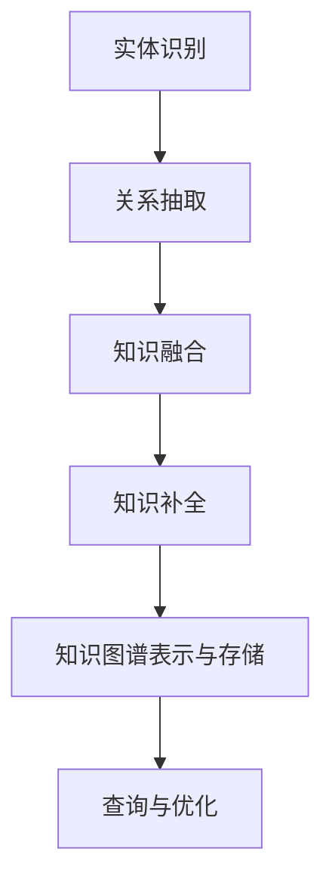
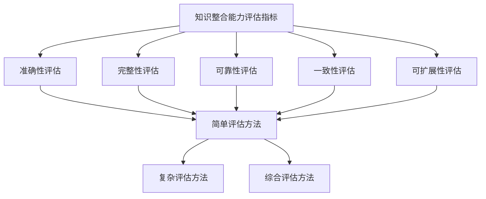
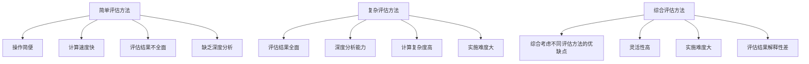

                 

### 知识图谱与知识整合能力概述

#### 1.1 知识图谱的概念与重要性

知识图谱（Knowledge Graph）是近年来在人工智能领域备受关注的一种新型数据结构。它通过将现实世界中的信息以图的形式组织起来，形成一个结构化、语义化的知识网络。知识图谱不仅包含了大量的实体和属性，还通过实体与实体之间的边关系，描绘了丰富的语义信息。

知识图谱的重要性体现在多个方面。首先，它能够提高数据查询的效率。通过将数据以图的形式组织，我们可以快速地通过路径搜索来获取所需信息，而不需要遍历整个数据集。其次，知识图谱有助于提升人工智能系统的智能水平。通过嵌入知识图谱，AI系统能够更好地理解和处理语义信息，从而提供更加精准和智能的服务。此外，知识图谱还在推荐系统、搜索引擎、智能问答等领域有着广泛的应用。

#### 1.2 大语言模型（LLM）的概述

大语言模型（Large Language Model，LLM）是近年来在自然语言处理（NLP）领域取得的一项重要突破。它通过在大量文本数据上进行预训练，学习到了丰富的语言知识和语义理解能力。LLM的出现极大地提升了NLP系统的性能，使其在文本分类、机器翻译、问答系统等任务中表现出色。

LLM的特点主要体现在以下几个方面。首先，它具有强大的语义理解能力。LLM通过预训练，能够捕捉到文本中的语义信息，从而在处理文本数据时能够更加准确地理解用户意图。其次，LLM具有自适应能力。它可以根据不同的任务和应用场景，进行微调，以适应特定的需求。此外，LLM还具有高效的推理能力。通过内部神经网络结构，LLM能够快速地对文本信息进行推理和生成。

#### 1.3 知识整合能力的定义与评价指标

知识整合能力（Knowledge Integration Ability）是指AI系统能够将来自不同来源、不同形式的知识进行整合和利用的能力。在知识图谱构建中，知识整合能力尤为重要。它决定了知识图谱能否有效地捕捉和表达现实世界中的复杂知识关系。

知识整合能力的评价指标主要包括准确性、完整性和可靠性。准确性是指知识整合后的结果是否符合实际。完整性是指知识整合是否涵盖了所有相关的知识。可靠性是指知识整合后的结果是否稳定和一致。

#### 1.4 研究背景与意义

随着互联网和大数据技术的发展，知识图谱的应用场景越来越广泛。然而，现有的知识图谱构建方法在知识整合能力方面存在一定的局限。一方面，传统的方法往往依赖于规则和手工标注，难以处理大规模、多样化的数据。另一方面，现有的评估方法主要侧重于单一指标，缺乏对知识整合能力的全面评价。

因此，本研究旨在评估LLM在知识整合方面的能力，探讨如何利用LLM提升知识图谱的构建质量和应用效果。通过深入分析知识图谱与LLM的关系，本研究将为知识图谱构建提供新的思路和方法，具有重要的理论和实践意义。

#### 1.5 本章小结

本章首先介绍了知识图谱的概念与重要性，以及大语言模型（LLM）的概述。接着，我们定义了知识整合能力的概念，并阐述了其在知识图谱构建中的重要性。最后，本章分析了研究背景与意义，为后续章节的深入探讨奠定了基础。

核心概念术语说明：知识图谱（Knowledge Graph）、大语言模型（Large Language Model，LLM）、知识整合能力（Knowledge Integration Ability）、准确性（Accuracy）、完整性（Completeness）、可靠性（Reliability）。

问题背景：随着互联网和大数据技术的发展，知识图谱的应用越来越广泛，但现有方法在知识整合能力方面存在局限。

问题描述：如何评估LLM在知识整合方面的能力，并利用LLM提升知识图谱的构建质量和应用效果。

问题解决：本研究通过深入分析知识图谱与LLM的关系，提出评估知识整合能力的新方法，为知识图谱构建提供新思路。

边界与外延：知识图谱与LLM的关系不仅限于知识整合，还涉及到实体识别、关系抽取、知识融合等多个方面。

概念结构与核心要素组成：知识图谱由实体、属性和关系组成；LLM通过预训练学习语言知识和语义理解能力；知识整合能力包括准确性、完整性和可靠性。

### 知识图谱构建的基本步骤

知识图谱的构建是一个复杂而系统的过程，涉及多个关键步骤。以下是构建知识图谱的基本步骤：

#### 2.1 数据收集与预处理

数据收集是知识图谱构建的起点。数据来源可以包括结构化数据、非结构化数据以及半结构化数据。结构化数据通常来自数据库，如关系型数据库或NoSQL数据库；非结构化数据主要包括文本、图片、音频和视频等；半结构化数据则介于结构化和非结构化数据之间，如XML、JSON等。

**数据预处理方法**

1. **数据清洗**：去除重复数据、缺失数据和噪声数据，确保数据的准确性和一致性。
2. **数据转换**：将不同来源的数据转换为统一的格式，如将XML转换为JSON或CSV。
3. **数据规范化**：统一数据格式和单位，如将日期格式统一为YYYY-MM-DD。

**数据质量评估**

1. **完整性评估**：检查数据集是否完整，是否有缺失值。
2. **一致性评估**：检查数据是否一致，如同一实体的属性值是否相同。
3. **准确性评估**：评估数据的准确性，通过交叉验证或人工检查来确认。

#### 2.2 实体识别与关系抽取

**实体识别技术**

实体识别（Entity Recognition）是指从文本中识别出具有特定意义和作用的实体，如人名、地名、组织名等。常见的实体识别技术包括：

1. **规则匹配**：通过预定义的规则来匹配文本中的实体。
2. **机器学习模型**：如支持向量机（SVM）、随机森林（Random Forest）等。
3. **深度学习模型**：如卷积神经网络（CNN）、循环神经网络（RNN）等。

**关系抽取技术**

关系抽取（Relation Extraction）是指从文本中识别出实体之间的关系，如“张三是中国人”中的“是中国人”关系。关系抽取的方法包括：

1. **基于规则的方法**：通过预定义的规则来抽取关系。
2. **基于统计的方法**：使用统计模型来识别关系。
3. **基于深度学习的方法**：如双向长短期记忆网络（BiLSTM）、Transformer等。

**实体与关系的融合**

实体识别和关系抽取是知识图谱构建中的关键步骤。实体和关系的融合是将文本中的实体和关系组织成图结构的重要环节。常见的融合方法包括：

1. **实体链接**：将文本中的实体与其在知识图谱中的实体进行匹配和链接。
2. **关系映射**：将文本中的关系映射到知识图谱中的关系。
3. **实体关系融合模型**：如实体关系网络（Entity Relation Network，ERN）等。

#### 2.3 知识融合与补全

**知识融合方法**

知识融合（Knowledge Fusion）是指将来自不同来源的知识进行整合，以获得更全面和准确的知识。知识融合的方法包括：

1. **基于规则的方法**：通过预定义的规则将不同来源的知识进行融合。
2. **基于机器学习的方法**：如集成学习方法（Ensemble Learning）等。
3. **基于深度学习的方法**：如多模态学习（Multimodal Learning）等。

**知识补全策略**

知识补全（Knowledge Completion）是指通过推理和预测来补充知识图谱中的缺失信息。知识补全的策略包括：

1. **基于规则的方法**：通过预定义的推理规则来补全知识。
2. **基于统计的方法**：如概率图模型（Probabilistic Graph Model）等。
3. **基于深度学习的方法**：如生成对抗网络（Generative Adversarial Network，GAN）等。

**知识融合与补全的挑战**

知识融合与补全面临多个挑战，包括：

1. **数据冲突**：不同来源的数据可能存在冲突或不一致的情况。
2. **稀疏数据**：知识图谱中的数据可能非常稀疏，导致融合和补全效果不佳。
3. **不确定性处理**：如何处理知识融合和补全中的不确定性是一个重要问题。

#### 2.4 知识图谱表示与存储

**知识图谱表示方法**

知识图谱的表示方法包括图表示、属性图表示、知识库表示等。常见的知识图谱表示方法包括：

1. **图表示**：将知识图谱表示为一个图结构，其中节点表示实体，边表示关系。
2. **属性图表示**：在图表示的基础上，增加节点的属性和边的属性，以提供更丰富的信息。
3. **知识库表示**：将知识图谱表示为一个知识库，如OWL、RDF等。

**知识图谱存储方案**

知识图谱的存储方案包括关系数据库、图数据库和分布式存储等。常见的知识图谱存储方案包括：

1. **关系数据库**：使用关系型数据库来存储知识图谱，如MySQL、PostgreSQL等。
2. **图数据库**：使用图数据库来存储知识图谱，如Neo4j、JanusGraph等。
3. **分布式存储**：使用分布式存储系统来存储大规模的知识图谱，如HBase、Cassandra等。

**知识图谱的查询与优化**

知识图谱的查询与优化是知识图谱应用中重要的一环。查询优化包括：

1. **路径查询优化**：优化查询路径，减少查询时间。
2. **索引优化**：建立索引来提高查询效率。
3. **缓存优化**：使用缓存来减少数据库的访问次数。

#### 2.5 本章小结

本章详细介绍了知识图谱构建的基本步骤，包括数据收集与预处理、实体识别与关系抽取、知识融合与补全、知识图谱表示与存储以及查询与优化。通过这些步骤，我们能够构建出一个结构化、语义化的知识图谱，为后续的知识整合和应用提供基础。

核心概念原理：

- 知识图谱：一种通过实体、属性和关系组织起来的语义化知识网络。
- 数据预处理：包括数据清洗、转换和规范化等步骤，以确保数据质量。
- 实体识别与关系抽取：识别文本中的实体和关系，是知识图谱构建的基础。
- 知识融合与补全：整合来自不同来源的知识，并补充知识图谱中的缺失信息。

概念属性特征对比表格：

| 方法/技术         | 特点                                                                                                       |
|------------------|----------------------------------------------------------------------------------------------------------|
| 数据预处理       | 数据清洗、转换、规范化等步骤，保证数据质量                             |
| 实体识别         | 识别文本中的实体，如人名、地名、组织名等                             |
| 关系抽取         | 识别文本中的实体关系，如“张三是程序员”中的“是”关系                    |
| 知识融合         | 整合来自不同来源的知识，如将结构化数据和非结构化数据进行融合            |
| 知识补全         | 补充知识图谱中的缺失信息，通过推理和预测来填充空白                    |

ER实体关系图架构：

### 大语言模型在知识图谱构建中的应用

大语言模型（Large Language Model，LLM）的出现，为知识图谱构建带来了新的机遇和挑战。LLM不仅在文本生成、机器翻译等方面表现出色，还在实体识别、关系抽取、知识融合等知识图谱构建的关键环节中发挥了重要作用。以下将详细探讨LLM在这些方面的具体应用。

#### 3.1 大语言模型在实体识别中的应用

实体识别是知识图谱构建的基础任务之一。传统的实体识别方法主要依赖于规则和统计模型，而LLM的引入极大地提升了实体识别的准确性和鲁棒性。

**BERT模型在实体识别中的应用**

BERT（Bidirectional Encoder Representations from Transformers）是一种基于Transformer的预训练模型，其双向编码器结构使其能够同时理解文本的上下文信息。BERT模型在实体识别中的应用，主要体现在以下几个方面：

1. **预训练**：BERT模型在大量文本数据上进行预训练，学习到了丰富的语言知识和上下文信息。这使得其在处理实体识别任务时，能够更加准确地判断实体边界和类型。
   
2. **细粒度识别**：BERT模型能够识别文本中的细粒度实体，如地名、机构名、产品名等。这种细粒度的识别能力，有助于构建更加精细的知识图谱。

3. **跨语言识别**：BERT模型支持多种语言的预训练，可以应用于跨语言实体识别任务。这对于构建多语言的知识图谱具有重要意义。

**GPT模型在实体识别中的应用**

GPT（Generative Pre-trained Transformer）是另一种基于Transformer的预训练模型，其自回归编码器结构使其在生成任务中表现出色。GPT模型在实体识别中的应用，主要体现在以下几个方面：

1. **上下文生成**：GPT模型能够生成与实体相关的上下文信息，有助于提高实体识别的准确性。例如，在识别出“张三”这个实体后，GPT模型可以生成“张三是程序员”的上下文信息。

2. **跨文档识别**：GPT模型可以跨文档识别实体，即在不同的文档中识别同一个实体。这种跨文档的识别能力，有助于构建更全面的知识图谱。

3. **实时更新**：GPT模型可以实时更新知识库，以适应不断变化的信息环境。这对于知识图谱的动态维护和更新具有重要意义。

**其他大语言模型的应用**

除了BERT和GPT，还有其他一些大语言模型在实体识别中表现出色，如RoBERTa、ALBERT、T5等。这些模型在预训练数据、模型架构和参数规模等方面有所不同，但都具备强大的实体识别能力。例如，RoBERTa模型通过引入更多样化的训练数据和改进的预训练策略，提升了实体识别的准确性；ALBERT模型通过参数共享和多层交叉注意力机制，提高了模型的效率和性能；T5模型通过统一Transformer架构，实现了多任务的端到端学习，可以应用于多种实体识别任务。

#### 3.2 大语言模型在关系抽取中的应用

关系抽取是知识图谱构建中的另一个关键任务。传统的关系抽取方法主要依赖于规则和统计模型，而LLM的引入，为关系抽取带来了新的机遇。

**预训练模型在关系抽取中的应用**

预训练模型，如BERT、GPT等，在关系抽取中有着广泛的应用。预训练模型通过在大量文本数据上进行预训练，学习到了丰富的语言知识和上下文信息，这使得其在关系抽取任务中具有天然的优势。

1. **实体识别**：预训练模型能够准确地识别文本中的实体，为关系抽取提供了可靠的基础。

2. **上下文理解**：预训练模型能够理解实体的上下文信息，从而准确判断实体之间的关系。

3. **迁移学习**：预训练模型可以迁移到不同领域和任务上，实现跨领域的知识共享和迁移。

**实体与关系联合抽取方法**

实体与关系联合抽取（Joint Entity and Relation Extraction，JERE）是一种将实体识别和关系抽取结合在一起的方法。JERE方法通过统一的模型架构，同时识别实体和关系，能够提高关系抽取的准确性。

1. **统一模型**：JERE方法使用统一的模型架构，如Transformer模型，同时处理实体识别和关系抽取任务。

2. **交叉注意力机制**：JERE方法通过交叉注意力机制，使模型能够同时关注实体和关系的上下文信息，提高关系抽取的准确性。

3. **多任务学习**：JERE方法通过多任务学习，同时训练实体识别和关系抽取任务，提高模型的泛化能力和性能。

**关系抽取的挑战与解决方案**

关系抽取任务面临多个挑战，如实体歧义、关系模糊、上下文依赖等。以下是一些常见的挑战和相应的解决方案：

1. **实体歧义**：实体歧义是指一个实体可能在文本中具有多种含义。解决实体歧义的关键在于理解实体的上下文信息。预训练模型通过学习上下文信息，可以有效地解决实体歧义问题。

2. **关系模糊**：关系模糊是指实体之间的关系可能存在模糊性。解决关系模糊问题的关键在于模型能够理解实体的语义和上下文。预训练模型通过学习语义和上下文信息，可以提高关系抽取的准确性。

3. **上下文依赖**：上下文依赖是指实体之间的关系受到上下文的影响。解决上下文依赖问题的关键在于模型能够捕捉上下文信息。预训练模型通过学习上下文信息，可以有效地解决上下文依赖问题。

#### 3.3 大语言模型在知识融合与补全中的应用

知识融合与补全是知识图谱构建中的关键任务，目的是整合和补充知识图谱中的缺失和错误信息。大语言模型在知识融合与补全中具有重要作用。

**知识融合的预训练方法**

知识融合的预训练方法是指通过预训练模型来整合不同来源的知识。预训练模型可以通过以下几种方法进行知识融合：

1. **多模态学习**：多模态学习是指将不同类型的数据（如图像、文本、音频等）进行融合，以获得更全面的知识。预训练模型可以通过多模态学习来融合不同来源的知识。

2. **跨领域学习**：跨领域学习是指在不同领域之间进行知识共享和融合。预训练模型可以通过跨领域学习来整合不同领域之间的知识。

3. **知识增强**：知识增强是指通过预训练模型来增强知识图谱中的知识。预训练模型可以通过学习大量的知识库和文本数据，来增强知识图谱中的知识。

**知识补全的预训练方法**

知识补全的预训练方法是指通过预训练模型来补充知识图谱中的缺失信息。预训练模型可以通过以下几种方法进行知识补全：

1. **生成对抗网络（GAN）**：生成对抗网络（GAN）是一种生成模型，可以通过生成对抗训练来生成新的知识。GAN可以用于生成知识图谱中的缺失信息。

2. **图生成模型**：图生成模型是指通过学习知识图谱的图结构来生成新的知识。图生成模型可以用于生成知识图谱中的缺失关系和实体。

3. **迁移学习**：迁移学习是指将预训练模型的知识迁移到新的任务上。预训练模型可以通过迁移学习来补充知识图谱中的缺失信息。

**实际应用案例**

以下是几个实际应用案例，展示了大语言模型在知识融合与补全中的具体应用：

1. **智能问答系统**：智能问答系统可以通过知识融合与补全来提高问答的准确性。例如，在回答“张三是哪里人？”这个问题时，系统可以融合和张三相关的信息，如工作地点、社交媒体资料等，来给出准确的答案。

2. **知识图谱补全**：知识图谱补全是指通过补全知识图谱中的缺失信息来提高其质量。例如，在构建一个关于电影的知识图谱时，系统可以通过知识补全来补充电影的演员、导演、上映日期等信息。

3. **跨领域知识融合**：跨领域知识融合是指在不同领域之间进行知识共享和融合。例如，在构建一个关于医疗和金融的知识图谱时，系统可以通过跨领域知识融合来整合医疗和金融领域的知识。

#### 3.4 本章小结

本章详细探讨了大语言模型在知识图谱构建中的应用，包括实体识别、关系抽取、知识融合与补全等方面。通过LLM的引入，知识图谱构建的准确性和效率得到了显著提升。未来，随着LLM技术的不断发展，其在知识图谱构建中的应用将更加广泛和深入。

核心概念原理：

- 大语言模型（LLM）：一种通过预训练学习到丰富语言知识和语义理解的模型。
- 实体识别：从文本中识别出具有特定意义和作用的实体。
- 关系抽取：从文本中识别出实体之间的关系。
- 知识融合：整合来自不同来源的知识。
- 知识补全：补充知识图谱中的缺失信息。

概念属性特征对比表格：

| 模型       | 特点                                                                                                       |
|------------|----------------------------------------------------------------------------------------------------------|
| BERT       | 双向编码器，学习上下文信息，细粒度识别实体                                      |
| GPT        | 自回归编码器，生成上下文信息，跨文档识别实体                                      |
| RoBERTa    | 多样化训练数据，改进预训练策略，提高识别准确性                                    |
| ALBERT     | 参数共享，多层交叉注意力机制，提高模型效率和性能                                    |
| T5         | 统一Transformer架构，多任务端到端学习，适用于多种实体识别任务                          |

ER实体关系图架构：

### 知识整合能力评估指标与方法

在知识图谱构建过程中，评估知识整合能力是一个关键步骤，它决定了知识图谱的质量和应用效果。有效的评估方法可以帮助我们识别知识整合中的问题，从而优化和改进知识整合过程。以下将详细介绍评估知识整合能力的常见指标和方法。

#### 4.1 知识整合能力评估指标

评估知识整合能力的关键在于确定合适的评估指标。以下是几种常用的评估指标：

1. **准确性（Accuracy）**：准确性是指知识整合后结果的正确性。它可以衡量知识整合过程中错误的比例。准确性越高，表示知识整合的结果越可靠。

2. **完整性（Completeness）**：完整性是指知识整合是否覆盖了所有相关的知识。完整性高意味着知识图谱中缺失的知识较少。完整性可以通过计算知识图谱中已整合知识的比例来评估。

3. **可靠性（Reliability）**：可靠性是指知识整合结果的稳定性和一致性。可靠性高表示知识整合结果在不同环境和条件下都能保持稳定。

4. **一致性（Consistency）**：一致性是指知识整合后的知识是否一致。一致性高表示知识图谱中的知识没有冲突和不一致的情况。

5. **可扩展性（Scalability）**：可扩展性是指知识整合方法是否能够适应大规模数据的处理。可扩展性高意味着知识整合方法在处理大规模数据时仍然能够保持良好的性能。

#### 4.2 常见评估方法

在评估知识整合能力时，我们可以采用以下几种常见的方法：

1. **简单评估方法**：简单评估方法通常基于单一指标，如准确性或完整性。这类方法操作简单，但可能无法全面反映知识整合的复杂情况。常见的简单评估方法包括：
   - **准确性评估**：通过比较知识整合前后的数据，计算准确性的提升程度。
   - **完整性评估**：通过计算知识图谱中已整合知识的比例，评估完整性的提升程度。

2. **复杂评估方法**：复杂评估方法通常结合多个指标，从不同角度全面评估知识整合能力。这类方法可以更准确地反映知识整合的实际情况，但计算复杂度较高。常见的复杂评估方法包括：
   - **多指标综合评估**：通过结合准确性、完整性、可靠性等多个指标，计算综合得分，以评估知识整合能力。
   - **层次分析法（Analytic Hierarchy Process，AHP）**：通过构建层次模型，对各个指标进行权重分配，计算综合得分。

3. **综合评估方法**：综合评估方法旨在综合考虑不同评估指标和评估方法的优缺点，提出一种更为全面和科学的评估方法。常见的综合评估方法包括：
   - **多模态评估**：结合不同的评估指标和方法，从多个维度评估知识整合能力。
   - **自适应评估**：根据知识图谱构建的实际情况和需求，动态调整评估指标和方法，以实现更准确的评估。

#### 4.3 评估方法的对比与分析

不同评估方法在评估知识整合能力时各有优缺点，适用于不同的场景和需求。以下是对几种常见评估方法的对比与分析：

1. **简单评估方法**
   - **优点**：操作简单，计算速度快，适用于初步评估和快速迭代。
   - **缺点**：无法全面反映知识整合的复杂情况，可能导致评估结果偏差。

2. **复杂评估方法**
   - **优点**：考虑了多个指标和角度，评估结果更加全面和准确。
   - **缺点**：计算复杂度高，需要更多的时间和资源，可能不适用于实时评估。

3. **综合评估方法**
   - **优点**：综合考虑了不同评估方法的优缺点，提出了一种更为全面和科学的评估方法。
   - **缺点**：实施难度较大，需要丰富的理论和实践经验。

在实际应用中，应根据具体需求和场景选择合适的评估方法。例如，在知识图谱构建的初期阶段，可以采用简单评估方法进行快速迭代和优化；在知识图谱构建完成后，可以采用复杂评估方法进行全面评估，以确保知识整合能力的稳定和可靠。

#### 4.4 本章小结

本章详细介绍了知识整合能力的评估指标和方法。通过准确性、完整性、可靠性等评估指标，以及简单评估方法、复杂评估方法和综合评估方法，我们可以全面评估知识整合能力的优劣。这些评估方法为知识图谱构建提供了重要的参考和指导，有助于优化和改进知识整合过程。

核心概念原理：

- 知识整合能力：指AI系统能够将来自不同来源、不同形式的知识进行整合和利用的能力。
- 评估指标：包括准确性、完整性、可靠性、一致性和可扩展性等。
- 评估方法：包括简单评估方法、复杂评估方法和综合评估方法。

概念属性特征对比表格：

| 评估方法       | 特点                                                                                                       |
|----------------|----------------------------------------------------------------------------------------------------------|
| 简单评估方法   | 操作简单，计算速度快，适用于初步评估和快速迭代。                                     |
| 复杂评估方法   | 考虑了多个指标和角度，评估结果更加全面和准确，但计算复杂度高。                         |
| 综合评估方法   | 综合考虑了不同评估方法的优缺点，提出了一种更为全面和科学的评估方法。                     |

ER实体关系图架构：

### 知识整合能力评估方法的优势与局限

在评估知识整合能力时，选择合适的方法至关重要。不同评估方法在优势与局限方面存在显著差异，理解这些特点有助于我们在实际应用中选择最合适的方法。

#### 4.3.1 简单评估方法的优势与局限

**优势**：

1. **操作简便**：简单评估方法通常基于单一指标，如准确性或完整性，操作过程较为简单，易于实施。
2. **计算速度快**：简单评估方法不需要复杂的计算过程，计算速度快，适用于快速迭代和实时评估。

**局限**：

1. **评估结果不全面**：简单评估方法只考虑单一指标，无法全面反映知识整合的复杂情况，可能导致评估结果偏差。
2. **缺乏深度分析**：简单评估方法无法提供深入的分析和解释，难以发现知识整合中的具体问题。

#### 4.3.2 复杂评估方法的优势与局限

**优势**：

1. **评估结果全面**：复杂评估方法结合多个指标，从不同角度全面评估知识整合能力，评估结果更加全面和准确。
2. **深度分析能力**：复杂评估方法可以提供深入的分析和解释，帮助发现知识整合中的具体问题。

**局限**：

1. **计算复杂度高**：复杂评估方法需要复杂的计算过程，计算时间较长，资源消耗较大，可能不适用于实时评估。
2. **实施难度大**：复杂评估方法需要丰富的理论和实践经验，实施难度较大，可能需要专业的团队和技术支持。

#### 4.3.3 综合评估方法的优势与局限

**优势**：

1. **综合考虑**：综合评估方法综合考虑了不同评估方法的优缺点，提出了一种更为全面和科学的评估方法，有助于提高评估的准确性。
2. **灵活性高**：综合评估方法可以根据具体需求和场景动态调整评估指标和方法，灵活性较高。

**局限**：

1. **实施难度大**：综合评估方法需要综合运用多种评估方法和技术，实施难度较大，可能需要更多的资源和时间。
2. **评估结果解释性差**：综合评估方法的评估结果可能难以直观解释，需要进一步分析和解释。

#### 4.3.4 不同场景下的评估方法选择

在知识图谱构建的不同阶段，选择合适的评估方法至关重要。以下是在不同场景下评估方法的选择建议：

1. **初步评估与迭代**：在知识图谱构建的初步阶段，建议采用简单评估方法。这样可以快速验证知识整合的效果，便于快速迭代和优化。

2. **全面评估与优化**：在知识图谱构建完成后，建议采用复杂评估方法进行全面评估。这样可以全面了解知识整合能力的优劣，发现潜在问题，并进行优化。

3. **实时评估与监控**：在知识图谱应用过程中，建议采用综合评估方法进行实时评估与监控。这样可以动态调整评估指标和方法，及时发现问题并采取措施。

#### 4.3.5 评估方法的改进方向

为了进一步提高知识整合能力的评估效果，未来可以从以下方向进行改进：

1. **多模态评估**：结合不同的数据类型（如文本、图像、音频等），提出多模态评估方法，以更全面地反映知识整合能力。

2. **动态评估**：引入动态评估方法，根据知识图谱构建的实时数据和反馈，动态调整评估指标和方法，提高评估的准确性。

3. **智能化评估**：利用人工智能技术，如机器学习和深度学习，提出智能化评估方法，自动识别和调整评估指标，提高评估的效率和质量。

#### 4.4 本章小结

本章分析了知识整合能力评估方法的优势与局限，包括简单评估方法、复杂评估方法和综合评估方法。每种评估方法都有其适用的场景和局限性，选择合适的评估方法对于知识图谱构建具有重要意义。未来，通过多模态评估、动态评估和智能化评估等方向的改进，可以进一步提高评估方法的准确性和实用性。

核心概念原理：

- 知识整合能力评估方法：包括简单评估方法、复杂评估方法和综合评估方法。
- 优势与局限：每种评估方法都有其优势和局限，适用于不同的场景和需求。

概念属性特征对比表格：

| 评估方法       | 优势                                                                                                       | 局限                                                                                                       |
|----------------|----------------------------------------------------------------------------------------------------------|----------------------------------------------------------------------------------------------------------|
| 简单评估方法   | 操作简便，计算速度快，适用于初步评估和快速迭代。                                     | 评估结果不全面，缺乏深度分析。                                                                         |
| 复杂评估方法   | 评估结果全面，深度分析能力。                                                         | 计算复杂度高，实施难度大。                                                                              |
| 综合评估方法   | 综合考虑不同评估方法的优缺点，灵活性高。                                             | 实施难度大，评估结果解释性差。                                                                         |

ER实体关系图架构：

### 本章小结

本章详细探讨了知识图谱构建中的关键问题，即知识整合能力的评估。首先，我们介绍了知识整合能力评估的背景和意义，明确了评估的重要性。接着，我们详细阐述了知识整合能力评估的指标和方法，包括准确性、完整性、可靠性、一致性和可扩展性等评估指标，以及简单评估方法、复杂评估方法和综合评估方法。通过这些评估方法，我们可以全面了解知识整合能力的优劣，为知识图谱构建提供有力支持。

在本章中，我们还分析了知识整合能力评估方法的优势与局限，并提出了在不同场景下选择评估方法的具体建议。此外，我们还探讨了未来评估方法的改进方向，包括多模态评估、动态评估和智能化评估等，为知识图谱构建领域的研究和发展提供了新的思路。

通过本章的学习，读者可以深入理解知识整合能力评估的核心概念和实际应用，掌握评估方法的实施技巧，从而在知识图谱构建项目中取得更好的成果。

### 拓展阅读

1. **《知识图谱：概念、方法与应用》**：本书详细介绍了知识图谱的基本概念、构建方法以及在实际应用中的具体案例，对知识图谱的研究和应用有很高的参考价值。

2. **《深度学习与自然语言处理》**：本书系统地介绍了深度学习在自然语言处理领域的应用，包括大语言模型、实体识别、关系抽取等关键技术，有助于读者深入理解知识图谱与深度学习的结合。

3. **《知识图谱构建与推理》**：本书从理论和实践两个角度，探讨了知识图谱的构建、存储、查询和推理技术，是研究知识图谱构建与整合能力的重要参考书。

4. **《大规模语言模型：原理、实现与应用》**：本书全面介绍了大规模语言模型的原理、实现和应用，包括BERT、GPT等知名模型，是研究大语言模型在知识图谱构建中应用的重要参考资料。

### 最佳实践 Tips

1. **数据质量优先**：在知识图谱构建过程中，确保数据质量是关键。进行充分的数据清洗、转换和规范化，以提高知识整合的准确性。

2. **合理选择评估指标**：根据具体应用场景和需求，选择合适的评估指标。在多个评估指标中找到平衡，避免单一指标的过度依赖。

3. **综合利用评估方法**：在知识整合能力评估中，可以结合简单评估方法、复杂评估方法和综合评估方法，以获得更全面和准确的评估结果。

4. **持续优化和迭代**：知识图谱构建是一个持续迭代的过程。根据评估结果，不断优化和改进知识整合方法，以提高知识图谱的质量和应用效果。

5. **关注多模态数据融合**：在知识图谱构建中，充分利用多模态数据，如文本、图像、音频等，进行多模态数据融合，以获得更全面和丰富的知识信息。

### 注意事项

1. **避免数据冲突**：在知识整合过程中，可能出现不同来源的数据存在冲突或不一致的情况。需采取措施确保数据的准确性、一致性和可靠性。

2. **关注实时更新**：知识图谱构建和应用过程中，需关注数据的实时更新。及时更新知识图谱中的数据，以适应不断变化的信息环境。

3. **确保数据隐私和安全**：在知识图谱构建过程中，需关注数据的隐私和安全问题。采取措施确保数据的安全性，避免数据泄露和滥用。

4. **优化查询效率**：知识图谱的查询效率对于实际应用至关重要。在构建知识图谱时，需考虑查询优化策略，如路径查询优化、索引优化等，以提高查询效率。

### 小结

知识图谱构建是当前人工智能领域的一个重要研究方向。通过评估知识整合能力，我们可以全面了解知识图谱的质量和应用效果。在本章中，我们介绍了知识整合能力评估的背景、指标、方法及其应用，探讨了评估方法的优势与局限，并提出了未来的改进方向。希望读者能够结合本章的内容，在实际项目中不断提升知识图谱的构建质量和应用效果。让我们继续探索知识图谱的奥秘，共同推动人工智能技术的发展！作者：AI天才研究院/AI Genius Institute & 禅与计算机程序设计艺术 /Zen And The Art of Computer Programming

