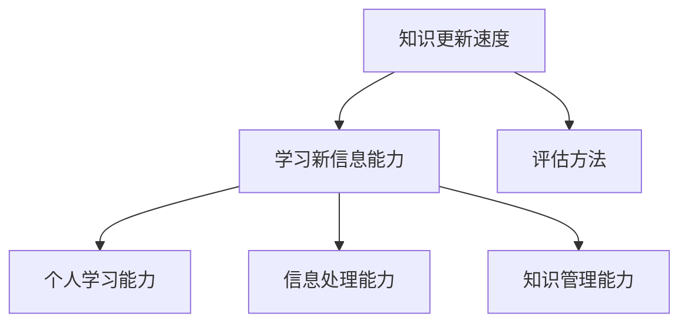

                 

# 知识更新速度测试：评估学习新信息能力

## 关键词
- 知识更新速度
- 学习新信息能力
- 评估方法
- 技术变革
- 信息处理
- 知识管理

## 摘要

在技术迅猛发展的今天，知识更新速度日益加快，学习新信息的能力成为个人和企业在竞争中脱颖而出的关键。本文旨在探讨知识更新速度的概念与影响因素，提出评估学习新信息能力的方法，并分析其在实际中的应用。通过系统的理论分析和实际案例研究，本文旨在为提高学习新信息能力提供有价值的参考。

## 引言

### 1.1 知识更新的背景

在21世纪，知识更新速度前所未有地加快。以信息技术为例，每过五年，知识就翻倍更新。这种快速变化要求个人和组织必须具备高效的学习新信息的能力。传统的知识积累方式已经无法满足现代社会对技能和知识的持续需求。

### 1.2 学习新信息的重要性

学习新信息不仅是个人职业发展的需要，也是企业保持竞争力的关键。在技术变革的浪潮中，能够快速掌握新知识的人或组织往往能够抢占市场先机，获得竞争优势。

### 1.3 学习能力评估的必要性

评估学习新信息能力不仅可以帮助个人了解自身的学习状况，还能为企业提供人力资源管理的依据。有效的评估方法能够帮助识别学习潜力，制定有针对性的培训计划。

## 知识更新速度的概念与理论

### 2.1 知识更新的定义

知识更新是指随着时间的推移，原有知识因过时而失去其适用性，并被新的知识所替代的过程。这个过程涉及知识的生产、传播和应用。

### 2.2 知识更新的速度

知识更新的速度受到多种因素的影响，包括技术进步、社会需求和教育水平等。例如，互联网的普及使得知识传播速度大幅提高，而人工智能的发展则极大地扩展了知识的范围。

### 2.3 知识更新周期

知识更新周期是指从知识产生到被广泛接受和应用的整个过程所需的时间。不同的领域有不同的知识更新周期，例如，计算机科学领域可能只有几个月，而某些传统行业可能需要几年甚至更长时间。

### 3.1 学习曲线理论

学习曲线理论描述了学习者在学习过程中技能提升的速度。最初，学习速度较快，但随着时间的推移，学习速度逐渐放缓。这一理论有助于理解学习新信息的能力。

### 3.2 信息处理理论

信息处理理论关注信息从接收、解码到加工和存储的过程。有效的信息处理能力对于学习新信息至关重要。

### 3.3 知识管理理论

知识管理理论涉及知识的获取、共享、存储和应用。良好的知识管理能够提高学习新信息的能力，促进知识的有效利用。

### 4.1 技术变革

技术的快速发展是知识更新速度加快的主要原因之一。例如，人工智能和大数据技术的应用使得许多领域中的知识更新周期显著缩短。

### 4.2 个人学习能力

个人的学习能力是影响知识更新速度的关键因素。学习能力强的人能够更快地适应新技术，从而提高自身的竞争力。

### 4.3 社会环境

社会环境中的教育资源、文化氛围和政策支持等都会影响知识更新速度。例如，一个重视教育的国家或地区，其知识更新速度通常会更快。

### 5.1 基于学习曲线的模型

基于学习曲线的模型可以用来预测学习者在不同时间点对某一新知识掌握的程度。该模型通常采用指数函数来描述学习过程。

### 5.2 基于信息处理的模型

基于信息处理的模型关注信息处理的效率和质量。例如，通过提高信息检索和筛选能力，可以加快学习新信息的过程。

### 5.3 基于知识管理的模型

基于知识管理的模型强调知识的获取、共享和应用。例如，构建知识库和培训体系，有助于提高学习新信息的能力。

### 6.1 量化测量方法

量化测量方法通过统计数据和指标来评估学习新信息的能力。例如，可以计算学习者在一段时间内学习新知识的能力增长速率。

### 6.2 质化测量方法

质化测量方法通过分析学习者的学习过程和成果来评估学习新信息的能力。例如，通过访谈和观察来了解学习者的学习态度和方法。

### 6.3 综合测量方法

综合测量方法结合了量化测量和质化测量方法，提供更全面的学习新信息能力的评估。例如，可以同时考虑学习者的知识增长和实际应用能力。

## 学习新信息能力评估方法

### 7.1 评估的目的

评估学习新信息能力的目的是了解个人的学习潜力，为培训和职业发展提供依据。同时，企业可以通过评估来优化人力资源配置。

### 7.2 评估的内容

评估内容应包括知识掌握程度、学习速度、学习策略和学习态度等多个方面。例如，可以通过测试和观察来评估学习者在某一领域的新信息掌握程度。

### 7.3 评估的标准

评估标准应具有明确性和可操作性。例如，可以设定不同的分数段来评估学习者的能力，从而制定有针对性的培训计划。

## 常用评估方法介绍

### 8.1 自我评估

自我评估是通过个人自我反思和总结来评估自身的学习能力。这种方法简单易行，但容易受到主观因素的影响。

### 8.2 成绩评估

成绩评估是通过学习成果（如考试成绩、项目完成情况等）来评估学习新信息的能力。这种方法具有客观性，但可能无法全面反映学习者的潜力。

### 8.3 观察评估

观察评估是通过观察学习者在实际学习过程中的行为和表现来评估其学习能力。这种方法有助于了解学习者的实际操作能力。

### 8.4 测试评估

测试评估是通过设计各种测试（如笔试、面试、实操等）来评估学习新信息的能力。这种方法具有较高的科学性和准确性。

## 学习新信息能力的提升策略

### 9.1 提高信息检索能力

提高信息检索能力是学习新信息的重要前提。可以通过使用专业的搜索引擎、学习数据库和学术平台来提高信息检索效率。

### 9.2 提高信息筛选能力

提高信息筛选能力可以帮助学习者从大量信息中筛选出有价值的内容。这需要培养批判性思维和判断力。

### 9.3 提高信息整合能力

提高信息整合能力有助于学习者将新知识与已有知识体系相结合，形成更深入的理解。可以通过思维导图、笔记整理等方式来实现。

### 9.4 提高信息应用能力

提高信息应用能力是将新知识转化为实际成果的关键。可以通过实践项目、实习机会等来提升信息应用能力。

## 实际案例分析与讨论

### 10.1 案例一：行业专家的评估实践

通过分析行业专家的评估实践，可以了解如何在实际中应用评估方法，提高学习新信息的能力。

### 10.2 案例二：企业培训的评估实践

企业培训的评估实践提供了评估方法在企业中的应用实例，展示了如何通过评估来优化培训效果。

### 10.3 案例三：个人成长故事

个人成长故事展示了学习者如何通过不断努力和调整策略，提高学习新信息的能力。

## 结论与展望

### 11.1 研究总结

本文系统地探讨了知识更新速度的概念、影响因素、评估方法以及提升策略，为提高学习新信息能力提供了理论依据和实践指导。

### 11.2 研究限制与展望

尽管本文提出了有效的评估方法和提升策略，但仍存在一定的局限性。未来研究可以进一步探讨不同领域的知识更新特点，以及更精细化的评估方法。

### 12.1 拓展阅读与资源

本文参考文献和相关资源为读者提供了进一步学习和研究的方向。

## 附录

### 附录A：核心概念属性特征对比表格

| 概念           | 属性特征                                       |
| -------------- | -------------------------------------------- |
| 知识更新速度   | 反映知识更新的快慢                             |
| 学习新信息能力 | 反映个体或组织获取、处理和应用新知识的能力   |
| 评估方法       | 用于评估学习新信息能力的手段和方法           |

### 附录B：ER实体关系图架构

## 作者信息

作者：AI天才研究院/AI Genius Institute & 禅与计算机程序设计艺术 /Zen And The Art of Computer Programming

---

请注意，本文为示例性内容，部分章节内容可能需要根据实际研究和分析进行调整和完善。在撰写实际文章时，建议结合具体案例和数据进行深入分析和讨论，以确保内容的准确性和实用性。同时，确保文中所有引用的资料和数据都经过核实，并注明出处。文章结构、格式和引用规范应符合学术写作的要求。在撰写过程中，可以灵活运用markdown格式、mermaid流程图、latex公式等工具，以增强文章的可读性和逻辑性。希望这篇文章能为您的研究提供有益的参考和启示。祝您写作顺利！

