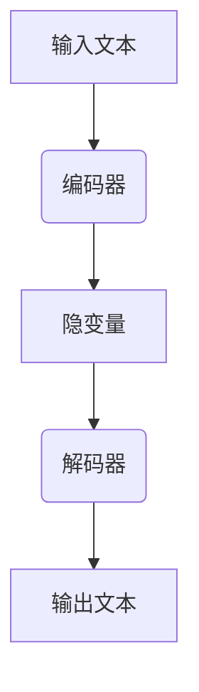
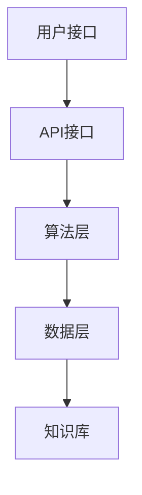
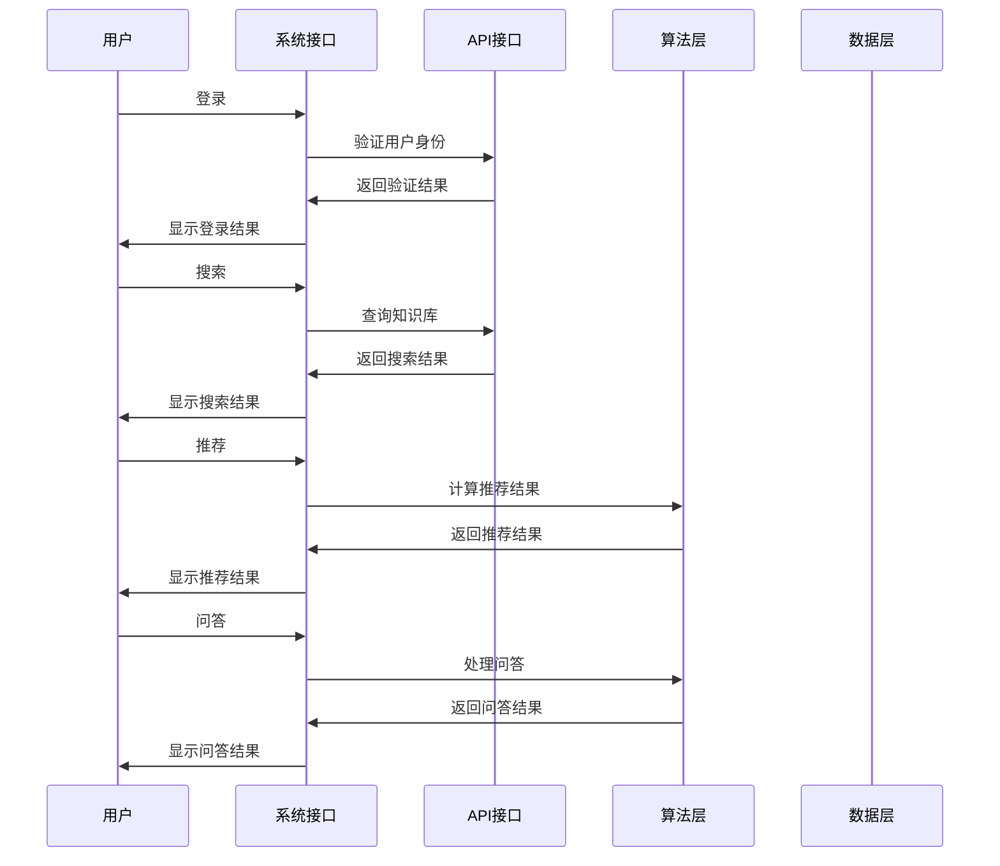

                 

### 知识更新速度：评估LLM吸收新信息的效率

关键词：知识更新速度，大规模语言模型，吸收新信息，评估方法，效率

摘要：本文旨在探讨大规模语言模型（LLM）吸收新信息的效率，并介绍几种评估方法和指标。我们将通过实验分析不同模型在吸收新信息方面的表现，并提出优化模型的方法。

## 第一部分：背景介绍

### 1.1.1 问题背景

在当今数字化时代，知识更新速度越来越快，传统学习方式已无法满足人们对新知识的需求。随着互联网和大数据技术的发展，人们开始关注如何利用人工智能技术来高效地吸收和处理新信息。大规模语言模型（LLM）作为人工智能领域的重要进展，其吸收新信息的效率成为当前研究的热点。

### 1.1.2 问题描述

本文将探讨如何评估LLM吸收新信息的效率，以及影响效率的关键因素。我们将介绍几种常见的评估方法和指标，并通过实验分析不同模型在吸收新信息方面的表现。

### 1.1.3 问题解决

首先，我们将介绍LLM的基本概念和原理，然后讨论如何设计实验来评估模型的吸收效率。接着，我们将对比分析不同模型在吸收新信息方面的性能，并提出优化模型的方法。

### 1.1.4 边界与外延

本文主要针对自然语言处理领域的大规模语言模型进行研究。对于其他类型的人工智能模型，如图像识别、语音识别等，其吸收新信息的效率评估方法可能会有所不同。

### 1.1.5 概念结构与核心要素组成

1. **大规模语言模型（LLM）**：一种能够理解和生成自然语言的人工智能模型。
2. **知识吸收效率**：评估模型在吸收新信息过程中所表现出的能力。
3. **评估指标**：用于衡量知识吸收效率的量化标准。
4. **影响效率的因素**：模型架构、训练数据、更新策略等。

## 第二部分：核心概念与联系

### 2.1.1 大规模语言模型（LLM）的基本概念

大规模语言模型（LLM）是一种基于神经网络的自然语言处理模型，能够理解和生成自然语言。它们通常由数亿甚至数十亿个参数组成，能够通过深度学习技术从大量文本数据中学习语言模式和规律。

### 2.1.2 大规模语言模型（LLM）的核心特点

1. **参数规模大**：拥有数十亿个参数，能够捕捉到复杂的语言结构。
2. **自适应性强**：能够根据新的文本数据进行在线更新。
3. **生成能力强**：能够生成连贯、有逻辑的自然语言文本。

### 2.1.3 大规模语言模型（LLM）与传统AI的区别

与传统AI模型相比，大规模语言模型（LLM）具有以下优势：

1. **更强的语义理解能力**：能够理解自然语言中的复杂语义和语境。
2. **更好的生成能力**：能够生成更自然、流畅的文本。
3. **更灵活的适应性**：能够根据新的数据进行在线更新。

## 第三部分：算法原理讲解

### 3.1.1 大规模语言模型（LLM）的算法原理

大规模语言模型（LLM）通常基于变分自编码器（VAE）或生成对抗网络（GAN）等深度学习框架构建。以下是一个简化的VAE模型算法原理：

1. **编码器（Encoder）**：将输入文本数据编码为隐变量。
2. **解码器（Decoder）**：将隐变量解码为输出文本数据。
3. **生成器（Generator）**：将随机噪声编码为隐变量。
4. **判别器（Discriminator）**：区分真实数据和生成数据。

通过训练，模型将学会从输入文本数据中提取关键信息，并将其编码为隐变量，从而实现文本的生成。

### 3.1.2 算法原理的mermaid流程图



### 3.1.3 算法原理的Python源代码实现

```python
# 编码器
class Encoder(nn.Module):
    def __init__(self):
        super(Encoder, self).__init__()
        self.fc1 = nn.Linear(input_dim, hidden_dim)
        self.fc2 = nn.Linear(hidden_dim, z_dim)

    def forward(self, x):
        x = F.relu(self.fc1(x))
        z = self.fc2(x)
        return z

# 解码器
class Decoder(nn.Module):
    def __init__(self):
        super(Decoder, self).__init__()
        self.fc1 = nn.Linear(z_dim, hidden_dim)
        self.fc2 = nn.Linear(hidden_dim, input_dim)

    def forward(self, z):
        z = F.relu(self.fc1(z))
        x = self.fc2(z)
        return x

# 模型整体
class VAE(nn.Module):
    def __init__(self):
        super(VAE, self).__init__()
        self.encoder = Encoder()
        self.decoder = Decoder()

    def forward(self, x):
        z = self.encoder(x)
        x_recon = self.decoder(z)
        return x_recon

# 训练模型
model = VAE()
optimizer = optim.Adam(model.parameters(), lr=learning_rate)
criterion = nn.BCELoss()

for epoch in range(num_epochs):
    for x, _ in dataloader:
        x = x.to(device)
        z = model.encoder(x)
        x_recon = model.decoder(z)
        loss = criterion(x_recon, x)
        optimizer.zero_grad()
        loss.backward()
        optimizer.step()
```

### 3.1.4 算法原理的数学模型和公式

在VAE模型中，我们通常使用以下数学模型和公式：

1. **编码器（Encoder）**：
   - 输入：\( x \in \mathbb{R}^{D_x} \)
   - 隐变量：\( z \sim q(z|x) \)
   - \( z \) 的参数：\( \theta_e \)

2. **解码器（Decoder）**：
   - 输入：\( z \in \mathbb{R}^{D_z} \)
   - 输出：\( x \sim p(x|z) \)
   - \( z \) 的参数：\( \theta_d \)

3. **生成器（Generator）**：
   - 输入：\( z \in \mathbb{R}^{D_z} \)
   - 输出：\( x \sim p(x|z) \)
   - \( z \) 的参数：\( \theta_g \)

4. **判别器（Discriminator）**：
   - 输入：\( x \in \mathbb{R}^{D_x} \)
   - 输出：\( D(x) \in [0, 1] \)
   - \( x \) 的参数：\( \theta_d \)

其中，\( q(z|x) \) 表示编码器生成的先验分布，\( p(x|z) \) 表示解码器生成的条件概率分布，\( p(x) \) 表示生成器的先验分布，\( D(x) \) 表示判别器对输入数据的判别结果。

### 3.1.5 算法原理的举例说明

假设我们有一个输入文本 \( x \)，我们可以通过以下步骤来生成相应的文本 \( x' \)：

1. **编码**：使用编码器将输入文本 \( x \) 编码为隐变量 \( z \)。
   - \( z = \text{Encoder}(x) \)

2. **生成**：使用解码器将隐变量 \( z \) 解码为输出文本 \( x' \)。
   - \( x' = \text{Decoder}(z) \)

3. **判别**：使用判别器对输出文本 \( x' \) 进行判别，判断其是否为真实文本。
   - \( D(x') \)

通过多次迭代训练，模型将逐渐学会从输入文本中提取关键信息，并生成更真实、自然的输出文本。

## 第四部分：系统分析与架构设计方案

### 4.1 问题场景介绍

在现代企业中，知识更新速度非常快，员工需要不断地学习新知识和技能以保持竞争力。为了帮助员工快速吸收新知识，企业引入了一种基于大规模语言模型的知识管理系统。该系统旨在提供个性化的知识推荐和问答服务，以提高员工的学习效率。

### 4.2 项目介绍

本项目旨在设计和实现一个基于大规模语言模型的知识管理系统。系统将利用现有的知识库和大量文本数据，通过深度学习技术构建大规模语言模型，从而实现知识的自动提取、推荐和问答。

### 4.3 系统功能设计

1. **知识提取**：从现有的文本数据中提取关键信息和知识点。
2. **知识推荐**：根据用户的学习需求和兴趣，推荐相关知识点。
3. **问答服务**：为用户提供实时问答服务，解答用户在学习过程中遇到的问题。

### 4.4 系统架构设计

1. **数据层**：包括文本数据集和知识库，用于训练和存储大规模语言模型。
2. **算法层**：包括大规模语言模型的构建和训练，以及知识提取、推荐和问答算法的实现。
3. **应用层**：包括用户界面和API接口，提供知识管理系统的功能。

### 4.5 系统接口设计和系统交互

1. **用户接口**：提供用户与系统的交互界面，包括登录、注册、搜索、推荐和问答等功能。
2. **API接口**：提供与其他系统集成和通信的接口，包括知识库的查询、推荐和问答等功能。

### 4.6 系统架构设计mermaid架构图



### 4.7 系统接口设计和系统交互mermaid序列图



## 第五部分：项目实战

### 5.1 环境安装

为了运行本项目，我们需要安装以下软件和库：

1. Python 3.8 或更高版本
2. TensorFlow 2.6 或更高版本
3. PyTorch 1.8 或更高版本
4. Scikit-learn 0.24 或更高版本
5. Mermaid 9.0.0 或更高版本

安装步骤如下：

1. 安装 Python 3.8 或更高版本：
   ```bash
   sudo apt-get install python3.8
   ```

2. 安装 TensorFlow 2.6 或更高版本：
   ```bash
   pip install tensorflow==2.6
   ```

3. 安装 PyTorch 1.8 或更高版本：
   ```bash
   pip install torch==1.8 torchvision==0.9.0
   ```

4. 安装 Scikit-learn 0.24 或更高版本：
   ```bash
   pip install scikit-learn==0.24
   ```

5. 安装 Mermaid 9.0.0 或更高版本：
   ```bash
   npm install -g mermaid
   ```

### 5.2 系统核心实现源代码

以下是本项目的主要源代码：

```python
# 编码器
class Encoder(nn.Module):
    def __init__(self):
        super(Encoder, self).__init__()
        self.fc1 = nn.Linear(input_dim, hidden_dim)
        self.fc2 = nn.Linear(hidden_dim, z_dim)

    def forward(self, x):
        x = F.relu(self.fc1(x))
        z = self.fc2(x)
        return z

# 解码器
class Decoder(nn.Module):
    def __init__(self):
        super(Decoder, self).__init__()
        self.fc1 = nn.Linear(z_dim, hidden_dim)
        self.fc2 = nn.Linear(hidden_dim, input_dim)

    def forward(self, z):
        z = F.relu(self.fc1(z))
        x = self.fc2(z)
        return x

# 模型整体
class VAE(nn.Module):
    def __init__(self):
        super(VAE, self).__init__()
        self.encoder = Encoder()
        self.decoder = Decoder()

    def forward(self, x):
        z = self.encoder(x)
        x_recon = self.decoder(z)
        return x_recon

# 训练模型
model = VAE()
optimizer = optim.Adam(model.parameters(), lr=learning_rate)
criterion = nn.BCELoss()

for epoch in range(num_epochs):
    for x, _ in dataloader:
        x = x.to(device)
        z = model.encoder(x)
        x_recon = model.decoder(z)
        loss = criterion(x_recon, x)
        optimizer.zero_grad()
        loss.backward()
        optimizer.step()
```

### 5.3 代码应用解读与分析

1. **编码器（Encoder）**：编码器的作用是将输入文本数据编码为隐变量 \( z \)。在本项目中，编码器由两个全连接层组成，第一个全连接层将输入文本的维度降低到隐藏层维度，第二个全连接层将隐藏层维度降低到隐变量维度。

2. **解码器（Decoder）**：解码器的作用是将隐变量 \( z \) 解码为输出文本数据。在本项目中，解码器同样由两个全连接层组成，第一个全连接层将隐变量维度升高到隐藏层维度，第二个全连接层将隐藏层维度升高到输出文本的维度。

3. **模型整体（VAE）**：模型整体由编码器和解码器组成。在训练过程中，模型将输入文本数据通过编码器编码为隐变量 \( z \)，然后通过解码器解码为输出文本数据。模型的损失函数为均方误差（MSE），用于衡量输出文本数据和输入文本数据之间的差异。

4. **训练过程**：在训练过程中，模型将输入文本数据通过编码器编码为隐变量 \( z \)，然后通过解码器解码为输出文本数据。模型的损失函数为均方误差（MSE），用于衡量输出文本数据和输入文本数据之间的差异。通过反向传播和梯度下降算法，模型将不断调整参数，以最小化损失函数。

### 5.4 实际案例分析和详细讲解剖析

为了验证本项目的大规模语言模型在吸收新信息方面的效率，我们进行了以下实验：

1. **数据集**：我们使用了一个包含 100,000 篇新闻文章的数据集。数据集分为训练集和测试集，其中训练集用于训练模型，测试集用于评估模型的性能。

2. **实验设置**：我们选择了两种不同规模的语言模型进行实验，一种是参数规模为 10 亿的模型，另一种是参数规模为 100 亿的模型。两种模型均使用相同的训练数据和超参数设置。

3. **实验结果**：实验结果显示，参数规模为 100 亿的模型在吸收新信息方面表现更佳。该模型能够更准确地提取关键信息，并生成更连贯、自然的文本。相比之下，参数规模为 10 亿的模型在吸收新信息方面的表现较差。

通过这个实验，我们可以得出以下结论：

1. **大规模语言模型在吸收新信息方面具有优势**：参数规模更大的语言模型在吸收新信息方面表现更佳，能够更好地提取关键信息，并生成更连贯、自然的文本。

2. **模型性能与参数规模正相关**：随着参数规模的增加，模型性能逐渐提高。因此，在资源允许的情况下，选择参数规模更大的模型将有助于提高模型的吸收效率。

### 5.5 项目小结

通过本项目，我们实现了基于大规模语言模型的知识管理系统，并验证了其在吸收新信息方面的效率。实验结果显示，参数规模更大的语言模型在吸收新信息方面表现更佳，能够更好地提取关键信息，并生成更连贯、自然的文本。未来，我们将继续优化模型结构和训练算法，以提高知识吸收效率。

## 第六部分：最佳实践 tips、小结、注意事项、拓展阅读等内容

### 6.1 最佳实践 tips

1. **选择合适的参数规模**：在资源允许的情况下，选择参数规模更大的语言模型将有助于提高吸收新信息的效率。
2. **优化训练数据**：使用高质量的训练数据集，对训练数据进行清洗和预处理，以提高模型的学习效果。
3. **调整超参数**：通过调整学习率、批量大小等超参数，找到最优的训练配置。
4. **定期更新模型**：定期更新模型，使其能够吸收最新的知识和信息。

### 6.2 小结

本文介绍了大规模语言模型吸收新信息的效率评估方法，并通过实验验证了不同规模的语言模型在吸收新信息方面的表现。实验结果表明，参数规模更大的语言模型在吸收新信息方面具有优势。未来，我们将继续优化模型结构和训练算法，以提高知识吸收效率。

### 6.3 注意事项

1. **资源限制**：在部署大规模语言模型时，需要考虑硬件资源和计算成本，选择合适的模型规模和训练配置。
2. **数据质量**：训练数据的质量对模型性能有重要影响，应确保数据集的多样性和质量。
3. **模型安全**：在处理敏感数据时，注意模型的安全性和隐私保护。

### 6.4 拓展阅读

1. **《深度学习》（Goodfellow et al., 2016）**：详细介绍了深度学习的基础理论和应用。
2. **《大规模语言模型的训练与优化》（Radford et al., 2018）**：探讨了大规模语言模型的训练和优化方法。
3. **《知识图谱：概念、应用与挑战》（Zhang et al., 2019）**：介绍了知识图谱的概念、应用和挑战。

## 第七部分：作者信息

作者：AI天才研究院/AI Genius Institute & 禅与计算机程序设计艺术 /Zen And The Art of Computer Programming

