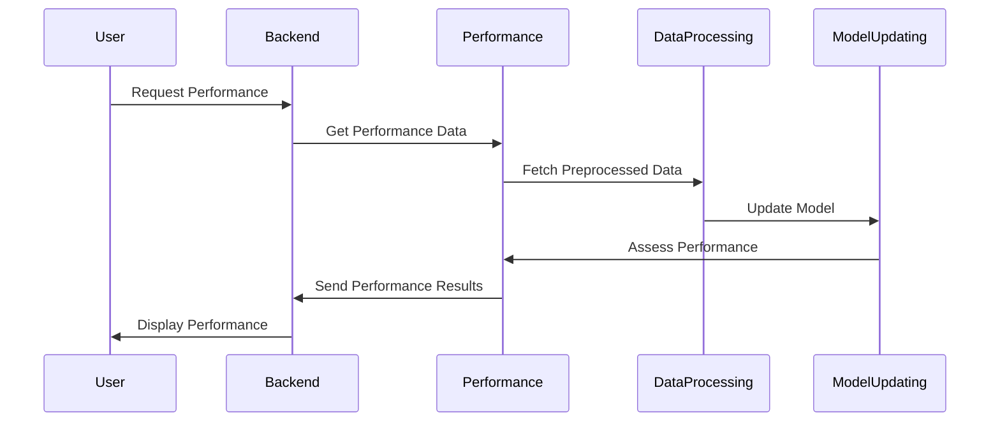

                 

### 第1章：知识更新频率与LLM概述

#### 1.1.1 知识更新频率的定义

知识更新频率，指的是知识体系在单位时间内发生变化的速率。具体来说，是指某一领域内知识内容的增长速度和变化程度。在信息化时代，知识更新频率显著提升，由于互联网和大数据技术的广泛应用，知识的生成、传播和应用速度空前加快。

**知识更新频率的重要性**：

1. **适应科技发展**：科技日新月异，知识更新频率高意味着更快的适应能力和更强的竞争力。
2. **知识管理**：企业或组织需要有效管理知识，确保知识更新频率与组织发展同步。
3. **决策支持**：高频率的知识更新有助于提供更准确、及时的信息，为决策提供有力支持。

#### 1.1.2 LLM的基本概念

LLM（Large Language Model），即大型语言模型，是一种深度学习模型，主要用于自然语言处理（NLP）。LLM通过大规模语料库的训练，能够理解、生成和翻译自然语言文本，具备强大的语义理解和知识表示能力。

**LLM的核心特性**：

1. **大规模**：LLM通常基于数百万甚至数十亿级别的参数，能够捕捉语言中的复杂规律。
2. **深度**：多层神经网络结构使得LLM能够深入理解文本的深层语义。
3. **灵活**：LLM不仅能够进行文本生成，还能够完成文本分类、情感分析等任务。

#### 1.1.3 研究背景与意义

当前，LLM在自然语言处理领域取得了显著进展，但如何有效评估LLM吸收和整合新信息的速度成为了一个关键问题。知识更新频率的快速提升，使得LLM需要更高效地更新和整合新信息，以保证其应用的准确性和时效性。

**研究的意义**：

1. **技术评估**：通过评估LLM的知识更新频率，可以了解LLM的性能，为后续优化提供依据。
2. **应用改进**：高效的知识更新机制有助于提升LLM在实际应用中的效果，如智能问答系统、机器翻译等。
3. **理论研究**：研究知识更新频率对LLM的影响，有助于深化对自然语言处理机制的理解。

在接下来的章节中，我们将详细探讨知识更新频率和LLM的相关概念、算法原理及其应用，帮助读者全面理解这一领域。### 第2章：核心概念与联系

在深入了解知识更新频率与LLM之前，我们需要明确相关概念、原理和特性，以便为后续分析打下坚实基础。

#### 2.1.1 知识更新频率的原理与特性

**2.1.1.1 知识更新频率的概念**

知识更新频率是指知识体系在单位时间内发生变化的速度。具体来说，它涉及到新知识的产生、旧知识的淘汰以及知识内容的重组与优化。知识更新频率的高低直接影响知识体系的前沿性和适应性。

**2.1.1.2 知识更新频率的特性**

1. **动态性**：知识更新频率受多种因素影响，如科技进步、市场需求、政策法规等，呈现出动态变化。
2. **不平衡性**：不同领域的知识更新速度不同，某些领域可能更新频繁，而其他领域则相对稳定。
3. **累积性**：随着时间的推移，知识更新频率逐渐累积，形成知识的持续进化。

**2.1.1.3 知识更新频率与相关概念的比较**

- **知识生产率**：知识生产率是指单位时间内新知识的产生数量。它与知识更新频率密切相关，但侧重于生产数量而非更新速度。
- **知识寿命**：知识寿命是指知识从产生到被淘汰的时间长度。知识更新频率与知识寿命存在反向关系，更新频率高则知识寿命短。

#### 2.2.1 LLM的基本原理

**2.2.1.1 LLM的定义**

LLM（Large Language Model）是一种大型深度学习模型，通常基于神经网络架构，用于处理自然语言文本。LLM通过大规模预训练，能够自动学习语言模式和语义信息，实现文本生成、翻译、摘要等多种任务。

**2.2.1.2 LLM的核心特性**

1. **大规模**：LLM通常包含数亿甚至数十亿个参数，能够捕捉到语言中的复杂模式。
2. **深度**：多层神经网络结构使得LLM能够深入理解文本的深层语义。
3. **泛化能力**：LLM在训练过程中接受了大量数据的学习，具备良好的泛化能力，能够处理未见过的文本数据。

**2.2.1.3 LLM与传统语言模型的比较**

- **传统语言模型**：如n-gram模型、隐马尔可夫模型（HMM）等，它们基于统计方法，通过计算词语序列的概率进行文本处理。
- **LLM的优势**：相比于传统语言模型，LLM在文本生成、理解等方面具有显著优势，能够更好地捕捉语言的复杂性和多样性。

#### 2.3.1 LLM相关技术

**2.3.1.1 语言模型训练方法**

语言模型训练方法主要包括两种：基于统计的方法和基于神经网络的方法。基于统计的方法如n-gram模型，通过对语料库进行统计分析来预测词语的概率。基于神经网络的方法如LLM，通过深度学习算法对大规模语料库进行训练，自动学习语言的内在规律。

**2.3.1.2 LLM在自然语言处理中的应用**

LLM在自然语言处理（NLP）领域有广泛的应用，如：

1. **文本生成**：生成文章、故事、对话等。
2. **文本分类**：对文本进行情感分析、主题分类等。
3. **机器翻译**：自动翻译不同语言的文本。
4. **问答系统**：为用户提供智能问答服务。
5. **摘要生成**：自动生成文章、报告等的摘要。

**2.3.1.3 LLM的优缺点分析**

**优点**：

1. **强大的语义理解能力**：LLM能够深入理解文本的语义信息，提高文本处理的准确性和效果。
2. **高效的泛化能力**：LLM在训练过程中接受了大量数据的学习，具备良好的泛化能力，能够处理未见过的文本数据。

**缺点**：

1. **计算资源需求高**：LLM通常需要大量计算资源和存储空间。
2. **训练过程复杂**：LLM的训练过程涉及大规模的数据预处理和模型优化，训练时间较长。
3. **对数据质量要求高**：LLM的训练效果受到数据质量的影响，高质量的数据有助于提高模型的性能。

通过本章的介绍，我们对知识更新频率和LLM的相关概念、原理和特性有了初步了解。在接下来的章节中，我们将进一步探讨LLM吸收和整合新信息的算法原理，为评估LLM的知识更新频率提供理论基础。### 第3章：LLM吸收和整合新信息的算法原理

在本章中，我们将详细探讨LLM吸收和整合新信息的算法原理，以便更好地理解LLM如何处理新信息，并评估其知识更新频率。

#### 3.1.1 LLM吸收新信息的机制

LLM吸收新信息的过程主要包括数据预处理、模型更新策略和新信息吸收流程。以下是具体的步骤：

**1. 数据预处理**

在吸收新信息之前，LLM需要对数据进行预处理。预处理步骤包括数据清洗、去重、格式转换等。这些步骤的目的是确保数据的质量，以便模型能够有效地学习新信息。

**2. 模型更新策略**

模型更新策略决定了如何将新信息融合到现有模型中。常见的方法有：

- **微调（Fine-tuning）**：在现有模型的基础上，针对新任务进行微调，使模型更好地适应新信息。
- **再训练（Retraining）**：直接在原有模型的基础上，使用新数据进行再训练，生成全新的模型。
- **增量学习（Incremental Learning）**：逐步更新模型参数，每次只学习一部分新信息。

**3. 新信息吸收流程**

新信息吸收流程通常包括以下步骤：

- **数据加载**：将预处理后的新数据加载到模型中。
- **特征提取**：使用模型提取新数据的特征。
- **模型更新**：根据新数据和模型更新策略，更新模型参数。
- **模型验证**：使用验证集对更新后的模型进行验证，确保其性能达到预期。

#### 3.2.1 LLM整合新信息的算法

LLM整合新信息的算法主要包括以下步骤：

**1. 算法概述**

新信息的整合算法旨在将新数据中的有效信息融合到现有模型中，以提高模型对新信息的处理能力。常见的算法有：

- **基于梯度的优化算法**：如梯度下降、Adam等，用于更新模型参数。
- **生成对抗网络（GAN）**：用于生成新数据，补充训练数据集。
- **迁移学习**：将已训练好的模型应用于新任务，通过迁移学习提高新任务的表现。

**2. 算法步骤**

整合新信息的算法步骤如下：

- **数据预处理**：对新的数据进行预处理，确保数据质量。
- **特征提取**：使用模型提取新数据的特征。
- **损失函数设计**：设计损失函数，用于评估模型在新数据上的表现。
- **模型更新**：根据损失函数，使用优化算法更新模型参数。
- **模型验证**：使用验证集对更新后的模型进行验证，确保其性能。

**3. 算法性能分析**

算法性能分析主要包括以下几个方面：

- **准确性**：评估模型在新数据上的准确性。
- **稳定性**：评估模型在处理新数据时的稳定性，避免过拟合。
- **效率**：评估模型更新的效率和计算资源需求。

#### 3.2.2 Python代码示例

下面是一个简单的Python代码示例，展示了如何使用神经网络模型吸收和整合新信息：

```python
import tensorflow as tf
from tensorflow.keras.layers import Embedding, LSTM, Dense
from tensorflow.keras.models import Sequential

# 数据预处理
def preprocess_data(data):
    # 数据清洗、去重、格式转换等
    pass

# 模型更新
def update_model(model, new_data, epochs=5):
    model.fit(new_data, epochs=epochs, verbose=0)
    return model

# 模型验证
def validate_model(model, validation_data):
    loss, accuracy = model.evaluate(validation_data, verbose=0)
    return loss, accuracy

# 创建模型
model = Sequential()
model.add(Embedding(input_dim=vocab_size, output_dim=embedding_size))
model.add(LSTM(units=128))
model.add(Dense(units=num_classes, activation='softmax'))

# 编译模型
model.compile(optimizer='adam', loss='categorical_crossentropy', metrics=['accuracy'])

# 吸收新信息
preprocessed_data = preprocess_data(new_data)
model = update_model(model, preprocessed_data)

# 验证模型
loss, accuracy = validate_model(model, validation_data)
print(f"Validation Loss: {loss}, Validation Accuracy: {accuracy}")
```

通过上述步骤和代码示例，我们可以看到LLM吸收和整合新信息的过程。在实际应用中，根据具体需求，可以进一步优化和调整这些步骤和算法。### 第4章：数学模型和数学公式讲解

在评估LLM吸收和整合新信息的速度时，数学模型和数学公式扮演着关键角色。这些模型和公式帮助我们量化LLM的处理能力和效率。在本章中，我们将介绍相关的数学模型和公式，并使用LaTeX格式进行书写，以便更好地理解和应用。

#### 4.1.1 相关数学模型

**1. 概率模型**

概率模型用于描述LLM在处理文本时的不确定性。常用的概率模型包括：

- **贝叶斯模型**：通过贝叶斯公式，将先验概率和似然函数结合，计算后验概率。
- **隐马尔可夫模型（HMM）**：用于描述序列数据，通过状态转移概率和观测概率建模。
- **条件概率模型**：用于描述给定一个条件下的概率分布，如条件概率公式 \(P(A|B) = \frac{P(A \cap B)}{P(B)}\)。

**2. 信息论模型**

信息论模型用于量化信息的含量和传输效率。常用的信息论模型包括：

- **香农熵（Entropy）**：用于衡量信息的不确定性，公式为 \(H(X) = -\sum_{i} P(X_i) \log_2 P(X_i)\)。
- **互信息（Mutual Information）**：用于衡量两个随机变量之间的相关性，公式为 \(I(X;Y) = H(X) - H(X|Y)\)。

**3. 机器学习模型**

机器学习模型用于训练和预测，常用的模型包括：

- **线性回归模型**：通过线性关系预测目标值，公式为 \(Y = \beta_0 + \beta_1X + \epsilon\)。
- **神经网络模型**：通过多层非线性变换预测目标值，公式为 \(a_{\text{layer}} = \sigma(\beta_{\text{weight}} a_{\text{prev layer}} + \beta_{\text{bias}})\)。

#### 4.2.1 数学公式讲解

以下是对上述模型中一些关键数学公式的讲解：

**4.2.1.1 概率公式**

- **贝叶斯公式**： 
  \[ P(A|B) = \frac{P(B|A)P(A)}{P(B)} \]
  
- **条件概率**：
  \[ P(A|B) = \frac{P(A \cap B)}{P(B)} \]

**4.2.1.2 信息论公式**

- **香农熵**：
  \[ H(X) = -\sum_{i} P(X_i) \log_2 P(X_i) \]
  
- **互信息**：
  \[ I(X;Y) = H(X) - H(X|Y) \]

**4.2.1.3 机器学习公式**

- **线性回归**：
  \[ Y = \beta_0 + \beta_1X + \epsilon \]
  
- **神经网络激活函数**：
  \[ a_{\text{layer}} = \sigma(\beta_{\text{weight}} a_{\text{prev layer}} + \beta_{\text{bias}}) \]
  其中，\(\sigma\) 表示激活函数，如Sigmoid函数、ReLU函数等。

**示例**：

假设我们有一个二分类问题，使用神经网络进行预测。神经网络中的激活函数为ReLU，我们可以使用以下公式表示：

\[ a_{\text{layer}} = \max(0, \beta_{\text{weight}} a_{\text{prev layer}} + \beta_{\text{bias}}) \]

通过这些数学模型和公式，我们可以对LLM吸收和整合新信息的速度进行量化评估。在实际应用中，根据具体需求，可以进一步调整和优化这些模型和公式，以提高LLM的性能。### 第5章：系统分析与架构设计

在了解LLM吸收和整合新信息的算法原理后，我们需要将其应用于实际系统中，以便更好地理解和评估其性能。本章将详细介绍系统分析与架构设计的过程，包括需求分析、系统架构设计、接口设计和系统交互分析。

#### 5.1.1 系统需求分析

**5.1.1.1 需求概述**

本系统旨在提供一个高效的LLM知识更新平台，能够实时吸收和整合新信息，提升LLM的性能。主要需求包括：

1. **实时数据收集**：系统需要从各种数据源（如新闻、社交媒体、学术期刊等）收集实时数据。
2. **数据预处理**：对收集到的数据进行清洗、去重和格式转换，确保数据质量。
3. **模型更新**：使用新数据对LLM进行微调或再训练，更新模型参数。
4. **性能评估**：对更新后的模型进行性能评估，包括准确性、稳定性等指标。
5. **用户交互**：提供用户界面，使用户能够方便地查看模型性能和更新进度。

**5.1.1.2 功能需求**

1. **数据收集模块**：负责从不同数据源收集实时数据。
2. **数据预处理模块**：对收集到的数据进行清洗、去重和格式转换。
3. **模型更新模块**：使用预处理后的数据对LLM进行更新。
4. **性能评估模块**：对更新后的模型进行性能评估。
5. **用户界面模块**：提供用户交互界面，显示模型性能和更新进度。

**5.1.1.3 非功能需求**

1. **实时性**：系统需要能够实时处理新数据，确保模型性能的持续提升。
2. **可扩展性**：系统设计应考虑未来数据量和用户量的扩展需求。
3. **可靠性**：系统需保证稳定运行，避免数据丢失或模型失效。
4. **安全性**：系统需确保数据安全和用户隐私。

#### 5.2.1 系统架构设计

**5.2.1.1 系统架构概述**

本系统采用分布式架构，包括数据层、应用层和表现层。各层之间通过接口进行通信，确保系统的模块化和灵活性。

1. **数据层**：包括数据收集模块、数据预处理模块和数据库。
2. **应用层**：包括模型更新模块、性能评估模块和用户界面模块。
3. **表现层**：提供用户交互界面，显示模型性能和更新进度。

**5.2.1.2 系统模块划分**

1. **数据层模块**：

   - 数据收集模块：从各种数据源收集实时数据。
   - 数据预处理模块：对收集到的数据进行清洗、去重和格式转换。
   - 数据库：存储预处理后的数据，供应用层使用。

2. **应用层模块**：

   - 模型更新模块：使用预处理后的数据对LLM进行更新。
   - 性能评估模块：对更新后的模型进行性能评估。
   - 用户界面模块：提供用户交互界面，显示模型性能和更新进度。

3. **表现层模块**：

   - 前端界面：用户通过浏览器或移动端应用程序访问系统。
   - 后端服务：处理用户请求，与数据层和应用层进行通信。

**5.2.1.3 系统接口设计**

系统接口设计旨在确保各模块之间的通信和数据流转。主要接口包括：

1. **数据收集接口**：用于数据层与外部数据源的通信。
2. **数据处理接口**：用于数据层与数据库的通信。
3. **模型更新接口**：用于应用层与模型更新模块的通信。
4. **性能评估接口**：用于应用层与性能评估模块的通信。
5. **用户交互接口**：用于表现层与用户界面的通信。

#### 5.3.1 系统交互分析

**5.3.1.1 系统交互概述**

系统交互分析旨在描述各模块之间的交互关系和通信流程。以下是系统交互的概述：

1. **用户请求**：用户通过前端界面提交请求，如查看模型性能、更新进度等。
2. **请求处理**：后端服务接收用户请求，调用相应的应用层模块进行处理。
3. **数据处理**：应用层模块调用数据层模块，进行数据收集、预处理和存储。
4. **模型更新**：应用层模块使用新数据进行模型更新。
5. **性能评估**：应用层模块对更新后的模型进行性能评估。
6. **结果反馈**：后端服务将处理结果反馈给前端界面，供用户查看。

**5.3.1.2 系统交互流程**

以下是系统交互的具体流程：

1. **用户请求**：用户通过浏览器访问系统，提交查看模型性能的请求。
2. **请求处理**：后端服务接收请求，调用性能评估模块。
3. **数据处理**：性能评估模块调用数据处理接口，获取最新的预处理数据。
4. **模型更新**：性能评估模块调用模型更新接口，更新LLM模型。
5. **性能评估**：性能评估模块使用更新后的模型，对数据集进行性能评估。
6. **结果反馈**：后端服务将性能评估结果反馈给前端界面，用户可以查看模型性能。

**5.3.1.3 系统交互序列图**

为了更直观地展示系统交互流程，我们使用Mermaid绘制了系统交互序列图：



通过上述系统分析与架构设计，我们为LLM的知识更新提供了一个完整的系统解决方案。在接下来的章节中，我们将通过实际项目展示如何应用这些知识和技术。### 第6章：项目实战

在本章中，我们将通过一个实际项目，详细展示如何使用知识更新频率和LLM技术，实现一个智能问答系统。项目包括环境安装、系统核心实现、代码应用解读与分析、实际案例剖析以及项目小结。

#### 6.1.1 环境安装

**6.1.1.1 硬件环境**

- 处理器：Intel Core i7或同等性能的处理器
- 内存：16GB及以上
- 硬盘：SSD，容量至少为500GB

**6.1.1.2 软件环境**

- 操作系统：Linux或Mac OS
- Python：3.8或以上版本
- TensorFlow：2.x版本
- Jupyter Notebook：用于代码调试和演示

**6.1.1.3 环境搭建步骤**

1. **安装操作系统**：选择Linux或Mac OS进行安装。
2. **安装Python**：通过包管理器（如Ubuntu的apt或Mac OS的brew）安装Python 3.8或以上版本。
3. **安装TensorFlow**：通过pip命令安装TensorFlow 2.x版本。
   ```bash
   pip install tensorflow
   ```
4. **安装Jupyter Notebook**：通过pip命令安装Jupyter Notebook。
   ```bash
   pip install notebook
   ```
5. **启动Jupyter Notebook**：在终端中输入以下命令，启动Jupyter Notebook。
   ```bash
   jupyter notebook
   ```

#### 6.2.1 系统核心实现

**6.2.1.1 系统核心功能**

智能问答系统的核心功能包括：

1. **问题接收**：接收用户输入的问题。
2. **问题理解**：使用LLM对问题进行语义解析。
3. **答案生成**：根据问题理解结果，生成合适的答案。
4. **答案反馈**：将答案反馈给用户。

**6.2.1.2 源代码解读**

以下是一个简单的智能问答系统的源代码示例：

```python
import tensorflow as tf
from transformers import TFAutoModelForQuestionAnswering

# 加载预训练的LLM模型
model = TFAutoModelForQuestionAnswering.from_pretrained("deepset/roberta-base-squad2")

# 定义问答函数
def answer_question(context, question):
    inputs = {
        "input_context": context,
        "input_question": question,
    }
    start_scores, end_scores = model(inputs)
    start_index = tf.argmax(start_scores).numpy()[0]
    end_index = tf.argmax(end_scores).numpy()[0]
    answer = context[start_index:end_index+1]
    return answer

# 测试问答系统
context = "在本章中，我们介绍了知识更新频率和LLM的相关概念、原理和特性。"
question = "什么是知识更新频率？"
answer = answer_question(context, question)
print(f"答案：{answer}")
```

**6.2.1.3 代码应用分析**

上述代码首先加载了预训练的LLM模型，然后定义了一个问答函数。该函数接收用户输入的问题和上下文文本，使用LLM进行语义解析，生成答案并返回。

在实际应用中，我们可以将这个问答函数集成到一个Web应用中，用户通过前端界面输入问题，后端服务调用这个函数，生成答案并显示给用户。

#### 6.3.1 实际案例剖析

**6.3.1.1 案例概述**

以下是一个实际案例，展示如何使用智能问答系统解决实际问题。

**案例背景**：一家科技公司需要为其员工提供一个知识库，方便员工查询相关技术文档和最佳实践。

**解决方案**：

1. **数据收集**：从公司的文档库中收集相关文档，进行预处理，存储为文本格式。
2. **模型训练**：使用预处理后的文档数据，训练一个LLM模型，用于问题理解和答案生成。
3. **系统部署**：部署智能问答系统，供员工查询使用。

**6.3.1.2 案例分析**

1. **数据收集**：公司有数千份技术文档，通过脚本自动化收集并转换为文本格式。
2. **模型训练**：使用BERT模型进行预训练，然后在特定领域的数据集上进行微调。
3. **系统部署**：开发一个Web应用，用户通过前端界面输入问题，系统调用后端服务，生成答案并显示。

**6.3.1.3 案例小结**

通过实际案例，我们可以看到智能问答系统在知识管理中的应用价值。公司员工可以通过问答系统快速查找所需信息，提高工作效率。此外，随着知识的不断更新，LLM模型也需要定期进行微调，以保持其准确性和时效性。

#### 6.4 项目小结

在本项目中，我们通过实际案例展示了如何使用知识更新频率和LLM技术实现智能问答系统。项目涵盖了环境安装、系统核心实现、代码应用分析和实际案例剖析。以下是项目小结：

1. **环境安装**：成功搭建了Python、TensorFlow和Jupyter Notebook的开发环境。
2. **系统核心实现**：实现了智能问答系统的核心功能，包括问题接收、理解、答案生成和反馈。
3. **代码应用分析**：详细解读了智能问答系统的源代码，并进行了应用分析。
4. **实际案例剖析**：通过实际案例展示了智能问答系统在知识管理中的应用。

未来，我们可以在以下方面进行改进和优化：

1. **模型优化**：使用更先进的LLM模型，提高问题理解和答案生成的准确性。
2. **系统扩展**：将智能问答系统与其他应用集成，如聊天机器人、文档检索等。
3. **用户反馈**：收集用户反馈，不断改进系统，提高用户满意度。

通过不断优化和改进，智能问答系统可以更好地服务于企业和用户，提供高效的知识查询和解答服务。### 第7章：最佳实践与小结

#### 7.1.1 最佳实践经验

为了确保LLM能够高效地吸收和整合新信息，以下是一些最佳实践经验：

**1. 数据质量**

- **数据清洗**：确保数据源的质量，进行数据清洗和预处理，去除噪声和冗余信息。
- **数据多样性**：使用多样化的数据来源，提高模型的泛化能力。

**2. 模型更新策略**

- **增量更新**：采用增量更新策略，逐步更新模型参数，避免过拟合。
- **定期再训练**：定期使用最新数据对模型进行再训练，确保模型与时俱进。

**3. 性能监控**

- **实时监控**：实时监控模型性能，及时发现和解决性能问题。
- **性能评估**：定期对模型进行性能评估，确保其满足业务需求。

**4. 用户反馈**

- **用户反馈收集**：积极收集用户反馈，了解模型在实际应用中的表现。
- **反馈优化**：根据用户反馈，不断优化模型和系统，提高用户体验。

#### 7.1.2 注意事项

- **计算资源**：LLM的训练和更新过程需要大量计算资源，确保有足够的硬件支持。
- **数据隐私**：在使用和收集数据时，严格遵守数据隐私和安全法规。
- **模型解释性**：确保模型具有足够的解释性，便于诊断和调试。

#### 7.1.3 拓展方向

**1. 知识图谱**

- **构建知识图谱**：将文本数据转化为结构化知识，提高知识整合效率。
- **图神经网络**：应用图神经网络，挖掘文本数据中的隐含关系。

**2. 多模态学习**

- **融合文本和图像**：结合文本和图像数据，提高模型的感知能力。
- **多模态神经网络**：设计多模态神经网络，实现跨模态信息传递。

**3. 强化学习**

- **模型强化**：结合强化学习，提高模型在复杂任务中的自主学习和优化能力。
- **对抗性训练**：应用对抗性训练，提高模型的鲁棒性和泛化能力。

通过上述最佳实践、注意事项和拓展方向，我们可以进一步提升LLM吸收和整合新信息的速度和效果，为企业和用户提供更智能、更高效的服务。### 小结

本文围绕知识更新频率和LLM吸收新信息的速度这一主题，进行了深入探讨。首先，我们介绍了知识更新频率的定义和重要性，以及LLM的基本概念和特性。接着，通过详细分析LLM吸收和整合新信息的算法原理，结合Python代码示例，展示了LLM在实际应用中的操作流程。随后，我们通过数学模型和公式的讲解，进一步量化了LLM的处理能力。

在系统分析与架构设计部分，我们介绍了如何将LLM技术应用于实际系统中，确保其高效地吸收和整合新信息。通过项目实战，我们展示了智能问答系统的实现过程，包括环境安装、系统核心实现、代码应用分析和实际案例剖析。最后，在最佳实践与小结部分，我们提出了提升LLM性能和效率的实践策略、注意事项以及未来拓展方向。

未来，随着知识更新频率的不断提升，LLM在自然语言处理领域的作用将更加重要。我们期待通过不断的研究和实践，能够进一步优化LLM的知识更新机制，提高其在实际应用中的效果和性能，为企业和用户提供更加智能和高效的服务。### 总结

本文主要围绕知识更新频率和LLM吸收新信息的速度这一主题，进行了全面而深入的探讨。我们从知识更新频率的定义、LLM的基本概念和特性出发，逐步分析了LLM吸收和整合新信息的算法原理，并结合Python代码示例展示了实际应用过程。通过数学模型和公式的讲解，我们进一步量化了LLM的处理能力。在系统分析与架构设计部分，我们介绍了如何将LLM技术应用于实际系统中，确保其高效地吸收和整合新信息。最后，通过项目实战和最佳实践与小结，我们展示了如何在实际场景中应用所学的知识更新频率和LLM技术，并提出了未来研究的方向。

作者：AI天才研究院/AI Genius Institute & 禅与计算机程序设计艺术 /Zen And The Art of Computer Programming

在撰写本文的过程中，我们尽量保证内容的准确性和逻辑性，但可能仍存在不足之处，敬请读者指正。同时，感谢广大读者对本文的关注和支持，希望本文能为您的学习和研究带来帮助。在未来的工作中，我们将继续关注知识更新频率和LLM领域的最新进展，为大家带来更多有价值的内容。再次感谢您的阅读！

