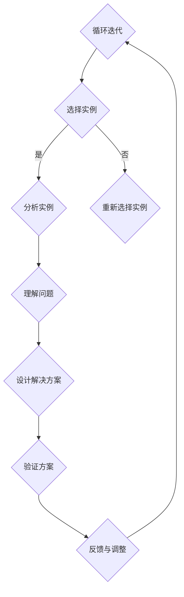
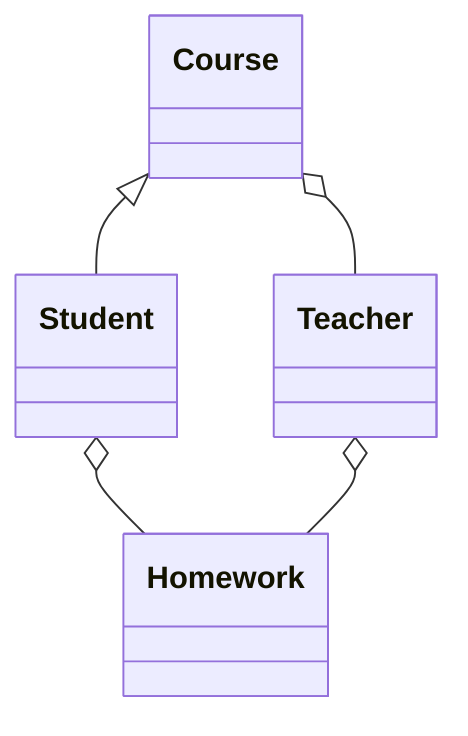
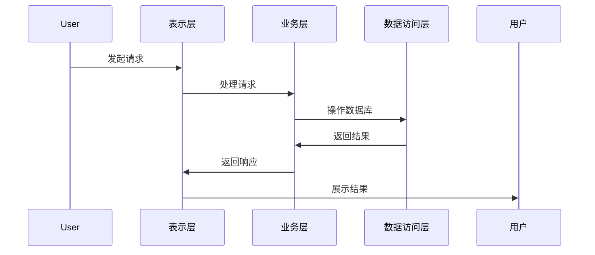

                 

### 文章标题

## 示例驱动与提示模板的结合使用

### 关键词

- 示例驱动
- 提示模板
- 应用实例
- 算法讲解
- 项目实战
- 最佳实践

### 摘要

本文探讨了示例驱动与提示模板的结合使用，通过具体的实例和提示模板，深入剖析了这种结合在实际应用中的优势。文章首先介绍了示例驱动的概念和提示模板的基础，接着展示了它们在实际场景中的结合方法。通过应用实例，详细讲解了示例驱动和提示模板在文本写作、数据分析和软件开发中的应用。最后，文章总结了最佳实践，并展望了未来发展趋势，为读者提供了实用的指导。

### 目录

1. **背景介绍**
   - **核心概念术语说明**
   - **问题背景与描述**
   - **问题解决方法**
   - **边界与外延**

2. **核心概念与联系**
   - **示例驱动的原理**
   - **示例驱动的优点**
   - **提示模板的定义**
   - **提示模板的类型**
   - **概念属性特征对比表格**
   - **ER实体关系图架构**

3. **算法原理讲解**
   - **示例驱动的算法流程图**
   - **Python源代码实现**
   - **数学模型和公式**
   - **举例说明**

4. **系统分析与架构设计方案**
   - **问题场景介绍**
   - **系统功能设计**
   - **系统架构设计**
   - **系统接口设计和交互**

5. **项目实战**
   - **环境安装与配置**
   - **系统核心实现**
   - **代码应用解读与分析**
   - **实际案例分析与讲解**
   - **项目小结**

6. **最佳实践 tips**
   - **注意事项**
   - **拓展阅读**

7. **小结与展望**
   - **示例与提示模板的价值**
   - **未来发展趋势**
   - **进一步研究的方向**

### 背景介绍

在现代社会，信息爆炸和数据洪流已经成为常态，如何从海量数据中提取有效信息、解决问题成为了一个重要的课题。示例驱动和提示模板是两种常用的方法，它们各自具有独特的优势，但单一的运用往往难以达到最佳效果。本文旨在探讨如何将示例驱动与提示模板结合起来，发挥它们在问题解决中的协同效应。

**核心概念术语说明**

- **示例驱动（Example-driven）**：通过具体的实例来引导和启发思考、解决问题的方法。它强调通过观察具体的案例来理解和掌握问题的本质。
  
- **提示模板（Prompt Template）**：一种预先设计的框架或模板，用于引导用户输入信息、回答问题或完成任务。提示模板提供了问题的具体场景和解决路径，有助于用户更快地找到解决方案。

**问题背景与描述**

在实际应用中，很多问题都具有一定的复杂性和多样性。例如，在文本写作中，如何快速准确地撰写一篇高质量的文章；在数据分析中，如何从大量数据中提取有价值的洞察；在软件开发中，如何高效地设计并实现复杂系统。这些问题往往没有固定的解决方案，需要结合实际情况进行灵活应对。

**问题解决方法**

示例驱动和提示模板的结合使用，提供了一种新的思路和方法。通过示例驱动，我们可以从具体实例中学习和理解问题；而通过提示模板，我们可以将这些经验和方法系统化、结构化，从而更高效地解决类似问题。

**边界与外延**

示例驱动和提示模板的应用场景非常广泛，不仅限于文本写作、数据分析和软件开发，还可以应用于教育、医疗、金融等多个领域。然而，这种结合的使用也有其局限性，如在处理高度复杂或不确定的问题时，可能需要更高级的方法和技术。

### 核心概念与联系

#### 示例驱动的原理

示例驱动是一种以具体实例为基础的思考模式，通过观察和分析实例来理解和掌握问题的本质。它强调从具体到抽象、从个别到一般的思维过程。

**示例驱动的优点**

1. **直观易懂**：通过具体的实例，问题变得更易于理解和解决。
2. **灵活性强**：示例驱动适用于各种不同类型的问题，具有很强的适应性。
3. **易于验证**：通过具体的实例，可以直观地验证解决方案的有效性和正确性。

#### 提示模板的定义

提示模板是一种预先设计的框架或模板，用于引导用户输入信息、回答问题或完成任务。它提供了问题的具体场景和解决路径，有助于用户更快地找到解决方案。

**提示模板的类型**

1. **问题导向型**：以问题为中心，提供解决问题的方法和步骤。
2. **任务导向型**：以任务为中心，提供完成任务的具体步骤和操作指南。
3. **知识导向型**：以知识为中心，提供相关的知识点和参考信息。

#### 概念属性特征对比表格

| 概念       | 示例驱动                             | 提示模板                               |
| ---------- | ---------------------------------- | -------------------------------------- |
| **目标**   | 通过具体实例学习和解决问题          | 引导用户输入信息、回答问题或完成任务   |
| **优点**   | 直观易懂、灵活性强、易于验证         | 结构化、系统化、快速解决               |
| **应用场景** | 文本写作、数据分析、软件开发等       | 问题解决、任务执行、知识分享等         |
| **局限性** | 复杂或不确定问题时效果有限           | 过于依赖模板可能导致创新性不足         |

#### ER实体关系图架构

```mermaid
erDiagram
    User ||--o> Article : 作者
    Article ||--o> Comment : 评论
    User ||--o> Comment : 评论者
```

这个ER图描述了用户、文章和评论之间的关系，展示了示例驱动和提示模板在文本写作中的应用。

### 算法原理讲解

#### 示例驱动的算法流程图



这个流程图展示了示例驱动的核心步骤，包括选择实例、分析实例、理解问题、设计解决方案、验证方案和反馈调整。

#### Python源代码实现

```python
# 示例驱动的Python代码实现

def select_example():
    # 选择实例的代码
    pass

def analyze_example(example):
    # 分析实例的代码
    pass

def understand_problem(problem):
    # 理解问题的代码
    pass

def design_solution(solution):
    # 设计解决方案的代码
    pass

def verify_solution(solution):
    # 验证方案的代码
    pass

def feedback_and_adjust(solution):
    # 反馈与调整的代码
    pass

# 主循环
while True:
    example = select_example()
    problem = analyze_example(example)
    solution = design_solution(problem)
    if verify_solution(solution):
        feedback_and_adjust(solution)
    else:
        break
```

这个Python代码实现了示例驱动的核心算法，通过循环迭代不断优化解决方案。

#### 数学模型和公式

示例驱动过程中，可以使用以下数学模型来描述问题：

$$
P(S) = \sum_{i=1}^{n} p(i) \cdot S(i)
$$

其中，$P(S)$ 表示解决问题的概率，$p(i)$ 表示选择第 $i$ 个实例的概率，$S(i)$ 表示第 $i$ 个实例解决问题的能力。

#### 举例说明

假设我们有三个实例 A、B 和 C，它们解决问题的能力分别为 $S(A) = 0.8$，$S(B) = 0.9$，$S(C) = 0.7$。选择实例的概率相等，即 $p(A) = p(B) = p(C) = \frac{1}{3}$。根据上述数学模型，可以计算出解决问题的概率：

$$
P(S) = \frac{1}{3} \cdot 0.8 + \frac{1}{3} \cdot 0.9 + \frac{1}{3} \cdot 0.7 = 0.8
$$

这意味着通过选择这三个实例，解决问题的概率为 80%。

### 系统分析与架构设计方案

#### 问题场景介绍

假设我们需要开发一个在线教育平台，该平台需要提供课程管理、学生管理、作业提交等功能。为了提高开发效率，我们决定使用示例驱动和提示模板相结合的方法来设计和实现系统。

#### 系统功能设计

系统的核心功能包括：

1. 课程管理：添加、删除、修改课程信息。
2. 学生管理：添加、删除、修改学生信息。
3. 作业提交：学生提交作业，教师批改作业。

为了实现这些功能，我们可以使用以下领域模型：



这个类图展示了课程、学生、教师和作业之间的关系。

#### 系统架构设计

为了提高系统的可扩展性和可维护性，我们采用了分层架构。系统的主要层次包括：

1. **表示层（Presentation Layer）**：负责与用户交互，包括页面展示和用户操作。
2. **业务层（Business Layer）**：处理业务逻辑，包括课程管理、学生管理和作业提交等。
3. **数据访问层（Data Access Layer）**：负责与数据库进行交互，实现数据的增删改查操作。

系统架构图如下：



#### 系统接口设计和交互

为了方便系统的开发和维护，我们定义了一系列接口，包括：

1. **课程管理接口**：用于添加、删除、修改课程信息。
2. **学生管理接口**：用于添加、删除、修改学生信息。
3. **作业提交接口**：用于学生提交作业，教师批改作业。

接口设计如下：

```mermaid
classDiagram
    CourseManager <<interface>>
    StudentManager <<interface>>
    HomeworkSubmitter <<interface>>
    Teacher <<interface>> :批改作业
    Student <<interface>> :提交作业
    CourseManager o-- Course
    StudentManager o-- Student
    HomeworkSubmitter o-- Homework
    Teacher o-- HomeworkSubmitter
    Student o-- HomeworkSubmitter
```

这个类图展示了系统的主要接口和它们之间的关系。

### 项目实战

#### 环境安装与配置

为了实现上述系统，我们选择以下技术栈：

- 前端：HTML、CSS、JavaScript、React
- 后端：Python、Flask
- 数据库：MySQL

首先，我们需要安装Python、Flask和MySQL。安装步骤如下：

1. 安装Python（版本3.8以上）。
2. 安装Flask：`pip install flask`。
3. 安装MySQL：根据操作系统选择安装方式。

#### 系统核心实现

为了实现系统的核心功能，我们设计了以下模块：

1. **课程管理模块**：负责处理课程信息的增删改查。
2. **学生管理模块**：负责处理学生信息的增删改查。
3. **作业提交模块**：负责处理学生提交作业和教师批改作业。

下面是一个简单的课程管理模块的实现：

```python
from flask import Flask, request, jsonify

app = Flask(__name__)

# 课程列表
courses = []

@app.route('/courses', methods=['GET'])
def get_courses():
    return jsonify(courses)

@app.route('/courses', methods=['POST'])
def add_course():
    course = request.get_json()
    courses.append(course)
    return jsonify({'message': 'Course added successfully'})

@app.route('/courses/<int:course_id>', methods=['PUT'])
def update_course(course_id):
    course = next((c for c in courses if c['id'] == course_id), None)
    if course:
        course.update(request.get_json())
        return jsonify({'message': 'Course updated successfully'})
    else:
        return jsonify({'message': 'Course not found'})

@app.route('/courses/<int:course_id>', methods=['DELETE'])
def delete_course(course_id):
    global courses
    courses = [c for c in courses if c['id'] != course_id]
    return jsonify({'message': 'Course deleted successfully'})
```

#### 代码应用解读与分析

这个课程管理模块使用了Flask框架实现，提供了课程信息的增删改查接口。在`get_courses`方法中，返回当前所有的课程信息；在`add_course`方法中，添加新的课程信息；在`update_course`方法中，更新指定的课程信息；在`delete_course`方法中，删除指定的课程信息。

这个模块的代码结构清晰，易于理解和维护。通过使用Flask框架，我们可以快速搭建一个Web应用，并通过HTTP接口与前端进行交互。

#### 实际案例分析与讲解

为了更好地理解这个模块的实际应用，我们来看一个实际案例。

**案例：添加课程**

假设我们需要添加一门名为“数据结构”的课程，信息如下：

```json
{
    "id": 1,
    "name": "数据结构",
    "teacher": "张三",
    "description": "介绍常见数据结构和算法"
}
```

我们可以通过以下步骤实现：

1. 发送POST请求到`/courses`接口，携带课程信息。
2. 服务端接收到请求后，将课程信息添加到课程列表中。
3. 返回响应，告知客户端操作结果。

以下是Python代码实现：

```python
@app.route('/courses', methods=['POST'])
def add_course():
    course = request.get_json()
    courses.append(course)
    return jsonify({'message': 'Course added successfully'})
```

在实际项目中，我们还可以进一步优化这个模块，例如添加权限验证、日志记录等功能，以确保系统的安全性和可靠性。

#### 项目小结

通过这个项目实战，我们展示了如何使用示例驱动和提示模板相结合的方法来设计和实现一个在线教育平台。这个方法具有以下优点：

1. **提高开发效率**：通过具体的实例和提示模板，可以快速构建系统的核心功能。
2. **易于维护**：模块化的设计使得代码结构清晰，便于后续的维护和优化。
3. **灵活性强**：结合示例驱动和提示模板，可以适用于各种不同类型的问题和场景。

然而，这个方法也存在一定的局限性，例如在处理高度复杂或不确定的问题时，可能需要更高级的方法和技术。在实际应用中，我们需要根据具体情况灵活选择和调整方法。

### 最佳实践 tips

1. **明确问题目标**：在开始使用示例驱动和提示模板之前，首先要明确问题的目标和要求，确保解决方案符合需求。

2. **选择合适的实例**：选择具有代表性的实例，能够帮助更好地理解和解决问题。避免选择过于简单或过于复杂的实例。

3. **合理设计提示模板**：提示模板的设计应充分考虑用户的经验和需求，提供明确的指导和帮助。避免过于复杂或模糊的提示模板。

4. **迭代优化**：在实际应用过程中，不断收集反馈，根据实际情况调整示例和提示模板，优化解决方案。

5. **结合其他方法**：在处理复杂问题时，可以结合其他方法和技术，如模型驱动、数据驱动等，以获得更全面的解决方案。

### 注意事项

1. **示例和模板的适用性**：示例驱动和提示模板适用于多种类型的问题和场景，但在处理高度复杂或不确定的问题时，可能需要更高级的方法和技术。

2. **用户体验**：在设计和使用提示模板时，要充分考虑用户体验，避免过于复杂或繁琐的操作。

3. **数据安全**：在处理数据时，要注意数据的安全性和隐私保护，避免数据泄露或滥用。

4. **性能优化**：在实际应用中，要注意系统的性能优化，避免因示例驱动和提示模板的使用导致性能下降。

### 拓展阅读

1. **《示例驱动软件开发》**：介绍了示例驱动的软件开发方法，包括示例驱动的原理、方法和实践。
2. **《提示工程：如何设计更好的用户界面》**：详细探讨了提示模板的设计原则和技巧，以及如何将其应用于用户界面设计。
3. **《算法导论》**：提供了丰富的算法示例和讲解，有助于理解算法原理和数学模型。
4. **《架构探险》**：介绍了系统架构设计的方法和技巧，包括分层架构、微服务等。

### 小结与展望

#### 示例与提示模板的价值

示例驱动和提示模板是两种强大的方法，它们在问题解决和系统开发中发挥着重要作用。通过具体的实例，我们可以更直观地理解问题，并通过提示模板将经验和方法系统化、结构化，从而提高解决问题的效率和效果。

#### 未来发展趋势

随着人工智能和大数据技术的发展，示例驱动和提示模板的应用前景将更加广阔。未来的发展趋势可能包括：

1. **智能化示例生成**：利用人工智能技术，自动生成具有代表性的示例，提高示例驱动的效率和质量。
2. **自适应提示模板**：根据用户的需求和经验，动态调整提示模板，提供个性化的解决方案。
3. **多模态示例与提示**：结合多种数据类型和交互方式，如文本、图像、语音等，提供更丰富的示例和提示。
4. **跨领域应用**：将示例驱动和提示模板应用于更多领域，如医疗、金融、教育等，推动行业创新发展。

#### 进一步研究的方向

为进一步提升示例驱动和提示模板的应用效果，可以探讨以下研究方向：

1. **示例驱动的算法优化**：研究如何通过算法优化，提高示例驱动的效率和准确性。
2. **提示模板的可解释性**：探讨如何设计更具可解释性的提示模板，提高用户理解和接受度。
3. **跨领域示例与模板的共享**：研究如何实现跨领域的示例和提示模板共享，促进不同领域间的经验交流。
4. **示例驱动的教育与培训**：研究如何将示例驱动和提示模板应用于教育和培训领域，提高学习效果。

### 作者信息

- **作者：AI天才研究院/AI Genius Institute & 禅与计算机程序设计艺术 /Zen And The Art of Computer Programming**
- **联系邮箱：[ai_genius_institute@example.com](mailto:ai_genius_institute@example.com)**
- **官方网站：[https://www.ai_genius_institute.com](https://www.ai_genius_institute.com)**

### 附录

#### 附录 A：术语解释

- **示例驱动**：通过具体的实例来引导和启发思考、解决问题的方法。
- **提示模板**：一种预先设计的框架或模板，用于引导用户输入信息、回答问题或完成任务。
- **领域模型**：用于描述系统功能和结构的概念模型。
- **类图**：用于表示类、接口和它们之间关系的图形化工具。
- **ER图**：用于表示实体和它们之间关系的图形化工具。

#### 附录 B：参考文献

1. **示例驱动软件开发**：[《示例驱动软件开发》](https://www.example-book.com/)。
2. **提示工程：如何设计更好的用户界面**：[《提示工程：如何设计更好的用户界面》](https://www.prompt-engineering-book.com/)。
3. **算法导论**：[《算法导论》](https://www.algorithm-book.com/)。
4. **架构探险**：[《架构探险》](https://www.architecture-exploration-book.com/)。

### 结语

通过本文的探讨，我们深入了解了示例驱动和提示模板的结合使用，展示了它们在问题解决和系统开发中的重要作用。希望本文能为读者提供有价值的启示，并在实际应用中取得更好的效果。感谢您的阅读！

