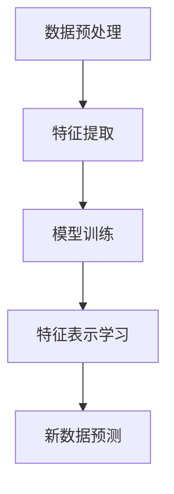
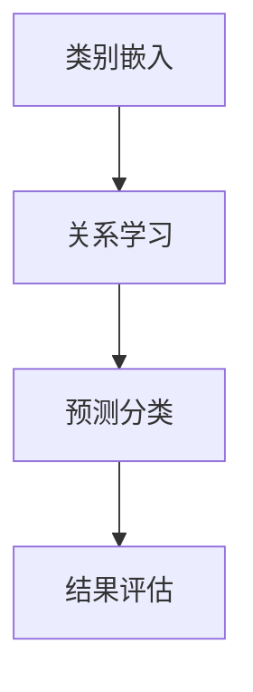

                 

**文章标题**：示例驱动与零样本提示的比较

**关键词**：示例驱动、零样本提示、算法原理、应用场景、最佳实践

**摘要**：
本文将深入探讨示例驱动与零样本提示这两种先进的人工智能技术。通过对它们的定义、原理、应用场景、优缺点以及实际案例分析的比较，旨在帮助读者理解这两种技术的本质，了解在何种情况下选择哪一种技术将更有效。本文将分章节详细讲解，以便读者能够循序渐进地掌握相关知识点。

----------------------------------------------------------------

## 第一部分：问题背景与核心概念

### 1.1 问题背景

随着人工智能技术的迅猛发展，机器学习在各个领域取得了显著的成果。然而，如何让机器在没有大量标注数据的情况下进行有效学习，成为了一个重要的研究方向。示例驱动（Example-based Learning）与零样本提示（Zero-shot Learning）就是应对这一挑战的两种关键技术。

#### 1.1.1 示例驱动的兴起

示例驱动学习起源于20世纪80年代，最初用于解决模式识别问题。其核心思想是通过学习已有数据的特征表示，来推断未知数据的特征。这种方法在解决特定任务时表现出色，但需要大量的标注数据。

#### 1.1.2 零样本提示的现状

零样本提示是一种更为先进的机器学习方法，它能够在没有先验知识（即没有具体分类标签）的情况下，对未知类别进行预测。这种方法的出现，为那些难以获取标注数据的领域带来了新的希望。

#### 1.1.3 两者的异同与互补

示例驱动与零样本提示在目标上都致力于解决无标注数据的机器学习问题，但它们的实现方式和应用场景有所不同。示例驱动依赖于已有数据的特征表示，而零样本提示则利用类别间的相似性和区分性来进行预测。

### 1.2 核心概念

#### 1.2.1 示例驱动的定义与特点

示例驱动学习，是指通过学习已有数据的特征，来对新数据进行预测或分类。其特点包括：

- **依赖大量数据**：需要大量的标注数据进行训练。
- **特征表示学习**：通过学习已有数据的特征表示，来提高对新数据的预测能力。

#### 1.2.2 零样本提示的定义与特点

零样本提示，是指在没有具体类别标签的情况下，对未知类别进行预测。其特点包括：

- **无需标注数据**：不需要具体的类别标签进行训练。
- **基于类别间关系**：通过学习类别间的相似性和区分性来进行预测。

#### 1.2.3 示例驱动与零样本提示的联系与区别

示例驱动与零样本提示的联系在于，它们都是解决无标注数据问题的方法。然而，它们的区别在于实现方式和适用场景。示例驱动适用于有大量标注数据的场景，而零样本提示适用于难以获取标注数据的场景。

### 1.3 概念属性特征对比

为了更好地理解示例驱动与零样本提示的区别，我们可以通过一个表格来对比它们的主要属性特征：

| 特征         | 示例驱动                    | 零样本提示                    |
| ------------ | -------------------------- | ---------------------------- |
| 数据依赖性   | 需要大量标注数据            | 无需标注数据                  |
| 特征学习方式 | 通过已有数据学习特征表示    | 通过类别间关系学习特征表示    |
| 预测能力     | 高，对特定任务有较强适应性   | 中等，适用于多类别预测        |
| 适用场景     | 特定任务，有标注数据的场景   | 难以获取标注数据的场景        |

### 1.4 本章小结

本章通过对示例驱动与零样本提示的背景、定义、特点以及属性特征的介绍，为后续章节的深入讨论奠定了基础。在接下来的章节中，我们将分别详细探讨这两种技术的算法原理和应用场景。

----------------------------------------------------------------

## 第二部分：示例驱动的算法原理

### 2.1 算法流程图

首先，我们通过一个mermaid流程图来概述示例驱动的算法流程：



### 2.2 Python代码示例

下面是一个简单的Python代码示例，展示如何使用示例驱动进行特征提取和模型训练：

```python
import numpy as np
from sklearn.model_selection import train_test_split
from sklearn.ensemble import RandomForestClassifier
from sklearn.metrics import accuracy_score

# 数据集加载
X, y = load_data()

# 数据预处理
X_train, X_test, y_train, y_test = train_test_split(X, y, test_size=0.2, random_state=42)

# 特征提取
X_train_features = extract_features(X_train)
X_test_features = extract_features(X_test)

# 模型训练
clf = RandomForestClassifier(n_estimators=100)
clf.fit(X_train_features, y_train)

# 特征表示学习
X_test_features = clf.transform(X_test_features)

# 新数据预测
y_pred = clf.predict(X_test_features)
print(f"Accuracy: {accuracy_score(y_test, y_pred)}")
```

### 2.3 数学模型与公式讲解

示例驱动的核心在于特征提取和特征表示学习。下面是相关的数学模型和公式：

$$
\text{特征提取：} \quad x_i = f(x_i')
$$

其中，$x_i'$ 是原始数据，$x_i$ 是提取后的特征。

$$
\text{特征表示学习：} \quad y = g(W \cdot x + b)
$$

其中，$y$ 是预测结果，$W$ 是权重矩阵，$x$ 是特征向量，$b$ 是偏置。

### 2.4 通俗易懂的举例说明

假设我们有一个分类任务，需要预测邮件是垃圾邮件还是正常邮件。我们可以先从大量的垃圾邮件和正常邮件中提取特征，比如邮件的长度、包含的关键词数量等。然后，使用随机森林模型对这些特征进行训练。最后，当收到一封新的邮件时，我们提取其特征，并将其输入到训练好的模型中进行预测。

### 2.5 算法优缺点分析

示例驱动算法的优点：

- **适应性高**：通过对已有数据的特征提取和表示学习，能够对新数据有较强的预测能力。
- **适用范围广**：在许多需要分类或预测的领域中都有应用。

示例驱动算法的缺点：

- **依赖大量数据**：需要大量的标注数据来训练模型。
- **特征提取复杂**：特征提取过程可能需要复杂的算法和大量计算资源。

### 2.6 本章小结

本章详细介绍了示例驱动的算法原理，包括算法流程、Python代码示例、数学模型和公式讲解，以及通俗易懂的举例说明。通过对示例驱动算法的优缺点分析，读者可以更好地理解其在实际应用中的价值。

----------------------------------------------------------------

## 第三部分：零样本提示的算法原理

### 3.1 算法流程图

零样本提示的算法流程可以用以下mermaid流程图表示：



### 3.2 Python代码示例

下面是一个简单的Python代码示例，展示如何使用零样本提示进行类别嵌入和关系学习：

```python
import tensorflow as tf
from tensorflow.keras.models import Model
from tensorflow.keras.layers import Embedding, Dot, Reshape

# 类别嵌入
classifiers = [tf.keras.Sequential([
    Embedding(input_dim=num_classes, output_dim=embedding_dim),
    Reshape(target_shape=(1, embedding_dim))
]) for _ in range(num_classes)]

# 关系学习
model = tf.keras.Sequential([
    Dot(axes=1),
    tf.keras.layers.Flatten(),
    tf.keras.layers.Dense(units=1, activation='sigmoid')
])

# 模型训练
model.compile(optimizer='adam', loss='binary_crossentropy', metrics=['accuracy'])
model.fit(x_train, y_train, epochs=10, batch_size=32)

# 预测分类
y_pred = model.predict(x_test)
```

### 3.3 数学模型与公式讲解

零样本提示的核心在于类别嵌入和关系学习。以下是相关的数学模型和公式：

$$
\text{类别嵌入：} \quad e_j = \phi(c_j)
$$

其中，$e_j$ 是类别 $j$ 的嵌入向量，$\phi$ 是嵌入函数。

$$
\text{关系学习：} \quad r_{ij} = \sigma(\sum_{k=1}^{K} w_{ik} e_j)
$$

其中，$r_{ij}$ 是类别 $i$ 和 $j$ 之间的关系分数，$w_{ik}$ 是权重矩阵，$e_j$ 是类别 $j$ 的嵌入向量，$\sigma$ 是 sigmoid 函数。

### 3.4 通俗易懂的举例说明

假设我们有三个类别：动物、植物和工具。我们可以首先将每个类别映射到一个嵌入向量，比如动物类别映射到 $(1, 0, 0)$，植物类别映射到 $(0, 1, 0)$，工具类别映射到 $(0, 0, 1)$。然后，我们计算每个类别与其他类别的关系分数。如果类别 $i$ 和类别 $j$ 是相似的，那么它们的关系分数应该接近于 1，否则接近于 0。

### 3.5 算法优缺点分析

零样本提示算法的优点：

- **无需标注数据**：在无法获取标注数据的情况下，零样本提示提供了有效的解决方案。
- **多类别预测**：可以同时对多个类别进行预测。

零样本提示算法的缺点：

- **计算复杂度较高**：类别嵌入和关系学习过程需要大量的计算资源。
- **预测准确性受限于类别间的区分性**：如果类别间的区分性不高，预测准确性会受到影响。

### 3.6 本章小结

本章详细介绍了零样本提示的算法原理，包括算法流程、Python代码示例、数学模型和公式讲解，以及通俗易懂的举例说明。通过对零样本提示算法的优缺点分析，读者可以更好地理解其在实际应用中的价值。

----------------------------------------------------------------

## 第四部分：示例驱动与零样本提示的应用场景比较

### 4.1 应用场景介绍

#### 4.1.1 示例驱动的应用场景

示例驱动适用于以下场景：

- **需要大量标注数据的领域**：如医疗诊断、图像识别等。
- **特征提取和分类任务**：通过对已有数据的特征提取和学习，可以对新数据进行有效分类。

#### 4.1.2 零样本提示的应用场景

零样本提示适用于以下场景：

- **难以获取标注数据的领域**：如自然语言处理、生物信息学等。
- **多类别预测任务**：可以同时对多个类别进行预测。

### 4.2 应用效果比较

为了比较示例驱动与零样本提示的应用效果，我们可以通过以下表格来展示它们在不同场景下的表现：

| 场景                | 示例驱动                           | 零样本提示                           |
| ------------------- | -------------------------------- | ----------------------------------- |
| 数据依赖性           | 高，需要大量标注数据              | 低，无需标注数据                    |
| 预测准确性           | 高，适用于特征提取和分类任务      | 中等，适用于多类别预测              |
| 适用性              | 特定任务，有标注数据的场景        | 难以获取标注数据的场景              |
| 预测速度             | 较快，因为已经训练好的模型可以快速预测 | 较慢，因为需要实时计算关系分数      |

### 4.3 应用选择建议

根据上述比较，我们可以给出以下应用选择建议：

- **有大量标注数据的场景**：选择示例驱动。因为它能够通过特征提取和学习，对新数据进行有效分类。
- **难以获取标注数据的场景**：选择零样本提示。因为它可以在没有标注数据的情况下，对多个类别进行预测。

### 4.4 本章小结

本章通过对示例驱动与零样本提示在不同应用场景下的效果比较，为读者提供了应用选择建议。通过理解这两种技术的适用场景和优缺点，读者可以更有效地选择合适的技术方案。

----------------------------------------------------------------

## 第五部分：实际案例分析与讲解

### 5.1 案例一：示例驱动的应用

#### 5.1.1 项目介绍

我们以一个医疗诊断项目为例，该项目旨在通过示例驱动的算法，对患者的影像数据进行分析，预测患者是否患有特定疾病。

#### 5.1.2 系统功能设计

系统功能设计包括以下部分：

- **数据预处理**：对影像数据进行归一化和特征提取。
- **模型训练**：使用随机森林等模型进行训练。
- **特征表示学习**：将特征向量输入到训练好的模型中进行表示学习。
- **新数据预测**：将新的影像数据输入到模型中，进行疾病预测。

#### 5.1.3 系统架构设计

系统架构设计包括以下部分：

- **数据处理模块**：负责数据的预处理和特征提取。
- **模型训练模块**：负责模型的训练和特征表示学习。
- **预测模块**：负责对新数据进行预测。

#### 5.1.4 系统接口设计

系统接口设计包括以下部分：

- **数据输入接口**：接受影像数据输入。
- **预测输出接口**：输出疾病预测结果。

#### 5.1.5 系统交互

系统交互包括以下部分：

- **数据处理模块** 与 **模型训练模块** 的交互：数据处理模块将预处理后的数据传递给模型训练模块。
- **模型训练模块** 与 **预测模块** 的交互：模型训练模块将训练好的模型传递给预测模块。

### 5.2 案例二：零样本提示的应用

#### 5.2.1 项目介绍

我们以一个自然语言处理项目为例，该项目旨在通过零样本提示的算法，对文本进行分类，预测文本的类别。

#### 5.2.2 系统功能设计

系统功能设计包括以下部分：

- **文本预处理**：对文本数据进行归一化和特征提取。
- **类别嵌入**：将每个类别映射到一个嵌入向量。
- **关系学习**：计算类别间的相似性和区分性。
- **文本分类**：将新的文本数据输入到模型中，进行类别预测。

#### 5.2.3 系统架构设计

系统架构设计包括以下部分：

- **数据处理模块**：负责文本数据的预处理。
- **类别嵌入模块**：负责类别嵌入和关系学习。
- **分类模块**：负责文本分类预测。

#### 5.2.4 系统接口设计

系统接口设计包括以下部分：

- **文本输入接口**：接受文本数据输入。
- **预测输出接口**：输出文本分类结果。

#### 5.2.5 系统交互

系统交互包括以下部分：

- **数据处理模块** 与 **类别嵌入模块** 的交互：数据处理模块将预处理后的文本数据传递给类别嵌入模块。
- **类别嵌入模块** 与 **分类模块** 的交互：类别嵌入模块将类别嵌入结果传递给分类模块。

### 5.3 案例剖析与总结

通过以上两个案例，我们可以看到示例驱动和零样本提示在各自的应用场景中都有很好的效果。示例驱动在医疗诊断中能够通过特征提取和学习，准确预测疾病。而零样本提示在自然语言处理中，通过类别嵌入和关系学习，实现了高效的文本分类。这两个案例都展示了这两种技术在实际应用中的强大能力。

### 5.4 本章小结

本章通过对示例驱动和零样本提示在实际项目中的应用案例进行剖析，展示了它们在不同领域的应用效果。通过这些案例，读者可以更好地理解这两种技术的实际应用场景和价值。

----------------------------------------------------------------

## 第六部分：最佳实践与注意事项

### 6.1 最佳实践

#### 6.1.1 示例驱动的最佳实践

1. **数据预处理**：确保数据的质量和一致性，对缺失值和异常值进行合理的处理。
2. **特征提取**：选择合适的特征提取算法，以提高模型的预测能力。
3. **模型选择**：根据任务需求和数据特点，选择合适的模型。
4. **模型训练**：适当增加训练时间，以确保模型达到较好的性能。

#### 6.1.2 零样本提示的最佳实践

1. **类别嵌入**：选择合适的嵌入维度，以平衡准确性和计算效率。
2. **关系学习**：合理设置关系学习参数，以提高预测准确性。
3. **模型优化**：通过调整模型结构，优化计算效率和预测性能。

### 6.2 注意事项

#### 6.2.1 示例驱动的注意事项

1. **数据依赖性**：确保有足够的标注数据，否则预测准确性会受到影响。
2. **特征提取复杂度**：选择合适的特征提取算法，以避免过高计算成本。

#### 6.2.2 零样本提示的注意事项

1. **类别区分性**：确保类别间的区分性，以提高预测准确性。
2. **计算资源**：零样本提示的算法计算复杂度较高，确保有足够的计算资源。

### 6.3 本章小结

本章通过最佳实践和注意事项的总结，为读者提供了示例驱动和零样本提示在实际应用中的指导。通过遵循这些最佳实践和注意事项，读者可以更有效地利用这两种技术，提高项目成功率。

----------------------------------------------------------------

## 第七部分：拓展阅读与未来展望

### 7.1 拓展阅读

#### 7.1.1 相关研究论文

- Bengio, Y. (2009). Learning Deep Architectures for AI. Foundations and Trends in Machine Learning, 2(1), 1-127.
- Yosinski, J., Clune, J., Bengio, Y., & Lipson, H. (2014). How transferable are features in deep neural networks?. In Advances in Neural Information Processing Systems (NIPS).
- Vapnik, V. N. (1995). The Nature of Statistical Learning Theory. Springer Science & Business Media.

#### 7.1.2 行业发展趋势

- **跨模态学习**：将不同类型的数据（如文本、图像、声音等）进行整合，以提高模型的泛化能力和准确性。
- **少样本学习**：在更少的样本下进行有效学习，降低对大量标注数据的依赖。
- **自适应学习**：根据用户行为和反馈，动态调整学习策略，以提高用户体验。

### 7.2 未来展望

#### 7.2.1 示例驱动的未来方向

- **更高效的特征提取算法**：开发新的特征提取算法，以减少计算成本并提高预测性能。
- **迁移学习**：通过迁移学习，将已有模型的知识应用于新的任务，提高模型的泛化能力。

#### 7.2.2 零样本提示的未来方向

- **更精细的类别区分性**：通过改进类别嵌入和关系学习算法，提高模型对未知类别的区分能力。
- **多任务学习**：同时处理多个任务，提高模型的利用率和效率。

### 7.3 本章小结

本章通过拓展阅读和未来展望，为读者提供了示例驱动和零样本提示的最新研究动态和发展趋势。随着人工智能技术的不断进步，这两种技术在未来有望在更多领域取得突破。

----------------------------------------------------------------

**作者**：AI天才研究院/AI Genius Institute & 禅与计算机程序设计艺术 /Zen And The Art of Computer Programming

---

本文详细探讨了示例驱动与零样本提示这两种先进的人工智能技术，通过对比分析它们的定义、原理、应用场景、优缺点以及实际案例分析，为读者提供了深入的理解和实际应用指导。通过本文的学习，读者可以更好地把握这两种技术在不同场景下的应用，为未来的研究和项目提供有力支持。希望本文能为人工智能领域的研究者、开发者和爱好者带来启发和帮助。

