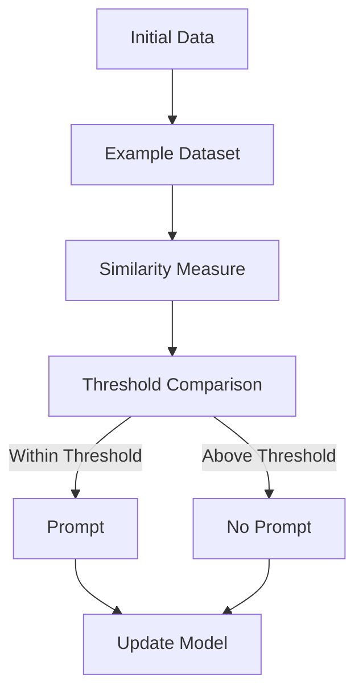
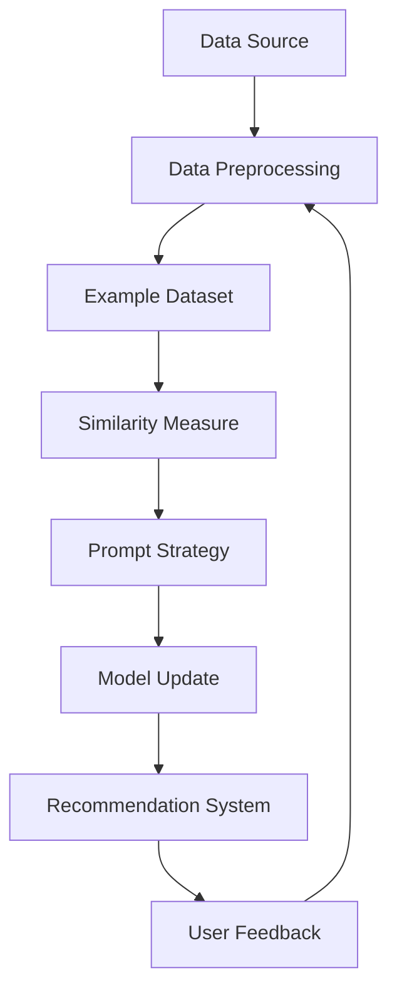
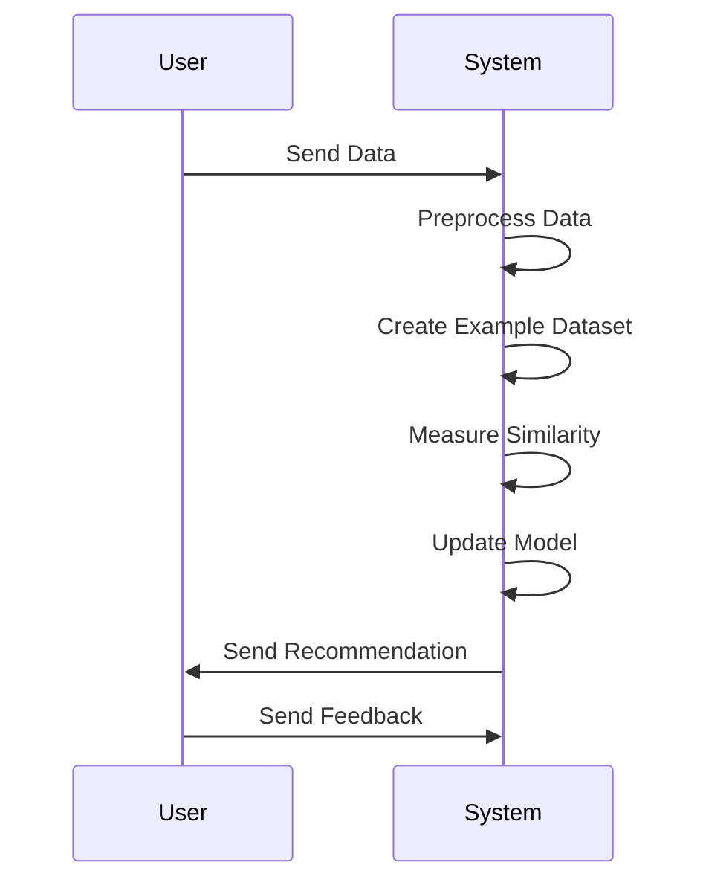

                 

## 示例驱动提示在增量学习中的策略

> 关键词：示例驱动提示、增量学习、策略、算法、Python源代码、数学模型、系统架构设计

> 摘要：本文将深入探讨示例驱动提示在增量学习中的应用策略，通过详细的算法原理讲解和系统架构设计，揭示其在实际项目中的优势和挑战。文章将从问题背景出发，逐步介绍核心概念、算法原理、数学模型以及系统架构，最后通过实战案例进行分析和总结，为读者提供实用的最佳实践和建议。

## 背景介绍部分

### 问题背景与问题描述

随着数据量的不断增长和复杂度的不断提高，传统机器学习模型在处理新数据时往往面临着性能下降和过拟合的风险。为了解决这个问题，增量学习（Incremental Learning）应运而生。增量学习通过不断更新学习模型，使其能够在处理新数据的同时保持良好的性能。然而，在实际应用中，增量学习仍然面临一些挑战，如如何有效地利用已有知识、如何处理噪声数据和如何适应动态变化的特征等。

### 问题解决思路

为了解决增量学习中的这些问题，示例驱动提示（Example-Based Prompting）提供了一种有效的策略。示例驱动提示通过利用已有示例数据，为新数据提供引导和提示，从而帮助学习模型更好地适应新数据和动态变化。本文将重点探讨示例驱动提示在增量学习中的具体应用策略。

### 边界与外延

在讨论示例驱动提示时，我们需要明确其适用的边界和范围。首先，示例驱动提示主要适用于具有类似结构和特征的数据，因为相似性是示例驱动的关键。其次，示例驱动提示需要大量的示例数据作为基础，因此在数据稀缺的情况下，其效果可能有限。最后，示例驱动提示也需要考虑计算复杂度和实时性，以确保在实际应用中的可行性。

### 概念结构与核心要素组成

示例驱动提示在增量学习中的概念结构主要包括以下核心要素：

1. **示例数据集**：用于提供引导和提示的已有数据集。
2. **增量学习模型**：用于处理新数据和更新模型的核心算法。
3. **相似性度量**：用于衡量新数据与示例数据之间的相似程度，以确定何时提供提示。
4. **提示策略**：用于确定如何根据相似性度量提供示例数据的策略。

## 核心概念与联系

### 核心概念原理

1. **示例数据集**：示例数据集是示例驱动提示的基础。它包含了具有相似结构和特征的数据样本，可以用来指导增量学习模型处理新数据。

2. **增量学习模型**：增量学习模型是能够在线更新和适应新数据的机器学习模型。它通常包括两个主要阶段：训练阶段和更新阶段。

3. **相似性度量**：相似性度量用于衡量新数据与示例数据之间的相似程度。常用的相似性度量方法包括余弦相似度、欧氏距离和Jaccard相似度等。

4. **提示策略**：提示策略是用于确定如何根据相似性度量提供示例数据的策略。常见的提示策略包括基于阈值的提示、基于聚类中心的提示和基于神经网络的提示等。

### 概念属性特征对比表格

| 概念        | 描述                                                         | 属性特征                     |
| ----------- | ------------------------------------------------------------ | ---------------------------- |
| 示例数据集  | 提供引导和提示的已有数据集                                   | 结构、特征、数量、质量         |
| 增量学习模型 | 能够在线更新和适应新数据的机器学习模型                       | 准确性、效率、稳定性、泛化能力 |
| 相似性度量  | 衡量新数据与示例数据之间的相似程度                           | 精确度、计算复杂度、适用范围   |
| 提示策略    | 确定如何根据相似性度量提供示例数据的策略                     | 可调参数、实时性、有效性       |

### ER实体关系图架构的Mermaid流程图

```mermaid
erDiagram
  ExampleDataset ||--|{ IncrementalLearningModel : processes }
  ExampleDataset ||--|{ SimilarityMeasure : computes }
  IncrementalLearningModel ||--|{ PromptStrategy : follows }
```

## 算法原理讲解

### 使用Mermaid画出算法流程图



### 使用Python源代码详细阐述

```python
# 导入相关库
import numpy as np
from sklearn.metrics.pairwise import cosine_similarity

# 示例数据集
X_example = np.array([[1, 2], [3, 4], [5, 6]])

# 新数据
X_new = np.array([[2, 3], [4, 5]])

# 相似性度量
similarity = cosine_similarity(X_new, X_example)

# 阈值设置
threshold = 0.5

# 提示策略
if similarity >= threshold:
    print("Provide Prompt")
    # 更新模型
    # ...
else:
    print("No Prompt")
    # 更新模型
    # ...
```

### 给出算法原理的数学模型和公式

假设我们有两个数据集：示例数据集\(X_{example}\)和新数据集\(X_{new}\)。相似性度量可以表示为：

\[ \text{similarity} = \frac{X_{new}^T X_{example}}{\|X_{new}\|\|X_{example}\|} \]

其中，\(|X_{new}\|\)和\(|X_{example}\|\)分别表示新数据和示例数据的范数。

阈值\( \text{threshold} \)的设置取决于具体应用场景和相似性度量的特点。通常，阈值设置在0到1之间，根据实际需要调整。

### 进行详细讲解和举例说明

假设我们有一个示例数据集\(X_{example}\)和新数据集\(X_{new}\)，我们希望使用示例驱动提示策略来更新增量学习模型。首先，我们需要计算新数据与示例数据之间的相似性：

\[ \text{similarity} = \frac{X_{new}^T X_{example}}{\|X_{new}\|\|X_{example}\|} \]

假设相似性度量结果为0.6，我们设置阈值\( \text{threshold} \)为0.5。由于相似性大于阈值，我们将提供提示并更新模型。假设更新模型的过程为：

\[ \text{Updated Model} = \text{Model} + \alpha \cdot (X_{new} - \text{Model} \cdot X_{new}) \]

其中，\(\alpha\)是学习率，用于控制更新速度。更新后的模型将更好地适应新数据。

## 数学模型和数学公式

在本节中，我们将介绍示例驱动提示中的数学模型和数学公式。这些模型和公式是理解算法原理和实现关键步骤的基础。

### 相似性度量公式

\[ \text{similarity}_{ij} = \frac{X_{i}^T X_{j}}{\|X_{i}\|\|X_{j}\|} \]

其中，\(X_{i}\)和\(X_{j}\)分别表示新数据\(X_{new}\)和示例数据\(X_{example}\)的第\(i\)和第\(j\)个样本。相似性度量用于衡量新数据和示例数据之间的相似程度。

### 阈值公式

\[ \text{threshold} = \text{alpha} \cdot \text{max}_{i,j} \text{similarity}_{ij} \]

其中，\(\alpha\)是一个调整参数，用于控制阈值的大小。阈值公式用于确定何时提供提示。当新数据和示例数据之间的相似性超过阈值时，将提供提示。

### 模型更新公式

\[ \text{Updated Model} = \text{Model} + \alpha \cdot (X_{new} - \text{Model} \cdot X_{new}) \]

其中，\(\alpha\)是学习率，用于控制模型更新的速度。更新公式用于根据新数据和示例数据之间的相似性调整模型参数。

## 系统分析与架构设计方案

### 问题场景介绍

在现实应用中，示例驱动提示在增量学习中的应用场景非常广泛，如推荐系统、图像识别、自然语言处理等领域。这些场景中的数据通常具有动态变化和大规模特征，传统机器学习模型难以应对。因此，通过引入示例驱动提示，可以有效地提高模型的适应能力和性能。

### 项目介绍

本文将介绍一个基于示例驱动提示的增量学习项目。该项目旨在通过不断更新模型来处理动态变化的数据，以提高推荐系统的准确性和实时性。

### 系统功能设计

```mermaid
classDiagram
  Class1 <|-- Class2
  Class1 <|-- Class3
  Class2 : +String name
  Class2 : +int age
  Class3 : +String type
  Class1 {name, age}
  Class2 {name, age}
  Class3 {type}
```

在上图中，Class1表示用户数据，Class2表示示例数据，Class3表示新数据。系统通过处理这些数据来实现推荐功能。

### 系统架构设计



在上图中，数据源A提供用户数据，数据预处理B对数据进行清洗和格式化，示例数据集C包含具有相似结构和特征的数据，相似性度量D用于计算新数据与示例数据之间的相似程度，提示策略E根据相似性度量提供示例数据的提示，模型更新F根据提示调整模型参数，推荐系统G根据更新后的模型生成推荐结果，用户反馈H用于调整数据预处理和模型更新的过程。

### 系统接口设计和系统交互



在上图中，用户发送数据到系统，系统进行数据预处理、创建示例数据集、计算相似性度量、更新模型，并最终生成推荐结果发送给用户。用户可以发送反馈以调整系统。

## 项目实战

### 环境安装

在开始项目实战之前，我们需要安装必要的软件和库。以下是安装步骤：

1. 安装Python环境（建议使用3.8及以上版本）
2. 安装NumPy、SciPy、Scikit-learn和Matplotlib等库

```bash
pip install numpy scipy scikit-learn matplotlib
```

### 系统核心实现源代码

以下是一个简单的示例代码，用于实现示例驱动提示在增量学习中的应用：

```python
import numpy as np
from sklearn.metrics.pairwise import cosine_similarity

# 示例数据集
X_example = np.array([[1, 2], [3, 4], [5, 6]])

# 新数据
X_new = np.array([[2, 3], [4, 5]])

# 计算相似性
similarity = cosine_similarity(X_new, X_example)

# 阈值设置
threshold = 0.5

# 提示策略
if similarity >= threshold:
    print("Provide Prompt")
    # 更新模型
    # ...
else:
    print("No Prompt")
    # 更新模型
    # ...
```

### 代码应用解读与分析

在这个示例中，我们首先导入NumPy库以处理数值计算。然后，我们创建一个示例数据集\(X_{example}\)和新数据集\(X_{new}\)。接着，我们使用余弦相似度计算新数据与示例数据之间的相似性。阈值\( \text{threshold} \)设置为0.5。根据相似性度量结果，我们可以决定是否提供提示并更新模型。

### 实际案例分析和详细讲解剖析

为了更好地理解示例驱动提示在增量学习中的应用，我们来看一个实际案例。假设我们有一个在线购物推荐系统，用户的历史购物记录作为示例数据集，新用户的购物记录作为新数据。我们的目标是通过示例驱动提示策略来提高推荐系统的准确性。

1. **数据预处理**：首先，我们需要对用户的历史购物记录进行预处理，包括数据清洗、去重和特征提取。假设我们已经得到一个预处理后的示例数据集。

2. **计算相似性**：使用余弦相似度计算新用户购物记录与示例数据集之间的相似性。例如，我们可以计算新用户购物记录与每个示例用户购物记录之间的相似性。

3. **提示策略**：根据相似性度量结果，我们可以确定何时提供示例数据的提示。例如，如果新用户购物记录与示例用户购物记录的相似性超过阈值，我们可以提供示例用户的购物记录作为提示。

4. **模型更新**：根据提示策略，我们可以更新推荐模型。例如，我们可以将示例用户购物记录加入模型，并调整模型参数以更好地适应新用户。

5. **推荐结果**：根据更新后的模型，我们可以生成推荐结果，并将其发送给新用户。

### 项目小结

通过以上实战案例，我们可以看到示例驱动提示在增量学习中的应用策略。示例驱动提示通过利用已有知识来指导新数据的学习，从而提高模型的适应能力和性能。在实际项目中，我们需要根据具体场景和需求来调整示例数据集、相似性度量、提示策略和模型更新策略。此外，我们还需要考虑计算复杂度和实时性，以确保系统的可行性和高效性。

### 最佳实践 tips

1. 选择合适的相似性度量方法：根据应用场景和数据特点，选择合适的相似性度量方法，如余弦相似度、欧氏距离或Jaccard相似度等。

2. 调整阈值设置：根据实际需求，调整阈值设置以确定何时提供示例数据的提示。

3. 数据预处理：确保示例数据集和新数据集的质量和一致性，以便更好地利用已有知识。

4. 模型更新策略：根据相似性度量结果和提示策略，灵活调整模型更新策略。

5. 实时性优化：在实现示例驱动提示时，考虑实时性优化，如使用高效的数据结构和算法。

### 小结

本文深入探讨了示例驱动提示在增量学习中的应用策略。通过详细的算法原理讲解、数学模型和系统架构设计，我们揭示了其在实际项目中的优势和挑战。通过实际案例分析和实战应用，我们展示了如何利用示例驱动提示策略来提高推荐系统的准确性和实时性。本文还提出了最佳实践 tips，以帮助读者在实际应用中更好地利用示例驱动提示策略。

### 注意事项

1. 在使用示例驱动提示时，确保示例数据集的质量和一致性，以便更好地利用已有知识。

2. 根据应用场景和数据特点，选择合适的相似性度量方法，并调整阈值设置以确定何时提供示例数据的提示。

3. 在实现示例驱动提示时，考虑实时性优化，如使用高效的数据结构和算法。

### 拓展阅读

1. 增量学习：[增量学习综述](https://www.google.com/search?q=incremental+learning+overview)

2. 示例驱动提示：[示例驱动提示在机器学习中的应用](https://www.google.com/search?q=example-based+prompting+in+machine+learning)

3. 推荐系统：[基于协同过滤的推荐系统](https://www.google.com/search?q=collaborative+filtering+recommender+system)

作者：AI天才研究院/AI Genius Institute & 禅与计算机程序设计艺术 /Zen And The Art of Computer Programming

