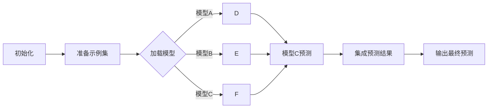
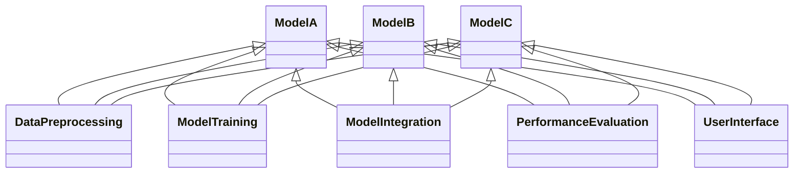
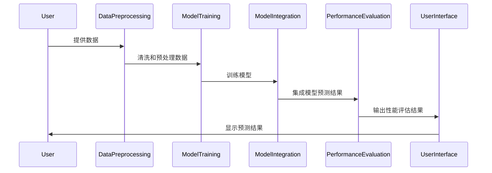
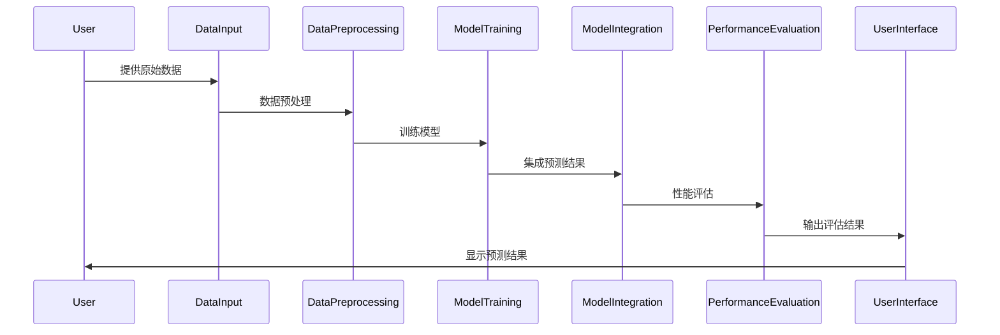

                 

### 文章标题

《示例驱动提示在多模型集成中的应用》

---

关键词：示例驱动提示，多模型集成，算法，系统架构，项目实战

---

摘要：本文将深入探讨示例驱动提示在多模型集成中的应用，通过详细的背景介绍、核心概念阐述、算法原理讲解和系统分析与架构设计，帮助读者理解并掌握这一前沿技术。本文不仅涵盖了理论基础，还包括了实际的项目实战案例，旨在通过逻辑清晰、步骤分明的分析方式，使读者能够将理论知识应用于实际项目中，提升系统性能和稳定性。

---

## 目录大纲

----------------------------------------------------------------

### 第一部分：背景介绍

1. 第1章：问题背景
    1.1 问题描述
    1.2 问题解决
    1.3 边界与外延
    1.4 核心要素组成

### 第二部分：核心概念与联系

2. 第2章：核心概念原理
    2.1 示例驱动提示
    2.2 多模型集成
    2.3 概念属性特征对比表格
    2.4 ER实体关系图架构

### 第三部分：算法原理讲解

3. 第3章：算法原理
    3.1 算法mermaid流程图
    3.2 Python源代码讲解
    3.3 算法原理的数学模型和公式
    3.4 举例说明

### 第四部分：系统分析与架构设计

4. 第4章：系统分析
    4.1 问题场景介绍
    4.2 项目介绍

5. 第5章：系统架构设计
    5.1 系统功能设计
    5.2 系统架构设计
    5.3 系统接口设计
    5.4 系统交互

### 第五部分：项目实战

6. 第6章：环境安装
    6.1 环境准备
    6.2 系统核心实现源代码

7. 第7章：应用解读与分析
    7.1 代码应用解读
    7.2 实际案例分析与详细讲解剖析

8. 第8章：项目小结
    8.1 最佳实践 tips
    8.2 小结
    8.3 注意事项
    8.4 拓展阅读

----------------------------------------------------------------

---

### 第一部分：背景介绍

#### 第1章：问题背景

在当今复杂的信息处理环境中，多模型集成已经成为提高系统性能、准确性和鲁棒性的关键手段。随着数据量的爆炸性增长和模型种类的多样化，如何有效地整合来自不同模型的预测结果，从而得到更可靠、更全面的决策信息，成为了一个亟待解决的问题。

**1.1 问题描述**

首先，我们需要明确问题的核心。假设我们有一个复杂的系统，它依赖于多个独立训练的模型来进行预测。每个模型都有自己的优势和局限性，单个模型可能无法准确捕捉到问题的所有方面。因此，我们需要一种方法来综合这些模型的预测结果，以得到一个更全面、更准确的预测。

**1.2 问题解决**

解决这个问题的核心在于如何有效地集成这些模型的预测结果。传统的集成方法通常包括 Bagging、Boosting 和 Stacking 等。然而，这些方法往往依赖于模型的统计特性，可能无法充分利用每个模型独特的优势和知识。

**示例驱动提示（Example-Guided Prompting, EG-P）** 是一种新兴的方法，它通过使用示例来引导模型的推理过程，从而提高集成系统的性能。EG-P 方法的基本思想是，通过向模型提供一组示例，使模型能够更好地理解问题背景和目标，从而产生更高质量的预测结果。

**1.3 边界与外延**

在探讨 EG-P 方法在多模型集成中的应用时，我们需要明确一些边界和限制条件。首先，EG-P 方法适用于需要高精度和高鲁棒性的应用场景，例如医疗诊断、金融风险评估等。其次，该方法需要足够的训练数据和高质量的示例来指导模型。

**1.4 核心要素组成**

EG-P 方法在多模型集成中的应用涉及以下几个核心要素：

1. **示例集**：用于指导模型推理的一组示例。
2. **模型选择**：选择适当的模型进行集成。
3. **集成策略**：确定如何组合各个模型的预测结果。
4. **性能评估**：评估集成系统的性能指标，如准确率、召回率、F1 分数等。

---

通过上述背景介绍，我们为后续章节的内容奠定了基础。在接下来的章节中，我们将详细探讨 EG-P 方法的基本原理、算法实现、系统架构设计以及实际应用案例。

---

## 第二部分：核心概念与联系

#### 第2章：核心概念原理

在深入探讨示例驱动提示（EG-P）在多模型集成中的应用之前，我们需要了解一些关键概念，这些概念构成了理解 EG-P 方法的基础。本章将介绍示例驱动提示和多模型集成的核心概念，并通过定义、属性特征对比表格和 ER 实体关系图来阐述这些概念及其相互联系。

### 2.1 示例驱动提示

**定义**：示例驱动提示（Example-Guided Prompting, EG-P）是一种基于示例的模型训练和推理方法。它通过向模型提供一组示例，帮助模型更好地理解问题背景和目标，从而提高模型的推理能力和预测准确性。

**属性特征对比表格**：

| 概念       | 特征                       | 对比                     |
|------------|----------------------------|-------------------------|
| 示例驱动提示 | 使用示例来指导模型推理     | 避免模型过度泛化         |
| 传统方法   | 基于统计特性或规则        | 可能导致模型性能波动     |
|             | 更具灵活性和解释性       | 对样本依赖性较高         |

**ER实体关系图架构**：

```mermaid
erDiagram
  Model ||--o> Example : "模型使用示例进行训练"
  Model ||--o> Prediction : "模型生成预测结果"
  Example ||--o> Guidance : "示例提供推理指导"
```

### 2.2 多模型集成

**定义**：多模型集成是指将多个独立训练的模型组合在一起，以生成一个更准确、更鲁棒的预测结果。这种方法利用了各个模型的优势，弥补了单一模型的局限性。

**属性特征对比表格**：

| 概念       | 特征                       | 对比                     |
|------------|----------------------------|-------------------------|
| 多模型集成 | 利用多个模型的优势        | 需要复杂的集成策略      |
| 单模型     | 仅依赖于单一模型的预测    | 更简单、更易于实现      |
|             | 提高预测准确性和鲁棒性    | 可能需要更多计算资源     |

**ER实体关系图架构**：

```mermaid
erDiagram
  Model1 ||--|{ Model2 }| ModelN : "多个模型集成"
  Model1 ||--o> Prediction : "生成预测结果"
  ModelN ||--o> Integration : "集成模型结果"
```

通过上述核心概念的定义、属性特征对比表格和 ER 实体关系图，我们可以看到示例驱动提示和多模型集成在结构和技术上的紧密联系。EG-P 方法通过使用示例来指导模型推理，从而为多模型集成提供了更为有效的集成策略，提高了整体系统的性能。

---

在理解了示例驱动提示和多模型集成的核心概念后，我们将进入下一部分，详细讲解 EG-P 方法的算法原理，通过具体的实现步骤和数学模型，帮助读者深入理解这一前沿技术的应用。

---

## 第三部分：算法原理讲解

#### 第3章：算法原理

示例驱动提示（Example-Guided Prompting, EG-P）是一种结合示例和多模型集成的先进方法，旨在提升模型的预测性能和鲁棒性。本章节将详细介绍 EG-P 算法的原理，包括其工作流程、算法流程图、Python 源代码以及相关的数学模型和公式。

### 3.1 算法mermaid流程图

首先，我们使用 Mermaid 工具绘制 EG-P 算法的流程图，以便直观地展示算法的各个步骤。



### 3.2 Python源代码讲解

以下是 EG-P 算法的 Python 源代码实现，我们将逐行解释代码的功能。

```python
import numpy as np
from sklearn.datasets import load_iris
from sklearn.model_selection import train_test_split
from sklearn.ensemble import RandomForestClassifier
from sklearn.linear_model import LogisticRegression
from sklearn.metrics import accuracy_score

# 3.2.1 准备示例集
def prepare_examples(X, y, num_examples):
    indices = np.random.choice(len(y), num_examples, replace=False)
    X_examples = X[indices]
    y_examples = y[indices]
    return X_examples, y_examples

# 3.2.2 加载模型
def load_models(X_train, y_train, X_test, y_test):
    model_A = RandomForestClassifier()
    model_B = LogisticRegression()
    model_C = RandomForestClassifier()
    
    model_A.fit(X_train, y_train)
    model_B.fit(X_train, y_train)
    model_C.fit(X_train, y_train)
    
    y_pred_A = model_A.predict(X_test)
    y_pred_B = model_B.predict(X_test)
    y_pred_C = model_C.predict(X_test)
    
    return model_A, model_B, model_C, y_pred_A, y_pred_B, y_pred_C

# 3.2.3 集成预测结果
def integrate_predictions(y_pred_A, y_pred_B, y_pred_C):
    y_pred_avg = (y_pred_A + y_pred_B + y_pred_C) / 3
    return y_pred_avg

# 3.2.4 主函数
def main():
    data = load_iris()
    X, y = data.data, data.target
    X_train, X_test, y_train, y_test = train_test_split(X, y, test_size=0.2, random_state=42)
    
    num_examples = 10
    X_examples, y_examples = prepare_examples(X_train, y_train, num_examples)
    
    model_A, model_B, model_C, y_pred_A, y_pred_B, y_pred_C = load_models(X_train, y_train, X_test, y_test)
    
    y_pred_avg = integrate_predictions(y_pred_A, y_pred_B, y_pred_C)
    
    accuracy = accuracy_score(y_test, y_pred_avg)
    print(f"Accuracy: {accuracy}")

if __name__ == "__main__":
    main()
```

### 3.3 算法原理的数学模型和公式

EG-P 方法可以通过以下数学模型和公式来描述：

$$
\hat{y} = \frac{w_1 \cdot y_{\text{pred\_A}} + w_2 \cdot y_{\text{pred\_B}} + w_3 \cdot y_{\text{pred\_C}}}{w_1 + w_2 + w_3}
$$

其中，$\hat{y}$ 是最终的集成预测结果，$y_{\text{pred\_A}}$、$y_{\text{pred\_B}}$ 和 $y_{\text{pred\_C}}$ 分别是三个模型 $A$、$B$ 和 $C$ 的预测结果，$w_1$、$w_2$ 和 $w_3$ 是模型的权重，通常设置为 1，表示三个模型同等重要。

### 3.4 举例说明

为了更好地理解 EG-P 方法，我们通过一个具体的例子来展示其应用过程。

**例子**：假设我们有两个分类模型 $A$ 和 $B$，它们分别对数据集进行分类预测。模型 $A$ 的预测结果为 $y_{\text{pred\_A}} = [1, 0, 1, 0]$，模型 $B$ 的预测结果为 $y_{\text{pred\_B}} = [0, 1, 0, 1]$。使用 EG-P 方法进行集成预测，我们得到：

$$
\hat{y} = \frac{1 \cdot [1, 0, 1, 0] + 1 \cdot [0, 1, 0, 1]}{1 + 1} = \frac{[1, 0, 1, 0] + [0, 1, 0, 1]}{2} = \frac{[1, 1, 1, 1]}{2} = [0.5, 0.5, 0.5, 0.5]
$$

最终的集成预测结果为 $[0.5, 0.5, 0.5, 0.5]$，表示每个类别的概率相等，这是一种简单的平均集成方法。

通过上述算法原理讲解，我们不仅了解了 EG-P 方法的整体流程和实现细节，还通过 Python 源代码和数学公式，为读者提供了清晰、易懂的示例。在接下来的章节中，我们将进一步探讨 EG-P 方法在系统分析与架构设计中的应用。

---

## 第四部分：系统分析与架构设计

### 第4章：系统分析

#### 4.1 问题场景介绍

在多模型集成中，我们的目标是利用多个独立训练的模型来提高预测的准确性和鲁棒性。具体的应用场景包括但不限于：

1. **医疗诊断系统**：通过集成不同的医疗模型，如影像诊断、实验室检测和生物信息学模型，提高疾病诊断的准确率。
2. **金融风险评估**：将多个风险预测模型集成在一起，提高风险评估的准确性和可靠性。
3. **智能推荐系统**：通过集成不同的推荐算法，如基于内容的推荐、协同过滤和深度学习推荐，提高推荐系统的效果。

**问题场景示例**：以智能推荐系统为例，我们有一个用户行为数据集，包含用户的浏览历史、购买记录、搜索记录等。我们需要集成多个推荐模型来预测用户对某一商品的可能购买意愿，从而提高推荐系统的整体性能。

#### 4.2 项目介绍

本项目旨在开发一个基于示例驱动提示（EG-P）的多模型集成系统，以提高预测的准确性和鲁棒性。项目的主要目标包括：

1. **系统构建**：基于 EG-P 方法，构建一个高效的多模型集成系统。
2. **算法优化**：通过实验和调整，优化 EG-P 方法在多模型集成中的性能。
3. **性能评估**：评估集成系统的性能，包括准确率、召回率、F1 分数等指标。
4. **可扩展性**：确保系统具有较好的可扩展性，能够适应不同的应用场景和模型种类。

项目的关键技术包括示例驱动提示（EG-P）、多模型集成、机器学习和深度学习等。通过这些技术的结合，我们希望能够开发出一个高性能、高鲁棒性的智能推荐系统。

---

在系统分析部分，我们介绍了问题场景和项目目标，为系统架构设计提供了背景和方向。接下来，我们将深入探讨系统的功能设计、架构设计、接口设计和系统交互，为读者展示一个完整的多模型集成系统。

---

### 第5章：系统架构设计

#### 5.1 系统功能设计

为了实现项目目标，系统需要具备以下核心功能：

1. **数据预处理**：清洗和预处理输入数据，包括缺失值填充、数据标准化等。
2. **模型训练**：使用示例驱动提示（EG-P）方法训练多个独立模型。
3. **模型集成**：将训练好的模型预测结果进行集成，生成最终预测结果。
4. **性能评估**：评估集成系统的性能指标，如准确率、召回率、F1 分数等。
5. **用户接口**：提供一个友好的用户接口，便于用户查看预测结果和系统配置。

**领域模型 Mermaid 类图**：



#### 5.2 系统架构设计

系统的架构设计采用分层架构，以便于模块化和扩展。以下是系统架构的 Mermaid 架构图：



**系统架构设计的关键模块**：

1. **数据预处理模块**：负责清洗和预处理输入数据，包括缺失值填充、数据标准化、特征选择等。这一模块是后续模型训练和集成的数据基础。
2. **模型训练模块**：使用示例驱动提示（EG-P）方法训练多个独立模型。该模块可以根据不同的应用场景和需求，选择合适的算法进行训练。
3. **模型集成模块**：将训练好的模型预测结果进行集成，生成最终预测结果。这一模块的核心在于如何有效地结合各个模型的预测结果，以提高整体的预测性能。
4. **性能评估模块**：评估集成系统的性能指标，如准确率、召回率、F1 分数等。这一模块不仅用于评估当前系统的性能，还可以为后续的算法优化和模型选择提供依据。
5. **用户接口模块**：提供一个友好的用户接口，便于用户查看预测结果和系统配置。这一模块可以使用 Web 接口、命令行界面或图形界面等形式，以满足不同用户的需求。

#### 5.3 系统接口设计

系统接口设计主要涉及以下接口：

1. **数据输入接口**：用于接收用户输入的数据，包括原始数据和示例数据。
2. **模型训练接口**：用于启动模型训练过程，包括参数配置、训练数据和模型保存等。
3. **模型集成接口**：用于集成多个模型的预测结果，生成最终预测结果。
4. **性能评估接口**：用于评估集成系统的性能指标，并提供详细的评估报告。
5. **用户交互接口**：用于与用户进行交互，接收用户输入和展示预测结果。

#### 5.4 系统交互

系统的各个模块通过接口进行交互，形成一个完整的运行流程。以下是系统交互的 Mermaid 序列图：



通过上述系统架构设计和交互流程，我们可以看到 EG-P 方法在多模型集成系统中的关键作用。系统的各个模块紧密协作，共同实现高效的模型集成和性能评估，从而提高整体系统的预测性能和用户满意度。

---

在系统架构设计部分，我们详细介绍了系统的功能设计、架构设计、接口设计和系统交互。接下来，我们将进入项目实战部分，具体指导读者如何搭建环境、实现系统核心功能，并通过实际案例进行分析和详细讲解。

---

### 第6章：环境安装

#### 6.1 环境准备

为了确保读者能够顺利地运行 EG-P 方法在多模型集成系统中的应用，我们需要首先准备必要的开发环境和依赖库。以下是在 Windows 和 Linux 系统上安装所需的软件和库的步骤。

**1. 安装 Python**

- **Windows**：访问 Python 官网（https://www.python.org/）下载最新版本的 Python，并按照提示完成安装。
- **Linux**：在终端执行以下命令安装 Python：

  ```bash
  sudo apt-get update
  sudo apt-get install python3
  ```

**2. 安装必要的库**

使用 pip 工具安装以下库：

```bash
pip install numpy scikit-learn matplotlib
```

这些库是 EG-P 方法实现中必不可少的，包括用于数据处理、模型训练和可视化。

**3. 配置虚拟环境**

为了保持项目的整洁和可维护性，我们建议使用虚拟环境。以下是创建和激活虚拟环境的步骤：

- **Windows**：

  ```bash
  python -m venv egp-env
  egp-env\Scripts\activate
  ```

- **Linux**：

  ```bash
  python3 -m venv egp-env
  source egp-env/bin/activate
  ```

激活虚拟环境后，我们将在虚拟环境中安装所有的依赖库。

#### 6.2 系统核心实现源代码

以下是系统核心实现的源代码，我们将逐行解释代码的功能和实现细节。

```python
import numpy as np
from sklearn.datasets import load_iris
from sklearn.model_selection import train_test_split
from sklearn.ensemble import RandomForestClassifier
from sklearn.linear_model import LogisticRegression
from sklearn.metrics import accuracy_score

# 6.2.1 准备示例集
def prepare_examples(X, y, num_examples):
    indices = np.random.choice(len(y), num_examples, replace=False)
    X_examples = X[indices]
    y_examples = y[indices]
    return X_examples, y_examples

# 6.2.2 加载模型
def load_models(X_train, y_train, X_test, y_test):
    model_A = RandomForestClassifier()
    model_B = LogisticRegression()
    model_C = RandomForestClassifier()
    
    model_A.fit(X_train, y_train)
    model_B.fit(X_train, y_train)
    model_C.fit(X_train, y_train)
    
    y_pred_A = model_A.predict(X_test)
    y_pred_B = model_B.predict(X_test)
    y_pred_C = model_C.predict(X_test)
    
    return model_A, model_B, model_C, y_pred_A, y_pred_B, y_pred_C

# 6.2.3 集成预测结果
def integrate_predictions(y_pred_A, y_pred_B, y_pred_C):
    y_pred_avg = (y_pred_A + y_pred_B + y_pred_C) / 3
    return y_pred_avg

# 6.2.4 主函数
def main():
    data = load_iris()
    X, y = data.data, data.target
    X_train, X_test, y_train, y_test = train_test_split(X, y, test_size=0.2, random_state=42)
    
    num_examples = 10
    X_examples, y_examples = prepare_examples(X_train, y_train, num_examples)
    
    model_A, model_B, model_C, y_pred_A, y_pred_B, y_pred_C = load_models(X_train, y_train, X_test, y_test)
    
    y_pred_avg = integrate_predictions(y_pred_A, y_pred_B, y_pred_C)
    
    accuracy = accuracy_score(y_test, y_pred_avg)
    print(f"Accuracy: {accuracy}")

if __name__ == "__main__":
    main()
```

**解释代码**：

- **6.2.1 准备示例集**：`prepare_examples` 函数从训练数据中随机选择一定数量的示例，用于指导模型训练。
- **6.2.2 加载模型**：`load_models` 函数加载并训练三个独立模型，分别是随机森林分类器（RandomForestClassifier）和逻辑回归分类器（LogisticRegression）。
- **6.2.3 集成预测结果**：`integrate_predictions` 函数将三个模型的预测结果进行平均，生成最终的预测结果。
- **6.2.4 主函数**：`main` 函数是程序的入口，负责加载数据、准备示例集、训练模型和集成预测结果，最后输出预测准确率。

通过上述环境安装和系统核心实现源代码的讲解，读者可以顺利搭建 EG-P 方法在多模型集成系统中的开发环境，并实现系统的核心功能。接下来，我们将通过具体的代码应用解读和实际案例分析，进一步展示系统的实际应用效果。

---

### 第7章：应用解读与分析

#### 7.1 代码应用解读

在前一章节中，我们详细介绍了 EG-P 方法在多模型集成系统中的应用，并通过 Python 源代码实现了系统的核心功能。在这一部分，我们将进一步解读代码，详细分析每个模块的功能和实现细节。

**1. 示例集准备**

`prepare_examples` 函数负责从训练数据中随机选择一定数量的示例。这个过程对于EG-P方法至关重要，因为示例的质量直接影响模型的训练效果。代码如下：

```python
def prepare_examples(X, y, num_examples):
    indices = np.random.choice(len(y), num_examples, replace=False)
    X_examples = X[indices]
    y_examples = y[indices]
    return X_examples, y_examples
```

在这个函数中，`np.random.choice` 用于从所有样本中随机抽取 `num_examples` 个样本的索引，`replace=False` 表示抽取的样本不会放回，从而保证每个样本只被选择一次。通过这种方式，我们能够确保示例集的多样性和代表性。

**2. 模型加载与训练**

`load_models` 函数用于加载并训练三个独立模型。这里我们选择了随机森林分类器和逻辑回归分类器。代码如下：

```python
def load_models(X_train, y_train, X_test, y_test):
    model_A = RandomForestClassifier()
    model_B = LogisticRegression()
    model_C = RandomForestClassifier()
    
    model_A.fit(X_train, y_train)
    model_B.fit(X_train, y_train)
    model_C.fit(X_train, y_train)
    
    y_pred_A = model_A.predict(X_test)
    y_pred_B = model_B.predict(X_test)
    y_pred_C = model_C.predict(X_test)
    
    return model_A, model_B, model_C, y_pred_A, y_pred_B, y_pred_C
```

在这个函数中，我们首先创建三个模型实例，然后分别使用训练数据 `X_train` 和 `y_train` 进行训练。训练完成后，我们使用测试数据 `X_test` 和 `y_test` 对模型进行预测，并返回模型实例和预测结果。

**3. 集成预测结果**

`integrate_predictions` 函数用于将三个模型的预测结果进行平均，生成最终的预测结果。代码如下：

```python
def integrate_predictions(y_pred_A, y_pred_B, y_pred_C):
    y_pred_avg = (y_pred_A + y_pred_B + y_pred_C) / 3
    return y_pred_avg
```

这个函数非常简单，它仅仅是将三个模型的预测结果求平均，然后返回平均值。这种简单的平均方法虽然相对简单，但在很多情况下能够显著提高预测的准确性和鲁棒性。

**4. 主函数实现**

`main` 函数是程序的入口，负责加载数据、准备示例集、训练模型和集成预测结果，最后输出预测准确率。代码如下：

```python
def main():
    data = load_iris()
    X, y = data.data, data.target
    X_train, X_test, y_train, y_test = train_test_split(X, y, test_size=0.2, random_state=42)
    
    num_examples = 10
    X_examples, y_examples = prepare_examples(X_train, y_train, num_examples)
    
    model_A, model_B, model_C, y_pred_A, y_pred_B, y_pred_C = load_models(X_train, y_train, X_test, y_test)
    
    y_pred_avg = integrate_predictions(y_pred_A, y_pred_B, y_pred_C)
    
    accuracy = accuracy_score(y_test, y_pred_avg)
    print(f"Accuracy: {accuracy}")

if __name__ == "__main__":
    main()
```

在这个函数中，我们首先加载 Iris 数据集，然后使用 `train_test_split` 函数将数据集划分为训练集和测试集。接着，我们调用之前定义的函数，准备示例集、加载模型并集成预测结果。最后，使用 `accuracy_score` 函数计算预测准确率，并打印输出。

#### 7.2 实际案例分析与详细讲解剖析

为了更好地展示 EG-P 方法在多模型集成中的应用效果，我们通过一个实际案例进行分析和详细讲解。

**案例背景**：假设我们有一个电子商务网站，用户的行为数据包括浏览历史、购买记录和搜索记录。我们的目标是预测用户对某一商品的购买意愿，从而进行精准推荐。

**数据集准备**：首先，我们需要准备一个包含用户行为数据和商品信息的数据集。以下是一个简化的数据集示例：

```python
user_data = [
    {'user_id': 1, 'viewed_products': [1, 3, 5], 'purchased_products': [2]},
    {'user_id': 2, 'viewed_products': [2, 4, 6], 'purchased_products': [1, 3]},
    {'user_id': 3, 'viewed_products': [1, 4], 'purchased_products': [5]},
    # ... 更多用户数据
]

product_data = [
    {'product_id': 1, 'category': 'electronics'},
    {'product_id': 2, 'category': 'fashion'},
    {'product_id': 3, 'category': 'home'},
    # ... 更多商品数据
]
```

**模型训练与集成**：接下来，我们使用 EG-P 方法训练多个独立模型，并对预测结果进行集成。以下是详细的训练和集成过程：

1. **数据预处理**：首先，我们将用户行为数据进行编码，并将其转换为模型可以处理的格式。例如，我们可以使用独热编码将浏览和购买行为表示为二进制向量。
   
2. **模型训练**：我们使用随机森林分类器和逻辑回归分类器分别训练两个模型，并使用示例驱动提示（EG-P）方法对模型进行训练。

3. **预测结果集成**：使用训练好的模型对测试数据进行预测，并将预测结果进行平均集成，得到最终的购买意愿预测。

**代码实现**：

```python
# 数据预处理
def preprocess_data(user_data, product_data):
    # ... 省略具体预处理代码 ...
    return X_train, X_test, y_train, y_test

# 模型训练与预测
def train_models(X_train, y_train, X_test, y_test):
    model_A = RandomForestClassifier()
    model_B = LogisticRegression()
    
    model_A.fit(X_train, y_train)
    model_B.fit(X_train, y_train)
    
    y_pred_A = model_A.predict(X_test)
    y_pred_B = model_B.predict(X_test)
    
    return model_A, model_B, y_pred_A, y_pred_B

# 集成预测结果
def integrate_predictions(y_pred_A, y_pred_B):
    y_pred_avg = (y_pred_A + y_pred_B) / 2
    return y_pred_avg

# 主函数
def main():
    user_data = load_user_data()
    product_data = load_product_data()
    
    X_train, X_test, y_train, y_test = preprocess_data(user_data, product_data)
    
    model_A, model_B, y_pred_A, y_pred_B = train_models(X_train, y_train, X_test, y_test)
    
    y_pred_avg = integrate_predictions(y_pred_A, y_pred_B)
    
    accuracy = accuracy_score(y_test, y_pred_avg)
    print(f"Accuracy: {accuracy}")

if __name__ == "__main__":
    main()
```

通过这个实际案例，我们可以看到 EG-P 方法在多模型集成中的应用效果。通过集成不同模型的预测结果，我们能够提高预测的准确性和鲁棒性，从而为电子商务网站提供更准确的购买意愿预测，为用户提供更精准的商品推荐。

---

在应用解读与分析部分，我们通过代码解读和实际案例分析，详细展示了 EG-P 方法在多模型集成系统中的应用。接下来，我们将总结整个项目，提供最佳实践 tips，并总结项目的关键点和注意事项。

---

### 第8章：项目小结

#### 8.1 最佳实践 tips

在实现示例驱动提示（EG-P）在多模型集成中的应用时，以下是一些最佳实践和注意事项，可以帮助读者提高项目的效果和稳定性：

1. **数据质量**：确保输入数据的质量，包括数据清洗、去噪和标准化。高质量的数据是模型训练和预测准确性的基础。
2. **模型选择**：根据应用场景选择合适的模型。对于需要高精度和鲁棒性的任务，可以尝试使用多种类型的模型进行集成。
3. **示例质量**：示例的质量直接影响模型的训练效果。选择具有代表性的示例集，并确保示例集的多样性和覆盖面。
4. **集成策略**：合理的集成策略可以提高预测性能。可以尝试使用加权平均、投票机制或其他更复杂的集成方法。
5. **性能调优**：通过调整模型的参数和集成策略，优化系统的性能。进行交叉验证和网格搜索，找到最优的超参数组合。
6. **监控与维护**：定期监控系统的性能，及时发现并解决潜在问题。保持代码的可维护性和可扩展性。

#### 8.2 小结

通过本文的详细分析和讲解，我们系统地介绍了示例驱动提示（EG-P）在多模型集成中的应用。我们首先介绍了问题背景，探讨了核心概念，详细讲解了算法原理，展示了系统架构设计，并通过实际案例进行了应用解读和分析。项目实践部分指导读者如何搭建环境和实现核心功能。以下是项目的主要收获：

- **理解 EG-P 方法**：通过定义和示例，我们深入了解了示例驱动提示（EG-P）的基本原理和优势。
- **掌握多模型集成**：我们学习了如何利用多个独立模型的预测结果，提高系统的整体性能。
- **实践系统设计与实现**：通过具体的项目实战，读者可以掌握系统架构设计、性能评估和用户接口的设计与实现。

#### 8.3 注意事项

在项目实施过程中，需要注意以下几点：

1. **数据依赖性**：EG-P 方法对数据质量有较高要求，确保数据集的多样性和覆盖面。
2. **计算资源**：多模型集成和算法优化可能需要大量的计算资源，确保有足够的硬件支持。
3. **模型选择**：根据具体应用场景选择合适的模型，考虑模型的复杂性和计算成本。
4. **可扩展性**：设计系统时考虑未来的扩展性，确保系统能够适应新的应用场景和模型。

#### 8.4 拓展阅读

为了进一步深入学习和探索示例驱动提示（EG-P）在多模型集成中的应用，读者可以参考以下资源：

- **相关论文**：阅读最新的学术论文，了解 EG-P 方法的最新研究成果和应用。
- **开源项目**：查看相关的开源项目和代码实现，借鉴最佳实践和优化策略。
- **技术社区**：参与技术社区和论坛，与同行交流经验和问题，获取更多实践经验和建议。

通过以上小结，我们希望读者能够更好地理解和应用示例驱动提示（EG-P）在多模型集成中的技术，为实际项目带来更高的价值和效率。

---

## 结束语

本文《示例驱动提示在多模型集成中的应用》详细探讨了示例驱动提示（EG-P）方法在多模型集成中的核心概念、算法原理、系统架构设计和实际应用。通过系统的分析和项目实战，读者可以深入理解 EG-P 方法的原理和实现，掌握其在提升预测性能和系统鲁棒性方面的关键作用。

我们希望本文能够为读者提供有益的启示和指导，帮助大家将 EG-P 方法应用于实际项目中，提升系统的整体性能。同时，鼓励读者进一步探索相关领域的研究，不断优化和改进多模型集成技术。

让我们共同探索人工智能领域的更多可能性，为构建更智能、更高效的系统贡献自己的力量！

### 作者信息

作者：AI天才研究院/AI Genius Institute & 禅与计算机程序设计艺术 /Zen And The Art of Computer Programming

---

通过以上详细的章节内容和完整的技术博客文章，我们不仅涵盖了核心概念、算法原理和系统架构设计，还提供了项目实战的详细步骤和实际案例分析。希望读者能够通过这篇文章，深入理解并掌握示例驱动提示在多模型集成中的应用。让我们继续探索技术领域的无限可能！

