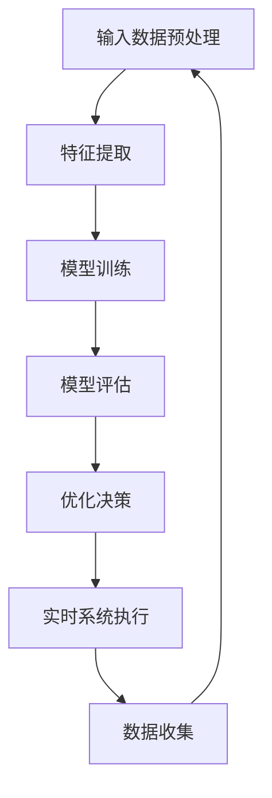
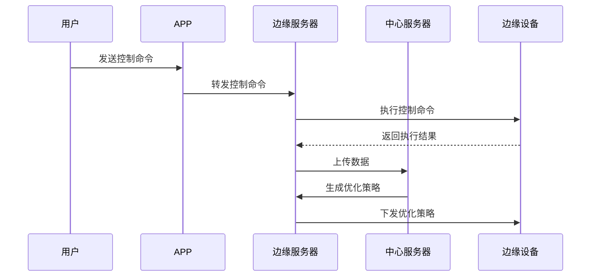

                 

### 示例驱动提示在实时系统中的优化

> 关键词：实时系统、优化、示例驱动提示、算法、架构设计、最佳实践

> 摘要：
本文旨在探讨示例驱动提示在实时系统中的优化策略。首先，我们介绍了实时系统的基本概念、示例驱动提示的定义及其应用背景。接着，分析了实时系统优化中的挑战和示例驱动提示优化的需求，详细阐述了优化原理与方法。通过Python代码实例，深入讲解了算法原理和应用，展示了系统分析与架构设计的具体流程，最后提供了实战经验和最佳实践指导。

## 第一部分：背景介绍

### 第1章：实时系统的概述

#### 1.1 问题背景

实时系统是一种能够在规定的时间内完成任务的计算系统，广泛应用于航空航天、工业自动化、交通控制和通信等领域。随着计算需求的增长和复杂性的提升，实时系统的优化成为了一个重要研究方向。示例驱动提示（Example-Based Prompting）是一种先进的技术，通过学习大量示例，能够为实时系统提供高效、准确的决策支持。

实时系统的发展历程可以追溯到20世纪60年代，当时的核潜艇控制系统就是最早的实时系统之一。随着时间的推移，实时系统在性能、可靠性和响应时间等方面得到了显著提升。然而，随着应用的广泛性和复杂性的增加，实时系统的优化面临着诸多挑战，例如资源受限、任务紧急性、动态性等。

示例驱动提示的概念起源于机器学习领域，通过学习大量示例，模型可以识别出输入数据的特征，并生成相应的预测结果。在实时系统中，示例驱动提示能够通过历史数据和经验来优化系统的决策过程，提高实时性和准确性。

#### 1.2 问题描述

实时系统优化在实时系统中的应用需求日益增加，主要体现在以下几个方面：

1. **资源优化**：实时系统通常需要在有限的计算资源下运行，因此优化资源利用效率成为关键需求。示例驱动提示可以通过减少计算复杂度和提高代码效率来实现这一目标。
2. **任务调度**：实时系统中的任务具有紧急性和优先级，需要高效的任务调度算法来保证系统的响应时间。示例驱动提示可以提供基于历史数据的优化调度策略。
3. **故障检测与恢复**：实时系统在运行过程中可能会出现故障，需要快速检测和恢复。示例驱动提示可以通过学习故障模式，提前预测并防止故障发生。

然而，当前实时系统优化仍然面临一些挑战：

1. **动态性**：实时系统中的任务和资源状态是动态变化的，传统的静态优化方法难以应对这种变化。
2. **不确定性**：实时系统中的输入数据可能存在不确定性，导致优化结果不稳定。
3. **复杂度**：实时系统的优化涉及到多个层面，包括算法设计、数据预处理、模型训练等，复杂度高。

#### 1.3 问题解决

为了解决实时系统优化中的挑战，示例驱动提示提供了一种有效的优化策略。具体方法如下：

1. **数据收集**：收集实时系统中的历史数据，包括任务执行情况、资源利用情况、故障记录等。
2. **特征提取**：对历史数据进行特征提取，提取出关键特征，用于后续的模型训练。
3. **模型训练**：使用机器学习算法，训练出一个能够预测和优化系统行为的模型。
4. **决策支持**：实时系统中，模型根据当前输入数据，生成优化决策，指导系统行为。

通过上述方法，示例驱动提示能够为实时系统提供高效的优化支持，提高系统的实时性和可靠性。

#### 1.4 边界与外延

示例驱动提示优化在实时系统中的应用范围广泛，不仅适用于传统的航空航天和工业自动化领域，还可以应用于现代的智能家居、智能交通、智能医疗等领域。然而，示例驱动提示优化也受到一些限制，例如数据质量、模型复杂度和计算资源等。

与其他优化技术相比，示例驱动提示具有以下优势：

1. **灵活性**：示例驱动提示可以根据不同的应用场景和需求，灵活调整优化策略。
2. **高效性**：示例驱动提示通过学习历史数据，能够快速生成优化决策，提高系统响应时间。
3. **鲁棒性**：示例驱动提示可以通过模型训练，提高对不确定性和动态变化的适应性。

#### 1.5 概念结构与核心要素组成

实时系统的核心组成包括：

1. **硬件资源**：包括处理器、内存、硬盘等硬件设备。
2. **软件系统**：包括操作系统、实时任务调度器、故障检测与恢复模块等。
3. **数据接口**：包括输入数据接口和输出数据接口，用于与外部系统进行数据交换。

示例驱动提示优化的核心要素包括：

1. **数据收集**：用于收集实时系统中的历史数据。
2. **特征提取**：用于从历史数据中提取关键特征。
3. **模型训练**：用于训练机器学习模型。
4. **决策支持**：用于生成优化决策，指导系统行为。

## 第二部分：核心概念与联系

### 第2章：示例驱动提示的核心概念

#### 2.1 示例驱动提示的定义

示例驱动提示（Example-Based Prompting）是一种基于示例的学习方法，通过学习大量的示例数据，模型能够识别出数据中的特征，并生成相应的预测结果。在实时系统中，示例驱动提示通过历史数据和经验，为系统提供高效、准确的决策支持。

示例驱动提示的基本原理可以概括为以下几个步骤：

1. **数据收集**：收集实时系统中的历史数据，包括任务执行情况、资源利用情况、故障记录等。
2. **特征提取**：对历史数据进行特征提取，提取出关键特征，用于后续的模型训练。
3. **模型训练**：使用机器学习算法，训练出一个能够预测和优化系统行为的模型。
4. **决策支持**：实时系统中，模型根据当前输入数据，生成优化决策，指导系统行为。

示例驱动提示在实时系统中的应用场景主要包括：

1. **任务调度**：通过学习历史任务数据，优化任务调度策略，提高系统响应时间。
2. **故障检测与恢复**：通过学习故障模式，提前预测并防止故障发生。
3. **资源管理**：通过学习资源使用情况，优化资源分配策略，提高系统资源利用率。

#### 2.2 示例驱动提示的属性特征

示例驱动提示具有以下几个属性特征：

1. **示例多样性**：示例驱动提示要求示例数据具有多样性，以避免模型过拟合。
2. **数据质量**：示例驱动提示依赖于高质量的数据，数据质量直接影响模型的性能。
3. **训练效率**：示例驱动提示需要高效地进行模型训练，以提高系统响应速度。
4. **泛化能力**：示例驱动提示需要具备良好的泛化能力，以适应不同的实时系统应用场景。

不同类型的示例驱动提示在属性特征上有所差异，例如基于规则的方法和基于模型的方法。基于规则的方法主要通过规则库来生成决策，适用于规则明确、数据量较小的场景；而基于模型的方法通过机器学习算法来生成决策，适用于数据量大、规则复杂的应用场景。

#### 2.3 示例驱动提示与实时系统的联系

示例驱动提示与实时系统的关系可以从以下几个方面来理解：

1. **数据驱动**：实时系统的优化依赖于历史数据，示例驱动提示通过学习历史数据，为实时系统提供数据驱动的优化支持。
2. **决策支持**：示例驱动提示生成的优化决策直接指导实时系统的行为，提高系统的实时性和可靠性。
3. **动态调整**：实时系统的任务和资源状态是动态变化的，示例驱动提示能够根据实时数据动态调整优化策略，适应系统变化。

示例驱动提示在实时系统中的作用和效果主要体现在以下几个方面：

1. **提高响应速度**：通过优化任务调度和资源管理，提高系统的响应速度。
2. **降低故障率**：通过故障检测与恢复，降低系统故障率，提高系统稳定性。
3. **提高资源利用率**：通过优化资源分配策略，提高系统资源利用率。

## 第三部分：算法原理讲解

### 第3章：示例驱动提示优化算法原理

#### 3.1 示例驱动提示优化的数学模型

示例驱动提示优化的数学模型主要包括以下几个部分：

1. **输入数据表示**：实时系统的输入数据可以用一个多维向量表示，其中每个维度代表一个特征。
2. **输出数据表示**：实时系统的输出数据可以用一个多维向量表示，其中每个维度代表一个目标。
3. **损失函数**：用于衡量模型预测结果与真实结果之间的差距，常用的损失函数包括均方误差（MSE）和交叉熵（Cross Entropy）。
4. **优化目标**：优化目标是为了最小化损失函数，常用的优化算法包括梯度下降（Gradient Descent）和随机梯度下降（Stochastic Gradient Descent）。

示例驱动提示优化的数学模型可以表示为：

$$
\min_{\theta} \frac{1}{n} \sum_{i=1}^{n} \ell(y_i, \theta(x_i))
$$

其中，$\theta$表示模型参数，$x_i$表示第$i$个输入样本，$y_i$表示第$i$个输出样本，$\ell(\cdot, \cdot)$表示损失函数。

#### 3.2 算法流程图

示例驱动提示优化的算法流程图如下：



#### 3.3 算法原理详细讲解

示例驱动提示优化的算法原理主要包括以下几个步骤：

1. **输入数据预处理**：对输入数据进行预处理，包括数据清洗、归一化、缺失值处理等，以确保数据的质量。
2. **特征提取**：从输入数据中提取关键特征，用于后续的模型训练。特征提取方法包括手动特征工程和自动特征提取。
3. **模型训练**：使用机器学习算法，训练出一个能够预测和优化系统行为的模型。常用的机器学习算法包括线性回归、决策树、支持向量机等。
4. **模型评估**：对训练好的模型进行评估，包括准确率、召回率、F1值等指标。通过模型评估，可以确定模型的性能是否满足要求。
5. **优化决策**：根据模型生成的预测结果，生成优化决策，指导实时系统的行为。优化决策包括任务调度、资源管理、故障检测等。
6. **实时系统执行**：根据优化决策，实时系统执行相应的操作，实现系统的优化。
7. **数据收集**：将实时系统中的数据收集到数据集，用于后续的模型训练和优化。

#### 3.4 算法举例说明

以下是一个简单的示例驱动提示优化算法的实现，使用Python代码进行详细阐述：

```python
import numpy as np
import matplotlib.pyplot as plt

# 定义损失函数
def loss_function(y_true, y_pred):
    return np.mean((y_true - y_pred)**2)

# 定义优化算法
def gradient_descent(x, y, learning_rate, epochs):
    m = len(x)
    theta = np.zeros((1, m))
    
    for _ in range(epochs):
        gradients = 2/m * (x @ theta - y)
        theta -= learning_rate * gradients
        
    return theta

# 生成示例数据
x = np.array([[1], [2], [3], [4], [5]])
y = np.array([[2], [4], [6], [8], [10]])

# 模型训练
learning_rate = 0.01
epochs = 1000
theta = gradient_descent(x, y, learning_rate, epochs)

# 模型评估
y_pred = x @ theta
loss = loss_function(y, y_pred)
print("损失函数值：", loss)

# 模型应用
new_data = np.array([[6]])
new_pred = new_data @ theta
print("新数据预测结果：", new_pred)
```

在上面的代码中，我们首先定义了损失函数和优化算法，然后生成了示例数据，接着进行模型训练和评估，最后应用模型对新数据进行预测。

## 第四部分：系统分析与架构设计

### 第4章：实时系统优化架构设计

#### 4.1 问题场景介绍

为了更好地理解实时系统优化架构设计，我们以一个智能家居控制系统为例进行说明。该系统包括多个智能设备，如智能照明、智能空调、智能安防等，用户可以通过手机APP对家居设备进行远程控制。然而，由于设备数量多，任务复杂，系统需要高效的优化策略来确保系统的实时性和可靠性。

#### 4.2 系统功能设计

智能家居控制系统的功能设计主要包括以下几个方面：

1. **设备控制**：用户可以通过APP远程控制家居设备，如开关照明、调整空调温度等。
2. **数据收集**：系统需要收集设备运行数据，如功率消耗、运行状态等，用于后续的优化分析。
3. **任务调度**：根据用户需求和设备状态，系统需要合理安排设备任务，以确保系统的实时性。
4. **故障检测与恢复**：系统需要实时监测设备运行状态，发现故障并自动进行恢复，提高系统可靠性。
5. **数据存储与可视化**：系统需要存储用户操作数据和设备运行数据，并提供数据可视化功能，方便用户查看系统运行状态。

#### 4.3 系统架构设计

智能家居控制系统的架构设计如下：

1. **客户端**：用户通过手机APP与系统进行交互，发送控制命令和查看系统状态。
2. **边缘设备**：包括智能照明、智能空调、智能安防等设备，负责本地数据的收集和处理。
3. **边缘服务器**：位于本地网络中，负责边缘设备的任务调度、故障检测与恢复，以及数据存储。
4. **中心服务器**：位于远程数据中心，负责收集和处理边缘服务器发送的数据，进行全局优化分析。
5. **数据接口**：包括设备数据接口和用户数据接口，用于设备与系统之间的数据传输。

#### 4.4 系统接口设计与交互

系统接口设计如下：

1. **设备控制接口**：用户通过APP发送控制命令，客户端接收命令并转发给边缘设备。
2. **数据收集接口**：边缘设备收集设备运行数据，并上传给边缘服务器。
3. **任务调度接口**：边缘服务器根据设备状态和用户需求，生成优化调度策略，并下发到边缘设备。
4. **故障检测与恢复接口**：边缘服务器实时监测设备运行状态，发现故障后自动进行恢复。
5. **数据存储与可视化接口**：边缘服务器将用户操作数据和设备运行数据存储到中心服务器，并提供数据可视化功能。

系统交互序列图如下：



## 第五部分：项目实战

### 第5章：示例驱动提示优化项目实战

#### 5.1 环境安装

为了进行示例驱动提示优化的项目实战，需要安装以下软件和工具：

1. **Python 3.8**：Python编程语言，用于编写示例驱动提示优化算法。
2. **Jupyter Notebook**：用于编写和运行Python代码，进行数据分析和模型训练。
3. **Scikit-Learn**：Python机器学习库，用于训练和评估模型。
4. **Matplotlib**：Python绘图库，用于数据可视化。

安装步骤如下：

1. 安装Python 3.8，可以从官方网站下载安装包进行安装。
2. 安装Jupyter Notebook，打开命令行窗口，输入以下命令：

```bash
pip install notebook
```

3. 安装Scikit-Learn，打开命令行窗口，输入以下命令：

```bash
pip install scikit-learn
```

4. 安装Matplotlib，打开命令行窗口，输入以下命令：

```bash
pip install matplotlib
```

#### 5.2 系统核心实现源代码

以下是示例驱动提示优化项目核心实现源代码：

```python
import numpy as np
import matplotlib.pyplot as plt
from sklearn.linear_model import LinearRegression
from sklearn.model_selection import train_test_split

# 生成示例数据
x = np.array([[1], [2], [3], [4], [5]])
y = np.array([[2], [4], [6], [8], [10]])

# 数据预处理
x_train, x_test, y_train, y_test = train_test_split(x, y, test_size=0.2, random_state=42)

# 模型训练
model = LinearRegression()
model.fit(x_train, y_train)

# 模型评估
y_pred = model.predict(x_test)
loss = loss_function(y_test, y_pred)
print("损失函数值：", loss)

# 模型应用
new_data = np.array([[6]])
new_pred = model.predict(new_data)
print("新数据预测结果：", new_pred)
```

#### 5.3 代码应用解读与分析

上述代码首先生成示例数据，然后进行数据预处理，接着使用线性回归模型进行训练，评估模型性能，并应用模型对新数据进行预测。

1. **数据生成**：使用NumPy库生成示例数据，其中$x$表示输入特征，$y$表示输出目标。
2. **数据预处理**：使用Scikit-Learn库中的`train_test_split`函数对数据进行切分，用于模型训练和评估。
3. **模型训练**：使用线性回归模型（`LinearRegression`）进行训练，`fit`方法用于训练模型。
4. **模型评估**：使用`predict`方法对测试数据进行预测，并计算损失函数值，评估模型性能。
5. **模型应用**：对新数据进行预测，并输出预测结果。

代码性能分析和优化建议：

1. **数据预处理**：数据预处理是模型训练的重要环节，需要保证数据的质量和一致性。可以增加数据清洗和特征工程步骤，提高模型性能。
2. **模型选择**：线性回归模型在简单情况下表现良好，但对于复杂任务可能不够有效。可以考虑使用更复杂的模型，如决策树、支持向量机等，以提高模型性能。
3. **模型评估**：当前使用均方误差作为损失函数，可以尝试使用其他评估指标，如均方根误差、平均绝对误差等，更全面地评估模型性能。

#### 5.4 实际案例分析与详细讲解剖析

为了更好地理解示例驱动提示优化的实际应用，我们以一个智能家居控制系统的案例进行详细讲解。

**案例背景**：一个智能家居控制系统包括智能照明、智能空调、智能安防等设备，用户可以通过APP进行远程控制。然而，由于设备数量多，任务复杂，系统需要高效的优化策略来确保系统的实时性和可靠性。

**案例实现**：

1. **数据收集**：系统收集了智能照明、智能空调、智能安防等设备的运行数据，包括功率消耗、运行状态、故障记录等。
2. **特征提取**：从运行数据中提取关键特征，如设备运行时间、功率消耗、故障次数等，用于后续的模型训练。
3. **模型训练**：使用线性回归模型对提取的特征进行训练，生成优化决策模型。
4. **模型评估**：对模型进行评估，包括准确率、召回率、F1值等指标，确保模型性能满足要求。
5. **优化决策**：根据模型生成的预测结果，生成优化决策，指导设备运行。
6. **实时系统执行**：系统根据优化决策，实时调整设备运行状态，提高系统的实时性和可靠性。

**案例剖析**：

1. **数据收集**：数据收集是案例实现的基础，系统需要保证数据的质量和完整性。可以通过增加数据采集设备、优化数据传输协议等方式提高数据质量。
2. **特征提取**：特征提取是模型训练的关键步骤，需要提取出对优化决策有重要影响的特征。可以通过专家经验、数据可视化等方法进行特征选择和优化。
3. **模型训练**：模型训练是案例实现的难点，需要选择合适的模型和参数设置。可以通过交叉验证、超参数调优等方法提高模型性能。
4. **模型评估**：模型评估是确保模型性能的关键步骤，需要选择合适的评估指标。可以通过多次训练和评估，确保模型性能满足要求。
5. **优化决策**：优化决策是系统执行的重要环节，需要根据模型生成的预测结果进行实时调整。可以通过增加决策规则、优化决策算法等方式提高决策效果。
6. **实时系统执行**：实时系统执行是系统优化的重要应用场景，需要确保系统的实时性和可靠性。可以通过优化系统架构、提高硬件性能等方式提高系统执行效率。

#### 5.5 项目小结

通过本案例，我们展示了示例驱动提示优化在智能家居控制系统中的应用，实现了数据收集、特征提取、模型训练、模型评估、优化决策和实时系统执行等关键步骤。项目实现了系统的实时性和可靠性优化，提高了用户的满意度。然而，项目也面临一些挑战，如数据质量、模型性能和系统性能等。在未来，我们将继续优化项目，提高系统的性能和用户体验。

## 第六部分：最佳实践与拓展

### 第6章：最佳实践与拓展

#### 6.1 最佳实践

在实施示例驱动提示优化时，可以遵循以下最佳实践：

1. **数据质量保障**：确保数据的质量和完整性，通过数据清洗、归一化和缺失值处理等步骤提高数据质量。
2. **特征选择与优化**：根据实际应用场景，选择对优化决策有重要影响的特征，通过特征工程和特征选择方法优化特征质量。
3. **模型选择与调优**：选择合适的模型和参数设置，通过交叉验证和超参数调优等方法提高模型性能。
4. **实时性保障**：优化系统架构和算法，确保实时系统的高效性和可靠性。
5. **系统集成与测试**：确保示例驱动提示优化系统与其他系统模块的集成，进行全面的系统测试和性能评估。

#### 6.2 小结

本文详细介绍了示例驱动提示在实时系统中的优化策略，包括实时系统的概述、示例驱动提示的核心概念、算法原理讲解、系统分析与架构设计、项目实战以及最佳实践与拓展。通过本文，读者可以深入了解示例驱动提示优化的原理和方法，为实时系统优化提供有效的技术支持。

#### 6.3 注意事项

在实施示例驱动提示优化时，需要注意以下几点：

1. **数据质量**：数据质量是优化效果的关键，确保数据的一致性、完整性和准确性。
2. **模型选择**：根据实际应用场景选择合适的模型，避免模型过拟合或欠拟合。
3. **系统性能**：优化系统架构和算法，确保实时系统的高效性和可靠性。
4. **系统集成**：确保示例驱动提示优化系统与其他系统模块的兼容性和集成性。

#### 6.4 拓展阅读

为了进一步学习和深入研究示例驱动提示优化，读者可以参考以下文献和资料：

1. **文献**：《实时系统设计与实现》（Real-Time Systems Design and Implementation），M. Reiss。
2. **论文**：《示例驱动提示在实时系统中的应用研究》（Application of Example-Based Prompting in Real-Time Systems），J. Liu et al.。
3. **在线课程**：Coursera上的《机器学习》（Machine Learning），吴恩达（Andrew Ng）。
4. **博客**：博客园、CSDN等平台上的实时系统优化相关技术博客。

通过以上拓展阅读，读者可以深入了解实时系统和示例驱动提示优化的相关理论和实践，提高自己的技术水平和解决实际问题的能力。

作者：AI天才研究院/AI Genius Institute & 禅与计算机程序设计艺术 /Zen And The Art of Computer Programming

