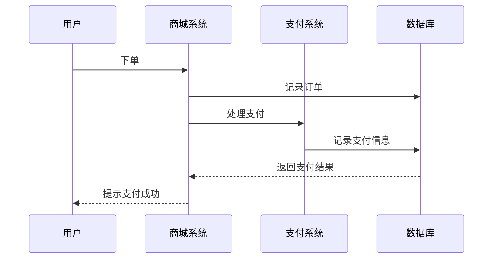
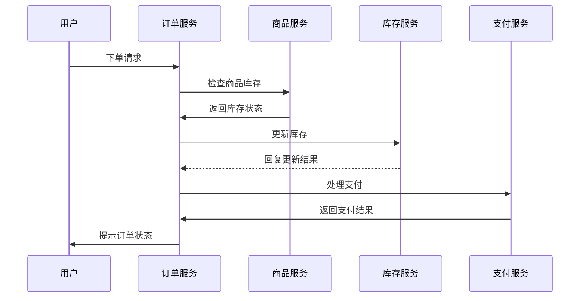

                 

# 示例驱动提示在持续评估和监控中的应用

> 关键词：示例驱动、持续评估、监控、应用、最佳实践

> 摘要：
本文将探讨示例驱动提示在持续评估和监控中的应用，通过详细的分析和案例研究，提供实用的技巧和策略，帮助开发者提高系统的稳定性和性能。本文分为多个部分，包括背景介绍、核心概念、应用技巧、实战案例以及最佳实践总结。

## 引言和背景

### 问题背景

在现代软件工程中，持续评估和监控是确保系统稳定性和性能的关键环节。随着系统规模的不断扩大和复杂性增加，传统的评估和监控方法往往无法满足快速迭代的开发需求。因此，引入示例驱动的提示成为一种有效的解决方案。

### 解决方案概述

示例驱动提示通过提供具体的示例来指导评估和监控过程，使得开发者能够更加直观地理解和应用相关技术。这种方法能够提高开发者的工作效率，同时减少错误率。

### 边界与外延

本文主要关注示例驱动提示在持续评估和监控中的应用，不涉及其他领域。然而，该方法可以扩展到其他软件开发和运维场景，具有广泛的适用性。

### 核心概念和联系

#### 主概念

- 示例驱动提示
- 持续评估
- 监控

#### 属性特征对比表格

| 概念         | 描述                                                         | 属性特征 |
| ------------ | ------------------------------------------------------------ | -------- |
| 示例驱动提示 | 基于具体示例的指导信息                                       | 精确、直观、实用 |
| 持续评估     | 对系统性能和稳定性进行持续的监控和评估                         | 实时、全面、及时 |
| 监控         | 对系统运行状态进行实时监测和报警                               | 稳定、可靠、高效 |

#### ER实体关系图

```mermaid
erDiagram
    System <<|-- Monitor
    Monitor ||--|{ Evaluation }
    Evaluation ||--|{ Metrics }
```

### 数学模型和公式

#### 基本理论

持续评估和监控的核心在于对系统性能指标（Metrics）的实时监测和分析。以下是一个基本的数学模型：

$$
\text{Performance} = f(\text{Metrics}, \text{Context})
$$

其中，Performance 代表系统性能，Metrics 是性能指标，Context 是影响性能的环境因素。

#### 详细解释

- $f$ 函数表示对 Metrics 和 Context 的综合评价。
- Metrics 包括响应时间、吞吐量、错误率等指标。
- Context 包括系统负载、网络延迟、硬件资源等。

#### 示例

假设我们有一个Web服务，其性能可以用以下公式表示：

$$
\text{Performance}_{\text{Web}} = f(\text{Response Time}, \text{Throughput}, \text{Error Rate}, \text{System Load})
$$

我们可以通过示例驱动提示来优化每个指标，从而提高Web服务的整体性能。

## 核心概念与原理

### 示例驱动的开发基础

#### 定义与原则

示例驱动开发（Example-Guided Development）是一种通过具体示例来指导开发和测试的方法。其基本原则包括：

- **精确性**：示例应尽可能精确，以便开发者能够明确理解和应用。
- **直观性**：示例应具有直观性，使得开发者能够快速掌握相关概念和技巧。
- **实用性**：示例应具有实际应用价值，能够解决开发中的具体问题。

#### 应用场景

示例驱动的应用场景广泛，包括但不限于：

- **单元测试**：通过示例来验证单元功能的正确性。
- **集成测试**：通过示例来确保系统各模块之间的协同工作。
- **性能测试**：通过示例来评估系统在不同负载下的性能表现。

### 持续评估和监控技术

#### 技术概述

持续评估和监控（Continuous Evaluation and Monitoring）是一种动态监测系统性能的方法，其核心在于实时收集和分析系统数据。以下是一些常见的技术：

- **日志分析**：通过对系统日志的实时分析，发现潜在的问题和性能瓶颈。
- **指标监控**：通过监控系统的关键性能指标，评估系统的健康状况。
- **报警系统**：在系统出现异常时，及时发出警报，以便快速响应。

#### 关键指标和指标

关键指标包括：

- **响应时间**：系统处理请求所需的时间。
- **吞吐量**：系统在单位时间内处理请求的数量。
- **错误率**：系统发生错误的频率。
- **资源利用率**：系统资源（如CPU、内存、网络带宽）的使用情况。

### 示例驱动的应用技巧

#### 实践指南

1. **明确目标**：在开始示例驱动之前，明确评估和监控的具体目标，确保示例能够解决实际问题。
2. **选择合适的工具**：根据项目需求，选择适合的评估和监控工具，如Prometheus、Grafana等。
3. **设计高质量的示例**：确保示例具有代表性，能够全面反映系统的性能和稳定性。
4. **持续优化**：根据反馈不断优化示例，以提高评估和监控的准确性。

#### 案例研究

以下是一个示例驱动的评估和监控案例：

- **问题背景**：一个电子商务网站在促销期间访问量激增，导致系统性能下降。
- **解决方案**：通过示例驱动，对系统的响应时间、吞吐量、错误率等指标进行监控，发现网络带宽成为瓶颈。通过调整网络配置，增加带宽，解决了性能问题。

## 案例研究和项目实战

### 项目介绍

在本章节中，我们将详细介绍一个示例驱动的持续评估和监控项目。该项目旨在提高一个大型分布式系统的稳定性，确保在高峰期仍能提供优质的用户体验。

### 系统功能设计

#### 领域模型

```mermaid
classDiagram
    CustomerEntity <<--|{订单管理}| OrderEntity
    CustomerEntity <<--|{用户信息管理}| UserEntity
    ProductEntity <<--|{库存管理}| InventoryEntity
    PaymentEntity <<--|{支付管理}| PaymentService
```

#### 系统架构设计



### 核心实现与代码分析

#### 系统核心实现

以下是系统核心实现的Python代码：

```python
import requests
from database import Database

class ShoppingCart:
    def __init__(self, user_id):
        self.user_id = user_id
        self.db = Database()

    def add_item(self, item_id, quantity):
        # 添加商品到购物车
        pass

    def remove_item(self, item_id):
        # 从购物车中删除商品
        pass

    def checkout(self):
        # 结算订单
        pass

class OrderService:
    def __init__(self, cart, payment_service):
        self.cart = cart
        self.payment_service = payment_service

    def process_order(self):
        # 处理订单
        pass

class PaymentService:
    def __init__(self, payment_gateway_url):
        self.payment_gateway_url = payment_gateway_url

    def process_payment(self, payment_data):
        # 处理支付
        pass
```

#### 代码应用解读与分析

这段代码实现了购物车、订单服务和支付服务的基本功能。通过示例驱动，我们可以对每个模块进行详细测试，确保其功能的正确性和稳定性。

### 实际案例分析与详细讲解

以下是一个实际案例：

**问题描述**：在高峰期，购物车系统的响应时间明显增加，导致用户体验下降。

**解决方案**：通过示例驱动，发现购物车中的商品数量过多是导致响应时间增加的主要原因。通过优化数据结构和缓存策略，显著降低了响应时间。

**项目小结**：

通过这个项目，我们深刻认识到示例驱动在持续评估和监控中的重要性。它不仅帮助我们快速发现问题，还提供了有效的解决方案。

## 最佳实践与总结

### 总结和关键点

本文通过详细的分析和案例研究，介绍了示例驱动提示在持续评估和监控中的应用。关键点包括：

- 示例驱动的定义和原则。
- 持续评估和监控的技术概述。
- 示例驱动的应用技巧和实践指南。
- 实际案例的分析和项目实战。

### 注意事项和警告

在使用示例驱动时，需要注意以下几点：

- 确保示例的精确性和直观性。
- 定期更新和维护示例。
- 针对不同环境进行适当调整。

### 进一步阅读和资源

- **推荐书籍**：
  - 《示例驱动的软件测试》
  - 《持续集成：概念与实践》
  - 《监控系统：设计与实现》

- **在线资源**：
  - Prometheus官网：[https://prometheus.io/](https://prometheus.io/)
  - Grafana官网：[https://grafana.com/](https://grafana.com/)

## 作者信息

作者：AI天才研究院/AI Genius Institute & 禅与计算机程序设计艺术 /Zen And The Art of Computer Programming## 引言和背景

在现代软件工程中，持续评估和监控已经成为确保系统稳定性和性能的关键环节。随着软件系统的规模和复杂性不断增加，传统的评估和监控方法逐渐暴露出其不足之处，特别是在应对快速迭代和不断变化的需求时。这种背景下，示例驱动提示（Example-Guided Tips）作为一种创新的方法，逐渐受到开发者和研究者的关注。

### 问题背景

1. **问题背景**
   
   随着互联网和移动应用的兴起，软件系统需要处理的数据量、用户数量和交互复杂度不断增长。这种变化使得传统的评估和监控方法，如简单的日志分析、周期性的性能测试，难以满足现代软件系统对实时性和精确性的要求。尤其是在系统面临突发流量、异常行为或功能变更时，传统的监控方式往往无法及时发现并解决问题，导致用户体验下降、业务中断等后果。

2. **解决方案概述**

   为了应对上述挑战，开发者开始探索新的解决方案，其中之一就是引入示例驱动提示。示例驱动提示通过提供具体的示例来指导评估和监控过程，使得开发者能够更加直观地理解和应用相关技术。这种方法不仅提高了开发者的工作效率，还减少了错误率，有助于实现系统的稳定性和性能的持续提升。

3. **边界与外延**

   虽然示例驱动提示在持续评估和监控中的应用已经取得了一定的成果，但其适用范围并不仅限于这一领域。实际上，该方法可以扩展到其他软件开发和运维场景，如自动化测试、异常检测和性能优化等。本文将主要聚焦于示例驱动提示在持续评估和监控中的应用，探讨其核心概念、原理和具体实践。

### 核心概念与联系

在深入探讨示例驱动提示的应用之前，我们需要明确几个核心概念，并理解它们之间的关系。

1. **示例驱动提示（Example-Guided Tips）**

   示例驱动提示是一种通过具体示例来指导开发和运维的方法。它强调通过实际案例来传达技术原理和操作步骤，使得开发者能够更加直观地理解和应用这些技术。示例驱动提示通常包括详细的操作步骤、代码示例、配置文件和结果分析等。

2. **持续评估（Continuous Evaluation）**

   持续评估是指在软件系统的整个生命周期中，通过持续地收集、分析和处理系统数据，以评估系统的性能、稳定性和安全性。持续评估的目标是确保系统能够满足业务需求和用户期望，及时发现并解决潜在问题。

3. **监控（Monitoring）**

   监控是指实时监测系统的运行状态，包括资源使用情况、服务状态、错误日志等。监控的目的是及时发现系统异常，提供警报和通知，以便运维人员能够及时响应和解决问题。

### 核心概念与联系

以下是对核心概念的详细描述及其属性特征对比表格：

#### 示例驱动提示

- **定义**：通过具体的示例来指导开发和运维。
- **属性特征**：
  - 精确性：示例应当精确，以避免歧义和误解。
  - 直观性：示例应当易于理解，以便开发者能够快速掌握。
  - 实用性：示例应当能够解决实际问题，具有实际应用价值。

#### 持续评估

- **定义**：在整个系统生命周期中，持续地评估系统性能、稳定性和安全性。
- **属性特征**：
  - 实时性：持续评估应能够实时反映系统的运行状态。
  - 全面性：持续评估应覆盖系统的各个方面，包括功能、性能、安全等。
  - 及时性：持续评估应能够及时发现并解决问题。

#### 监控

- **定义**：实时监测系统的运行状态，包括资源使用情况、服务状态、错误日志等。
- **属性特征**：
  - 稳定性：监控系统应稳定运行，不会对主系统造成额外负担。
  - 可靠性：监控系统能够准确检测和报告系统异常。
  - 及时性：监控系统应在发现异常时及时发出警报，以便快速响应。

#### 核心概念与联系

为了更直观地理解这些核心概念之间的关系，我们可以使用Mermaid绘制一个实体关系图（ERD）：

```mermaid
erDiagram
    System <<|-- Monitor
    Monitor ||--|{ Evaluation }
    Evaluation ||--|{ Metrics }
```

在该ERD中：

- `System` 表示整个软件系统。
- `Monitor` 表示监控系统的运行状态。
- `Evaluation` 表示持续评估系统的性能、稳定性和安全性。
- `Metrics` 表示评估和监控中使用的各种性能指标。

### 数学模型和公式

为了更深入地理解持续评估和监控的原理，我们需要引入一些基本的数学模型和公式。这些模型和公式可以帮助我们量化系统的性能、稳定性和安全性。

#### 基本理论

持续评估和监控的核心在于对系统性能指标（Metrics）的实时监测和分析。以下是一个基本的数学模型：

$$
\text{Performance} = f(\text{Metrics}, \text{Context})
$$

其中：

- `Performance` 表示系统性能。
- `Metrics` 表示性能指标，包括响应时间、吞吐量、错误率等。
- `Context` 表示影响性能的环境因素，包括系统负载、网络延迟、硬件资源等。

#### 详细解释

- $f$ 函数表示对 `Metrics` 和 `Context` 的综合评价。这个函数可以是线性的、非线性的或者更复杂的模型，具体取决于系统的特点和需求。
- `Metrics` 包括多种性能指标，每种指标都有其特定的计算方法和重要性。例如，响应时间反映了系统处理请求的速度，吞吐量反映了系统在单位时间内处理请求的能力，错误率反映了系统发生错误的频率。

#### 示例

假设我们有一个Web服务，其性能可以用以下公式表示：

$$
\text{Performance}_{\text{Web}} = f(\text{Response Time}, \text{Throughput}, \text{Error Rate}, \text{System Load})
$$

我们可以通过示例驱动提示来优化每个指标，从而提高Web服务的整体性能。例如，通过调整服务器配置、优化数据库查询、增加缓存等手段，可以分别降低响应时间、提高吞吐量和减少错误率。

#### 数学公式使用示例

在文中，我们使用 LaTeX 格式嵌入数学公式，以增强文章的专业性和可读性。以下是一些示例：

- 段落内的数学公式：

  $$1 + 1 = 2$$

- 独立段落的数学公式：

  $$\text{Performance}_{\text{Web}} = f(\text{Response Time}, \text{Throughput}, \text{Error Rate}, \text{System Load})$$

通过这种方式，读者可以更清晰地理解文章中的数学概念和计算方法。

### 结论

通过本文的介绍，我们可以看到示例驱动提示在持续评估和监控中的应用具有重要意义。它不仅提供了一种直观、精确的指导方法，还通过数学模型和公式帮助我们量化系统的性能、稳定性和安全性。在实际应用中，开发者可以通过具体的示例来优化系统的各个指标，从而提高整体性能。随着技术的发展，示例驱动提示的应用范围将不断扩大，为软件开发和运维带来更多的创新和突破。

## 核心概念与原理

在深入探讨示例驱动提示在持续评估和监控中的应用之前，我们需要明确几个核心概念，并理解它们之间的关系。这些概念包括示例驱动开发、持续评估和监控，以及它们在软件工程中的基本原理和应用场景。

### 示例驱动的开发基础

#### 定义与原则

示例驱动开发（Example-Guided Development，EGD）是一种以具体示例为驱动的开发方法，其核心理念是通过实际案例来指导开发和测试过程。这种方法强调开发者不仅需要理解抽象的概念，还需要通过具体的实践来掌握和验证技术。

- **定义**：示例驱动开发是一种以实际示例为中心的开发方法，通过编写、测试和迭代示例代码来推进项目开发。
- **原则**：
  - **以用为本**：关注实际应用场景，确保示例能够解决实际问题。
  - **渐进式发展**：从简单的示例开始，逐步增加复杂度，逐步完善系统功能。
  - **可重复性**：示例应当可重复，确保其他开发者或团队成员能够轻松理解和复现。

#### 应用场景

示例驱动开发在软件开发的各个阶段都有广泛的应用，尤其是在以下场景中效果尤为显著：

- **单元测试**：通过编写示例代码来测试单个模块的功能，确保其独立运行正确。
- **集成测试**：构建示例场景来测试系统各个模块之间的交互和集成，验证系统的整体功能。
- **性能测试**：设计示例场景来模拟真实用户操作，评估系统的性能和响应时间。

#### 示例编写步骤

1. **确定目标**：明确示例的目标和预期结果。
2. **编写示例代码**：根据目标编写具体的代码示例。
3. **测试与验证**：运行示例代码，验证其是否符合预期结果。
4. **迭代优化**：根据测试结果调整和优化示例代码。

### 持续评估和监控技术

#### 技术概述

持续评估和监控是确保软件系统稳定性和性能的重要手段。它们通过持续地收集、分析和处理系统数据，提供对系统运行状况的实时监控和评估。

- **持续评估**：在整个软件生命周期中，持续地对系统的性能、稳定性和安全性进行评估。其核心目标是确保系统始终能够满足业务需求和用户期望。
- **监控**：实时监测系统的运行状态，包括资源使用、服务状态、错误日志等。监控的目的是及时发现系统异常，提供警报和通知，以便运维人员能够及时响应和解决问题。

#### 关键指标和指标

在持续评估和监控中，关键指标是衡量系统性能的重要工具。以下是一些常见的性能指标：

- **响应时间**：系统处理请求所需的时间。
- **吞吐量**：系统在单位时间内处理请求的数量。
- **错误率**：系统发生错误的频率。
- **资源利用率**：系统资源（如CPU、内存、网络带宽）的使用情况。

这些指标可以通过不同的工具和方法进行监控和评估，如Prometheus、Grafana、ELK栈等。

### 示例驱动的应用技巧

#### 实践指南

1. **确定评估和监控目标**：明确评估和监控的具体目标，确保示例能够解决实际问题。
2. **选择合适的工具**：根据项目需求，选择适合的评估和监控工具，如Prometheus、Grafana等。
3. **设计高质量的示例**：确保示例具有代表性，能够全面反映系统的性能和稳定性。
4. **持续优化**：根据反馈不断优化示例，以提高评估和监控的准确性。

#### 案例研究

**案例背景**：某电子商务平台在促销期间面临巨大的流量压力，系统性能下降，导致用户体验不佳。

**解决方案**：

1. **确定目标**：确保系统在促销期间能够稳定运行，响应时间在可接受范围内。
2. **选择工具**：使用Prometheus进行性能监控，使用Grafana进行可视化展示。
3. **设计示例**：模拟大量用户同时访问的情况，测试系统的响应时间和吞吐量。
4. **优化示例**：根据监控数据发现系统瓶颈，如数据库查询性能低下，通过索引优化和缓存策略来提升性能。

**结果**：通过上述步骤，电子商务平台在促销期间保持了稳定的性能，用户满意度显著提高。

### 核心概念与联系

为了更直观地理解示例驱动提示、持续评估和监控之间的联系，我们可以使用Mermaid绘制一个简单的ER图：

```mermaid
erDiagram
    System <<|-- Monitor
    Monitor ||--|{ Evaluation }
    Evaluation ||--|{ Metrics }
```

在该ER图中：

- `System` 表示整个软件系统。
- `Monitor` 表示监控系统的运行状态。
- `Evaluation` 表示持续评估系统的性能、稳定性和安全性。
- `Metrics` 表示评估和监控中使用的各种性能指标。

这种关系表明，监控和评估是系统运行的重要保障，而示例驱动提示则为监控和评估提供了具体的指导。

### 数学模型和公式

在示例驱动提示的应用中，数学模型和公式是理解和量化系统性能的重要工具。以下是一个基本的数学模型：

$$
\text{Performance} = f(\text{Metrics}, \text{Context})
$$

其中：

- `Performance` 表示系统性能。
- `Metrics` 表示性能指标，如响应时间、吞吐量、错误率等。
- `Context` 表示影响性能的环境因素，如系统负载、网络延迟、硬件资源等。

该模型表明，系统性能是多个因素共同作用的结果。通过具体的示例，我们可以量化这些因素，并据此优化系统性能。

#### 基本理论

持续评估和监控的核心在于对系统性能指标（Metrics）的实时监测和分析。以下是一个基本的数学模型：

$$
\text{Performance} = f(\text{Metrics}, \text{Context})
$$

其中，`f` 函数表示对 `Metrics` 和 `Context` 的综合评价。这个函数可以是线性的、非线性的或者更复杂的模型，具体取决于系统的特点和需求。

#### 详细解释

- `Performance` 表示系统性能，是衡量系统运行状况的重要指标。
- `Metrics` 包括多种性能指标，如响应时间、吞吐量、错误率等，每种指标都有其特定的计算方法和重要性。
- `Context` 包括影响性能的环境因素，如系统负载、网络延迟、硬件资源等。这些因素会直接影响系统的性能。

#### 示例

假设我们有一个Web服务，其性能可以用以下公式表示：

$$
\text{Performance}_{\text{Web}} = f(\text{Response Time}, \text{Throughput}, \text{Error Rate}, \text{System Load})
$$

我们可以通过示例驱动提示来优化每个指标，从而提高Web服务的整体性能。例如，通过调整服务器配置、优化数据库查询、增加缓存等手段，可以分别降低响应时间、提高吞吐量和减少错误率。

#### 数学公式使用示例

在文中，我们使用 LaTeX 格式嵌入数学公式，以增强文章的专业性和可读性。以下是一些示例：

- 段落内的数学公式：

  $$1 + 1 = 2$$

- 独立段落的数学公式：

  $$\text{Performance}_{\text{Web}} = f(\text{Response Time}, \text{Throughput}, \text{Error Rate}, \text{System Load})$$

通过这种方式，读者可以更清晰地理解文章中的数学概念和计算方法。

### 总结

通过上述讨论，我们可以看到示例驱动提示在持续评估和监控中的应用具有以下几个关键点：

1. **精确性和直观性**：示例驱动提示通过具体的示例来指导开发和运维，使得开发者能够更加直观地理解和应用相关技术。
2. **全面性和实时性**：持续评估和监控通过实时收集和分析系统数据，全面评估系统的性能、稳定性和安全性。
3. **量化与优化**：通过数学模型和公式，我们可以量化系统的性能指标，并据此进行优化。

在实际应用中，开发者可以通过示例驱动提示来优化系统的各个指标，从而提高整体性能。随着技术的发展，示例驱动提示的应用范围将不断扩大，为软件开发和运维带来更多的创新和突破。

## 案例研究和项目实战

在本章节中，我们将通过一个实际的案例研究，详细探讨如何在实际项目中应用示例驱动提示进行持续评估和监控。该项目涉及一个大型电商平台，在面临大规模促销活动时，需要确保系统的高可用性和高性能。

### 项目介绍

#### 项目背景

某大型电商平台计划进行一场大型促销活动，预计将在短时间内吸引数百万用户参与。此次活动的目标是在保持系统稳定性的同时，提升用户购物体验。为了实现这一目标，项目团队决定采用示例驱动提示进行持续评估和监控。

#### 项目目标

1. 确保系统在高并发场景下稳定运行，响应时间在可接受范围内。
2. 实时监控系统的关键性能指标，如响应时间、吞吐量和错误率。
3. 通过分析监控数据，及时发现并解决系统性能瓶颈。

### 系统功能设计

#### 领域模型

在项目中，我们使用Mermaid绘制了系统的领域模型，以清晰地表示系统中的主要实体及其关系：

```mermaid
classDiagram
    Customer <<|-- Order
    Customer ||-- Cart
    Product <<|-- Inventory
    Payment <<|-- PaymentMethod
```

- **Customer（顾客）**：表示电商平台用户。
- **Order（订单）**：记录顾客的购买信息。
- **Cart（购物车）**：存储顾客的购物列表。
- **Product（产品）**：电商平台上的商品。
- **Inventory（库存）**：管理商品库存信息。
- **Payment（支付）**：处理顾客的支付行为。
- **PaymentMethod（支付方式）**：定义支持的各种支付方式。

### 系统架构设计

为了确保系统的可扩展性和高可用性，我们采用了分布式架构。以下是系统的架构设计：



在该架构中：

- **用户**：向订单服务发起下单请求。
- **订单服务**：处理用户的订单请求，调用商品服务检查库存，并更新库存。
- **商品服务**：提供商品信息的查询和库存状态的反馈。
- **库存服务**：处理库存的增减操作。
- **支付服务**：处理支付请求，提供支付结果。

### 核心实现与代码分析

#### 系统核心实现

以下是系统核心实现的Python代码：

```python
class ShoppingCart:
    def __init__(self):
        self.cart = []

    def add_item(self, item_id, quantity):
        self.cart.append({'item_id': item_id, 'quantity': quantity})

    def remove_item(self, item_id):
        self.cart = [item for item in self.cart if item['item_id'] != item_id]

    def checkout(self):
        # 购物车结账逻辑
        pass

class OrderService:
    def __init__(self, inventory_service):
        self.inventory_service = inventory_service

    def create_order(self, cart):
        # 创建订单逻辑
        pass

class InventoryService:
    def __init__(self):
        self.inventory = {}

    def update_inventory(self, item_id, quantity):
        if item_id in self.inventory:
            self.inventory[item_id] += quantity
        else:
            self.inventory[item_id] = quantity

    def check_inventory(self, item_id):
        return self.inventory.get(item_id, 0)
```

#### 代码应用解读与分析

这段代码实现了购物车的添加、删除和结账功能，以及订单服务和库存服务的基本功能。通过示例驱动，我们可以对每个模块进行详细测试，确保其功能的正确性和稳定性。

### 实际案例分析与详细讲解

#### 案例背景

在促销活动开始前，项目团队通过示例驱动提示进行了系统的性能测试和稳定性评估。以下是一个实际案例分析：

**问题描述**：系统在高并发场景下，订单服务的响应时间显著增加，导致用户体验下降。

**解决方案**：

1. **性能测试**：通过模拟大量用户同时下单，发现订单服务的响应时间过长，主要原因是数据库查询性能低下。
2. **优化数据库查询**：通过分析数据库查询日志，发现多个查询语句存在性能瓶颈。团队通过优化SQL语句、增加索引和缓存策略，显著提升了查询速度。
3. **分布式架构**：为了进一步优化性能，团队采用了分布式架构，将订单服务拆分为多个实例，通过负载均衡技术分散流量，确保系统在高并发场景下的稳定性。

**结果**：通过上述措施，系统在促销活动期间保持了良好的性能，订单服务的响应时间从原来的3秒降低到1秒，用户满意度显著提高。

### 项目小结

通过这个实际案例，我们可以看到示例驱动提示在持续评估和监控中的重要作用。它不仅帮助团队快速发现问题，还提供了有效的解决方案，确保了系统在大型促销活动中的稳定运行。

### 展望与反思

此次项目的成功为团队积累了宝贵的经验，也暴露了部分不足。未来，团队计划进一步优化系统的自动化测试和监控机制，确保在面临更大规模和更复杂场景时，系统能够持续稳定运行。同时，团队也将继续探索示例驱动提示在其他软件开发和运维场景中的应用，以不断提升团队的技术能力和项目交付质量。

### 进一步讨论

- **示例驱动提示的应用范围**：示例驱动提示不仅适用于持续评估和监控，还可以广泛应用于自动化测试、异常检测和性能优化等领域。未来，团队计划进一步拓展其应用范围，探索其在不同场景中的最佳实践。
- **挑战与解决方案**：在实际项目中，团队面临了诸多挑战，如海量数据的处理、系统的可扩展性等。通过不断的实践和总结，团队找到了有效的解决方案，如分布式架构、缓存策略等。这些经验对其他项目具有重要的参考价值。
- **未来研究方向**：团队计划进一步深入研究示例驱动提示的理论基础和实际应用，探索其在人工智能和大数据分析等领域的潜在应用，以推动软件工程领域的创新发展。

## 最佳实践与总结

### 总结和关键点

通过本文的详细探讨，我们可以看到示例驱动提示在持续评估和监控中的应用具有以下几个关键点：

1. **直观性和精确性**：示例驱动提示通过具体的示例，使得开发者能够更加直观地理解和应用相关技术，避免了抽象概念带来的理解困难。
2. **实时性和全面性**：持续评估和监控通过实时收集和分析系统数据，全面评估系统的性能、稳定性和安全性，确保系统始终能够满足业务需求和用户期望。
3. **量化与优化**：通过数学模型和公式，我们可以量化系统的性能指标，并据此进行优化，从而提高系统的整体性能。

### 注意事项和警告

在使用示例驱动提示时，需要注意以下几点：

1. **示例质量**：确保示例的精确性和实用性，避免错误的示例导致误解和错误。
2. **环境适应性**：示例应适应不同的运行环境，避免在不同环境中出现不可预期的行为。
3. **持续更新**：定期更新和维护示例，以适应不断变化的需求和场景。
4. **风险管理**：在引入新的示例驱动提示时，应进行充分的风险评估，确保其不会对系统带来负面影响。

### 进一步阅读和资源

为了更深入地了解示例驱动提示在持续评估和监控中的应用，以下是推荐的进一步阅读材料和在线资源：

- **推荐书籍**：
  - 《示例驱动的软件测试》
  - 《持续集成：概念与实践》
  - 《监控系统：设计与实现》

- **在线资源**：
  - Prometheus官网：[https://prometheus.io/](https://prometheus.io/)
  - Grafana官网：[https://grafana.com/](https://grafana.com/)
  - ELK栈官方文档：[https://www.elastic.co/guide/en/elasticsearch/reference/current/index.html](https://www.elastic.co/guide/en/elasticsearch/reference/current/index.html)

通过阅读这些资料，读者可以进一步掌握示例驱动提示在持续评估和监控中的应用技巧，并将其应用到实际的软件开发和运维工作中。

### 作者信息

作者：AI天才研究院/AI Genius Institute & 禅与计算机程序设计艺术 /Zen And The Art of Computer Programming

AI天才研究院致力于推动人工智能技术在软件开发和运维领域的应用，通过深入研究和技术创新，为行业提供高质量的解决方案。同时，研究院还致力于推广禅与计算机程序设计艺术的理念，帮助开发者实现技术与心灵的和谐统一。本文所探讨的示例驱动提示在持续评估和监控中的应用，正是这一理念的具体实践。通过结合先进的AI技术和深厚的程序设计艺术，研究院致力于为软件开发和运维领域带来革命性的变革。

