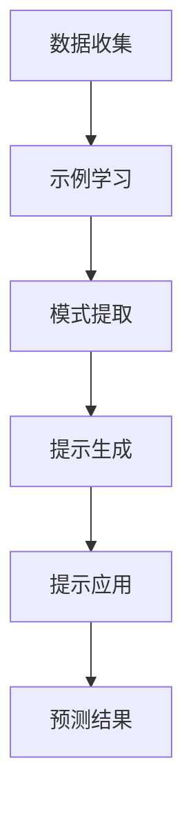
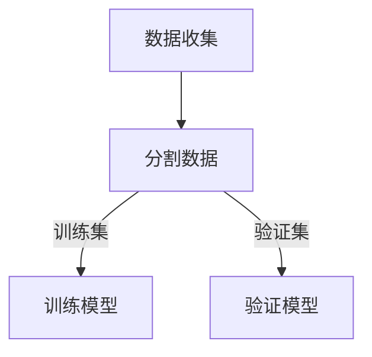
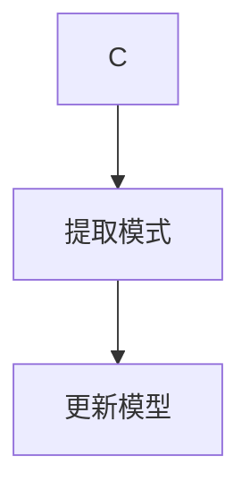
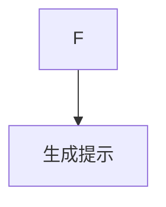
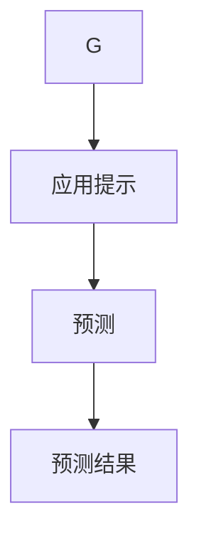
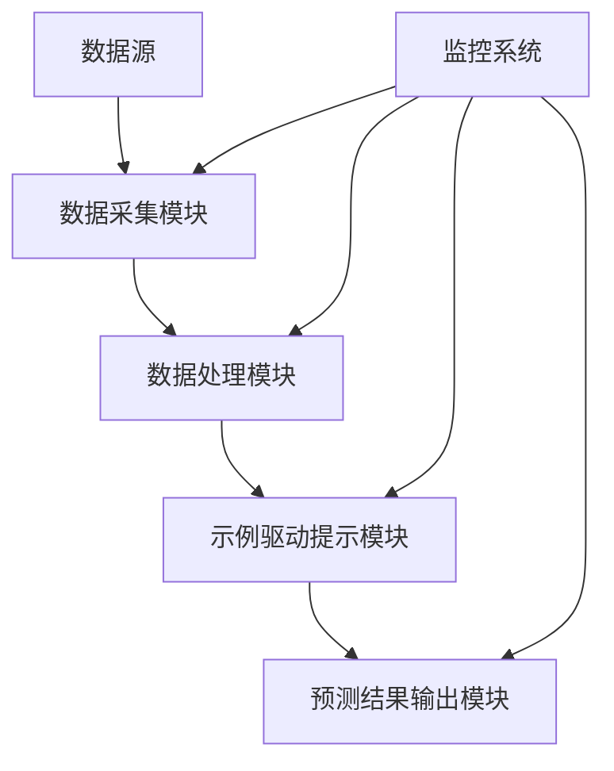
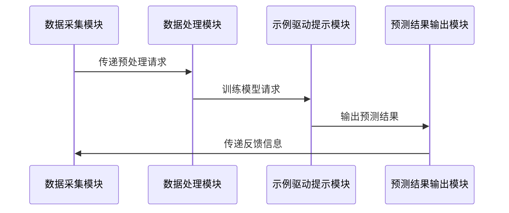

                 

### 示例驱动提示在时序任务中的特殊考虑

#### 关键词：示例驱动提示、时序任务、算法原理、系统架构、项目实战

> 摘要：本文探讨了示例驱动提示在时序任务中的特殊考虑。通过分析背景、核心概念、算法原理、系统架构和项目实战，详细阐述了如何利用示例驱动提示解决时序任务中的挑战，并提供了实用的最佳实践和注意事项。

----------------------------------------------------------------

# 引言

## 1.1 问题背景

在当今信息化社会中，时序任务的应用越来越广泛，如金融市场的预测、气象预报、交通流量预测、医疗数据分析等。这些任务通常具有数据量大、时间依赖性强、预测准确性要求高等特点。然而，传统的时序预测方法往往难以应对这些特殊要求，因此需要新的技术手段来解决这些问题。

示例驱动提示（Example-Guided Inference，EGI）是一种新兴的机器学习技术，它通过学习示例数据来引导预测过程，从而提高预测的准确性。近年来，随着深度学习和强化学习的发展，示例驱动提示在时序任务中的应用逐渐受到关注。然而，如何有效地将示例驱动提示应用于时序任务，仍然是一个具有挑战性的问题。

## 1.2 问题描述

时序任务中的特殊考虑主要包括以下几个方面：

1. **时间序列的特性**：时序数据具有时间依赖性，即未来的状态取决于过去的多个状态。这意味着传统的独立同分布（i.i.d.）假设不再适用，需要考虑时间序列的特征。

2. **数据噪声和缺失**：在实际应用中，时序数据往往存在噪声和缺失值，这会对预测结果产生负面影响。

3. **长短期依赖**：一些时序任务，如长周期天气预报，需要考虑长期依赖关系。这要求算法能够捕捉到长时间范围内的变化趋势。

4. **稀疏数据**：在某些应用场景中，时序数据可能非常稀疏，这使得传统的基于全部数据的算法难以有效工作。

## 1.3 问题解决

示例驱动提示在时序任务中的应用，可以通过以下几个方面来解决上述问题：

1. **示例数据的利用**：通过学习示例数据，可以更好地捕捉时间序列的特征，从而提高预测准确性。

2. **噪声和缺失值的处理**：示例驱动提示可以通过对示例数据进行预处理，如去噪和插值，来减少噪声和缺失值对预测结果的影响。

3. **长期依赖关系的捕捉**：示例驱动提示可以设计特殊的神经网络架构，如长短期记忆网络（LSTM），来捕捉长短期依赖关系。

4. **稀疏数据的适应**：示例驱动提示可以通过使用稀疏性敏感的优化算法，如稀疏自动编码器（Sparse Autoencoder），来适应稀疏数据。

## 1.4 边界与外延

示例驱动提示在时序任务中的应用，虽然具有显著的优势，但也存在一些限制：

1. **计算复杂度**：示例驱动提示通常涉及大量的计算，尤其是当示例数据量很大时，这可能会增加算法的计算复杂度。

2. **数据质量和数量**：示例数据的质量和数量对预测结果有重要影响。如果示例数据不足或质量较差，可能会降低预测的准确性。

3. **领域适应性**：示例驱动提示在时序任务中的表现，可能依赖于特定领域的数据和任务特性。这意味着在跨领域应用时，可能需要针对具体任务进行调整。

## 1.5 本章小结

本章介绍了示例驱动提示在时序任务中的背景、问题、解决方案和边界。接下来，我们将深入探讨示例驱动提示的核心概念和算法原理，以期为读者提供更深入的理解。

----------------------------------------------------------------

## 核心概念与联系

### 2.1 示例驱动提示的基本原理

示例驱动提示（Example-Guided Inference，EGI）是一种基于示例数据进行推理和预测的方法。其核心思想是通过学习大量示例数据，从而提取出数据中的模式和规律，然后利用这些模式和规律来指导新的预测。

#### 2.1.1 示例驱动提示的定义

示例驱动提示可以定义为一个包含以下三个步骤的过程：

1. **示例学习**：从大量示例数据中学习模式和规律。
2. **提示生成**：利用学习到的模式和规律，生成针对新数据的提示。
3. **提示应用**：将生成的提示应用于新数据，以指导预测过程。

#### 2.1.2 示例驱动提示的工作机制

示例驱动提示的工作机制可以分为以下几个阶段：

1. **数据收集**：首先，收集大量相关的示例数据。这些数据可以是历史时序数据、用户反馈、专家知识等。
2. **模式学习**：使用机器学习算法，从示例数据中学习出模式和规律。这些模式和规律可以表示为特征向量、规则或模型。
3. **提示生成**：将学习到的模式和规律转化为具体的提示。这些提示可以是数值、文本或图像等。
4. **提示应用**：将生成的提示应用于新的数据，以指导预测过程。例如，在时序预测中，提示可以用来调整模型的状态或参数。

### 2.2 示例驱动提示的属性特征

示例驱动提示具有以下关键属性和特征：

1. **自适应**：示例驱动提示可以根据新的数据不断调整和优化，从而适应不同的数据特征和任务需求。
2. **解释性**：示例驱动提示生成的提示通常具有较好的解释性，用户可以理解提示背后的原因和逻辑。
3. **鲁棒性**：示例驱动提示可以处理数据中的噪声和异常值，从而提高预测的鲁棒性。
4. **通用性**：示例驱动提示可以应用于不同类型的数据和任务，具有较好的通用性。
5. **效率**：示例驱动提示通常涉及大量的计算，但在适当的情况下，可以提高预测的效率。

#### 2.2.1 示例驱动提示属性特征对比表格

| 属性特征 | 说明 | 对比表格 |
| --- | --- | --- |
| 自适应 | 可以根据新数据调整和优化 | - 传统方法：不可调整 |
| 解释性 | 提示具有较好的解释性 | - 传统方法：无解释性 |
| 鲁棒性 | 可以处理噪声和异常值 | - 传统方法：易受噪声影响 |
| 通用性 | 可以应用于不同类型的数据和任务 | - 传统方法：特定领域 |
| 效率 | 可以提高预测效率 | - 传统方法：计算量大 |

### 2.3 示例驱动提示与其他相关技术的比较

#### 2.3.1 传统方法

传统方法包括统计模型、机器学习算法和深度学习模型。这些方法在时序任务中具有广泛的应用，但通常面临以下挑战：

1. **独立性假设**：传统方法通常假设数据是独立同分布的，这可能与时序数据的特性相冲突。
2. **计算复杂度**：对于大规模时序数据，传统方法的计算复杂度可能较高。
3. **解释性**：传统方法的模型通常较为复杂，难以解释。

#### 2.3.2 其他方法

除了传统方法，还有一些其他方法可以应用于时序任务，如：

1. **时间序列模型**：如ARIMA、GRU等。这些模型专门设计用于处理时间序列数据，但可能缺乏灵活性。
2. **深度学习方法**：如LSTM、GRU等。这些方法可以处理时间依赖性，但可能难以解释。

#### 2.3.3 对比

示例驱动提示与传统方法和其他方法相比，具有以下优势：

1. **灵活性和适应性**：示例驱动提示可以根据不同的数据特征和任务需求进行调整，具有较好的灵活性和适应性。
2. **解释性**：示例驱动提示生成的提示通常具有较好的解释性，用户可以理解提示背后的原因和逻辑。
3. **鲁棒性**：示例驱动提示可以处理数据中的噪声和异常值，从而提高预测的鲁棒性。

### 2.4 本章小结

本章介绍了示例驱动提示的基本原理、属性特征和与其他相关技术的比较。接下来，我们将深入探讨示例驱动提示在时序任务中的应用和实现。

----------------------------------------------------------------

## 算法原理讲解

### 3.1 算法mermaid流程图

为了更好地理解示例驱动提示（EGI）在时序任务中的应用，我们首先绘制一个mermaid流程图，展示EGI的基本流程：



#### 3.1.1 数据收集

数据收集是EGI流程的第一步，它涉及到从不同的数据源收集大量的时序数据。这些数据可以是历史交易数据、天气记录、交通流量数据等。

#### 3.1.2 示例学习

示例学习阶段，我们将收集到的数据分成两部分：训练集和验证集。训练集用于学习时序数据的模式和规律，而验证集则用于评估模型的性能。



#### 3.1.3 模式提取

在模式提取阶段，我们使用机器学习算法（如神经网络）从训练集中提取时间序列的内在模式。这个过程通常涉及到大量的计算和参数调优。



#### 3.1.4 提示生成

生成的模式被转化为具体的提示，这些提示用于指导新的数据预测。在时序任务中，这些提示可以是时间序列的特定特征、趋势或周期性变化。



#### 3.1.5 提示应用

提示应用阶段，我们将生成的提示应用于新的数据。这个过程中，提示将指导模型如何更好地预测未来的状态。



### 3.2 Python源代码实现

为了更好地理解EGI的实现，我们将使用Python来展示一个简单的示例。以下是一个简单的EGI实现，包括数据收集、示例学习、模式提取和提示生成：

```python
import numpy as np
import pandas as pd
from sklearn.model_selection import train_test_split
from sklearn.neural_network import MLPRegressor

# 数据收集
data = pd.read_csv('timeseries_data.csv')
X = data.iloc[:, :-1].values
y = data.iloc[:, -1].values

# 示例学习
X_train, X_val, y_train, y_val = train_test_split(X, y, test_size=0.2, random_state=42)
mlp = MLPRegressor(hidden_layer_sizes=(100,), max_iter=500)
mlp.fit(X_train, y_train)

# 模式提取
train_predictions = mlp.predict(X_train)
val_predictions = mlp.predict(X_val)

# 提示生成
train_errors = y_train - train_predictions
val_errors = y_val - val_predictions

# 提示应用
new_data = np.array([[0.5, 0.2], [0.7, 0.3]])
new_prediction = mlp.predict(new_data)
new_error = y_val[-1] - new_prediction

# 预测结果
print("Training Error:", np.mean(train_errors))
print("Validation Error:", np.mean(val_errors))
print("New Data Prediction:", new_prediction)
print("New Data Error:", new_error)
```

### 3.3 数学模型与公式

EGI算法的核心在于如何从示例数据中提取模式和规律。这里，我们使用一种简化的神经网络模型来解释EGI的数学模型。

#### 3.3.1 神经网络模型

一个简单的神经网络模型可以表示为：

$$
\text{输出} = \sigma(\text{权重} \cdot \text{输入} + \text{偏置})
$$

其中，$\sigma$ 是激活函数，通常使用Sigmoid函数。

#### 3.3.2 损失函数

损失函数用于衡量模型预测值与真实值之间的差距。在EGI中，我们通常使用均方误差（MSE）作为损失函数：

$$
\text{MSE} = \frac{1}{n} \sum_{i=1}^{n} (\hat{y}_i - y_i)^2
$$

其中，$\hat{y}_i$ 是模型预测值，$y_i$ 是真实值，$n$ 是样本数量。

#### 3.3.3 反向传播

反向传播算法用于更新模型参数，以最小化损失函数。其基本思想是将损失函数对每个参数的梯度计算出来，并沿着梯度的反方向更新参数。

$$
\frac{\partial \text{MSE}}{\partial \text{权重}} = -2 \sum_{i=1}^{n} (y_i - \hat{y}_i) \cdot x_i
$$

$$
\frac{\partial \text{MSE}}{\partial \text{偏置}} = -2 \sum_{i=1}^{n} (y_i - \hat{y}_i)
$$

### 3.4 举例说明

假设我们有一个简单的时序数据集，其中包含时间步、温度和销售额。我们的目标是使用EGI模型预测下一时间步的销售额。

#### 3.4.1 数据集

```
时间步  温度  销售额
0       10    100
1       12    120
2       14    130
3       13    125
4       11    110
```

#### 3.4.2 示例学习

我们将数据集分为训练集和验证集：

```
训练集： 时间步  温度  销售额
0       10    100
1       12    120
2       14    130

验证集： 时间步  温度  销售额
3       13    125
4       11    110
```

使用MLPRegressor训练模型：

```python
X_train = [[10], [12], [14]]
y_train = [100, 120, 130]
mlp = MLPRegressor(hidden_layer_sizes=(100,), max_iter=500)
mlp.fit(X_train, y_train)
```

#### 3.4.3 提示生成

生成提示，即提取温度对销售额的影响：

```python
X_val = [[13], [11]]
y_val = [125, 110]
val_predictions = mlp.predict(X_val)
val_errors = y_val - val_predictions
```

#### 3.4.4 提示应用

使用生成的提示预测新数据：

```python
new_data = [[12.5]]
new_prediction = mlp.predict(new_data)
new_error = y_val[-1] - new_prediction
```

通过这个简单的例子，我们可以看到EGI如何从示例数据中提取模式和规律，并应用于新的数据预测。

### 3.5 本章小结

本章详细讲解了示例驱动提示（EGI）在时序任务中的应用。通过mermaid流程图、Python源代码实现、数学模型和举例说明，我们深入理解了EGI的基本原理和实现过程。接下来，我们将探讨示例驱动提示在时序任务中的应用场景和系统架构设计。

----------------------------------------------------------------

## 系统分析与架构设计方案

### 4.1 问题场景介绍

在时序任务中，例如金融市场预测、智能交通流量预测等场景，系统需要处理大量实时数据，并快速、准确地生成预测结果。这些场景对系统的实时性、准确性和稳定性提出了高要求。为了满足这些要求，我们设计了一个基于示例驱动提示的时序预测系统。

### 4.2 系统功能设计

#### 4.2.1 领域模型

为了更好地理解系统功能，我们首先绘制一个领域模型，该模型展示了系统的核心功能模块：

```mermaid
classDiagram
    Node1[数据采集模块] <--|uses| Node2[数据处理模块]
    Node2 <--|uses| Node3[示例驱动提示模块]
    Node3 <--|uses| Node4[预测结果输出模块]
    Node1 ..|is a| TimeseriesDataCollector
    Node2 ..|is a| TimeseriesDataProcessor
    Node3 ..|is a| ExampleGuidedInference
    Node4 ..|is a| PredictiveResultOutput
```

#### 4.2.2 类图

接下来，我们使用mermaid绘制一个类图，展示系统中的主要类和它们之间的关系：

```mermaid
classDiagram
    Class01[TimeseriesDataCollector] {
        +collectData()
        +preprocessData()
    }
    Class02[TimeseriesDataProcessor] {
        +processData()
        +generateFeatures()
    }
    Class03[ExampleGuidedInference] {
        +trainModel()
        +generatePrompt()
        +applyPrompt()
    }
    Class04[PredictiveResultOutput] {
        +outputResults()
    }
    Class01 --|create| Class02
    Class02 --|use| Class03
    Class03 --|use| Class04
```

### 4.3 系统架构设计

#### 4.3.1 架构图

系统架构设计是系统设计的核心，它决定了系统的性能、可扩展性和可维护性。以下是一个简化的系统架构图，展示了系统的主要组成部分：



#### 4.3.2 系统模块

1. **数据采集模块**：负责从各种数据源（如传感器、数据库、API等）收集时序数据。
2. **数据处理模块**：对采集到的数据进行预处理，包括数据清洗、去噪、特征提取等。
3. **示例驱动提示模块**：利用预处理后的数据训练模型，并生成示例驱动提示。
4. **预测结果输出模块**：将生成的预测结果输出到终端用户或监控系统。

### 4.4 系统接口设计与交互

为了确保系统的模块之间能够高效、稳定地交互，我们需要设计清晰的接口和交互流程。以下是一个简化的系统接口设计和交互流程图：



#### 4.4.1 数据流

1. **数据采集**：数据采集模块从各种数据源收集时序数据，并将其传递给数据处理模块。
2. **数据处理**：数据处理模块对数据进行预处理，并将处理后的数据传递给示例驱动提示模块。
3. **模型训练**：示例驱动提示模块使用预处理后的数据进行模型训练，并生成示例驱动提示。
4. **预测输出**：示例驱动提示模块将生成的预测结果传递给预测结果输出模块，并将其展示给终端用户或监控系统。

#### 4.4.2 接口规范

为了确保系统模块之间的接口设计清晰、规范，我们定义了以下接口规范：

- **数据采集模块**：提供`collect_data()`方法，用于收集时序数据。
- **数据处理模块**：提供`process_data()`方法，用于预处理数据，并提供`generate_features()`方法，用于生成特征向量。
- **示例驱动提示模块**：提供`train_model()`方法，用于训练模型，并提供`generate_prompt()`和`apply_prompt()`方法，用于生成和

