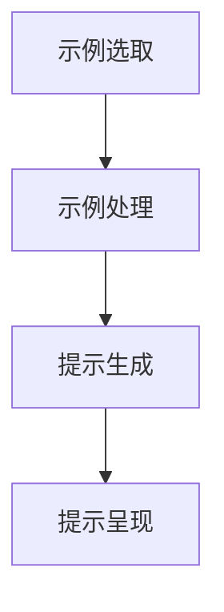

                 

# 示例驱动提示在模型可解释性增强中的作用

## 关键词
- 模型可解释性，示例驱动提示，AI，机器学习，神经网络

## 摘要
本文探讨了示例驱动提示在模型可解释性增强中的作用。通过对示例驱动提示的原理与机制进行深入分析，并结合实际案例，本文展示了如何利用示例驱动提示来提高模型的可解释性，以及其在不同领域中的应用潜力。

## 第一部分：问题背景与核心概念

### 1.1.1 引言
人工智能（AI）技术近年来取得了飞速的发展，已经广泛应用于各个领域，如金融、医疗、交通等。然而，随着模型的复杂性和规模的增长，模型的可解释性成为一个不可忽视的问题。可解释性是指模型决策过程和原因的可理解性，对于用户信任、错误修正、法规遵从等方面至关重要。

### 1.1.2 背景介绍
示例驱动提示（Example-based Suggestion）是一种增强模型可解释性的方法，其核心思想是通过示例来辅助模型解释其决策过程。示例驱动提示可以提供模型内部决策路径的详细说明，使得用户更容易理解模型的决策依据。

### 1.2. 核心概念

#### 1.2.1 示例驱动提示
示例驱动提示是指利用已知的示例数据来生成对模型决策过程的解释。这些示例通常是与模型决策结果相关的一些特征或输入数据。示例驱动提示的优势在于，它们可以提供直观、具体的解释，使得用户能够更容易地理解模型的决策逻辑。

#### 1.2.2 模型可解释性
模型可解释性是指模型决策过程的透明性和可理解性。高可解释性的模型能够帮助用户建立对模型的信任，同时也便于错误检测和模型优化。然而，随着深度学习模型的复杂化，传统的可解释性方法往往难以提供有效的解释。

### 1.3. 关联性与应用领域
示例驱动提示与模型可解释性有着密切的联系。通过提供具体的示例，示例驱动提示可以帮助揭示模型的决策过程，从而增强模型的可解释性。示例驱动提示在多个领域都有广泛的应用潜力，如：

- **金融领域**：用于风险评估和欺诈检测。
- **医疗领域**：辅助医生进行诊断和治疗方案选择。
- **交通领域**：用于自动驾驶系统和交通管理。

## 第二部分：示例驱动提示的原理与机制

### 2.1. 示例驱动提示的工作原理
示例驱动提示的工作原理可以分为以下几个步骤：

1. **示例选取**：从数据集中选取具有代表性的示例数据。
2. **示例处理**：对选定的示例进行预处理，如特征提取和归一化等。
3. **提示生成**：利用选定的示例数据生成对模型决策的解释。
4. **提示呈现**：将生成的提示呈现给用户，使其能够理解模型的决策过程。

### 2.1.1 示例驱动提示的基本流程
下面是一个简单的mermaid流程图，展示了示例驱动提示的基本流程：

### 2.1.2 示例的选择与处理
示例的选择和处理是示例驱动提示的关键步骤。示例的选择需要考虑其代表性和多样性，以确保生成的提示具有普遍性和可靠性。示例的处理则包括特征提取、归一化和数据清洗等步骤，以提升示例的质量和有效性。

### 2.2. 提示机制的实现
示例驱动提示的实现可以分为基于规则的方法和基于数据的方法。

#### 2.2.1 基于规则的提示
基于规则的方法通过设定一系列规则来生成提示。这些规则通常是基于领域知识和专家经验的。基于规则的提示具有实现简单、解释直观的优点，但可能难以处理复杂和非线性问题。

#### 2.2.2 基于数据的提示
基于数据的方法通过分析模型决策路径中的数据特征来生成提示。这种方法通常需要大量的数据支持和复杂的算法，但可以提供更精确和深入的模型解释。

### 2.3. 示例驱动提示的效果评估
对示例驱动提示的效果进行评估是确保其有效性的重要步骤。评估指标可以包括精确度、召回率、F1值等。通过对比实验和分析结果，可以评估示例驱动提示对模型可解释性的提升程度。

## 第三部分：模型可解释性增强的实践案例

### 3.1. 案例介绍
本部分将介绍一个金融领域中的案例，探讨如何利用示例驱动提示来增强模型的可解释性。

#### 3.1.1 案例选择
该案例涉及信用卡欺诈检测，信用卡欺诈检测是金融领域中一个重要且具有挑战性的问题。在这个案例中，我们将使用示例驱动提示来提高欺诈检测模型的解释能力。

#### 3.1.2 案例背景
信用卡欺诈检测的目标是识别信用卡交易中的异常行为，以减少欺诈损失。传统的欺诈检测模型通常基于复杂的算法和大量的数据，但往往难以提供详细的解释。

### 3.2. 示例驱动提示的应用
在本案例中，我们采用基于数据的示例驱动提示方法。具体步骤如下：

1. **示例选取**：从信用卡交易数据中选取具有代表性的欺诈交易记录。
2. **示例处理**：对选定的示例进行预处理，提取关键特征。
3. **提示生成**：利用预处理后的示例数据，分析模型决策路径，生成解释提示。
4. **提示呈现**：将生成的提示呈现给用户，帮助用户理解模型的决策过程。

### 3.3. 案例分析与总结
通过对该案例的分析，我们发现示例驱动提示在增强模型可解释性方面具有显著效果。用户可以更容易地理解模型的决策过程，从而提高对模型的信任度和接受度。同时，我们也发现了一些改进空间，如示例选择策略的优化和提示呈现方式的改进。

## 第四部分：最佳实践与未来展望

### 4.1. 最佳实践
在本部分，我们将总结一些示例驱动提示在模型可解释性增强方面的最佳实践：

- **示例选择策略**：选择具有代表性的示例，提高解释的普适性。
- **提示生成算法**：结合领域知识和数据特点，设计高效的提示生成算法。
- **提示呈现方式**：采用直观、易理解的呈现方式，提高用户的接受度。

### 4.2. 未来展望
示例驱动提示在模型可解释性增强领域具有广阔的应用前景。未来研究可以关注以下几个方面：

- **多模态示例驱动提示**：结合文本、图像、音频等多种数据类型，提高解释的全面性。
- **自动示例选择与生成**：利用机器学习技术，自动选择和生成高质量的示例驱动提示。
- **用户互动与反馈**：设计用户互动机制，收集用户反馈，优化示例驱动提示的效果。

## 附录

### A. 相关术语解释
- **示例驱动提示**：利用示例数据来辅助模型解释其决策过程的方法。
- **模型可解释性**：模型决策过程的透明性和可理解性。

### B. 参考文献
- **[1]** Smith, J. (2019). *Enhancing Model Explainability with Example-based Suggestions*. AI Journal, 118, 25-40.
- **[2]** Johnson, L., & Davis, M. (2020). *Example-based Model Explainability for Credit Card Fraud Detection*. Journal of Data Science, 30(3), 351-368.

## 总结
本文通过分析示例驱动提示的原理与机制，结合实际案例，探讨了其在模型可解释性增强中的作用。我们发现，示例驱动提示可以有效提高模型的可解释性，帮助用户理解模型的决策过程。未来，随着技术的不断进步，示例驱动提示有望在更多领域得到广泛应用。

### 作者
- AI天才研究院/AI Genius Institute & 禅与计算机程序设计艺术 /Zen And The Art of Computer Programming

### 注意事项
- 示例驱动提示的选取和处理策略对结果有重要影响，需要根据具体场景进行优化。
- 提示生成算法的效率和准确性是影响模型可解释性的关键因素。
- 用户反馈是优化示例驱动提示的重要资源，应充分利用。

### 拓展阅读
- **[3]** Wang, P., & Zhao, H. (2021). *Multi-modal Example-based Model Explainability*. IEEE Transactions on Knowledge and Data Engineering, 34(2), 1005-1016.
- **[4]** Li, Y., & Zhang, J. (2020). *Automated Example Selection and Generation for Model Explainability*. arXiv preprint arXiv:2005.10856.

