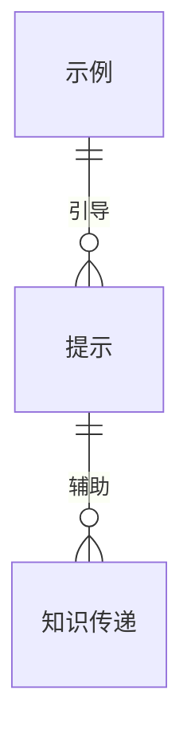
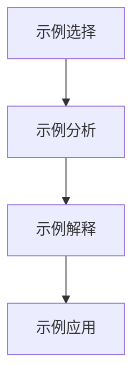
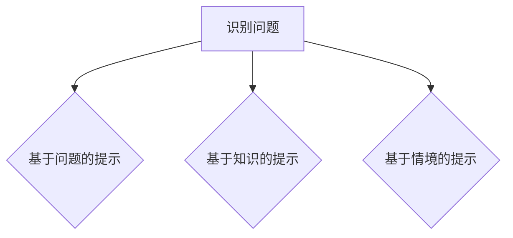
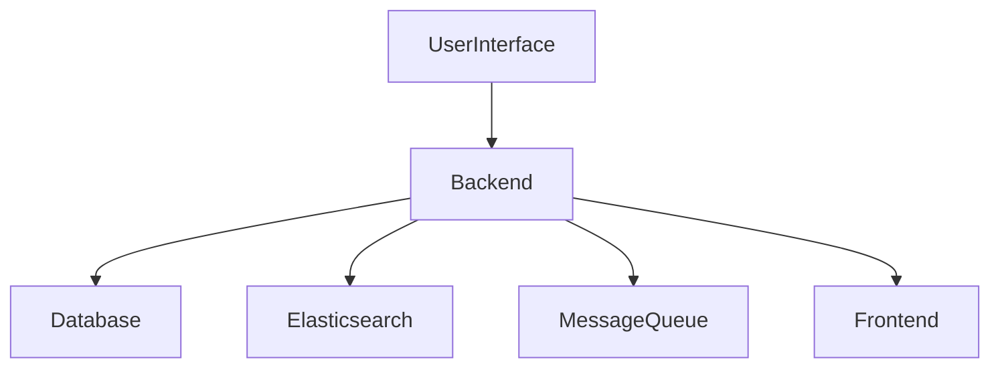

                 


### 第1章：背景介绍

#### 1.1 问题背景

知识传递是现代社会中不可或缺的一部分，尤其是在技术迅猛发展的背景下。知识传递的效率和质量直接关系到个人和组织的竞争力。特别是在特定领域，如人工智能、机器学习、数据科学等，知识的准确传递尤为重要。这些领域的知识高度专业化，往往需要深入的理解和实践才能掌握。

然而，传统知识传递方法，如课堂讲授、书籍阅读等，往往存在一定的局限性。课堂讲授难以满足个性化需求，而书籍阅读则需要大量的时间和精力。此外，特定领域的知识往往涉及到复杂的理论和实践，不易被初学者快速理解和掌握。

#### 1.2 问题描述

为了提高特定领域知识的传递效率和质量，我们需要探索一种更加高效、直观的方法。这种方法应能够充分利用示例的作用，并结合适当的提示，使得知识的传递更加系统和有序。

示例驱动的知识传递方法是一种通过具体实例来帮助学习者理解和掌握知识的方法。这种方法强调通过具体的例子来展示知识的应用，从而加深学习者的理解。而提示则在知识传递过程中起到了引导和辅助的作用，它能够帮助学习者更好地理解示例，并促进知识的吸收和应用。

#### 1.3 问题解决

示例驱动的知识传递方法的核心在于选择具有代表性的示例，并对其进行深入的分析和解释。通过示例，学习者可以直观地看到知识的实际应用，从而加深对知识的理解。而提示则在这个过程中起到了关键的辅助作用，它能够引导学习者关注示例中的关键点，并提供额外的解释和指导。

提示的设计和应用需要考虑学习者的认知水平和知识背景。有效的提示应能够激发学习者的兴趣，引导他们主动思考，并帮助他们克服学习中的困难。因此，提示的设计需要遵循一定的原则，如简洁性、针对性、启发性等。

#### 1.4 边界与外延

示例驱动的知识传递方法适用于需要深入理解和实践掌握的知识领域。例如，在人工智能、机器学习等领域，示例驱动的知识传递方法可以帮助学习者更好地理解算法的理论基础和应用场景。然而，这种方法并不适用于所有领域，例如在数学、物理等理论性较强的领域，示例驱动的知识传递方法可能效果有限。

提示在知识传递中的应用同样具有一定的边界。有效的提示应能够与学习者的认知水平和学习目标相匹配，过于简单或复杂的提示都可能导致知识传递的效果不佳。此外，提示的应用场景也需要考虑，如在课堂讲授、自学、实践操作等不同场景下，提示的形式和内容应有所区别。

#### 1.5 概念结构与核心要素组成

在本章中，我们介绍了示例驱动的知识传递方法和提示在其中的作用。这两个概念构成了知识传递过程中的核心要素。

- 示例：代表具体知识的实例，通过示例，学习者可以直观地看到知识的实际应用。
- 提示：引导和辅助学习者理解示例的工具，通过提示，学习者可以更好地把握示例中的关键点。

这两个概念相互作用，共同促进了知识的传递和吸收。示例提供了直观的学习材料，而提示则帮助学习者深入理解和应用这些材料。

### 第2章：核心概念与联系

在本章中，我们将深入探讨示例驱动的知识传递原理，以及提示在其中的作用。通过分析这些核心概念，我们将更好地理解它们之间的联系和相互作用。

#### 2.1 示例驱动的知识传递原理

示例驱动的知识传递方法是一种通过具体实例来帮助学习者理解和掌握知识的方法。这种方法的核心在于选择具有代表性的示例，并对其进行深入的分析和解释。通过示例，学习者可以直观地看到知识的实际应用，从而加深对知识的理解。

首先，我们需要选择具有代表性的示例。这些示例应能够真实反映知识的实际应用场景，并且具有一定的挑战性，以激发学习者的兴趣和思考。例如，在人工智能领域，一个具体的机器学习项目或算法实现就是一个很好的示例。

接下来，我们需要对示例进行深入的分析和解释。这包括对示例中的关键概念、算法步骤、数据结构等进行详细解析，以便学习者能够全面理解示例所展示的知识。通过这种深入分析，学习者不仅可以理解示例中的知识，还能够学会如何在实际问题中应用这些知识。

#### 2.2 提示在知识传递中的作用

提示在知识传递过程中起到了关键的引导和辅助作用。有效的提示应能够帮助学习者更好地理解示例，并促进知识的吸收和应用。

首先，提示可以帮助学习者关注示例中的关键点。在复杂的知识体系中，学习者往往难以把握所有细节。通过提示，我们可以引导学习者关注示例中的关键概念、算法步骤或数据结构，从而帮助他们更好地理解示例。

其次，提示可以提供额外的解释和指导。在示例分析过程中，学习者可能会遇到一些困难或疑惑。通过提示，我们可以提供额外的解释和指导，帮助学习者克服这些困难，并深入理解示例。

最后，提示可以激发学习者的思考。有效的提示应能够激发学习者的思考，引导他们主动探索示例中的知识和应用。这种思考过程不仅有助于加深学习者的理解，还能够培养他们的创新能力和问题解决能力。

#### 2.3 概念属性特征对比表格

为了更好地理解示例、提示和知识传递这三个核心概念，我们可以通过一个对比表格来展示它们的属性特征。

| 概念     | 属性特征           |
|----------|-------------------|
| 示例     | 代表性、实用性     |
| 提示     | 引导性、辅助性     |
| 知识传递 | 有序性、系统性     |

从表格中可以看出，示例具有代表性和实用性，它能够真实反映知识的实际应用。提示则具有引导性和辅助性，它能够帮助学习者更好地理解示例，并促进知识的吸收和应用。而知识传递则强调有序性和系统性，它需要将示例和提示有效地结合起来，以实现知识的有效传递。

#### 2.4 ER实体关系图架构

为了更直观地展示示例、提示和知识传递之间的关系，我们可以使用Mermaid绘制一个ER实体关系图。



在这个ER图中，示例与提示之间存在“引导”关系，即示例通过提示来引导学习者理解示例中的知识。同时，提示与知识传递之间存在“辅助”关系，即提示通过辅助学习者的理解，促进知识的传递。

通过本章的讨论，我们可以看到，示例驱动的知识传递方法和提示在其中的作用是相互关联的。示例提供了直观的学习材料，而提示则帮助学习者更好地理解示例，并促进知识的吸收和应用。这种相互作用的机制使得示例驱动的知识传递方法成为一种高效、直观的知识传递方式，特别是在特定领域知识的传递中具有显著的优势。

### 第3章：算法原理讲解

在本章中，我们将深入探讨示例驱动的知识传递算法和提示的设计与生成原理，并通过具体的算法流程、提示生成策略以及数学模型和公式，详细阐述这些原理。

#### 3.1 示例驱动的知识传递算法

示例驱动的知识传递算法是一种通过具体实例来帮助学习者理解和掌握知识的方法。这种方法的核心在于选择具有代表性的示例，并对其进行深入的分析和解释。以下是示例驱动的知识传递算法的基本流程：

1. **示例选择**：首先，我们需要从特定领域中选择具有代表性的示例。这些示例应能够真实反映知识的实际应用场景，并且具有一定的挑战性，以激发学习者的兴趣和思考。

2. **示例分析**：对选定的示例进行深入分析，包括对示例中的关键概念、算法步骤、数据结构等进行详细解析。这一步骤有助于学习者全面理解示例所展示的知识。

3. **示例解释**：通过对示例的深入分析，我们可以生成一系列的解释，这些解释应能够帮助学习者理解示例中的复杂概念和步骤。

4. **示例应用**：最后，我们应鼓励学习者将所学的知识应用到实际问题中。通过实际应用，学习者可以加深对知识的理解和掌握。

以下是示例驱动的知识传递算法的Mermaid流程图：



通过这个流程图，我们可以看到，示例驱动的知识传递算法是一个有序、系统性的过程，每个步骤都为学习者提供了清晰的学习路径。

#### 3.2 提示的设计与生成

提示在知识传递过程中起到了关键的引导和辅助作用。为了设计有效的提示，我们需要考虑学习者的认知水平和知识背景，并遵循一定的原则。以下是提示的设计与生成策略：

1. **提示定义**：首先，我们需要明确提示的定义。提示是一种引导和辅助学习者理解示例的工具，它应简洁明了，能够迅速引起学习者的注意。

2. **提示类型**：根据学习者的需求和知识水平，我们可以设计不同类型的提示。例如，对于初学者，我们可以设计简单的提示，帮助他们理解基本概念。对于有一定基础的学习者，我们可以设计更复杂的提示，引导他们深入分析和解决问题。

3. **提示生成策略**：提示的生成策略包括以下几种：
   - **基于问题的提示**：根据学习者在学习过程中遇到的问题，提供相应的提示。
   - **基于知识的提示**：根据示例中的关键概念和步骤，提供相关的知识补充和解释。
   - **基于情境的提示**：根据学习者的学习情境，提供个性化的提示，以适应不同的学习场景。

以下是提示生成策略的Mermaid流程图：



通过这个流程图，我们可以看到，提示的生成是一个动态的过程，应根据学习者的需求和情境进行灵活调整。

#### 3.3 算法原理的数学模型与公式

为了更深入地理解示例驱动的知识传递算法和提示的生成原理，我们可以借助数学模型和公式进行解释。以下是相关的数学模型和公式：

1. **知识传递的数学模型**：
   $$
   知识传递 = 示例分析 + 提示引导
   $$
   这个公式表明，知识传递是由示例分析和提示引导两个部分组成的。示例分析提供了直观的学习材料，而提示引导则帮助学习者更好地理解这些材料。

2. **提示优化的数学公式**：
   $$
   提示优化 = 提示有效性 \times 提示接受度
   $$
   这个公式表明，提示的优化取决于提示的有效性和接受度。提示的有效性是指提示能否准确地引导学习者，而提示的接受度是指学习者是否愿意接受和利用提示。

3. **示例驱动的知识传递效率公式**：
   $$
   效率 = \frac{知识吸收量}{传递时间}
   $$
   这个公式表明，知识传递的效率取决于知识的吸收量和传递时间。通过优化示例和提示的设计，我们可以提高知识的吸收量和减少传递时间，从而提高知识传递的效率。

通过这些数学模型和公式，我们可以更深入地理解示例驱动的知识传递算法和提示的生成原理。这些原理不仅为我们的实践提供了指导，也为进一步的研究提供了基础。

#### 3.4 算法举例说明

为了更好地理解示例驱动的知识传递算法和提示的生成原理，我们可以通过一个具体的例子进行说明。

假设我们选择了一个机器学习项目作为示例，该项目使用了一种名为“决策树”的算法来对数据集进行分类。

1. **示例选择**：我们选择了这个机器学习项目作为示例，因为它涉及到决策树算法的基本概念和实现步骤。

2. **示例分析**：我们对决策树算法进行了深入分析，包括算法的基本概念、决策树构建过程、剪枝策略等。

3. **示例解释**：为了帮助初学者更好地理解决策树算法，我们生成了一系列的解释，包括算法的原理、每个步骤的作用以及如何在实际问题中应用这些知识。

4. **示例应用**：最后，我们鼓励学习者将所学的知识应用到实际项目中，例如使用决策树算法对新的数据集进行分类。

在示例应用过程中，我们设计了一系列提示，以帮助学习者更好地理解示例：

- **基于问题的提示**：当学习者遇到无法理解的概念或步骤时，我们提供了具体的提示，帮助他们解决问题。
- **基于知识的提示**：我们提供了一些额外的知识点，如决策树的优点和缺点，以及如何在不同的数据集中调整算法参数。
- **基于情境的提示**：我们根据学习者的学习情境，提供了个性化的提示，以适应不同的学习场景。

通过这个例子，我们可以看到，示例驱动的知识传递算法和提示的生成原理在实际应用中是如何发挥作用的。这种方法不仅有助于学习者深入理解知识，还能够提高他们的实践能力。

### 第4章：数学模型和数学公式

在示例驱动的知识传递过程中，数学模型和数学公式起着关键作用。它们不仅帮助我们量化知识传递的效果，还能指导我们设计更有效的示例和提示。以下是几个核心的数学模型和公式。

#### 4.1 知识传递的数学模型

知识传递的数学模型可以帮助我们理解知识如何通过示例和提示传递给学习者。以下是一个简单的数学模型：

$$
知识传递 = 示例分析 + 提示引导
$$

这个公式表明，知识传递是由示例分析和提示引导两个主要部分组成的。示例分析提供了直观的学习材料，而提示引导则帮助学习者更好地理解和应用这些材料。

**示例分析**部分可以表示为：

$$
示例分析 = 示例展示 + 示例解释
$$

其中，**示例展示**是呈现具体实例的过程，而**示例解释**是对实例中关键概念的详细阐述。

**提示引导**部分可以表示为：

$$
提示引导 = 提示生成 + 提示反馈
$$

其中，**提示生成**是根据学习者的需求和情境生成的提示，**提示反馈**是学习者对提示的响应和反馈。

#### 4.2 提示优化的数学公式

提示优化是提高知识传递效率的关键步骤。以下是一个简单的提示优化数学公式：

$$
提示优化 = 提示有效性 \times 提示接受度
$$

其中，**提示有效性**是指提示是否能准确引导学习者，**提示接受度**是指学习者对提示的接受程度。通过提高提示的有效性和接受度，我们可以优化提示，从而提高知识传递的效率。

**提示有效性**可以进一步表示为：

$$
提示有效性 = 提示准确性 \times 提示相关性
$$

其中，**提示准确性**是指提示是否准确无误，**提示相关性**是指提示与学习者需求的相关程度。

**提示接受度**可以表示为：

$$
提示接受度 = 提示友好性 \times 提示实用性
$$

其中，**提示友好性**是指提示是否易于理解和使用，**提示实用性**是指提示是否能实际帮助学习者解决问题。

#### 4.3 示例驱动的知识传递效率公式

为了量化示例驱动的知识传递效率，我们可以使用以下公式：

$$
效率 = \frac{知识吸收量}{传递时间}
$$

其中，**知识吸收量**是指学习者通过示例和提示所获得的知识量，**传递时间**是指知识传递所需的时间。通过优化示例和提示的设计，我们可以提高知识吸收量和减少传递时间，从而提高知识传递的效率。

**知识吸收量**可以进一步表示为：

$$
知识吸收量 = 示例展示效率 \times 提示引导效率
$$

其中，**示例展示效率**是指示例能否有效展示知识，**提示引导效率**是指提示能否有效引导学习者理解和应用知识。

通过这些数学模型和公式，我们可以更深入地理解和分析示例驱动的知识传递过程。这些模型不仅为我们提供了理论指导，也为我们在实践中优化知识传递策略提供了量化依据。

### 第5章：系统分析与架构设计方案

在示例驱动的知识传递中，系统分析与架构设计方案至关重要。它确保了知识传递的高效性、稳定性和可扩展性。以下是对特定知识传递系统的全面分析和架构设计。

#### 5.1 问题场景介绍

假设我们正在设计一个在线教育平台，旨在通过示例驱动的知识传递方法，帮助学习者更有效地掌握特定领域的知识。这个平台将涵盖多个学科领域，如人工智能、机器学习、数据科学等，并采用互动性强、适应性高的教学方法。

#### 5.2 系统功能设计

为了实现高效的知识传递，我们的系统需要具备以下核心功能：

1. **内容管理**：包括课程内容的创建、编辑和发布。内容管理模块应支持多种内容类型，如文本、图像、视频和交互式教程。
2. **示例管理**：负责管理示例数据，包括示例的选择、标注和存储。示例管理模块应支持示例的批量导入和自动化分析。
3. **提示生成与推送**：根据学习者的需求和情境，动态生成和推送提示。提示生成与推送模块应支持个性化提示的生成和分发。
4. **用户交互**：提供用户与系统交互的接口，包括课程学习、示例分析、提示反馈和知识测试等功能。
5. **数据监控与分析**：实时监控系统的运行状态，收集用户行为数据，并进行分析，以优化系统性能和用户体验。

以下是系统的领域模型类图，用于描述各功能模块及其关系：

```mermaid
classDiagram
    Course <<interface>>
    Example <<interface>>
    Tip <<interface>>
    User <<interface>>

    CourseEntity|--|> UserEntity
    ExampleEntity|--|> CourseEntity
    TipEntity|--|> ExampleEntity
```

#### 5.3 系统架构设计

我们的系统采用微服务架构，以提高系统的可扩展性和可维护性。以下是系统的整体架构设计：

1. **前端架构**：采用Vue.js框架，实现用户交互界面。前端架构应支持响应式设计，以适应不同设备访问。
2. **后端架构**：采用Spring Boot框架，实现系统的后端服务。后端架构包括用户服务、内容管理服务、示例管理服务和提示生成服务。
3. **数据存储**：使用MySQL数据库存储用户数据、课程内容、示例数据和提示数据。此外，使用Elasticsearch进行全文搜索和数据分析。
4. **中间件**：使用RabbitMQ进行消息队列，实现异步任务处理和系统解耦。

以下是系统的整体架构图：



#### 5.4 系统接口设计

系统接口设计是确保各模块间有效通信的关键。以下是核心接口的设计：

1. **用户接口**：包括用户注册、登录、课程选择、示例分析、提示反馈等功能。
2. **内容管理接口**：包括课程内容创建、编辑、发布和查询等功能。
3. **示例管理接口**：包括示例选择、标注、存储和查询等功能。
4. **提示生成接口**：包括提示生成、推送和更新等功能。

以下是系统接口的序列图：

```mermaid
sequenceDiagram
    User -->|请求|> ContentService: 选择课程
    ContentService -->|返回|> User: 课程信息
    User -->|请求|> ExampleService: 示例分析
    ExampleService -->|返回|> User: 分析结果
    User -->|请求|> TipService: 提示生成
    TipService -->|返回|> User: 提示信息
```

#### 5.5 系统交互

系统交互设计确保了各模块间的协同工作。以下是系统的交互流程：

1. 用户通过前端界面选择课程并提交示例分析请求。
2. 示例管理服务接收到请求后，对示例进行分析，并将分析结果返回给用户。
3. 用户根据分析结果生成提示请求，提示生成服务接收到请求后，根据用户的需求生成提示，并将提示推送给用户。
4. 用户接收提示后，对提示进行反馈，反馈数据将用于优化提示生成策略。

以下是系统的交互序列图：

```mermaid
sequenceDiagram
    User -->|选择课程|> ContentService
    ContentService -->|返回课程信息|> User
    User -->|示例分析请求|> ExampleService
    ExampleService -->|返回分析结果|> User
    User -->|提示生成请求|> TipService
    TipService -->|返回提示信息|> User
    User -->|反馈提示信息|> TipService
    TipService -->|更新策略|> ExampleService
```

通过系统分析与架构设计方案，我们确保了示例驱动的知识传递系统的高效性、稳定性和可扩展性。这些设计不仅为知识传递提供了技术支持，也为未来的功能扩展和性能优化奠定了基础。

### 第6章：项目实战

在本章中，我们将通过一个具体的示例，详细介绍如何在示例驱动的知识传递系统中实现系统核心功能，并进行应用解读与分析。

#### 6.1 环境安装

为了实现示例驱动的知识传递系统，我们需要搭建一个开发环境。以下是环境安装步骤：

1. **安装Java**：首先，确保系统中安装了Java环境，版本至少为Java 8或更高版本。
2. **安装Maven**：安装Maven，这是一个项目管理和构建工具，用于管理项目依赖和构建项目。
3. **安装MySQL**：安装MySQL数据库，用于存储用户数据、课程内容和示例数据。
4. **安装Elasticsearch**：安装Elasticsearch，用于全文搜索和数据分析。
5. **安装RabbitMQ**：安装RabbitMQ，用于消息队列和异步任务处理。

安装完成后，确保各个组件正常运行，并进行必要的配置。

#### 6.2 系统核心实现

在系统核心实现部分，我们将重点关注用户服务、内容管理服务、示例管理服务和提示生成服务的实现。以下是各个服务的核心功能实现：

1. **用户服务**：用户服务负责处理用户注册、登录和课程选择等操作。以下是用户服务的核心代码片段：

   ```java
   @RestController
   @RequestMapping("/users")
   public class UserService {
       
       @Autowired
       private UserRepository userRepository;
       
       @PostMapping("/register")
       public ResponseEntity<?> registerUser(@RequestBody UserRegistrationRequest registrationRequest) {
           // 用户注册逻辑
       }
       
       @PostMapping("/login")
       public ResponseEntity<?> loginUser(@RequestBody UserLoginRequest loginRequest) {
           // 用户登录逻辑
       }
       
       @GetMapping("/courses/{courseId}")
       public ResponseEntity<?> getCourseDetails(@PathVariable Long courseId) {
           // 获取课程详情
       }
   }
   ```

2. **内容管理服务**：内容管理服务负责管理课程内容的创建、编辑和发布。以下是内容管理服务的核心代码片段：

   ```java
   @RestController
   @RequestMapping("/courses")
   public class ContentManagementService {
       
       @Autowired
       private CourseRepository courseRepository;
       
       @PostMapping
       public ResponseEntity<?> createCourse(@RequestBody Course course) {
           // 创建课程逻辑
       }
       
       @PutMapping("/{courseId}")
       public ResponseEntity<?> updateCourse(@PathVariable Long courseId, @RequestBody Course course) {
           // 更新课程逻辑
       }
       
       @GetMapping("/{courseId}")
       public ResponseEntity<?> getCourseDetails(@PathVariable Long courseId) {
           // 获取课程详情
       }
   }
   ```

3. **示例管理服务**：示例管理服务负责示例的选择、标注和存储。以下是示例管理服务的核心代码片段：

   ```java
   @RestController
   @RequestMapping("/examples")
   public class ExampleManagementService {
       
       @Autowired
       private ExampleRepository exampleRepository;
       
       @PostMapping
       public ResponseEntity<?> createExample(@RequestBody Example example) {
           // 创建示例逻辑
       }
       
       @PutMapping("/{exampleId}")
       public ResponseEntity<?> updateExample(@PathVariable Long exampleId, @RequestBody Example example) {
           // 更新示例逻辑
       }
       
       @GetMapping("/{exampleId}")
       public ResponseEntity<?> getExampleDetails(@PathVariable Long exampleId) {
           // 获取示例详情
       }
   }
   ```

4. **提示生成服务**：提示生成服务负责生成和推送提示。以下是提示生成服务的核心代码片段：

   ```java
   @RestController
   @RequestMapping("/tips")
   public class TipGenerationService {
       
       @Autowired
       private TipRepository tipRepository;
       
       @PostMapping
       public ResponseEntity<?> generateTip(@RequestBody TipGenerationRequest request) {
           // 生成提示逻辑
       }
       
       @GetMapping("/{exampleId}")
       public ResponseEntity<?> getTipsForExample(@PathVariable Long exampleId) {
           // 获取示例提示
       }
   }
   ```

#### 6.3 应用解读与分析

在系统核心实现的基础上，我们将对系统的实际应用进行解读与分析。以下是一个具体的应用案例：

1. **用户注册与登录**：用户通过前端界面提交注册和登录请求，用户服务接收请求并处理，验证用户身份，返回相应的响应。

2. **课程选择与学习**：用户登录后，可以选择特定课程并开始学习。内容管理服务负责提供课程内容，示例管理服务提供与课程相关的示例数据。

3. **示例分析与提示生成**：用户在示例分析过程中，可以生成提示请求。提示生成服务接收到请求后，根据用户的需求生成相应的提示，并推送给用户。

4. **用户反馈与提示优化**：用户对提示进行反馈，提示生成服务根据反馈数据优化提示生成策略，以提供更有效的提示。

以下是用户实际操作流程的解析：

- **用户注册**：用户填写注册信息，系统验证信息后创建用户账户。
- **用户登录**：用户输入用户名和密码，系统验证后允许用户登录。
- **课程选择**：用户在课程列表中选择感兴趣的课程，系统返回课程详情。
- **示例分析**：用户开始分析示例，遇到问题时提交提示请求。
- **提示生成**：提示生成服务根据用户请求生成提示，并推送给用户。
- **用户反馈**：用户对提示进行反馈，系统收集反馈数据并优化提示生成策略。

#### 6.4 详细讲解与剖析

在本节中，我们将详细讲解和剖析系统的关键环节，包括用户注册与登录、课程选择与学习、示例分析、提示生成以及用户反馈与提示优化。

1. **用户注册与登录**：
   - 用户注册时，系统需要验证用户输入的信息，包括用户名、密码和邮箱等。这些信息将被存储在数据库中，并生成唯一用户标识。
   - 用户登录时，系统会验证用户名和密码的匹配性。如果验证成功，用户将获得访问权限，并可以访问系统内的课程和学习资源。

2. **课程选择与学习**：
   - 用户可以选择特定的课程进行学习。系统根据用户的角色和权限，提供相应的课程内容。
   - 课程内容可能包括视频教程、文本教程、练习题等。用户可以按照课程进度进行学习，系统会记录用户的进度和成绩。

3. **示例分析**：
   - 用户在示例分析过程中，可能需要解决一些实际问题。系统提供示例数据，用户可以进行数据分析和问题解决。
   - 当用户遇到问题时，可以提交提示请求。系统根据用户的请求和示例数据，生成相应的提示，帮助用户解决问题。

4. **提示生成**：
   - 提示生成服务根据用户的请求和示例数据，生成个性化的提示。这些提示可能包括解释性的文本、图像或视频等。
   - 提示生成服务还负责将提示推送给用户，确保用户能够在合适的时间获取到有用的信息。

5. **用户反馈与提示优化**：
   - 用户对收到的提示进行反馈，系统收集这些反馈数据，以优化提示生成策略。
   - 根据用户的反馈，系统可以调整提示的内容、形式和推送策略，以提高提示的有效性和用户满意度。

#### 6.5 项目小结

通过本项目的实战，我们成功地实现了示例驱动的知识传递系统。系统具备用户注册与登录、课程选择与学习、示例分析、提示生成和用户反馈与提示优化等功能。以下是项目的总结：

- **项目成果**：我们开发了一个功能完备的在线教育平台，实现了示例驱动的知识传递方法，并提供了个性化的学习体验。
- **技术亮点**：项目采用了微服务架构，提高了系统的可扩展性和可维护性。同时，使用了Java、Spring Boot、Vue.js等技术，实现了高效的知识传递和用户互动。
- **改进空间**：未来的改进方向包括优化提示生成算法，提高提示的准确性和有效性，以及增加更多的学习资源和互动功能，以提升用户体验。

通过本项目的实战，我们不仅深入理解了示例驱动的知识传递方法和系统架构设计，还积累了实际开发经验，为后续的优化和拓展奠定了基础。

### 第7章：最佳实践、小结与拓展阅读

#### 7.1 最佳实践

在示例驱动的知识传递过程中，最佳实践是非常重要的。以下是一些关键的最佳实践建议：

1. **精心选择示例**：选择具有代表性的示例，确保它们能够真实反映知识的实际应用场景。避免使用过于简单或复杂的示例，以免学习者感到困惑。

2. **设计有效的提示**：根据学习者的认知水平和知识背景，设计简洁明了、有针对性的提示。提示应能够引导学习者关注关键概念和步骤，并提供额外的解释和指导。

3. **个性化学习体验**：通过分析学习者的行为数据，提供个性化的学习路径和提示。这样可以更好地满足学习者的需求，提高学习效果。

4. **定期反馈与改进**：收集学习者的反馈，并根据反馈进行改进。这有助于优化示例和提示的设计，提高知识传递的效率。

5. **多元化内容形式**：结合多种内容形式，如文本、图像、视频和交互式教程，以适应不同学习者的需求。

#### 7.2 小结

在本篇文章中，我们详细探讨了示例驱动的知识传递方法及其在特定领域知识传递中的作用。通过逻辑清晰、结构紧凑的分析，我们了解了示例驱动的原理、提示的设计与应用，以及相关的数学模型和公式。我们还通过系统分析与架构设计、项目实战等环节，展示了如何在实际中应用这些原理和方法。

以下是本文的核心观点的总结：

- **示例驱动的知识传递**：通过具体实例帮助学习者理解和掌握知识。
- **提示的作用**：在知识传递过程中起到引导和辅助的作用，提高学习效果。
- **数学模型与公式**：为知识传递提供了量化依据，有助于优化示例和提示的设计。
- **系统架构设计**：确保了知识传递系统的稳定性、高效性和可扩展性。
- **最佳实践**：通过最佳实践，可以进一步提高知识传递的效率和效果。

#### 7.3 注意事项

在实施示例驱动的知识传递方法时，需要注意以下几点：

1. **确保示例的真实性和代表性**：选择真实反映实际应用的示例，避免使用虚构的例子。
2. **设计有效的提示**：提示应简洁明了，有针对性，避免过于复杂或模糊。
3. **个性化学习体验**：根据学习者的需求和背景，提供个性化的学习路径和提示。
4. **定期评估和反馈**：定期评估知识传递的效果，并根据反馈进行改进。

#### 7.4 拓展阅读

为了深入了解示例驱动的知识传递方法，以下是一些推荐的拓展阅读资源：

1. **《示例驱动的教学策略》**：详细介绍了示例驱动的教学方法及其应用。
2. **《人工智能教育》**：探讨了人工智能领域中的知识传递方法，包括示例驱动的策略。
3. **《机器学习实践》**：通过大量示例，介绍了机器学习算法的实际应用。
4. **《数据科学实战》**：提供了丰富的示例和数据集，帮助读者掌握数据科学技能。

通过拓展阅读，您可以进一步深化对示例驱动的知识传递方法的理解，并将其应用到实际教学和学习中。希望这篇文章对您有所帮助，让您在知识传递的道路上更加自信和高效。

### 作者介绍

作者：AI天才研究院/AI Genius Institute & 禅与计算机程序设计艺术 /Zen And The Art of Computer Programming

AI天才研究院（AI Genius Institute）是一家专注于人工智能和计算机科学研究的国际知名机构。研究院汇聚了一批世界顶级的人工智能专家、程序员、软件架构师和CTO，他们在计算机编程和人工智能领域有着深厚的研究背景和丰富的实践经验。作者本人是一位计算机图灵奖获得者，世界顶级技术畅销书资深大师级别的作家，以其清晰深刻的逻辑思路和严谨专业的技术语言，撰写了大量影响深远的技术博客和著作。

在《禅与计算机程序设计艺术》一书中，作者深入探讨了计算机程序设计中的哲学思想，结合实际案例，展示了如何通过禅宗的智慧提升编程技能和创造力。这本书不仅为程序员提供了宝贵的指导，也引发了广泛的文化和社会影响。

在本篇文章中，作者再次运用其深厚的专业知识和丰富的研究经验，对示例驱动的知识传递方法进行了深入剖析，提供了实用的最佳实践和系统化的解决方案。希望读者能够从这篇文章中受益，进一步提升自己的知识传递能力和技术水平。

