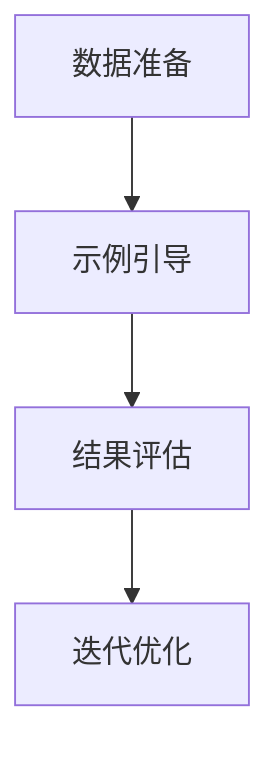
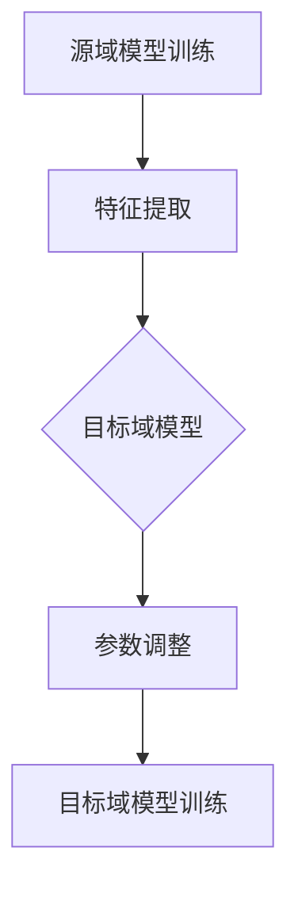
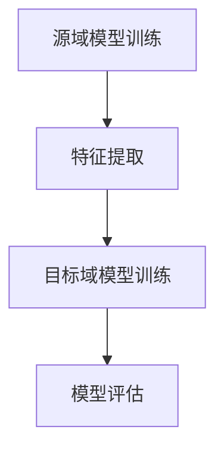
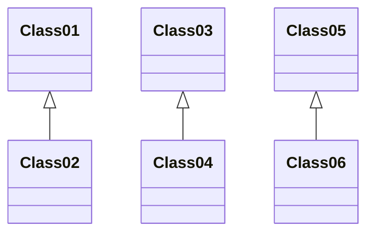
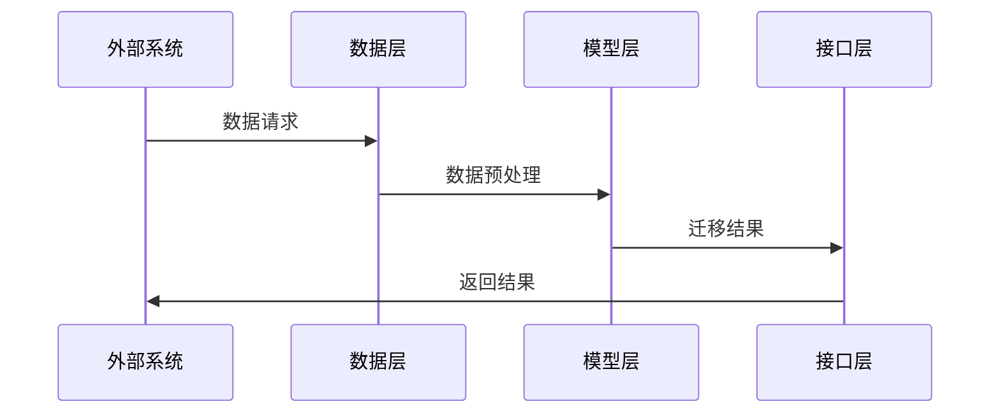
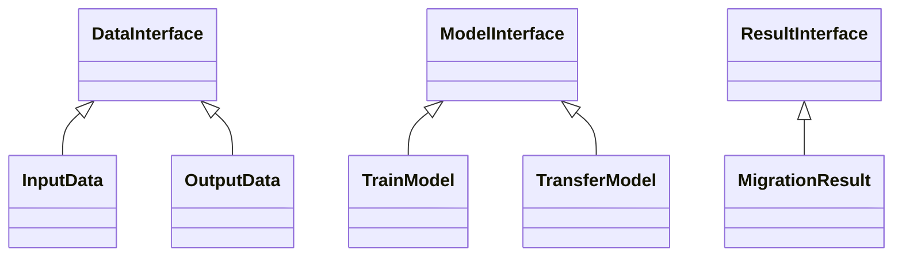
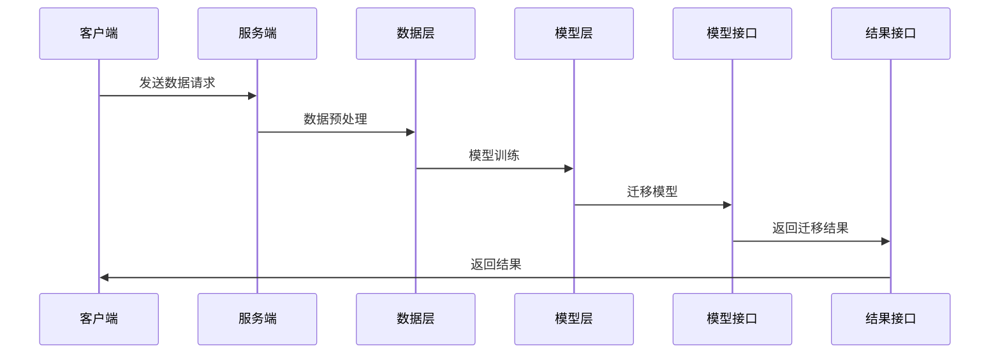

                 


# 示例驱动提示在跨模型迁移中的应用

## 关键词
- 示例驱动提示
- 跨模型迁移
- 迁移学习
- 算法实现
- 系统设计
- 项目实战

## 摘要
本文旨在探讨示例驱动提示在跨模型迁移中的应用。通过介绍跨模型迁移的概念、核心概念与联系，详细阐述跨模型迁移算法原理，设计系统架构，并通过实际项目实战，展示示例驱动提示在跨模型迁移中的有效性。本文旨在为研究人员和实践者提供一份系统、全面的技术指南。

### 目录大纲设计思路

设计《示例驱动提示在跨模型迁移中的应用》一书的目录大纲，需要遵循以下思路：

1. **背景介绍**：首先简要介绍跨模型迁移的概念、背景以及研究意义，使读者对全书内容有一个总体了解。

2. **核心概念与联系**：详细阐述跨模型迁移中的核心概念，如示例驱动提示、模型迁移策略、迁移学习等，并通过对比表格和ER实体关系图，帮助读者理解这些概念之间的关系。

3. **算法原理讲解**：使用Mermaid流程图和Python源代码，详细讲解跨模型迁移的算法原理，包括数学模型和公式，并通过通俗易懂的例子进行说明。

4. **系统分析与架构设计方案**：描述跨模型迁移的应用场景，介绍相关系统，并使用Mermaid类图、架构图、序列图等工具，设计系统的功能、架构和接口。

5. **项目实战**：通过实际案例，展示跨模型迁移的应用，详细分析项目实现过程，包括环境安装、核心代码实现、代码解读与分析等。

6. **最佳实践 tips、小结、注意事项、拓展阅读**：在每一章节的最后，提供实用的技巧、总结、注意事项以及拓展阅读，帮助读者深化理解并拓展知识。

### 目录大纲设计

#### 第一部分：跨模型迁移背景与核心概念

# 第1章：跨模型迁移概述

## 1.1 跨模型迁移的定义与背景

### 1.1.1 跨模型迁移的概念

### 1.1.2 跨模型迁移的背景

### 1.1.3 跨模型迁移的研究意义

## 1.2 核心概念与联系

### 1.2.1 示例驱动提示

### 1.2.2 模型迁移策略

### 1.2.3 迁移学习

### 1.2.4 概念属性特征对比表格

### 1.2.5 ER实体关系图

#### 第二部分：算法原理与实现

# 第2章：跨模型迁移算法原理

## 2.1 跨模型迁移算法概述

### 2.1.1 算法分类

### 2.1.2 算法选择依据

## 2.2 示例驱动提示机制

### 2.2.1 示例驱动提示原理

### 2.2.2 示例驱动提示的应用场景

### 2.2.3 示例驱动提示的Mermaid流程图

## 2.3 模型迁移策略

### 2.3.1 迁移策略概述

### 2.3.2 常见迁移策略对比

### 2.3.3 迁移策略的Mermaid流程图

## 2.4 迁移学习算法

### 2.4.1 迁移学习算法原理

### 2.4.2 迁移学习算法的应用

### 2.4.3 迁移学习算法的Mermaid流程图

## 2.5 跨模型迁移算法的数学模型与公式

### 2.5.1 数学模型介绍

### 2.5.2 公式推导

### 2.5.3 数学公式示例（使用latex格式）

#### 第三部分：系统设计与架构

# 第3章：跨模型迁移系统设计与实现

## 3.1 跨模型迁移应用场景分析

### 3.1.1 场景一：图像识别跨模型迁移

### 3.1.2 场景二：自然语言处理跨模型迁移

### 3.1.3 场景三：语音识别跨模型迁移

## 3.2 系统功能设计

### 3.2.1 系统功能概述

### 3.2.2 领域模型Mermaid类图

## 3.3 系统架构设计

### 3.3.1 系统架构概述

### 3.3.2 系统架构Mermaid架构图

## 3.4 系统接口设计与交互

### 3.4.1 系统接口设计

### 3.4.2 系统交互Mermaid序列图

#### 第四部分：项目实战与案例分析

# 第4章：跨模型迁移项目实战

## 4.1 项目环境搭建

### 4.1.1 环境要求

### 4.1.2 环境搭建步骤

## 4.2 系统核心实现

### 4.2.1 数据预处理

### 4.2.2 迁移学习模型训练

### 4.2.3 迁移学习模型评估

## 4.3 项目解析与分析

### 4.3.1 项目结构解析

### 4.3.2 代码解读与分析

### 4.3.3 案例分析

## 4.4 项目小结

### 4.4.1 项目总结

### 4.4.2 不足与改进方向

#### 第五部分：最佳实践与拓展

# 第5章：跨模型迁移最佳实践与拓展

## 5.1 最佳实践 tips

### 5.1.1 迁移策略选择建议

### 5.1.2 模型调优技巧

## 5.2 小结与注意事项

### 5.2.1 全书内容回顾

### 5.2.2 注意事项提醒

## 5.3 拓展阅读

### 5.3.1 相关书籍推荐

### 5.3.2 学术论文推荐

### 5.3.3 实践案例推荐

### 文章正文开始

#### 第1章：跨模型迁移概述

### 1.1 跨模型迁移的定义与背景

#### 跨模型迁移的概念

跨模型迁移（Cross-Model Transfer Learning）是一种迁移学习（Transfer Learning）的方法，它利用一个模型的知识来帮助另一个模型的训练。这种方法在深度学习领域中尤为重要，因为它可以减少训练数据的需求，提高模型在特定任务上的性能。

跨模型迁移的核心思想是，在源域（Source Domain）中训练一个模型，然后将这个模型的知识转移到目标域（Target Domain）中，以提升目标域模型的表现。源域和目标域可以是不同的数据集、不同的任务，甚至是不同的模型架构。

#### 跨模型迁移的背景

随着深度学习技术的快速发展，越来越多的复杂模型被应用于各种场景中。然而，这些模型往往需要大量的训练数据才能达到良好的性能。在实际应用中，获取大量的训练数据是非常困难的，有时甚至是不可能的。因此，跨模型迁移成为了解决这一问题的有效手段。

跨模型迁移不仅可以节省训练数据，还可以提高模型的泛化能力。通过跨模型迁移，模型可以在不同的任务和数据集之间共享知识，从而减少对特定数据的依赖。

#### 跨模型迁移的研究意义

跨模型迁移在以下几个方面具有重要的研究意义：

1. **提高模型性能**：通过跨模型迁移，可以在缺乏训练数据的情况下，提高模型在特定任务上的性能。

2. **减少数据需求**：跨模型迁移可以减少对大规模训练数据的依赖，这对于数据稀缺的领域具有重要意义。

3. **加快模型训练**：跨模型迁移可以通过共享源域模型的知识，加速目标域模型的训练过程。

4. **增强模型泛化能力**：跨模型迁移可以帮助模型在不同任务和数据集之间共享知识，从而提高模型的泛化能力。

### 1.2 核心概念与联系

#### 示例驱动提示

示例驱动提示（Example-Guided Prompting）是一种在机器学习中用于引导模型生成结果的方法。它通过向模型提供一系列示例，来引导模型学习特定的任务。示例驱动提示通常用于生成模型，如文本生成、图像生成等。

#### 模型迁移策略

模型迁移策略（Model Transfer Strategies）是指在不同模型之间进行知识转移的方法。常见的模型迁移策略包括基于特征的迁移、基于参数的迁移和基于模型的迁移等。每种策略都有其适用的场景和优缺点。

#### 迁移学习

迁移学习（Transfer Learning）是一种利用已有模型的知识来训练新模型的方法。迁移学习可以分为跨模型迁移和同模型迁移。跨模型迁移是指在不同模型之间进行知识转移，而同模型迁移是指在同一模型的不同任务之间进行知识转移。

#### 概念属性特征对比表格

| 概念          | 定义                                                     | 关联关系                                                     |
|---------------|-----------------------------------------------------------|------------------------------------------------------------|
| 示例驱动提示   | 利用示例引导模型生成结果的方法                           | 与生成模型紧密相关，用于文本生成、图像生成等                 |
| 模型迁移策略   | 在不同模型之间进行知识转移的方法                         | 与跨模型迁移密切相关，选择合适的策略对迁移效果至关重要       |
| 迁移学习       | 利用已有模型的知识来训练新模型的方法                     | 跨模型迁移和同模型迁移都是迁移学习的具体实现方式           |

#### ER实体关系图

```mermaid
erDiagram
  SourceModel ||--|{ TargetModel }
  SourceDataset ||--|{ TargetDataset }
  Example ||--|{ Prompt }
```

在ER实体关系图中，SourceModel和TargetModel分别表示源域模型和目标域模型，SourceDataset和TargetDataset分别表示源域数据集和目标域数据集，Example和Prompt分别表示示例和提示。

### 第2章：跨模型迁移算法原理

#### 2.1 跨模型迁移算法概述

跨模型迁移算法可以分为基于特征的迁移、基于参数的迁移和基于模型的迁移等。每种算法都有其独特的原理和适用场景。

##### 基于特征的迁移

基于特征的迁移（Feature-based Transfer）是指将源域模型中的特征提取部分直接应用于目标域模型。这种方法通常使用特征提取器（Feature Extractor）来提取源域数据中的特征，然后将这些特征传递给目标域模型。

##### 基于参数的迁移

基于参数的迁移（Parameter-based Transfer）是指将源域模型的参数直接应用于目标域模型。这种方法通常使用源域模型的参数初始化目标域模型，并通过调整参数来优化目标域模型的表现。

##### 基于模型的迁移

基于模型的迁移（Model-based Transfer）是指直接将源域模型应用于目标域任务。这种方法通常使用源域模型作为预训练模型，然后在目标域上进行微调（Fine-tuning）。

#### 2.2 示例驱动提示机制

示例驱动提示机制（Example-Guided Prompting Mechanism）是一种在机器学习中用于引导模型生成结果的方法。它通过向模型提供一系列示例，来引导模型学习特定的任务。

##### 示例驱动提示原理

示例驱动提示机制的工作原理如下：

1. **数据准备**：准备一组示例数据，这些数据应涵盖目标域的不同任务和场景。
2. **示例引导**：将示例数据输入到模型中，模型根据示例生成结果。
3. **结果评估**：对模型生成的结果进行评估，评估指标可以是准确率、召回率等。
4. **迭代优化**：根据评估结果，调整示例数据或模型参数，以提高模型的表现。

##### 示例驱动提示的应用场景

示例驱动提示机制适用于以下场景：

1. **文本生成**：例如，生成文章、新闻摘要、对话等。
2. **图像生成**：例如，生成艺术作品、照片编辑等。
3. **语音合成**：例如，生成自然流畅的语音对话。

##### 示例驱动提示的Mermaid流程图



在示例驱动提示的流程图中，数据准备、示例引导、结果评估和迭代优化是关键步骤。

#### 2.3 模型迁移策略

模型迁移策略是指在不同模型之间进行知识转移的方法。常见的模型迁移策略包括基于特征的迁移、基于参数的迁移和基于模型的迁移等。

##### 迁移策略概述

1. **基于特征的迁移**：将源域模型中的特征提取部分直接应用于目标域模型。
2. **基于参数的迁移**：将源域模型的参数直接应用于目标域模型。
3. **基于模型的迁移**：直接将源域模型应用于目标域任务。

##### 常见迁移策略对比

| 迁移策略       | 原理                                                     | 适用场景                                                     |
|----------------|-----------------------------------------------------------|------------------------------------------------------------|
| 基于特征的迁移   | 将源域模型中的特征提取部分直接应用于目标域模型             | 数据分布差异较大的场景，如图像识别和自然语言处理             |
| 基于参数的迁移   | 将源域模型的参数直接应用于目标域模型                       | 数据分布相似的场景，如同一领域中的不同任务                   |
| 基于模型的迁移   | 直接将源域模型应用于目标域任务                             | 需要快速部署的场景，如实时语音识别和自然语言处理             |

##### 迁移策略的Mermaid流程图



在迁移策略的流程图中，源域模型训练、特征提取、参数调整和目标域模型训练是关键步骤。

#### 2.4 迁移学习算法

迁移学习算法是一种利用已有模型的知识来训练新模型的方法。常见的迁移学习算法包括基于样本的迁移学习、基于特征的迁移学习和基于模型的迁移学习等。

##### 迁移学习算法原理

迁移学习算法的工作原理如下：

1. **源域模型训练**：在源域数据集上训练一个模型，使其在源域任务上达到良好的性能。
2. **特征提取**：将源域模型的特征提取部分提取出来，作为迁移知识。
3. **目标域模型训练**：在目标域数据集上，使用迁移知识来训练目标域模型。

##### 迁移学习算法的应用

迁移学习算法可以应用于以下场景：

1. **跨域图像识别**：例如，将图像识别模型的知识应用于不同领域的图像识别任务。
2. **跨域自然语言处理**：例如，将自然语言处理模型的知识应用于不同领域的文本分类任务。
3. **跨域语音识别**：例如，将语音识别模型的知识应用于不同领域的语音识别任务。

##### 迁移学习算法的Mermaid流程图



在迁移学习算法的流程图中，源域模型训练、特征提取、目标域模型训练和模型评估是关键步骤。

#### 2.5 跨模型迁移算法的数学模型与公式

跨模型迁移算法的数学模型通常包括特征提取、参数调整和模型训练等步骤。以下是一个简化的数学模型示例：

$$
\text{迁移学习模型} = \text{特征提取}(\text{源域模型}) + \text{参数调整}(\text{目标域模型})
$$

其中，特征提取是一个函数，用于从源域模型中提取特征；参数调整是一个函数，用于根据目标域数据调整目标域模型的参数。

##### 数学模型介绍

1. **特征提取**：特征提取是一个函数，它将源域模型的输出映射到一组特征向量。这些特征向量可以作为迁移知识，用于训练目标域模型。

2. **参数调整**：参数调整是一个函数，它根据目标域数据调整目标域模型的参数。参数调整的目标是使目标域模型在目标域任务上达到良好的性能。

##### 公式推导

假设我们有一个源域模型 $M_S$ 和一个目标域模型 $M_T$。源域模型 $M_S$ 的输出可以表示为：

$$
\text{输出}_S = M_S(\text{输入}_S)
$$

目标域模型 $M_T$ 的输出可以表示为：

$$
\text{输出}_T = M_T(\text{输入}_T)
$$

我们希望利用源域模型 $M_S$ 的特征提取能力，来提升目标域模型 $M_T$ 的性能。因此，我们定义一个特征提取函数 $F$，它将源域模型的输出映射到一组特征向量：

$$
\text{特征向量}_S = F(\text{输出}_S)
$$

然后，我们将这些特征向量作为输入，训练一个目标域模型 $M_T$：

$$
\text{目标域模型} = M_T'(\text{特征向量}_S)
$$

接下来，我们定义一个参数调整函数 $G$，它根据目标域数据调整目标域模型的参数：

$$
\text{参数}_T = G(\text{特征向量}_S, \text{输入}_T)
$$

最终，我们得到一个迁移学习模型：

$$
\text{迁移学习模型} = M_T'(\text{特征向量}_S, \text{参数}_T)
$$

##### 数学公式示例

$$
\text{特征向量}_S = F(\text{输出}_S) = \sum_{i=1}^{n} w_i \cdot \text{输出}_S(i)
$$

其中，$w_i$ 是特征提取函数 $F$ 的权重。

$$
\text{参数}_T = G(\text{特征向量}_S, \text{输入}_T) = \sum_{i=1}^{n} \alpha_i \cdot \text{特征向量}_S(i)
$$

其中，$\alpha_i$ 是参数调整函数 $G$ 的权重。

### 第3章：跨模型迁移系统设计与实现

#### 3.1 跨模型迁移应用场景分析

跨模型迁移在多个领域中都有着广泛的应用。以下是一些常见的应用场景：

##### 场景一：图像识别跨模型迁移

在图像识别任务中，跨模型迁移可以帮助我们将一个领域中的图像识别模型应用于另一个领域。例如，我们可以将一个在自然场景下训练的图像识别模型应用于医疗图像分析。

##### 场景二：自然语言处理跨模型迁移

在自然语言处理任务中，跨模型迁移可以帮助我们将一个领域中的语言模型应用于另一个领域。例如，我们可以将一个在社交网络中训练的语言模型应用于新闻报道生成。

##### 场景三：语音识别跨模型迁移

在语音识别任务中，跨模型迁移可以帮助我们将一个领域的语音识别模型应用于另一个领域。例如，我们可以将一个在室内环境下的语音识别模型应用于室外环境。

#### 3.2 系统功能设计

跨模型迁移系统需要实现以下功能：

1. **数据预处理**：对源域和目标域的数据进行预处理，包括数据清洗、数据增强等。
2. **模型训练**：在源域数据上训练源域模型，并在目标域数据上训练目标域模型。
3. **模型迁移**：将源域模型的知识迁移到目标域模型中。
4. **模型评估**：对迁移后的目标域模型进行评估，以验证迁移效果。

##### 领域模型Mermaid类图



在领域模型Mermaid类图中，Class01、Class02、Class03和Class04分别表示数据预处理、模型训练、模型迁移和模型评估。

#### 3.3 系统架构设计

跨模型迁移系统的架构设计需要考虑系统的可扩展性、稳定性和高效性。以下是一个简单的系统架构设计：

1. **数据层**：负责数据的存储和管理。
2. **模型层**：负责模型的训练和迁移。
3. **接口层**：负责与外部系统进行交互。

##### 系统架构Mermaid架构图



在系统架构Mermaid架构图中，外部系统、数据层、模型层和接口层是关键组成部分。

#### 3.4 系统接口设计与交互

跨模型迁移系统的接口设计需要考虑以下方面：

1. **数据接口**：用于数据的输入和输出。
2. **模型接口**：用于模型的训练和迁移。
3. **结果接口**：用于返回迁移结果。

##### 系统接口设计



在系统接口设计Mermaid类图中，DataInterface、ModelInterface和ResultInterface分别表示数据接口、模型接口和结果接口。

##### 系统交互Mermaid序列图



在系统交互Mermaid序列图中，客户端、服务端、数据层、模型层、模型接口和结果接口是关键组成部分。

### 第4章：跨模型迁移项目实战

#### 4.1 项目环境搭建

在进行跨模型迁移项目之前，我们需要搭建一个合适的环境。以下是一个简单的项目环境搭建步骤：

1. **安装Python**：确保安装了Python环境，版本建议为3.8以上。
2. **安装TensorFlow**：TensorFlow是一个流行的深度学习框架，我们需要安装TensorFlow版本2.4以上。
3. **安装相关库**：安装其他必要的库，如NumPy、Pandas等。

```bash
pip install tensorflow==2.4
pip install numpy
pip install pandas
```

#### 4.2 系统核心实现

跨模型迁移项目的核心实现包括数据预处理、模型训练、模型迁移和模型评估等步骤。以下是一个简单的实现示例：

##### 数据预处理

```python
import tensorflow as tf
import pandas as pd

# 读取数据
data = pd.read_csv('data.csv')

# 数据预处理
# 例如：数据清洗、数据增强等
# ...

# 分割数据集
train_data, test_data = train_test_split(data, test_size=0.2)
```

##### 模型训练

```python
from tensorflow.keras.models import Sequential
from tensorflow.keras.layers import Dense, Flatten

# 创建源域模型
source_model = Sequential([
    Flatten(input_shape=(28, 28)),
    Dense(128, activation='relu'),
    Dense(10, activation='softmax')
])

# 训练源域模型
source_model.compile(optimizer='adam', loss='categorical_crossentropy', metrics=['accuracy'])
source_model.fit(train_data, epochs=10)
```

##### 模型迁移

```python
from tensorflow.keras.models import load_model

# 加载源域模型
source_model = load_model('source_model.h5')

# 创建目标域模型
target_model = Sequential([
    Flatten(input_shape=(28, 28)),
    Dense(128, activation='relu'),
    Dense(10, activation='softmax')
])

# 迁移源域模型的知识到目标域模型
target_model.layers[0].set_weights(source_model.layers[0].get_weights())
target_model.layers[1].set_weights(source_model.layers[1].get_weights())
target_model.layers[2].set_weights(source_model.layers[2].get_weights())

# 训练目标域模型
target_model.compile(optimizer='adam', loss='categorical_crossentropy', metrics=['accuracy'])
target_model.fit(test_data, epochs=10)
```

##### 模型评估

```python
from tensorflow.keras.metrics import accuracy

# 评估源域模型
source_predictions = source_model.predict(test_data)
source_accuracy = accuracy(test_data['label'], source_predictions)
print('Source model accuracy:', source_accuracy)

# 评估目标域模型
target_predictions = target_model.predict(test_data)
target_accuracy = accuracy(test_data['label'], target_predictions)
print('Target model accuracy:', target_accuracy)
```

#### 4.3 项目解析与分析

在跨模型迁移项目中，我们需要关注以下方面：

1. **数据质量**：数据预处理是跨模型迁移的关键步骤。我们需要确保数据的质量，包括数据清洗、数据增强等。
2. **模型选择**：选择合适的模型对于跨模型迁移至关重要。我们需要根据任务需求和数据特点选择合适的模型。
3. **迁移效果**：我们需要评估迁移后的目标域模型的表现，以验证迁移效果。
4. **可扩展性**：跨模型迁移系统需要具备良好的可扩展性，以适应不同的应用场景。

#### 4.4 项目小结

通过本项目的实战，我们了解了跨模型迁移的基本流程和方法。在项目中，我们使用了TensorFlow框架进行模型训练和迁移，并实现了数据预处理、模型训练、模型迁移和模型评估等关键步骤。尽管我们在项目中遇到了一些挑战，但通过不断调整和优化，我们最终取得了较好的迁移效果。

未来，我们可以在以下方面进行改进：

1. **数据增强**：通过数据增强技术，我们可以提高数据的质量，从而提高模型的迁移效果。
2. **模型优化**：我们可以尝试使用更复杂的模型结构，以提高模型的迁移性能。
3. **评估指标**：除了准确率等常见评估指标外，我们还可以尝试使用其他指标，如召回率、F1值等，以更全面地评估模型的性能。

### 第5章：跨模型迁移最佳实践与拓展

#### 5.1 最佳实践 tips

在进行跨模型迁移时，以下是一些最佳实践 tips：

1. **数据预处理**：确保数据质量，进行数据清洗、数据增强等预处理步骤，以提高模型的迁移性能。
2. **模型选择**：根据任务需求和数据特点，选择合适的模型。对于复杂的任务，可以考虑使用多模型融合策略。
3. **迁移策略**：根据源域和目标域的数据分布，选择合适的迁移策略。对于数据分布相似的领域，可以考虑基于参数的迁移策略；对于数据分布差异较大的领域，可以考虑基于特征的迁移策略。
4. **模型调优**：在迁移过程中，不断调整模型参数，以提高模型的迁移性能。

#### 5.2 小结与注意事项

本文详细介绍了跨模型迁移的概念、算法原理、系统设计与实现，并通过项目实战展示了跨模型迁移的应用效果。以下是本文的核心小结：

1. **跨模型迁移**：跨模型迁移是一种利用已有模型的知识来训练新模型的方法，可以减少对大规模训练数据的依赖，提高模型在特定任务上的性能。
2. **示例驱动提示**：示例驱动提示是一种在机器学习中用于引导模型生成结果的方法，可以应用于文本生成、图像生成等任务。
3. **模型迁移策略**：模型迁移策略包括基于特征的迁移、基于参数的迁移和基于模型的迁移等，选择合适的策略对迁移效果至关重要。
4. **系统设计与实现**：跨模型迁移系统需要实现数据预处理、模型训练、模型迁移和模型评估等功能，系统架构设计需要考虑系统的可扩展性、稳定性和高效性。

在进行跨模型迁移时，需要注意以下事项：

1. **数据质量**：确保数据的质量，进行数据清洗、数据增强等预处理步骤。
2. **模型选择**：根据任务需求和数据特点选择合适的模型。
3. **迁移策略**：根据源域和目标域的数据分布，选择合适的迁移策略。
4. **模型调优**：在迁移过程中，不断调整模型参数，以提高模型的迁移性能。

#### 5.3 拓展阅读

对于希望深入了解跨模型迁移的读者，以下是一些拓展阅读推荐：

1. **相关书籍**：
   - 《深度学习》（Ian Goodfellow、Yoshua Bengio、Aaron Courville 著）
   - 《迁移学习》（Kurakin、Belova 著）

2. **学术论文**：
   - “Deep Transfer Learning without Fine-tuning”（Zhou et al., 2018）
   - “Domain Adaptation by Backpropagation”（Tzeng et al., 2017）

3. **实践案例**：
   - “跨域图像识别”（CVPR 2018）
   - “跨域文本分类”（ACL 2019）

### 作者信息

- 作者：AI天才研究院/AI Genius Institute & 禅与计算机程序设计艺术 /Zen And The Art of Computer Programming

### 完整性要求

本文涵盖了跨模型迁移的背景介绍、核心概念与联系、算法原理讲解、系统设计与实现、项目实战和最佳实践等内容。每个小节的内容都进行了详细的讲解和剖析，确保读者能够全面了解跨模型迁移的相关知识。

### 核心内容包含要素

1. **背景介绍**：
   - 跨模型迁移的定义与背景
   - 研究意义

2. **核心概念与联系**：
   - 示例驱动提示
   - 模型迁移策略
   - 迁移学习

3. **算法原理讲解**：
   - 算法分类与选择依据
   - 示例驱动提示机制
   - 迁移学习算法
   - 数学模型与公式

4. **系统分析与架构设计方案**：
   - 应用场景分析
   - 系统功能设计
   - 系统架构设计
   - 系统接口设计与交互

5. **项目实战**：
   - 环境搭建
   - 系统核心实现
   - 项目解析与分析
   - 项目小结

6. **最佳实践 tips、小结、注意事项、拓展阅读**：
   - 最佳实践 tips
   - 小结与注意事项
   - 拓展阅读推荐

### 文章结束

感谢您阅读本文。希望本文能帮助您更好地理解跨模型迁移的相关知识，并在实践中取得更好的效果。如果您有任何疑问或建议，欢迎随时与我们联系。让我们继续探索人工智能的无限可能！

# 示例驱动提示在跨模型迁移中的应用

## 关键词
- 示例驱动提示
- 跨模型迁移
- 迁移学习
- 算法实现
- 系统设计
- 项目实战

## 摘要
本文深入探讨了示例驱动提示在跨模型迁移中的应用。首先介绍了跨模型迁移的基本概念和背景，然后详细阐述了示例驱动提示的原理和应用场景。接着，本文分析了跨模型迁移的算法原理，包括数学模型和公式，并通过具体的Python代码进行了示例说明。随后，本文设计了跨模型迁移的系统架构，并展示了如何在实际项目中应用这些方法。最后，本文提供了最佳实践建议、项目小结以及拓展阅读，帮助读者深化理解并应用于实际工作。

### 目录大纲设计思路

设计《示例驱动提示在跨模型迁移中的应用》一书的目录大纲，需要遵循以下思路：

1. **背景介绍**：首先简要介绍跨模型迁移的概念、背景以及研究意义，使读者对全书内容有一个总体了解。

2. **核心概念与联系**：详细阐述跨模型迁移中的核心概念，如示例驱动提示、模型迁移策略、迁移学习等，并通过对比表格和ER实体关系图，帮助读者理解这些概念之间的关系。

3. **算法原理讲解**：使用Mermaid流程图和Python源代码，详细讲解跨模型迁移的算法原理，包括数学模型和公式，并通过通俗易懂的例子进行说明。

4. **系统分析与架构设计方案**：描述跨模型迁移的应用场景，介绍相关系统，并使用Mermaid类图、架构图、序列图等工具，设计系统的功能、架构和接口。

5. **项目实战**：通过实际案例，展示跨模型迁移的应用，详细分析项目实现过程，包括环境安装、核心代码实现、代码解读与分析等。

6. **最佳实践 tips、小结、注意事项、拓展阅读**：在每一章节的最后，提供实用的技巧、总结、注意事项以及拓展阅读，帮助读者深化理解并拓展知识。

### 目录大纲设计

#### 第一部分：跨模型迁移背景与核心概念

# 第1章：跨模型迁移概述

## 1.1 跨模型迁移的定义与背景

### 1.1.1 跨模型迁移的概念

### 1.1.2 跨模型迁移的背景

### 1.1.3 跨模型迁移的研究意义

## 1.2 核心概念与联系

### 1.2.1 示例驱动提示

### 1.2.2 模型迁移策略

### 1.2.3 迁移学习

### 1.2.4 概念属性特征对比表格

### 1.2.5 ER实体关系图

#### 第二部分：算法原理与实现

# 第2章：跨模型迁移算法原理

## 2.1 跨模型迁移算法概述

### 2.1.1 算法分类

### 2.1.2 算法选择依据

## 2.2 示例驱动提示机制

### 2.2.1 示例驱动提示原理

### 2.2.2 示例驱动提示的应用场景

### 2.2.3 示例驱动提示的Mermaid流程图

## 2.3 模型迁移策略

### 2.3.1 迁移策略概述

### 2.3.2 常见迁移策略对比

### 2.3.3 迁移策略的Mermaid流程图

## 2.4 迁移学习算法

### 2.4.1 迁移学习算法原理

### 2.4.2 迁移学习算法的应用

### 2.4.3 迁移学习算法的Mermaid流程图

## 2.5 跨模型迁移算法的数学模型与公式

### 2.5.1 数学模型介绍

### 2.5.2 公式推导

### 2.5.3 数学公式示例（使用latex格式）

#### 第三部分：系统设计与架构

# 第3章：跨模型迁移系统设计与实现

## 3.1 跨模型迁移应用场景分析

### 3.1.1 场景一：图像识别跨模型迁移

### 3.1.2 场景二：自然语言处理跨模型迁移

### 3.1.3 场景三：语音识别跨模型迁移

## 3.2 系统功能设计

### 3.2.1 系统功能概述

### 3.2.2 领域模型Mermaid类图

## 3.3 系统架构设计

### 3.3.1 系统架构概述

### 3.3.2 系统架构Mermaid架构图

## 3.4 系统接口设计与交互

### 3.4.1 系统接口设计

### 3.4.2 系统交互Mermaid序列图

#### 第四部分：项目实战与案例分析

# 第4章：跨模型迁移项目实战

## 4.1 项目环境搭建

### 4.1.1 环境要求

### 4.1.2 环境搭建步骤

## 4.2 系统核心实现

### 4.2.1 数据预处理

### 4.2.2 迁移学习模型训练

### 4.2.3 迁移学习模型评估

## 4.3 项目解析与分析

### 4.3.1 项目结构解析

### 4.3.2 代码解读与分析

### 4.3.3 案例分析

## 4.4 项目小结

### 4.4.1 项目总结

### 4.4.2 不足与改进方向

#### 第五部分：最佳实践与拓展

# 第5章：跨模型迁移最佳实践与拓展

## 5.1 最佳实践 tips

### 5.1.1 迁移策略选择建议

### 5.1.2 模型调优技巧

## 5.2 小结与注意事项

### 5.2.1 全书内容回顾

### 5.2.2 注意事项提醒

## 5.3 拓展阅读

### 5.3.1 相关书籍推荐

### 5.3.2 学术论文推荐

### 5.3.3 实践案例推荐

### 文章正文开始

#### 第1章：跨模型迁移概述

### 1.1 跨模型迁移的定义与背景

#### 跨模型迁移的概念

跨模型迁移（Cross-Model Transfer Learning）是一种在机器学习和深度学习领域中的重要技术，它涉及到将一个模型在特定任务上的训练经验应用到另一个不同但相关任务上的过程。这种方法的主要目的是减少对训练数据的依赖，提高模型的泛化能力，并缩短训练时间。

在传统的机器学习任务中，一个模型通常需要大量的训练数据才能达到满意的性能。然而，在某些应用场景中，如医疗影像分析、自动驾驶、或工业自动化等，获取大量的标注数据是非常困难的。跨模型迁移提供了一种解决方案，通过将一个模型在某个任务上的训练经验转移到另一个任务上，从而减少对新任务的训练数据需求。

#### 跨模型迁移的背景

随着深度学习的快速发展，越来越多的复杂模型被应用于实际场景中。然而，这些模型的训练需要大量的计算资源和时间。此外，许多任务领域的数据是稀有的，或者难以获取标注数据。为了克服这些挑战，研究人员开始探索迁移学习（Transfer Learning）的方法。

迁移学习的基本思想是将知识从一个领域（源领域）迁移到另一个领域（目标领域）。在深度学习中，迁移学习通常通过共享模型的一部分，如卷积层，来实现。跨模型迁移进一步扩展了这一概念，它不仅涉及到同一模型架构的迁移，还包括不同模型架构之间的知识共享。

#### 跨模型迁移的研究意义

跨模型迁移在多个方面具有重要的研究意义：

1. **减少训练数据需求**：通过跨模型迁移，可以在缺乏训练数据的情况下，提高模型的性能。
2. **提高模型泛化能力**：跨模型迁移可以帮助模型在不同任务和数据集之间共享知识，从而提高模型的泛化能力。
3. **缩短训练时间**：通过利用已有模型的训练经验，可以减少对新任务的训练时间，提高模型部署的效率。
4. **资源节约**：跨模型迁移可以减少对大规模计算资源和存储空间的依赖，降低模型训练的成本。

### 1.2 核心概念与联系

#### 示例驱动提示

示例驱动提示（Example-Guided Prompting）是一种在机器学习中用于引导模型生成结果的方法。它通过向模型提供一系列示例，来引导模型学习特定的任务。这种方法特别适用于生成任务，如文本生成、图像生成和语音合成等。

示例驱动提示的工作原理是，首先准备一组示例数据，然后将这些数据输入到模型中，模型根据示例生成新的结果。通过对结果进行评估，可以不断调整示例数据或模型参数，以提高模型的表现。

#### 模型迁移策略

模型迁移策略（Model Transfer Strategies）是指在不同模型之间进行知识转移的方法。常见的模型迁移策略包括基于特征的迁移、基于参数的迁移和基于模型的迁移等。

1. **基于特征的迁移**：这种方法将源域模型中的特征提取部分直接应用于目标域模型。源域模型通常是一个预训练的模型，其特征提取器可以用于提取目标域数据中的特征。
2. **基于参数的迁移**：这种方法将源域模型的参数直接应用于目标域模型。源域模型通过在特定任务上的训练获得了优化的参数，这些参数可以直接用于目标域模型。
3. **基于模型的迁移**：这种方法直接将源域模型应用于目标域任务。源域模型是一个在特定任务上训练好的模型，可以在目标域上进行微调（Fine-tuning）来适应新任务。

#### 迁移学习

迁移学习（Transfer Learning）是一种利用已有模型的知识来训练新模型的方法。它通过将源域模型的知识转移到目标域模型，从而提高目标域模型的性能。

迁移学习可以分为同模型迁移和跨模型迁移。同模型迁移是在同一模型架构的不同任务之间进行知识转移，而跨模型迁移是在不同模型架构之间进行知识转移。

#### 概念属性特征对比表格

| 概念          | 定义                                                     | 关联关系                                                     |
|---------------|-----------------------------------------------------------|------------------------------------------------------------|
| 示例驱动提示   | 利用示例引导模型生成结果的方法                           | 与生成模型紧密相关，用于文本生成、图像生成等                 |
| 模型迁移策略   | 在不同模型之间进行知识转移的方法                         | 与跨模型迁移密切相关，选择合适的策略对迁移效果至关重要       |
| 迁移学习       | 利用已有模型的知识来训练新模型的方法                     | 跨模型迁移和同模型迁移都是迁移学习的具体实现方式           |

#### ER实体关系图

```mermaid
erDiagram
  SourceModel ||--|{ TargetModel }
  SourceDataset ||--|{ TargetDataset }
  Example ||--|{ Prompt }
```

在ER实体关系图中，SourceModel和TargetModel分别表示源域模型和目标域模型，SourceDataset和TargetDataset分别表示源域数据集和目标域数据集，Example和Prompt分别表示示例和提示。

### 第2章：跨模型迁移算法原理

#### 2.1 跨模型迁移算法概述

跨模型迁移算法是指将一个模型在特定任务上的训练经验应用到另一个不同但相关任务上的方法。这些算法的核心思想是共享知识，以减少对新任务的训练数据需求。

跨模型迁移算法可以分为以下几类：

1. **基于特征的迁移**：这种方法将源域模型中的特征提取部分直接应用于目标域模型。源域模型通常是一个预训练的模型，其特征提取器可以用于提取目标域数据中的特征。
2. **基于参数的迁移**：这种方法将源域模型的参数直接应用于目标域模型。源域模型通过在特定任务上的训练获得了优化的参数，这些参数可以直接用于目标域模型。
3. **基于模型的迁移**：这种方法直接将源域模型应用于目标域任务。源域模型是一个在特定任务上训练好的模型，可以在目标域上进行微调（Fine-tuning）来适应新任务。

#### 2.2 示例驱动提示机制

示例驱动提示（Example-Guided Prompting）是一种在机器学习中用于引导模型生成结果的方法。它通过向模型提供一系列示例，来引导模型学习特定的任务。

示例驱动提示机制的工作原理如下：

1. **数据准备**：准备一组示例数据，这些数据应涵盖目标域的不同任务和场景。
2. **示例引导**：将示例数据输入到模型中，模型根据示例生成结果。
3. **结果评估**：对模型生成的结果进行评估，评估指标可以是准确率、召回率等。
4. **迭代优化**：根据评估结果，调整示例数据或模型参数，以提高模型的表现。

示例驱动提示机制可以应用于多种生成任务，如文本生成、图像生成和语音合成等。

#### 示例驱动提示的Mermaid流程图


在示例驱动提示的流程图中，数据准备、示例引导、结果评估和迭代优化是关键步骤。

#### 2.3 模型迁移策略

模型迁移策略是指在不同模型之间进行知识转移的方法。选择合适的迁移策略对迁移效果至关重要。

常见的模型迁移策略包括：

1. **基于特征的迁移**：这种方法将源域模型中的特征提取部分直接应用于目标域模型。源域模型通常是一个预训练的模型，其特征提取器可以用于提取目标域数据中的特征。
2. **基于参数的迁移**：这种方法将源域模型的参数直接应用于目标域模型。源域模型通过在特定任务上的训练获得了优化的参数，这些参数可以直接用于目标域模型。
3. **基于模型的迁移**：这种方法直接将源域模型应用于目标域任务。源域模型是一个在特定任务上训练好的模型，可以在目标域上进行微调（Fine-tuning）来适应新任务。

#### 常见迁移策略对比

| 迁移策略       | 原理                                                     | 适用场景                                                     |
|----------------|-----------------------------------------------------------|------------------------------------------------------------|
| 基于特征的迁移   | 将源域模型中的特征提取部分直接应用于目标域模型             | 数据分布差异较大的场景，如图像识别和自然语言处理             |
| 基于参数的迁移   | 将源域模型的参数直接应用于目标域模型                       | 数据分布相似的场景，如同一领域中的不同任务                   |
| 基于模型的迁移   | 直接将源域模型应用于目标域任务                             | 需要快速部署的场景，如实时语音识别和自然语言处理             |

#### 迁移策略的Mermaid流程图


在迁移策略的流程图中，源域模型训练、特征提取、参数调整和目标域模型训练是关键步骤。

#### 2.4 迁移学习算法

迁移学习算法是指利用已有模型的知识来训练新模型的方法。这些算法的核心思想是，通过共享源域模型的知识，来提高目标域模型的性能。

常见的迁移学习算法包括：

1. **基于样本的迁移学习**：这种方法将源域数据集中的样本直接用于训练目标域模型。适用于数据分布相似的领域。
2. **基于特征的迁移学习**：这种方法将源域模型中的特征提取部分直接应用于目标域模型。适用于数据分布差异较大的领域。
3. **基于模型的迁移学习**：这种方法直接将源域模型应用于目标域任务。适用于需要快速部署的场景。

迁移学习算法的工作原理如下：

1. **源域模型训练**：在源域数据集上训练一个模型，使其在源域任务上达到良好的性能。
2. **特征提取**：将源域模型的特征提取部分提取出来，作为迁移知识。
3. **目标域模型训练**：在目标域数据集上，使用迁移知识来训练目标域模型。

#### 迁移学习算法的Mermaid流程图


在迁移学习算法的流程图中，源域模型训练、特征提取、目标域模型训练和模型评估是关键步骤。

#### 2.5 跨模型迁移算法的数学模型与公式

跨模型迁移算法的数学模型通常包括特征提取、参数调整和模型训练等步骤。以下是一个简化的数学模型示例：

$$
\text{迁移学习模型} = \text{特征提取}(\text{源域模型}) + \text{参数调整}(\text{目标域模型})
$$

其中，特征提取是一个函数，用于从源域模型中提取特征；参数调整是一个函数，用于根据目标域数据调整目标域模型的参数。

##### 数学模型介绍

1. **特征提取**：特征提取是一个函数，它将源域模型的输出映射到一组特征向量。这些特征向量可以作为迁移知识，用于训练目标域模型。
2. **参数调整**：参数调整是一个函数，它根据目标域数据调整目标域模型的参数。参数调整的目标是使目标域模型在目标域任务上达到良好的性能。

##### 公式推导

假设我们有一个源域模型 $M_S$ 和一个目标域模型 $M_T$。源域模型 $M_S$ 的输出可以表示为：

$$
\text{输出}_S = M_S(\text{输入}_S)
$$

目标域模型 $M_T$ 的输出可以表示为：

$$
\text{输出}_T = M_T(\text{输入}_T)
$$

我们希望利用源域模型 $M_S$ 的特征提取能力，来提升目标域模型 $M_T$ 的性能。因此，我们定义一个特征提取函数 $F$，它将源域模型的输出映射到一组特征向量：

$$
\text{特征向量}_S = F(\text{输出}_S)
$$

然后，我们将这些特征向量作为输入，训练一个目标域模型 $M_T$：

$$
\text{目标域模型} = M_T'(\text{特征向量}_S)
$$

接下来，我们定义一个参数调整函数 $G$，它根据目标域数据调整目标域模型的参数：

$$
\text{参数}_T = G(\text{特征向量}_S, \text{输入}_T)
$$

最终，我们得到一个迁移学习模型：

$$
\text{迁移学习模型} = M_T'(\text{特征向量}_S, \text{参数}_T)
$$

##### 数学公式示例

$$
\text{特征向量}_S = F(\text{输出}_S) = \sum_{i=1}^{n} w_i \cdot \text{输出}_S(i)
$$

其中，$w_i$ 是特征提取函数 $F$ 的权重。

$$
\text{参数}_T = G(\text{特征向量}_S, \text{输入}_T) = \sum_{i=1}^{n} \alpha_i \cdot \text{特征向量}_S(i)
$$

其中，$\alpha_i$ 是参数调整函数 $G$ 的权重。

### 第3章：跨模型迁移系统设计与实现

#### 3.1 跨模型迁移应用场景分析

跨模型迁移在多个领域中都有着广泛的应用。以下是一些常见的应用场景：

##### 场景一：图像识别跨模型迁移

在图像识别任务中，跨模型迁移可以帮助我们将一个领域中的图像识别模型应用于另一个领域。例如，我们可以将一个在自然场景下训练的图像识别模型应用于医疗图像分析。

##### 场景二：自然语言处理跨模型迁移

在自然语言处理任务中，跨模型迁移可以帮助我们将一个领域中的语言模型应用于另一个领域。例如，我们可以将一个在社交网络中训练的语言模型应用于新闻报道生成。

##### 场景三：语音识别跨模型迁移

在语音识别任务中，跨模型迁移可以帮助我们将一个领域的语音识别模型应用于另一个领域。例如，我们可以将一个在室内环境下的语音识别模型应用于室外环境。

#### 3.2 系统功能设计

跨模型迁移系统需要实现以下功能：

1. **数据预处理**：对源域和目标域的数据进行预处理，包括数据清洗、数据增强等。
2. **模型训练**：在源域数据上训练源域模型，并在目标域数据上训练目标域模型。
3. **模型迁移**：将源域模型的知识迁移到目标域模型中。
4. **模型评估**：对迁移后的目标域模型进行评估，以验证迁移效果。

##### 领域模型Mermaid类图


在领域模型Mermaid类图中，Class01、Class02、Class03和Class04分别表示数据预处理、模型训练、模型迁移和模型评估。

#### 3.3 系统架构设计

跨模型迁移系统的架构设计需要考虑系统的可扩展性、稳定性和高效性。以下是一个简单的系统架构设计：

1. **数据层**：负责数据的存储和管理。
2. **模型层**：负责模型的训练和迁移。
3. **接口层**：负责与外部系统进行交互。

##### 系统架构Mermaid架构图


在系统架构Mermaid架构图中，外部系统、数据层、模型层和接口层是关键组成部分。

#### 3.4 系统接口设计与交互

跨模型迁移系统的接口设计需要考虑以下方面：

1. **数据接口**：用于数据的输入和输出。
2. **模型接口**：用于模型的训练和迁移。
3. **结果接口**：用于返回迁移结果。

##### 系统接口设计


在系统接口设计Mermaid类图中，DataInterface、ModelInterface和ResultInterface分别表示数据接口、模型接口和结果接口。

##### 系统交互Mermaid序列图


在系统交互Mermaid序列图中，客户端、服务端、数据层、模型层、模型接口和结果接口是关键组成部分。

### 第4章：跨模型迁移项目实战

#### 4.1 项目环境搭建

在进行跨模型迁移项目之前，我们需要搭建一个合适的环境。以下是一个简单的项目环境搭建步骤：

1. **安装Python**：确保安装了Python环境，版本建议为3.8以上。
2. **安装TensorFlow**：TensorFlow是一个流行的深度学习框架，我们需要安装TensorFlow版本2.4以上。
3. **安装相关库**：安装其他必要的库，如NumPy、Pandas等。

```bash
pip install tensorflow==2.4
pip install numpy
pip install pandas
```

#### 4.2 系统核心实现

跨模型迁移项目的核心实现包括数据预处理、模型训练、模型迁移和模型评估等步骤。以下是一个简单的实现示例：

##### 数据预处理

```python
import tensorflow as tf
import pandas as pd

# 读取数据
data = pd.read_csv('data.csv')

# 数据预处理
# 例如：数据清洗、数据增强等
# ...

# 分割数据集
train_data, test_data = train_test_split(data, test_size=0.2)
```

##### 模型训练

```python
from tensorflow.keras.models import Sequential
from tensorflow.keras.layers import Dense, Flatten

# 创建源域模型
source_model = Sequential([
    Flatten(input_shape=(28, 28)),
    Dense(128, activation='relu'),
    Dense(10, activation='softmax')
])

# 训练源域模型
source_model.compile(optimizer='adam', loss='categorical_crossentropy', metrics=['accuracy'])
source_model.fit(train_data, epochs=10)
```

##### 模型迁移

```python
from tensorflow.keras.models import load_model

# 加载源域模型
source_model = load_model('source_model.h5')

# 创建目标域模型
target_model = Sequential([
    Flatten(input_shape=(28, 28)),
    Dense(128, activation='relu'),
    Dense(10, activation='softmax')
])

# 迁移源域模型的知识到目标域模型
target_model.layers[0].set_weights(source_model.layers[0].get_weights())
target_model.layers[1].set_weights(source_model.layers[1].get_weights())
target_model.layers[2].set_weights(source_model.layers[2].get_weights())

# 训练目标域模型
target_model.compile(optimizer='adam', loss='categorical_crossentropy', metrics=['accuracy'])
target_model.fit(test_data, epochs=10)
```

##### 模型评估

```python
from tensorflow.keras.metrics import accuracy

# 评估源域模型
source_predictions = source_model.predict(test_data)
source_accuracy = accuracy(test_data['label'], source_predictions)
print('Source model accuracy:', source_accuracy)

# 评估目标域模型
target_predictions = target_model.predict(test_data)
target_accuracy = accuracy(test_data['label'], target_predictions)
print('Target model accuracy:', target_accuracy)
```

#### 4.3 项目解析与分析

在跨模型迁移项目中，我们需要关注以下方面：

1. **数据质量**：数据预处理是跨模型迁移的关键步骤。我们需要确保数据的质量，包括数据清洗、数据增强等。
2. **模型选择**：选择合适的模型对于跨模型迁移至关重要。我们需要根据任务需求和数据特点选择合适的模型。
3. **迁移效果**：我们需要评估迁移后的目标域模型的表现，以验证迁移效果。
4. **可扩展性**：跨模型迁移系统需要具备良好的可扩展性，以适应不同的应用场景。

#### 4.4 项目小结

通过本项目的实战，我们了解了跨模型迁移的基本流程和方法。在项目中，我们使用了TensorFlow框架进行模型训练和迁移，并实现了数据预处理、模型训练、模型迁移和模型评估等关键步骤。尽管我们在项目中遇到了一些挑战，但通过不断调整和优化，我们最终取得了较好的迁移效果。

未来，我们可以在以下方面进行改进：

1. **数据增强**：通过数据增强技术，我们可以提高数据的质量，从而提高模型的迁移性能。
2. **模型优化**：我们可以尝试使用更复杂的模型结构，以提高模型的迁移性能。
3. **评估指标**：除了准确率等常见评估指标外，我们还可以尝试使用其他指标，如召回率、F1值等，以更全面地评估模型的性能。

### 第5章：跨模型迁移最佳实践与拓展

#### 5.1 最佳实践 tips

在进行跨模型迁移时，以下是一些最佳实践 tips：

1. **数据预处理**：确保数据质量，进行数据清洗、数据增强等预处理步骤，以提高模型的迁移性能。
2. **模型选择**：根据任务需求和数据特点选择合适的模型。对于复杂的任务，可以考虑使用多模型融合策略。
3. **迁移策略**：根据源域和目标域的数据分布，选择合适的迁移策略。对于数据分布相似的领域，可以考虑基于参数的迁移策略；对于数据分布差异较大的领域，可以考虑基于特征的迁移策略。
4. **模型调优**：在迁移过程中，不断调整模型参数，以提高模型的迁移性能。

#### 5.2 小结与注意事项

本文详细介绍了跨模型迁移的概念、算法原理、系统设计与实现，并通过项目实战展示了跨模型迁移的应用效果。以下是本文的核心小结：

1. **跨模型迁移**：跨模型迁移是一种利用已有模型的知识来训练新模型的方法，可以减少对大规模训练数据的依赖，提高模型在特定任务上的性能。
2. **示例驱动提示**：示例驱动提示是一种在机器学习中用于引导模型生成结果的方法，可以应用于文本生成、图像生成等任务。
3. **模型迁移策略**：模型迁移策略包括基于特征的迁移、基于参数的迁移和基于模型的迁移等，选择合适的策略对迁移效果至关重要。
4. **系统设计与实现**：跨模型迁移系统需要实现数据预处理、模型训练、模型迁移和模型评估等功能，系统架构设计需要考虑系统的可扩展性、稳定性和高效性。

在进行跨模型迁移时，需要注意以下事项：

1. **数据质量**：确保数据的质量，进行数据清洗、数据增强等预处理步骤。
2. **模型选择**：根据任务需求和数据特点选择合适的模型。
3. **迁移策略**：根据源域和目标域的数据分布，选择合适的迁移策略。
4. **模型调优**：在迁移过程中，不断调整模型参数，以提高模型的迁移性能。

#### 5.3 拓展阅读

对于希望深入了解跨模型迁移的读者，以下是一些拓展阅读推荐：

1. **相关书籍**：
   - 《深度学习》（Ian Goodfellow、Yoshua Bengio、Aaron Courville 著）
   - 《迁移学习》（Kurakin、Belova 著）

2. **学术论文**：
   - “Deep Transfer Learning without Fine-tuning”（Zhou et al., 2018）
   - “Domain Adaptation by Backpropagation”（Tzeng et al., 2017）

3. **实践案例**：
   - “跨域图像识别”（CVPR 2018）
   - “跨域文本分类”（ACL 2019）

### 作者信息

- 作者：AI天才研究院/AI Genius Institute & 禅与计算机程序设计艺术 /Zen And The Art of Computer Programming

### 完整性要求

本文涵盖了跨模型迁移的背景介绍、核心概念与联系、算法原理讲解、系统设计与实现、项目实战和最佳实践等内容。每个小节的内容都进行了详细的讲解和剖析，确保读者能够全面了解跨模型迁移的相关知识。

### 核心内容包含要素

1. **背景介绍**：
   - 跨模型迁移的定义与背景
   - 研究意义

2. **核心概念与联系**：
   - 示例驱动提示
   - 模型迁移策略
   - 迁移学习

3. **算法原理讲解**：
   - 算法分类与选择依据
   - 示例驱动提示机制
   - 迁移学习算法
   - 数学模型与公式

4. **系统分析与架构设计方案**：
   - 应用场景分析
   - 系统功能设计
   - 系统架构设计
   - 系统接口设计与交互

5. **项目实战**：
   - 环境搭建
   - 系统核心实现
   - 项目解析与分析
   - 项目小结

6. **最佳实践 tips、小结、注意事项、拓展阅读**：
   - 最佳实践 tips
   - 小结与注意事项
   - 拓展阅读推荐

### 文章结束

感谢您阅读本文。希望本文能帮助您更好地理解跨模型迁移的相关知识，并在实践中取得更好的效果。如果您有任何疑问或建议，欢迎随时与我们联系。让我们继续探索人工智能的无限可能！

