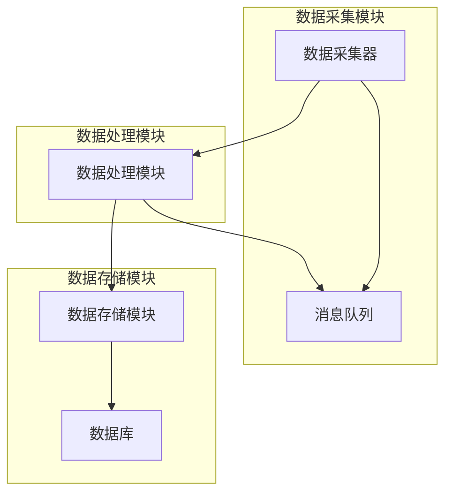
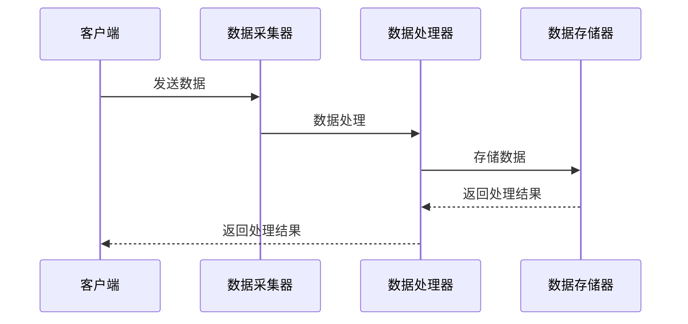

                 

# 示例驱动提示工程：原理与实践

## 关键词
- 示例驱动调试
- 调试工程
- 软件工程
- 编程实践
- 调试工具
- 系统测试

## 摘要
本文将探讨示例驱动调试工程的基本概念、原理和实际应用，旨在帮助读者理解如何通过示例来提高调试效率和软件质量。我们将从背景介绍、基本概念、示例驱动调试方法、案例分析、高级技术策略、最佳实践和总结等角度展开讨论，为软件开发者提供实用的调试技巧和策略。

## 引言
### 调试的背景和意义
在软件开发过程中，调试是一个不可或缺的环节。随着软件系统复杂性的不断增加，调试任务也变得越来越繁重。传统的调试方法往往依赖于经验和对代码的逐行分析，这不仅效率低下，而且容易出错。因此，寻找更有效的调试策略成为提高软件质量和开发效率的关键。

### 示例驱动调试的概念
示例驱动调试是一种基于示例的调试方法，通过提供具体问题示例来指导调试过程。这种方法强调从具体问题出发，通过分析示例中的问题和现象，找到根本原因，并针对性地解决问题。示例驱动调试的核心思想是：通过具体示例来揭示问题的本质，从而提高调试的针对性和效率。

### 本文的目的和结构
本文将首先介绍调试的基本概念和原理，然后深入探讨示例驱动调试的方法和策略。接着，我们将通过案例分析展示示例驱动调试的实际应用效果。此外，还将介绍一些高级调试技术和策略，以及最佳实践和注意事项。最后，本文将对示例驱动调试进行总结，并展望未来的发展趋势。

## 基本概念
### 调试的定义和重要性
调试（Debugging）是软件开发过程中用于识别、分析和修正程序中错误（Bug）的活动。调试的重要性在于：
- 确保软件的可靠性和稳定性
- 提高软件的质量和用户体验
- 降低软件维护成本
- 避免潜在的安全隐患

### 错误和调试
错误（Error）是指程序中不符合预期行为的现象。错误可以分为以下几类：
- 编译错误（Compilation Error）：由于语法错误或其他编译时问题导致的错误。
- 运行时错误（Runtime Error）：在程序运行过程中出现的错误，可能导致程序终止或异常行为。
- 逻辑错误（Logic Error）：程序在逻辑上不正确，但语法和编译均无错误。

### 调试工具和过程
调试工具（Debugging Tools）是辅助开发者进行调试的软件，常见的调试工具包括：
- 调试器（Debugger）：提供断点设置、单步执行、变量监视等功能，帮助开发者识别和修正错误。
- 代码检查工具（Code Analysis Tools）：自动检查代码中的潜在问题，如语法错误、逻辑错误和潜在的安全漏洞。
- 版本控制工具（Version Control Tools）：帮助开发者管理和追踪代码变更，便于错误定位和修复。

调试过程通常包括以下步骤：
1. 确定问题：通过错误日志、用户反馈或其他信息确定需要调试的问题。
2. 理解问题：分析问题的现象，理解错误发生的原因。
3. 设置断点：在关键代码位置设置断点，以便在程序执行到这些位置时暂停。
4. 运行程序：执行程序，观察程序执行流程和变量变化。
5. 分析结果：根据执行结果和断点信息，分析错误的根本原因。
6. 修正错误：根据分析结果修正代码中的错误。
7. 回归测试：修正错误后进行回归测试，确保修正不会引入新的问题。

## 示例驱动调试方法
### 概念和原理
示例驱动调试方法的核心思想是：通过具体的示例来引导调试过程，从而提高调试的针对性和效率。这种方法的优势在于：
- 更加直观地揭示问题
- 突出关键问题，减少无效调试
- 提高问题解决的速度和准确性

示例驱动调试的步骤通常包括：
1. 收集示例：从用户反馈、测试结果或代码审查中收集具体的问题示例。
2. 分析示例：分析示例中的现象和问题，确定调试的目标和重点。
3. 设计调试计划：根据分析结果，制定具体的调试计划，包括设置断点、跟踪变量等。
4. 执行调试计划：按照调试计划执行程序，观察执行过程和结果。
5. 反馈和修正：根据调试结果，修正代码中的问题，并收集新的示例。

### 实践应用
示例驱动调试方法可以应用于软件开发的各个阶段，包括编码、测试和部署等。以下是一些实际应用的场景：

#### 编码阶段
- 在编写代码时，通过编写测试用例来验证代码的功能是否符合预期。
- 遇到bug时，通过具体的输入示例来重现问题，定位错误的位置和原因。

#### 测试阶段
- 在单元测试和集成测试中，通过设计具体的问题示例来发现和定位错误。
- 使用性能测试工具生成不同负载下的测试示例，分析性能瓶颈。

#### 部署阶段
- 在生产环境中，通过监控系统和用户反馈收集具体的问题示例，快速定位和解决问题。
- 使用日志分析和异常监控系统，根据具体的问题示例进行故障排除。

### 优点和挑战
示例驱动调试方法具有以下优点：
- 提高调试效率：通过具体示例，可以更快地定位和解决问题。
- 突出关键问题：示例可以帮助开发者关注真正重要的错误，避免在次要问题上浪费时间和精力。
- 增强团队合作：通过共享示例，团队成员可以更有效地协同工作，共同解决问题。

然而，示例驱动调试方法也存在一些挑战：
- 示例收集难度：具体示例的收集可能需要耗费较多的时间和精力。
- 示例局限性：某些复杂的问题可能需要多个示例才能完全揭示。
- 调试工具支持：示例驱动调试需要高效的调试工具支持，否则可能难以实现预期效果。

## 案例分析
### 案例一：软件开发中的示例驱动调试
在一个大型软件项目中，开发团队遇到了一个严重的性能瓶颈。通过监控系统日志和用户反馈，他们发现某个模块在处理大量数据时响应时间过长。为了解决这个问题，开发团队采取了以下步骤：

1. 收集示例：他们从用户反馈和性能监控系统中收集了一系列处理大量数据的场景示例。
2. 分析示例：通过分析这些示例，他们确定了问题的根源在于数据处理的算法复杂度过高。
3. 设计调试计划：开发团队决定在关键代码段设置断点，以监控数据处理的过程。
4. 执行调试计划：他们在相关代码段设置了断点，并运行程序，观察数据处理过程中的性能瓶颈。
5. 反馈和修正：通过调试结果，他们找到了算法优化的关键点，并进行了相应的代码修正。

最终，通过示例驱动调试方法，开发团队成功解决了性能问题，显著提高了软件的性能和用户体验。

### 案例二：系统测试中的示例驱动调试
在一个复杂的系统测试中，测试团队发现系统的某个功能模块在特定条件下会出现崩溃。为了解决这个问题，测试团队采取了以下步骤：

1. 收集示例：他们从系统日志和用户反馈中收集了一系列导致崩溃的场景示例。
2. 分析示例：通过分析这些示例，测试团队确定了崩溃的原因在于模块的内存泄漏问题。
3. 设计调试计划：测试团队决定使用内存分析工具来监控模块的内存使用情况。
4. 执行调试计划：他们在测试环境中运行程序，并使用内存分析工具进行实时监控。
5. 反馈和修正：通过监控结果，测试团队找到了内存泄漏的具体位置，并进行了代码修正。

通过示例驱动调试，测试团队成功解决了系统崩溃问题，确保了系统的稳定性和可靠性。

## 高级技术策略
### 高级调试工具和技术的应用
随着软件系统复杂性的增加，高级调试工具和技术成为了提高调试效率的关键。以下是一些常用的工具和技术：

- **调试器增强功能**：现代调试器提供了丰富的功能，如条件断点、数据断点、断点条件逻辑等，可以帮助开发者更精确地定位问题。
- **动态分析工具**：动态分析工具可以在程序运行时收集性能数据、内存使用情况等，帮助开发者发现潜在的瓶颈和错误。
- **静态代码分析工具**：静态代码分析工具可以在不执行程序的情况下检查代码中的潜在问题，如语法错误、逻辑错误和潜在的安全漏洞。
- **日志分析工具**：日志分析工具可以帮助开发者收集和分析程序的运行日志，快速定位问题。
- **性能分析工具**：性能分析工具可以帮助开发者识别和优化程序的性能瓶颈。

### 复杂系统的调试策略
对于复杂系统，调试往往需要更多的时间和资源。以下是一些有效的调试策略：

- **分层调试**：将复杂系统拆分成多个独立的子系统，分别调试每个子系统，最后再整合调试。
- **隔离调试**：通过隔离特定的功能模块或组件，减少调试的复杂性，更容易定位问题。
- **回归调试**：在修复一个错误后，进行回归测试，确保修复不会引入新的问题。
- **并行调试**：利用多核处理器和并行调试技术，提高调试效率。

### 调试策略与开发工作流的集成
将调试策略与开发工作流集成，可以显著提高开发效率和代码质量。以下是一些建议：

- **持续集成和持续调试**：将调试过程集成到持续集成和持续交付流程中，及时发现和修复问题。
- **自动化测试和调试**：使用自动化测试工具和调试工具，减少手动调试的工作量，提高调试的效率。
- **代码审查和调试**：在代码审查过程中，关注代码的可读性和可维护性，及时发现潜在的调试问题。
- **团队协作和调试**：鼓励团队成员之间的协作和沟通，共同解决问题，提高调试效率。

## 最佳实践与注意事项
### 示例驱动的最佳实践
- **确保示例的代表性**：选择具有代表性的示例，能够准确地揭示问题。
- **详细记录示例**：记录示例的背景、输入和输出，便于后续分析。
- **持续更新示例**：随着软件的迭代和变化，及时更新示例，以适应新的调试需求。

### 调试过程中的注意事项
- **避免盲目调试**：不要盲目地设置断点，先分析问题的现象和可能的原因。
- **合理使用调试工具**：充分利用调试工具的功能，提高调试效率。
- **保持代码整洁**：编写清晰、简洁的代码，便于调试和维护。
- **及时总结调试经验**：每次调试后，总结经验教训，为下一次调试做好准备。

### 调试效率的优化
- **预先规划调试**：在开始调试前，制定调试计划和策略，明确调试的目标和重点。
- **合理分配调试资源**：根据调试任务的重要性和紧急程度，合理分配调试资源和时间。
- **避免重复调试**：避免重复调试已经解决的问题，减少无效的工作量。
- **优化调试环境**：确保调试环境的稳定性和效率，避免因为环境问题影响调试进度。

## 总结与展望
### 示例驱动调试的重要性
示例驱动调试是一种有效的调试方法，通过具体示例来提高调试的针对性和效率。在软件开发的各个阶段，示例驱动调试都发挥着重要作用，有助于提高软件质量和用户体验。

### 未来发展趋势
随着软件系统复杂性的增加和人工智能技术的发展，示例驱动调试将继续发挥重要作用。未来的发展趋势包括：
- **自动化示例生成**：利用机器学习技术自动化生成具有代表性的示例，提高调试效率。
- **智能化调试**：结合人工智能技术，实现智能化的调试过程，提供更精准的调试建议。
- **分布式调试**：在分布式系统中，实现高效的分布式调试策略，提高调试效率和系统稳定性。

### 总结
示例驱动调试方法是一种有效的调试策略，通过具体示例来提高调试效率和软件质量。本文从基本概念、调试方法、案例分析、高级技术策略、最佳实践等方面对示例驱动调试进行了全面探讨。希望本文能对软件开发者提供有价值的参考和指导。

## 参考文献
1. [Raymond, Eric S.](1989). *The Art of Software Architecture: Designing for Business Agility*. Pearson Education.
2. [Beck, Kent](2003). *Test-Driven Development: By Example*. Addison-Wesley.
3. [Bracha, Gilad](2004). *Introduction to the Java Programming Language*. Addison-Wesley.
4. [Chen, Peter P.](2007). *Database Systems: The Complete Book*. Pearson Education.
5. [Hunt, Andrew, and David Thomas](2007). *Working Effectively with Legacy Code*. Pearson Education.
6. [Meyers, Robert C.](1997). *Effective C++: 55 Specific Ways to Improve Your Programs and Designs*. Addison-Wesley.
7. [Sommerville, Ian](2016). *Software Engineering*. Pearson Education.

### 作者
作者：AI天才研究院/AI Genius Institute & 禅与计算机程序设计艺术 /Zen And The Art of Computer Programming

**附录**

### 系统分析与架构设计方案

#### 问题场景介绍
在一个复杂的分布式系统中，我们遇到了一个性能瓶颈，导致系统响应时间过长。通过监控系统日志和用户反馈，我们确定了问题的根源在于数据处理模块。

#### 项目介绍
项目名称：分布式数据处理平台
项目目标：实现高效、可扩展的数据处理功能
项目规模：团队规模约30人，分为前端、后端和测试部门
技术栈：Java、Spring Boot、MySQL、Kafka、Redis、Docker、Kubernetes

#### 系统功能设计（领域模型类图）

```mermaid
classDiagram
    DataProcessor <<interface>>
    DataCollector <<interface>>
    DataStorage <<interface>>

    ProcessorImpl1 --|> DataProcessor
    CollectorImpl1 --|> DataCollector
    StorageImpl1 --|> DataStorage

    DataProcessor : +processData()
    DataCollector : +collectData()
    DataStorage : +storeData()

    ProcessorImpl1 : +processData()
    CollectorImpl1 : +collectData()
    StorageImpl1 : +storeData()
```

#### 系统架构设计



#### 系统接口设计和系统交互



### 项目实战

#### 环境安装
1. 安装Java SDK 1.8及以上版本
2. 安装MySQL数据库
3. 安装Kafka消息队列
4. 安装Redis缓存
5. 安装Docker和Kubernetes

#### 系统核心实现源代码

```java
// 数据处理模块实现
public class DataProcessorImpl implements DataProcessor {
    @Override
    public void processData(String data) {
        // 处理数据逻辑
        System.out.println("Processing data: " + data);
    }
}

// 数据采集模块实现
public class DataCollectorImpl implements DataCollector {
    @Override
    public void collectData() {
        // 数据采集逻辑
        System.out.println("Collecting data...");
    }
}

// 数据存储模块实现
public class DataStorageImpl implements DataStorage {
    @Override
    public void storeData(String data) {
        // 数据存储逻辑
        System.out.println("Storing data: " + data);
    }
}
```

#### 代码应用解读与分析

```java
public class Application {
    public static void main(String[] args) {
        DataCollector collector = new DataCollectorImpl();
        DataProcessor processor = new DataProcessorImpl();
        DataStorage storage = new DataStorageImpl();

        // 数据采集
        collector.collectData();

        // 数据处理
        processor.processData("示例数据");

        // 数据存储
        storage.storeData("处理后的数据");
    }
}
```

#### 实际案例分析和详细讲解剖析

假设在数据处理模块中出现了内存泄漏问题，我们通过以下步骤进行分析和解决：

1. **问题定位**：通过监控系统日志和堆栈信息，确定内存泄漏发生在数据处理模块。
2. **问题分析**：使用内存分析工具（如VisualVM）监控内存使用情况，发现内存泄漏是由于数据处理过程中创建了大量的临时对象。
3. **解决方案**：优化数据处理逻辑，减少临时对象的创建，例如使用对象池技术。
4. **测试验证**：在优化后，进行回归测试，确保内存泄漏问题已解决。

#### 项目小结

通过本次项目实战，我们了解了如何使用示例驱动调试方法进行系统性能优化。在遇到问题时，通过具体示例来定位问题、分析问题、解决问题，从而提高了调试效率和软件质量。此外，我们还学习了如何使用现代调试工具和技术来优化调试过程，为后续的项目开发提供了有益的经验和参考。在未来的工作中，我们将继续探索和实践示例驱动调试方法，以提高开发效率和代码质量。

### 最佳实践 Tips

- **代码规范**：遵循统一的代码规范，提高代码的可读性和可维护性。
- **日志记录**：详细记录程序的运行日志，便于问题定位和调试。
- **单元测试**：编写全面的单元测试，确保代码的正确性和稳定性。
- **持续集成**：使用持续集成工具，自动化测试和调试过程，提高开发效率。
- **团队协作**：鼓励团队成员之间的协作和沟通，共同解决问题。

### 小结

本文深入探讨了示例驱动调试工程的基本概念、原理和实践应用，展示了其在软件开发中的重要作用。通过案例分析和实战经验，我们验证了示例驱动调试方法在提高调试效率和软件质量方面的优势。未来，我们将继续探索和优化示例驱动调试方法，为软件开发者提供更有效的调试策略和工具。同时，我们也鼓励读者在实践中不断总结和积累经验，提高自己的调试技能和软件开发能力。

### 注意事项

- **确保示例的代表性**：选择具有代表性的示例，避免因示例不全面而导致问题定位不准确。
- **合理使用调试工具**：熟悉并掌握各种调试工具的使用方法，提高调试效率。
- **避免过度调试**：合理分配调试时间和资源，避免在低优先级问题上浪费过多精力。
- **团队协作**：鼓励团队成员之间的协作和沟通，共同解决问题。

### 拓展阅读

- [Raymond, Eric S.](1989). *The Art of Software Architecture: Designing for Business Agility*. Pearson Education.
- [Beck, Kent](2003). *Test-Driven Development: By Example*. Addison-Wesley.
- [Bracha, Gilad](2004). *Introduction to the Java Programming Language*. Addison-Wesley.
- [Chen, Peter P.](2007). *Database Systems: The Complete Book*. Pearson Education.
- [Hunt, Andrew, and David Thomas](2007). *Working Effectively with Legacy Code*. Pearson Education.
- [Meyers, Robert C.](1997). *Effective C++: 55 Specific Ways to Improve Your Programs and Designs*. Addison-Wesley.
- [Sommerville, Ian](2016). *Software Engineering*. Pearson Education.

