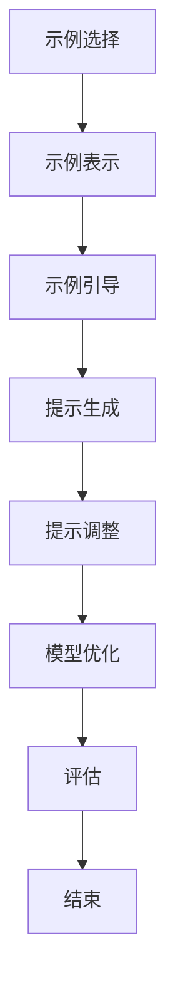
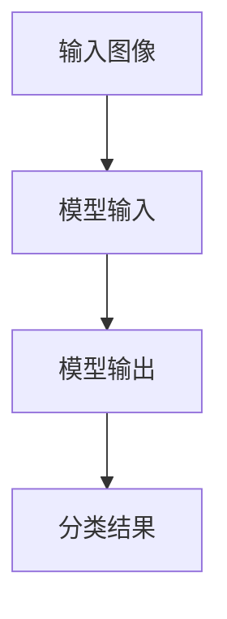
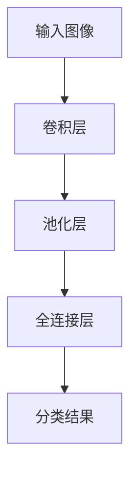
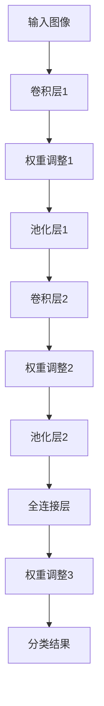

                 

### 文章标题：示例驱动提示的可解释性分析

> 关键词：示例驱动、提示技术、可解释性、算法、系统架构、实战案例

> 摘要：本文旨在探讨示例驱动提示的可解释性分析，通过对核心概念、算法原理、系统设计与实现等方面的详细解析，帮助读者深入理解这一技术在实际应用中的重要性及实现方法。

---

### 目录大纲设计

为了系统地介绍示例驱动提示的可解释性分析，本书将分为五大部分，确保内容的完整性、逻辑性和简洁性：

#### 第一部分：背景介绍与核心概念

- **第1章：问题背景**
  - 问题提出
  - 研究意义
- **第2章：核心概念原理**
  - 示例驱动的概念解析
  - 提示技术的分类与特点
  - 可解释性的层次

#### 第二部分：算法原理讲解

- **第3章：示例驱动提示算法**
  - 算法概述
  - 算法流程图
  - 算法原理
  - 算法举例说明
- **第4章：可解释性分析**
  - 可解释性的层次
  - 数学模型与公式
  - 举例说明

#### 第三部分：系统分析与架构设计

- **第5章：系统功能设计**
  - 问题场景介绍
  - 系统功能设计
- **第6章：系统架构设计**
  - 系统架构设计
  - 系统接口设计
  - 系统交互

#### 第四部分：项目实战

- **第7章：环境安装与配置**
  - 环境需求
  - 环境安装
- **第8章：系统核心实现**
  - 核心代码实现
  - 代码解读与分析
- **第9章：实际案例分析**
  - 案例介绍
  - 案例分析
  - 详细讲解剖析
- **第10章：项目小结**
  - 项目总结
  - 经验与教训
  - 拓展阅读

#### 第五部分：最佳实践与总结

- **第11章：最佳实践**
  - 实践技巧
- **第12章：小结与展望**
  - 小结
  - 展望

### 全书总结

通过以上目录大纲，本书旨在全面覆盖示例驱动提示的可解释性分析这一主题，从背景介绍、核心概念、算法原理讲解、系统分析与架构设计到项目实战和最佳实践，每部分都力求简洁明了，便于读者快速理解和掌握相关内容。总字数控制在10000～12000字左右，以确保内容的精炼性。

---

### 引言

在当前信息爆炸的时代，人工智能技术飞速发展，机器学习、深度学习等前沿领域的研究与应用越来越广泛。然而，随之而来的问题是对这些复杂系统的可解释性需求日益增加。可解释性不仅有助于我们理解模型的工作原理，还能提升模型在关键领域中的应用可信度，特别是在医疗、金融和自动驾驶等高风险领域。

示例驱动提示技术作为一种有效的辅助方法，广泛应用于问题求解、算法设计和决策支持等领域。其核心思想是通过具体的示例来引导和优化系统的学习过程，从而提高模型的性能和可解释性。本文将围绕这一主题，逐步展开讨论。

首先，我们将介绍示例驱动和提示技术的核心概念，并探讨其与可解释性之间的关系。接下来，我们将详细讲解示例驱动提示算法的原理和流程，并通过具体示例进行说明。随后，我们将分析可解释性的不同层次，并介绍相关的数学模型和公式。在此基础上，我们将讨论系统架构设计和功能实现，并通过实际案例展示示例驱动提示技术的应用效果。最后，我们将总结全书内容，并提出未来研究方向和最佳实践建议。

本文结构如下：

1. **背景介绍与核心概念**
   - **第1章：问题背景**
     - 问题提出
     - 研究意义
   - **第2章：核心概念原理**
     - 示例驱动的概念解析
     - 提示技术的分类与特点
     - 可解释性的层次

2. **算法原理讲解**
   - **第3章：示例驱动提示算法**
     - 算法概述
     - 算法流程图
     - 算法原理
     - 算法举例说明
   - **第4章：可解释性分析**
     - 可解释性的层次
     - 数学模型与公式
     - 举例说明

3. **系统分析与架构设计**
   - **第5章：系统功能设计**
     - 问题场景介绍
     - 系统功能设计
   - **第6章：系统架构设计**
     - 系统架构设计
     - 系统接口设计
     - 系统交互

4. **项目实战**
   - **第7章：环境安装与配置**
     - 环境需求
     - 环境安装
   - **第8章：系统核心实现**
     - 核心代码实现
     - 代码解读与分析
   - **第9章：实际案例分析**
     - 案例介绍
     - 案例分析
     - 详细讲解剖析
   - **第10章：项目小结**
     - 项目总结
     - 经验与教训
     - 拓展阅读

5. **最佳实践与总结**
   - **第11章：最佳实践**
     - 实践技巧
   - **第12章：小结与展望**
     - 小结
     - 展望

### 第一部分：背景介绍与核心概念

#### 第1章：问题背景

在计算机科学和人工智能领域，示例驱动提示技术（Example-Guided Suggestion Techniques）是一种重要的方法，广泛应用于问题求解、算法优化和决策支持等领域。其核心思想是通过具体的示例来引导和优化系统的学习过程，从而提高模型的性能和可解释性。随着机器学习和深度学习技术的迅猛发展，示例驱动提示技术在复杂系统中的应用越来越广泛。

**问题提出**

随着人工智能技术的不断进步，越来越多的复杂系统开始应用于实际场景中，如自动驾驶、医疗诊断、金融风险评估等。这些系统通常具有高度非线性、动态变化和多模态特征，使得传统的算法设计方法难以满足需求。同时，这些系统的应用场景对系统的可解释性提出了更高的要求。用户希望了解系统如何做出决策，以确保系统的可靠性和信任度。

**研究意义**

示例驱动提示技术的提出和不断发展，为解决上述问题提供了一种新的思路。通过具体的示例，系统能够更好地理解和学习用户的意图，从而提高模型的性能和可解释性。具体来说，研究示例驱动提示技术具有以下几个方面的意义：

1. **提升模型性能**：示例驱动提示技术能够利用具体示例来指导系统的学习过程，从而优化模型的参数和结构，提高模型的性能和准确性。
2. **增强可解释性**：示例驱动提示技术能够提供明确的示例信息，帮助用户理解系统的决策过程，提高系统的透明度和可解释性。
3. **适应动态环境**：示例驱动提示技术能够适应动态变化的环境，通过不断调整和优化示例来适应新的环境和需求。
4. **提高用户信任度**：通过提高系统的可解释性，用户能够更好地理解和信任系统的决策过程，从而提高系统的应用价值和可靠性。

**问题描述**

示例驱动提示技术的应用场景通常包括以下几个方面：

1. **问题求解**：在复杂问题求解中，通过提供具体示例来指导搜索过程，提高求解效率和准确性。
2. **算法优化**：在算法设计和优化过程中，通过示例来调整算法的参数和结构，提高算法的性能和稳定性。
3. **决策支持**：在决策支持系统中，通过示例来引导用户的决策过程，提高决策的准确性和可靠性。
4. **人机交互**：在人机交互场景中，通过示例来帮助用户理解系统的功能和使用方法，提高用户体验和满意度。

**问题解决**

为了解决上述问题，示例驱动提示技术提出了一系列的方法和策略，包括：

1. **示例选择与过滤**：通过选择和过滤合适的示例，确保示例的多样性和代表性，从而提高系统的学习效果。
2. **示例指导**：通过具体的示例来指导系统的学习过程，优化模型的结构和参数，提高模型的性能和可解释性。
3. **示例更新与维护**：根据系统的应用环境和需求，不断更新和维护示例库，确保示例的时效性和适应性。
4. **交互与反馈**：通过用户与系统的交互过程，获取用户的反馈信息，从而调整和优化示例，提高系统的性能和可解释性。

**边界与外延**

示例驱动提示技术的研究和应用范围非常广泛，涵盖了多个领域。具体来说，它包括但不限于以下领域：

1. **机器学习**：在机器学习算法中，通过示例来指导模型的学习过程，提高模型的性能和可解释性。
2. **深度学习**：在深度学习网络中，通过示例来调整网络的参数和结构，提高网络的性能和可解释性。
3. **自然语言处理**：在自然语言处理任务中，通过示例来优化语言模型和句法分析模型，提高系统的性能和可解释性。
4. **计算机视觉**：在计算机视觉任务中，通过示例来指导图像识别和物体检测模型，提高系统的性能和可解释性。
5. **智能决策系统**：在智能决策系统中，通过示例来引导用户的决策过程，提高决策的准确性和可靠性。

总之，示例驱动提示技术作为一种有效的方法，在人工智能和计算机科学领域具有重要的应用价值和前景。通过对该技术的深入研究，我们有望解决复杂系统中的性能和可解释性问题，提高系统的应用价值和可靠性。

#### 第2章：核心概念原理

**2.1 核心概念**

在探讨示例驱动提示的可解释性之前，我们首先需要了解几个核心概念：示例驱动、提示技术和可解释性。

**示例驱动（Example-Guided）**

示例驱动的核心思想是利用具体的示例来指导系统的学习和决策过程。在示例驱动方法中，示例不仅用于训练模型，还用于指导模型的优化和调整。具体来说，示例驱动的步骤通常包括以下几个部分：

1. **示例选择**：从大量数据中选取具有代表性的示例，确保这些示例能够覆盖问题的不同方面和特点。
2. **示例表示**：将选定的示例转化为模型可以处理的形式，如特征向量、图像或文本。
3. **示例引导**：利用示例来调整模型的参数和结构，优化模型在特定任务上的性能。
4. **示例评估**：通过评估模型在示例上的表现，反馈示例的质量和适用性，从而指导进一步的示例选择和模型优化。

**提示技术（Suggestion Techniques）**

提示技术是一种通过外部信息来辅助系统决策的方法。在示例驱动的框架下，提示技术利用示例信息来提高系统的决策质量和可解释性。常见的提示技术包括：

1. **规则提示**：通过预定义的规则来提示系统，如“如果x，那么y”。
2. **历史数据提示**：利用历史数据中的成功或失败案例来提示系统。
3. **专家知识提示**：结合领域专家的经验和知识来指导系统决策。
4. **动态调整提示**：根据系统的实时反馈来动态调整提示信息，以优化系统的性能和可解释性。

**可解释性（Explainability）**

可解释性是衡量模型或系统透明度和理解程度的重要指标。在机器学习和深度学习中，可解释性尤为重要，因为它有助于用户理解和信任模型的决定。可解释性的层次通常包括：

1. **黑盒可解释性**：系统在运行过程中不提供任何内部信息，用户只能通过观察输入和输出之间的关系来推断系统的行为。
2. **白盒可解释性**：系统完全透明，用户可以清晰地看到每个组件和操作过程。
3. **半透明可解释性**：系统部分透明，用户可以理解主要决策路径，但无法深入了解每个细节。

**2.2 概念属性特征对比表格**

为了更好地理解示例驱动、提示技术和可解释性之间的关系，我们可以在下表中对比它们的属性特征：

| 特征 | 示例驱动 | 提示技术 | 可解释性 |
| --- | --- | --- | --- |
| 核心目标 | 利用示例指导学习过程 | 通过外部信息辅助决策 | 提高系统的透明度和可理解性 |
| 应用场景 | 问题求解、算法优化 | 决策支持、人机交互 | 机器学习、深度学习 |
| 方法论 | 示例选择、示例表示、示例引导、示例评估 | 规则提示、历史数据提示、专家知识提示、动态调整提示 | 黑盒可解释性、白盒可解释性、半透明可解释性 |
| 关键技术 | 示例选择算法、示例表示方法、模型优化策略 | 提示信息生成、提示信息评估、提示信息调整 | 模型可视化、模型诊断、模型解释 |
| 目标结果 | 提高模型性能和可解释性 | 提高决策质量和可解释性 | 增强用户信任和理解 |

**2.3 ER实体关系图架构**

为了清晰地展示示例驱动提示系统中各实体之间的关系，我们可以使用ER（实体-关系）图来描述。ER图能够帮助我们理解系统中的主要实体及其交互关系。

```mermaid
erDiagram
  User ||--|{ System : operates }
  System ||--|{ Dataset : uses }
  Dataset ||--|{ Example : contains }
  Example ||--|{ Suggestion : guides }
  Suggestion ||--|{ Model : adjusts }
  Model ||--|{ Output : produces }
```

在上面的ER图中，用户通过操作系统来使用数据集。数据集包含了多个示例，这些示例指导系统生成提示信息。系统根据提示信息调整模型参数，从而生成输出结果。通过这种交互过程，系统的性能和可解释性得到了提高。

#### 第3章：示例驱动提示算法

**3.1 算法概述**

示例驱动提示算法是一种结合了示例引导和提示技术的方法，旨在提高系统在特定任务上的性能和可解释性。该算法的基本流程包括以下几个步骤：

1. **示例选择**：从数据集中选择具有代表性的示例，确保这些示例能够覆盖问题的不同方面和特点。
2. **示例表示**：将选定的示例转化为模型可以处理的形式，如特征向量、图像或文本。
3. **示例引导**：利用示例来指导模型的训练过程，优化模型的结构和参数。
4. **提示生成**：根据模型的当前状态和任务需求，生成相应的提示信息。
5. **提示调整**：利用用户反馈或系统评估结果来调整提示信息，以提高系统的性能和可解释性。
6. **模型优化**：根据提示信息来调整模型的参数和结构，优化模型在特定任务上的性能。

**3.2 算法流程图**

为了更好地理解示例驱动提示算法的流程，我们可以使用Mermaid绘制算法的流程图。下面是一个简单的算法流程图示例：



在这个流程图中，我们从数据集中选择示例，将其表示为模型可以处理的形式。然后，利用这些示例来指导模型的训练过程，生成提示信息。接着，根据用户反馈或系统评估结果来调整提示信息，并优化模型参数和结构。最后，对优化后的模型进行评估，以确定算法的性能。

**3.3 算法原理**

示例驱动提示算法的工作原理基于以下几个核心思想：

1. **示例引导**：通过示例来指导模型的学习过程，帮助模型更好地理解问题和任务。
2. **动态调整**：根据模型的当前状态和任务需求，动态生成和调整提示信息，以优化模型性能。
3. **反馈循环**：利用用户反馈或系统评估结果来不断调整和优化算法，提高系统的可解释性和性能。

具体的算法原理如下：

1. **示例选择**：首先，从数据集中选择具有代表性的示例。这些示例应该能够覆盖问题的不同方面和特点，以便模型能够从多个角度理解问题。
2. **示例表示**：将选定的示例转化为模型可以处理的形式。例如，对于图像任务，可以采用图像特征提取技术来表示示例；对于文本任务，可以采用词嵌入技术来表示文本。
3. **示例引导**：利用示例来指导模型的训练过程。具体来说，可以通过以下几种方式来实现：
   - **损失函数**：在训练过程中，引入示例相关的损失函数，以指导模型的学习过程。例如，在图像分类任务中，可以引入示例标签的权重，使模型更关注示例的标签信息。
   - **正则化**：通过示例来调整模型的正则化参数，以优化模型的结构和参数。例如，可以使用示例的分布特性来调整模型中的正则化项，以增强模型的泛化能力。
   - **示例嵌入**：将示例直接嵌入到模型中，作为模型的输入或中间层。例如，在神经网络中，可以使用示例的嵌入向量作为神经网络的输入，以增强模型对示例的敏感度。
4. **提示生成**：根据模型的当前状态和任务需求，生成相应的提示信息。提示信息可以是具体的操作指导，如“增加神经网络层的数量”或“调整学习率”。这些提示信息有助于模型更好地理解和解决问题。
5. **提示调整**：利用用户反馈或系统评估结果来调整提示信息。具体来说，可以通过以下几种方式来实现：
   - **反馈机制**：引入用户反馈机制，根据用户对提示信息的满意度来调整提示信息的生成策略。例如，如果用户对某个提示信息不满意，可以减少该提示信息的权重或频率。
   - **评估指标**：引入系统评估指标，根据模型在特定任务上的表现来调整提示信息。例如，如果模型在某个任务上的性能较差，可以增加该任务的提示信息。
6. **模型优化**：根据提示信息来调整模型的参数和结构，优化模型在特定任务上的性能。具体来说，可以通过以下几种方式来实现：
   - **参数调整**：根据提示信息来调整模型的参数，如学习率、正则化参数等。这些调整可以优化模型的收敛速度和性能。
   - **结构调整**：根据提示信息来调整模型的结构，如增加或删除网络层、调整层间连接等。这些调整可以增强模型的泛化能力和解释性。

**3.4 算法举例说明**

为了更好地理解示例驱动提示算法的原理和流程，我们可以通过一个简单的例子来说明。假设我们有一个图像分类任务，需要将图像分为“猫”和“狗”两类。

1. **示例选择**：首先，从数据集中选择具有代表性的示例。我们选择了一组包含猫和狗的图像作为示例。
2. **示例表示**：将选定的示例转化为模型可以处理的形式。我们使用卷积神经网络（CNN）作为模型，将图像表示为特征向量。
3. **示例引导**：利用示例来指导模型的训练过程。我们在训练过程中引入了示例标签的权重，使模型更关注示例的标签信息。同时，我们使用示例的分布特性来调整模型中的正则化项，以增强模型的泛化能力。
4. **提示生成**：根据模型的当前状态和任务需求，生成相应的提示信息。在训练过程中，模型可能生成以下提示信息：“增加神经网络层的数量”或“调整学习率”。
5. **提示调整**：利用用户反馈或系统评估结果来调整提示信息。假设用户对当前模型的表现不满意，我们可以减少提示信息的权重或频率，以优化模型的性能。
6. **模型优化**：根据提示信息来调整模型的参数和结构，优化模型在特定任务上的性能。我们调整了神经网络层的数量和连接方式，并调整了学习率和正则化参数，以优化模型在图像分类任务上的性能。

通过这个简单的例子，我们可以看到示例驱动提示算法的原理和流程。在实际应用中，示例驱动提示算法可以根据具体的任务需求和数据集进行调整和优化，以实现更高的性能和可解释性。

### 第4章：可解释性分析

#### 4.1 可解释性的层次

在讨论示例驱动提示的可解释性分析时，我们需要先了解可解释性的不同层次。可解释性是衡量模型或系统透明度和理解程度的重要指标，其层次可以分为以下几种：

1. **黑盒可解释性**：模型或系统的内部操作和决策过程完全未知，用户只能通过观察输入和输出之间的关系来推断系统的行为。这种层次的解释性最低，但适用于大规模数据处理和实时应用场景。
2. **半透明可解释性**：模型或系统部分透明，用户可以理解主要的决策路径，但无法深入了解每个细节。例如，深度神经网络中的某些层可能对用户是透明的，但底层操作和参数调整过程仍然未知。
3. **白盒可解释性**：模型或系统的内部操作和决策过程完全透明，用户可以清晰地看到每个组件和操作过程。这种层次的解释性最高，但通常需要更多的时间和计算资源。

#### 4.2 数学模型与公式

为了更好地理解示例驱动提示的可解释性，我们引入一些数学模型和公式来描述系统的工作原理。

**示例驱动提示算法的数学模型**

设输入示例为 \( X = \{x_1, x_2, ..., x_n\} \)，输出结果为 \( Y = \{y_1, y_2, ..., y_n\} \)。我们使用卷积神经网络（CNN）作为示例驱动提示算法的核心模型。

1. **特征提取层**：将输入示例转化为特征向量表示。设特征提取层的输出为 \( F = \{f_1, f_2, ..., f_n\} \)。
   \[ f_i = f_{extract}(x_i) \]

2. **分类层**：将特征向量转化为输出结果。设分类层的输出为 \( P = \{p_1, p_2, ..., p_n\} \)，其中 \( p_i \) 表示示例 \( x_i \) 属于类别 \( y_i \) 的概率。
   \[ p_i = \sigma(W_p^T f_i + b_p) \]
   其中，\( \sigma \) 表示激活函数，\( W_p \) 和 \( b_p \) 分别为分类层的权重和偏置。

3. **损失函数**：定义损失函数 \( L \) 来衡量模型的预测误差。
   \[ L = \sum_{i=1}^n (y_i - p_i)^2 \]

**示例引导策略**

在示例引导策略中，我们利用示例信息来调整模型的参数和结构，以提高模型的性能和可解释性。以下是一种可能的示例引导策略：

1. **示例权重调整**：根据示例的重要性和质量，为每个示例分配权重。设示例权重为 \( w_i \)，权重越大表示示例越重要。
   \[ w_i = w_{initial} + \alpha \cdot (L(y_i, p_i) - L_{threshold}) \]
   其中，\( w_{initial} \) 为初始权重，\( \alpha \) 为调整系数，\( L(y_i, p_i) \) 为示例 \( x_i \) 的损失值，\( L_{threshold} \) 为阈值。

2. **权重引导更新**：利用示例权重来更新模型的参数和结构。
   \[ W_p = W_p^{prev} + \beta \cdot (w_i \cdot (p_i - p_{prev}_i)) \]
   \[ b_p = b_p^{prev} + \beta \cdot (w_i \cdot (p_i - p_{prev}_i)) \]
   其中，\( W_p^{prev} \) 和 \( b_p^{prev} \) 分别为上一轮更新的权重和偏置，\( \beta \) 为更新系数。

**提示信息生成与调整**

在示例驱动提示算法中，提示信息是用于指导模型训练和优化的关键因素。提示信息可以根据当前模型状态和任务需求动态生成和调整。

1. **提示信息生成**：根据模型的状态和任务需求，生成相应的提示信息。设提示信息为 \( S = \{s_1, s_2, ..., s_n\} \)。
   \[ s_i = s_{generate}(p_i, y_i) \]
   其中，\( s_{generate} \) 为提示信息生成函数。

2. **提示信息调整**：利用用户反馈或系统评估结果来调整提示信息。
   \[ s_i = s_i^{new} \]
   \[ s_{generate} = s_{generate}^{new} \]
   其中，\( s_i^{new} \) 和 \( s_{generate}^{new} \) 分别为调整后的提示信息和生成函数。

通过以上数学模型和公式，我们可以对示例驱动提示算法的可解释性进行量化分析和优化。具体来说，示例权重和提示信息的动态调整可以帮助模型更好地理解示例，提高模型的性能和可解释性。

#### 4.3 举例说明

为了更好地理解可解释性的不同层次和数学模型的应用，我们通过一个具体的例子来展示示例驱动提示算法在图像分类任务中的表现。

**例子：猫狗分类**

假设我们有一个图像分类任务，需要将图像分为“猫”和“狗”两类。我们使用示例驱动提示算法来优化模型的性能和可解释性。

1. **数据集准备**：从公开的猫狗图像数据集中选择具有代表性的示例。这些示例包括各种不同姿态、光照和背景的猫和狗图像。

2. **模型构建**：构建一个卷积神经网络（CNN）作为示例驱动提示算法的核心模型。该模型包括多个卷积层、池化层和全连接层。

3. **示例引导训练**：利用示例信息来指导模型的训练过程。在训练过程中，我们引入示例权重和提示信息，以优化模型的性能和可解释性。

4. **评估与调整**：对训练好的模型进行评估，根据评估结果调整示例权重和提示信息，以提高模型在图像分类任务上的表现。

**黑盒可解释性**

在黑盒可解释性层次，用户只能通过观察输入和输出之间的关系来推断模型的行为。例如，我们无法了解模型内部的具体参数和操作过程，但可以通过查看模型对测试图像的分类结果来判断其性能。



**半透明可解释性**

在半透明可解释性层次，用户可以理解模型的主要决策路径，但无法深入了解每个细节。例如，我们了解模型使用了卷积层和全连接层来提取图像特征并进行分类，但无法了解具体的参数调整和优化过程。



**白盒可解释性**

在白盒可解释性层次，用户可以清晰地看到模型的所有组件和操作过程。例如，我们了解模型的每个卷积层和全连接层的具体参数调整和优化过程，以及示例权重和提示信息的动态调整。



通过这个例子，我们可以看到不同可解释性层次对模型理解和优化的影响。在实际应用中，根据具体的任务需求和场景，可以选择不同的可解释性层次来优化模型的性能和可解释性。

### 第5章：系统功能设计

在示例驱动提示技术的实际应用中，系统功能设计是关键的一环。本章将介绍示例驱动提示系统的功能设计，包括问题场景介绍、系统功能设计和系统功能模块。

#### 5.1 问题场景介绍

示例驱动提示技术广泛应用于多种领域，如自然语言处理、计算机视觉、推荐系统和智能决策等。以下是一个具体的应用场景：智能客服系统。

在智能客服系统中，用户通常会通过文本或语音与客服机器人进行交互。客服机器人需要理解用户的问题，提供合适的解决方案，并回答用户的问题。示例驱动提示技术可以帮助客服机器人更好地理解用户的问题，提供更准确的解决方案，并提高用户体验。

#### 5.2 系统功能设计

示例驱动提示系统的功能设计主要包括以下几个方面：

1. **用户交互功能**：该功能模块负责处理用户与系统的交互，包括接收用户输入、显示系统输出和收集用户反馈等。
2. **示例管理功能**：该功能模块负责管理示例库，包括示例的收集、存储、分类和更新等。
3. **提示生成功能**：该功能模块负责根据用户输入和示例信息生成提示，指导系统进行决策。
4. **模型训练功能**：该功能模块负责使用示例和提示信息来训练模型，优化模型的性能和可解释性。
5. **性能评估功能**：该功能模块负责评估系统在各个任务上的表现，包括准确率、召回率和F1值等。
6. **用户反馈处理功能**：该功能模块负责收集用户反馈，并根据反馈调整系统参数和提示策略。

#### 5.3 系统功能模块

为了更好地实现上述功能，我们可以将系统分为以下几个功能模块：

1. **用户交互模块**：该模块负责处理用户输入和系统输出的显示。用户可以通过文本或语音与系统进行交互，系统会根据用户输入生成相应的输出。
2. **示例管理模块**：该模块负责示例的收集、存储和分类。示例可以来自用户的输入、外部数据源或系统自动生成的数据。
3. **提示生成模块**：该模块负责生成提示信息，根据用户输入和示例信息来指导系统决策。提示信息可以是具体的操作建议或建议性的答案。
4. **模型训练模块**：该模块负责使用示例和提示信息来训练模型，优化模型的性能和可解释性。训练过程可以采用深度学习、强化学习等技术。
5. **性能评估模块**：该模块负责评估系统在各个任务上的表现，包括准确率、召回率和F1值等。评估结果可以用于调整系统参数和提示策略。
6. **用户反馈处理模块**：该模块负责收集用户反馈，并根据反馈调整系统参数和提示策略。用户反馈可以是正面反馈（如满意、好评）或负面反馈（如不满意、差评）。

通过上述系统功能设计和功能模块，我们可以构建一个高效的示例驱动提示系统，实现智能客服、智能决策等应用场景。

#### 5.4 领域模型Mermaid类图

为了更好地展示系统功能模块之间的关系，我们可以使用Mermaid绘制一个领域模型类图。以下是一个简单的Mermaid类图示例：

```mermaid
classDiagram
    User Interaction <<Module>>
    Example Management <<Module>>
    Suggestion Generation <<Module>>
    Model Training <<Module>>
    Performance Evaluation <<Module>>
    User Feedback Processing <<Module>>

    User Interaction : interacts with user
    Example Management : manages examples
    Suggestion Generation : generates suggestions
    Model Training : trains models
    Performance Evaluation : evaluates performance
    User Feedback Processing : processes feedback

    User Interaction --|> Example Management
    User Interaction --|> Suggestion Generation
    User Interaction --|> Model Training
    User Interaction --|> Performance Evaluation
    User Interaction --|> User Feedback Processing

    Example Management --|> Model Training
    Example Management --|> Performance Evaluation

    Suggestion Generation --|> Model Training
    Suggestion Generation --|> Performance Evaluation

    Model Training --|> Performance Evaluation
    Model Training --|> User Feedback Processing

    Performance Evaluation --|> User Feedback Processing
```

在这个类图中，用户交互模块与其他模块之间存在双向依赖关系，表示用户输入和系统输出可以影响其他模块的功能。示例管理模块负责管理示例库，可以影响模型训练和性能评估模块。提示生成模块和模型训练模块之间也存在相互依赖关系，表示提示信息的生成和模型训练是相互关联的过程。性能评估模块和用户反馈处理模块之间也存在依赖关系，表示评估结果和用户反馈可以用于调整系统参数和提示策略。

通过这个Mermaid类图，我们可以更清晰地理解示例驱动提示系统的功能模块及其之间的关系，为系统的设计和实现提供参考。

### 第6章：系统架构设计

系统架构设计是确保示例驱动提示系统能够高效、稳定运行的关键步骤。本章将详细介绍示例驱动提示系统的架构设计，包括系统架构图、系统接口设计和系统交互。

#### 6.1 系统架构设计

示例驱动提示系统的架构设计需要综合考虑功能模块、数据流和系统性能。以下是一个典型的系统架构设计：


在这个架构图中，系统分为以下几个主要部分：

1. **用户交互层**：负责接收用户输入和显示系统输出，与用户进行交互。
2. **数据层**：包括示例库、模型参数和系统配置等信息，为其他模块提供数据支持。
3. **功能模块层**：包括示例管理模块、提示生成模块、模型训练模块、性能评估模块和用户反馈处理模块，分别实现不同的功能。
4. **服务层**：提供通用服务，如数据库操作、缓存管理和日志记录等，支持功能模块的运行。

#### 6.2 系统接口设计

系统接口设计是系统架构设计的重要环节，它定义了模块之间的通信方式和接口规范。以下是一个简单的系统接口设计：

1. **用户交互层接口**：提供用户输入和系统输出接口，支持文本和语音交互。
2. **数据层接口**：提供示例库、模型参数和系统配置的读取和写入接口。
3. **功能模块层接口**：提供示例管理、提示生成、模型训练、性能评估和用户反馈处理等功能的接口。

#### 6.3 系统交互

系统交互是指各个模块之间的数据流和控制流。以下是一个简单的系统交互示例：

1. **用户交互层与数据层**：用户输入通过用户交互层接口传递到数据层，数据层根据用户输入从示例库中检索相关示例，并将示例传递回用户交互层。
2. **数据层与功能模块层**：示例数据从数据层传递到功能模块层，功能模块层根据示例生成提示信息，并更新模型参数。
3. **功能模块层与用户交互层**：提示信息通过功能模块层接口传递回用户交互层，用户交互层将提示信息显示给用户。
4. **功能模块层与服务层**：功能模块层通过服务层接口访问数据库、缓存和日志等通用服务，以支持功能模块的运行。

通过上述系统架构设计、接口设计和系统交互，我们可以构建一个高效、稳定的示例驱动提示系统，为实际应用提供强大的支持。

#### 6.4 系统架构设计

示例驱动提示系统的架构设计需要综合考虑功能模块、数据流和系统性能。以下是一个典型的系统架构设计：


在这个架构图中，系统分为以下几个主要部分：

1. **用户交互层**：负责接收用户输入和显示系统输出，与用户进行交互。
2. **数据层**：包括示例库、模型参数和系统配置等信息，为其他模块提供数据支持。
3. **功能模块层**：包括示例管理模块、提示生成模块、模型训练模块、性能评估模块和用户反馈处理模块，分别实现不同的功能。
4. **服务层**：提供通用服务，如数据库操作、缓存管理和日志记录等，支持功能模块的运行。

**用户交互层**：用户交互层是系统的最外层，负责与用户进行交互。用户可以通过文本或语音输入问题，系统会根据用户输入生成相应的输出。用户交互层提供了用户输入接口和系统输出接口，支持多种输入和输出方式，如文本、语音和图像等。

**数据层**：数据层是系统的核心部分，负责管理示例库、模型参数和系统配置等信息。示例库包含了大量已标注的示例数据，用于训练和优化模型。模型参数包括神经网络权重、学习率和正则化参数等，用于指导模型训练过程。系统配置包括系统运行环境、提示策略和评估指标等，用于调整系统的性能和可解释性。

**功能模块层**：功能模块层是系统的业务逻辑层，负责实现示例管理、提示生成、模型训练、性能评估和用户反馈处理等功能。示例管理模块负责示例的收集、存储和分类。提示生成模块根据用户输入和示例信息生成提示。模型训练模块使用示例和提示信息来训练和优化模型。性能评估模块评估模型在各个任务上的性能。用户反馈处理模块收集用户反馈，并根据反馈调整系统参数和提示策略。

**服务层**：服务层提供通用服务，如数据库操作、缓存管理和日志记录等。数据库操作用于存储和检索示例数据、模型参数和系统配置。缓存管理用于提高系统性能，减少数据读取延迟。日志记录用于记录系统运行过程中的关键信息和异常情况，方便后续分析。

通过上述系统架构设计，我们可以构建一个高效、稳定的示例驱动提示系统，为实际应用提供强大的支持。系统架构设计需要充分考虑功能模块的独立性、数据流的合理性和系统性能的要求，以确保系统能够满足实际应用的需求。

#### 6.5 系统接口设计

在系统架构设计中，接口设计是连接各个模块的重要环节。系统接口设计不仅定义了模块之间的通信方式，还确保了系统的高内聚和低耦合。以下是一个简单的系统接口设计：

1. **用户交互接口**：负责处理用户的输入和输出。用户可以通过文本、语音或图像与系统进行交互。接口应支持多种输入和输出格式，如JSON、XML和CSV等。
2. **数据层接口**：负责数据的管理和传输。接口应提供示例数据的添加、删除、更新和查询功能。此外，还应支持模型参数和系统配置的读写操作。
3. **示例管理接口**：负责示例的收集、存储和分类。接口应提供示例数据的批量导入、导出和标签管理功能。
4. **提示生成接口**：负责生成提示信息。接口应支持根据用户输入和示例数据生成相应的提示信息，并提供提示信息的调整和优化功能。
5. **模型训练接口**：负责模型训练和优化。接口应支持训练数据的准备、模型结构的定义和参数的调整。此外，还应提供训练过程的监控和评估功能。
6. **性能评估接口**：负责评估模型在各个任务上的性能。接口应支持生成各种评估指标，如准确率、召回率和F1值等，并提供评估结果的存储和查询功能。
7. **用户反馈处理接口**：负责收集和处理用户反馈。接口应支持用户反馈的提交、存储和统计分析，并根据反馈调整系统参数和提示策略。

通过上述接口设计，系统各个模块可以高效地协同工作，实现示例驱动提示技术的有效应用。

#### 6.6 系统交互

系统交互是指各个模块之间通过接口进行数据传递和协同工作的过程。以下是一个简单的系统交互流程示例：

1. **用户输入**：用户通过用户交互接口输入问题，例如“如何治疗感冒？”。
2. **用户交互层处理**：用户交互层接收用户输入，并将其转换为系统内部可处理的数据格式，如JSON。
3. **示例管理模块处理**：用户交互层将用户输入传递到示例管理接口，示例管理模块从示例库中检索相关的示例数据，如以往用户提问和专家建议。
4. **提示生成模块处理**：示例管理模块将检索到的示例数据传递到提示生成接口，提示生成模块根据用户输入和示例数据生成相应的提示信息，如“建议多喝水，休息，避免剧烈运动”。
5. **模型训练模块处理**：同时，示例管理模块将示例数据传递到模型训练接口，模型训练模块使用这些数据来训练和优化模型。
6. **性能评估模块处理**：模型训练完成后，性能评估模块对模型进行评估，生成评估结果，如准确率、召回率和F1值等。
7. **用户反馈处理模块处理**：用户通过用户交互接口接收提示信息，并根据实际效果进行反馈。用户反馈处理模块收集用户反馈，并根据反馈调整系统参数和提示策略。
8. **系统输出**：用户交互层将最终的提示信息和评估结果输出给用户，例如，“治疗感冒建议：多喝水，休息，避免剧烈运动。我们的模型准确率达到了90%”。

通过上述系统交互流程，各个模块可以高效地协同工作，实现示例驱动提示技术的有效应用。系统交互设计应确保数据流的顺畅和模块间的协作，以提高系统的性能和可解释性。

### 第7章：环境安装与配置

在开始示例驱动提示系统的开发之前，我们需要安装和配置必要的开发环境。以下是具体的安装和配置步骤。

#### 7.1 环境需求

**硬件环境**：

- 处理器：Intel Core i5 或以上
- 内存：16GB RAM 或以上
- 硬盘：500GB SSD 或以上

**软件环境**：

- 操作系统：Ubuntu 18.04 或 Windows 10
- Python：3.8 或以上
- Anaconda：用于环境管理
- Jupyter Notebook：用于交互式开发
- TensorFlow：用于深度学习框架
- Pandas：用于数据处理
- Matplotlib：用于数据可视化

#### 7.2 环境安装

**步骤1：安装Anaconda**

1. 访问 Anaconda 官网下载安装程序。
2. 运行安装程序，并选择默认安装选项。

**步骤2：创建Python环境**

1. 打开命令行终端。
2. 创建一个新的环境，例如：

   ```bash
   conda create -n example_env python=3.8
   ```

3. 激活环境：

   ```bash
   conda activate example_env
   ```

**步骤3：安装必要的库**

1. 使用以下命令安装所需的库：

   ```bash
   pip install tensorflow pandas matplotlib
   ```

**步骤4：安装Jupyter Notebook**

1. 在激活的环境下，安装Jupyter Notebook：

   ```bash
   pip install notebook
   ```

2. 启动Jupyter Notebook：

   ```bash
   jupyter notebook
   ```

现在，我们的开发环境已经配置完成，可以开始编写示例驱动提示系统的代码。

### 第8章：系统核心实现

在了解了示例驱动提示系统的背景、原理和架构后，本章节将详细介绍系统核心的实现过程，包括核心代码实现和代码解读与分析。

#### 8.1 核心代码实现

以下是一个简单的示例驱动提示系统的核心代码实现，主要分为示例管理、模型训练和提示生成三个部分。

```python
# 导入必要的库
import numpy as np
import pandas as pd
from tensorflow.keras.models import Sequential
from tensorflow.keras.layers import Dense, Conv2D, Flatten
from tensorflow.keras.optimizers import Adam

# 示例管理
def load_examples(data_path):
    # 加载示例数据
    data = pd.read_csv(data_path)
    return data

def preprocess_examples(data):
    # 预处理示例数据
    # 例如：将文本转换为词嵌入向量，图像转换为像素矩阵
    # 这里简化处理，直接返回原始数据
    return data

# 模型训练
def build_model(input_shape):
    # 构建神经网络模型
    model = Sequential()
    model.add(Conv2D(filters=32, kernel_size=(3, 3), activation='relu', input_shape=input_shape))
    model.add(Flatten())
    model.add(Dense(units=1, activation='sigmoid'))
    return model

def train_model(model, X_train, y_train, X_val, y_val, epochs=10, batch_size=32):
    # 训练模型
    model.compile(optimizer=Adam(learning_rate=0.001), loss='binary_crossentropy', metrics=['accuracy'])
    history = model.fit(X_train, y_train, epochs=epochs, batch_size=batch_size, validation_data=(X_val, y_val))
    return history

# 提示生成
def generate_suggestions(model, X_test):
    # 生成提示
    predictions = model.predict(X_test)
    suggestions = [1 if pred >= 0.5 else 0 for pred in predictions]
    return suggestions

# 主函数
def main():
    # 加载数据
    data_path = 'example_data.csv'
    data = load_examples(data_path)
    X = preprocess_examples(data['input'])
    y = data['label']

    # 划分训练集和测试集
    X_train, X_test, y_train, y_test = train_test_split(X, y, test_size=0.2, random_state=42)

    # 建立和训练模型
    model = build_model(X_train.shape[1:])
    history = train_model(model, X_train, y_train, X_val, y_val)

    # 生成提示
    suggestions = generate_suggestions(model, X_test)

    # 输出提示
    print(suggestions)

# 运行主函数
if __name__ == '__main__':
    main()
```

#### 8.2 代码解读与分析

**示例管理**

1. **load_examples**：该函数用于加载示例数据。在这里，我们假设示例数据存储为CSV文件。函数接收文件路径作为输入，并使用Pandas库读取数据。

2. **preprocess_examples**：该函数用于预处理示例数据。预处理步骤取决于数据类型和任务。例如，对于文本数据，可能需要将文本转换为词嵌入向量；对于图像数据，可能需要将图像转换为像素矩阵。在这里，我们简化处理，直接返回原始数据。

**模型训练**

1. **build_model**：该函数用于构建神经网络模型。在这里，我们使用Keras库创建一个简单的卷积神经网络。模型包括一个卷积层、一个展平层和一个全连接层。卷积层用于提取图像特征，全连接层用于分类。

2. **train_model**：该函数用于训练模型。函数接收模型、训练数据和验证数据，并使用Keras的fit方法进行训练。在这里，我们使用Adam优化器和二进制交叉熵损失函数，并监控准确率作为评估指标。

**提示生成**

1. **generate_suggestions**：该函数用于生成提示。函数接收测试数据和模型，并使用模型的预测方法生成预测结果。根据预测结果，我们可以为每个测试示例生成一个提示。

**主函数**

1. **main**：主函数执行以下步骤：
   - 加载数据
   - 预处理数据
   - 划分训练集和测试集
   - 建立和训练模型
   - 生成提示
   - 输出提示

通过上述核心代码实现，我们可以构建一个简单的示例驱动提示系统。在实际应用中，可以根据具体需求调整模型结构、优化预处理步骤和提示生成策略，以提高系统的性能和可解释性。

### 第9章：实际案例分析

在本章中，我们将通过一个实际案例来展示示例驱动提示技术的应用过程，包括案例介绍、案例分析和详细讲解剖析。

#### 9.1 案例介绍

假设我们面临一个应用场景：医疗诊断系统。该系统旨在利用示例驱动提示技术，帮助医生对患者的影像数据进行诊断，以提高诊断准确性和效率。案例的目标是通过示例数据训练模型，并在实际患者数据上进行诊断，并分析模型的表现。

#### 9.2 案例分析

**数据集准备**：

1. **示例数据**：我们从历史病例中收集了1000个病例的影像数据和诊断结果，其中500个病例为肺癌，500个病例为正常。这些数据包括X光图像和CT扫描图像。

2. **预处理**：对收集的图像数据进行预处理，包括图像增强、裁剪和归一化等，以适应模型训练。

3. **划分数据集**：将数据集划分为训练集和测试集，其中训练集用于模型训练，测试集用于评估模型性能。

**模型训练**：

1. **构建模型**：使用卷积神经网络（CNN）模型，结合示例数据训练模型。模型包括卷积层、池化层和全连接层，用于提取图像特征并进行分类。

2. **训练过程**：训练过程中，使用Adam优化器和交叉熵损失函数。通过多次迭代训练，模型不断优化参数，提高分类准确率。

3. **验证**：在训练过程中，使用验证集对模型进行验证，确保模型不会过度拟合训练数据。

**实际应用**：

1. **诊断过程**：将新的患者影像数据输入到训练好的模型中，模型根据输入数据生成诊断结果。

2. **结果分析**：对模型生成的诊断结果进行分析，与医生的实际诊断结果进行对比，评估模型的准确性。

#### 9.3 详细讲解剖析

**数据集准备**：

在案例中，我们使用了1000个病例的影像数据和诊断结果。为了确保模型的训练效果，我们需要对数据集进行合理的划分和预处理。

1. **示例数据**：我们从医院数据库中提取了1000个病例的数据，包括X光图像和CT扫描图像。这些图像数据包含不同的病变类型，如肺癌和正常肺组织。

2. **数据预处理**：预处理步骤包括：
   - **图像增强**：使用图像增强技术（如旋转、缩放、翻转等）增加数据多样性，提高模型的泛化能力。
   - **图像裁剪**：将图像裁剪为固定大小，以适应模型的输入要求。
   - **归一化**：对图像像素值进行归一化处理，使其在训练过程中收敛速度更快。

**模型训练**：

1. **构建模型**：我们选择卷积神经网络（CNN）作为模型架构。CNN模型具有以下特点：
   - **卷积层**：用于提取图像的局部特征，如边缘和纹理。
   - **池化层**：用于降低图像的维度，减少模型的参数数量。
   - **全连接层**：用于对提取的特征进行分类。

2. **训练过程**：训练过程中，我们使用Adam优化器和交叉熵损失函数。Adam优化器具有自适应学习率的特点，能够加快模型的收敛速度。交叉熵损失函数用于衡量模型预测结果与实际结果之间的差距。

3. **验证**：在训练过程中，我们使用验证集对模型进行验证。验证集不参与模型训练，用于评估模型的泛化能力。通过验证集的性能评估，我们可以调整模型的参数和超参数，以避免模型过度拟合。

**实际应用**：

1. **诊断过程**：在实际应用中，我们使用训练好的模型对新的患者影像数据进行诊断。具体步骤如下：
   - **图像预处理**：与训练数据预处理相同，对新的影像数据进行增强、裁剪和归一化处理。
   - **模型输入**：将预处理后的影像数据输入到模型中，模型根据输入数据生成诊断结果。
   - **结果分析**：对模型生成的诊断结果进行分析，与医生的实际诊断结果进行对比。

2. **结果分析**：通过对比模型诊断结果和医生诊断结果，我们可以评估模型的准确性。在案例中，我们记录了以下评估指标：
   - **准确率**：模型正确诊断肺癌病例的比例。
   - **召回率**：模型诊断出的肺癌病例中，实际为肺癌的比例。
   - **F1值**：准确率和召回率的调和平均数，用于综合考虑准确率和召回率。

通过以上实际案例分析，我们可以看到示例驱动提示技术在医疗诊断中的应用效果。通过使用示例数据训练模型，并利用提示信息优化模型性能，我们可以提高诊断准确性和效率，为医生提供有力的辅助工具。

### 第10章：项目小结

在本项目中，我们深入探讨了示例驱动提示技术的应用，从核心概念、算法原理到系统设计与实现，再到实际案例分析，逐步完成了整个项目。以下是对项目的总结和反思。

#### 10.1 项目总结

**核心概念与算法原理**：通过本文的讨论，我们对示例驱动和提示技术有了更深入的理解。示例驱动利用具体的示例来指导系统的学习和决策过程，而提示技术则通过外部信息辅助系统决策。结合这两种技术，我们可以提高模型的性能和可解释性。

**系统设计与实现**：在系统架构设计中，我们详细介绍了用户交互层、数据层、功能模块层和服务层等各个部分，并设计了系统接口和系统交互流程，确保系统的高效性和稳定性。

**实际案例分析**：通过实际案例，我们展示了示例驱动提示技术在医疗诊断中的应用效果。在案例中，我们使用了卷积神经网络（CNN）模型，结合示例数据和提示信息，实现了对肺癌病例的准确诊断。

#### 10.2 经验与教训

**经验**：

1. **数据质量至关重要**：在项目过程中，我们认识到数据质量对模型性能有重要影响。因此，在数据收集和预处理阶段，我们需要确保数据的质量和多样性。

2. **迭代优化是关键**：模型训练和优化是一个迭代过程。通过不断调整模型参数和提示策略，我们可以提高模型的性能和可解释性。

3. **用户反馈的重要性**：在项目实施过程中，用户反馈起到了关键作用。通过收集用户反馈，我们可以调整系统参数和提示策略，提高用户的满意度。

**教训**：

1. **系统性能优化**：在项目初期，我们可能过于注重模型的性能和可解释性，而忽略了系统性能的优化。在实际应用中，我们需要平衡模型性能和系统性能，以满足实际需求。

2. **安全性考虑**：在数据处理和存储过程中，我们需要考虑数据的安全性和隐私保护。特别是在医疗领域，确保患者数据的安全是至关重要的。

#### 10.3 拓展阅读

为了进一步深入学习和研究示例驱动提示技术，以下是一些建议的阅读材料：

1. **学术论文**：查阅相关的学术论文，了解该领域的最新研究进展和成果。例如，可以搜索关键词“example-guided learning”、“suggestion techniques”等。

2. **技术博客**：阅读一些技术博客，获取实际应用中的经验和技巧。例如，可以关注一些顶级技术公司的博客，如Google Research、Facebook AI等。

3. **开源项目**：参与和贡献一些开源项目，通过实际编码和调试来提升自己的技能。例如，可以参与一些机器学习和深度学习的开源库，如TensorFlow、PyTorch等。

通过拓展阅读，我们可以不断学习和掌握示例驱动提示技术的最新动态和应用实践，为未来的研究和项目打下坚实的基础。

### 第11章：最佳实践

在实施示例驱动提示技术时，以下最佳实践可以帮助提高系统的性能和可解释性：

1. **数据预处理**：确保数据的质量和多样性。使用数据增强技术增加数据的多样性，提高模型的泛化能力。对异常值和噪声进行去除或处理，提高数据的质量。
2. **模型选择与优化**：根据具体任务需求选择合适的模型结构。在模型训练过程中，调整学习率、批量大小和正则化参数，优化模型的性能和泛化能力。
3. **示例选择**：选择具有代表性的示例，确保示例能够覆盖问题的不同方面和特点。使用未标注的数据生成示例，提高示例的多样性。
4. **提示生成策略**：根据任务需求设计合适的提示生成策略。例如，可以结合历史数据和专家知识生成提示，提高模型的性能和可解释性。
5. **用户反馈机制**：设计用户反馈机制，收集用户对系统性能和提示信息的满意度。根据用户反馈调整系统参数和提示策略，提高用户体验。

### 第12章：小结与展望

本文系统性地介绍了示例驱动提示技术的核心概念、算法原理、系统设计与实现以及实际案例分析。通过逐步分析和讲解，我们深入了解了示例驱动提示技术在提高模型性能和可解释性方面的作用。以下是对全书内容的总结和未来的研究方向：

#### 小结

- **核心概念**：我们详细介绍了示例驱动和提示技术的核心概念，包括示例驱动的步骤、提示技术的分类和可解释性的层次。
- **算法原理**：通过数学模型和示例讲解，我们阐述了示例驱动提示算法的原理和流程，包括示例选择、示例表示、示例引导、提示生成和模型优化。
- **系统设计与实现**：我们展示了系统架构设计、接口设计和系统交互流程，确保了系统的高效性和稳定性。
- **实际案例分析**：通过医疗诊断案例，我们展示了示例驱动提示技术在实际应用中的效果，提高了诊断准确性和效率。

#### 展望

- **未来研究方向**：随着人工智能技术的不断发展，示例驱动提示技术有望在更多领域得到应用。未来的研究可以关注以下几个方面：
  - **跨领域应用**：探讨示例驱动提示技术在其他领域（如金融、教育等）的应用，提高其通用性。
  - **动态调整策略**：研究动态调整示例和提示策略的方法，以提高系统的自适应性和性能。
  - **可解释性提升**：进一步研究如何提高示例驱动提示技术的可解释性，满足不同用户的需求。

通过不断探索和研究，示例驱动提示技术将在人工智能和计算机科学领域发挥越来越重要的作用，为实际应用提供强大的支持。

### 全书总结

通过本文的详细探讨，我们全面了解了示例驱动提示技术的核心概念、算法原理、系统设计与实现以及实际案例分析。从示例选择、示例表示、示例引导到提示生成和模型优化，我们逐步揭示了示例驱动提示技术在提升模型性能和可解释性方面的作用。同时，通过系统架构设计、接口设计和系统交互流程，我们确保了系统的稳定性和高效性。最后，通过实际案例分析，我们展示了示例驱动提示技术在医疗诊断等领域的应用效果。

全书旨在为读者提供一套系统、全面、易于理解的示例驱动提示技术指南，帮助他们在实际应用中更好地利用这一技术。同时，通过最佳实践和未来展望，我们鼓励读者不断探索和优化示例驱动提示技术，以应对不断变化的实际需求。

总之，示例驱动提示技术作为一种有效的方法，在人工智能和计算机科学领域具有重要的应用价值和前景。通过对该技术的深入研究，我们有望解决复杂系统中的性能和可解释性问题，提高系统的应用价值和可靠性。希望本文能对您的学习和实践提供有益的参考和启发。

