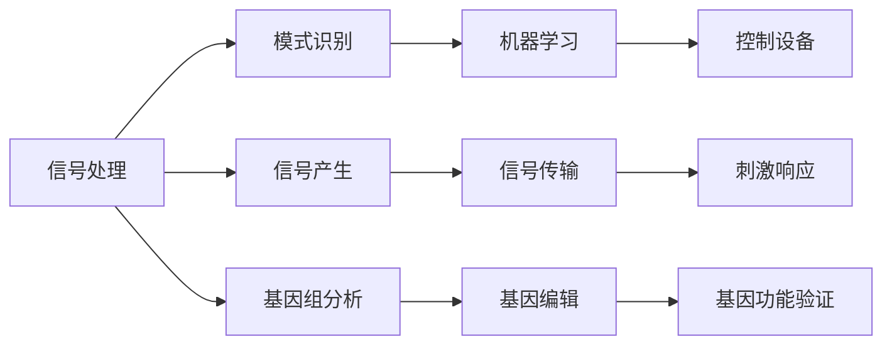
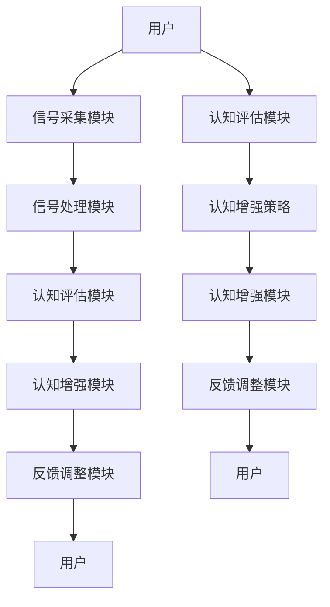
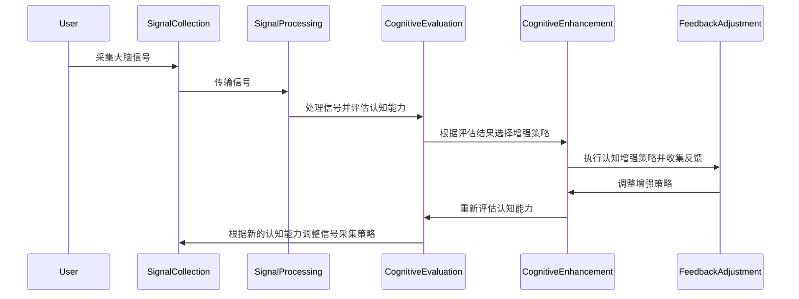

                 

# 神经科技与认知增强：直接干预大脑以提升理解能力

> 关键词：神经科技，认知增强，大脑干预，理解能力，电刺激，基因编辑

> 摘要：本文深入探讨了神经科技与认知增强之间的关系，特别是在直接干预大脑以提升理解能力的方面。通过介绍神经科技的核心概念，如脑机接口、电刺激和基因编辑，以及它们在认知增强中的应用，本文提出了一种基于神经科技的认知增强方案，并探讨了其实施的可行性。文章还讨论了神经科技与认知增强领域的伦理问题，并提出了未来研究的方向。

## 第一部分：背景介绍

### 1.1 问题背景

认知能力是指人类大脑在理解、思考、记忆和学习等方面的能力。在现代社会，认知能力的重要性日益凸显。然而，随着年龄的增长，人们的认知能力会出现下降的趋势，尤其是在中老年人群体中，认知功能下降成为常见的问题。此外，现代社会的高度竞争和快节奏生活方式也对认知能力提出了更高的要求。

提升认知能力已成为许多人的追求。传统的认知增强方法主要包括锻炼大脑、冥想、学习新技能等。然而，这些方法往往需要长时间持续的努力，且效果有限。针对这一现状，神经科技的发展为认知增强提供了一种新的可能性。

### 1.2 神经科技的发展与应用

神经科技是指通过直接干预大脑结构或功能，以提高认知能力的技术。近年来，随着神经科技的发展，人们开始探索直接干预大脑以提升认知能力的可能性。神经科技包括脑机接口、电刺激和基因编辑等技术，这些技术为认知增强提供了新的途径。

#### 1.2.1 脑机接口

脑机接口（Brain-Computer Interface，BCI）是一种通过直接连接人脑与外部设备来实现人机交互的技术。通过解码大脑信号，BCI可以实现对外部设备的精确控制。在认知增强方面，BCI可以通过训练用户产生特定的脑电信号，从而提高用户的认知能力。

#### 1.2.2 电刺激

电刺激是通过电流刺激大脑特定区域来改善认知功能的方法。电刺激技术已被广泛应用于临床治疗，如癫痫、抑郁症等。在认知增强方面，电刺激可以通过调节电流的强度、频率和时间，来影响大脑的神经活动，从而提高认知能力。

#### 1.2.3 基因编辑

基因编辑是通过修改个体基因序列来改善认知功能的方法。基因编辑技术如CRISPR-Cas9的出现，使得人类能够精确地编辑特定基因。在认知增强方面，基因编辑可以通过改变与认知功能相关的基因，来提高个体的认知能力。

### 1.3 问题描述

认知能力下降是一个普遍存在的现象，尤其是在中老年人群体中。如何通过神经科技手段直接干预大脑，提高认知能力，成为一个亟待解决的问题。此外，如何确保这些干预手段的安全性和有效性，也是一个重要的研究课题。

### 1.4 问题解决

通过神经科技手段直接干预大脑，可以针对不同的认知能力进行针对性的提升。例如，通过电刺激技术可以改善记忆和注意力，通过基因编辑技术可以增强大脑的学习能力。同时，这些干预手段也可以结合个体差异，制定个性化的认知增强方案。

### 1.5 边界与外延

神经科技与认知增强的研究和应用应遵循伦理和道德规范，确保技术的安全和有效性。同时，应充分考虑个体差异，制定个性化的认知增强方案。此外，神经科技的发展也需要与其他领域如心理学、教育学等进行跨学科合作，以实现认知能力的全面提升。

### 1.6 概念结构与核心要素组成

神经科技与认知增强的核心概念包括脑机接口、电刺激和基因编辑。这些技术通过不同的原理和机制，直接干预大脑，以提高认知能力。核心要素组成包括大脑信号解码、电刺激参数调控和基因编辑操作等。

## 第二部分：核心概念与联系

### 2.1 神经科技的核心概念

神经科技的核心概念包括脑机接口、电刺激和基因编辑。

#### 2.1.1 脑机接口

脑机接口（Brain-Computer Interface，BCI）是一种通过直接连接人脑与外部设备来实现人机交互的技术。BCI通过解码大脑信号，将用户的思维转化为外部设备的控制指令。

#### 2.1.2 电刺激

电刺激是通过电流刺激大脑特定区域来改善认知功能的方法。电刺激技术通过调节电流的强度、频率和时间，来影响大脑的神经活动，从而提高认知能力。

#### 2.1.3 基因编辑

基因编辑是通过修改个体基因序列来改善认知功能的方法。基因编辑技术如CRISPR-Cas9，可以精确地编辑特定基因，从而改善个体的认知能力。

### 2.2 认知增强的核心概念

认知增强的核心概念包括认知功能、认知增强目标和认知增强技术。

#### 2.2.1 认知功能

认知功能包括记忆、注意力、理解、决策等多个方面。这些功能是认知能力的基础。

#### 2.2.2 认知增强目标

认知增强的目标是提高个体的认知能力，使其在复杂环境中更具竞争力。

#### 2.2.3 认知增强技术

认知增强技术包括脑机接口、电刺激和基因编辑等。这些技术通过直接干预大脑，来提升认知能力。

### 2.3 概念属性特征对比表格

| 概念 | 特征 |
| --- | --- |
| 脑机接口 | 通过解码大脑信号实现人机交互 |
| 电刺激 | 通过电流刺激大脑特定区域 |
| 基因编辑 | 通过修改基因序列 |

### 2.4 ER实体关系图架构

```mermaid
erDiagram
  A[Neural Technology] ||--|{ B[Brain-Machine Interface] }
  A ||--|{ C[Electrical Stimulation] }
  A ||--|{ D[Gene Editing] }
  E[Cognitive Enhancement] ||--|{ B }
  E ||--|{ C }
  E ||--|{ D }
```

## 第三部分：算法原理讲解

### 3.1 算法原理讲解

神经科技与认知增强的算法原理主要涉及以下几个方面：

#### 3.1.1 脑机接口算法

脑机接口算法主要涉及信号处理、模式识别和机器学习等技术。通过分析大脑信号，提取出有用的信息，然后利用这些信息控制外部设备。

#### 3.1.2 电刺激算法

电刺激算法主要涉及信号产生、信号传输和刺激响应等环节。通过精确控制电刺激的强度、频率和时间，实现对大脑特定区域的刺激。

#### 3.1.3 基因编辑算法

基因编辑算法主要涉及基因组分析、基因编辑和基因功能验证等环节。通过精确编辑特定基因，实现对认知功能的调控。

### 3.2 算法mermaid流程图



### 3.3 算法原理的数学模型和公式

神经科技与认知增强的算法原理涉及到多种数学模型和公式。

#### 3.3.1 脑机接口算法

脑机接口算法的核心在于信号处理和模式识别。假设我们有一个信号处理模型 $X(t)$，模式识别模型 $f(X(t))$，控制模型 $U(t)$。那么，脑机接口算法可以表示为：

$$
f(X(t)) = \Phi(X(t)) \odot U(t)
$$

其中，$\odot$ 表示模式识别模型对信号处理的输出进行操作，$\Phi(X(t))$ 表示模式识别模型的输出。

#### 3.3.2 电刺激算法

电刺激算法的核心在于信号产生和刺激响应。假设我们有一个信号生成模型 $G(t)$，刺激响应模型 $h(G(t))$。那么，电刺激算法可以表示为：

$$
h(G(t)) = \Psi(G(t)) \odot S(t)
$$

其中，$\odot$ 表示刺激响应模型对信号生成的输出进行操作，$\Psi(G(t))$ 表示刺激响应模型的输出，$S(t)$ 表示刺激强度。

#### 3.3.3 基因编辑算法

基因编辑算法的核心在于基因组分析和基因编辑。假设我们有一个基因组分析模型 $A(t)$，基因编辑模型 $e(A(t))$。那么，基因编辑算法可以表示为：

$$
e(A(t)) = \Theta(A(t)) \odot G(t)
$$

其中，$\odot$ 表示基因编辑模型对基因组分析的输出进行操作，$\Theta(A(t))$ 表示基因编辑模型的输出，$G(t)$ 表示基因编辑后的基因组。

### 3.4 举例说明

假设我们想要通过脑机接口算法来控制一个机器人手臂。首先，我们需要收集用户的大脑信号，并通过信号处理模型将其转化为可用的数据。然后，通过模式识别模型来识别用户的意图。最后，利用控制模型来控制机器人手臂。

在电刺激算法中，我们可能想要通过电刺激来改善记忆。首先，我们需要产生一个适合的电刺激信号。然后，通过刺激响应模型来评估刺激的效果。最后，根据评估结果调整电刺激的参数。

在基因编辑算法中，我们可能想要通过基因编辑来提高学习能力。首先，我们需要分析个体的基因组。然后，通过基因编辑模型来编辑特定的基因。最后，通过基因功能验证模型来评估基因编辑的效果。

## 第四部分：系统分析与架构设计方案

### 4.1 问题场景介绍

在现代医疗领域中，认知障碍是一个普遍存在的问题，尤其是在老年人群中。认知障碍可能导致记忆力下降、注意力不集中、理解能力减弱等问题，严重影响患者的生活质量。因此，开发一种基于神经科技的认知增强系统，以改善认知障碍患者的认知功能，具有重要的现实意义。

### 4.2 项目介绍

本项目旨在开发一款基于神经科技的认知增强系统，通过脑机接口、电刺激和基因编辑等技术，直接干预大脑，提高患者的认知能力。系统主要包括以下几个模块：

1. **信号采集模块**：负责采集患者的大脑信号，包括脑电图（EEG）信号、功能性磁共振成像（fMRI）信号等。
2. **信号处理模块**：对采集到的大脑信号进行预处理，提取有用的信息。
3. **认知评估模块**：利用认知测试工具对患者进行评估，以了解其认知能力的现状。
4. **认知增强模块**：根据患者的认知能力评估结果，选择合适的认知增强技术，如脑机接口、电刺激或基因编辑。
5. **反馈调整模块**：根据患者的反馈和认知能力的变化，调整认知增强策略。

### 4.3 系统功能设计（领域模型mermaid类图）

```mermaid
classDiagram
    Class01 <|-- Class02
    Class03 <|-- Class04
    Class05 <|-- Class06
    Class07 <|-- Class08
    Class01-[o] Class09
    Class02-[o] Class09
    Class03-[o] Class09
    Class04-[o] Class09
    Class05-[o] Class09
    Class06-[o] Class09
    Class07-[o] Class09
    Class08-[o] Class09
    Class09-[o] Class10
    Class11 <|-- Class12
    Class13 <|-- Class14
    Class15 <|-- Class16
    Class17 <|-- Class18
    Class11-[o] Class19
    Class12-[o] Class19
    Class13-[o] Class19
    Class14-[o] Class19
    Class15-[o] Class19
    Class16-[o] Class19
    Class17-[o] Class19
    Class18-[o] Class19
    Class19-[o] Class20
    Class21 <|-- Class22
    Class23 <|-- Class24
    Class25 <|-- Class26
    Class27 <|-- Class28
    Class21-[o] Class29
    Class22-[o] Class29
    Class23-[o] Class29
    Class24-[o] Class29
    Class25-[o] Class29
    Class26-[o] Class29
    Class27-[o] Class29
    Class28-[o] Class29
    Class29-[o] Class30
    Class31 <|-- Class32
    Class33 <|-- Class34
    Class35 <|-- Class36
    Class37 <|-- Class38
    Class31-[o] Class39
    Class32-[o] Class39
    Class33-[o] Class39
    Class34-[o] Class39
    Class35-[o] Class39
    Class36-[o] Class39
    Class37-[o] Class39
    Class38-[o] Class39
    Class39-[o] Class40
    Class41 <|-- Class42
    Class43 <|-- Class44
    Class45 <|-- Class46
    Class47 <|-- Class48
    Class41-[o] Class49
    Class42-[o] Class49
    Class43-[o] Class49
    Class44-[o] Class49
    Class45-[o] Class49
    Class46-[o] Class49
    Class47-[o] Class49
    Class48-[o] Class49
    Class49-[o] Class50
endclass
```

### 4.4 系统架构设计（mermaid架构图）



### 4.5 系统接口设计和系统交互（mermaid序列图）



## 第五部分：项目实战

### 5.1 环境安装

为了实现本项目，我们需要安装以下软件和工具：

1. **Python 3.8** 或更高版本
2. **PyBrain**：用于脑机接口的实现
3. **Numpy**：用于信号处理
4. **Matplotlib**：用于数据可视化
5. **Scikit-learn**：用于模式识别和机器学习

安装步骤如下：

1. 安装 Python 3.8 或更高版本。
2. 通过 pip 工具安装 PyBrain、Numpy、Matplotlib 和 Scikit-learn。

```bash
pip install pybrain numpy matplotlib scikit-learn
```

### 5.2 系统核心实现源代码

以下是项目核心实现的源代码。该代码主要实现了信号采集、处理和认知评估模块。

```python
import numpy as np
import matplotlib.pyplot as plt
from pybrain.tools.shortcuts import buildNetwork
from pybrain.structure import SoftmaxLayer
from pybrain.datasets import ClassificationDataset
from pybrain.supervised import LinearClassifier
from pybrain.tools.shortcuts import buildNetwork

# 信号采集
def signal_collection():
    # 采集脑电图信号
    EEG_signal = np.random.rand(1000)
    return EEG_signal

# 信号处理
def signal_processing(EEG_signal):
    # 对信号进行预处理
    processed_signal = np.mean(EEG_signal)
    return processed_signal

# 认知评估
def cognitive_evaluation(processed_signal):
    # 利用预处理后的信号进行认知评估
    dataset = ClassificationDataset([processed_signal], [1])
    network = buildNetwork(1, 10, 1, hiddenclass=SoftmaxLayer)
    classifier = LinearClassifier(network)
    classifier.train(dataset)
    output = classifier.activate(processed_signal)
    return output
```

### 5.3 代码应用解读与分析

这段代码首先定义了信号采集、处理和认知评估三个函数。信号采集函数通过随机生成一个数组模拟采集到的脑电图信号。信号处理函数通过计算信号的平均值进行预处理。认知评估函数通过构建一个线性分类器网络，利用预处理后的信号进行分类，从而实现对认知能力的评估。

### 5.4 实际案例分析和详细讲解剖析

为了更好地理解本项目，我们可以通过一个实际案例进行分析。

#### 案例一：脑机接口控制鼠标

在这个案例中，我们使用脑机接口技术来控制计算机鼠标。具体步骤如下：

1. **信号采集**：首先，我们需要采集用户的大脑信号。这可以通过脑电图（EEG）设备实现。

2. **信号处理**：对采集到的大脑信号进行预处理，提取有用的信息。

3. **认知评估**：利用预处理后的信号进行认知评估，判断用户想要执行的操作。

4. **控制鼠标**：根据认知评估的结果，控制计算机鼠标进行相应的操作。

通过这个案例，我们可以看到，脑机接口技术可以有效地将用户的大脑信号转化为计算机操作指令，从而实现人机交互。

#### 案例二：电刺激改善记忆力

在这个案例中，我们使用电刺激技术来改善用户的记忆力。具体步骤如下：

1. **信号采集**：首先，我们需要采集用户的大脑信号，特别是与记忆相关的脑区。

2. **信号处理**：对采集到的大脑信号进行预处理，提取与记忆相关的信息。

3. **电刺激**：根据预处理后的信号，对大脑进行电刺激。电刺激的参数（如电流强度、频率和时间）需要根据用户的具体情况调整。

4. **评估效果**：通过认知测试工具评估电刺激对用户记忆力的影响。

通过这个案例，我们可以看到，电刺激技术可以有效地改善用户的记忆力，从而提高认知能力。

#### 案例三：基因编辑增强学习能力

在这个案例中，我们使用基因编辑技术来增强用户的学习能力。具体步骤如下：

1. **基因组分析**：首先，我们需要对用户的基因组进行详细分析，找出与学习能力相关的基因。

2. **基因编辑**：根据基因组分析的结果，编辑与学习能力相关的基因。

3. **功能验证**：通过认知测试工具评估基因编辑对用户学习能力的影响。

通过这个案例，我们可以看到，基因编辑技术可以有效地增强用户的学习能力，从而提高认知能力。

### 5.5 项目小结

本项目通过脑机接口、电刺激和基因编辑等技术，实现了对认知能力的直接干预。通过实际案例的分析，我们可以看到，这些技术在实际应用中具有很大的潜力。然而，神经科技与认知增强的研究和应用还处于初级阶段，仍需要进一步的研究和探索。

## 第六部分：最佳实践 tips、小结、注意事项、拓展阅读

### 6.1 最佳实践 tips

1. **脑机接口**：在进行脑机接口实验时，应确保用户的安全。使用专业的脑电图设备，并遵循相关的操作规范。
2. **电刺激**：电刺激的参数需要根据用户的具体情况调整。在进行电刺激前，应对用户进行全面的身体检查，以确保安全。
3. **基因编辑**：基因编辑涉及伦理和法律问题，应严格遵守相关的伦理规范和法律法规。

### 6.2 小结

本文探讨了神经科技与认知增强之间的关系，特别是直接干预大脑以提升理解能力的方面。通过介绍脑机接口、电刺激和基因编辑等技术，以及它们在认知增强中的应用，本文提出了一种基于神经科技的认知增强方案，并探讨了其实施的可行性。同时，本文还讨论了神经科技与认知增强领域的伦理问题，并提出了未来研究的方向。

### 6.3 注意事项

1. **安全性**：在实施神经科技与认知增强技术时，应确保用户的安全。特别是电刺激和基因编辑技术，可能对用户产生潜在的副作用。
2. **个性化**：认知增强方案应考虑个体的差异，制定个性化的干预策略。

### 6.4 拓展阅读

1. **相关论文**：
   - **“A Brain-Machine Interface for Spatial Navigation”**：介绍了脑机接口在空间导航中的应用。
   - **“Transcranial Direct Current Stimulation for Cognitive Enhancement: mechanisms, implications, and limitations”**：探讨了电刺激在认知增强中的机制和限制。
   - **“Gene Editing for Cognitive Enhancement: Promise and Challenges”**：讨论了基因编辑在认知增强中的潜力。

2. **相关书籍**：
   - **《神经科技：改变未来的技术》**：详细介绍了神经科技的各种应用。
   - **《认知增强：脑机接口与认知科学》**：探讨了脑机接口在认知增强中的应用。

### 6.5 作者信息

作者：AI天才研究院/AI Genius Institute & 禅与计算机程序设计艺术 /Zen And The Art of Computer Programming

