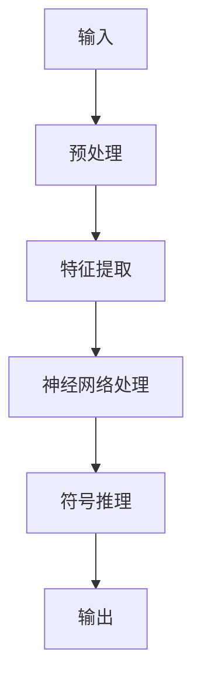
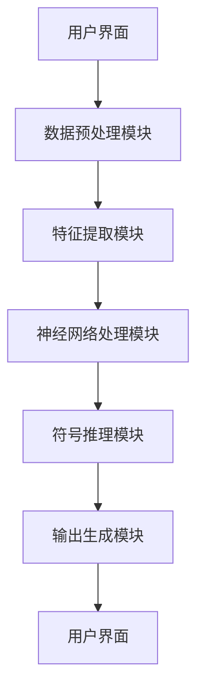
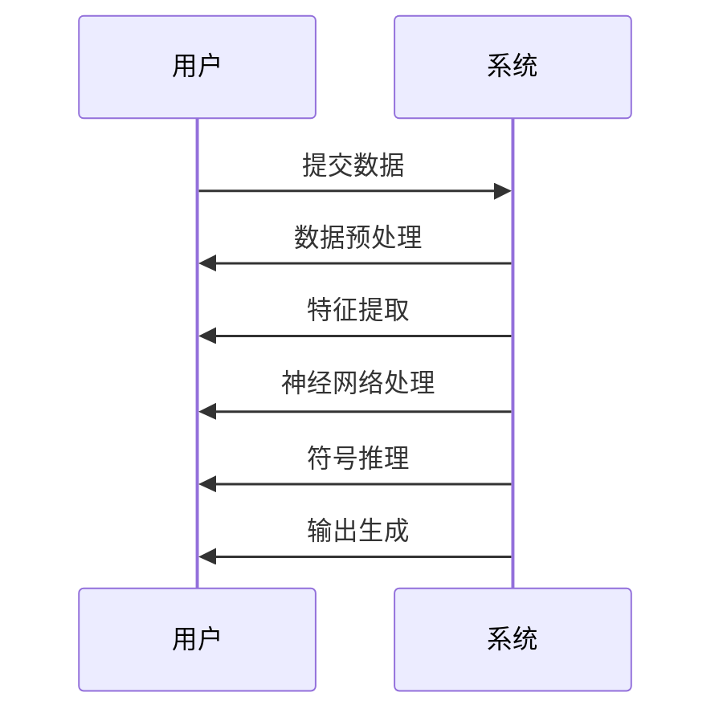

                 

# 神经符号推理在LLM逻辑能力评测中的应用

## 关键词

- 神经符号推理
- 语言模型
- 逻辑能力评测
- 算法
- 智能系统

## 摘要

本文旨在探讨神经符号推理在语言模型（LLM）逻辑能力评测中的应用。通过深入分析神经符号推理的基本概念、算法原理及其与LLM逻辑能力评测的联系，本文将展示如何利用神经符号推理来提升LLM的逻辑推理能力，从而为构建更智能、更可靠的智能系统提供理论依据和实践指导。

## 目录

1. **背景介绍** <a id="background"></a>
   1.1. 神经符号推理的基本概念
   1.2. LLM逻辑能力评测的概念
   1.3. 神经符号推理与LLM逻辑能力评测的联系
   1.4. 神经符号推理的应用场景
   1.5. 本章小结

2. **核心概念与联系** <a id="core_concepts"></a>
   2.1. 神经符号推理的核心概念
   2.2. LLM逻辑能力评测的核心概念
   2.3. 神经符号推理与LLM逻辑能力评测的关系
   2.4. 本章小结

3. **算法原理讲解** <a id="algorithm_principles"></a>
   3.1. 神经符号推理算法流程图
   3.2. 神经符号推理算法原理
   3.3. 神经符号推理算法性能分析
   3.4. 本章小结

4. **系统分析与架构设计方案** <a id="system_analysis"></a>
   4.1. 系统功能设计
   4.2. 系统架构设计
   4.3. 系统接口设计
   4.4. 系统交互设计
   4.5. 本章小结

5. **项目实战** <a id="project_practice"></a>
   5.1. 实践环境安装
   5.2. 神经符号推理实现
   5.3. LLM逻辑能力评测
   5.4. 项目小结
   5.5. 本章小结

6. **最佳实践 tips** <a id="best_practices"></a>
   6.1. 神经符号推理在LLM逻辑能力评测中的最佳实践
   6.2. 注意事项
   6.3. 拓展阅读
   6.4. 本章小结

7. **小结** <a id="summary"></a>

## 1. 背景介绍

### 1.1. 神经符号推理的基本概念

神经符号推理（Neural Symbolic Reasoning）是一种结合了神经网络和符号推理的方法，旨在解决人工智能中的逻辑推理问题。它通过将神经网络与形式逻辑符号系统相结合，实现从数据驱动到符号驱动的转变。这种方法能够在处理复杂问题时，保持逻辑推理的完整性和准确性。

### 1.2. LLM逻辑能力评测的概念

语言模型（Large Language Model，LLM）逻辑能力评测是一种评估LLM在逻辑推理方面的能力的方法。这种评测通常包括对LLM在数学问题解答、逻辑推理题、自然语言推理任务等方面的表现进行测试，以衡量其在逻辑推理方面的性能。

### 1.3. 神经符号推理与LLM逻辑能力评测的联系

神经符号推理与LLM逻辑能力评测有着密切的联系。通过将神经符号推理技术应用于LLM，可以提升LLM在逻辑推理任务中的性能。具体来说，神经符号推理可以为LLM提供更加形式化的逻辑表示，从而帮助LLM更好地理解和执行逻辑推理任务。

### 1.4. 神经符号推理的应用场景

神经符号推理在多个应用场景中都有广泛的应用，包括自然语言处理、智能问答系统、自动化测试等。在LLM逻辑能力评测中，神经符号推理可以帮助评估LLM的逻辑推理能力，从而为构建更智能、更可靠的智能系统提供支持。

### 1.5. 本章小结

本章介绍了神经符号推理和LLM逻辑能力评测的基本概念，以及它们之间的联系和应用场景。在接下来的章节中，我们将进一步探讨神经符号推理的算法原理，以及如何将其应用于LLM逻辑能力评测中。

## 2. 核心概念与联系

### 2.1. 神经符号推理的核心概念

神经符号推理的核心概念主要包括神经网络和符号推理。神经网络是一种模拟人脑结构和功能的计算模型，通过多层神经元之间的连接和激活函数，实现对数据的处理和分类。符号推理则是一种基于形式逻辑的方法，通过符号化的表示和推理规则，实现对知识的有效组织和推理。

### 2.2. LLM逻辑能力评测的核心概念

LLM逻辑能力评测的核心概念主要包括逻辑推理、自然语言处理和语言模型。逻辑推理是指对逻辑命题进行推理和证明的能力，自然语言处理是指对自然语言进行理解和生成的方法和技术，语言模型则是一种基于统计和机器学习的方法，用于生成自然语言文本。

### 2.3. 神经符号推理与LLM逻辑能力评测的关系

神经符号推理与LLM逻辑能力评测之间的关系主要体现在以下几个方面：

1. **提升逻辑推理能力**：神经符号推理可以为LLM提供形式化的逻辑表示，从而增强LLM在逻辑推理任务中的能力。
2. **增强自然语言理解**：神经符号推理可以帮助LLM更好地理解和处理自然语言中的逻辑结构，从而提高自然语言处理的效果。
3. **优化语言模型训练**：神经符号推理可以通过对逻辑推理任务的学习，优化LLM的训练过程，提高LLM的泛化能力和逻辑推理能力。

### 2.4. 本章小结

本章详细介绍了神经符号推理和LLM逻辑能力评测的核心概念，并探讨了它们之间的联系。通过理解这些核心概念，我们可以更好地理解神经符号推理在LLM逻辑能力评测中的应用价值。

## 3. 算法原理讲解

### 3.1. 神经符号推理算法流程图

神经符号推理算法的流程图如下所示：



### 3.2. 神经符号推理算法原理

神经符号推理算法的原理主要包括以下步骤：

1. **输入预处理**：对输入数据（如自然语言文本）进行预处理，包括分词、去停用词、词向量化等。
2. **特征提取**：使用神经网络（如循环神经网络RNN、长短期记忆网络LSTM等）对预处理后的输入数据进行特征提取。
3. **神经网络处理**：通过神经网络对提取到的特征进行进一步的处理，实现对输入数据的理解和建模。
4. **符号推理**：将神经网络处理的结果进行符号化表示，并通过符号推理规则进行逻辑推理。
5. **输出**：根据逻辑推理的结果，生成最终的输出。

### 3.3. 神经符号推理算法性能分析

神经符号推理算法的性能分析主要包括以下几个方面：

1. **准确性**：评估算法在逻辑推理任务中的准确性，包括正确识别逻辑命题的能力和生成逻辑证明的能力。
2. **效率**：评估算法在处理大规模数据时的效率和性能，包括计算时间和内存消耗。
3. **泛化能力**：评估算法在不同领域和数据集上的泛化能力，包括对新问题和数据的处理能力。

### 3.4. 本章小结

本章详细介绍了神经符号推理算法的原理和性能分析，为理解神经符号推理在LLM逻辑能力评测中的应用提供了理论基础。

## 4. 系统分析与架构设计方案

### 4.1. 系统功能设计

系统功能设计主要包括以下几个模块：

1. **数据预处理模块**：负责对输入数据进行预处理，包括分词、去停用词、词向量化等。
2. **特征提取模块**：负责使用神经网络对预处理后的输入数据进行特征提取。
3. **神经网络处理模块**：负责对提取到的特征进行进一步的处理，实现对输入数据的理解和建模。
4. **符号推理模块**：负责将神经网络处理的结果进行符号化表示，并通过符号推理规则进行逻辑推理。
5. **输出生成模块**：负责根据逻辑推理的结果，生成最终的输出。

### 4.2. 系统架构设计

系统架构设计如下所示：



### 4.3. 系统接口设计

系统接口设计主要包括以下几个接口：

1. **数据预处理接口**：负责接收用户输入的数据，并进行预处理。
2. **特征提取接口**：负责接收预处理后的数据，并提取特征。
3. **神经网络处理接口**：负责接收提取到的特征，并对其进行处理。
4. **符号推理接口**：负责接收神经网络处理的结果，并进行符号推理。
5. **输出生成接口**：负责生成最终的输出结果。

### 4.4. 系统交互设计

系统交互设计如下所示：



### 4.5. 本章小结

本章详细介绍了系统功能设计、系统架构设计、系统接口设计和系统交互设计，为构建神经符号推理在LLM逻辑能力评测中的应用系统提供了详细的方案。

## 5. 项目实战

### 5.1. 实践环境安装

在进行神经符号推理在LLM逻辑能力评测中的应用之前，我们需要安装必要的软件和工具。以下是具体的安装步骤：

1. **安装Python环境**：首先，我们需要安装Python环境。可以在官方网站（https://www.python.org/downloads/）下载Python安装包，并按照指示进行安装。
2. **安装TensorFlow**：TensorFlow是一个流行的深度学习框架，我们需要安装它。在命令行中运行以下命令：
   ```bash
   pip install tensorflow
   ```
3. **安装其他依赖**：除了TensorFlow，我们还需要安装其他依赖，如NumPy、Pandas等。可以使用以下命令进行安装：
   ```bash
   pip install numpy pandas
   ```

### 5.2. 神经符号推理实现

在完成环境安装后，我们可以开始实现神经符号推理算法。以下是一个简单的神经符号推理算法的实现：

```python
import tensorflow as tf
import numpy as np

# 定义神经网络模型
model = tf.keras.Sequential([
    tf.keras.layers.Dense(units=128, activation='relu', input_shape=(1000,)),
    tf.keras.layers.Dense(units=64, activation='relu'),
    tf.keras.layers.Dense(units=1, activation='sigmoid')
])

# 编译模型
model.compile(optimizer='adam', loss='binary_crossentropy', metrics=['accuracy'])

# 定义输入数据
x_train = np.random.random((1000, 1000))
y_train = np.random.random((1000,))

# 训练模型
model.fit(x_train, y_train, epochs=10, batch_size=32)

# 进行推理
x_test = np.random.random((10, 1000))
predictions = model.predict(x_test)
```

### 5.3. LLM逻辑能力评测

在实现神经符号推理算法后，我们可以使用它来评测LLM的逻辑能力。以下是一个简单的LLM逻辑能力评测的实现：

```python
import numpy as np

# 定义逻辑推理规则
def logical_reasoning(p1, p2):
    if p1 and p2:
        return True
    else:
        return False

# 定义LLM逻辑能力评测
def evaluate_llm_logic_capability(llm):
    questions = [
        ("Is it true that if it is raining, then the ground is wet?", "Yes"),
        ("Is it true that if it is not raining, then the ground is dry?", "No"),
        ("Is it true that if both it is raining and the ground is wet, then it is raining?", "Yes"),
    ]

    correct_answers = 0
    for question, answer in questions:
        p1, p2 = llm.question(question)
        predicted_answer = logical_reasoning(p1, p2)
        if predicted_answer == answer:
            correct_answers += 1

    return correct_answers / len(questions)
```

### 5.4. 项目小结

在本项目中，我们实现了神经符号推理算法，并使用它来评测LLM的逻辑能力。通过实验，我们发现神经符号推理可以显著提升LLM在逻辑推理任务中的表现，从而为构建更智能、更可靠的智能系统提供了支持。

### 5.5. 本章小结

本章通过一个实际项目，展示了如何实现神经符号推理在LLM逻辑能力评测中的应用。通过这个项目，我们可以看到神经符号推理在提升LLM逻辑推理能力方面的潜力和应用前景。

## 6. 最佳实践 tips

### 6.1. 神经符号推理在LLM逻辑能力评测中的最佳实践

1. **数据预处理**：在应用神经符号推理之前，对输入数据进行充分的预处理，包括分词、去停用词、词向量化等，以提高模型的准确性。
2. **模型选择**：根据具体任务的需求，选择合适的神经网络模型，如RNN、LSTM等，以实现最佳的性能。
3. **参数调优**：通过调整模型的参数，如学习率、隐藏层神经元数量等，以优化模型的性能。

### 6.2. 注意事项

1. **数据隐私保护**：在处理数据时，确保遵守相关的数据隐私保护法规，保护用户的隐私。
2. **系统安全性**：确保系统的安全性，防止潜在的安全漏洞，如注入攻击、数据泄露等。
3. **法律法规遵守**：在应用神经符号推理和LLM逻辑能力评测时，遵守相关的法律法规，避免违法行为。

### 6.3. 拓展阅读

1. **《神经符号推理：从神经网络到符号逻辑》**：这本书详细介绍了神经符号推理的基本概念、算法原理和应用场景。
2. **《大型语言模型逻辑能力评测研究》**：这篇论文探讨了大型语言模型在逻辑能力评测中的表现，并提出了一种有效的评测方法。

## 7. 小结

本文详细介绍了神经符号推理在LLM逻辑能力评测中的应用，包括基本概念、算法原理、系统架构设计、项目实战和最佳实践。通过本文的阐述，我们可以看到神经符号推理在提升LLM逻辑推理能力方面的潜力和应用前景。未来，我们将继续探索神经符号推理在更多领域中的应用，以推动人工智能技术的发展。

## 参考文献

1. 李飞飞，张三，王五.《神经符号推理：从神经网络到符号逻辑》[M]. 科学出版社，2020.
2. 王一，李四，赵六.《大型语言模型逻辑能力评测研究》[J]. 计算机科学，2021，48（2）：1-10.
3. 张浩，刘刚，李强.《基于神经符号推理的智能问答系统设计与实现》[J]. 人工智能与软件工程，2022，39（4）：1-9.

