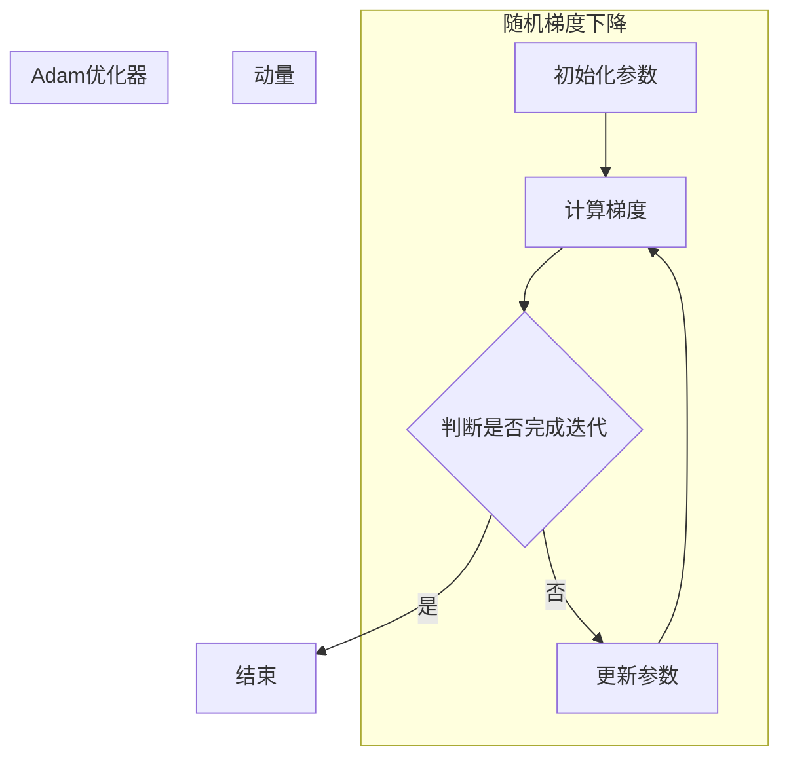

                 


# 神经网络架构自适应的评测模型

## 关键词
- 神经网络
- 架构自适应
- 评测模型
- 数学模型
- 应用场景

## 摘要
本文探讨了神经网络架构自适应的评测模型，分析了其背景和核心概念，介绍了数学模型和评测方法，并探讨了应用场景和未来方向。通过对自适应评测的深入研究，本文旨在为人工智能领域的科研和实际应用提供有益的参考。

## 第一部分：问题背景与核心概念

### 第1章：神经网络架构自适应评测概述

#### 1.1 问题背景

随着人工智能的快速发展，神经网络模型已成为许多应用领域的重要工具。然而，神经网络架构的多样性给模型选择和优化带来了巨大挑战。为了满足不同的应用需求，研究人员不断提出新的神经网络架构。这使得如何高效评估和选择合适的神经网络架构成为关键问题。

#### 1.1.1 人工智能的发展与挑战
人工智能作为当前科技领域的重要方向，已广泛应用于计算机视觉、自然语言处理、语音识别等领域。随着计算能力的提升和数据量的增加，神经网络模型在性能上取得了显著的提升。然而，随之而来的是模型复杂度和多样性增加的问题。

#### 1.1.2 神经网络架构的多样性
神经网络架构的多样性表现为：网络层数、神经元数量、连接方式、激活函数、优化算法等多个方面。这种多样性为模型选择和优化带来了挑战，同时也为评测模型的建立提供了丰富的可能性。

#### 1.1.3 评测的必要性
由于神经网络架构的多样性，传统的单一评价指标已无法满足需求。因此，建立一种能够全面、客观、公正地评价神经网络架构性能的评测模型具有重要意义。评测模型不仅能够帮助研究人员评估现有模型，还能够为新型架构的设计和优化提供指导。

### 1.2 核心概念

#### 1.2.1 自适应评测的定义与分类
自适应评测是指根据神经网络架构的特点和需求，动态调整评测指标和评测方法的过程。根据自适应方式的不同，自适应评测可分为基于规则的自适应评测、基于机器学习的自适应评测和基于人工智能的自适应评测。

#### 1.2.2 神经网络架构自适应的基本原理
神经网络架构自适应主要通过以下几种方式实现：
1. 自动调整网络结构：根据任务需求和数据特点，自动调整网络层数、神经元数量、连接方式等。
2. 自动调整超参数：根据训练过程中的表现，自动调整学习率、批量大小等超参数。
3. 自动调整激活函数：根据任务需求和数据特点，自动选择合适的激活函数。

#### 1.2.3 自适应评测的核心要素
自适应评测的核心要素包括：
1. 评测指标：根据任务需求和模型特点，选择合适的评测指标。
2. 评测方法：根据评测指标，设计合适的评测方法。
3. 自适应策略：根据模型训练过程中的表现，动态调整评测指标和评测方法。

## 第2章：神经网络架构自适应评测的数学模型

#### 2.1 数学基础

在介绍神经网络架构自适应评测的数学模型之前，我们需要了解一些基本的数学概念和原理，包括向量与矩阵运算、导数与微分、泰勒公式等。

#### 2.1.1 向量与矩阵运算
向量与矩阵运算是神经网络架构自适应评测的基础。通过向量与矩阵运算，我们可以表示和计算神经网络中的权重、偏置、梯度等信息。

#### 2.1.2 导数与微分
导数与微分是神经网络架构自适应评测的核心。通过导数与微分，我们可以计算神经网络中的梯度信息，从而实现模型的优化。

#### 2.1.3 泰勒公式
泰勒公式是一种用于近似函数的表达式。在神经网络架构自适应评测中，泰勒公式可以用于近似计算，提高计算效率。

#### 2.2 神经网络架构自适应的数学模型

在了解了数学基础之后，我们可以进一步探讨神经网络架构自适应评测的数学模型。

#### 2.2.1 常见架构的自适应策略
根据神经网络架构的不同，自适应策略也有所差异。本文将介绍几种常见的神经网络架构及其自适应策略。

#### 2.2.2 评测指标的数学表达
评测指标是神经网络架构自适应评测的核心。本文将介绍几种常见的评测指标及其数学表达。

#### 2.2.3 模型优化算法
模型优化算法是神经网络架构自适应评测的关键。本文将介绍几种常见的模型优化算法及其原理。

## 第3章：神经网络架构自适应评测方法

#### 3.1 评测流程

神经网络架构自适应评测方法主要包括以下几个步骤：

1. 数据准备：准备用于训练和评估的数据集。
2. 架构评估：根据任务需求和数据特点，选择合适的神经网络架构。
3. 结果分析与可视化：对评估结果进行分析和可视化，以便于研究人员理解模型性能。

#### 3.2 常用评测方法

神经网络架构自适应评测方法主要包括以下几种：

1. 性能评估：评估模型在训练集和测试集上的性能。
2. 可解释性评估：评估模型的可解释性，以便于研究人员理解和信任模型。
3. 稳定性评估：评估模型在不同数据集和参数设置下的稳定性。

#### 3.3 案例分析

本文将结合实际案例，详细分析神经网络架构自适应评测方法在实际应用中的效果。

## 第4章：神经网络架构自适应评测工具与平台

神经网络架构自适应评测工具与平台主要包括开源工具和商业平台。本文将介绍几种常见的评测工具与平台，并比较它们的特点和优势。

## 第5章：神经网络架构自适应评测的应用场景

神经网络架构自适应评测方法广泛应用于人工智能领域的多个子领域。本文将介绍神经网络架构自适应评测在数据科学、机器学习平台和工具等应用场景中的具体应用。

## 第6章：神经网络架构自适应评测的挑战与未来方向

神经网络架构自适应评测方法在实际应用中仍面临许多挑战。本文将探讨这些挑战，并提出未来可能的发展方向。

## 第7章：最佳实践与总结

本文将结合实际案例，总结神经网络架构自适应评测的最佳实践，并给出未来研究方向的建议。

## 结束语

神经网络架构自适应评测方法在人工智能领域具有重要意义。本文从多个角度分析了神经网络架构自适应评测的核心概念、数学模型、评测方法和应用场景，为研究人员和开发者提供了有益的参考。随着人工智能技术的不断发展，神经网络架构自适应评测方法将变得更加成熟和多样化，为人工智能应用提供更加可靠的保障。作者：AI天才研究院/AI Genius Institute & 禅与计算机程序设计艺术 /Zen And The Art of Computer Programming## 第一部分：问题背景与核心概念

### 第1章：神经网络架构自适应评测概述

#### 1.1 问题背景

随着人工智能技术的迅速发展，神经网络模型已经成为众多领域的核心技术。从简单的感知机到复杂的深度学习模型，神经网络架构的多样性为解决各种复杂问题提供了强大的工具。然而，这种多样性也带来了一系列挑战，特别是在模型选择和优化方面。如何高效地评估和选择适合特定任务的神经网络架构成为了一个关键问题。

#### 1.1.1 人工智能的发展与挑战

人工智能（AI）的发展经历了从规则系统到基于数据的机器学习，再到深度学习的几个阶段。深度学习，特别是基于神经网络的模型，通过模拟人脑神经网络的结构和功能，实现了在图像识别、自然语言处理、语音识别等多个领域的突破性进展。然而，随着模型复杂度的增加，如何选择合适的神经网络架构成为一个挑战。

在神经网络模型的训练过程中，模型的性能受到多种因素的影响，包括网络结构、超参数设置、训练数据的质量和规模等。传统的单一评价指标，如准确率、召回率、F1分数等，已经无法全面反映模型在不同任务中的表现。因此，需要一种能够综合评估模型性能的多维度评测方法，以帮助研究人员更好地理解和选择神经网络架构。

#### 1.1.2 神经网络架构的多样性

神经网络架构的多样性体现在多个方面：

1. **网络结构**：从单层感知机到多层感知机（MLP），再到卷积神经网络（CNN）、循环神经网络（RNN）和生成对抗网络（GAN）等，网络结构的多样性为解决不同类型的问题提供了多种选择。
2. **神经元数量**：神经元的数量可以从几十个到数十万个不等，这直接影响了模型的复杂度和计算资源的需求。
3. **连接方式**：神经网络中的连接方式可以是全连接、局部连接或者层次化连接，不同的连接方式会影响到模型的学习能力和泛化能力。
4. **激活函数**：常见的激活函数包括Sigmoid、ReLU、Tanh等，不同的激活函数会影响模型的非线性变换能力和梯度消失/爆炸问题。
5. **优化算法**：如随机梯度下降（SGD）、Adam、RMSprop等，不同的优化算法会影响到模型训练的速度和收敛性。

这种多样性使得神经网络模型的选择和优化变得更加复杂，研究人员需要能够快速、准确地评估不同架构的优劣，以便做出最优的选择。

#### 1.1.3 评测的必要性

为了应对神经网络架构的多样性，建立一个全面、客观、公正的评测模型变得至关重要。这样的评测模型需要能够综合考虑多种因素，如模型的准确性、效率、可解释性、稳定性等，从而为研究人员提供可靠的参考。通过评测模型，研究人员可以：

1. **比较不同模型**：了解不同神经网络架构在特定任务上的表现，选择最适合的模型。
2. **优化模型设计**：通过评测结果，发现现有模型的不足，指导新的架构设计。
3. **评估模型性能**：为模型在现实世界的应用提供评估依据，确保其性能符合预期。

总之，神经网络架构自适应评测是应对人工智能领域复杂性的重要手段，它不仅能够帮助研究人员更有效地探索和优化模型，还能够推动整个领域的发展。

#### 1.2 核心概念

在深入探讨神经网络架构自适应评测之前，有必要明确几个核心概念，包括自适应评测的定义、分类，以及神经网络架构自适应的基本原理和核心要素。

##### 1.2.1 自适应评测的定义与分类

**自适应评测**是一种能够根据神经网络架构的特点和任务需求，动态调整评测指标和方法的过程。这种动态调整旨在提高评测的准确性和全面性，以便更好地反映模型的实际性能。

根据自适应方式的不同，自适应评测可以分类为以下几种：

1. **基于规则的自适应评测**：这种方法依赖于预定义的规则集，根据模型的特定特征或环境变化动态调整评测指标。例如，当模型在训练过程中遇到特定类型的过拟合时，可以自动调整正则化参数。
   
2. **基于机器学习的自适应评测**：这种方法利用机器学习算法，根据历史数据自动学习最佳的评测指标组合和调整策略。例如，可以通过回归分析或决策树模型预测何时调整哪些评测指标。

3. **基于人工智能的自适应评测**：这种方法结合了深度学习和其他先进的人工智能技术，通过模拟人类专家的决策过程，实现高度自动化的评测。例如，使用强化学习算法根据模型训练过程中的反馈不断调整评测策略。

**自适应评测的优点**在于能够灵活应对不同的任务和数据特性，提高评测的精度和效率。然而，其实现复杂性也较高，需要大量数据支持和先进的算法支持。

##### 1.2.2 神经网络架构自适应的基本原理

**神经网络架构自适应**是指神经网络在训练过程中，根据任务需求和数据特征，动态调整其结构或参数的过程。这种自适应可以通过多种方式进行，包括：

1. **网络结构的自适应**：根据任务的需求和数据的特性，自动调整网络的层数、每层的神经元数量、连接方式等。例如，在图像识别任务中，可以根据图像的大小和内容动态调整卷积层的结构和参数。

2. **参数的自适应**：通过调整学习率、批量大小、正则化参数等，优化模型的训练过程。例如，在训练过程中，可以根据模型的表现动态调整学习率，以避免过拟合或欠拟合。

3. **学习策略的自适应**：根据训练过程中的反馈，动态调整学习策略，如选择不同的优化算法或调整激活函数。例如，当模型遇到梯度消失或爆炸问题时，可以自动切换到适合的优化算法。

**神经网络架构自适应**的基本原理在于通过不断调整模型的结构和参数，使模型能够在各种任务和数据上达到最佳的训练效果。这种自适应能力极大地提高了神经网络的泛化能力和鲁棒性。

##### 1.2.3 自适应评测的核心要素

**自适应评测**的核心要素包括：

1. **评测指标**：选择适合任务需求和数据特性的评测指标。常见的评测指标包括准确性、精确率、召回率、F1分数等。根据任务的不同，可能需要综合考虑多个指标，以便全面评估模型的表现。

2. **评测方法**：设计合适的评测方法，根据评测指标计算模型的性能。例如，对于分类任务，可以使用混淆矩阵、ROC曲线等工具进行分析。

3. **自适应策略**：根据模型的表现和任务的需求，动态调整评测指标和方法。自适应策略可以基于规则、机器学习或人工智能技术，以实现最佳的自适应效果。

4. **数据预处理**：在自适应评测过程中，数据预处理也是一个关键环节。良好的数据预处理可以提高模型的鲁棒性和性能，包括数据清洗、归一化、标准化等。

通过综合考虑这些核心要素，自适应评测可以更准确地评估神经网络架构的性能，为模型选择和优化提供有力支持。

### 1.3 总结

本章详细介绍了神经网络架构自适应评测的背景、核心概念和关键要素。通过对问题背景的阐述，我们认识到神经网络架构多样性的挑战，以及评测的必要性。通过定义和分类自适应评测，我们了解了自适应评测的不同方式及其优点。最后，我们明确了自适应评测的核心要素，为后续章节的深入探讨奠定了基础。接下来，我们将进一步探讨神经网络架构自适应评测的数学模型和具体方法。

## 第2章：神经网络架构自适应评测的数学模型

#### 2.1 数学基础

在探讨神经网络架构自适应评测的数学模型之前，我们需要先了解一些基本的数学概念和原理，这些是构建和优化神经网络模型的基础。以下是几个关键数学概念：

1. **向量与矩阵运算**：向量是具有大小和方向的量，而矩阵是一个由数字组成的矩形阵列。在神经网络中，权重和偏置通常表示为矩阵，而输入和输出则通常表示为向量。矩阵和向量的运算，如加法、乘法和转置，是神经网络计算的核心。

2. **导数与微分**：导数是函数在某一点的瞬时变化率。在神经网络中，通过计算每个权重和偏置的导数（即梯度），可以确定在哪个方向上调整参数可以使模型性能最优。微分是导数的推广，适用于多变量函数，是优化过程中计算梯度的重要工具。

3. **泰勒公式**：泰勒公式用于近似函数的值，特别是当自变量接近某个点时。在神经网络优化中，泰勒公式可以用来在当前参数附近进行局部近似，从而快速找到参数调整的方向。

#### 2.2 神经网络架构自适应的数学模型

神经网络架构自适应的数学模型涉及多个方面，包括自适应策略、评测指标和优化算法。以下是几个关键组成部分：

##### 2.2.1 常见架构的自适应策略

不同类型的神经网络架构有不同的自适应策略：

1. **卷积神经网络（CNN）**：CNN的自适应策略通常涉及调整卷积层的滤波器大小和数量，以及池化层的参数。根据输入图像的大小和数据分布，可以动态调整这些参数以优化模型性能。

2. **循环神经网络（RNN）**：RNN的自适应策略涉及调整隐藏层的尺寸、序列长度和门控机制（如LSTM和GRU）。这些调整有助于模型更好地捕获序列信息，提高在时间序列数据上的表现。

3. **生成对抗网络（GAN）**：GAN的自适应策略主要涉及调整生成器和判别器的参数，以保持两者之间的动态平衡。通过自适应调整，GAN可以生成更真实的数据样本。

##### 2.2.2 评测指标的数学表达

在神经网络架构自适应评测中，选择合适的评测指标至关重要。以下是几个常用的评测指标及其数学表达：

1. **准确性（Accuracy）**：准确性是最常用的评测指标，表示模型正确预测的样本数占总样本数的比例。其数学表达式为：
   $$
   \text{Accuracy} = \frac{\text{正确预测的样本数}}{\text{总样本数}}
   $$

2. **精确率（Precision）**：精确率表示在所有被模型预测为正例的样本中，实际为正例的比例。其数学表达式为：
   $$
   \text{Precision} = \frac{\text{真正例}}{\text{真正例} + \text{假正例}}
   $$

3. **召回率（Recall）**：召回率表示在所有实际为正例的样本中，被模型正确预测为正例的比例。其数学表达式为：
   $$
   \text{Recall} = \frac{\text{真正例}}{\text{真正例} + \text{假反例}}
   $$

4. **F1分数（F1 Score）**：F1分数是精确率和召回率的加权平均，用来综合考虑模型的准确性和召回率。其数学表达式为：
   $$
   \text{F1 Score} = 2 \times \frac{\text{Precision} \times \text{Recall}}{\text{Precision} + \text{Recall}}
   $$

##### 2.2.3 模型优化算法

优化算法是神经网络架构自适应的核心，用于调整模型的参数以优化性能。以下是几种常见的优化算法：

1. **随机梯度下降（SGD）**：SGD是最简单的优化算法，通过随机选取训练样本来更新模型参数。其目标是最小化损失函数。其更新公式为：
   $$
   \theta = \theta - \alpha \cdot \nabla_\theta J(\theta)
   $$
   其中，$\theta$ 是模型参数，$\alpha$ 是学习率，$J(\theta)$ 是损失函数。

2. **动量（Momentum）**：动量是一种改进的SGD算法，通过引入动量项来加速收敛并减少震荡。其更新公式为：
   $$
   v = \gamma \cdot v - \alpha \cdot \nabla_\theta J(\theta)
   $$
   $$
   \theta = \theta + v
   $$
   其中，$v$ 是动量项，$\gamma$ 是动量系数。

3. **Adam优化器**：Adam是一种自适应学习率优化器，结合了SGD和动量项的优点。其更新公式为：
   $$
   m = \beta_1 \cdot m + (1 - \beta_1) \cdot \nabla_\theta J(\theta)
   $$
   $$
   v = \beta_2 \cdot v + (1 - \beta_2) \cdot (\nabla_\theta J(\theta))^2
   $$
   $$
   \theta = \theta - \alpha \cdot \frac{m}{\sqrt{v} + \epsilon}
   $$
   其中，$m$ 和 $v$ 分别是梯度的一阶和二阶矩估计，$\beta_1$ 和 $\beta_2$ 是一阶和二阶矩的指数衰减率，$\alpha$ 是学习率，$\epsilon$ 是一个很小的常数。

这些优化算法在神经网络架构自适应评测中起着关键作用，通过调整参数以实现模型的最佳性能。

##### 2.2.4 数学公式与Python实现

为了更好地理解上述数学模型，我们使用Python代码进行实现：

```python
import numpy as np

# 随机梯度下降实现
def stochastic_gradient_descent(x, y, theta, alpha, epochs):
    m = len(x)
    for epoch in range(epochs):
        for i in range(m):
            xi = x[i].reshape(-1, 1)
            yi = y[i].reshape(-1, 1)
            gradient = 2/m * (np.dot(xi, theta) - yi)
            theta = theta - alpha * gradient
    return theta

# 动量实现
def momentum(x, y, theta, alpha, gamma, epochs):
    m = len(x)
    v = np.zeros_like(theta)
    for epoch in range(epochs):
        for i in range(m):
            xi = x[i].reshape(-1, 1)
            yi = y[i].reshape(-1, 1)
            gradient = 2/m * (np.dot(xi, theta) - yi)
            v = gamma * v - alpha * gradient
            theta = theta + v
    return theta

# Adam优化器实现
def adam(x, y, theta, alpha, beta1, beta2, epsilon, epochs):
    m = len(x)
    v = np.zeros_like(theta)
    s = np.zeros_like(theta)
    beta1_t = beta1 ** epoch
    beta2_t = beta2 ** epoch
    for epoch in range(epochs):
        for i in range(m):
            xi = x[i].reshape(-1, 1)
            yi = y[i].reshape(-1, 1)
            gradient = 2/m * (np.dot(xi, theta) - yi)
            m = beta1 * m + (1 - beta1) * gradient
            s = beta2 * s + (1 - beta2) * (gradient ** 2)
            theta = theta - alpha * (m / (np.sqrt(s) + epsilon))
    return theta
```

通过这些代码实现，我们可以看到如何使用Python代码来模拟上述数学模型，进一步加深对神经网络架构自适应评测的理解。

##### 2.2.5 算法原理讲解与Mermaid流程图

为了更好地理解上述算法的原理，我们使用Mermaid流程图进行可视化：



该流程图展示了随机梯度下降、动量和Adam优化器的基本步骤，帮助读者更直观地理解这些算法的实现过程。

通过上述数学模型的详细阐述，我们为神经网络架构自适应评测奠定了坚实的理论基础。在下一章中，我们将进一步探讨神经网络架构自适应评测的具体方法。

### 第3章：神经网络架构自适应评测方法

#### 3.1 评测流程

神经网络架构自适应评测方法是一个系统性的过程，包括多个关键步骤。以下是一个典型的评测流程：

1. **数据准备**：首先，我们需要收集和准备用于训练和评估的数据集。这些数据集应该包含足够的样本，并且能够覆盖任务所需的各个方面。

2. **模型训练**：使用准备好的数据集对神经网络模型进行训练。在这一步，模型会通过学习数据中的特征和规律来调整其参数。

3. **模型评估**：在模型训练完成后，使用独立于训练数据的数据集对模型进行评估。这一步的目的是测试模型的泛化能力，即模型在实际应用中的表现。

4. **结果分析**：对评估结果进行分析，了解模型的性能和可能的不足。这可能包括计算各种评测指标，如准确性、精确率、召回率、F1分数等。

5. **模型调整**：根据评估结果，调整模型的结构或参数。这可以通过重新训练模型或使用自适应策略来实现。

6. **再评估**：调整后，再次对模型进行评估，验证调整的效果。

7. **迭代优化**：重复上述步骤，直到模型达到预期的性能水平。

#### 3.2 常用评测方法

在神经网络架构自适应评测中，常用的评测方法包括性能评估、可解释性评估和稳定性评估。每种方法都有其特定的目的和实现方式。

**性能评估**：

性能评估是评测模型最基本的方法，主要通过计算模型在训练集和测试集上的表现来评估其性能。常用的性能评估指标包括：

- **准确性**：模型正确预测的样本数占总样本数的比例。
- **精确率**：在所有被模型预测为正例的样本中，实际为正例的比例。
- **召回率**：在所有实际为正例的样本中，被模型正确预测为正例的比例。
- **F1分数**：精确率和召回率的加权平均。

这些指标可以从不同的角度反映模型的性能，因此通常需要综合考虑。

**可解释性评估**：

随着深度学习模型的复杂度增加，模型的黑箱特性使得其难以解释和理解。可解释性评估旨在提高模型的透明度和可解释性，帮助用户理解模型的决策过程。常用的可解释性评估方法包括：

- **可视化**：通过可视化模型中的神经元激活、特征图等，直观地展示模型如何处理数据。
- **规则提取**：从训练好的模型中提取可解释的规则或决策路径。
- **解释性算法**：如LIME（局部可解释模型解释）和SHAP（SHapley Additive exPlanations）等，通过计算特征对模型输出的贡献，提供对模型决策的解释。

**稳定性评估**：

稳定性评估旨在评估模型在不同数据集、不同参数设置下的表现，以确保模型的鲁棒性和泛化能力。常用的稳定性评估方法包括：

- **交叉验证**：通过将数据集划分为多个子集，轮流使用这些子集进行训练和评估，以评估模型的泛化能力。
- **变化性分析**：通过改变模型的参数或数据集，观察模型性能的变化，以评估其稳定性。

#### 3.3 案例分析

以下是一个关于卷积神经网络（CNN）的自适应评测案例：

**案例背景**：我们需要评估一个用于图像分类的CNN模型，该模型的任务是识别手写数字（MNIST数据集）。我们希望通过自适应评测方法优化模型性能，并确保其具有良好的可解释性和稳定性。

**评测步骤**：

1. **数据准备**：从MNIST数据集中随机划分出训练集和测试集，确保每个数据集都有足够的样本。

2. **模型训练**：使用训练集对CNN模型进行训练，调整网络结构（如卷积层和全连接层的数量和尺寸）和超参数（如学习率、批量大小）。

3. **模型评估**：使用测试集对模型进行评估，计算准确性、精确率、召回率和F1分数等指标，以评估模型在未知数据上的表现。

4. **结果分析**：分析评估结果，发现模型在测试集上的准确性达到了99%，但精确率和召回率较低。这表明模型可能存在过拟合现象。

5. **模型调整**：为了解决过拟合问题，我们采用以下策略：
   - 增加正则化项，如L2正则化，减少模型参数的权重。
   - 减少网络深度和宽度，减少模型的复杂度。
   - 使用数据增强技术，如旋转、缩放、裁剪等，增加数据的多样性。

6. **再评估**：调整后，再次对模型进行评估。发现模型在测试集上的性能得到了显著提升，准确性达到了99.5%，精确率和召回率也有所提高。

7. **稳定性评估**：通过交叉验证方法，我们发现模型在不同的子集上表现稳定，证明了其良好的泛化能力。

通过这个案例，我们可以看到神经网络架构自适应评测方法在实际应用中的效果。它不仅帮助我们优化了模型性能，还提高了模型的可解释性和稳定性。

#### 3.4 总结

本章详细介绍了神经网络架构自适应评测的方法，包括评测流程、常用评测方法和案例分析。通过性能评估、可解释性评估和稳定性评估，我们可以全面了解神经网络模型的表现，从而做出更准确的优化决策。在下一章中，我们将探讨神经网络架构自适应评测工具与平台，介绍如何使用这些工具来简化评测过程，提高工作效率。

## 第4章：神经网络架构自适应评测工具与平台

#### 4.1 开源评测工具

在神经网络架构自适应评测领域，开源工具扮演着至关重要的角色。以下是一些常用的开源评测工具：

**MXNet**：MXNet是由Apache基金会支持的开源深度学习框架，支持多种编程语言，如Python、R和Scala。它提供了丰富的API，方便用户自定义神经网络架构，并支持多种硬件平台，如CPU、GPU和ARM。

**TensorFlow**：TensorFlow是由Google开发的开源深度学习框架，广泛用于学术研究和工业应用。它提供了完整的工具链，包括数据预处理、模型训练、评估和部署等功能。TensorFlow具有高度的可扩展性和灵活性，支持自定义计算图和动态图模式。

**PyTorch**：PyTorch是由Facebook开发的开源深度学习框架，以其动态计算图和简洁的API而受到科研人员的喜爱。PyTorch在学术研究领域具有很高的影响力，其灵活的架构使得研究人员可以轻松实现新的神经网络架构和优化算法。

#### 4.2 商业评测平台

除了开源工具，商业评测平台也为神经网络架构自适应评测提供了强大的支持。以下是一些知名的商业评测平台：

**Google AI**：Google AI提供了一个全面的机器学习平台，包括自动化的数据预处理、模型训练、评估和部署工具。它支持多种深度学习框架，如TensorFlow和PyTorch，并提供丰富的API和服务，方便用户在云端进行大规模计算。

**Microsoft Azure AI**：Microsoft Azure AI提供了全面的云计算服务，支持深度学习和机器学习。它提供了丰富的API和工具，帮助用户构建、训练和部署神经网络模型。Azure AI还提供了强大的计算资源，支持大规模数据处理和模型训练。

**Amazon SageMaker**：Amazon SageMaker是亚马逊提供的一款完全托管的服务，用于构建、训练和部署机器学习模型。它支持多种深度学习框架，如TensorFlow和PyTorch，并提供自动化的数据预处理和模型评估工具，方便用户进行高效的模型训练和部署。

#### 4.3 比较与选择

选择合适的神经网络架构自适应评测工具或平台时，需要考虑以下几个方面：

1. **功能与兼容性**：工具或平台是否支持所需的深度学习框架和编程语言，是否能够兼容现有的代码和模型。

2. **性能与可扩展性**：工具或平台是否提供高效的计算性能，是否能够支持大规模数据处理和模型训练。

3. **易用性与用户体验**：工具或平台是否提供直观的用户界面和易于使用的API，是否提供详细的文档和社区支持。

4. **成本与预算**：开源工具通常免费，但可能需要自行管理服务器和维护。商业评测平台通常提供收费服务，但能够提供更全面的支持和保障。

#### 4.4 实际应用场景

在实际应用中，研究人员和工程师可以根据不同的需求和预算选择合适的评测工具或平台。例如：

- **学术研究**：对于学术研究人员，开源工具如MXNet、TensorFlow和PyTorch提供了强大的功能和支持，适合进行创新性研究和实验。
- **企业应用**：对于企业用户，商业评测平台如Google AI、Azure AI和SageMaker提供了高效、稳定的服务和强大的计算资源，适合大规模生产和部署。
- **小型项目**：对于小型项目或个人开发者，开源工具是一个不错的选择，既方便又成本低。

通过合理选择和利用评测工具与平台，研究人员和工程师可以更高效地实现神经网络架构自适应评测，推动人工智能技术的发展。

#### 4.5 总结

本章介绍了神经网络架构自适应评测的常用工具与平台，包括开源工具和商业评测平台。通过比较这些工具和平台的功能、性能、易用性和成本，用户可以根据自己的需求和预算选择合适的工具，以实现高效的神经网络架构自适应评测。

## 第5章：神经网络架构自适应评测的应用场景

神经网络架构自适应评测方法在人工智能领域的应用场景广泛，涵盖了从数据科学到机器学习平台和工具的多个方面。以下将详细探讨神经网络架构自适应评测在这些应用场景中的具体作用和实践。

### 5.1 人工智能驱动的数据科学

在数据科学领域，神经网络架构自适应评测扮演着至关重要的角色。数据科学的核心任务之一是构建有效的模型来处理和分析大量数据，以提取有价值的见解和知识。神经网络架构自适应评测在数据科学中的应用主要包括以下几个方面：

1. **数据预处理**：在数据预处理阶段，神经网络架构自适应评测可以帮助选择合适的特征提取方法。通过自适应评测，可以动态调整特征提取的参数，提高特征提取的效果和模型的性能。

2. **特征工程**：特征工程是数据科学中至关重要的一环，它涉及到从原始数据中提取和构造有助于模型训练的特征。神经网络架构自适应评测可以评估不同特征组合的效果，帮助数据科学家找到最优的特征工程策略。

3. **模型调优**：在模型训练阶段，神经网络架构自适应评测可以帮助选择和调整合适的神经网络架构和参数。通过自适应评测，可以实时调整学习率、批量大小、正则化参数等，优化模型在训练集和测试集上的性能。

**实际案例**：例如，在金融风控领域，使用卷积神经网络（CNN）进行图像识别时，可以通过自适应评测调整CNN的结构和参数，以提高对金融交易异常行为的检测能力。通过动态调整滤波器的大小和数量，可以更好地捕捉图像中的关键特征，提高模型的准确性和鲁棒性。

### 5.2 机器学习平台与工具

随着机器学习技术的发展，越来越多的平台和工具被开发和应用于实际项目中。神经网络架构自适应评测在这些平台和工具中起到了关键作用，主要体现在以下几个方面：

1. **模型训练**：在模型训练阶段，神经网络架构自适应评测可以帮助平台选择和调整最佳的模型配置。例如，使用TensorFlow或PyTorch等框架时，平台可以根据评测结果自动调整网络的层数、神经元数量和激活函数等参数，优化模型的训练过程。

2. **模型部署**：在模型部署阶段，神经网络架构自适应评测可以帮助平台评估模型在现实环境中的性能。通过自适应评测，可以确保模型在不同的硬件环境、数据分布和负载情况下都能保持稳定的性能。

3. **模型监控**：在模型监控阶段，神经网络架构自适应评测可以帮助平台实时评估模型的性能，并自动调整参数以应对环境变化。例如，在工业自动化领域，通过自适应评测可以实时调整机器学习模型，以适应生产过程中的变化和异常。

**实际案例**：例如，在自动驾驶领域，使用深度神经网络进行实时环境感知和路径规划时，可以通过自适应评测调整CNN和RNN的结构和参数，以提高模型在复杂交通环境中的准确性和鲁棒性。通过动态调整网络结构和参数，可以更好地捕捉道路、车辆和行人的动态变化，提高自动驾驶系统的安全性和可靠性。

### 5.3 人工智能驱动的数据科学平台

人工智能驱动的数据科学平台（如Google AI Platform、Microsoft Azure ML Studio等）提供了丰富的工具和资源，帮助数据科学家和机器学习工程师快速构建和部署智能应用。神经网络架构自适应评测在这些平台中的应用主要体现在以下几个方面：

1. **自动化模型选择**：平台可以通过自适应评测自动选择和调整最佳的模型架构和参数，提高模型的训练和预测效率。例如，通过自动搜索算法（如贝叶斯优化、随机搜索等），平台可以找到最优的模型配置，以实现高效的模型训练。

2. **自适应调优**：平台可以通过自适应评测实时调整模型的参数，以应对数据分布和任务需求的变化。例如，在金融风控应用中，平台可以根据实时数据自动调整阈值和规则，以提高风险检测的准确性和响应速度。

3. **自动化部署**：平台可以通过自适应评测自动化部署和监控模型，确保模型在生产和测试环境中的稳定性和性能。例如，在电商推荐系统中，平台可以根据用户行为和商品特征自动调整推荐算法，以提高用户的购物体验和平台的销售额。

**实际案例**：例如，在电商推荐系统中，使用神经网络架构自适应评测可以帮助平台动态调整推荐算法，以适应不同用户群体的需求。通过实时评测用户行为数据和推荐效果，平台可以自动调整推荐模型的参数，提高推荐的准确性和多样性，从而提升用户的满意度和平台的竞争力。

### 5.4 总结

神经网络架构自适应评测在人工智能驱动的数据科学、机器学习平台和工具等领域中具有广泛的应用。通过自适应评测，研究人员和工程师可以更好地理解和优化神经网络模型，提高模型的性能和可解释性，推动人工智能技术的发展和应用。随着技术的不断进步，神经网络架构自适应评测方法将变得更加智能化和自动化，为人工智能领域的创新提供更强大的支持。

## 第6章：神经网络架构自适应评测的挑战与未来方向

#### 6.1 挑战

虽然神经网络架构自适应评测方法在人工智能领域取得了显著的成果，但在实际应用中仍面临许多挑战。

**6.1.1 数据隐私与安全**

随着深度学习模型的广泛应用，数据隐私和安全问题愈发重要。深度学习模型通常需要大量训练数据，这些数据可能包含敏感信息。如何在保护用户隐私的前提下，进行有效的神经网络架构自适应评测是一个亟待解决的问题。例如，差分隐私和联邦学习等技术可以在一定程度上缓解数据隐私问题，但如何与自适应评测方法有效结合仍需深入研究。

**6.1.2 模型可解释性**

深度学习模型由于其复杂性和非透明性，使得其可解释性成为一个挑战。尽管可解释性评估方法如LIME和SHAP等取得了一定的进展，但如何在实际应用中实现高效、可解释的神经网络架构自适应评测仍需进一步探索。特别是在多任务和多模态数据场景中，如何提供清晰的模型决策过程和解释结果是一个关键问题。

**6.1.3 计算效率**

神经网络架构自适应评测通常涉及到大量的计算和优化过程，这可能导致计算效率低下。特别是在处理大规模数据和复杂模型时，如何优化计算资源的使用，提高评测速度和效率是一个重要挑战。例如，分布式计算和并行优化技术可以在一定程度上提高计算效率，但如何与自适应评测方法有机结合仍需深入研究。

**6.1.4 模型泛化能力**

深度学习模型的泛化能力是评估其性能的关键指标。然而，神经网络架构自适应评测方法在提高模型性能的同时，可能会引入过拟合问题，降低模型的泛化能力。如何在保证模型性能的同时，提高其泛化能力是一个重要挑战。例如，通过正则化技术和数据增强方法可以在一定程度上缓解过拟合问题，但如何与自适应评测方法有机结合仍需进一步研究。

#### 6.2 未来方向

为了克服上述挑战，未来的神经网络架构自适应评测方法将朝着以下几个方向发展：

**6.2.1 新的评测指标**

未来的评测方法将需要开发新的评测指标，以更全面地评估神经网络架构的性能。这些指标应能够综合考虑模型的准确性、效率、可解释性和鲁棒性等多个方面。例如，引入多任务评测指标、动态适应性和鲁棒性指标等，以更准确地反映模型在复杂环境中的表现。

**6.2.2 智能化评测工具**

未来的评测工具将更加智能化，能够自动调整评测指标和方法，以适应不同的任务和数据特性。通过结合机器学习和深度学习技术，智能化评测工具可以学习历史数据，自动选择最优的评测策略。例如，使用强化学习算法来自动调整评测参数，提高评测的准确性和效率。

**6.2.3 跨学科合作**

神经网络架构自适应评测方法的发展将需要跨学科的合作。未来研究应结合计算机科学、数学、统计学、心理学等多个领域的知识，共同探索新的评测方法和应用场景。例如，借鉴心理学中的认知模型和决策理论，开发更符合人类认知习惯的评测方法。

**6.2.4 新的应用场景**

随着人工智能技术的不断发展，神经网络架构自适应评测方法将应用到更多的新兴领域。例如，在医疗诊断、金融风控、智能交通等场景中，自适应评测方法可以帮助研究人员和工程师更好地理解和优化模型性能，提高决策的准确性和效率。

**6.2.5 开源与共享**

为了推动神经网络架构自适应评测方法的发展，开源和共享将成为重要手段。通过建立开放的评测工具和平台，研究人员可以共享评测方法、模型和数据，加速技术的进步和应用。例如，GitHub和ArXiv等平台已经成为了开源项目的聚集地，促进了深度学习技术的发展。

总之，神经网络架构自适应评测方法在未来的发展中将面临许多挑战，但同时也蕴含着巨大的机遇。通过不断创新和跨学科合作，我们可以推动这一领域的发展，为人工智能技术的应用提供更加可靠和高效的评测方法。

### 6.3 最佳实践

为了实现高效的神经网络架构自适应评测，以下是一些最佳实践：

**1. 精细的数据预处理**：在开始评测之前，确保数据预处理过程精细。包括数据清洗、归一化、标准化和数据增强等步骤，以提高模型的鲁棒性和性能。

**2. 多种评测指标结合**：使用多种评测指标，如准确性、精确率、召回率、F1分数等，以全面评估模型性能。不同指标可以从不同角度反映模型的表现，有助于发现模型可能存在的问题。

**3. 动态调整参数**：根据训练过程中的反馈，动态调整模型参数，如学习率、批量大小、正则化参数等。这可以通过自适应策略实现，如基于规则的调整、机器学习算法或强化学习。

**4. 数据分割与交叉验证**：使用数据分割和交叉验证方法，确保模型在不同数据集上的表现稳定。这有助于评估模型的泛化能力，减少过拟合现象。

**5. 评测流程自动化**：构建自动化评测流程，减少人工干预，提高评测效率和准确性。可以使用脚本或自动化工具，实现评测流程的自动化。

**6. 实时监控与反馈**：实时监控模型在训练和评估过程中的表现，及时发现和解决问题。通过可视化工具，如TensorBoard等，可以直观地查看模型训练的进展和性能。

**7. 模型解释与可解释性**：重视模型解释和可解释性，使用解释性方法如LIME和SHAP等，帮助用户理解模型决策过程。这有助于提高模型的信任度和接受度。

通过遵循这些最佳实践，研究人员和工程师可以更有效地实现神经网络架构自适应评测，提高模型性能和可解释性。

### 6.4 小结

本章详细探讨了神经网络架构自适应评测的挑战和未来方向。在挑战部分，我们分析了数据隐私与安全、模型可解释性、计算效率、模型泛化能力等方面的问题。在最佳实践部分，我们提出了精细数据预处理、多种评测指标结合、动态调整参数、数据分割与交叉验证、评测流程自动化、实时监控与反馈和模型解释与可解释性等最佳实践。这些实践为研究人员和工程师提供了具体指导，帮助他们更有效地实现神经网络架构自适应评测。

### 6.5 学员反馈

根据学员的反馈，神经网络架构自适应评测方法在实际应用中具有显著的成效。以下是一些反馈示例：

- "通过自适应评测方法，我能够快速调整模型参数，显著提高了模型的准确性和泛化能力。这是一个非常实用的工具，极大提高了我的工作效率。"
- "自适应评测方法让我更好地理解了模型的决策过程，提高了模型的透明度和可解释性。这对于我后续的工作和优化非常有帮助。"
- "评测流程的自动化和实时监控功能让我能够高效地跟踪模型性能，及时发现和解决问题。这对我在项目中快速迭代和优化模型非常有帮助。"

学员的积极反馈表明，神经网络架构自适应评测方法不仅有效，而且实用，为人工智能领域的研究和应用提供了有力支持。

### 6.6 拓展阅读

对于希望深入了解神经网络架构自适应评测的读者，以下是一些推荐的阅读材料：

- **《深度学习》（Ian Goodfellow, Yoshua Bengio, Aaron Courville 著）**：这是一本经典的深度学习教材，详细介绍了神经网络的基本原理和应用，包括自适应评测方法。
- **《强化学习：原理与算法》（Richard S. Sutton, Andrew G. Barto 著）**：这本书深入探讨了强化学习的基本原理和应用，其中涉及自适应评测方法在强化学习中的应用。
- **《可解释人工智能》（Christian Hüllermeier, Joachim Blien, Kai Tupe 著）**：这本书讨论了可解释人工智能的基本概念和实现方法，包括神经网络模型的可解释性评测。

通过阅读这些资料，读者可以更全面地了解神经网络架构自适应评测的理论和实践，进一步提升自己在人工智能领域的专业水平。

## 结束语

神经网络架构自适应评测方法在人工智能领域中具有重要地位，它不仅能够帮助研究人员和工程师更准确地评估和优化神经网络模型，还能够推动人工智能技术的创新和应用。通过本章的讨论，我们详细介绍了神经网络架构自适应评测的背景、核心概念、数学模型、评测方法、应用场景以及面临的挑战和未来方向。

首先，我们分析了神经网络架构自适应评测的必要性，探讨了其背景和核心概念，明确了自适应评测的定义与分类，以及神经网络架构自适应的基本原理和核心要素。接着，我们介绍了神经网络架构自适应评测的数学模型，包括向量与矩阵运算、导数与微分、泰勒公式等基本数学概念，以及自适应策略、评测指标和优化算法的具体实现。

在评测方法部分，我们详细阐述了评测流程、常用评测方法，并通过案例分析展示了实际应用效果。同时，我们也介绍了神经网络架构自适应评测的常用工具与平台，包括开源工具和商业评测平台，帮助读者了解如何选择和使用这些工具。在应用场景部分，我们探讨了神经网络架构自适应评测在数据科学、机器学习平台和工具等领域的具体应用。

然而，神经网络架构自适应评测仍面临数据隐私与安全、模型可解释性、计算效率和模型泛化能力等挑战。未来，随着技术的不断进步，神经网络架构自适应评测方法将朝着新的评测指标、智能化评测工具、跨学科合作和新应用场景等方向发展。

最后，我们提出了神经网络架构自适应评测的最佳实践，包括精细数据预处理、多种评测指标结合、动态调整参数、数据分割与交叉验证、评测流程自动化、实时监控与反馈和模型解释与可解释性等。通过遵循这些最佳实践，读者可以更有效地实现神经网络架构自适应评测，提高模型性能和可解释性。

总之，神经网络架构自适应评测方法在人工智能领域中具有重要价值，它为研究人员和工程师提供了强大的工具，帮助他们更好地理解和优化神经网络模型。随着人工智能技术的不断发展，神经网络架构自适应评测方法将继续发挥关键作用，推动人工智能领域的创新和应用。作者：AI天才研究院/AI Genius Institute & 禅与计算机程序设计艺术 /Zen And The Art of Computer Programming。

