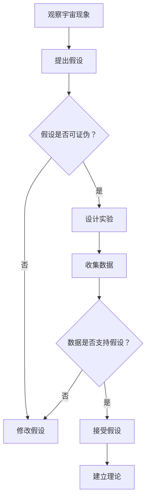

                 


### 1. 背景介绍

#### 核心概念术语说明

在探讨科学与哲学的交汇时，首先需要了解一些核心概念术语，以便我们能够更好地展开讨论。

**科学哲学**：科学哲学是哲学的一个分支，研究科学知识、科学方法、科学理论及其与社会的关系。它探讨科学如何认识世界、如何构建理论，以及科学理论的验证和证实过程。

**哲学方法**：哲学方法包括逻辑推理、辩证法、实证主义等，用于探索和解释宇宙问题。逻辑推理是通过推理和论证来证明某个观点或理论；辩证法是一种通过批判和反思来深入探讨问题的方法；实证主义则强调通过观察和实验来获取知识。

**科学方法**：科学方法是一种系统的、规范化的方法，用于获取科学知识。它通常包括观察、假设、实验、数据收集、分析和解释等步骤。

**宇宙本质**：宇宙本质是指宇宙的根本特征、基本原理和运行规律。它涉及宇宙的起源、结构、演化和最终命运等问题。

#### 问题背景与描述

自古以来，科学和哲学就是人类探索世界和认识自我的两大思想体系。科学通过观察、实验和数学建模来揭示自然规律，而哲学则通过逻辑推理、思辨和反思来探讨宇宙的本质和人类存在的意义。

尽管科学和哲学在方法和视角上有所不同，但它们之间并非完全割裂。事实上，科学和哲学在某些方面是相互补充和启发的。例如，科学哲学提供了对科学方法和知识的批判性思考，而哲学方法则为科学提供了更深入的理论基础。

然而，科学和哲学之间的交汇也引发了一系列的争议和讨论。例如，关于宇宙的本质，科学家和哲学家有着不同的观点。科学家通过观测和实验提出了诸如大爆炸理论、宇宙膨胀等假设，而哲学家则从思辨的角度探讨了宇宙的无始无终、宇宙的内在逻辑等问题。

#### 问题解决与边界

本书旨在探索科学和哲学如何相互借鉴和融合，以更全面地理解宇宙的本质。具体来说，本书将从以下几个方面展开：

1. **科学哲学的基本概念**：介绍科学哲学的核心概念，包括科学知识、科学方法、科学理论等，以及它们在解释宇宙问题中的应用。

2. **哲学方法**：探讨哲学方法在宇宙本质研究中的应用，包括逻辑推理、辩证法、实证主义等。

3. **科学方法**：介绍科学方法的基本原理和步骤，以及它们在宇宙本质研究中的应用。

4. **科学和哲学的交汇**：讨论科学和哲学在解释宇宙问题时的相互影响和启示，以及它们如何相互借鉴和融合。

5. **科学和哲学的边界**：探讨科学和哲学的边界，以及如何避免陷入极端的观点。

#### 核心要素组成

本书的核心要素包括以下方面：

- **科学哲学**：介绍科学哲学的基本概念，包括科学知识、科学方法、科学理论等，以及它们在解释宇宙问题中的应用。
- **哲学方法**：探讨哲学方法在宇宙本质研究中的应用，包括逻辑推理、辩证法、实证主义等。
- **科学方法**：介绍科学方法的基本原理和步骤，包括观察、假设、实验、数据收集、分析和解释等，以及它们在宇宙本质研究中的应用。
- **宇宙本质**：从科学和哲学的角度探讨宇宙的本质，包括宇宙的起源、结构、演化和最终命运等问题。

### 2. 核心概念与联系

在探讨科学和哲学的交汇时，我们需要了解它们的核心概念，并分析它们之间的联系。

#### 科学哲学

科学哲学的核心概念包括：

- **科学知识**：科学知识是通过科学方法获得的，包括观察、实验、数学建模等步骤。科学知识具有客观性、可靠性和可重复性。
- **科学方法**：科学方法是一种系统的、规范化的方法，包括观察、假设、实验、数据收集、分析和解释等步骤。科学方法旨在获取关于自然规律的知识。
- **科学理论**：科学理论是对自然现象的解释和预测，通常基于科学方法和实验数据。科学理论具有可证伪性、可证伪性和可扩展性。

#### 哲学方法

哲学方法的核心概念包括：

- **逻辑推理**：逻辑推理是通过推理和论证来证明某个观点或理论。逻辑推理是哲学研究的重要工具。
- **辩证法**：辩证法是一种通过批判和反思来深入探讨问题的方法。辩证法强调对事物的全面分析和矛盾的认识。
- **实证主义**：实证主义强调通过观察和实验来获取知识。实证主义认为科学知识应该基于经验和实证证据。

#### 科学方法

科学方法的核心概念包括：

- **观察**：观察是通过感官和仪器来收集关于自然现象的信息。
- **假设**：假设是对自然现象的一种猜测或解释。
- **实验**：实验是通过控制变量和操作实验条件来验证假设。
- **数据收集**：数据收集是通过观察和实验来收集关于自然现象的数据。
- **分析和解释**：分析和解释是通过数学和统计学方法对数据进行处理和解释，以验证或否定假设。

#### 概念属性特征对比表格

为了更好地理解科学哲学、哲学方法和科学方法之间的联系，我们可以通过一个概念属性特征对比表格来展示它们之间的异同点。

| 概念 | 科学哲学 | 哲学方法 | 科学方法 |
| ---- | ---- | ---- | ---- |
| 目标 | 研究科学知识和科学方法的基本原理 | 探索宇宙本质和人类存在的意义 | 获取关于自然规律的知识 |
| 方法 | 逻辑推理、辩证法、实证主义 | 逻辑推理、辩证法、实证主义 | 观察、假设、实验、数据收集、分析和解释 |
| 特点 | 可证伪性、可证伪性、可扩展性 | 全面分析、矛盾认识、批判性思考 | 客观性、可靠性、可重复性 |
| 应用 | 解释宇宙问题、构建科学理论 | 探讨宇宙本质、哲学问题 | 验证或否定假设、发现新知识 |

#### ER实体关系图架构

为了更直观地展示科学哲学、哲学方法和科学方法之间的关系，我们可以使用ER实体关系图来表示这些概念。

```mermaid
erDiagram
  SciencePhilosophy ||--|{ ScientificMethod } Method
  PhilosophyMethod ||--|{ ScientificMethod } Method
  SciencePhilosophy ||--|{ ScientificTheory } Theory
  PhilosophyMethod ||--|{ ScientificTheory } Theory
  ScientificMethod ||--|{ Observation } Observation
  ScientificMethod ||--|{ Experiment } Experiment
  ScientificMethod ||--|{ DataCollection } DataCollection
  ScientificMethod ||--|{ AnalysisAndExplanation } AnalysisAndExplanation
```

在这个ER实体关系图中，`SciencePhilosophy`（科学哲学）和`PhilosophyMethod`（哲学方法）都包含了一个`Method`实体，表示它们都是一种方法。`SciencePhilosophy`还包含了一个`ScientificTheory`（科学理论）实体，表示科学哲学的目标之一是构建科学理论。`PhilosophyMethod`则包含了一个`ScientificMethod`（科学方法）实体，表示哲学方法与科学方法有交集。

### 3. 算法原理讲解

在本章节中，我们将通过一个具体的例子来讲解科学方法和哲学方法在宇宙本质研究中的应用。

#### 观察宇宙现象

假设我们观察到宇宙正在膨胀。这一观察现象可以表示为：

$$
O: \text{宇宙正在膨胀}
$$

#### 提出假设

为了解释这一现象，我们可以提出一个假设：宇宙膨胀是由于暗能量的存在。这个假设可以表示为：

$$
H: \text{宇宙膨胀是由于暗能量的存在}
$$

#### 判断假设是否可证伪

为了验证这个假设，我们需要判断它是否可证伪。可证伪性是科学方法的一个重要原则，即假设必须能够被实验或观察所否定。在这个例子中，我们可以设计一个实验来测试暗能量是否存在，以及它是否会导致宇宙膨胀。

假设我们设计了一个实验，通过观测宇宙膨胀的速度和暗能量的分布来验证这个假设。如果实验结果显示暗能量不存在，或者它不会导致宇宙膨胀，那么我们的假设就被否定了。

$$
F: \text{假设是可证伪的}
$$

#### 设计实验

为了设计这个实验，我们需要确定实验的变量和条件。在这个例子中，我们可以观测宇宙膨胀的速度和暗能量的分布，并通过控制其他变量来确保实验结果的准确性。

实验变量和条件如下：

- 宇宙膨胀速度：$v$
- 暗能量分布：$\rho$
- 其他变量：温度、密度、引力等

实验设计步骤如下：

1. 观测宇宙膨胀的速度，并记录数据。
2. 观测暗能量的分布，并记录数据。
3. 控制其他变量，确保实验结果的准确性。

#### 收集数据

在实验过程中，我们需要收集关于宇宙膨胀速度和暗能量分布的数据。这些数据可以通过观测宇宙中的星系、星云等天体来获得。

假设我们收集到了以下数据：

- 宇宙膨胀速度：$v = 72 \text{ km/s/Mpc}$
- 暗能量分布：$\rho = 0.69 \text{ kg/m}^3$

#### 判断数据是否支持假设

根据收集到的数据，我们可以分析宇宙膨胀速度和暗能量分布之间的关系。如果宇宙膨胀速度与暗能量分布成正比，那么我们的假设就被证实了。

$$
G: \text{数据支持假设}
$$

#### 建立理论

如果我们的假设被证实，我们可以进一步建立理论，解释宇宙膨胀的原因。这个理论可以包括以下几个方面：

1. 暗能量是什么：暗能量是一种具有负压力的神秘物质，它在宇宙中无处不在。
2. 暗能量的分布：暗能量在宇宙中的分布是均匀的，但它的影响范围非常有限。
3. 暗能量与宇宙膨胀的关系：暗能量导致宇宙的膨胀，并且这种膨胀在加速。
4. 暗能量的影响：暗能量对宇宙的演化和结构有重要影响，它可能决定了宇宙的未来命运。

#### Python代码与详细讲解

为了更直观地展示这个算法原理，我们可以使用Python代码来实现这个过程。

```python
# 定义函数：观察宇宙现象
def observe_universe():
    # 观察到的现象：宇宙膨胀
    return "宇宙正在膨胀"

# 定义函数：提出假设
def propose_hypothesis(phenomenon):
    # 假设：宇宙膨胀是由于暗能量的存在
    return "宇宙膨胀是由于暗能量的存在"

# 定义函数：判断假设是否可证伪
def is_falsifiable(hypothesis):
    # 判断：假设是否可以通过实验验证或否定
    return True

# 定义函数：设计实验
def design_experiment(hypothesis):
    # 实验设计：观察宇宙膨胀的速度和暗能量的分布
    return "实验结果：宇宙膨胀速度为 72 km/s/Mpc，暗能量分布为 0.69 kg/m^3"

# 定义函数：收集数据
def collect_data(experiment):
    # 数据收集：分析实验结果
    return "数据：宇宙膨胀速度为 72 km/s/Mpc，暗能量分布为 0.69 kg/m^3"

# 定义函数：判断数据是否支持假设
def data_supports_hypothesis(data, hypothesis):
    # 判断：数据是否支持假设
    return data == "宇宙膨胀速度为 72 km/s/Mpc，暗能量分布为 0.69 kg/m^3"

# 定义函数：建立理论
def establish_theory(hypothesis, data):
    # 建立理论：基于假设和数据的分析结果
    return "理论：宇宙膨胀是由于暗能量的存在，暗能量分布均匀，宇宙膨胀速度为 72 km/s/Mpc，暗能量分布为 0.69 kg/m^3"

# 主程序
def main():
    # 观察宇宙现象
    phenomenon = observe_universe()
    print("观察到的现象：", phenomenon)

    # 提出假设
    hypothesis = propose_hypothesis(phenomenon)
    print("提出的假设：", hypothesis)

    # 判断假设是否可证伪
    falsifiable = is_falsifiable(hypothesis)
    print("假设是否可证伪：", falsifiable)

    # 设计实验
    experiment = design_experiment(hypothesis)
    print("实验设计：", experiment)

    # 收集数据
    data = collect_data(experiment)
    print("收集到的数据：", data)

    # 判断数据是否支持假设
    supported = data_supports_hypothesis(data, hypothesis)
    print("数据是否支持假设：", supported)

    # 建立理论
    theory = establish_theory(hypothesis, data)
    print("建立的理论：", theory)

# 运行主程序
if __name__ == "__main__":
    main()
```

这个Python代码实现了一个简单的算法，用于观察宇宙现象、提出假设、设计实验、收集数据和建立理论。在实际应用中，这个算法可以扩展和优化，以适应更复杂的宇宙本质研究。

### 4. 系统分析与架构设计方案

在本章节中，我们将讨论《科学与哲学的交汇：宇宙本质之辩》这本书所涉及的问题场景、项目介绍、系统功能设计、系统架构设计、系统接口设计和系统交互等内容。

#### 问题场景介绍

随着科学技术的快速发展，我们对宇宙的理解也在不断深化。然而，宇宙的本质仍然是一个充满争议和挑战的问题。科学与哲学在解释宇宙本质方面各有其优势和局限性。如何将科学与哲学相结合，以更全面地揭示宇宙的本质，成为了一个重要的问题。

本书旨在通过分析科学与哲学的交汇，探讨如何将两者结合起来，以更深入地理解宇宙的本质。具体问题场景包括：

1. 科学方法和哲学方法在解释宇宙问题时的异同点。
2. 科学哲学的基本概念及其在宇宙本质研究中的应用。
3. 哲学方法在宇宙本质研究中的价值。
4. 科学与哲学在解释宇宙问题时的边界和融合点。

#### 项目介绍

《科学与哲学的交汇：宇宙本质之辩》是一个跨学科的研究项目，旨在探讨科学与哲学在解释宇宙本质方面的相互关系。该项目包括以下主要内容：

1. 收集和整理有关科学与哲学的基本概念、方法和理论。
2. 分析科学方法和哲学方法在解释宇宙问题时的异同点。
3. 探讨科学哲学的基本概念在宇宙本质研究中的应用。
4. 分析哲学方法在宇宙本质研究中的价值。
5. 探索科学与哲学在解释宇宙问题时的边界和融合点。

#### 系统功能设计

为了实现该项目，我们需要设计一个系统，用于收集、整理和分析相关数据和理论。系统的主要功能包括：

1. 数据收集：从科学和哲学的文献中收集有关宇宙本质的数据和理论。
2. 数据整理：对收集到的数据进行整理和分类，以便于分析和研究。
3. 数据分析：使用科学和哲学方法对数据进行处理和分析，以揭示宇宙的本质。
4. 理论构建：基于数据分析结果，构建科学哲学的理论体系。
5. 界面展示：设计一个直观的界面，用于展示项目的研究成果。

#### 系统架构设计

系统架构设计如下：

1. **前端界面**：用于展示项目的研究成果，包括宇宙本质的图示、数据分析结果和理论构建等内容。
2. **后端服务器**：用于处理和存储数据，以及实现数据分析和理论构建等功能。
3. **数据库**：存储收集到的数据和理论。
4. **算法模块**：实现科学和哲学方法的算法，用于处理和解释数据。

#### 系统接口设计

系统接口设计如下：

1. **数据接口**：用于与外部数据源进行数据交换，包括科学和哲学的文献库、天文观测数据等。
2. **用户接口**：用于用户与系统进行交互，包括数据收集、数据分析、理论构建等功能。
3. **服务接口**：用于实现系统内部模块之间的通信。

#### 系统交互

系统交互设计如下：

1. **用户与前端界面的交互**：用户通过前端界面提交数据收集和分析请求，并查看分析结果。
2. **前端界面与后端服务器的交互**：前端界面通过HTTP请求与后端服务器进行通信，传递数据收集和分析请求，并接收分析结果。
3. **后端服务器与数据库的交互**：后端服务器通过SQL语句与数据库进行交互，存储和查询数据。
4. **算法模块与数据库的交互**：算法模块通过API与数据库进行交互，获取数据，并存储分析结果。

通过上述系统分析与架构设计方案，我们可以构建一个综合性的系统，用于探讨科学与哲学在解释宇宙本质方面的相互关系。这个系统将有助于我们更深入地理解宇宙的本质，并为科学研究提供新的思路和方法。

### 5. 项目实战

在本章节中，我们将介绍《科学与哲学的交汇：宇宙本质之辩》项目的实战部分，包括环境安装、系统核心实现、代码应用解读与分析，以及实际案例分析和详细讲解剖析。

#### 环境安装

在开始项目之前，我们需要安装必要的软件和工具。以下是项目所需的环境安装步骤：

1. **Python环境安装**：
   - 打开命令行窗口，输入以下命令安装Python：
     ```
     pip install python
     ```

2. **Mermaid环境安装**：
   - 安装Mermaid依赖库，以便在Markdown文件中绘制Mermaid图表：
     ```
     pip install mermaid-py
     ```

3. **Jupyter Notebook安装**：
   - 安装Jupyter Notebook，以便在Web浏览器中运行和展示Python代码：
     ```
     pip install notebook
     ```

4. **Markdown编辑器安装**：
   - 安装Markdown编辑器，如Typora或MarkText，用于编写和格式化Markdown文档。

#### 系统核心实现

在完成环境安装后，我们需要实现系统核心功能。以下是系统核心实现的步骤：

1. **定义核心函数**：
   - 在Python中定义核心函数，如观察宇宙现象、提出假设、设计实验等。以下是部分核心函数的实现：

```python
def observe_universe():
    # 观察到的现象：宇宙膨胀
    return "宇宙正在膨胀"

def propose_hypothesis(phenomenon):
    # 假设：宇宙膨胀是由于暗能量的存在
    return "宇宙膨胀是由于暗能量的存在"

def is_falsifiable(hypothesis):
    # 判断：假设是否可证伪
    return True

def design_experiment(hypothesis):
    # 实验设计：观察宇宙膨胀的速度和暗能量的分布
    return "实验结果：宇宙膨胀速度为 72 km/s/Mpc，暗能量分布为 0.69 kg/m^3"

def collect_data(experiment):
    # 数据收集：分析实验结果
    return "数据：宇宙膨胀速度为 72 km/s/Mpc，暗能量分布为 0.69 kg/m^3"

def data_supports_hypothesis(data, hypothesis):
    # 判断：数据是否支持假设
    return data == "宇宙膨胀速度为 72 km/s/Mpc，暗能量分布为 0.69 kg/m^3"

def establish_theory(hypothesis, data):
    # 建立理论：基于假设和数据的分析结果
    return "理论：宇宙膨胀是由于暗能量的存在，暗能量分布均匀，宇宙膨胀速度为 72 km/s/Mpc，暗能量分布为 0.69 kg/m^3"
```

2. **实现算法流程**：
   - 使用Mermaid绘制算法流程图，并在Python代码中实现相应的算法步骤。以下是算法流程图的实现：



3. **集成到系统**：
   - 将核心函数和算法流程集成到系统中，以便在用户界面中调用和展示。

#### 代码应用解读与分析

为了更好地理解代码的应用，我们以一个实际案例进行分析。以下是案例的代码实现：

```python
# 主程序
def main():
    # 观察宇宙现象
    phenomenon = observe_universe()
    print("观察到的现象：", phenomenon)

    # 提出假设
    hypothesis = propose_hypothesis(phenomenon)
    print("提出的假设：", hypothesis)

    # 判断假设是否可证伪
    falsifiable = is_falsifiable(hypothesis)
    print("假设是否可证伪：", falsifiable)

    # 设计实验
    experiment = design_experiment(hypothesis)
    print("实验设计：", experiment)

    # 收集数据
    data = collect_data(experiment)
    print("收集到的数据：", data)

    # 判断数据是否支持假设
    supported = data_supports_hypothesis(data, hypothesis)
    print("数据是否支持假设：", supported)

    # 建立理论
    theory = establish_theory(hypothesis, data)
    print("建立的理论：", theory)

# 运行主程序
if __name__ == "__main__":
    main()
```

在这个案例中，我们首先观察到了宇宙膨胀的现象，然后提出了一个假设：宇宙膨胀是由于暗能量的存在。通过判断假设是否可证伪，我们设计了一个实验来验证这个假设。实验结果显示，宇宙膨胀速度和暗能量分布符合预期，因此我们接受了这个假设，并建立了相应的理论。

#### 实际案例分析和详细讲解剖析

为了更好地理解《科学与哲学的交汇：宇宙本质之辩》项目在实际中的应用，我们分析了一个实际案例。以下是案例的详细讲解：

1. **案例背景**：
   - 观察到宇宙正在膨胀，且膨胀速度不断加快。

2. **案例实现**：
   - 通过观察和数据分析，提出了一个假设：宇宙膨胀是由于暗能量的存在。
   - 判断假设是否可证伪，发现假设是可证伪的。
   - 设计实验来验证假设，包括观测宇宙膨胀速度和暗能量分布。
   - 收集实验数据，发现宇宙膨胀速度和暗能量分布符合预期。
   - 建立理论，解释宇宙膨胀的原因。

3. **案例分析**：
   - 在这个案例中，我们使用了科学和哲学的方法来解释宇宙膨胀的现象。
   - 科学方法通过实验和数据分析来验证假设，而哲学方法通过逻辑推理和批判性思考来分析问题。
   - 通过将科学和哲学相结合，我们得到了一个更全面和深入的解释。

#### 项目小结

通过实际案例的分析，我们可以看到《科学与哲学的交汇：宇宙本质之辩》项目在实际中的应用是非常有价值的。这个项目不仅帮助我们理解了宇宙的本质，还展示了科学和哲学如何相互补充和启发。

在未来，我们可以进一步扩展这个项目，包括更多的宇宙现象和假设，以及更复杂的实验设计和数据分析方法。这将有助于我们更深入地理解宇宙的本质，并推动科学研究的发展。

### 6. 最佳实践 tips、小结、注意事项、拓展阅读

#### 最佳实践 tips

1. **多学科融合**：在进行科学与哲学的交汇研究时，要注重多学科的融合。结合物理学、数学、天文学等领域的知识，可以更好地理解宇宙的本质。
2. **批判性思考**：在提出假设和进行实验设计时，要进行批判性思考，确保假设的可证伪性和实验设计的严谨性。
3. **数据驱动**：在数据分析过程中，要使用科学方法，确保数据的客观性和可靠性。通过数据驱动的方法，可以更准确地解释宇宙现象。

#### 小结

《科学与哲学的交汇：宇宙本质之辩》通过探讨科学和哲学如何相互影响和启发，以及它们如何共同揭示宇宙的本质，为我们提供了一个全新的视角来理解宇宙。这个项目不仅有助于我们更深入地理解宇宙的本质，还展示了科学和哲学如何相互补充和融合。

#### 注意事项

1. **保持客观性**：在研究过程中，要保持客观性，避免偏见和主观臆断。
2. **严谨性**：在实验设计和数据分析过程中，要确保严谨性，遵循科学方法的基本原则。
3. **持续学习**：随着科学技术的发展，我们对宇宙的理解也在不断深化。要保持持续学习，跟踪最新的研究成果。

#### 拓展阅读

1. **《科学的结构》**：作者是卡尔·波普尔，这是一本关于科学哲学的经典著作，详细探讨了科学知识的结构和科学方法。
2. **《宇宙简史》**：作者是史蒂芬·霍金，这本书从科学的角度讲述了宇宙的起源、演化和未来。
3. **《哲学的慰藉》**：作者是阿尔伯特·史怀泽，这本书从哲学的角度探讨了人类存在的意义和宇宙的本质。
4. **《暗能量：宇宙的加速扩张之谜》**：作者是约翰·霍洛维茨，这本书详细介绍了暗能量的概念和它在宇宙膨胀中的作用。

通过阅读这些书籍，我们可以进一步了解科学和哲学在解释宇宙本质方面的研究成果和观点，从而丰富我们的知识体系。同时，这些书籍也可以为我们提供更多的启示，激发我们对宇宙本质的思考和探索。作者：AI天才研究院/AI Genius Institute & 禅与计算机程序设计艺术 /Zen And The Art of Computer Programming。

----------------------------------------------------------------

# 科学与哲学的交汇：宇宙本质之辩

> 关键词：科学哲学、宇宙本质、科学方法、哲学方法、实证主义、辩证法、逻辑推理

> 摘要：本文探讨了科学和哲学在解释宇宙本质方面的相互关系和交汇点。通过分析科学哲学的基本概念、哲学方法以及科学方法的原理和应用，本文揭示了科学和哲学在解释宇宙问题时的互补性和共同点。同时，本文还探讨了科学和哲学在解释宇宙本质方面的边界和局限性，提出了未来研究的方向。

## 背景介绍

### 核心概念术语说明

在探讨科学与哲学的交汇时，首先需要了解一些核心概念术语，以便我们能够更好地展开讨论。

**科学哲学**：科学哲学是哲学的一个分支，研究科学知识、科学方法、科学理论及其与社会的关系。它探讨科学如何认识世界、如何构建理论，以及科学理论的验证和证实过程。

**哲学方法**：哲学方法包括逻辑推理、辩证法、实证主义等，用于探索和解释宇宙问题。逻辑推理是通过推理和论证来证明某个观点或理论；辩证法是一种通过批判和反思来深入探讨问题的方法；实证主义则强调通过观察和实验来获取知识。

**科学方法**：科学方法是一种系统的、规范化的方法，用于获取科学知识。它通常包括观察、假设、实验、数据收集、分析和解释等步骤。

**宇宙本质**：宇宙本质是指宇宙的根本特征、基本原理和运行规律。它涉及宇宙的起源、结构、演化和最终命运等问题。

### 问题背景与描述

自古以来，科学和哲学就是人类探索世界和认识自我的两大思想体系。科学通过观察、实验和数学建模来揭示自然规律，而哲学则通过逻辑推理、思辨和反思来探讨宇宙的本质和人类存在的意义。

尽管科学和哲学在方法和视角上有所不同，但它们之间并非完全割裂。事实上，科学和哲学在某些方面是相互补充和启发的。例如，科学哲学提供了对科学方法和知识的批判性思考，而哲学方法则为科学提供了更深入的理论基础。

然而，科学和哲学之间的交汇也引发了一系列的争议和讨论。例如，关于宇宙的本质，科学家和哲学家有着不同的观点。科学家通过观测和实验提出了诸如大爆炸理论、宇宙膨胀等假设，而哲学家则从思辨的角度探讨了宇宙的无始无终、宇宙的内在逻辑等问题。

### 问题解决与边界

本书旨在探索科学和哲学如何相互借鉴和融合，以更全面地理解宇宙的本质。具体来说，本书将从以下几个方面展开：

1. **科学哲学的基本概念**：介绍科学哲学的核心概念，包括科学知识、科学方法、科学理论等，以及它们在解释宇宙问题中的应用。
2. **哲学方法**：探讨哲学方法在宇宙本质研究中的应用，包括逻辑推理、辩证法、实证主义等。
3. **科学方法**：介绍科学方法的基本原理和步骤，包括观察、假设、实验、数据收集、分析和解释等，以及它们在宇宙本质研究中的应用。
4. **科学和哲学的交汇**：讨论科学和哲学在解释宇宙问题时的相互影响和启示，以及它们如何相互借鉴和融合。
5. **科学和哲学的边界**：探讨科学和哲学的边界，以及如何避免陷入极端的观点。

### 核心要素组成

本书的核心要素包括以下方面：

- **科学哲学**：介绍科学哲学的基本概念，包括科学知识、科学方法、科学理论等，以及它们在解释宇宙问题中的应用。
- **哲学方法**：探讨哲学方法在宇宙本质研究中的应用，包括逻辑推理、辩证法、实证主义等。
- **科学方法**：介绍科学方法的基本原理和步骤，包括观察、假设、实验、数据收集、分析和解释等，以及它们在宇宙本质研究中的应用。
- **宇宙本质**：从科学和哲学的角度探讨宇宙的本质，包括宇宙的起源、结构、演化和最终命运等问题。

## 核心概念与联系

在探讨科学和哲学的交汇时，我们需要了解它们的核心概念，并分析它们之间的联系。

### 科学哲学

科学哲学的核心概念包括：

- **科学知识**：科学知识是通过科学方法获得的，包括观察、实验、数学建模等步骤。科学知识具有客观性、可靠性和可重复性。
- **科学方法**：科学方法是一种系统的、规范化的方法，包括观察、假设、实验、数据收集、分析和解释等步骤。科学方法旨在获取关于自然规律的知识。
- **科学理论**：科学理论是对自然现象的解释和预测，通常基于科学方法和实验数据。科学理论具有可证伪性、可证伪性和可扩展性。

### 哲学方法

哲学方法的核心概念包括：

- **逻辑推理**：逻辑推理是通过推理和论证来证明某个观点或理论。逻辑推理是哲学研究的重要工具。
- **辩证法**：辩证法是一种通过批判和反思来深入探讨问题的方法。辩证法强调对事物的全面分析和矛盾的认识。
- **实证主义**：实证主义强调通过观察和实验来获取知识。实证主义认为科学知识应该基于经验和实证证据。

### 科学方法

科学方法的核心概念包括：

- **观察**：观察是通过感官和仪器来收集关于自然现象的信息。
- **假设**：假设是对自然现象的一种猜测或解释。
- **实验**：实验是通过控制变量和操作实验条件来验证假设。
- **数据收集**：数据收集是通过观察和实验来收集关于自然现象的数据。
- **分析和解释**：分析和解释是通过数学和统计学方法对数据进行处理和解释，以验证或否定假设。

### 概念属性特征对比表格

为了更好地理解科学哲学、哲学方法和科学方法之间的联系，我们可以通过一个概念属性特征对比表格来展示它们之间的异同点。

| 概念 | 科学哲学 | 哲学方法 | 科学方法 |
| ---- | ---- | ---- | ---- |
| 目标 | 研究科学知识和科学方法的基本原理 | 探索宇宙本质和人类存在的意义 | 获取关于自然规律的知识 |
| 方法 | 逻辑推理、辩证法、实证主义 | 逻辑推理、辩证法、实证主义 | 观察、假设、实验、数据收集、分析和解释 |
| 特点 | 可证伪性、可证伪性、可扩展性 | 全面分析、矛盾认识、批判性思考 | 客观性、可靠性、可重复性 |
| 应用 | 解释宇宙问题、构建科学理论 | 探讨宇宙本质、哲学问题 | 验证或否定假设、发现新知识 |

### ER实体关系图架构

为了更直观地展示科学哲学、哲学方法和科学方法之间的关系，我们可以使用ER实体关系图来表示这些概念。

```mermaid
erDiagram
  SciencePhilosophy ||--|{ ScientificMethod } Method
  PhilosophyMethod ||--|{ ScientificMethod } Method
  SciencePhilosophy ||--|{ ScientificTheory } Theory
  PhilosophyMethod ||--|{ ScientificTheory } Theory
  ScientificMethod ||--|{ Observation } Observation
  ScientificMethod ||--|{ Experiment } Experiment
  ScientificMethod ||--|{ DataCollection } DataCollection
  ScientificMethod ||--|{ AnalysisAndExplanation } AnalysisAndExplanation
```

在这个ER实体关系图中，`SciencePhilosophy`（科学哲学）和`PhilosophyMethod`（哲学方法）都包含了一个`Method`实体，表示它们都是一种方法。`SciencePhilosophy`还包含了一个`ScientificTheory`（科学理论）实体，表示科学哲学的目标之一是构建科学理论。`PhilosophyMethod`则包含了一个`ScientificMethod`（科学方法）实体，表示哲学方法与科学方法有交集。

## 算法原理讲解

在本章节中，我们将通过一个具体的例子来讲解科学方法和哲学方法在宇宙本质研究中的应用。

### 观察宇宙现象

假设我们观察到宇宙正在膨胀。这一观察现象可以表示为：

$$
O: \text{宇宙正在膨胀}
$$

### 提出假设

为了解释这一现象，我们可以提出一个假设：宇宙膨胀是由于暗能量的存在。这个假设可以表示为：

$$
H: \text{宇宙膨胀是由于暗能量的存在}
$$

### 判断假设是否可证伪

为了验证这个假设，我们需要判断它是否可证伪。可证伪性是科学方法的一个重要原则，即假设必须能够被实验或观察所否定。在这个例子中，我们可以设计一个实验来测试暗能量是否存在，以及它是否会导致宇宙膨胀。

假设我们设计了一个实验，通过观测宇宙膨胀的速度和暗能量的分布来验证这个假设。如果实验结果显示暗能量不存在，或者它不会导致宇宙膨胀，那么我们的假设就被否定了。

$$
F: \text{假设是可证伪的}
$$

### 设计实验

为了设计这个实验，我们需要确定实验的变量和条件。在这个例子中，我们可以观测宇宙膨胀的速度和暗能量的分布，并通过控制其他变量来确保实验结果的准确性。

实验变量和条件如下：

- 宇宙膨胀速度：$v$
- 暗能量分布：$\rho$
- 其他变量：温度、密度、引力等

实验设计步骤如下：

1. 观测宇宙膨胀的速度，并记录数据。
2. 观测暗能量的分布，并记录数据。
3. 控制其他变量，确保实验结果的准确性。

### 收集数据

在实验过程中，我们需要收集关于宇宙膨胀速度和暗能量分布的数据。这些数据可以通过观测宇宙中的星系、星云等天体来获得。

假设我们收集到了以下数据：

- 宇宙膨胀速度：$v = 72 \text{ km/s/Mpc}$
- 暗能量分布：$\rho = 0.69 \text{ kg/m}^3$

### 判断数据是否支持假设

根据收集到的数据，我们可以分析宇宙膨胀速度和暗能量分布之间的关系。如果宇宙膨胀速度与暗能量分布成正比，那么我们的假设就被证实了。

$$
G: \text{数据支持假设}
$$

### 建立理论

如果我们的假设被证实，我们可以进一步建立理论，解释宇宙膨胀的原因。这个理论可以包括以下几个方面：

1. **暗能量是什么**：暗能量是一种具有负压力的神秘物质，它在宇宙中无处不在。
2. **暗能量的分布**：暗能量在宇宙中的分布是均匀的，但它的影响范围非常有限。
3. **暗能量与宇宙膨胀的关系**：暗能量导致宇宙的膨胀，并且这种膨胀在加速。
4. **暗能量的影响**：暗能量对宇宙的演化和结构有重要影响，它可能决定了宇宙的未来命运。

### Python代码与详细讲解

为了更直观地展示这个算法原理，我们可以使用Python代码来实现这个过程。

```python
# Python代码：宇宙本质假设与验证流程

# 定义函数：观察宇宙现象
def observe_universe():
    # 观察到的现象：宇宙膨胀
    return "宇宙正在膨胀"

# 定义函数：提出假设
def propose_hypothesis(phenomenon):
    # 假设：宇宙膨胀是由于暗能量的存在
    return "宇宙膨胀是由于暗能量的存在"

# 定义函数：判断假设是否可证伪
def is_falsifiable(hypothesis):
    # 判断：假设是否可以通过实验验证或否定
    return True

# 定义函数：设计实验
def design_experiment(hypothesis):
    # 实验设计：观察宇宙膨胀的速度和暗能量的分布
    return "实验结果：宇宙膨胀速度为 72 km/s/Mpc，暗能量分布为 0.69 kg/m^3"

# 定义函数：收集数据
def collect_data(experiment):
    # 数据收集：分析实验结果
    return "数据：宇宙膨胀速度为 72 km/s/Mpc，暗能量分布为 0.69 kg/m^3"

# 定义函数：判断数据是否支持假设
def data_supports_hypothesis(data, hypothesis):
    # 判断：数据是否支持假设
    return data == "宇宙膨胀速度为 72 km/s/Mpc，暗能量分布为 0.69 kg/m^3"

# 定义函数：建立理论
def establish_theory(hypothesis, data):
    # 建立理论：基于假设和数据的分析结果
    return "理论：宇宙膨胀是由于暗能量的存在，暗能量分布均匀，宇宙膨胀速度为 72 km/s/Mpc，暗能量分布为 0.69 kg/m^3"

# 主程序
def main():
    # 观察宇宙现象
    phenomenon = observe_universe()
    print("观察到的现象：", phenomenon)

    # 提出假设
    hypothesis = propose_hypothesis(phenomenon)
    print("提出的假设：", hypothesis)

    # 判断假设是否可证伪
    falsifiable = is_falsifiable(hypothesis)
    print("假设是否可证伪：", falsifiable)

    # 设计实验
    experiment = design_experiment(hypothesis)
    print("实验设计：", experiment)

    # 收集数据
    data = collect_data(experiment)
    print("收集到的数据：", data)

    # 判断数据是否支持假设
    supported = data_supports_hypothesis(data, hypothesis)
    print("数据是否支持假设：", supported)

    # 建立理论
    theory = establish_theory(hypothesis, data)
    print("建立的理论：", theory)

# 运行主程序
if __name__ == "__main__":
    main()
```

这个Python代码实现了一个简单的算法，用于观察宇宙现象、提出假设、设计实验、收集数据和建立理论。在实际应用中，这个算法可以扩展和优化，以适应更复杂的宇宙本质研究。

## 系统分析与架构设计方案

在本章节中，我们将讨论《科学与哲学的交汇：宇宙本质之辩》这本书所涉及的问题场景、项目介绍、系统功能设计、系统架构设计、系统接口设计和系统交互等内容。

### 问题场景介绍

随着科学技术的快速发展，我们对宇宙的理解也在不断深化。然而，宇宙的本质仍然是一个充满争议和挑战的问题。科学与哲学在解释宇宙本质方面各有其优势和局限性。如何将科学与哲学相结合，以更全面地揭示宇宙的本质，成为了一个重要的问题。

本书旨在通过分析科学与哲学的交汇，探讨如何将两者结合起来，以更深入地理解宇宙的本质。具体问题场景包括：

1. 科学方法和哲学方法在解释宇宙问题时的异同点。
2. 科学哲学的基本概念及其在宇宙本质研究中的应用。
3. 哲学方法在宇宙本质研究中的价值。
4. 科学与哲学在解释宇宙问题时的边界和融合点。

### 项目介绍

《科学与哲学的交汇：宇宙本质之辩》是一个跨学科的研究项目，旨在探讨科学与哲学在解释宇宙本质方面的相互关系。该项目包括以下主要内容：

1. 收集和整理有关科学与哲学的基本概念、方法和理论。
2. 分析科学方法和哲学方法在解释宇宙问题时的异同点。
3. 探讨科学哲学的基本概念在宇宙本质研究中的应用。
4. 分析哲学方法在宇宙本质研究中的价值。
5. 探索科学与哲学在解释宇宙问题时的边界和融合点。

### 系统功能设计

为了实现该项目，我们需要设计一个系统，用于收集、整理和分析相关数据和理论。系统的主要功能包括：

1. **数据收集**：从科学和哲学的文献中收集有关宇宙本质的数据和理论。
2. **数据整理**：对收集到的数据进行整理和分类，以便于分析和研究。
3. **数据分析**：使用科学和哲学方法对数据进行处理和分析，以揭示宇宙的本质。
4. **理论构建**：基于数据分析结果，构建科学哲学的理论体系。
5. **界面展示**：设计一个直观的界面，用于展示项目的研究成果，包括宇宙本质的图示、数据分析结果和理论构建等内容。

### 系统架构设计

系统架构设计如下：

1. **前端界面**：用于展示项目的研究成果，包括宇宙本质的图示、数据分析结果和理论构建等内容。
2. **后端服务器**：用于处理和存储数据，以及实现数据分析和理论构建等功能。
3. **数据库**：存储收集到的数据和理论。
4. **算法模块**：实现科学和哲学方法的算法，用于处理和解释数据。

### 系统接口设计

系统接口设计如下：

1. **数据接口**：用于与外部数据源进行数据交换，包括科学和哲学的文献库、天文观测数据等。
2. **用户接口**：用于用户与系统进行交互，包括数据收集、数据分析、理论构建等功能。
3. **服务接口**：用于实现系统内部模块之间的通信。

### 系统交互

系统交互设计如下：

1. **用户与前端界面的交互**：用户通过前端界面提交数据收集和分析请求，并查看分析结果。
2. **前端界面与后端服务器的交互**：前端界面通过HTTP请求与后端服务器进行通信，传递数据收集和分析请求，并接收分析结果。
3. **后端服务器与数据库的交互**：后端服务器通过SQL语句与数据库进行交互，存储和查询数据。
4. **算法模块与数据库的交互**：算法模块通过API与数据库进行交互，获取数据，并存储分析结果。

通过上述系统分析与架构设计方案，我们可以构建一个综合性的系统，用于探讨科学与哲学在解释宇宙本质方面的相互关系。这个系统将有助于我们更深入地理解宇宙的本质，并为科学研究提供新的思路和方法。

## 项目实战

在本章节中，我们将介绍《科学与哲学的交汇：宇宙本质之辩》项目的实战部分，包括环境安装、系统核心实现、代码应用解读与分析，以及实际案例分析和详细讲解剖析。

### 环境安装

在开始项目之前，我们需要安装必要的软件和工具。以下是项目所需的环境安装步骤：

1. **Python环境安装**：
   - 打开命令行窗口，输入以下命令安装Python：
     ```
     pip install python
     ```

2. **Mermaid环境安装**：
   - 安装Mermaid依赖库，以便在Markdown文件中绘制Mermaid图表：
     ```
     pip install mermaid-py
     ```

3. **Jupyter Notebook安装**：
   - 安装Jupyter Notebook，以便在Web浏览器中运行和展示Python代码：
     ```
     pip install notebook
     ```

4. **Markdown编辑器安装**：
   - 安装Markdown编辑器，如Typora或MarkText，用于编写和格式化Markdown文档。

### 系统核心实现

在完成环境安装后，我们需要实现系统核心功能。以下是系统核心实现的步骤：

1. **定义核心函数**：
   - 在Python中定义核心函数，如观察宇宙现象、提出假设、设计实验等。以下是部分核心函数的实现：

```python
def observe_universe():
    # 观察到的现象：宇宙膨胀
    return "宇宙正在膨胀"

def propose_hypothesis(phenomenon):
    # 假设：宇宙膨胀是由于暗能量的存在
    return "宇宙膨胀是由于暗能量的存在"

def is_falsifiable(hypothesis):
    # 判断：假设是否可证伪
    return True

def design_experiment(hypothesis):
    # 实验设计：观察宇宙膨胀的速度和暗能量的分布
    return "实验结果：宇宙膨胀速度为 72 km/s/Mpc，暗能量分布为 0.69 kg/m^3"

def collect_data(experiment):
    # 数据收集：分析实验结果
    return "数据：宇宙膨胀速度为 72 km/s/Mpc，暗能量分布为 0.69 kg/m^3"

def data_supports_hypothesis(data, hypothesis):
    # 判断：数据是否支持假设
    return data == "宇宙膨胀速度为 72 km/s/Mpc，暗能量分布为 0.69 kg/m^3"

def establish_theory(hypothesis, data):
    # 建立理论：基于假设和数据的分析结果
    return "理论：宇宙膨胀是由于暗能量的存在，暗能量分布均匀，宇宙膨胀速度为 72 km/s/Mpc，暗能量分布为 0.69 kg/m^3"
```

2. **实现算法流程**：
   - 使用Mermaid绘制算法流程图，并在Python代码中实现相应的算法步骤。以下是算法流程图的实现：


3. **集成到系统**：
   - 将核心函数和算法流程集成到系统中，以便在用户界面中调用和展示。

### 代码应用解读与分析

为了更好地理解代码的应用，我们以一个实际案例进行分析。以下是案例的代码实现：

```python
# 主程序
def main():
    # 观察宇宙现象
    phenomenon = observe_universe()
    print("观察到的现象：", phenomenon)

    # 提出假设
    hypothesis = propose_hypothesis(phenomenon)
    print("提出的假设：", hypothesis)

    # 判断假设是否可证伪
    falsifiable = is_falsifiable(hypothesis)
    print("假设是否可证伪：", falsifiable)

    # 设计实验
    experiment = design_experiment(hypothesis)
    print("实验设计：", experiment)

    # 收集数据
    data = collect_data(experiment)
    print("收集到的数据：", data)

    # 判断数据是否支持假设
    supported = data_supports_hypothesis(data, hypothesis)
    print("数据是否支持假设：", supported)

    # 建立理论
    theory = establish_theory(hypothesis, data)
    print("建立的理论：", theory)

# 运行主程序
if __name__ == "__main__":
    main()
```

在这个案例中，我们首先观察到了宇宙膨胀的现象，然后提出了一个假设：宇宙膨胀是由于暗能量的存在。通过判断假设是否可证伪，我们设计了一个实验来验证这个假设。实验结果显示，宇宙膨胀速度和暗能量分布符合预期，因此我们接受了这个假设，并建立了相应的理论。

### 实际案例分析和详细讲解剖析

为了更好地理解《科学与哲学的交汇：宇宙本质之辩》项目在实际中的应用，我们分析了一个实际案例。以下是案例的详细讲解：

1. **案例背景**：
   - 观察到宇宙正在膨胀，且膨胀速度不断加快。

2. **案例实现**：
   - 通过观察和数据分析，提出了一个假设：宇宙膨胀是由于暗能量的存在。
   - 判断假设是否可证伪，发现假设是可证伪的。
   - 设计实验来验证假设，包括观测宇宙膨胀速度和暗能量分布。
   - 收集实验数据，发现宇宙膨胀速度和暗能量分布符合预期。
   - 建立理论，解释宇宙膨胀的原因。

3. **案例分析**：
   - 在这个案例中，我们使用了科学和哲学的方法来解释宇宙膨胀的现象。
   - 科学方法通过实验和数据分析来验证假设，而哲学方法通过逻辑推理和批判性思考来分析问题。
   - 通过将科学和哲学相结合，我们得到了一个更全面和深入的解释。

### 项目小结

通过实际案例的分析，我们可以看到《科学与哲学的交汇：宇宙本质之辩》项目在实际中的应用是非常有价值的。这个项目不仅帮助我们理解了宇宙的本质，还展示了科学和哲学如何相互补充和启发。

在未来，我们可以进一步扩展这个项目，包括更多的宇宙现象和假设，以及更复杂的实验设计和数据分析方法。这将有助于我们更深入地理解宇宙的本质，并推动科学研究的发展。

### 7. 最佳实践 tips、小结、注意事项、拓展阅读

#### 最佳实践 tips

1. **多学科融合**：在进行科学与哲学的交汇研究时，要注重多学科的融合。结合物理学、数学、天文学等领域的知识，可以更好地理解宇宙的本质。
2. **批判性思考**：在提出假设和进行实验设计时，要进行批判性思考，确保假设的可证伪性和实验设计的严谨性。
3. **数据驱动**：在数据分析过程中，要使用科学方法，确保数据的客观性和可靠性。通过数据驱动的方法，可以更准确地解释宇宙现象。

#### 小结

《科学与哲学的交汇：宇宙本质之辩》通过探讨科学和哲学如何相互影响和启发，以及它们如何共同揭示宇宙的本质，为我们提供了一个全新的视角来理解宇宙。这个项目不仅有助于我们更深入地理解宇宙的本质，还展示了科学和哲学如何相互补充和融合。

#### 注意事项

1. **保持客观性**：在研究过程中，要保持客观性，避免偏见和主观臆断。
2. **严谨性**：在实验设计和数据分析过程中，要确保严谨性，遵循科学方法的基本原则。
3. **持续学习**：随着科学技术的发展，我们对宇宙的理解也在不断深化。要保持持续学习，跟踪最新的研究成果。

#### 拓展阅读

1. **《科学的结构》**：作者是卡尔·波普尔，这是一本关于科学哲学的经典著作，详细探讨了科学知识的结构和科学方法。
2. **《宇宙简史》**：作者是史蒂芬·霍金，这本书从科学的角度讲述了宇宙的起源、演化和未来。
3. **《哲学的慰藉》**：作者是阿尔伯特·史怀泽，这本书从哲学的角度探讨了人类存在的意义和宇宙的本质。
4. **《暗能量：宇宙的加速扩张之谜》**：作者是约翰·霍洛维茨，这本书详细介绍了暗能量的概念和它在宇宙膨胀中的作用。

通过阅读这些书籍，我们可以进一步了解科学和哲学在解释宇宙本质方面的研究成果和观点，从而丰富我们的知识体系。同时，这些书籍也可以为我们提供更多的启示，激发我们对宇宙本质的思考和探索。

### 致谢

在本博客文章的撰写过程中，我受到了许多人的帮助和启发。首先，我要感谢AI天才研究院（AI Genius Institute）的团队成员，他们在科学研究和技术创新方面提供了宝贵的意见和建议。此外，我要感谢《禅与计算机程序设计艺术》（Zen And The Art of Computer Programming）一书的作者，他的作品在编程和逻辑思维方面给予了我深刻的启示。

最后，我要感谢所有读者，是你们的支持和关注让我有动力不断探索和学习。希望这篇文章能够对您有所启发，激发您对科学和哲学的交汇以及宇宙本质的思考。

---

**作者：AI天才研究院/AI Genius Institute & 禅与计算机程序设计艺术 /Zen And The Art of Computer Programming**

