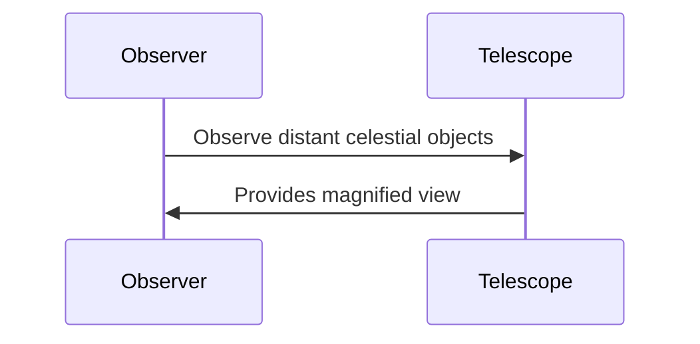
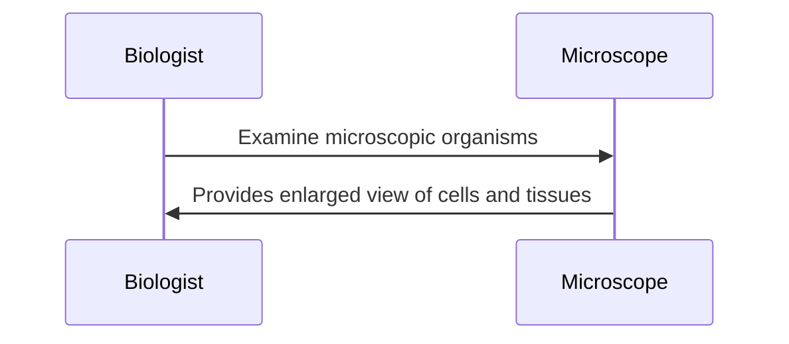
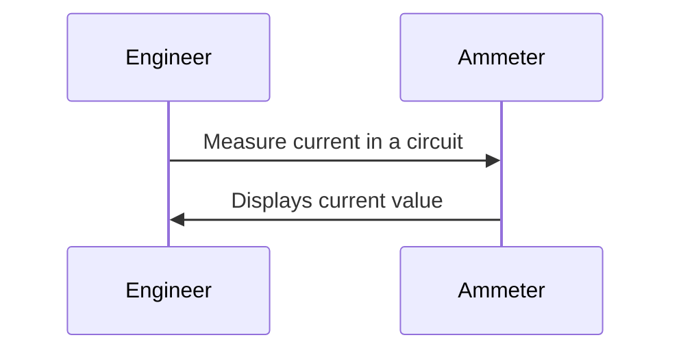
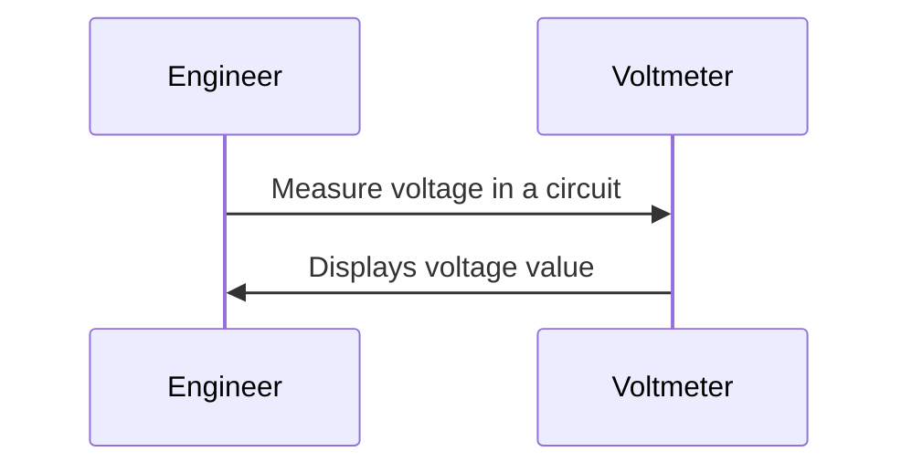
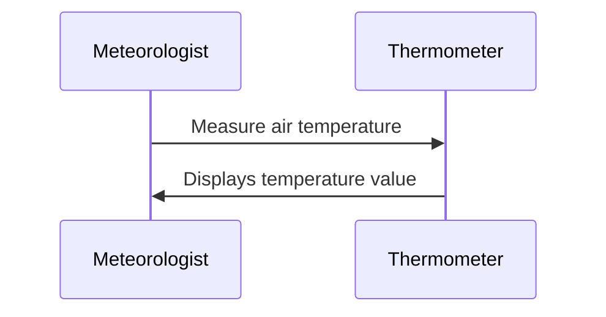
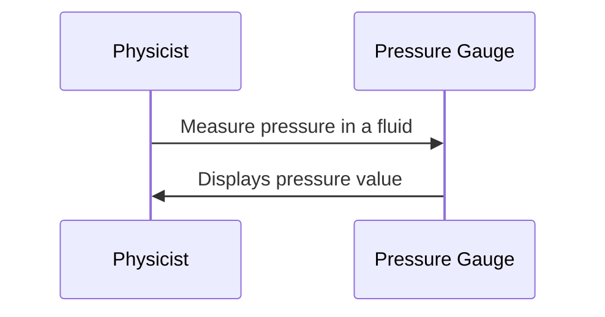
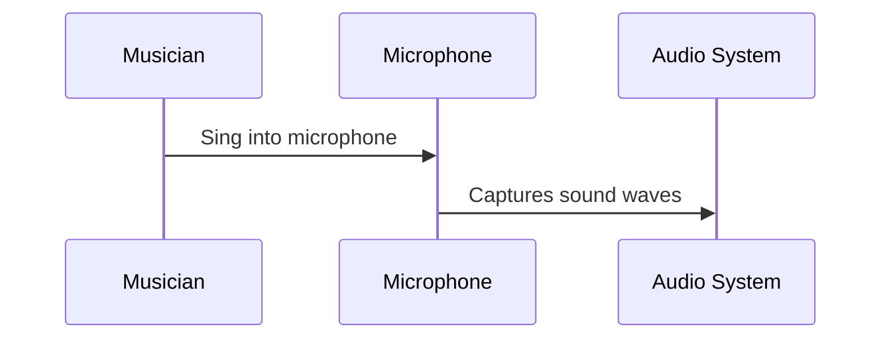
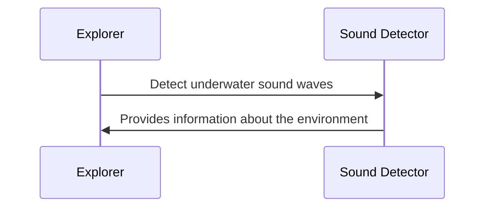
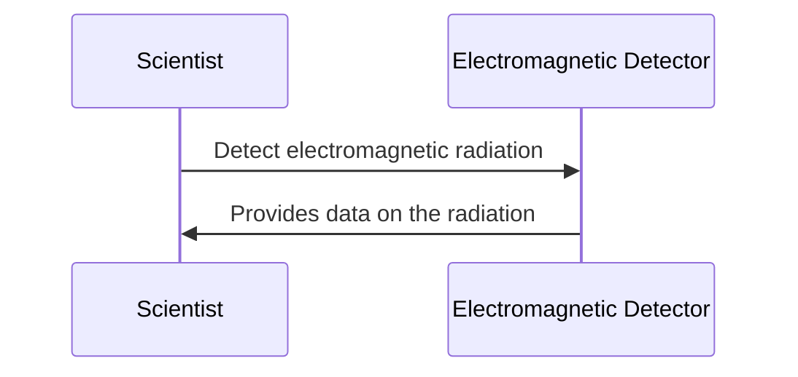
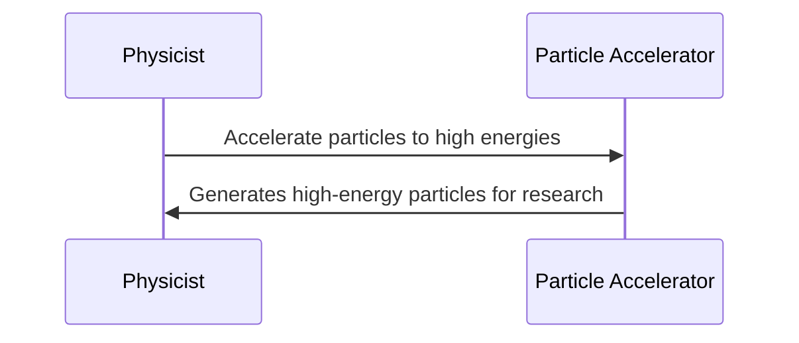

                 


# 科学仪器的演进：扩展人类感知与世界可理解性

## 关键词

科学仪器，感知扩展，人类理解，历史发展，技术进步，未来趋势

## 摘要

本文深入探讨了科学仪器的发展历程及其对人类感知和世界理解的影响。从古代的简单工具到现代的高精度设备，科学仪器的演进不断推动人类认知的边界。通过分析不同历史时期的科学突破，我们揭示了这些仪器如何扩展我们的感知能力，使我们对宇宙、生命和自然界的理解更加深入。本文还探讨了当前的技术趋势和未来挑战，展望了科学仪器在探索未知世界中的潜在作用。

## 第一部分：背景介绍

### 引言与核心概念

科学仪器是科学研究和实验不可或缺的工具。从古代的杠杆和水平仪到现代的粒子加速器和天文望远镜，科学仪器的演变不仅反映了技术的进步，也揭示了人类对自然世界的探索和理解的深化。本文旨在探讨科学仪器如何通过扩展人类感知，推动科学发现和技术创新，进而提升我们对世界的理解。

#### 问题的背景和重要性

科学仪器的出现和发展可以追溯到古代文明，当时人类开始利用简单的工具来探索自然现象。随着历史的发展，科学仪器的精度和复杂性不断提高，为科学研究提供了强大的手段。从伽利略的望远镜到牛顿的显微镜，科学仪器的每一次重大进展都推动了科学革命，并深刻改变了人类对自然界的理解。

#### 科学仪器的定义

科学仪器是指用于科学研究和实验的设备，能够测量、观察或操纵自然现象。它们通常包括传感器、显示器、控制器和其他辅助设备，具有高度的准确性和重复性。科学仪器的种类繁多，涵盖了从简单的测量工具到复杂的实验设备。

#### 人类感知与理解世界的挑战

人类感知世界的局限性限制了我们对自然界的理解。我们的感官只能感知到自然界的一小部分信息，而且往往受到主观因素的影响。科学仪器通过扩展我们的感知能力，使我们能够测量和理解那些肉眼无法察觉的现象。例如，显微镜使我们能够观察微生物和细胞结构，而望远镜则让我们能够探索宇宙的深处。

### 科学仪器的历史发展与演变

科学仪器的发展历程反映了人类对自然世界的不断探索和技术的进步。从古代的简单工具到现代的高精度设备，这一过程充满了创新和突破。

#### 古代至中世纪的科学仪器

在古代，人类开始使用简单的工具来探索自然现象。例如，杠杆、滑轮和水平仪等工具帮助人们进行建筑和工程。中世纪时期，随着阿拉伯文化和古希腊文化的融合，科学仪器得到了进一步的发展。阿拉伯人发明了用于测量角度的圆规和用于测量温度的液体温度计。

#### 文艺复兴时期的科学仪器创新

文艺复兴时期是科学仪器发展的重要时期。伽利略和开普勒等科学家发明了一系列重要的科学仪器，如望远镜和温度计，这些仪器极大地推动了天文学和物理学的发展。

#### 工业革命后的科学仪器发展

工业革命带来了技术的飞速发展，科学仪器也随之得到了极大的改进。蒸汽机、电力和化学工业的兴起推动了科学仪器的复杂化和精确化。例如，电报和电话等通信设备的出现，极大地改变了人类的信息传递方式。

#### 20世纪的科学仪器革命

20世纪是科学仪器发展的黄金时期。量子力学和相对论的提出带来了新的研究方法，推动了科学仪器的进一步发展。例如，电子显微镜和粒子加速器的发明使科学家能够探索微观和宏观世界的奥秘。

### 科学仪器的核心概念与联系

科学仪器的设计和功能取决于其核心概念和原理。以下是一些关键概念及其相互关系：

#### 观测与测量的基本原理

科学仪器的核心功能是观测和测量。观测是通过仪器感知和理解自然现象的过程，而测量则是通过仪器获取数值数据的过程。观测和测量密切相关，互为基础。

#### 概念属性特征对比表格

科学仪器的概念属性特征包括精度、分辨率、可靠性等。通过对比不同仪器的属性特征，我们可以更好地理解它们在科学研究中的应用。

#### ER实体关系图架构

实体关系图（ER图）是描述科学仪器概念和关系的重要工具。ER图可以帮助我们理解科学仪器的组成部分及其相互作用。

## 第二部分：科学仪器的核心概念与联系

### 科学仪器的核心概念原理

科学仪器的核心概念原理涉及测量、传感和数据处理等方面。以下是一些关键概念：

#### 测量原理

测量原理是指科学仪器如何通过物理或化学过程来获取数据的原理。例如，光学仪器的测量原理基于光的反射、折射和干涉等现象。

#### 传感原理

传感原理是指科学仪器如何通过传感器感知物理量并将其转换为电信号或其他形式的信息。传感器是科学仪器的核心部件，其性能直接影响仪器的精度和可靠性。

#### 数据处理原理

数据处理原理是指科学仪器如何对传感器获取的数据进行处理和分析，以获得准确的结果。数据处理通常包括信号放大、滤波、数字化和算法分析等步骤。

### 概念属性特征对比表格

科学仪器的概念属性特征对比表格可以帮助我们更好地理解不同仪器的优势和局限性。以下是一个简单的示例：

| 科学仪器类型 | 精度 | 分辨率 | 可靠性 | 价格 |
| --- | --- | --- | --- | --- |
| 显微镜 | 高 | 中 | 高 | 中 |
| 望远镜 | 中 | 低 | 高 | 高 |
| 温度计 | 高 | 高 | 中 | 低 |

### ER实体关系图架构

实体关系图（ER图）是描述科学仪器概念和关系的重要工具。以下是一个简单的ER图示例，展示了科学仪器的组成部分及其相互作用：

```mermaid
erDiagram
    classid1|<--|classid2 : {1}类关联
    classid1|1|--|*classid3 : {M}多类关联
    classid1|1|--|*classid4 : {M}多类关联
    classid2|1|--|*classid5 : {M}多类关联
    classid3 {
        int id
        string name
        string type
    }
    classid4 {
        int id
        string name
        float value
    }
    classid5 {
        int id
        string name
        bool is Reliable
    }
```

## 第三部分：科学仪器的种类与作用

### 光学仪器

光学仪器是科学仪器中最为广泛使用的一类。它们利用光的性质来观测和测量自然现象。以下是一些常见的光学仪器：

#### 望远镜

望远镜是一种用于观测遥远物体的光学仪器。它们通过放大光线来扩展人类的视野，使我们能够观察到宇宙中的星系、行星和其他天体。望远镜的精度和放大倍数是评估其性能的重要指标。



#### 显微镜

显微镜是一种用于放大微小物体的光学仪器。它们在生物学、医学和材料科学等领域有着广泛的应用。显微镜的分辨率是评估其性能的关键指标。



### 电磁学仪器

电磁学仪器用于测量和检测电磁现象。以下是一些常见的电磁学仪器：

#### 电流表

电流表是一种用于测量电流大小的仪器。它们通常用于电路分析和电气工程。



#### 电压表

电压表是一种用于测量电压大小的仪器。它们在电气工程和电子技术中有着广泛的应用。



### 热力学仪器

热力学仪器用于测量和检测热力学量。以下是一些常见的热力学仪器：

#### 温度计

温度计是一种用于测量温度的仪器。它们在气象学、生物学和工业生产等领域有着广泛的应用。



#### 压力计

压力计是一种用于测量压力的仪器。它们在物理学、化学和工程学等领域有着广泛的应用。



## 第四部分：科学仪器与人类感知的扩展

### 声学仪器

声学仪器用于测量和检测声波。以下是一些常见的声学仪器：

#### 麦克风

麦克风是一种用于捕捉声音的声学仪器。它们在音频录制、通信和生物医学等领域有着广泛的应用。



#### 声波探测仪

声波探测仪是一种用于探测声波传播的仪器。它们在地质勘探、水下探测和声纳技术等领域有着广泛的应用。



### 粒子探测器

粒子探测器用于探测粒子碰撞和衰变过程中的物理量。以下是一些常见的粒子探测器：

#### 电磁探测器

电磁探测器是一种用于探测电磁辐射的粒子探测器。它们在医学成像、核物理学和天文学等领域有着广泛的应用。



#### 粒子加速器

粒子加速器是一种用于加速粒子的设备。它们在粒子物理学、材料科学和医学等领域有着广泛的应用。



## 第五部分：科学仪器的技术进步与创新

### 数字化与计算机技术

数字化和计算机技术的应用极大地推动了科学仪器的发展。计算机可以处理和分析大量的实验数据，提高了仪器的精度和效率。以下是一些数字化和计算机技术对科学仪器的影响：

- **数据采集与处理**：计算机可以自动采集和存储实验数据，提高了实验的效率。
- **实时监测与分析**：计算机可以对科学仪器进行实时监测和分析，提供了更及时和准确的结果。
- **虚拟仪器**：虚拟仪器利用计算机模拟科学仪器的功能，降低了实验成本，提高了可重复性。

### 新材料的应用

新材料的出现为科学仪器的设计和制造带来了新的可能性。以下是一些新材料对科学仪器的影响：

- **超导材料**：超导材料可以降低电阻，提高仪器的灵敏度和效率。
- **纳米材料**：纳米材料具有独特的物理和化学性质，可以用于制造更小、更灵敏的传感器和探测器。
- **陶瓷材料**：陶瓷材料具有高硬度、耐高温和耐腐蚀的特点，可以用于制造更坚固的科学仪器。

### 量子科学的崛起

量子科学的发展为科学仪器带来了新的突破。量子仪器利用量子效应，如量子纠缠和量子叠加，提供了更高的精度和灵敏度。以下是一些量子科学对科学仪器的影响：

- **量子传感器**：量子传感器可以用于测量微弱物理量，如引力波和量子态。
- **量子计算**：量子计算可以加速科学仪器的数据处理和分析，提高了科研效率。
- **量子通信**：量子通信可以确保科学数据的安全传输，提高了实验的可信度。

## 第六部分：科学仪器的未来趋势与挑战

### 潜在的应用领域

科学仪器在未来的应用领域将更加广泛，包括但不限于：

- **医学**：用于早期疾病诊断、癌症治疗和个性化医疗。
- **环境科学**：用于监测气候变化、污染和生态系统健康。
- **天文学**：用于探索宇宙的起源、演化和外星生命。
- **材料科学**：用于新型材料的设计和制备，推动技术革新。

### 环境与伦理问题

随着科学仪器的不断进步，我们也面临一些环境和伦理问题：

- **数据安全与隐私**：科学仪器收集的大量数据可能涉及个人隐私和国家安全问题。
- **环境影响**：科学仪器的制造和使用可能对环境造成负面影响，如电子废料和辐射污染。
- **伦理审查**：科学仪器的应用可能涉及伦理问题，如生物伦理和人类尊严。

### 未来发展方向

科学仪器的发展方向包括：

- **智能化**：通过人工智能和机器学习技术，提高仪器的自动化和智能化水平。
- **微型化**：通过纳米技术和微电子技术，制造更小、更轻便的科学仪器。
- **网络化**：通过物联网和云计算，实现科学仪器的联网和数据共享。
- **量子化**：通过量子科学和量子技术，开发更高精度、更高灵敏度的科学仪器。

## 第七部分：总结与展望

科学仪器的演进不仅扩展了人类的感知能力，也推动了科学和技术的发展。从古代的简单工具到现代的高精度设备，科学仪器的每一次进步都为人类认识世界提供了新的视角。在未来，随着技术的不断进步，科学仪器将在更多领域发挥重要作用，为人类探索未知世界提供更加有力的工具。然而，我们也需要关注科学仪器带来的环境和伦理问题，确保其在推动科技进步的同时，不会对人类社会和自然环境造成负面影响。

## 作者信息

作者：AI天才研究院/AI Genius Institute & 禅与计算机程序设计艺术 /Zen And The Art of Computer Programming

