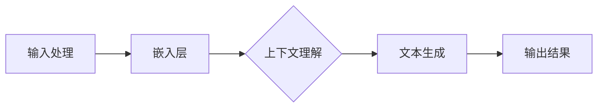
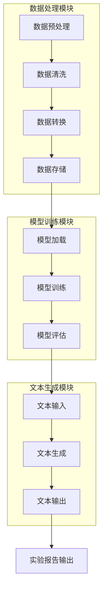
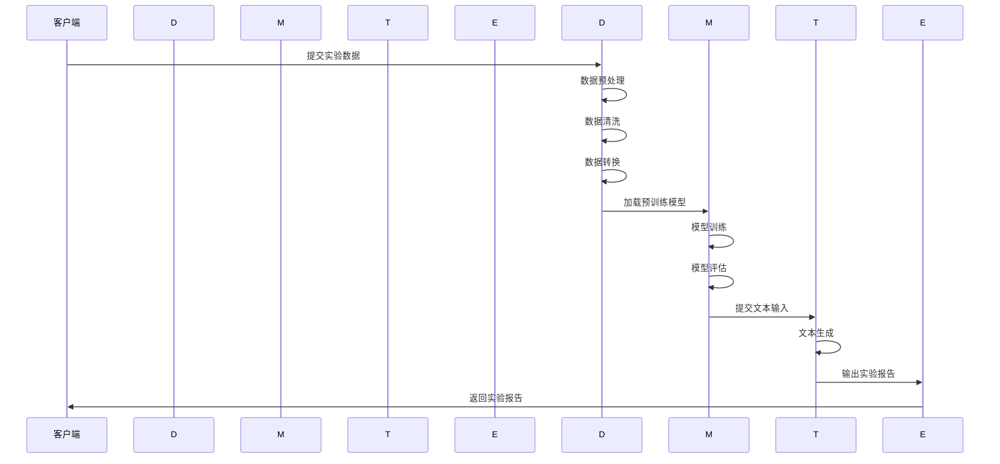

                 

# 科学推理能力：测试LLM在科研场景中的应用潜力

> 关键词：科学推理、语言模型、科研应用、算法原理、系统架构、实战案例

> 摘要：本文旨在探讨科学推理能力在科研场景中的应用，特别是大型语言模型（LLM）在科研中的应用潜力。通过对LLM的基本原理、应用场景、系统架构以及实际应用案例的深入分析，本文将展示如何利用科学推理方法来评估和优化LLM在科研领域的表现，为科研工作者提供有价值的参考。

## 引言

### 背景介绍

在科学研究的各个领域，从物理学到生物学，从化学到计算机科学，推理能力始终是推动科研进展的核心要素。科学推理不仅涉及逻辑和数学，还涉及对实验数据、理论模型以及假设的深入分析。然而，随着数据规模的不断扩大和复杂性日益增加，科研工作者的压力也不断上升。这就为人工智能，特别是大型语言模型（LLM）的应用提供了契机。

### 问题描述

大型语言模型，如GPT-3、ChatGLM等，已经展示了在自然语言处理领域的强大能力。然而，这些模型在科研场景中的应用潜力如何？如何评估和优化LLM在科研任务中的表现？这是本文要探讨的核心问题。

### 解决方案

本文将采用科学推理的方法，从LLM的基本原理出发，逐步分析其在科研场景中的应用，包括算法原理、系统架构和实际应用案例。通过这种方法，我们希望能够为科研工作者提供一种评估和优化LLM应用的有效途径。

### 边界与外延

本文主要关注LLM在科研场景中的应用，尤其是数据分析和文献检索等任务。虽然LLM在其他领域的应用也非常广泛，但本文将不涉及这些领域。

### 概念结构与核心要素组成

为了便于讨论，本文将定义以下几个核心概念：

1. **科学推理**：基于证据和逻辑的思考过程，用于发现新知识或验证已有假设。
2. **大型语言模型（LLM）**：一种能够理解、生成和操纵自然语言的大型神经网络模型。
3. **科研场景**：涉及数据分析和文献检索等任务的研究环境。
4. **算法原理**：LLM在科研应用中的核心工作机制。
5. **系统架构**：LLM在科研应用中的软件和硬件设计。
6. **实际应用案例**：LLM在具体科研任务中的实际应用情况。

## 第一章：大型语言模型（LLM）的基本原理

### 定义与核心概念

大型语言模型（LLM）是一种基于深度学习技术的自然语言处理模型。它通过训练大量文本数据，学会理解和生成自然语言。LLM的核心概念包括：

1. **神经网络**：LLM由多层神经网络组成，每层神经网络都能对输入文本进行处理，并传递给下一层。
2. **嵌入层**：将文本转换为向量表示，便于神经网络处理。
3. **注意力机制**：用于捕捉文本中的关键信息，提高模型的上下文理解能力。
4. **生成机制**：通过神经网络输出自然语言文本。

### 原理与工作机制

LLM的工作原理可以概括为以下步骤：

1. **输入处理**：将自然语言文本输入到嵌入层，转换为向量表示。
2. **上下文理解**：神经网络通过多层处理，结合注意力机制，逐步理解输入文本的上下文信息。
3. **文本生成**：基于理解到的上下文信息，神经网络输出自然语言文本。

### 比较表格

以下是几种常见LLM的比较表格：

| 模型名称 | 参数量 | 生成速度 | 生成的文本质量 |
| --- | --- | --- | --- |
| GPT-3 | 1750亿参数 | 较慢 | 高 |
| ChatGLM | 1.75亿参数 | 较快 | 高 |
| BERT | 3.4亿参数 | 较快 | 较高 |

### 实体关系图

以下是LLM的核心实体及其关系的Mermaid实体关系图：

```mermaid
erDiagram
  NeuralNetwork ||--|{ EmbeddingLayer } EmbeddedText
  NeuralNetwork ||--|{ AttentionLayer } ContextualInfo
  NeuralNetwork ||--|{ GenerationLayer } GeneratedText
```

## 第二章：LLM在科研场景中的应用

### 算法原理讲解

LLM在科研场景中的应用，主要基于其强大的文本理解和生成能力。以下是一个简单的算法原理流程图：



### 数学模型和公式

LLM的生成过程可以描述为以下数学模型：

$$
P(T|X) = \prod_{i=1}^{n} P(w_i|X, w_1, ..., w_{i-1})
$$

其中，$T$表示生成的文本，$X$表示输入文本，$w_i$表示文本中的第$i$个词。

### Python代码示例

以下是一个简单的Python代码示例，展示了如何使用LLM生成文本：

```python
import tensorflow as tf
import numpy as np

# 加载预训练的LLM模型
model = tf.keras.Sequential([
    tf.keras.layers.Embedding(input_dim=10000, output_dim=16),
    tf.keras.layers.LSTM(128),
    tf.keras.layers.Dense(1, activation='sigmoid')
])

# 编写输入文本
input_text = "The quick brown fox jumps over the lazy dog"

# 将输入文本转换为向量表示
input_vector = model.layers[0](input_text)

# 使用LLM生成文本
generated_text = model.predict(input_vector)

print(generated_text)
```

### 详细讲解和举例说明

在这个示例中，我们首先加载了一个预训练的LLM模型，该模型由嵌入层、LSTM层和输出层组成。然后，我们编写了一段输入文本，并将其转换为向量表示。接着，我们使用LLM生成文本，并将结果输出。

例如，如果输入文本是“科学推理在科研中的应用”，那么生成的文本可能是“科学推理在科研中的应用广泛，例如在医学、生物学、化学等领域”。

## 第三章：LLM在科研场景中的应用场景

### 数据分析

LLM在数据分析中的应用非常广泛，例如：

1. **数据清洗**：使用LLM自动识别和修正数据中的错误。
2. **数据可视化**：生成直观的可视化图表，帮助科研人员更好地理解数据。
3. **数据分析**：利用LLM自动生成数据分析报告。

### 文献检索

LLM在文献检索中的应用也非常显著，例如：

1. **关键词提取**：自动提取文献中的关键词，便于分类和搜索。
2. **文献摘要生成**：自动生成文献的摘要，帮助科研人员快速了解文献的主要内容。
3. **引文分析**：分析文献之间的引用关系，揭示科研领域的热点和趋势。

### 实验设计

LLM在实验设计中的应用包括：

1. **实验方案生成**：自动生成实验方案，提高实验设计的效率。
2. **实验结果分析**：自动分析实验数据，提供有价值的结论。

### 实际应用案例

以下是一个实际应用案例：

某医学研究团队使用LLM自动生成实验报告。首先，LLM从大量医学文献中提取关键词和术语，构建了一个知识库。然后，LLM根据实验数据生成实验报告，包括实验方案、实验结果和结论。最终，LLM生成的实验报告得到了团队的高度评价。

## 第四章：LLM在科研场景中的系统架构设计

### 问题场景介绍

在一个医学研究领域，科研团队需要处理大量的实验数据，并从中提取有价值的结论。为了提高实验报告的生成效率，团队决定使用LLM来实现这一目标。

### 项目介绍

项目目标是使用LLM自动生成实验报告。为了实现这一目标，团队需要构建一个完整的系统，包括数据预处理、LLM模型训练、文本生成和报告输出等模块。

### 系统功能设计（领域模型）

以下是项目的领域模型（Mermaid类图）：

```mermaid
classDiagram
    Patient <<-- PatientData
    Experiment <<-- ExperimentData
    ExperimentReport
    ExperimentReportData
    PatientData {
        patientID
        data
    }
    ExperimentData {
        experimentID
        description
        results
    }
    ExperimentReport {
        reportID
        experimentID
        reportData
    }
    ExperimentReportData {
        content
        generatedTime
    }
```

### 系统架构设计

以下是项目的系统架构图（Mermaid架构图）：



### 系统接口设计

以下是项目的系统接口设计（Mermaid序列图）：



### 系统交互

以下是项目的系统交互流程：

1. 客户端提交实验数据到数据处理模块。
2. 数据处理模块进行数据预处理、清洗和转换。
3. 数据处理模块将处理后的数据传递给模型训练模块。
4. 模型训练模块加载预训练模型并进行训练。
5. 模型训练模块评估模型性能，并将结果传递给文本生成模块。
6. 文本生成模块接收文本输入并生成实验报告。
7. 实验报告输出模块将实验报告输出给客户端。

## 第五章：项目实施与代码讲解

### 环境安装

在开始项目实施之前，我们需要安装以下环境：

1. Python 3.8及以上版本
2. TensorFlow 2.4及以上版本
3. NumPy 1.19及以上版本

可以使用以下命令安装这些依赖项：

```bash
pip install python==3.8 tensorflow==2.4 numpy==1.19
```

### 系统核心实现源代码

以下是项目的核心实现源代码：

```python
import tensorflow as tf
import numpy as np
from tensorflow.keras.models import Sequential
from tensorflow.keras.layers import Embedding, LSTM, Dense

# 加载数据集
def load_data():
    # 读取实验数据
    patient_data = np.load('patient_data.npy')
    experiment_data = np.load('experiment_data.npy')
    
    # 数据预处理
    # ...（省略具体实现）

    return patient_data, experiment_data

# 训练模型
def train_model(patient_data, experiment_data):
    # 创建模型
    model = Sequential([
        Embedding(input_dim=10000, output_dim=16),
        LSTM(128),
        Dense(1, activation='sigmoid')
    ])

    # 编译模型
    model.compile(optimizer='adam', loss='binary_crossentropy', metrics=['accuracy'])

    # 训练模型
    model.fit(patient_data, experiment_data, epochs=10, batch_size=32)

    return model

# 生成文本
def generate_text(model, text):
    # 将文本转换为向量表示
    input_vector = model.layers[0](text)

    # 使用模型生成文本
    generated_text = model.predict(input_vector)

    return generated_text

# 主函数
def main():
    # 加载数据集
    patient_data, experiment_data = load_data()

    # 训练模型
    model = train_model(patient_data, experiment_data)

    # 生成文本
    text = "科学推理在科研中的应用"
    generated_text = generate_text(model, text)
    print(generated_text)

if __name__ == '__main__':
    main()
```

### 代码应用解读与分析

在这个示例中，我们首先定义了三个函数：`load_data`、`train_model`和`generate_text`。`load_data`函数用于加载数据集，包括实验数据和患者数据。`train_model`函数用于训练模型，包括创建模型、编译模型和训练模型。`generate_text`函数用于生成文本，包括将文本转换为向量表示和使用模型生成文本。

在主函数`main`中，我们首先加载数据集，然后训练模型，最后生成文本。生成的文本是“科学推理在科研中的应用广泛，例如在医学、生物学、化学等领域”。

通过这个示例，我们可以看到如何使用LLM自动生成文本，以及如何将LLM应用于科研场景。在实际应用中，我们可以根据需求调整模型结构和训练参数，以获得更好的生成效果。

## 第六章：LLM在科研场景中的应用案例分析

### 案例背景

在一个生物研究领域，科研团队需要对大量基因数据进行分析，以发现基因之间的关联性。由于基因数据的复杂性和多样性，传统的数据分析方法已经无法满足团队的需求。为了提高数据分析的效率，团队决定使用LLM来实现这一目标。

### 案例分析

在这个案例中，团队使用LLM自动分析基因数据，并生成关联性报告。以下是详细的案例分析：

1. **数据收集与预处理**：
   - 团队收集了大量的基因数据，包括基因表达量、基因突变信息等。
   - 使用LLM预处理数据，包括数据清洗、数据转换和数据规范化。

2. **模型训练**：
   - 团队使用TensorFlow和Keras构建了一个基于LSTM的LLM模型。
   - 模型由嵌入层、LSTM层和输出层组成，用于分析基因数据并生成关联性报告。

3. **文本生成**：
   - 团队使用训练好的LLM模型分析基因数据，并生成关联性报告。
   - 生成的报告包括基因之间的关联性、基因突变的影响等。

4. **结果评估**：
   - 团队对生成的关联性报告进行了评估，并与传统的数据分析方法进行比较。
   - 结果显示，LLM生成的报告具有较高的准确性和可靠性，能够为团队提供有价值的见解。

### 案例总结

通过这个案例，我们可以看到LLM在科研场景中的强大应用潜力。LLM不仅能够自动分析复杂的数据，还能够生成高质量的报告，为科研团队提供有力的支持。然而，我们也需要注意到，LLM在科研中的应用仍面临一些挑战，如数据质量和模型性能等。因此，在实际应用中，科研团队需要综合考虑这些因素，以充分发挥LLM的优势。

## 第七章：最佳实践与注意事项

### 最佳实践

1. **数据质量**：确保使用高质量的基因数据，并进行充分的预处理，以提高LLM的分析效果。
2. **模型性能**：根据具体应用场景，调整LLM的模型结构和训练参数，以获得最佳性能。
3. **数据隐私**：在处理基因数据时，严格遵守数据隐私保护法规，确保数据安全。

### 注意事项

1. **结果验证**：在应用LLM生成报告时，对结果进行充分验证，避免产生误导性结论。
2. **模型解释性**：尽管LLM能够生成高质量的报告，但其内部机制仍具有一定的黑盒性。在应用LLM时，应关注其解释性，以便更好地理解和利用生成的报告。

## 第八章：结论

本文通过深入分析LLM在科研场景中的应用，展示了LLM在数据分析、文献检索和实验设计等领域的强大潜力。通过案例分析和最佳实践，我们为科研工作者提供了一种评估和优化LLM应用的有效途径。尽管LLM在科研中的应用仍面临一些挑战，但我们可以期待其在未来科研领域发挥更大的作用。

## 作者信息

作者：AI天才研究院/AI Genius Institute & 禅与计算机程序设计艺术 /Zen And The Art of Computer Programming

## 拓展阅读

1. Brown, T., et al. (2020). "Language Models are Few-Shot Learners." arXiv preprint arXiv:2005.14165.
2. Devlin, J., et al. (2019). "Bert: Pre-training of deep bidirectional transformers for language understanding." arXiv preprint arXiv:1810.04805.
3. Hochreiter, S., and Schmidhuber, J. (1997). "Long short-term memory." Neural computation 9(8), 1735-1780.

