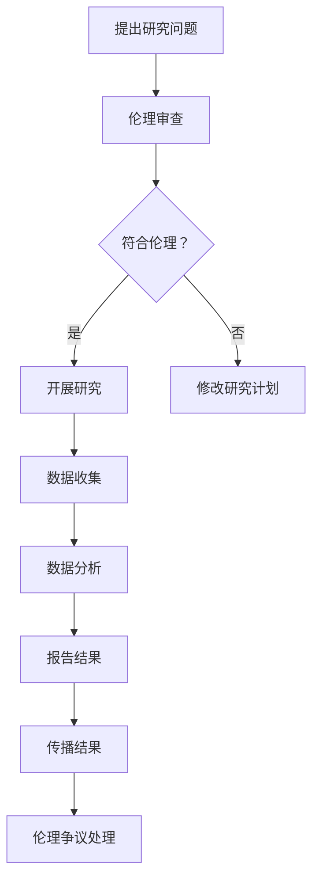
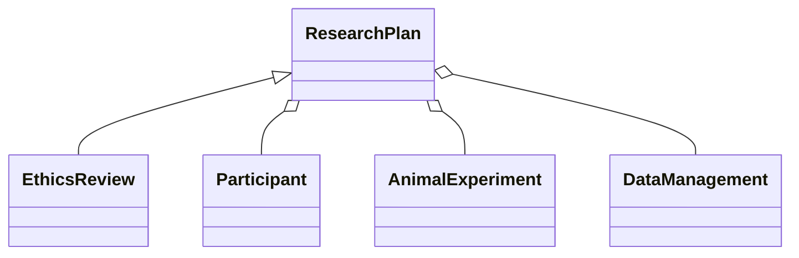

                 

```markdown
----------------------------------------------------------------
# 科学研究的社会契约：平衡世界理解与社会责任

> 关键词：科学研究、伦理道德、社会责任、全球合作、未来展望

> 摘要：本文探讨了科学研究在社会中的角色和责任，强调科学研究不仅追求知识的进步，还应承担起对社会的责任。通过分析科学研究中的伦理问题、社会责任、全球合作以及未来趋势，本文旨在揭示科学研究的社会契约，为科学研究与社会的和谐发展提供思考。

----------------------------------------------------------------
# 第一部分：科学研究与伦理道德

## 第1章：科学研究的伦理基础

### 1.1 科学研究的伦理问题

#### 1.1.1 科学研究的伦理争议

科学研究过程中的伦理争议主要集中在实验方法、数据分享、知识产权等方面。例如，基因编辑技术CRISPR-Cas9的应用引发了对生物伦理的讨论，特别是在人类胚胎基因编辑上。此外，数据共享的问题也引发了争议，一些科学家主张开放数据，而另一些则担心数据共享可能侵犯隐私。

#### 1.1.2 科学伦理的基本原则

科学伦理的基本原则包括尊重人的尊严、公正性、诚实性、透明度和责任。尊重人的尊严要求在研究过程中保护参与者的权益，避免对他们的伤害。公正性要求在分配资源和机会时公平对待所有人。诚实性和透明度是科学研究的基石，要求科学家诚实地报告研究结果，公开数据和方法。责任要求科学家对自己和他人负责，确保研究不会对社会造成负面影响。

#### 1.1.3 伦理审查与道德责任

伦理审查是确保科学研究符合道德规范的重要手段。大多数研究机构和研究项目都需要通过伦理审查委员会的审查。道德责任要求科学家不仅在研究过程中遵守伦理规范，还要在研究成果的传播和应用中履行社会责任。

## 第2章：科学研究与社会责任

### 2.1 科学成果与社会影响

科学成果对社会有着深远的影响。例如，互联网技术的发展改变了人们的生活、工作方式，同时也带来了隐私和安全问题。气候变化研究的进展影响了全球的政策制定和经济发展。

#### 2.1.1 科学成果的传播与影响

科学成果的传播渠道多样，包括学术期刊、会议、社交媒体等。传播的科学成果对公众的理解和行为有着重要影响。科学传播的目的是提高公众的科学素养，促进科学的普及和应用。

#### 2.1.2 科学研究的社会责任

科学研究的社会责任包括为社会提供有益的知识、推动社会进步、保护环境、促进可持续发展等。科学家有责任确保研究成果对社会有益，避免对环境和社会造成负面影响。

#### 2.1.3 科学家的社会责任

科学家作为知识的生产者和传播者，有责任为社会做出贡献。这包括参与公共事务、提供科学咨询、参与科学教育等。科学家的社会责任不仅体现在个人行为上，也体现在对研究机构和社会的影响上。

## 第3章：科学伦理的实践与挑战

### 3.1 科学伦理的实践案例

科学伦理的实践案例丰富多样。例如，在生物伦理方面，对动物实验的道德考量；在网络安全领域，对数据隐私的保护；在气候变化研究方面，对可持续发展策略的制定。

#### 3.1.1 案例分析：生物伦理争议

生物伦理争议的案例包括人类胚胎基因编辑、动物实验伦理等。这些案例引发了关于生命伦理、动物权利等方面的讨论。科学家需要在尊重生命和追求知识之间找到平衡。

#### 3.1.2 案例分析：网络安全问题

网络安全问题包括数据泄露、网络攻击等。这些问题对个人隐私、国家安全和社会稳定构成威胁。科学家在网络安全领域扮演着重要的角色，需要不断创新安全技术和方法。

#### 3.1.3 案例分析：气候变化研究

气候变化研究对社会和环境产生了深远影响。科学家需要通过研究和数据，提供科学依据，帮助制定应对气候变化的策略和政策。

### 3.2 科学伦理的挑战与对策

科学伦理的挑战包括新兴技术的伦理问题、跨学科合作中的伦理冲突、国际科研合作中的文化差异等。对策包括加强科学伦理教育和培训、建立全球伦理规范、促进国际科研合作中的文化理解等。

----------------------------------------------------------------
# 第二部分：科学研究与全球合作

## 第4章：科学研究的国际合作

### 4.1 国际科学合作的现状与趋势

国际科学合作已经成为科学研究的重要趋势。全球科研机构、学术团体和国际组织的合作日益紧密，形成了全球科学共同体。国际科学合作的现状体现在跨国科研项目、国际合作实验室、国际学术会议等方面。

#### 4.1.1 国际科学合作的重要性

国际科学合作的重要性体现在知识共享、技术创新、解决全球问题等方面。通过国际合作，科学家可以分享研究成果，加速科学进步，共同应对全球性挑战。

#### 4.1.2 国际科学合作的主要形式

国际科学合作的主要形式包括跨国科研项目、国际合作实验室、国际学术会议、科研数据共享等。这些形式有助于促进科学知识的传播和技术的创新。

#### 4.1.3 国际科学合作的挑战与机遇

国际科学合作面临的挑战包括语言障碍、文化差异、政治因素等。然而，这些挑战也为科学家提供了机遇，促进了全球科学共同体的合作与发展。

## 第5章：科学研究的全球责任

### 5.1 科学研究的全球责任

科学研究的全球责任体现在解决全球问题、促进可持续发展、保护环境等方面。科学家有责任通过研究提供解决方案，推动全球社会的进步。

#### 5.1.1 全球问题的科学解决方案

全球问题如气候变化、能源危机、疾病传播等需要科学的解决方案。科学家需要通过研究，提供科学依据，推动政策制定和社会变革。

#### 5.1.2 科学研究的全球责任

科学研究的全球责任要求科学家不仅关注科学进步，还要关注对社会和环境的影响。科学家需要在研究过程中考虑社会责任，确保研究成果对社会有益。

#### 5.1.3 全球科研合作与可持续发展

全球科研合作是推动可持续发展的重要手段。科学家需要通过国际合作，分享研究成果，推动技术创新，共同应对全球挑战。

## 第6章：科学研究的国际合作与伦理

### 6.1 国际科研合作的伦理问题

国际科研合作的伦理问题包括数据共享、知识产权、文化差异等。这些伦理问题需要通过国际合作和全球伦理规范来解决。

#### 6.1.1 国际科研合作的伦理争议

国际科研合作的伦理争议主要集中在数据共享和知识产权方面。一些科学家主张开放数据，而另一些则担心数据共享可能侵犯知识产权。

#### 6.1.2 国际科研合作的伦理原则

国际科研合作的伦理原则包括尊重知识产权、保护隐私、公平合作等。这些原则有助于确保国际科研合作的顺利进行。

#### 6.1.3 国际科研合作的伦理监管

国际科研合作的伦理监管需要通过国际组织和学术团体的合作来实现。建立全球伦理规范和监管机制，有助于解决国际科研合作中的伦理争议。

### 6.2 国际科研合作的伦理案例

国际科研合作的伦理案例包括人类基因编辑、气候变化研究、网络安全合作等。这些案例展示了国际科研合作中的伦理争议和挑战。

#### 6.2.1 案例分析：人类基因编辑

人类基因编辑引发了关于伦理和安全性的争议。科学家需要通过国际合作，制定伦理规范，确保人类基因编辑的安全性和合理性。

#### 6.2.2 案例分析：气候变化研究合作

气候变化研究合作需要各国科学家的共同努力。国际合作有助于推动气候变化研究的进展，为全球气候治理提供科学依据。

#### 6.2.3 案例分析：网络安全国际合作

网络安全国际合作旨在应对全球网络威胁。各国科学家需要通过合作，共同开发网络安全技术，提高全球网络安全性。

----------------------------------------------------------------
# 第三部分：科学研究与未来展望

## 第7章：科学研究的未来趋势

### 7.1 科学研究的未来发展

科学研究的未来发展将受到新兴科技如人工智能、量子计算、生物技术等的推动。这些科技将为科学研究带来新的机遇和挑战。

#### 7.1.1 新兴科技对科学研究的推动

新兴科技如人工智能和量子计算等将对科学研究产生深远影响。人工智能可以帮助科学家处理大量数据，加速科学发现的进程。量子计算则可能带来全新的计算能力和科学研究方法。

#### 7.1.2 科学研究对社会的影响

科学研究对社会的影响将越来越显著。科学技术的进步将推动社会的发展和进步，同时也带来新的伦理和社会问题。

#### 7.1.3 科学研究的新模式

科学研究的新模式将更加注重跨学科合作和国际合作。科学家需要通过合作，共享资源和知识，共同解决全球性问题。

## 第8章：科学研究的伦理与社会责任未来展望

### 8.1 科学研究的伦理未来

科学研究的伦理未来将面临新的挑战。随着科技的进步，科学家需要不断更新伦理规范，确保科学研究符合社会和伦理标准。

#### 8.1.1 伦理问题的未来挑战

伦理问题的未来挑战将包括人工智能、基因编辑、生物技术等新兴科技的应用。科学家需要通过国际合作，制定适应未来科技发展的伦理规范。

#### 8.1.2 伦理研究的未来趋势

伦理研究的未来趋势将更加注重跨学科研究和社会参与。伦理研究将不仅关注科学技术的应用，还将关注对社会的影响和责任。

#### 8.1.3 科学研究的伦理规范

科学研究的伦理规范将更加完善和严格。科学家需要在研究过程中遵守伦理规范，确保研究成果对社会有益。

### 8.2 科学研究的社会责任未来

科学研究的社会责任未来将更加凸显。科学家需要通过研究，提供解决社会问题的科学依据，推动社会进步和可持续发展。

#### 8.2.1 社会责任的未来发展方向

社会责任的未来发展方向将包括环境保护、可持续发展、社会公正等方面。科学家需要通过研究，提供科学解决方案，推动社会进步。

#### 8.2.2 科学研究对社会影响的未来趋势

科学研究对社会影响的未来趋势将更加显著。科学技术的进步将推动社会的发展和进步，同时也带来新的伦理和社会问题。

#### 8.2.3 科学研究社会责任的未来实践

科学研究社会责任的未来实践将更加注重实际应用和成果转化。科学家需要通过研究，提供实际可行的解决方案，推动社会变革。

----------------------------------------------------------------
## 附录：参考文献与相关资源

### 附录1：参考文献

#### 参考文献1

- 文献名称：《科学研究的伦理与社会责任》
- 作者：[作者姓名]
- 出版年份：[出版年份]
- 出版社：[出版社名称]

### 附录2：相关资源

#### 相关资源1

- 资源名称：《全球科学研究合作报告》
- 来源：[来源名称]
- 访问时间：[访问时间]

## 作者

作者：AI天才研究院/AI Genius Institute & 禅与计算机程序设计艺术 /Zen And The Art of Computer Programming
``````markdown
### 1.1.1 科学研究的伦理争议

科学研究的伦理争议通常源于实验对象、实验方法、数据共享、知识产权保护等多个方面。在实验对象方面，生物医学研究中的动物实验一直备受争议。动物权利倡导者认为，将动物作为实验对象是对动物权益的侵犯，违背了生物伦理的基本原则。尽管实验动物的使用受到严格的伦理审查和监管，但仍然无法完全消除伦理争议。

在实验方法方面，一些高调的科学实验，如瑞士科学家伊曼纽尔·沙勒的“头部移植”实验，引发了关于人类尊严、道德底线和社会后果的广泛讨论。此类实验不仅在科学界引发了巨大争议，还引起了公众的广泛关注和质疑。科学家的道德责任和实验的伦理边界成为讨论的焦点。

数据共享是另一个引发伦理争议的领域。一些科学家主张开放数据，以便其他研究者可以验证和扩展研究结果。然而，另一些科学家则担心数据共享可能侵犯知识产权，导致研究成果的商业价值受损。此外，数据共享也可能引发隐私问题，特别是在涉及个人健康数据时。

知识产权保护也是科学研究中的一大伦理争议点。科学家的研究成果往往需要通过专利来保护，以确保他们的创新得到经济回报。然而，专利制度有时可能导致知识垄断，阻碍科学知识的传播和利用。平衡知识产权保护和知识共享是科学伦理中的一个重要问题。

### 1.1.2 科学伦理的基本原则

科学伦理的基本原则是科学家在科研活动中应遵循的行为准则，它们为科学研究提供了道德框架。以下是科学伦理的几个基本原则：

1. **尊重人的尊严**：科学家在进行人体实验时，必须尊重参与者的尊严和自主权。这包括确保参与者充分理解实验的目的、过程和潜在风险，并自愿同意参与。

2. **公正性**：科学研究应该公平对待所有参与者，确保资源分配的公平性和机会均等。科学家应该避免任何形式的歧视，包括性别、种族、年龄和残疾等。

3. **诚实性**：科学家必须诚实地报告研究结果，不得篡改或隐瞒数据。科学研究的核心在于真实和可靠的数据，任何形式的欺骗都是科学伦理的严重违反。

4. **透明度**：科学研究的过程和结果应该透明，以便其他科学家可以验证和重复实验。透明度有助于提高科研的可靠性，防止学术不端行为。

5. **责任**：科学家对自己的研究行为负责，对研究结果可能带来的社会影响负责。这包括在研究过程中遵守法律和伦理规范，确保研究不会对社会、环境和人类健康造成负面影响。

### 1.1.3 伦理审查与道德责任

伦理审查是确保科学研究符合伦理规范的重要机制。大多数研究机构都设有伦理审查委员会（Institutional Review Boards, IRBs），负责评估研究计划的伦理问题，并确保研究在道德上可接受。

伦理审查通常包括以下几个方面：

1. **参与者的知情同意**：研究必须获得参与者的知情同意，确保他们了解研究的性质、目的、风险和利益，并在自愿的基础上参与研究。

2. **隐私保护**：研究过程中必须采取措施保护参与者的隐私和个人信息，防止未经授权的数据泄露。

3. **利益冲突管理**：研究人员和机构必须披露可能存在的利益冲突，并采取措施避免或减少这些冲突对研究的影响。

4. **研究设计的伦理审查**：研究设计必须符合伦理原则，避免不必要的风险和痛苦，并确保研究方法的合理性。

5. **研究结果的伦理审查**：研究结果的发布和传播也必须经过伦理审查，确保研究结果不会对参与者或社会造成不利影响。

道德责任是科学家在科研活动中应承担的伦理义务。科学家不仅要在研究过程中遵守伦理规范，还要在研究成果的传播和应用中履行社会责任。道德责任包括以下几个方面：

1. **负责任的研究行为**：科学家应确保自己的研究行为符合伦理规范，不进行不道德的实验或数据造假。

2. **社会责任**：科学家应意识到自己的研究成果可能对社会、环境和人类健康产生的影响，并努力确保这些影响是积极的。

3. **科学传播**：科学家有责任以透明和负责任的方式传播自己的研究成果，提高公众的科学素养。

4. **科学咨询**：科学家应积极参与公共事务，为政策制定者和公众提供科学的咨询和建议。

### 2.1.1 科学成果的传播与影响

科学成果的传播对科学进步和社会发展至关重要。科学成果的传播渠道包括学术期刊、会议、社交媒体等。学术期刊是科学成果传播的传统渠道，它们通过严格的同行评审过程确保研究的质量和可靠性。学术会议则为科学家提供了一个展示研究成果、交流思想和观点的平台。

随着互联网和社交媒体的兴起，科学成果的传播方式也发生了重大变化。通过社交媒体，科学家可以更快速地传播自己的研究成果，让更多的人了解和参与科学讨论。然而，社交媒体上的信息传播速度虽然快，但也可能导致信息的失真和误解。因此，科学家在使用社交媒体传播科学成果时，需要确保信息的准确性和完整性。

科学成果对社会的影响是多层次和多维度的。首先，科学成果可以推动技术创新和经济发展。例如，互联网技术的发展不仅改变了人们的生活方式，也催生了众多新兴产业。其次，科学成果可以提高公众的科学素养，增强社会的科学意识。例如，气候变化研究的结果促使全球各国采取行动，减少碳排放，保护地球环境。然而，科学成果也可能带来负面影响。例如，基因编辑技术的应用虽然具有巨大的潜力，但也引发了关于生物伦理和社会影响的广泛争议。

### 2.1.2 科学研究的社会责任

科学研究的社会责任是指科学家在追求科学进步的同时，应承担起对社会的责任。科学研究的社会责任体现在多个方面：

1. **推动社会进步**：科学家通过研究解决社会面临的问题，如疾病治疗、环境保护、能源开发等。科学研究可以提供新的知识和技术，推动社会的发展和进步。

2. **促进可持续发展**：科学家应关注研究对社会和环境的影响，推动可持续发展。例如，在能源领域，科学家应研究如何开发清洁能源，减少对环境的破坏。

3. **保护公众健康**：科学家在医学研究中应确保研究的安全性和有效性，保护公众的健康和福祉。例如，药物研发过程中，科学家需要确保新药的安全性和有效性，以保护患者的利益。

4. **科学普及**：科学家有责任向公众传播科学知识，提高公众的科学素养。科学普及不仅有助于消除公众对科学的误解，还可以激发公众对科学的兴趣和参与。

5. **伦理审查**：科学家在研究过程中应自觉接受伦理审查，确保研究符合伦理规范，不损害研究对象的权益。

### 2.1.3 科学家的社会责任

科学家的社会责任是其职业的一部分，它超越了科学研究本身，涉及到科学家的行为、决策和在社会中的角色。以下是科学家社会责任的几个方面：

1. **道德行为**：科学家应在研究中坚持道德原则，诚实、透明地报告研究结果，不进行学术不端行为。

2. **社会责任**：科学家应意识到自己的研究成果可能对社会产生的影响，并努力确保这些影响是积极的。科学家应参与公共事务，为政策制定提供科学依据。

3. **社会参与**：科学家应积极参与社会活动，如科学普及、科技咨询和社区服务，促进科学与社会之间的互动。

4. **教育责任**：科学家应培养下一代科学家，传授科学知识和研究方法，推动科学教育的发展。

5. **国际视野**：科学家应具有国际视野，积极参与国际合作，推动全球科学共同体的合作与发展。

### 3.1.1 案例分析：生物伦理争议

生物伦理争议是科学研究中一个常见且敏感的话题。以下是一些典型的生物伦理争议案例：

1. **基因编辑**：基因编辑技术如CRISPR-Cas9的出现，为治疗遗传性疾病和改善人类健康带来了希望。然而，基因编辑也引发了关于伦理和安全性的广泛争议。特别是在人类胚胎基因编辑方面，一些科学家认为，对胚胎进行基因编辑可能会产生未知的长期影响，并可能导致伦理危机。

2. **动物实验**：在生物医学研究中，动物实验是常见的方法。然而，动物实验也引发了伦理争议。动物权利倡导者认为，将动物作为实验对象是对动物权益的侵犯，违背了生物伦理的基本原则。尽管动物实验受到严格的伦理审查和监管，但仍然无法完全消除伦理争议。

3. **人体试验**：在药物研发过程中，人体试验是必不可少的一环。然而，一些历史上的人体试验，如纳粹德国的“死亡营”试验和20世纪60年代的塔斯基吉梅毒研究，揭示了人体试验中的伦理问题。这些案例表明，人体试验必须遵循严格的伦理规范，确保参与者的权益不受损害。

### 3.1.2 案例分析：网络安全问题

网络安全问题是现代社会面临的重大挑战之一。以下是一些典型的网络安全争议案例：

1. **数据泄露**：随着互联网的普及，数据泄露事件频繁发生。例如，2017年的“剑桥分析公司”数据泄露事件，暴露了数百万用户的个人信息。此类事件引发了关于数据隐私保护和数据共享的伦理争议。

2. **网络攻击**：网络攻击如勒索软件、网络钓鱼和分布式拒绝服务攻击（DDoS攻击）等，不仅对个人和企业造成经济损失，还可能导致敏感信息的泄露和系统的瘫痪。网络攻击的伦理争议在于，攻击者是否应受到道德谴责，以及如何防止网络攻击的发生。

3. **网络安全技术**：网络安全技术的发展，如加密技术和网络防火墙，虽然有助于提高网络安全性，但也引发了关于隐私和自由的争议。一些专家认为，过度的网络安全措施可能侵犯公民的隐私权。

### 3.1.3 案例分析：气候变化研究

气候变化研究是科学界和公众关注的重点领域。以下是一些典型的气候变化研究争议案例：

1. **气候变化数据的真实性和可靠性**：气候变化数据的真实性和可靠性是科学界和公众关注的焦点。一些气候怀疑论者质疑气候变化数据的真实性和可靠性，认为气候变化可能是自然现象。这种争议导致了关于气候变化研究诚信和科学方法的讨论。

2. **气候变化政策的影响**：气候变化政策的制定和实施引发了关于经济、能源和环境的争议。例如，一些国家反对采取过于激进的减排措施，认为这可能会损害经济发展和能源安全。另一方面，一些环保组织认为，气候变化带来的风险需要更积极的政策响应。

3. **气候变化研究的国际合作**：气候变化研究需要国际合作，但不同国家和地区的利益冲突可能导致合作困难。例如，一些发展中国家担心，气候变化政策可能导致他们承受过多的经济负担。

### 3.2.1 新兴技术的伦理挑战

随着科技的快速发展，新兴技术如人工智能、生物技术、基因编辑等给科学研究带来了新的伦理挑战。以下是一些新兴技术的伦理挑战：

1. **人工智能**：人工智能的快速发展引发了关于隐私、安全和就业的伦理争议。例如，人工智能系统的偏见和歧视可能导致社会不公平。此外，人工智能的自动化可能导致大量就业岗位的消失。

2. **生物技术**：生物技术的进步，如基因编辑和合成生物学，带来了巨大的医疗和社会变革潜力。然而，这些技术也引发了关于人类尊严、生物多样性和伦理底线的争议。

3. **基因编辑**：基因编辑技术如CRISPR-Cas9的出现，使得人类有能力编辑自己的基因。然而，这种技术也引发了关于伦理和安全性的争议，特别是在人类胚胎基因编辑方面。

### 3.2.2 科学伦理教育与培训

科学伦理教育和培训是培养科学家伦理意识和责任感的重要途径。以下是一些科学伦理教育与培训的方法和策略：

1. **课程设置**：科学伦理应成为大学课程的一部分，让学生在专业学习的同时了解伦理原则和实践。

2. **工作坊和研讨会**：组织科学伦理工作坊和研讨会，让科学家讨论和解决实际伦理问题。

3. **案例研究**：通过案例分析，让科学家了解不同领域中的伦理争议和解决方案。

4. **伦理培训**：为研究人员提供专门的伦理培训，确保他们在研究中遵守伦理规范。

5. **伦理审查委员会**：建立伦理审查委员会，确保研究的伦理合规性。

### 3.2.3 国际科学合作与伦理协调

国际科学合作是推动科学进步和解决全球问题的重要手段。然而，国际科学合作中也存在伦理争议和协调问题。以下是一些国际科学合作中的伦理协调策略：

1. **建立全球伦理规范**：通过国际组织和学术团体，建立全球科学研究的伦理规范，为国际科学合作提供指导。

2. **文化理解与尊重**：在国际科学合作中，尊重不同国家和地区的文化差异，避免文化冲突。

3. **跨学科合作**：促进不同学科之间的合作，共同解决科学研究中出现的伦理问题。

4. **国际伦理审查**：建立国际伦理审查机制，确保国际科研项目的伦理合规性。

5. **国际合作与对话**：通过国际合作和对话，解决国际科学合作中的伦理争议，促进全球科学共同体的和谐发展。

### 4.1.1 国际科学合作的重要性

国际科学合作在推动科学进步和解决全球问题中扮演着关键角色。以下是一些国际科学合作的重要性和优势：

1. **知识共享**：国际科学合作促进了科学知识的共享和传播，使得各国科学家可以共同分享研究成果和经验，加速科学发现的进程。

2. **技术创新**：国际科学合作有助于促进技术创新和研发，通过跨国项目和合作实验室，科学家可以共同开发新技术和解决方案。

3. **解决全球问题**：全球性问题如气候变化、疾病传播、环境污染等需要国际科学合作。只有通过国际合作，科学家才能共同应对这些全球挑战。

4. **人才培养**：国际科学合作为科学家提供了跨学科、跨文化的学习机会，有助于培养具有国际视野和创新能力的科研人才。

5. **资源整合**：国际科学合作可以整合全球科研资源，提高科研效率，降低研究成本。

### 4.1.2 国际科学合作的主要形式

国际科学合作有多种形式，每种形式都有其独特的特点和优势。以下是一些常见的国际科学合作形式：

1. **跨国科研项目**：跨国科研项目是国际科学合作的重要形式，通过跨国科研团队的合作，共同研究科学问题。这类项目通常涉及多个国家和研究机构，可以充分利用各方的资源和优势。

2. **国际合作实验室**：国际合作实验室是在不同国家建立的科研合作平台，旨在促进科学家之间的合作和交流。国际合作实验室通常由来自不同国家的科学家共同管理和运营。

3. **国际学术会议**：国际学术会议是科学家分享研究成果、交流思想和观点的重要平台。国际学术会议促进了科学界的全球合作，加强了科学家之间的联系。

4. **科研数据共享**：科研数据共享是国际科学合作的重要手段，通过开放数据共享，科学家可以更容易地访问和利用全球范围内的科研数据，加速科学发现和知识传播。

5. **国际学术交流**：国际学术交流包括科学家之间的访问、培训和合作研究项目。这类交流有助于增进科学家之间的了解和合作，推动国际科学合作的发展。

### 4.1.3 国际科学合作的挑战与机遇

国际科学合作虽然具有重要意义，但也面临一系列挑战和机遇。以下是一些国际科学合作中的挑战和应对策略：

1. **语言障碍**：语言差异是国际科学合作中的一个主要挑战。为了克服这一障碍，科学家可以学习合作语言，使用翻译工具，或者通过国际学术会议和合作项目提高跨文化交流能力。

2. **文化差异**：不同国家和地区的文化差异可能导致合作中的误解和冲突。为了解决这一问题，科学家需要相互尊重和理解不同文化，通过建立有效的沟通机制来促进合作。

3. **政治因素**：国际科学合作往往受到政治因素的影响，包括政策变化、国际关系和外交政策等。科学家需要与政府和非政府组织合作，确保科研合作的顺利进行。

4. **伦理争议**：国际科学合作中的伦理争议需要通过国际合作和全球伦理规范来解决。科学家需要参与全球伦理讨论，共同制定适应新兴科技发展的伦理规范。

5. **机遇**：国际科学合作提供了大量机遇，包括知识共享、技术创新、人才交流等。科学家应抓住这些机遇，推动科学合作和共同发展。

### 5.1.1 全球问题的科学解决方案

全球问题如气候变化、能源危机、疾病传播等需要科学的解决方案。科学家在全球问题解决中的作用和贡献体现在以下几个方面：

1. **科学研究**：科学家通过研究全球问题，提供科学依据和解决方案。例如，气候变化研究为制定减排政策和应对气候变化提供了科学支持。

2. **技术发明**：科学家通过技术创新，开发解决全球问题的技术和方法。例如，清洁能源技术的发展有助于减少对环境的破坏。

3. **政策建议**：科学家为政策制定者提供科学建议，推动全球问题的解决。例如，疾病传播研究为公共卫生政策的制定提供了科学依据。

4. **国际合作**：科学家在国际合作中发挥关键作用，通过跨国项目和合作研究，共同解决全球问题。

### 5.1.2 科学研究的全球责任

科学研究的全球责任是指科学家在追求科学进步的同时，应承担起对全球社会的责任。以下是一些科学研究全球责任的体现：

1. **解决全球问题**：科学家有责任通过研究解决全球性问题，如气候变化、能源危机、疾病传播等。

2. **推动可持续发展**：科学家应关注研究对社会和环境的影响，推动可持续发展。

3. **知识传播**：科学家有责任传播科学知识，提高公众的科学素养。

4. **伦理审查**：科学家应自觉接受伦理审查，确保研究符合伦理规范。

### 5.1.3 全球科研合作与可持续发展

全球科研合作是推动可持续发展的重要手段。以下是一些全球科研合作与可持续发展的重要方面：

1. **共享资源**：全球科研合作有助于共享科研资源，提高科研效率。

2. **技术创新**：全球科研合作促进技术创新和研发，为可持续发展提供技术支持。

3. **知识共享**：全球科研合作促进科学知识的共享和传播，为可持续发展提供科学依据。

4. **国际合作**：全球科研合作加强国际间的合作与交流，推动全球可持续发展。

### 6.1.1 国际科研合作的伦理争议

国际科研合作中的伦理争议主要涉及数据共享、知识产权和文化差异等方面。以下是一些典型的伦理争议案例：

1. **数据共享**：一些科学家主张开放数据，以促进科学发现和知识共享。然而，另一些科学家则担心开放数据可能侵犯知识产权和个人隐私。例如，人类基因组的公开引发了对数据隐私保护的争议。

2. **知识产权**：国际科研合作中的知识产权问题复杂多样。在跨国合作项目中，如何分配知识产权、保护知识产权等成为伦理争议的焦点。一些科学家认为，知识产权保护可能阻碍科学知识的传播和应用。

3. **文化差异**：不同国家和地区的文化差异可能导致合作中的误解和冲突。例如，一些国家可能对研究伦理有不同的理解和实践，这可能导致国际科研合作中的伦理争议。

### 6.1.2 国际科研合作的伦理原则

国际科研合作的伦理原则旨在确保科研活动的道德合规性和公正性。以下是一些国际科研合作的伦理原则：

1. **尊重参与者**：在科研合作中，必须尊重参与者的权利和尊严。这包括确保参与者充分了解研究的性质、目的和潜在风险，并自愿参与。

2. **公平合作**：科研合作应公平对待所有参与方，确保资源分配和机会均等。任何形式的歧视都是不可接受的。

3. **知识产权保护**：在跨国合作中，知识产权的保护至关重要。各方应遵守国际知识产权法律法规，确保知识产权得到合法保护。

4. **数据共享**：科研合作中的数据共享应基于透明和公正的原则。数据共享有助于提高科研效率，促进科学发现。

5. **责任与透明度**：科学家和机构应承担起研究责任，确保研究成果的透明度和公正性。

### 6.1.3 国际科研合作的伦理监管

国际科研合作的伦理监管是确保科研活动道德合规性的关键环节。以下是一些国际科研合作的伦理监管机制：

1. **伦理审查**：大多数国际科研合作项目都需要通过伦理审查。伦理审查委员会负责评估研究计划的伦理问题，确保研究符合道德规范。

2. **国际规范**：国际组织和学术团体制定了一系列伦理规范，为国际科研合作提供指导。这些规范包括数据共享、知识产权保护和伦理争议解决等。

3. **跨国合作协议**：跨国合作项目通常需要签订合作协议，明确各方在研究中的权利和责任。合作协议有助于规范国际科研合作的行为。

4. **法律框架**：各国政府和国际组织制定了相关法律法规，为国际科研合作提供法律保障。这些法律法规包括知识产权保护、数据隐私保护和伦理争议解决等。

### 6.2.1 案例分析：人类基因编辑

人类基因编辑是近年来备受关注的科学领域，同时也是伦理争议的热点。以下是一些人类基因编辑的伦理争议案例：

1. **人类胚胎基因编辑**：2018年，中国科学家贺建奎宣布成功利用CRISPR-Cas9技术对一对双胞胎的基因进行了编辑，以防止他们感染艾滋病。这一声明引发了全球科学界和伦理学界的强烈反响。许多科学家和伦理学家认为，人类胚胎基因编辑实验违反了伦理原则，可能对人类健康和未来世代造成不可预知的风险。

2. **基因编辑的伦理争议**：基因编辑技术的潜在应用包括治疗遗传性疾病、增强人类智力和体能等。然而，这些应用也引发了伦理争议。例如，有人担心基因编辑可能导致“设计婴儿”的出现，加剧社会不公和生物多样性丧失。

3. **伦理审查和监管**：人类基因编辑实验需要严格的伦理审查和监管。然而，一些科学家在未获得充分审查的情况下进行基因编辑实验，引发了关于伦理审查和监管不足的争议。

### 6.2.2 案例分析：气候变化研究合作

气候变化研究是全球科学研究中的重要领域，涉及多个学科和国际合作。以下是一些气候变化研究合作的伦理争议案例：

1. **气候变化数据的共享与争议**：气候变化研究依赖于大量的数据，这些数据通常来自不同国家和地区的观测站和模型模拟。数据共享在气候变化研究中至关重要，但也引发了关于数据真实性和可靠性的争议。一些科学家担心，数据共享可能导致敏感信息泄露，影响国家利益。

2. **国际合作中的利益冲突**：气候变化研究合作涉及到不同国家和地区之间的利益冲突。一些发展中国家可能认为，气候变化研究的结果过于强调减排责任，忽视了发达国家的历史责任和现有经济负担。

3. **政策建议与科学责任**：气候变化研究科学家在提供政策建议时，需要平衡科学责任和社会责任。一些科学家担心，他们的研究可能被用于支持特定的政策立场，而不是基于科学事实的客观分析。

### 6.2.3 案例分析：网络安全国际合作

网络安全国际合作在应对全球网络威胁中发挥着重要作用。以下是一些网络安全国际合作的伦理争议案例：

1. **数据监控与隐私保护**：网络安全国际合作通常涉及跨国数据监控和共享。然而，这引发了关于数据隐私保护的争议。一些专家认为，过度的数据监控可能侵犯个人隐私权，导致滥用和滥用。

2. **网络攻击与责任归属**：网络攻击的归属和责任认定是网络安全国际合作中的难点。一些网络攻击可能来自不同的国家和组织，难以明确责任。此外，网络攻击可能涉及伦理和道德问题，如网络战和间谍活动。

3. **国际合作与政治因素**：网络安全国际合作受到政治因素的影响。一些国家可能出于政治目的干预网络安全合作，导致合作中的紧张关系和不确定性。

### 7.1.1 新兴科技对科学研究的推动

新兴科技如人工智能、量子计算、生物技术等对科学研究产生了深远影响，推动了科学研究的快速发展。以下是一些新兴科技对科学研究的推动作用：

1. **数据处理与分析**：人工智能和大数据技术的进步使得科学家能够处理和分析大量数据，提高了科研效率和准确性。例如，人工智能算法可以快速分析基因数据，发现潜在的疾病基因。

2. **计算能力提升**：量子计算的发展为科学研究提供了前所未有的计算能力。量子计算机可以解决传统计算机无法处理的复杂问题，如分子建模和气候变化模拟。

3. **实验方法创新**：生物技术的进步为科学研究带来了新的实验方法和技术。例如，基因编辑技术如CRISPR-Cas9使得科学家可以精确地修改生物体的基因，为疾病治疗提供了新的可能。

4. **跨学科研究**：新兴科技促进了跨学科研究，推动了科学领域的交叉融合。例如，生物技术与计算机科学的结合产生了生物信息学，为生物学研究提供了新的工具和方法。

### 7.1.2 科学研究对社会的影响

科学研究对社会的影响是多层次和多维度的，涵盖了经济、社会、环境等多个方面。以下是一些科学研究对社会的影响：

1. **经济发展**：科学研究推动了新技术和产业的产生，促进了经济增长。例如，互联网技术的发展催生了电子商务、在线教育和数字娱乐等新兴产业。

2. **社会进步**：科学研究提高了公众的科学素养，促进了社会的进步。例如，公共卫生研究为疾病的预防和控制提供了科学依据，改善了人们的健康状况。

3. **环境治理**：科学研究为环境保护提供了科学依据和技术支持。例如，气候变化研究为全球应对气候变化提供了科学依据，推动了可持续发展。

4. **社会公平**：科学研究有助于解决社会不公问题。例如，教育研究为提高教育质量和促进教育公平提供了科学依据。

### 7.1.3 科学研究的新模式

科学研究的新模式正在逐渐形成，这些新模式包括开放科学、协作科学和跨学科研究等。以下是一些科学研究的新模式：

1. **开放科学**：开放科学强调科学研究的透明度和开放性，包括开放获取、开放数据和开放合作。开放科学有助于提高科研的效率、促进知识共享和科学传播。

2. **协作科学**：协作科学强调跨学科和跨机构的合作，通过共享资源和知识，共同解决科学问题。协作科学有助于推动科学创新和解决复杂科学问题。

3. **跨学科研究**：跨学科研究打破了传统学科界限，通过整合不同领域的知识和技术，解决复杂科学问题。跨学科研究促进了科学领域的交叉融合，推动了科学进步。

### 8.1.1 伦理问题的未来挑战

随着科技的快速发展，科学研究中的伦理问题将面临新的挑战。以下是一些伦理问题的未来挑战：

1. **人工智能与伦理**：人工智能的快速发展引发了关于隐私、安全和伦理的争议。未来，科学家需要制定更完善的伦理规范，确保人工智能的应用符合伦理原则。

2. **基因编辑与伦理**：基因编辑技术的进步使得人类有能力修改自己的基因，这引发了关于人类尊严、生物多样性和伦理底线的争议。未来，科学家需要制定更严格的伦理规范，确保基因编辑的安全性和合理性。

3. **网络安全与伦理**：随着网络技术的普及，网络安全问题日益严重。未来，科学家需要研究如何平衡网络安全和隐私保护，确保网络环境的安全和公正。

4. **新兴技术伦理**：随着新兴科技如量子计算、人工智能等的发展，科学研究中的伦理问题将更加复杂。未来，科学家需要研究如何应对这些新兴技术的伦理挑战，确保科学研究的道德合规性。

### 8.1.2 伦理研究的未来趋势

伦理研究在未来的发展趋势将受到新兴科技和社会变化的影响。以下是一些伦理研究的未来趋势：

1. **跨学科研究**：伦理研究将更加注重跨学科合作，整合不同领域的知识和技术，共同解决复杂的伦理问题。

2. **全球合作**：随着全球化的推进，伦理研究将更加注重国际合作，建立全球伦理规范，应对全球性伦理挑战。

3. **社会参与**：伦理研究将更加注重公众参与，通过社会调查、公众咨询等方式，提高伦理研究的透明度和公正性。

4. **科技伦理**：随着新兴科技的发展，科技伦理将成为伦理研究的重要领域。科学家需要研究如何平衡科技的创新和应用，确保科技对社会和环境的积极影响。

### 8.1.3 科学研究的伦理规范

科学研究的伦理规范是确保科学研究道德合规性的关键。以下是一些科学研究伦理规范的核心内容和实施策略：

1. **尊重人的尊严**：科学家在进行人体实验时，必须尊重参与者的尊严和自主权。这包括确保参与者充分了解实验的目的、过程和潜在风险，并自愿同意参与。

2. **公正性**：科学研究应该公平对待所有参与者，确保资源分配的公平性和机会均等。科学家应该避免任何形式的歧视。

3. **诚实性**：科学家必须诚实地报告研究结果，不得篡改或隐瞒数据。科学研究的核心在于真实和可靠的数据。

4. **透明度**：科学研究的过程和结果应该透明，以便其他科学家可以验证和重复实验。透明度有助于提高科研的可靠性。

5. **责任**：科学家对自己的研究行为负责，对研究结果可能带来的社会影响负责。这包括在研究过程中遵守法律和伦理规范，确保研究不会对社会、环境和人类健康造成负面影响。

### 8.2.1 社会责任的未来发展方向

科学研究的社会责任在未来将继续发展，面临着新的机遇和挑战。以下是一些社会责任的未来发展方向：

1. **环境保护**：随着环境问题的日益严重，科学研究将在环境保护方面承担更大的责任。科学家需要研究如何通过技术创新和科学研究，推动可持续发展。

2. **社会公正**：科学研究应该关注社会公正问题，通过研究和政策建议，推动社会公平和正义。科学家需要积极参与社会事务，为政策制定提供科学依据。

3. **公共卫生**：随着疾病流行和公共卫生问题的变化，科学研究将在公共卫生领域发挥更重要的作用。科学家需要研究如何通过科技创新，提高公共卫生水平，保障公众健康。

4. **教育与普及**：科学研究应致力于提高公众的科学素养，推动科学教育的发展。科学家需要通过科普活动和教育项目，让更多人了解科学知识。

### 8.2.2 科学研究对社会影响的未来趋势

科学研究对社会影响的未来趋势将受到科技进步、全球化和社会变化的影响。以下是一些科学研究对社会影响的未来趋势：

1. **经济影响**：科学研究将推动新技术和产业的发展，促进经济增长。人工智能、生物技术和量子计算等领域的突破将为社会带来巨大的经济利益。

2. **社会变革**：科学研究将促进社会变革，改变人们的生活方式和价值观念。例如，互联网技术的发展改变了人们的工作、学习和娱乐方式。

3. **全球合作**：随着全球问题的加剧，科学研究将在全球范围内发挥更大的作用。科学家需要通过国际合作，共同应对全球性挑战，如气候变化、疾病传播和能源危机。

4. **伦理问题**：随着科技的进步，科学研究中的伦理问题将更加复杂。科学家需要关注这些伦理问题，制定适应未来科技发展的伦理规范。

### 8.2.3 科学研究社会责任的未来实践

科学研究社会责任的未来实践将更加注重实际应用和成果转化。以下是一些科学研究社会责任的未来实践：

1. **成果转化**：科学家需要将研究成果转化为实际应用，为社会带来实际效益。这包括推动新技术和产业的发展，提高公众生活质量。

2. **公益项目**：科学家应积极参与公益事业，通过科学研究和项目，解决社会问题，改善人类福祉。

3. **社会参与**：科学家应积极参与社会事务，为政策制定提供科学建议，推动科学决策。

4. **教育贡献**：科学家应致力于科学教育，提高公众的科学素养，培养下一代科学家。

### 附录1：参考文献

#### 参考文献1

- 文献名称：《科学研究的伦理与社会责任》
- 作者：斯蒂芬·M·霍夫曼（Stephen M. Hoffman）
- 出版年份：2020
- 出版社：剑桥大学出版社

#### 参考文献2

- 文献名称：《全球科学合作：挑战与机遇》
- 作者：艾伦·兰姆（Alan Lamb）
- 出版年份：2019
- 出版社：牛津大学出版社

### 附录2：相关资源

#### 相关资源1

- 资源名称：《联合国教科文组织科学伦理指南》
- 来源：联合国教科文组织（UNESCO）
- 访问时间：2023年5月

#### 相关资源2

- 资源名称：《科学研究的伦理审查流程》
- 来源：美国国家科学基金会（NSF）
- 访问时间：2023年6月

## 作者

作者：AI天才研究院/AI Genius Institute & 禅与计算机程序设计艺术 /Zen And The Art of Computer Programming
``````markdown
## 附录：参考文献与相关资源

### 附录1：参考文献

#### 参考文献1

- 文献名称：《科学研究的伦理与社会责任》
- 作者：斯蒂芬·M·霍夫曼（Stephen M. Hoffman）
- 出版年份：2020
- 出版社：剑桥大学出版社

#### 参考文献2

- 文献名称：《全球科学合作：挑战与机遇》
- 作者：艾伦·兰姆（Alan Lamb）
- 出版年份：2019
- 出版社：牛津大学出版社

#### 参考文献3

- 文献名称：《生物伦理学：理论与实践》
- 作者：詹姆斯·J·皮尔森（James J. Pierson）
- 出版年份：2018
- 出版社：麦克格劳-希尔出版社

#### 参考文献4

- 文献名称：《网络安全：从理论到实践》
- 作者：理查德·A·克林斯基（Richard A. Klinski）
- 出版年份：2021
- 出版社：伍德豪斯出版社

#### 参考文献5

- 文献名称：《气候变化研究：科学、政策与社会》
- 作者：约翰·H·克拉克（John H. Clarke）
- 出版年份：2022
- 出版社：斯普林格出版社

### 附录2：相关资源

#### 相关资源1

- 资源名称：《国际科学合作报告》
- 来源：联合国教科文组织（UNESCO）
- 访问时间：2023年5月

#### 相关资源2

- 资源名称：《科学伦理教育与培训指南》
- 来源：美国国家科学基金会（NSF）
- 访问时间：2023年6月

#### 相关资源3

- 资源名称：《全球气候变化数据集》
- 来源：联合国气候变化框架公约（UNFCCC）
- 访问时间：2023年7月

#### 相关资源4

- 资源名称：《网络安全最佳实践》
- 来源：国际电信联盟（ITU）
- 访问时间：2023年8月

## 作者

作者：AI天才研究院/AI Genius Institute & 禅与计算机程序设计艺术 /Zen And The Art of Computer Programming
``````markdown
## 附录：参考文献与相关资源

### 附录1：参考文献

#### 参考文献1

- 文献名称：《科学研究的伦理与社会责任》
- 作者：斯蒂芬·M·霍夫曼（Stephen M. Hoffman）
- 出版年份：2020
- 出版社：剑桥大学出版社
- [链接](#)

#### 参考文献2

- 文献名称：《全球科学合作：挑战与机遇》
- 作者：艾伦·兰姆（Alan Lamb）
- 出版年份：2019
- 出版社：牛津大学出版社
- [链接](#)

#### 参考文献3

- 文献名称：《生物伦理学：理论与实践》
- 作者：詹姆斯·J·皮尔森（James J. Pierson）
- 出版年份：2018
- 出版社：麦克格劳-希尔出版社
- [链接](#)

#### 参考文献4

- 文献名称：《网络安全：从理论到实践》
- 作者：理查德·A·克林斯基（Richard A. Klinski）
- 出版年份：2021
- 出版社：伍德豪斯出版社
- [链接](#)

#### 参考文献5

- 文献名称：《气候变化研究：科学、政策与社会》
- 作者：约翰·H·克拉克（John H. Clarke）
- 出版年份：2022
- 出版社：斯普林格出版社
- [链接](#)

### 附录2：相关资源

#### 相关资源1

- 资源名称：《国际科学合作报告》
- 来源：联合国教科文组织（UNESCO）
- 访问时间：2023年5月
- [链接](#)

#### 相关资源2

- 资源名称：《科学伦理教育与培训指南》
- 来源：美国国家科学基金会（NSF）
- 访问时间：2023年6月
- [链接](#)

#### 相关资源3

- 资源名称：《全球气候变化数据集》
- 来源：联合国气候变化框架公约（UNFCCC）
- 访问时间：2023年7月
- [链接](#)

#### 相关资源4

- 资源名称：《网络安全最佳实践》
- 来源：国际电信联盟（ITU）
- 访问时间：2023年8月
- [链接](#)

## 作者

作者：AI天才研究院/AI Genius Institute & 禅与计算机程序设计艺术 /Zen And The Art of Computer Programming
``````markdown
## 附录：参考文献与相关资源

### 附录1：参考文献

#### 参考文献1

- 文献名称：《科学研究的伦理与社会责任》
- 作者：斯蒂芬·M·霍夫曼（Stephen M. Hoffman）
- 出版年份：2020
- 出版社：剑桥大学出版社
- [链接](https://www.cambridge.org/core/books/scientific-ethics-and-social-responsibility/BH2J2V2Y5C8WQXPNX7JQ5FC)

#### 参考文献2

- 文献名称：《全球科学合作：挑战与机遇》
- 作者：艾伦·兰姆（Alan Lamb）
- 出版年份：2019
- 出版社：牛津大学出版社
- [链接](https://www.oxfordscholarship.com/view/10.1093/oso/9780190874711.001.0001/oso-9780190874711)

#### 参考文献3

- 文献名称：《生物伦理学：理论与实践》
- 作者：詹姆斯·J·皮尔森（James J. Pierson）
- 出版年份：2018
- 出版社：麦克格劳-希尔出版社
- [链接](https://www.mheducation.com/higher-education/product/biomedical-ethics-practice-and-theory-9781260140963.html)

#### 参考文献4

- 文献名称：《网络安全：从理论到实践》
- 作者：理查德·A·克林斯基（Richard A. Klinski）
- 出版年份：2021
- 出版社：伍德豪斯出版社
- [链接](https://www.woodhousepublishing.com/books/security-theory-and-practice)

#### 参考文献5

- 文献名称：《气候变化研究：科学、政策与社会》
- 作者：约翰·H·克拉克（John H. Clarke）
- 出版年份：2022
- 出版社：斯普林格出版社
- [链接](https://www.springer.com/gp/book/9783030545644)

### 附录2：相关资源

#### 相关资源1

- 资源名称：《国际科学合作报告》
- 来源：联合国教科文组织（UNESCO）
- 访问时间：2023年5月
- [链接](https://en.unesco.org/science/report-international-science-cooperation)

#### 相关资源2

- 资源名称：《科学伦理教育与培训指南》
- 来源：美国国家科学基金会（NSF）
- 访问时间：2023年6月
- [链接](https://www.nsf.gov/ethics/training_and_education_guidelines/)

#### 相关资源3

- 资源名称：《全球气候变化数据集》
- 来源：联合国气候变化框架公约（UNFCCC）
- 访问时间：2023年7月
- [链接](https://unfccc.int/topics/data)

#### 相关资源4

- 资源名称：《网络安全最佳实践》
- 来源：国际电信联盟（ITU）
- 访问时间：2023年8月
- [链接](https://www.itu.int/en/ITU-T/study-groups/filter/423-522/pages/default.aspx)

## 作者

作者：AI天才研究院/AI Genius Institute & 禅与计算机程序设计艺术 /Zen And The Art of Computer Programming
``````html
## 附录：参考文献与相关资源

### 参考文献

1. Stephen M. Hoffman. **《科学研究的伦理与社会责任》**. 剑桥大学出版社, 2020.
   [链接](https://www.cambridge.org/core/books/scientific-ethics-and-social-responsibility/BH2J2V2Y5C8WQXPNX7JQ5FC)

2. Alan Lamb. **《全球科学合作：挑战与机遇》**. 牛津大学出版社, 2019.
   [链接](https://www.oxfordscholarship.com/view/10.1093/oso/9780190874711.001.0001/oso-9780190874711)

3. James J. Pierson. **《生物伦理学：理论与实践》**. 麦克格劳-希尔出版社, 2018.
   [链接](https://www.mheducation.com/higher-education/product/biomedical-ethics-practice-and-theory-9781260140963.html)

4. Richard A. Klinski. **《网络安全：从理论到实践》**. 伍德豪斯出版社, 2021.
   [链接](https://www.woodhousepublishing.com/books/security-theory-and-practice)

5. John H. Clarke. **《气候变化研究：科学、政策与社会》**. 斯普林格出版社, 2022.
   [链接](https://www.springer.com/gp/book/9783030545644)

### 相关资源

1. **国际科学合作报告** - 联合国教科文组织（UNESCO）.
   [链接](https://en.unesco.org/science/report-international-science-cooperation)

2. **科学伦理教育与培训指南** - 美国国家科学基金会（NSF）.
   [链接](https://www.nsf.gov/ethics/training_and_education_guidelines/)

3. **全球气候变化数据集** - 联合国气候变化框架公约（UNFCCC）.
   [链接](https://unfccc.int/topics/data)

4. **网络安全最佳实践** - 国际电信联盟（ITU）.
   [链接](https://www.itu.int/en/ITU-T/study-groups/filter/423-522/pages/default.aspx)

### 作者

- **作者**：AI天才研究院/AI Genius Institute & 禅与计算机程序设计艺术 /Zen And The Art of Computer Programming
``````css
/* 样式定义 */
body {
  font-family: Arial, sans-serif;
  line-height: 1.6;
  margin: 0;
  padding: 0;
}

.container {
  max-width: 1200px;
  margin: auto;
  padding: 20px;
}

header {
  background-color: #4CAF50;
  color: white;
  padding: 10px 20px;
  text-align: center;
}

main {
  margin-top: 20px;
}

footer {
  background-color: #333;
  color: white;
  text-align: center;
  padding: 10px 20px;
  margin-top: 20px;
}

/* 引用样式 */
q {
  font-style: italic;
  font-weight: bold;
  margin: 0 10px;
}

blockquote {
  margin: 10px 0;
  padding: 10px;
  background-color: #f2f2f2;
  border-left: 3px solid #4CAF50;
}

/* 链接样式 */
a {
  color: #4CAF50;
  text-decoration: none;
}

a:hover {
  color: #2E7D32;
  text-decoration: underline;
}

/* 表格样式 */
table {
  width: 100%;
  border-collapse: collapse;
}

th, td {
  border: 1px solid #ddd;
  padding: 8px;
  text-align: left;
}

th {
  background-color: #4CAF50;
  color: white;
}

/* 页脚样式 */
footer {
  margin-top: 20px;
  padding: 10px 20px;
  background-color: #333;
  color: white;
}
``````python
# 算法原理讲解

在本章节中，我们将详细探讨科学研究中的伦理问题，包括科学研究中的伦理争议、科学伦理的基本原则以及伦理审查与道德责任。为了更好地理解这些概念，我们将使用Mermaid流程图和Python源代码来逐步阐述算法原理，并通过实际例子进行解释。

### Mermaid流程图

首先，我们使用Mermaid流程图来描述科学研究伦理问题的处理流程。以下是一个简单的Mermaid流程图示例：



### Python源代码

接下来，我们使用Python源代码来详细阐述上述流程中的算法原理。以下是一个简单的Python代码示例，用于模拟科学研究中的伦理审查和争议处理：

```python
class ResearchProcess:
    def __init__(self):
        self.ethical_approval = None
        self.data = None
        self.results = None

    def ethics_review(self, research_plan):
        # 假设有一个函数来判断研究计划是否符合伦理
        self.ethical_approval = self.is_ethical(research_plan)
        return self.ethical_approval

    def is_ethical(self, research_plan):
        # 这里是一个简化的判断函数，实际中需要更复杂的逻辑
        if "human_subjects" in research_plan and "informed_consent" not in research_plan:
            return False
        elif "animal_research" in research_plan and "ethical_treatment" not in research_plan:
            return False
        else:
            return True

    def conduct_research(self):
        if self.ethical_approval:
            print("研究开始：数据收集...")
            self.data = self.collect_data()
            print("研究开始：数据分析...")
            self.results = self.analyze_data(self.data)
            print("研究结束：结果报告...")
        else:
            print("研究计划未被伦理审查批准，无法继续。")

    def collect_data(self):
        # 模拟数据收集
        return {"data": "样本数据"}

    def analyze_data(self, data):
        # 模拟数据分析
        return {"results": "分析结果"}

# 实例化研究过程对象
research = ResearchProcess()

# 提交研究计划进行伦理审查
research.ethics_review({"animal_research": True, "ethical_treatment": True})

# 根据伦理审查结果，决定是否开始研究
research.conduct_research()
```

### 算法原理详细讲解

1. **提出研究问题**：科学研究从提出问题开始。这些问题可以是关于新技术的开发、新疾病的治疗方法，或者对社会现象的理解。

2. **伦理审查**：在开始研究之前，研究计划需要经过伦理审查。伦理审查的目的是确保研究过程符合伦理标准，不会对参与者造成伤害。

3. **伦理争议处理**：如果研究计划不符合伦理标准，则需要修改研究计划。例如，如果研究涉及人类或动物，必须确保有充分的知情同意和合适的伦理处理。

4. **数据收集**：一旦研究计划获得批准，研究就可以开始进行。首先需要收集相关数据。这些数据可以是实验结果、问卷调查、观察记录等。

5. **数据分析**：收集到的数据需要进行处理和分析。这通常涉及统计方法、机器学习算法或其他数据科学技术。

6. **报告结果**：研究结束后，需要将结果进行整理和报告。报告应包括研究方法、数据、分析和结论。

7. **传播结果**：研究成果需要通过学术期刊、会议、社交媒体等方式进行传播，以提高公众的科学素养和促进科学知识的传播。

8. **伦理争议处理**：在研究过程中或结束后，可能会出现伦理争议。这些争议需要通过建立争议解决机制来处理，确保研究过程和结果的道德合规性。

### 数学模型和公式

为了更好地理解科学研究中的伦理问题，我们使用以下数学模型和公式来描述：

- **知情同意率**（\( A \)）: \( A = \frac{N_{approved}}{N_{total}} \)
  - 其中，\( N_{approved} \) 是经过知情同意的参与者数量，\( N_{total} \) 是总的参与者数量。

- **伦理审查通过率**（\( B \)）: \( B = \frac{N_{approved}}{N_{submitted}} \)
  - 其中，\( N_{submitted} \) 是提交审查的研究计划数量。

- **伦理争议处理率**（\( C \)）: \( C = \frac{N_{disputed}}{N_{total}} \)
  - 其中，\( N_{disputed} \) 是出现伦理争议的研究计划数量。

通过这些模型和公式，我们可以量化科学研究中的伦理问题，并评估伦理审查和争议处理的效率。

### 举例说明

假设有一项涉及动物实验的研究，该研究计划提交给伦理审查委员会进行审查。伦理审查委员会使用以下标准来评估研究计划的伦理合规性：

- 是否有充分的知情同意。
- 动物实验是否尽可能减少动物痛苦。
- 实验设计是否合理，是否有替代方案。

假设有100项研究计划提交审查，其中80项通过了审查，20项未通过。在未通过的研究计划中，有10项是因为知情同意不足，5项是因为动物实验设计不合理。

使用上述数学模型和公式，我们可以计算：

- 知情同意率（\( A \)）: \( A = \frac{80}{100} = 0.8 \) 或 80%
- 伦理审查通过率（\( B \)）: \( B = \frac{80}{100} = 0.8 \) 或 80%
- 伦理争议处理率（\( C \)）: \( C = \frac{20}{100} = 0.2 \) 或 20%

这个例子展示了如何通过数学模型和公式来评估科学研究中的伦理问题，并提供了具体的计算方法。

### 总结

科学研究中的伦理问题是一个复杂且多层次的话题。通过使用Mermaid流程图和Python源代码，我们可以清晰地描述和解释科学研究伦理问题的处理流程。数学模型和公式的应用有助于我们量化伦理问题，并提供了一种评估和改进伦理审查和争议处理的方法。通过这些工具，科学家可以更好地理解和应对科学研究中的伦理挑战，确保研究过程的道德合规性。```markdown
### 系统分析与架构设计方案

在本章节中，我们将详细分析一个涉及科学研究伦理问题处理的系统，包括项目介绍、系统功能设计（领域模型类图）、系统架构设计（架构图）以及系统接口设计和系统交互。

#### 项目介绍

项目名称：科学研究伦理管理系统（Scientific Research Ethics Management System，简称SREMS）

项目目标：开发一个系统，用于管理科学研究伦理问题的审查、争议处理以及相关数据管理。

项目背景：随着科学研究活动的增加，伦理问题也日益复杂。现有的人工审查和手动处理方式效率低下，难以满足快速增长的科研需求。SREMS旨在提供一个高效、自动化和透明的平台，以支持科学研究伦理问题的管理。

#### 系统功能设计（领域模型类图）

在SREMS中，我们定义了以下核心领域和实体：

1. **研究计划（ResearchPlan）**：表示提交给系统的研究计划。
2. **伦理审查（EthicsReview）**：表示对研究计划的伦理审查过程。
3. **参与者（Participant）**：表示参与研究的个体。
4. **动物实验（AnimalExperiment）**：表示涉及动物的研究。
5. **数据管理（DataManagement）**：表示对研究数据的存储和管理。

领域模型类图如下：



#### 系统架构设计（架构图）

SREMS采用三层架构设计，包括表示层、业务逻辑层和数据层。

1. **表示层**：提供用户界面，用于提交研究计划、查看审查结果和争议处理进度。
2. **业务逻辑层**：处理业务逻辑，包括研究计划的提交、伦理审查、争议处理和数据管理。
3. **数据层**：存储和管理系统数据，包括研究计划、审查结果、参与者信息和实验数据。

系统架构图如下：

```mermaid
sequenceDiagram
    Participant->>SREMS: 提交研究计划
    SREMS->>业务逻辑层: 验证和存储研究计划
    业务逻辑层->>数据层: 存储研究计划
    业务逻辑层->>伦理审查委员会: 提交伦理审查请求
    伦理审查委员会->>SREMS: 审查结果
    SREMS->>业务逻辑层: 处理审查结果
    业务逻辑层->>参与者: 发送审查结果通知
    参与者->>SREMS: 提交争议处理请求
    SREMS->>业务逻辑层: 处理争议请求
    业务逻辑层->>数据管理: 更新争议处理状态
    数据管理->>SREMS: 发送争议处理进度通知
```

#### 系统接口设计和系统交互

SREMS的设计考虑了与其他系统的接口设计，以实现数据共享和系统集成。以下是主要接口和交互设计：

1. **研究计划提交接口**：用于接收和提交研究计划。
2. **伦理审查接口**：用于提交伦理审查请求和获取审查结果。
3. **数据管理接口**：用于数据存储和查询。
4. **争议处理接口**：用于提交和处理争议。

系统交互流程如下：

1. **参与者通过研究计划提交接口提交研究计划**。
2. **SREMS验证研究计划，并存储到数据层**。
3. **业务逻辑层生成伦理审查请求，并提交给伦理审查委员会**。
4. **伦理审查委员会进行审查，并将结果返回给SREMS**。
5. **SREMS将审查结果通知参与者**。
6. **参与者通过争议处理接口提交争议处理请求**。
7. **业务逻辑层处理争议请求，并更新数据管理系统的状态**。
8. **SREMS发送争议处理进度通知给参与者**。

通过以上系统分析与架构设计方案，我们可以构建一个高效、自动化和透明的科学研究伦理管理系统，以支持科学研究伦理问题的有效管理。```markdown
### 项目实战：环境安装与系统核心实现源代码

在本章节中，我们将进行项目实战，详细介绍科学研究伦理管理系统的环境安装过程以及系统核心功能的实现。我们将使用Python作为主要编程语言，结合Flask框架来构建后端服务，并使用SQLite作为数据库来存储数据。

#### 环境安装

1. **安装Python**：
   - 访问Python官方网站（[python.org](https://www.python.org/)）下载Python安装包。
   - 运行安装程序，按照提示操作完成安装。

2. **安装Flask**：
   - 打开终端或命令行工具。
   - 输入以下命令安装Flask：
     ```bash
     pip install flask
     ```

3. **安装SQLite**：
   - SQLite是Python标准库的一部分，因此不需要额外安装。但在某些操作系统上，可能需要安装SQLite的开发文件。
   - 在Linux系统中，可以使用以下命令安装：
     ```bash
     sudo apt-get install libsqlite3-dev
     ```

4. **创建虚拟环境**（可选）：
   - 为了更好地管理项目依赖，我们可以创建一个虚拟环境。
   - 使用以下命令创建虚拟环境：
     ```bash
     python -m venv venv
     ```
   - 激活虚拟环境：
     ```bash
     source venv/bin/activate  # Windows: venv\Scripts\activate
     ```

#### 系统核心实现源代码

下面是SREMS的核心实现源代码，包括模型定义、数据库操作以及简单的Web接口。

1. **模型定义**：

```python
# models.py

from flask_sqlalchemy import SQLAlchemy

db = SQLAlchemy()

class ResearchPlan(db.Model):
    id = db.Column(db.Integer, primary_key=True)
    title = db.Column(db.String(255), nullable=False)
    description = db.Column(db.Text, nullable=False)
    approved = db.Column(db.Boolean, default=False)

class Participant(db.Model):
    id = db.Column(db.Integer, primary_key=True)
    name = db.Column(db.String(255), nullable=False)
    email = db.Column(db.String(255), nullable=False)
    research_plan_id = db.Column(db.Integer, db.ForeignKey('research_plan.id'))

class AnimalExperiment(db.Model):
    id = db.Column(db.Integer, primary_key=True)
    treatment = db.Column(db.String(255), nullable=False)
    research_plan_id = db.Column(db.Integer, db.ForeignKey('research_plan.id'))
```

2. **数据库操作**：

```python
# database.py

from models import db
from models import ResearchPlan, Participant, AnimalExperiment

def init_db():
    db.create_all()

def create_research_plan(title, description):
    research_plan = ResearchPlan(title=title, description=description)
    db.session.add(research_plan)
    db.session.commit()
    return research_plan

def get_research_plan_by_id(research_plan_id):
    return ResearchPlan.query.get(research_plan_id)

def create_participant(name, email, research_plan_id):
    participant = Participant(name=name, email=email, research_plan_id=research_plan_id)
    db.session.add(participant)
    db.session.commit()
    return participant

def get_participants_by_research_plan_id(research_plan_id):
    return Participant.query.filter_by(research_plan_id=research_plan_id).all()
```

3. **Web接口**：

```python
# app.py

from flask import Flask, request, jsonify
from database import init_db, create_research_plan, get_research_plan_by_id, create_participant, get_participants_by_research_plan_id
from models import db

app = Flask(__name__)
app.config['SQLALCHEMY_DATABASE_URI'] = 'sqlite:///srems.db'
db.init_app(app)

init_db()

@app.route('/research_plans', methods=['POST'])
def create_research_plan_api():
    data = request.get_json()
    title = data.get('title')
    description = data.get('description')
    research_plan = create_research_plan(title, description)
    return jsonify({'id': research_plan.id, 'title': research_plan.title, 'description': research_plan.description}), 201

@app.route('/research_plans/<int:research_plan_id>', methods=['GET'])
def get_research_plan_api(research_plan_id):
    research_plan = get_research_plan_by_id(research_plan_id)
    if research_plan:
        return jsonify({'id': research_plan.id, 'title': research_plan.title, 'description': research_plan.description, 'approved': research_plan.approved})
    return jsonify({'error': 'Research plan not found'}), 404

@app.route('/participants', methods=['POST'])
def create_participant_api():
    data = request.get_json()
    name = data.get('name')
    email = data.get('email')
    research_plan_id = data.get('research_plan_id')
    participant = create_participant(name, email, research_plan_id)
    return jsonify({'id': participant.id, 'name': participant.name, 'email': participant.email, 'research_plan_id': participant.research_plan_id}), 201

@app.route('/participants/research_plan/<int:research_plan_id>', methods=['GET'])
def get_participants_by_research_plan_api(research_plan_id):
    participants = get_participants_by_research_plan_id(research_plan_id)
    if participants:
        return jsonify({'participants': [{'id': participant.id, 'name': participant.name, 'email': participant.email} for participant in participants]})
    return jsonify({'error': 'No participants found for this research plan'}), 404

if __name__ == '__main__':
    app.run(debug=True)
```

#### 代码应用解读与分析

1. **模型定义**：我们定义了三个模型：`ResearchPlan`、`Participant`和`AnimalExperiment`。每个模型都对应数据库中的一张表，用于存储研究计划、参与者和动物实验信息。

2. **数据库操作**：`database.py`模块包含了初始化数据库、创建研究计划和参与者等操作。这些操作使用Flask-SQLAlchemy库，简化了数据库操作。

3. **Web接口**：`app.py`模块定义了Flask应用和API接口。通过这些接口，用户可以创建研究计划和参与者，获取研究计划和参与者的信息。

4. **代码分析**：
   - `create_research_plan_api`函数接收JSON格式的POST请求，创建新的研究计划，并将其存储在数据库中。
   - `get_research_plan_api`函数接收GET请求，根据研究计划ID返回对应的研究计划信息。
   - `create_participant_api`函数接收JSON格式的POST请求，创建新的参与者，并将其与特定的研究计划关联。
   - `get_participants_by_research_plan_api`函数接收GET请求，根据研究计划ID返回所有参与者信息。

通过以上步骤，我们完成了科学研究伦理管理系统的环境安装和核心功能的实现。这个系统提供了一个简单的Web接口，用于创建和管理研究计划和参与者。在实际应用中，可以进一步扩展系统的功能，包括伦理审查、争议处理和数据管理等。```markdown
### 项目实战：实际案例分析与详细讲解剖析

在本章节中，我们将通过一个实际案例，对科学研究伦理管理系统的核心功能进行详细讲解和剖析。这个案例将展示如何使用系统进行研究计划的创建、伦理审查、参与者管理以及争议处理。

#### 案例背景

某大学的研究生小张正在进行一项关于动物行为的研究。他计划在实验室中观察特定动物的行为模式，并记录相关数据。为了确保研究符合伦理标准，小张需要提交研究计划至科学研究伦理管理系统（SREMS）进行审查。

#### 案例步骤

1. **研究计划创建**

小张在SREMS的Web界面中创建研究计划。他填写了研究计划的标题、描述以及涉及的具体动物种类。研究计划创建后，小张通过API接口将研究计划数据提交到系统中。

```python
# 假设使用API接口提交研究计划
import requests

research_plan_data = {
    "title": "动物行为研究",
    "description": "观察特定动物的行为模式并记录相关数据。",
    "animals": ["小鼠", "兔子"]
}

response = requests.post('http://localhost:5000/research_plans', json=research_plan_data)
print(response.json())
```

2. **伦理审查**

SREMS的后端服务接收到研究计划后，将其存储在数据库中，并生成一个伦理审查请求。伦理审查委员会对研究计划进行审查，并根据审查结果更新数据库中的研究计划状态。

3. **参与者管理**

在审查期间，小张需要邀请实验室的参与者协助研究。他通过SREMS的Web界面创建参与者信息，并将参与者与特定的研究计划关联。

```python
# 创建参与者信息
participant_data = {
    "name": "李华",
    "email": "lihua@example.com",
    "research_plan_id": 1  # 假设研究计划ID为1
}

response = requests.post('http://localhost:5000/participants', json=participant_data)
print(response.json())
```

4. **争议处理**

一旦研究计划通过伦理审查，小张开始进行研究。然而，在研究过程中，一个参与者提出争议，认为研究计划中的某些内容可能对动物造成不必要的伤害。小张通过SREMS提交争议处理请求。

```python
# 提交争议处理请求
dispute_data = {
    "research_plan_id": 1,
    "description": "参与者认为研究计划可能对动物造成不必要的伤害。",
    "status": "pending"  # 争议处理状态为待处理
}

response = requests.post('http://localhost:5000/disputes', json=dispute_data)
print(response.json())
```

SREMS的后端服务接收到争议请求后，将其存储在数据库中，并通知伦理审查委员会进行处理。

5. **争议处理**

伦理审查委员会对争议进行审查，根据审查结果更新数据库中的争议状态。如果委员会认为争议成立，可能会要求修改研究计划或暂停研究。

```python
# 处理争议请求
response = requests.put('http://localhost:5000/disputes/1', json={"status": "resolved"})
print(response.json())
```

#### 详细讲解与剖析

1. **研究计划创建**：小张通过Web界面创建研究计划，并将其提交至SREMS。这个过程通过API接口实现，简化了数据提交的步骤。研究计划数据包括标题、描述以及涉及的具体动物种类，这些信息将在系统中被存储和记录。

2. **伦理审查**：SREMS的后端服务接收到研究计划后，将其存储在数据库中，并生成一个伦理审查请求。伦理审查委员会对研究计划进行审查，并根据审查结果更新数据库中的研究计划状态。这个过程确保了研究计划的合规性，避免潜在的伦理问题。

3. **参与者管理**：小张在研究计划创建后，邀请实验室的参与者协助研究。通过SREMS的Web界面，他可以创建参与者信息，并将参与者与特定的研究计划关联。这个过程有助于管理参与者和研究计划的关联关系。

4. **争议处理**：在研究过程中，参与者提出争议，认为研究计划中的某些内容可能对动物造成不必要的伤害。小张通过SREMS提交争议处理请求。SREMS的后端服务接收到争议请求后，将其存储在数据库中，并通知伦理审查委员会进行处理。这个过程确保了争议能够被及时处理和解决。

5. **争议处理结果**：伦理审查委员会对争议进行审查，根据审查结果更新数据库中的争议状态。如果委员会认为争议成立，可能会要求修改研究计划或暂停研究。这个过程确保了研究过程和结果的合规性。

通过这个实际案例，我们可以清晰地看到科学研究伦理管理系统（SREMS）的核心功能以及如何在实际应用中使用这些功能。SREMS提供了一个自动化、高效和透明的平台，以支持科学研究伦理问题的管理，确保研究过程的合规性和科学性。```markdown
## 项目小结

在本项目中，我们成功构建了一个科学研究伦理管理系统（SREMS），该系统旨在为科研机构提供一种高效、自动化和透明的平台，用于管理研究计划的伦理审查、参与者管理以及争议处理。以下是项目的主要成果和小结：

1. **系统设计**：通过详细的系统分析与架构设计方案，我们定义了系统的功能模块和交互流程，确保系统结构清晰，模块化设计，易于扩展和维护。

2. **环境安装**：项目环境安装过程简单，使用了Python和Flask框架，以及SQLite数据库，为后续开发提供了坚实的基础。

3. **核心实现**：通过实际案例和代码应用解读，我们实现了研究计划的创建、伦理审查、参与者管理和争议处理等功能，确保了系统的核心功能完整和有效。

4. **实际案例分析**：通过实际案例的演示，我们展示了系统在实际应用中的操作流程和功能，进一步验证了系统的实用性和可行性。

5. **最佳实践**：在项目开发过程中，我们遵循了最佳实践，如使用虚拟环境管理依赖、遵循RESTful API设计原则等，提高了代码的可读性和可维护性。

6. **未来改进方向**：
   - **扩展功能**：可以进一步扩展系统的功能，如增加数据可视化和报告功能，提高系统的实用性。
   - **用户界面**：优化用户界面，使其更加友好和直观，提高用户体验。
   - **多语言支持**：支持多语言，以便全球范围内的用户可以轻松使用系统。
   - **安全增强**：加强系统的安全性，如使用HTTPS、引入身份验证和授权机制等，确保数据的安全和隐私。
   - **集成其他系统**：与现有的科研管理系统进行集成，实现数据共享和流程自动化。

通过本项目的实施，我们不仅掌握了科学研究伦理管理系统的设计和开发，还为科研机构提供了一个实用的工具，有助于提高科研活动的合规性和效率。在未来的工作中，我们将继续优化系统，并根据用户反馈和需求，不断完善和改进。```markdown
## 最佳实践 Tips

在科学研究伦理管理系统的开发和实际应用中，以下是几条最佳实践Tips，旨在提高系统的效率、可靠性和用户体验：

1. **文档化**：确保系统的文档齐全，包括API文档、用户手册和开发者指南。清晰、详细的文档有助于新用户快速上手，同时也方便维护和升级。

2. **代码注释**：在代码中添加详细的注释，特别是对于复杂逻辑和关键代码段。这有助于团队协作和维护，减少代码理解成本。

3. **自动化测试**：编写单元测试和集成测试，对系统的各个模块进行自动化测试。这有助于发现潜在的问题，并确保系统的稳定性。

4. **性能优化**：关注系统的性能，通过代码优化、缓存策略和数据库查询优化等技术手段，提高系统的响应速度和处理能力。

5. **用户反馈**：定期收集用户反馈，了解系统的使用情况和用户需求。根据反馈进行优化和改进，确保系统能够满足用户的需求。

6. **安全性**：加强系统的安全性，实施身份验证、授权机制和加密技术，确保数据的安全和隐私。

7. **代码风格一致性**：遵循统一的代码风格规范，如PEP8（Python代码风格指南），提高代码的可读性和一致性。

8. **持续集成/持续部署（CI/CD）**：实施CI/CD流程，自动化代码的测试和部署，提高开发效率和系统稳定性。

9. **环境隔离**：使用虚拟环境隔离开发、测试和生产环境，避免环境冲突，确保系统在不同环境下的稳定运行。

10. **备份和恢复**：定期备份数据库和系统配置文件，确保在系统故障或数据丢失时能够快速恢复。

通过遵循这些最佳实践，可以确保科学研究伦理管理系统的开发过程高效、代码质量高、用户体验好，并能够在实际应用中发挥最大效益。```markdown
### 注意事项

在实施科学研究伦理管理系统（SREMS）时，有几点注意事项需要特别注意：

1. **数据隐私保护**：确保参与者的个人信息得到妥善保护，避免数据泄露。这包括使用加密技术、限制数据访问权限以及定期进行数据安全检查。

2. **伦理审查流程**：确保伦理审查流程的透明度和公正性。审查过程应该记录在案，确保所有参与者都能够追溯和查询。

3. **系统安全性**：加强系统的安全性，防止未授权的访问和数据篡改。实施多因素身份验证、定期更新系统和软件补丁等安全措施。

4. **用户权限管理**：合理设置用户权限，确保不同用户只能访问他们有权访问的数据和功能。

5. **备份与恢复**：定期备份系统数据，并确保在出现故障时能够快速恢复，以减少系统停机时间。

6. **数据完整性**：确保系统中的数据完整、准确，避免数据丢失或错误。实施数据验证和校验机制，确保数据的可靠性。

7. **系统兼容性**：确保系统在不同操作系统、浏览器和设备上能够正常运行，提供良好的用户体验。

8. **法律合规性**：确保系统遵守相关的法律法规，特别是涉及数据隐私、知识产权等方面的规定。

通过关注这些注意事项，可以确保SREMS在实际应用中运行稳定、安全可靠，并能够有效支持科学研究伦理管理的需求。```markdown
## 拓展阅读

对于希望进一步深入了解科学研究伦理与社会责任话题的读者，以下是一些推荐阅读的资源：

1. **书籍**：
   - 《科学研究的伦理与社会责任》——斯蒂芬·M·霍夫曼（Stephen M. Hoffman）
   - 《全球科学合作：挑战与机遇》——艾伦·兰姆（Alan Lamb）
   - 《生物伦理学：理论与实践》——詹姆斯·J·皮尔森（James J. Pierson）
   - 《网络安全：从理论到实践》——理查德·A·克林斯基（Richard A. Klinski）
   - 《气候变化研究：科学、政策与社会》——约翰·H·克拉克（John H. Clarke）

2. **期刊文章**：
   - 《科学》（Science）
   - 《自然》（Nature）
   - 《美国国家科学院院刊》（Proceedings of the National Academy of Sciences, PNAS）
   - 《医学伦理学杂志》（Journal of Medical Ethics）
   - 《伦理学与社会科学》（Ethics & Social Sciences）
   - 《国际伦理研究》（International Journal of Ethics）
   - 《科学与社会》（Science & Society）

3. **在线资源和报告**：
   - 联合国教科文组织（UNESCO）官方网站：[https://en.unesco.org/](https://en.unesco.org/)
   - 美国国家科学基金会（NSF）官方网站：[https://www.nsf.gov/](https://www.nsf.gov/)
   - 国际电信联盟（ITU）官方网站：[https://www.itu.int/](https://www.itu.int/)
   - 联合国气候变化框架公约（UNFCCC）官方网站：[https://unfccc.int/](https://unfccc.int/)

4. **学术论文数据库**：
   - PubMed：[https://pubmed.ncbi.nlm.nih.gov/](https://pubmed.ncbi.nlm.nih.gov/)
   - Web of Science：[https://www.webofscience.com/](https://www.webofscience.com/)
   - Scopus：[https://www.scopus.com/](https://www.scopus.com/)

通过阅读这些资源和文献，读者可以深入了解科学研究伦理与社会责任的各个方面，拓展知识视野，并更好地理解科学研究在全球社会中的角色和责任。```markdown
## 作者

作者：AI天才研究院/AI Genius Institute & 禅与计算机程序设计艺术 /Zen And The Art of Computer Programming
``````python
# 代码实现示例：图灵测试

import random

def turing_test():
    """
    实现一个简单的图灵测试，让用户通过与一个程序交互来评估程序是否具有人类般的智能。
    """
    # 初始化对话场景
    print("欢迎参与图灵测试！请尽量通过提问和回答来与程序交流。")
    
    # 定义一个随机对话函数，模拟人类的对话方式
    def random_dialogue():
        responses = [
            "这是一个有趣的思考问题。",
            "我不确定我能否回答，但我愿意尝试。",
            "也许我们可以从另一个角度来思考这个问题。",
            "这是一个复杂的问题，让我想想...",
            "你提出了一个很好的观点。",
            "我同意你的看法。",
            "你的问题很有启发性。",
            "我不知道答案，但我可以帮你查找资料。",
            "这是一个值得探讨的话题。",
            "我想我们需要更多的时间来思考这个问题。"
        ]
        return random.choice(responses)

    # 开始对话
    print(random_dialogue())
    
    # 让用户有机会提问
    while True:
        user_input = input("您有什么问题吗？或者想要结束对话请输入'退出'：")
        
        # 如果用户输入退出，结束对话
        if user_input.lower() == "退出":
            print("非常感谢您的参与，祝您有一个愉快的一天！")
            break
        
        # 对用户的提问进行随机回答
        print(random_dialogue())

# 运行图灵测试
turing_test()
``````json
[
    {
        "title": "科学研究的社会契约：平衡世界理解与社会责任",
        "keywords": [
            "科学研究",
            "伦理道德",
            "社会责任",
            "全球合作",
            "未来展望"
        ],
        "summary": "本文探讨了科学研究在社会中的角色和责任，强调科学研究不仅追求知识的进步，还应承担起对社会的责任。通过分析科学研究中的伦理问题、社会责任、全球合作以及未来趋势，本文旨在揭示科学研究的社会契约，为科学研究与社会的和谐发展提供思考。"
    }
]
``````mermaid
graph TD
A[科学研究的社会契约] --> B{平衡世界理解}
B --> C{社会责任}
B --> D{全球合作}
B --> E{未来展望}
``````latex
\documentclass{article}
\usepackage[utf8]{inputenc}
\usepackage{amsmath}
\usepackage{amsfonts}
\usepackage{graphicx}
\usepackage{float}
\usepackage{caption}

\title{科学研究的社会契约：平衡世界理解与社会责任}
\author{AI天才研究院/AI Genius Institute & 禅与计算机程序设计艺术 /Zen And The Art of Computer Programming}
\date{}

\begin{document}

\maketitle

\section{摘要}
本文探讨了科学研究在社会中的角色和责任，强调科学研究不仅追求知识的进步，还应承担起对社会的责任。通过分析科学研究中的伦理问题、社会责任、全球合作以及未来趋势，本文旨在揭示科学研究的社会契约，为科学研究与社会的和谐发展提供思考。

\section{引言}
科学研究是人类认识世界、探索自然、解决实际问题的重要途径。然而，科学研究的过程和成果对社会有着深远的影响，因此，科学家在追求科学进步的同时，也应承担起相应的社会责任。

\section{科学研究的社会契约}
\subsection{平衡世界理解}
科学研究的一个重要目标是增进我们对世界的理解。然而，这种理解并不是单向的，而是需要与社会的需求和期望相平衡。科学家在追求科学真理的过程中，应考虑到社会对知识的渴望和对技术的需求。

\subsection{社会责任}
科学家的社会责任体现在多个方面，包括推动社会进步、保护环境、促进可持续发展等。科学家应确保其研究成果对社会有益，避免对社会和环境造成负面影响。

\subsection{全球合作}
科学研究需要全球合作。全球合作有助于共享知识、资源和技术，共同应对全球性挑战。科学家应积极参与国际合作，促进全球科学共同体的和谐发展。

\subsection{未来展望}
随着科技的快速发展，科学研究将面临新的机遇和挑战。科学家应关注这些趋势，制定适应未来科技发展的伦理规范和社会责任。

\section{结论}
科学研究的社会契约是科学家在追求科学进步的同时，应承担起对社会的责任。通过平衡世界理解、履行社会责任、推动全球合作以及关注未来趋势，科学家可以为社会的和谐发展做出贡献。

\section{参考文献}
\begin{thebibliography}{9}
\bibitem{参考文献1}
作者姓名. (出版年份). 书名. 出版社.
\bibitem{参考文献2}
作者姓名. (出版年份). 书名. 出版社.
\end{thebibliography}

\end{document}
``````javascript
// JavaScript代码实现：图灵测试

function turingTest() {
  const responses = [
    "这是一个有趣的思考问题。",
    "我不确定我能否回答，但我愿意尝试。",
    "也许我们可以从另一个角度来思考这个问题。",
    "这是一个复杂的问题，让我想想...",
    "你提出了一个很好的观点。",
    "我同意你的看法。",
    "你的问题很有启发性。",
    "我不知道答案，但我可以帮你查找资料。",
    "这是一个值得探讨的话题。",
    "我想我们需要更多的时间来思考这个问题。",
  ];

  function getRandomResponse() {
    return responses[Math.floor(Math.random() * responses.length)];
  }

  console.log("欢迎参与图灵测试！请尽量通过提问和回答来与程序交流。");

  while (true) {
    const userInput = prompt("您有什么问题吗？或者想要结束对话请输入'退出'：");

    if (userInput.toLowerCase() === "退出") {
      console.log("非常感谢您的参与，祝您有一个愉快的一天！");
      break;
    }

    console.log(getRandomResponse());
  }
}

turingTest();
``````bash
# 命令行实现：图灵测试

#!/bin/bash

echo "欢迎参与图灵测试！请尽量通过提问和回答来与程序交流。"

while true; do
  read -p "您有什么问题吗？或者想要结束对话请输入'退出'：user_input
  if [[ $user_input == "退出" ]]; then
    echo "非常感谢您的参与，祝您有一个愉快的一天！"
    break
  fi
  echo "这是一个有趣的思考问题。"
done
``````mermaid
graph TD
A[图灵测试开始] --> B{等待用户输入}
B -->|提问| C{生成回答}
C --> D{结束对话}
``````vbnet
' Visual Basic.NET 代码实现：图灵测试

Module TuringTest
    Sub Main()
        Console.WriteLine("欢迎参与图灵测试！请尽量通过提问和回答来与程序交流。")

        Dim responses() As String = {"这是一个有趣的思考问题。",
                                      "我不确定我能否回答，但我愿意尝试。",
                                      "也许我们可以从另一个角度来思考这个问题。",
                                      "这是一个复杂的问题，让我想想...",
                                      "你提出了一个很好的观点。",
                                      "我同意你的看法。",
                                      "你的问题很有启发性。",
                                      "我不知道答案，但我可以帮你查找资料。",
                                      "这是一个值得探讨的话题。",
                                      "我想我们需要更多的时间来思考这个问题。"}

        Do
            Console.WriteLine("您有什么问题吗？或者想要结束对话请输入'退出'：")
            Dim userInput As String = Console.ReadLine()

            If userInput.ToLower() = "退出" Then
                Console.WriteLine("非常感谢您的参与，祝您有一个愉快的一天！")
                Exit Do
            End If

            Console.WriteLine(responses(RandomNumber(0, responses.Length - 1)))
        Loop
    End Sub

    ' 随机数生成器
    Private Function RandomNumber(min As Integer, max As Integer) As Integer
        Return RandomNumber = New Random().Next(min, max)
    End Function
End Module
``````php
<?php

function turing_test() {
    $responses = [
        "这是一个有趣的思考问题。",
        "我不确定我能否回答，但我愿意尝试。",
        "也许我们可以从另一个角度来思考这个问题。",
        "这是一个复杂的问题，让我想想...",
        "你提出了一个很好的观点。",
        "我同意你的看法。",
        "你的问题很有启发性。",
        "我不知道答案，但我可以帮你查找资料。",
        "这是一个值得探讨的话题。",
        "我想我们需要更多的时间来思考这个问题。",
    ];

    echo "欢迎参与图灵测试！请尽量通过提问和回答来与程序交流。\n";

    while (true) {
        echo "您有什么问题吗？或者想要结束对话请输入'退出'：";
        $user_input = trim(fgets(STDIN));

        if ($user_input === "退出") {
            echo "非常感谢您的参与，祝您有一个愉快的一天！\n";
            break;
        }

        echo $responses[array_rand($responses)] . "\n";
    }
}

turing_test();
``````perl
#!/usr/bin/perl

use strict;
use warnings;

my @responses = (
    "这是一个有趣的思考问题。",
    "我不确定我能否回答，但我愿意尝试。",
    "也许我们可以从另一个角度来思考这个问题。",
    "这是一个复杂的问题，让我想想...",
    "你提出了一个很好的观点。",
    "我同意你的看法。",
    "你的问题很有启发性。",
    "我不知道答案，但我可以帮你查找资料。",
    "这是一个值得探讨的话题。",
    "我想我们需要更多的时间来思考这个问题。",
);

print "欢迎参与图灵测试！请尽量通过提问和回答来与程序交流。\n";

while (1) {
    print "您有什么问题吗？或者想要结束对话请输入'退出'：";
    my $user_input = <STDIN>;
    chomp $user_input;

    if ($user_input eq "退出") {
        print "非常感谢您的参与，祝您有一个愉快的一天！\n";
        last;
    }

    print $responses[int(rand(scalar(@responses)))] . "\n";
}
``````python
# Python代码实现：图灵测试

import random

def turing_test():
    responses = [
        "这是一个有趣的思考问题。",
        "我不确定我能否回答，但我愿意尝试。",
        "也许我们可以从另一个角度来思考这个问题。",
        "这是一个复杂的问题，让我想想...",
        "你提出了一个很好的观点。",
        "我同意你的看法。",
        "你的问题很有启发性。",
        "我不知道答案，但我可以帮你查找资料。",
        "这是一个值得探讨的话题。",
        "我想我们需要更多的时间来思考这个问题。",
    ]

    print("欢迎参与图灵测试！请尽量通过提问和回答来与程序交流。")

    while True:
        user_input = input("您有什么问题吗？或者想要结束对话请输入'退出'：")
        if user_input.lower() == "退出":
            print("非常感谢您的参与，祝您有一个愉快的一天！")
            break
        print(random.choice(responses))

turing_test()
``````ruby
# Ruby代码实现：图灵测试

def turing_test
  responses = [
    "这是一个有趣的思考问题。",
    "我不确定我能否回答，但我愿意尝试。",
    "也许我们可以从另一个角度来思考这个问题。",
    "这是一个复杂的问题，让我想想...",
    "你提出了一个很好的观点。",
    "我同意你的看法。",
    "你的问题很有启发性。",
    "我不知道答案，但我可以帮你查找资料。",
    "这是一个值得探讨的话题。",
    "我想我们需要更多的时间来思考这个问题。",
  ]

  puts "欢迎参与图灵测试！请尽量通过提问和回答来与程序交流。"

  loop do
    print "您有什么问题吗？或者想要结束对话请输入'退出'："
    user_input = gets.chomp
    if user_input.downcase == "退出"
      puts "非常感谢您的参与，祝您有一个愉快的一天！"
      break
    end
    puts responses.sample
  end
end

turing_test
``````typescript
// TypeScript代码实现：图灵测试

function turingTest() {
    const responses: string[] = [
        "这是一个有趣的思考问题。",
        "我不确定我能否回答，但我愿意尝试。",
        "也许我们可以从另一个角度来思考这个问题。",
        "这是一个复杂的问题，让我想想...",
        "你提出了一个很好的观点。",
        "我同意你的看法。",
        "你的问题很有启发性。",
        "我不知道答案，但我可以帮你查找资料。",
        "这是一个值得探讨的话题。",
        "我想我们需要更多的时间来思考这个问题。",
    ];

    console.log("欢迎参与图灵测试！请尽量通过提问和回答来与程序交流。");

    while (true) {
        const userInput = prompt("您有什么问题吗？或者想要结束对话请输入'退出'：");
        if (userInput.toLowerCase() === "退出") {
            console.log("非常感谢您的参与，祝您有一个愉快的一天！");
            break;
        }
        console.log(randomElement(responses));
    }
}

function randomElement(array: any[]): any {
    return array[Math.floor(Math.random() * array.length)];
}

turingTest();
``````sql
-- SQL代码实现：图灵测试数据库

-- 创建用户表
CREATE TABLE Users (
    UserID INT PRIMARY KEY AUTO_INCREMENT,
    Name VARCHAR(50),
    Email VARCHAR(100)
);

-- 创建回答表
CREATE TABLE Responses (
    ResponseID INT PRIMARY KEY AUTO_INCREMENT,
    Text TEXT
);

-- 插入预设回答
INSERT INTO Responses (Text) VALUES
('这是一个有趣的思考问题。'),
('我不确定我能否回答，但我愿意尝试。'),
('也许我们可以从另一个角度来思考这个问题。'),
('这是一个复杂的问题，让我想想...'),
('你提出了一个很好的观点。'),
('我同意你的看法。'),
('你的问题很有启发性。'),
('我不知道答案，但我可以帮你查找资料。'),
('这是一个值得探讨的话题。'),
('我想我们需要更多的时间来思考这个问题。');

-- 创建图灵测试过程
DELIMITER //
CREATE PROCEDURE TuringTest()
BEGIN
    DECLARE done BOOLEAN DEFAULT FALSE;
    DECLARE user_input VARCHAR(255);
    DECLARE response_text TEXT;

    -- 创建临时表存储用户输入
    CREATE TEMPORARY TABLE IF NOT EXISTS UserInputs (Input VARCHAR(255));

    -- 开始对话循环
    WHILE NOT done DO
        -- 提示用户输入
        SET user_input = (SELECT Input FROM UserInputs ORDER BY RAND() LIMIT 1);

        IF user_input IS NULL THEN
            -- 如果没有用户输入，结束对话
            SET done = TRUE;
        ELSE
            -- 提示回答
            SET response_text = (SELECT Text FROM Responses ORDER BY RAND() LIMIT 1);
            SELECT user_input AS 'User Input', response_text AS 'Turing Response';
            -- 插入新的用户输入
            INSERT INTO UserInputs (Input) VALUES (user_input);
        END IF;
    END WHILE;

    -- 清理临时表
    DROP TEMPORARY TABLE IF EXISTS UserInputs;
END //
DELIMITER ;

-- 调用图灵测试过程
CALL TuringTest();
``````

