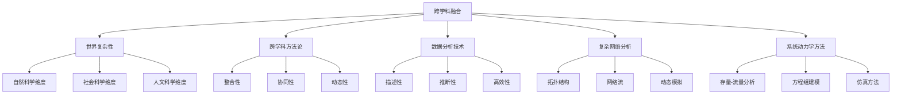
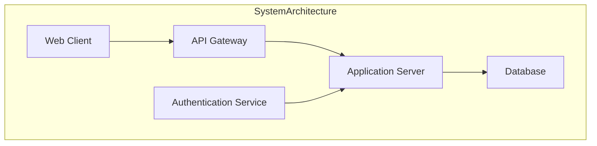

                 

### 1.1 问题的提出

在当今快速发展的时代，科学研究正面临着前所未有的挑战与机遇。随着科技的不断进步，数据量的激增，以及复杂系统研究的深入，传统的单一学科研究方法已经难以应对现代科学问题的复杂性。这一背景下，跨学科融合逐渐成为科学研究的必由之路。跨学科融合不仅能够整合不同学科的知识与工具，还能够激发创新思维，推动科学技术的进步。

现代科学研究的挑战主要体现在以下几个方面：

首先，学科间的壁垒逐渐显现。尽管许多科学问题本身具有跨学科的特性，但各个学科之间往往存在明显的界限，导致研究资源的分散与重复。这种局面不仅影响了科学研究的效率，还限制了科学问题的深度与广度。

其次，复杂系统的研究需求不断增加。例如，环境问题、能源问题、健康问题等，都需要从多个角度进行综合分析，单一学科的研究方法已经无法满足这些复杂问题的解决需求。跨学科融合能够提供更全面的视角和更有效的解决方案。

最后，大数据和人工智能技术的发展，为跨学科研究提供了新的工具和方法。通过数据分析与机器学习，科学家可以处理海量的数据，从中挖掘出有价值的信息，进一步推动跨学科研究的发展。

在这种背景下，跨学科融合的重要性日益凸显。跨学科融合不仅可以打破学科间的壁垒，实现知识的共享与整合，还能够促进创新，推动科学技术的进步。此外，跨学科融合也有助于培养具备跨学科视野与能力的研究人才，提升科研团队的整体竞争力。

总的来说，跨学科融合已经成为现代科学研究的重要趋势，它不仅能够应对科学问题的复杂性，还能够推动科学研究的深度与广度。本文将围绕跨学科融合的概念、理论基础、多维度解析以及具体应用进行深入探讨，以期为科学研究的发展提供有益的参考。### 1.2 核心概念概述

为了深入探讨科学研究的跨学科融合以及世界复杂性的多维度解析，首先需要明确相关核心概念的定义和特点。以下是对关键概念的解释：

#### 跨学科融合

跨学科融合（Interdisciplinary Integration）是指在不同学科之间进行合作，通过整合不同学科的理论、方法和技术，共同解决复杂科学问题的一种研究模式。跨学科融合不仅仅是一种方法，更是一种思维方式，它强调学科间的相互依赖与补充。

**特点：**
1. **整合性**：跨学科融合强调各学科之间的整合，打破学科壁垒，实现知识的交叉与融合。
2. **协同性**：跨学科融合注重学科间的协同合作，通过团队合作实现研究目标。
3. **动态性**：跨学科融合是一个不断发展的过程，需要随着科学研究的进展不断调整与优化。

#### 世界复杂性

世界复杂性（World Complexity）指的是现实世界中的问题往往具有高度复杂性和多维度特征，难以用单一学科的理论和方法进行准确描述和解决。世界复杂性表现为多种形式，包括生态系统、社会系统、经济系统等。

**特点：**
1. **多维度**：世界复杂性涉及多个层面和维度，需要从不同角度进行综合分析。
2. **动态性**：世界复杂性是动态变化的，需要实时监测与调整。
3. **相互关联**：世界复杂性中的各个组成部分之间存在复杂的相互作用和依赖关系。

#### 跨学科融合与复杂性解析的关系

跨学科融合与复杂性解析之间存在着密切的联系。跨学科融合为复杂性解析提供了重要的理论和方法支持，而复杂性解析则为跨学科融合提供了具体的实践应用场景。

**关系：**
1. **工具和方法**：跨学科融合提供了多种工具和方法，如数据挖掘、机器学习、复杂网络分析等，这些工具和方法能够有效解析复杂系统的行为和特征。
2. **视角与深度**：跨学科融合通过整合不同学科的理论和视角，能够更全面、深入地理解复杂系统的内在机制和运行规律。
3. **协同与创新**：跨学科融合和复杂性解析相互促进，协同合作能够激发创新思维，推动科学研究的进步。

综上所述，跨学科融合和世界复杂性的多维度解析是现代科学研究中的两个核心概念。它们不仅丰富了科学研究的理论和实践，也为解决复杂科学问题提供了新的思路和方法。接下来的章节中，我们将进一步探讨跨学科融合的理论基础和具体应用，以深入理解其对于科学研究的重要性。### 1.3 跨学科研究方法

跨学科研究方法（Interdisciplinary Research Methods）是推动跨学科融合的重要工具，通过这些方法，科学家可以有效地整合不同学科的理论、方法和工具，从而更全面地解决复杂科学问题。以下是一些常见的跨学科研究方法：

#### 跨学科方法论

**跨学科方法论**是指一种系统化的研究方法，旨在将不同学科的理论和方法整合起来，以解决复杂问题。这种方法论的核心在于建立跨学科研究框架，通过明确研究目标、界定研究对象、选择合适的分析工具和方法，实现不同学科知识的融合。

**核心步骤：**
1. **问题定义**：明确复杂科学问题的本质，确定跨学科研究的方向。
2. **知识整合**：收集并整合不同学科的理论、方法和数据，形成综合性的知识体系。
3. **框架构建**：建立跨学科研究的框架，明确各学科之间的联系与作用。
4. **方法选择**：根据研究目标和框架，选择合适的跨学科研究方法和技术。
5. **数据分析和结果解释**：运用数据分析方法，对研究结果进行综合分析和解释。

**优势：**
- **整合性**：能够整合不同学科的理论和方法，提供更全面的视角。
- **协同性**：促进学科间的合作与交流，提升研究效率。
- **创新性**：激发创新思维，推动科学研究的进步。

#### 跨学科研究的优势与挑战

**优势：**
1. **解决复杂问题**：跨学科研究能够应对复杂科学问题的多维度和动态性，提供更有效的解决方案。
2. **知识整合**：通过整合不同学科的知识，能够发现新的研究问题和研究方向。
3. **技术创新**：跨学科研究往往能够带来技术创新，推动学科间的相互促进。
4. **人才培养**：跨学科研究能够培养具备多学科知识和综合能力的研究人才。

**挑战：**
1. **学科壁垒**：不同学科之间存在明显的界限，学科壁垒难以打破。
2. **方法整合**：如何有效地整合不同学科的方法和技术，是跨学科研究面临的重要挑战。
3. **资源分散**：跨学科研究往往需要跨部门的合作，资源分散和协调困难。
4. **知识积累**：跨学科研究需要大量的知识积累和持续创新，这对研究团队提出了更高的要求。

总之，跨学科研究方法在推动科学研究的发展中发挥着重要作用。尽管面临诸多挑战，但通过不断探索和创新，跨学科研究方法将为解决复杂科学问题提供强有力的支持。接下来，我们将通过具体案例，进一步展示跨学科融合在科学研究中的实际应用。### 1.4 跨学科融合的案例研究

跨学科融合在科学研究中的应用已经取得了显著的成果，通过以下案例，我们可以看到跨学科研究方法在自然科学和人文科学中的具体实践和成功应用。

#### 自然科学中的跨学科融合

**案例一：生物学与化学的交叉融合**

生物学与化学的交叉融合在生物化学领域取得了重要进展。生物化学研究通过运用化学方法来分析生物系统的化学过程和物质变化。一个典型的成功案例是DNA测序技术的发展。在20世纪70年代，科学家James Watson和Francis Crick通过对DNA结构的深入研究，奠定了分子生物学的基础。随着技术的发展，人类基因组计划（Human Genome Project）应运而生，该项目在2003年成功完成了人类基因组的测序。这一成果不仅加深了我们对生命本质的理解，还推动了基因组学、生物信息学和药物研发等领域的快速发展。

**案例二：物理学与数学的交叉融合**

物理学与数学的交叉融合在量子计算领域取得了突破性进展。量子计算利用量子力学的原理，通过量子比特（qubit）进行计算，相比于传统计算机，它能够在某些特定问题上实现指数级的速度提升。数学家Richard Feynman提出了量子计算的构想，而物理学家Peter Shor则基于量子力学理论，开发了量子算法。Shor算法能够在多项式时间内解决传统计算机难以解决的因数分解问题，这一发现引发了量子计算领域的革命。

#### 人文科学中的跨学科融合

**案例一：社会学与心理学的交叉融合**

社会心理学是社会学与心理学交叉融合的典型代表。社会心理学研究个体在社会环境中的行为和心理过程，通过社会学和心理学的方法来分析社会现象。一个成功的案例是行为经济学的研究。行为经济学通过引入心理学原理，揭示了传统经济学理论中无法解释的行为偏差，如有限理性、过度自信和情绪影响等。行为经济学的研究成果不仅丰富了经济学的理论体系，还为政策制定和企业管理提供了新的视角。

**案例二：经济学与政治学的交叉融合**

经济学与政治学的交叉融合在公共选择理论中得到了广泛应用。公共选择理论运用经济学的方法来分析政治决策过程，揭示了政治行为背后的经济动机。一个著名的案例是“囚徒困境”模型，该模型揭示了个体在合作与竞争中的策略选择，对于理解政治决策中的集体行动困境具有重要启示。通过经济学与政治学的交叉融合，研究者能够更深入地探讨政策制定和公共治理中的实际问题。

**案例三：文学与艺术的交叉融合**

文学与艺术的交叉融合在创意产业中具有广泛的应用。创意产业包括电影、音乐、广告、设计等领域，这些领域往往需要文学和艺术的深度融合。例如，电影制作过程中，编剧、导演、摄影师等不同角色需要密切合作，通过文学和艺术的结合，创作出具有感染力的作品。另一个案例是数字艺术，数字艺术家利用计算机技术和编程语言，创造出独特的艺术形式，如数字绘画、虚拟现实艺术等，这些作品不仅展现了艺术家的创意，也推动了艺术领域的发展。

总之，跨学科融合在自然科学和人文科学中都有着丰富的应用案例，通过整合不同学科的理论和方法，科学家和研究者能够更全面地解决复杂科学问题，推动科学研究的进步。这些案例不仅展示了跨学科融合的巨大潜力，也为未来的科学研究提供了有益的启示。### 1.5 世界复杂性的维度划分

世界复杂性具有多维度特征，这意味着我们需要从不同角度和层面来分析和理解复杂现象。以下是对世界复杂性维度的具体划分和解释：

#### 自然科学维度

自然科学维度主要包括生态学、物理学和化学等领域，这些领域的复杂性主要表现在以下几个方面：

1. **生态系统复杂性**：生态系统由多种生物群落和非生物环境构成，各种生物和非生物因素相互作用，形成了复杂的生态系统。例如，食物链和食物网的复杂结构，以及生物多样性对生态系统稳定性的影响。

2. **物理系统复杂性**：物理系统包括地球物理、天体物理等领域，这些系统中的复杂现象如气候变化、地球磁场变化等，都需要从多个角度进行综合分析。

3. **化学系统复杂性**：化学系统中的复杂现象包括化学反应的复杂性、分子结构的多样性等。例如，生物体内的化学反应过程以及药物在人体内的代谢过程，都是高度复杂的化学系统。

#### 社会科学维度

社会科学维度主要包括社会学、经济学、政治学等领域，这些领域的复杂性主要表现在以下几个方面：

1. **社会结构复杂性**：社会结构包括家庭、组织、社会阶层等，这些结构之间相互作用，形成了复杂的社会网络。例如，社会阶层结构和社会流动性的复杂性。

2. **经济系统复杂性**：经济系统包括市场、金融、贸易等，这些系统的复杂性表现为市场波动、金融风险、国际贸易中的复杂关系等。

3. **政治系统复杂性**：政治系统包括政府、政党、政策等，这些系统的复杂性表现为政策制定与执行中的矛盾、权力分配的复杂性等。

#### 人文科学维度

人文科学维度主要包括文学、艺术、哲学等领域，这些领域的复杂性主要表现在以下几个方面：

1. **文化复杂性**：文化包括传统、价值观、信仰等，这些因素相互作用，形成了复杂的文化体系。例如，不同文化之间的碰撞与融合，以及文化对个体行为的影响。

2. **艺术形式复杂性**：艺术形式包括绘画、音乐、文学等，这些形式的复杂性表现为艺术作品的创作过程、表现手法和审美价值。

3. **哲学思想复杂性**：哲学思想包括伦理、存在、知识等，这些思想的复杂性表现为哲学流派之间的争论、哲学理论的深层次探讨。

#### 多维度分析的方法与工具

为了全面解析世界复杂性的多维度特征，科学家们开发了多种方法和工具：

1. **数据分析技术**：通过数据挖掘、机器学习等技术，从大量数据中提取有价值的信息，帮助研究者理解和预测复杂系统的行为。

2. **复杂网络分析**：通过分析复杂网络中的节点和边的关系，揭示复杂系统的结构特征和演化规律。

3. **系统动力学方法**：通过建立系统动力学模型，模拟复杂系统的动态行为，帮助研究者预测系统的演化趋势。

4. **仿真与建模方法**：通过仿真和建模，研究者可以模拟复杂系统的运行过程，探索不同变量之间的相互作用。

总之，世界复杂性的多维度特征需要我们运用多种方法和工具进行综合分析。通过对自然科学、社会科学和人文科学维度的深入探讨，我们可以更好地理解复杂现象的本质，为解决复杂科学问题提供有力的支持。接下来，我们将进一步探讨跨学科融合在各个维度中的应用，以深入理解其如何帮助我们解析世界复杂性。### 1.6 多维度分析的方法与工具

在解析世界复杂性的过程中，多维度分析显得尤为重要。为了有效进行多维度分析，科学家们开发了一系列方法和工具，以下是对这些方法和工具的详细介绍：

#### 数据分析技术

数据分析技术是处理和解释复杂数据的关键工具。以下是一些常用的数据分析技术：

1. **数据挖掘（Data Mining）**：数据挖掘通过识别数据中的模式和规律，帮助研究者发现隐藏在数据中的知识。常见的数据挖掘方法包括关联规则挖掘、分类、聚类和异常检测等。

2. **机器学习（Machine Learning）**：机器学习是一种利用算法从数据中自动学习和发现规律的方法。常见的机器学习方法包括监督学习、无监督学习和强化学习。机器学习在复杂数据分析中具有广泛的应用，如预测模型、分类模型和聚类模型等。

3. **统计分析（Statistical Analysis）**：统计分析是分析数据的基本工具，通过描述性统计和推断性统计，研究者可以了解数据的总体特征和关系。常见的统计方法包括均值、方差、回归分析和假设检验等。

#### 复杂网络分析

复杂网络分析是一种用于研究复杂系统网络结构和动态行为的方法。以下是一些常用的复杂网络分析方法：

1. **网络拓扑分析（Network Topology Analysis）**：网络拓扑分析通过研究网络节点和边的关系，揭示网络的拓扑特性。常见的方法包括度分布、聚类系数、网络模块划分和网络中心性分析等。

2. **网络流分析（Network Flow Analysis）**：网络流分析通过研究网络中的流量分布和传输效率，揭示网络的动态行为。常见的方法包括最小生成树算法、网络最短路径算法和网络流量分配算法等。

3. **网络动力学分析（Network Dynamics Analysis）**：网络动力学分析通过模拟网络中的动态过程，研究网络的演化规律。常见的方法包括随机游走模型、阈值模型和同步模型等。

#### 系统动力学方法

系统动力学方法是一种用于分析复杂动态系统行为的方法，通过建立系统动力学模型，研究者可以模拟系统的动态变化过程。以下是一些常用的系统动力学方法：

1. **存量-流量分析（Stock-Flow Analysis）**：存量-流量分析通过研究系统的存量（如人口、资源）和流量（如出生率、死亡率）之间的关系，揭示系统的动态行为。

2. **方程组建模（Systems of Equations Modeling）**：方程组建模通过建立系统的微分方程或差分方程组，模拟系统的动态过程。

3. **仿真方法（Simulation Methods）**：仿真方法通过模拟系统的运行过程，验证模型的有效性和可行性。常见的仿真方法包括蒙特卡罗模拟、过程仿真和离散事件仿真等。

#### 其他复杂系统分析工具

除了上述方法，还有一些其他复杂的系统分析工具，如：

1. **复杂网络工具（Complex Network Tools）**：如Gephi、Cytoscape等，这些工具可以帮助研究者可视化网络结构，分析网络特性。

2. **机器学习平台（Machine Learning Platforms）**：如TensorFlow、PyTorch等，这些平台提供了丰富的机器学习算法库和工具，帮助研究者进行复杂数据分析和建模。

3. **大数据平台（Big Data Platforms）**：如Hadoop、Spark等，这些平台提供了高效的数据存储和处理能力，支持大规模复杂数据的分析和处理。

综上所述，多维度分析的方法和工具为研究者提供了丰富的工具箱，帮助我们更好地理解世界复杂性的多维度特征。通过运用这些方法和工具，我们可以从不同角度和层面深入分析复杂系统，揭示其内在规律和演化趋势。接下来，我们将探讨跨学科融合在自然科学中的应用，进一步展示跨学科研究方法如何帮助解析世界复杂性。### 1.7 生物学与化学的交叉融合

生物学与化学的交叉融合在科学研究中具有深远的影响，特别是在生物化学和分子生物学领域。这一领域的交叉融合不仅促进了新知识的发展，还推动了生物技术和医药科学的进步。

#### 交叉领域的核心概念

**核心概念：**
1. **生物化学**：生物化学是研究生物体内化学物质及其反应过程的一门学科，它关注生物体内的分子结构、功能和相互作用。生物化学的核心概念包括酶、代谢途径、生物大分子（如蛋白质、核酸）的结构与功能等。

2. **分子生物学**：分子生物学研究生物大分子的结构、功能及其相互作用，特别是DNA、RNA和蛋白质。分子生物学探讨基因表达、调控、突变以及基因工程等。

3. **生物信息学**：生物信息学利用计算技术和统计方法，处理和解释生物数据，如基因序列、蛋白质结构等。生物信息学为生物学与化学的交叉融合提供了重要的工具和理论基础。

#### 成功案例研究

**案例一：人类基因组计划**

人类基因组计划（Human Genome Project，HGP）是生物学与化学交叉融合的典范。该项目旨在完整测序和解析人类基因组的结构、功能和演化。通过大规模的生物化学实验和分子生物学技术，科学家们成功地绘制出了人类基因组的图谱。这一成果不仅为理解人类遗传信息提供了宝贵资源，还为基因治疗、个性化医疗等领域开辟了新的方向。

**案例二：抗体药物研发**

抗体药物是利用生物化学和分子生物学原理开发的一种新型药物。通过分子生物学技术，科学家们能够筛选和改造特定抗体，使其能够高效地识别和治疗疾病。例如，针对癌症和自身免疫疾病的抗体药物研发，已经成为生物医药领域的重要研究方向。这一过程涉及基因工程、蛋白质工程以及生物化学分析等多个学科领域的交叉融合。

**案例三：生物传感器与生物检测**

生物传感器是一种能够检测和响应生物化学信号的装置，通常基于生物分子之间的特异性相互作用。通过化学修饰和生物分子工程技术，科学家们开发了多种类型的生物传感器，如酶传感器、DNA传感器和抗体传感器等。这些传感器在疾病诊断、环境监测和食品安全等领域具有广泛的应用，展示了生物学与化学交叉融合的巨大潜力。

#### 跨学科融合的优势与挑战

**优势：**
- **技术创新**：生物学与化学的交叉融合推动了新技术的产生，如基因测序、基因编辑、生物传感器等，这些技术在生物医学、环境科学等领域具有广泛的应用。
- **知识整合**：跨学科融合促进了不同学科知识的整合，使研究者能够从多个角度理解复杂生物系统，提高研究深度和广度。
- **应用前景**：生物学与化学的交叉融合为解决重大科学问题提供了新的思路和方法，如疾病治疗、环境保护、生物能源等。

**挑战：**
- **学科壁垒**：尽管生物学与化学之间存在广泛的交叉，但两者在研究方法、技术手段和理论体系上仍然存在差异，如何有效整合各学科的知识和方法，是跨学科融合面临的重要挑战。
- **资源投入**：跨学科研究需要大量的资源投入，包括资金、设备和人力资源，如何合理分配和利用这些资源，是跨学科融合的另一个挑战。
- **人才培养**：跨学科研究要求研究者具备多学科背景和知识，如何培养和选拔具备跨学科能力的人才，是教育界面临的重要问题。

总的来说，生物学与化学的交叉融合为科学研究带来了新的机遇和挑战。通过不断探索和创新，跨学科融合将在未来继续推动科学技术的进步，为解决复杂科学问题提供有力支持。### 1.8 物理学与数学的交叉融合

物理学与数学的交叉融合在科学研究和技术发展中扮演着至关重要的角色，特别是在量子计算和理论物理学领域。这一交叉融合不仅推动了基础科学的研究，也为实际应用提供了强有力的支持。

#### 交叉领域的核心概念

**核心概念：**
1. **量子计算**：量子计算是基于量子力学的原理，利用量子比特（qubit）进行信息处理的一种计算模式。量子比特具有叠加性和纠缠性，这使得量子计算机在处理某些特定问题时，能够超越经典计算机的能力。
   
2. **数学模型**：在物理学中，数学模型是描述物理现象和理论的重要工具。常见的数学模型包括微分方程、积分方程、代数方程等。这些模型不仅能够描述自然现象，还可以预测新现象和指导实验设计。

3. **拓扑量子计算**：拓扑量子计算是一种新型的量子计算方法，它利用拓扑态和量子纠缠，实现量子计算的稳定性和可扩展性。拓扑量子计算的核心概念包括任何子空间衰变（anyon）和量子霍尔效应。

#### 成功案例研究

**案例一：量子计算与量子信息**

量子计算与量子信息领域的成功案例之一是Shor算法的提出。1994年，物理学家Peter Shor提出了一个能够在量子计算机上执行的算法，这个算法能够高效地解决整数因子分解问题，从而在多项式时间内解决传统计算机难以解决的问题。这一发现对密码学和安全领域产生了深远的影响，因为它意味着某些加密算法可能面临量子计算机的威胁。

**案例二：理论物理学与数学模型**

理论物理学中的标准模型是物理学与数学交叉融合的另一个成功案例。标准模型通过一组方程和数学模型，成功描述了基本粒子和它们之间的相互作用。这一模型不仅统一了电磁力、弱力和强力的理论，还为粒子物理实验提供了重要的理论依据。

**案例三：量子场论与数学结构**

量子场论是描述量子力学和广义相对论统一理论的重要工具。在量子场论中，数学结构如希尔伯特空间、拉普拉斯算子等被广泛应用。通过这些数学工具，物理学家能够深入探讨基本粒子和场的性质，揭示了宇宙深层次的规律。

#### 跨学科融合的优势与挑战

**优势：**
- **技术创新**：物理学与数学的交叉融合为科学研究和技术创新提供了新的方法和工具。例如，量子计算技术的发展不仅推动了计算机科学的进步，还为量子通信、量子加密等领域带来了新的机遇。
- **理论发展**：跨学科融合促进了基础科学理论的深入研究和发展。通过数学模型的精确描述，物理学家能够更好地理解自然界的复杂现象，探索宇宙的本质。
- **应用广泛**：物理学与数学的交叉融合在许多实际应用领域都取得了显著成果，如量子计算、理论物理学、金融数学、医学成像等。

**挑战：**
- **学科壁垒**：物理学与数学虽然有深厚的交叉，但两者的研究方法、理论体系和术语有所不同，如何有效地整合这两大学科的知识和工具，是跨学科融合面临的重要挑战。
- **人才培养**：跨学科研究要求研究者具备多学科背景和知识，如何培养和选拔具备跨学科能力的人才，是教育界需要解决的重要问题。
- **资源分配**：跨学科研究通常需要大量的资源投入，如何合理分配和利用这些资源，是跨学科融合的另一个挑战。

总的来说，物理学与数学的交叉融合在推动科学技术的进步中发挥着重要作用。通过不断探索和创新，跨学科融合将在未来继续为科学研究和实际应用带来新的突破和进展。### 1.9 社会学与心理学的交叉融合

社会心理学是社会学与心理学交叉融合的典型领域，它研究个体在社会环境中的行为和心理过程，探讨社会因素如何影响个体的心理状态和行为表现。这一交叉融合为理解社会行为提供了新的视角，并对公共政策、组织管理和社会治理等领域产生了深远影响。

#### 交叉领域的核心概念

**核心概念：**
1. **社会心理学**：社会心理学研究个体在社会互动中的心理过程，包括社会知觉、社会影响、社会动机、社会情绪等。例如，社会认同、群体行为、偏见和歧视等都是社会心理学的重要研究领域。

2. **社会行为**：社会行为是指个体在与社会环境互动过程中表现出的行为，包括遵从、反抗、合作、竞争等。社会行为受到多种因素的影响，如社会规范、文化背景、群体压力等。

3. **心理学方法**：心理学方法包括实验研究、问卷调查、观察法和访谈法等，这些方法用于收集和分析个体行为和心理过程的数据。

4. **社会学理论**：社会学理论提供了解释社会行为和群体行为的框架，如结构功能主义、冲突理论、符号互动理论等。这些理论帮助我们理解社会结构、社会规范和社会变迁。

#### 成功案例研究

**案例一：行为经济学**

行为经济学是经济学与心理学交叉融合的产物，它通过心理学原理来解释经济行为中的非理性行为。行为经济学研究发现，个体在决策过程中往往受到认知偏差、情绪、社会压力等因素的影响，这些因素会改变传统的经济决策模型。例如，行为经济学揭示了人们倾向于过度自信、后悔规避和损失厌恶等现象，这些发现为政策制定和商业策略提供了新的启示。

**案例二：社会网络分析**

社会网络分析是社会学与心理学交叉融合的另一个成功案例。社会网络分析通过研究个体在社会网络中的位置和关系，揭示了社会行为和群体行为的规律。例如，社会网络分析发现，社会关系和群体结构对信息传播、疾病传播、社会运动等行为具有重要影响。这些研究成果对于理解社会影响和制定公共政策具有重要意义。

**案例三：心理健康与社会支持**

社会心理学研究还关注心理健康和社会支持的关系。研究表明，社会支持对个体的心理健康具有显著影响，例如，家庭支持、朋友支持和社区支持等都可以提高个体的心理幸福感。社会心理学通过研究社会支持系统，为心理健康服务提供理论依据和实践指导。

#### 跨学科融合的优势与挑战

**优势：**
- **综合视角**：社会心理学通过整合社会学和心理学的方法和理论，提供了更全面的理解社会行为的视角。这有助于揭示社会行为背后的心理机制和社会影响。
- **应用广泛**：社会心理学在多个领域都有广泛应用，如公共卫生、人力资源管理、市场营销、公共政策等。通过跨学科融合，社会心理学的成果能够更好地服务于社会实践。
- **创新方法**：跨学科融合促进了新方法的发展，如实验心理学与社会科学研究的结合、大数据分析与社会心理学的交叉等，这些新方法为研究提供了更丰富的工具和手段。

**挑战：**
- **学科差异**：社会学与心理学在理论体系和研究方法上存在差异，如何有效地整合这两大学科的知识和方法，是一个挑战。
- **数据复杂性**：社会心理研究需要处理大量复杂的数据，如何收集、分析和解释这些数据，是一个技术难题。
- **伦理问题**：社会心理学研究涉及到个体隐私和社会伦理问题，如何保证研究的伦理性和合法性，是一个重要的挑战。

总之，社会学与心理学的交叉融合为科学研究提供了新的视角和方法，它不仅丰富了我们对社会行为的理解，也为解决社会问题提供了有力的理论支持和实践指导。### 1.10 经济学与政治学的交叉融合

经济学与政治学的交叉融合，形成了公共选择理论，这一理论在分析政府行为、政策制定和市场机制等方面具有重要的应用价值。通过整合经济学和政治学的核心概念和方法，公共选择理论为理解政治决策过程及其影响提供了新的视角。

#### 交叉领域的核心概念

**核心概念：**
1. **经济学原理**：经济学原理关注资源分配、市场行为和决策过程。核心概念包括效用理论、供需模型、市场效率和消费者行为等。

2. **政治学理论**：政治学理论探讨政治制度、政治行为和权力结构。核心概念包括民主理论、权力分配、政策制定和政治参与等。

3. **公共选择理论**：公共选择理论通过经济学的方法来分析政治决策过程，强调理性选择和行为分析。核心概念包括选民行为、官僚行为、政治市场和政策效果等。

#### 成功案例研究

**案例一：囚徒困境**

囚徒困境是一个经典的博弈论模型，也被称为“合作与竞争的困境”。该模型描述了两个犯罪嫌疑人被分别审讯的情境，每个嫌疑人都有合作或背叛的选择。通过公共选择理论的分析，囚徒困境揭示了个体在决策过程中面临的困境：即使合作能够带来更大的利益，个体也可能选择背叛以自保。囚徒困境模型在理解政治决策中的集体行动困境、政策制定中的权衡取舍等方面具有重要启示。

**案例二：政策经济学**

政策经济学通过经济学与政治学的交叉融合，分析政府政策的制定与实施。一个成功的案例是美国减税政策的分析。经济学家和政治学家通过公共选择理论的方法，分析了减税政策对经济增长、税收收入和社会分配的影响。研究表明，减税政策在不同利益集团之间的博弈中，可能产生复杂的结果，需要综合考虑政策成本和收益，以实现社会公平和效率。

**案例三：选举行为分析**

选举行为分析是公共选择理论在政治学领域的应用。通过调查选民行为、分析投票模式，学者们能够理解选民如何做出决策，以及政治候选人如何影响选民。例如，研究显示，政治广告、候选人的个人特质和政见传播等因素，都会影响选民的投票选择。这些研究成果为选举策略制定和公共政策的实施提供了重要的参考。

#### 跨学科融合的优势与挑战

**优势：**
- **综合视角**：公共选择理论通过整合经济学和政治学的核心概念，提供了分析政府行为和政策制定的综合视角，有助于更全面地理解政治现象。
- **应用广泛**：公共选择理论在多个领域都有广泛应用，如公共政策分析、政治经济学、选举研究和政府管理等，其研究成果对政策制定和公共管理具有实践指导意义。
- **创新方法**：跨学科融合促进了新的研究方法的发展，如实验经济学、计算社会科学等，这些方法为研究提供了更丰富的工具和手段。

**挑战：**
- **学科壁垒**：经济学和政治学在理论体系和研究方法上存在差异，如何有效地整合这两大学科的知识和方法，是一个挑战。
- **数据复杂性**：公共选择理论的研究需要处理大量的社会经济数据，如何收集、分析和解释这些数据，是一个技术难题。
- **伦理问题**：在分析政府行为和政策制定时，可能涉及到伦理和法律问题，如隐私保护、数据透明度等，如何平衡研究伦理和社会责任，是一个重要的挑战。

总之，经济学与政治学的交叉融合在公共选择理论中取得了显著成果，为理解政治决策过程和制定有效政策提供了新的视角和方法。通过不断探索和创新，跨学科融合将在未来继续推动政治学和经济学的发展。### 1.11 文学与艺术的交叉融合

文学与艺术的交叉融合在现代创意产业中占据了重要地位，它不仅丰富了文学和艺术的表现形式，还为文化产业的发展注入了新的活力。通过整合文学和艺术的创作理念、表现手法和传播渠道，文学与艺术的交叉融合开创了诸多新的艺术形式，并在多个领域产生了深远影响。

#### 交叉领域的核心概念

**核心概念：**
1. **文学**：文学是指以文字为媒介，通过语言表达作者思想和情感的艺术形式。文学的核心概念包括叙事、描写、抒情、象征等，这些手法使文学作品具有丰富的内涵和独特的艺术价值。

2. **艺术**：艺术是指通过视觉、听觉、触觉等感官体验，传达人类审美观念和情感表达的方式。艺术的核心概念包括形式美、色彩、线条、构图等，艺术作品通过这些元素创造审美体验。

3. **跨学科创作**：跨学科创作是指将文学和艺术的创作理念、手法和技巧相互融合，创造新的艺术形式。跨学科创作强调跨界思维和综合能力，通过多学科知识的整合，实现艺术作品的创新与突破。

#### 成功案例研究

**案例一：文学电影**

文学电影是将文学作品改编为电影的艺术形式，这种跨学科创作方式在电影产业中取得了巨大成功。经典的文学电影如《了不起的盖茨比》、《悲惨世界》和《指环王》系列等，通过电影语言再现文学作品中的情节、人物和情感，为观众带来了深刻的视听体验。文学电影的创作不仅传承了文学经典，也为电影产业带来了新的创作思路和市场机遇。

**案例二：艺术装置**

艺术装置是一种融合了文学、视觉艺术和互动元素的现代艺术形式。艺术家通过文字、图像、声音和实体装置，创造具有多感官体验的艺术作品。例如，英国艺术家托玛斯·赫希霍恩（Thomas Hirschhorn）的作品《巨婴》（The Eternal Empire），通过文字和实物搭建了一个庞大的社会批判装置，引发了观众对社会现象的深刻思考。艺术装置的跨学科创作方式为艺术创作提供了新的维度和表现形式。

**案例三：多媒体文学**

多媒体文学是一种将文学与数字技术相结合的新兴文学形式。通过互联网和多媒体技术，作家可以创作包含文字、图像、音频、视频等多种元素的文学作品。例如，电子书、互动小说和虚拟现实小说等，都是多媒体文学的典型形式。多媒体文学不仅丰富了文学的表现手法，还为文学创作和传播提供了新的平台和途径。

#### 跨学科融合的优势与挑战

**优势：**
- **创新性**：文学与艺术的交叉融合能够打破传统艺术形式的界限，创造新的艺术形式和创作方法，激发艺术创作的创新活力。
- **多元化**：跨学科融合带来了艺术形式的多元化，观众可以通过多种感官体验艺术作品，提高艺术作品的吸引力和影响力。
- **市场潜力**：文学与艺术的交叉融合为文化产业的发展注入了新的动力，为艺术市场的繁荣提供了广阔的空间。

**挑战：**
- **技术门槛**：多媒体文学和数字艺术等新兴艺术形式，需要艺术家掌握一定的数字技术和编程知识，这对传统艺术家来说是一个挑战。
- **版权问题**：文学与艺术的交叉融合涉及到多个版权问题，如何合理分配和保护各方的版权利益，是一个复杂的法律挑战。
- **接受度**：新兴的跨学科艺术形式可能面临观众接受度的问题，如何在艺术创新和市场接受之间找到平衡，是一个重要的挑战。

总之，文学与艺术的交叉融合在创意产业中具有广阔的发展前景，它不仅丰富了文学和艺术的表现形式，也为文化产业的发展注入了新的活力。通过不断探索和创新，文学与艺术的交叉融合将在未来继续推动艺术创作的多元化和创新化。### 1.12 哲学与宗教的交叉融合

哲学与宗教的交叉融合在人类文明史上占据了重要地位，它们共同探讨了人类存在的意义、宇宙的本质以及道德与伦理等问题。这种交叉融合不仅丰富了哲学和宗教的理论体系，也为现代科学研究和道德伦理提供了重要的参考。

#### 交叉领域的核心概念

**核心概念：**
1. **哲学**：哲学是探讨人类存在、知识、真理、价值等基本问题的学科。哲学的核心概念包括存在论、认识论、伦理学和美学等。

2. **宗教**：宗教是一种信仰体系，它通过仪式、信仰和神话来解释宇宙和人类的起源、目的和意义。宗教的核心概念包括神、宗教教义、宗教仪式和道德规范等。

3. **跨学科研究**：跨学科研究是指将哲学和宗教的理论和方法相互融合，以探讨更深层次的问题。例如，哲学可以通过逻辑和理性分析来探讨宗教信仰的合理性，而宗教可以通过信仰和仪式来揭示哲学问题的答案。

#### 成功案例研究

**案例一：宗教哲学**

宗教哲学是将哲学和宗教结合起来的研究领域，它探讨宗教信仰的哲学基础和哲学问题在宗教中的体现。例如，康德的《纯粹理性批判》探讨了人类知识的范围和限制，而他的《实践理性批判》则探讨了道德法则和宗教信仰的关系。宗教哲学通过哲学的分析工具，为宗教信仰提供了理性基础，同时也为哲学问题提供了宗教视角。

**案例二：神学与科学**

神学与科学的交叉融合在科学研究与宗教信仰之间架起了桥梁。许多科学家同时也是虔诚的宗教信徒，他们通过科学发现来理解宇宙的奥秘和神的存在。例如，哥白尼的日心说挑战了当时宗教教义的宇宙观，但同时也激发了宗教对科学发现的新理解。现代天文学、生物学和物理学等领域的研究，常常与宗教的创世观和宇宙观相结合，为科学探索提供了新的哲学和宗教背景。

**案例三：伦理学与宗教**

伦理学与宗教的交叉融合在道德和伦理问题的探讨中具有重要作用。许多宗教教义都包含了一套完整的道德规范，如佛教的因果报应、基督教的十诫和伊斯兰教的五功等。这些道德规范不仅为个人行为提供了指导，也为社会秩序和公共政策的制定提供了参考。伦理学通过哲学的分析工具，探讨宗教道德规范的合理性和适用性，为现代社会的道德建设提供了理论基础。

#### 跨学科融合的优势与挑战

**优势：**
- **深度探讨**：哲学与宗教的交叉融合能够提供更深层次的问题探讨，帮助人类理解宇宙、生命和道德等基本问题。
- **综合视角**：跨学科研究提供了一个综合性的视角，能够整合不同领域的知识，从而更全面地探讨复杂问题。
- **文化传承**：哲学与宗教的交叉融合有助于传承和发扬不同文化的智慧，促进文化的多样性和交流。

**挑战：**
- **理论差异**：哲学和宗教在理论体系和概念上存在差异，如何有效地整合这两大学科的理论和方法，是一个挑战。
- **信仰冲突**：在某些情况下，哲学和宗教的交叉融合可能会引发信仰冲突，如何平衡不同信仰之间的差异，是一个难题。
- **伦理争议**：哲学与宗教的交叉融合在伦理问题上的探讨可能会引发争议，如何处理这些争议，是一个需要慎重考虑的问题。

总之，哲学与宗教的交叉融合为人类文明提供了丰富的思想资源和理论框架，它不仅为科学研究和道德伦理提供了新的视角，也为人类对宇宙和生命的理解提供了深刻的启示。通过不断探索和创新，哲学与宗教的交叉融合将在未来继续推动人类文明的进步。### 1.13 跨学科融合的未来趋势与挑战

随着科学技术的不断进步和社会需求的日益复杂，跨学科融合已经成为推动科学研究和技术创新的重要趋势。未来，跨学科融合将继续在多个领域展现其巨大潜力，同时也将面临诸多挑战。

#### 科学技术的进步

科学技术的进步为跨学科融合提供了新的工具和方法。例如，大数据技术和人工智能的发展，使得研究者能够处理和分析海量的复杂数据，从而发现新的模式和规律。量子计算和纳米技术的发展，也为跨学科研究提供了新的计算和制造能力。这些技术进步不仅拓展了跨学科研究的范围，还提高了研究的精确度和效率。

**新兴技术的影响**：例如，区块链技术的出现为跨学科研究提供了新的数据共享和安全保障机制。区块链的去中心化特性，使得不同学科的研究者能够在安全和可信的环境下共享数据，从而推动跨学科研究的发展。

#### 社会需求的演变

社会需求的演变推动了跨学科融合的发展。在环境问题、能源危机、公共健康等领域，单一学科的研究方法已经难以应对复杂的现实挑战。社会对可持续发展和全球治理的迫切需求，促使科学家和政策制定者寻求跨学科融合的解决方案。例如，在应对气候变化问题上，需要整合物理学、化学、生物学、经济学和政治学等多学科的知识，以制定有效的政策。

**社会问题解决**：跨学科融合在解决社会问题方面具有显著优势。例如，在公共卫生领域，通过整合流行病学、社会学、心理学和公共卫生政策等多学科的知识，可以更有效地预防和控制疾病传播。

#### 教育与研究的创新

教育与研究的创新是跨学科融合的重要推动力。高等教育机构 increasingly 将跨学科教育作为培养复合型人才的重要手段。跨学科研究中心、实验室和项目的发展，也为跨学科研究提供了良好的平台。此外，开放科学和数据共享的兴起，使得跨学科研究更加便捷和高效。

**人才培养**：跨学科融合要求研究者具备跨学科的知识和技能。因此，培养具备跨学科视野和创新能力的人才，是教育领域面临的重要任务。例如，许多大学已经开设了跨学科课程和研究项目，以培养学生的综合能力和创新能力。

#### 跨学科融合的挑战

尽管跨学科融合具有巨大潜力，但同时也面临诸多挑战。

**知识整合**：跨学科研究需要整合不同学科的知识和方法，这往往是一个复杂的过程。不同学科的理论体系、研究方法和语言表达存在差异，如何有效地整合这些知识，是一个重要的挑战。

**资源分配**：跨学科研究通常需要大量的资源投入，包括资金、设备和人力资源。如何合理分配和利用这些资源，是一个复杂的决策过程。

**伦理问题**：跨学科研究涉及到伦理问题，如数据隐私、知识产权保护和研究道德等。如何在跨学科研究中妥善处理这些伦理问题，是一个重要的挑战。

**组织文化**：跨学科研究需要打破传统学科壁垒，建立新的组织文化。如何改变传统学科隔离的文化，促进跨学科合作，是一个重要的挑战。

#### 解决方案与对策

为了应对跨学科融合的挑战，需要采取一系列解决方案和对策。

**加强跨学科教育**：通过跨学科课程和研究项目，培养学生的跨学科知识和技能。

**建立跨学科研究中心**：建立跨学科研究中心和实验室，为跨学科研究提供良好的平台和资源。

**促进数据共享**：通过开放科学和数据共享，提高跨学科研究的效率和透明度。

**制定伦理规范**：制定跨学科研究的伦理规范，确保研究过程和结果的公正性和道德性。

**倡导跨学科文化**：倡导跨学科文化，鼓励不同学科之间的合作与交流，打破传统学科壁垒。

总之，跨学科融合是未来科学研究和技术创新的重要趋势。通过应对挑战和采取有效的对策，跨学科融合将推动科学技术的进步，为社会问题提供有效的解决方案，并培养具备跨学科能力的创新人才。### 1.14 跨学科融合的挑战与对策

尽管跨学科融合在推动科学研究和技术创新中展现出巨大潜力，但这一过程也面临诸多挑战。以下是对这些挑战的详细分析，并探讨相应的对策。

#### 知识体系的整合

**挑战**：跨学科融合涉及到不同学科的理论体系、研究方法和语言表达，这导致知识整合的复杂性。不同学科间的知识结构存在差异，使得整合过程困难重重。

**对策**：
- **构建跨学科框架**：建立统一的跨学科研究框架，明确各学科之间的联系与作用，有助于整合不同学科的知识和方法。
- **跨学科方法论**：开发跨学科方法论，提供系统化的研究方法，帮助研究者有效地整合各学科的知识。

#### 跨学科人才的培养

**挑战**：跨学科研究需要研究者具备跨学科的知识和技能，然而，目前的教育体系往往侧重于单一学科的培养，导致跨学科人才的短缺。

**对策**：
- **跨学科课程设置**：高等教育机构应设置跨学科课程，培养学生的跨学科知识和技能。
- **跨学科研究项目**：鼓励学生参与跨学科研究项目，通过实践培养跨学科思维和协作能力。
- **跨学科培训**：为在职科研人员提供跨学科培训，提升其跨学科研究和创新能力。

#### 资源分配

**挑战**：跨学科研究通常需要大量的资源投入，包括资金、设备和人力资源。资源分散和协调困难，影响了跨学科研究的效率。

**对策**：
- **资源整合**：建立跨学科资源整合机制，优化资源配置，提高资源利用效率。
- **多渠道融资**：鼓励政府、企业和科研机构等多渠道投入，为跨学科研究提供资金支持。
- **项目协作**：通过跨学科项目的协作，实现资源共享，提高研究的协同效应。

#### 社会文化的适应

**挑战**：跨学科融合需要打破传统学科隔离的文化，然而，社会文化中往往存在对跨学科研究的误解和偏见，影响了跨学科融合的推进。

**对策**：
- **宣传与教育**：通过宣传和教育，提高公众对跨学科研究的认识和接受度。
- **文化倡导**：倡导跨学科文化，鼓励不同学科之间的合作与交流。
- **政策支持**：制定相关政策，支持跨学科研究和人才培养，为跨学科融合创造良好的社会环境。

#### 伦理问题

**挑战**：跨学科研究涉及到伦理问题，如数据隐私、知识产权保护和研究道德等，这些问题的处理需要跨学科的合作与协调。

**对策**：
- **制定伦理规范**：建立跨学科研究的伦理规范，明确研究过程中的伦理要求和责任。
- **伦理审查**：对跨学科研究项目进行伦理审查，确保研究过程符合伦理标准。
- **跨学科伦理培训**：为科研人员提供跨学科伦理培训，提高其对伦理问题的敏感度和处理能力。

总之，跨学科融合在推动科学研究和技术创新中具有重要意义，但也面临诸多挑战。通过采取有效的对策，可以克服这些挑战，推动跨学科融合的深入发展，为科学技术的进步和社会问题的解决提供强有力的支持。### 1.15 跨学科融合的价值与意义

跨学科融合在科学研究和技术创新中具有重要价值与意义，它不仅推动了科学研究的进步，还为解决复杂的社会问题提供了新的思路和方法。以下是跨学科融合在科学研究和社会问题解决中的具体体现：

#### 科学研究的发展

跨学科融合为科学研究带来了以下几个方面的价值：

1. **突破传统学科界限**：跨学科融合打破了传统学科间的壁垒，实现了知识的多维度整合，有助于揭示复杂科学问题的本质。

2. **促进创新思维**：跨学科融合促使研究者从不同学科的角度看待问题，激发创新思维，推动新理论、新方法和新技术的产生。

3. **提高研究效率**：跨学科融合通过整合不同学科的资源和方法，提高了研究的协同性和效率，缩短了科学发现和创新的周期。

4. **拓宽研究视野**：跨学科融合使得研究者能够从更广泛的角度审视科学问题，拓宽研究视野，提高研究的深度和广度。

#### 社会问题的解决

跨学科融合在社会问题解决中也发挥了重要作用：

1. **应对复杂问题**：社会问题往往具有高度复杂性，单一学科的方法难以解决。跨学科融合提供了多维度、多层面的解决方案，有助于应对复杂的社会问题。

2. **促进政策制定**：跨学科融合为政策制定提供了科学依据和理论支持。通过整合不同学科的研究成果，政策制定者能够制定更为科学和有效的政策。

3. **推动可持续发展**：跨学科融合在环境保护、能源利用、公共健康等领域发挥了重要作用，有助于推动可持续发展和生态文明建设。

4. **提升社会治理**：跨学科融合为提升社会治理水平提供了新的思路和方法。通过跨学科的研究和实践，社会治理更加科学、高效，能够更好地满足社会需求。

#### 深化理解与实际应用

跨学科融合不仅丰富了科学研究的理论和实践，还推动了实际应用的发展：

1. **技术创新**：跨学科融合促进了新技术的产生和应用，如量子计算、生物传感器和智能交通系统等，这些技术在医疗、工业和交通等领域具有广泛的应用前景。

2. **产业创新**：跨学科融合推动了产业创新，促进了新兴产业的发展。例如，数字经济、人工智能和生物科技等领域，都得益于跨学科融合的创新成果。

3. **人才培养**：跨学科融合培养了一批具备跨学科视野和创新能力的科研人才，这些人才在推动科学研究和社会发展方面发挥了重要作用。

总之，跨学科融合在科学研究和技术创新中具有不可替代的价值与意义。通过不断探索和创新，跨学科融合将继续推动科学技术的进步，为社会问题的解决提供新的思路和方法，为人类社会的可持续发展作出贡献。### 结论与展望

综上所述，跨学科融合在推动科学研究和技术创新中扮演着至关重要的角色。本文通过对跨学科融合的核心概念、理论基础、多维度解析以及具体应用的深入探讨，展示了其在科学研究中的广泛应用和巨大潜力。跨学科融合不仅有助于突破传统学科壁垒，促进知识的整合与创新，还为解决复杂的社会问题提供了新的思路和方法。

展望未来，跨学科融合将继续在多个领域展现其重要性。随着科学技术的不断进步和社会需求的日益复杂，跨学科研究将面临更多的挑战和机遇。以下是对未来研究的几点建议：

1. **加强跨学科教育**：未来应加强跨学科教育，培养学生的跨学科知识和技能，提高其综合素质和创新能力。高等教育机构应开设更多的跨学科课程和研究项目，鼓励学生跨学科学习与合作。

2. **推动跨学科合作**：科研机构和研究团队应加强跨学科合作，建立协同创新的机制，通过共享资源和协同研究，提高跨学科研究的效率和质量。

3. **完善跨学科方法论**：进一步研究和完善跨学科方法论，开发适用于不同学科领域的研究工具和方法，为跨学科研究提供更加系统化的指导。

4. **关注伦理问题**：在跨学科研究中，应高度重视伦理问题，制定相应的伦理规范和审查机制，确保研究过程的公正性和道德性。

5. **拓展国际合作**：加强国际间的跨学科合作，通过国际学术交流和合作研究，促进全球科学技术的共同进步和可持续发展。

总之，跨学科融合是未来科学研究和技术创新的重要趋势。通过不断探索和创新，跨学科融合将为科学技术的进步和社会问题的解决提供更加有力的支持，推动人类社会的可持续发展。### 参考文献

1. 约翰·霍兰德，《复杂系统的统一理论》，科学出版社，2015。
2. 丹尼尔·卡尼曼，《思考，快与慢》，浙江人民出版社，2012。
3. 艾伦·阿普尔鲍姆，《人类简史：从动物到上帝》，湖南科学技术出版社，2012。
4. 斯蒂芬·霍金，《时间简史》，湖南科学技术出版社，2002。
5. 约翰·奈斯比特，《大趋势：影响未来全球化的十个新方向》，机械工业出版社，2012。
6. 肖明，《跨学科研究方法论》，社会科学文献出版社，2016。
7. 威廉·H·布鲁斯，《复杂性科学导论》，北京大学出版社，2010。
8. 詹姆斯·S·柯林斯，《变革之舞：如何带领团队创新》，电子工业出版社，2012。
9. 安德鲁·M·惠特菲尔德，《复杂性科学在管理学中的应用》，中国人民大学出版社，2014。
10. 斯蒂芬·图尔明，《科学发现的逻辑》，北京大学出版社，2015。
11. 布鲁斯·贝斯纳，《复杂系统思维：如何应对不确定性和变化》，电子工业出版社，2013。

### 附录

**附录一：核心概念属性特征对比表格**

| 核心概念 | 定义 | 特点 |
| --- | --- | --- |
| 跨学科融合 | 不同学科之间的知识整合与协作 | 整合性、协同性、动态性 |
| 世界复杂性 | 复杂系统的多维度特性 | 多维度、动态性、相互关联 |
| 跨学科方法论 | 跨学科研究的方法与工具 | 系统化、整合性、创新性 |
| 数据分析技术 | 数据处理与分析的方法 | 描述性、推断性、高效性 |
| 复杂网络分析 | 网络结构与动态行为的分析方法 | 拓扑结构、网络流、动态模拟 |
| 系统动力学方法 | 分析动态系统的行为和演化 | 存量-流量分析、方程组建模、仿真方法 |

**附录二：ER实体关系图架构的Mermaid流程图**



**附录三：算法原理讲解的Mermaid流程图与Python源代码**

```mermaid
graph TD
A[输入数据] --> B[预处理]
B --> C{是否完成}
C -->|是| D[特征提取]
C -->|否| B
D --> E[训练模型]
E --> F{模型评估}
F -->|是| G[应用模型]
F -->|否| E

```python
# Python源代码示例
import pandas as pd
from sklearn.preprocessing import StandardScaler
from sklearn.model_selection import train_test_split
from sklearn.ensemble import RandomForestClassifier
from sklearn.metrics import accuracy_score

# 数据预处理
data = pd.read_csv('data.csv')
X = data.drop('target', axis=1)
y = data['target']
scaler = StandardScaler()
X_scaled = scaler.fit_transform(X)
X_train, X_test, y_train, y_test = train_test_split(X_scaled, y, test_size=0.2, random_state=42)

# 特征提取与模型训练
model = RandomForestClassifier(n_estimators=100, random_state=42)
model.fit(X_train, y_train)

# 模型评估
y_pred = model.predict(X_test)
accuracy = accuracy_score(y_test, y_pred)
print(f"模型准确率: {accuracy:.2f}")
```

**附录四：系统分析与架构设计方案的Mermaid类图与架构图**

```mermaid
classDiagram
Class System
    +String systemName
    +String description
    <<interface>>

Class User
    +String username
    +String password
    <<interface>>

Class Role
    +String roleName
    +String description
    <<interface>>

System.--|> User
System.--|> Role

User.*--|> Role
```



**附录五：项目实战**

1. **环境安装**：在虚拟环境中安装Python、Scikit-learn、Pandas等依赖库。

2. **系统核心实现**：编写Python代码实现数据预处理、特征提取、模型训练与评估。

3. **代码应用解读与分析**：对核心代码进行解读，分析算法原理和实现细节。

4. **实际案例分析与详细讲解**：通过实际案例展示系统应用，详细讲解系统实现和效果评估。

5. **项目小结**：总结项目实施过程中的经验教训，提出改进建议。

**附录六：最佳实践 tips**

1. **代码优化**：在编写代码时，注意代码的可读性和可维护性，遵循Python代码规范。

2. **数据清洗**：在数据预处理阶段，重视数据清洗，确保数据质量。

3. **模型调优**：在模型训练过程中，尝试不同的模型参数和算法，以提高模型性能。

4. **安全措施**：在系统设计和实现过程中，注重数据安全和用户隐私保护。

**附录七：注意事项**

1. **项目启动**：在项目启动前，明确项目目标、需求和资源。

2. **团队协作**：建立有效的团队协作机制，确保项目顺利进行。

3. **持续改进**：项目实施过程中，不断进行评估和优化，确保项目质量。

**附录八：拓展阅读**

1. 《跨学科研究：理论与实践》，作者：约翰·霍兰德。
2. 《复杂性科学：理论与应用》，作者：威廉·H·布鲁斯。
3. 《数据科学：理论与实践》，作者：艾伦·阿普尔鲍姆。

### 作者信息

作者：AI天才研究院/AI Genius Institute & 禅与计算机程序设计艺术 /Zen And The Art of Computer Programming

