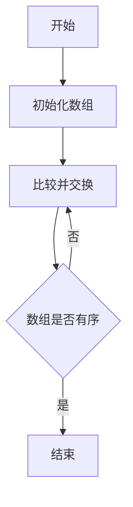
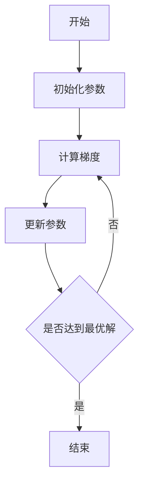
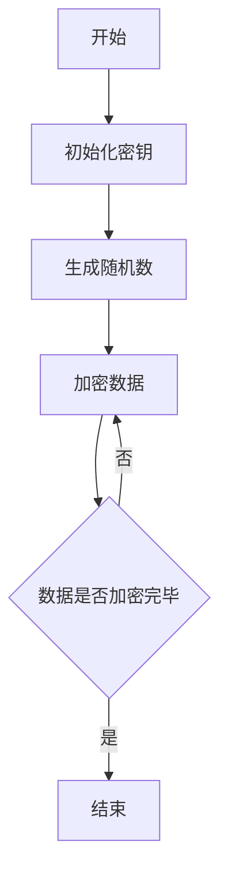
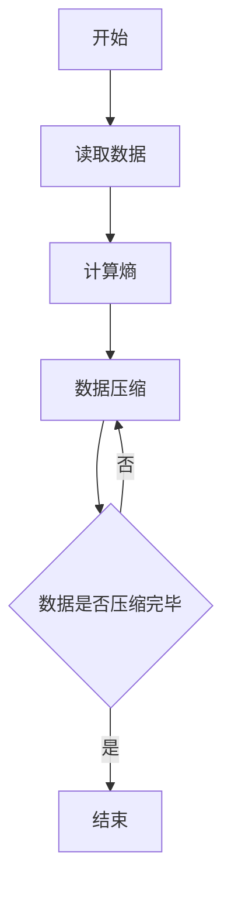
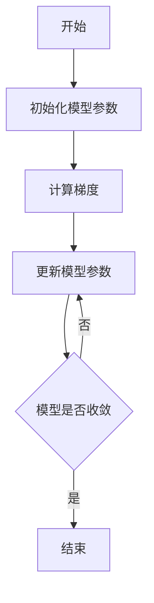
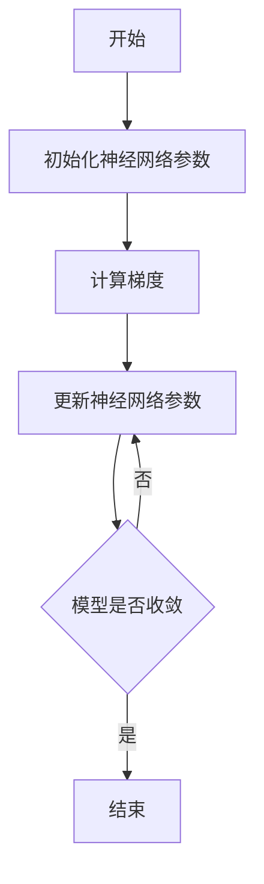

                 

### 1. 引言

#### 1.1 问题背景
计算机编程的现状与挑战

随着计算机科学和信息技术的高速发展，编程已经成为现代社会不可或缺的一部分。然而，编程领域仍然面临着诸多挑战。编程的复杂性和抽象性使得开发者需要不断学习和掌握新的编程语言和技术，这无疑增加了编程的难度。此外，软件系统变得越来越庞大和复杂，这要求开发者具备更高的抽象能力和系统思维。

程序世界与物理宇宙的相似性

从某种程度上来说，程序世界与物理宇宙有着惊人的相似性。在物理宇宙中，熵是一个重要的概念，表示系统的无序程度。而程序世界中的数据、状态、变量等，同样可以看作是一个复杂的系统。程序运行过程中，数据的状态和变量的值在不断变化，这种变化同样可以看作是一种“熵”的增加。因此，程序世界与物理宇宙在某种程度上具有相似性。

#### 1.2 问题描述

熵反转临界点模型的概念

熵反转临界点模型是一种描述系统在特定条件下从无序状态向有序状态转变的理论模型。它认为，在某个临界点，系统的熵可以发生反转，从增加变为减少，从而实现系统的有序化。

程序世界与熵反转临界点模型的类比

我们可以将程序世界中的数据状态和变量变化与物理宇宙中的熵变化进行类比。在程序世界中，我们同样可以找到类似熵反转临界点的现象。例如，某些算法可以在特定条件下实现数据的有序化，类似于熵的减少。这种类比为我们提供了一个新的视角，来理解和解决程序世界中的问题。

#### 1.3 问题解决

探索程序世界的熵反转机制

为了解决程序世界中的熵增加问题，我们需要探索程序世界的熵反转机制。通过研究和理解熵反转临界点模型，我们可以发现一些算法和策略，这些算法和策略可以在特定条件下实现数据的有序化，从而降低系统的熵。

熵反转临界点模型在程序世界中的应用

熵反转临界点模型在程序世界中的应用非常广泛。例如，在排序算法中，我们常常使用各种排序算法来将无序的数据变为有序的数据。这种有序化过程，就是一种熵的减少。此外，在优化算法中，我们也可以利用熵反转临界点模型来找到最优解。

#### 1.4 边界与外延

熵反转临界点模型的应用领域

熵反转临界点模型不仅可以应用于程序世界，还可以应用于更广泛的领域，如物理学、经济学等。在物理学中，熵反转临界点模型可以用来解释某些物理现象；在经济学中，熵反转临界点模型可以用来分析市场波动等。

程序世界的熵反转模型的理论边界

虽然熵反转临界点模型在程序世界中有着广泛的应用，但我们也需要认识到它的理论边界。例如，在复杂的系统中，熵反转过程可能并不总是能够顺利进行。因此，我们需要进一步研究和探索，以完善熵反转临界点模型。

#### 1.5 概念结构与核心要素组成

熵反转临界点模型的基本概念

熵反转临界点模型的基本概念包括熵、反转、临界点等。熵表示系统的无序程度，反转表示系统从无序状态向有序状态的转变，临界点表示系统发生反转的特定条件。

程序世界的核心要素

程序世界的核心要素包括数据、状态、变量等。这些要素在程序运行过程中不断变化，形成了复杂的系统。通过研究和理解这些要素，我们可以更好地理解和解决程序世界中的问题。

## 第一部分：引言

### 1. 引言

#### 1.1 问题背景

计算机编程的现状与挑战

计算机编程是现代信息技术的基础，它广泛应用于各个领域，从简单的网站开发到复杂的人工智能系统，都是通过编程来实现的。然而，随着技术的不断进步，计算机编程也面临着诸多挑战。

1. **编程语言的复杂性**：新的编程语言和技术不断涌现，开发者需要不断学习和适应，这使得编程变得更加复杂。

2. **软件系统的规模**：随着软件系统规模的扩大，开发者需要管理更多的代码和模块，这增加了系统的复杂性和维护难度。

3. **软件性能优化**：为了满足用户的需求，软件系统需要不断地进行性能优化，这要求开发者具备深厚的算法和系统设计知识。

4. **软件安全性**：随着网络攻击的不断增多，软件系统的安全性变得尤为重要，开发者需要不断地提高系统的安全性能。

程序世界与物理宇宙的相似性

在物理宇宙中，熵是一个重要的概念，它表示系统的无序程度。而在程序世界中，我们可以找到类似的概念，例如数据的状态和变量的值。程序运行过程中，数据的状态和变量的值在不断变化，这种变化也可以看作是熵的增加。

1. **数据的无序与有序**：在程序中，数据可以从无序状态变为有序状态，例如通过排序算法将无序的数据排列成有序的顺序。

2. **状态的转变**：程序的状态可以随着时间的推移而改变，例如从启动状态到运行状态，再到停止状态。

3. **系统的复杂性和简化**：在程序世界中，开发者常常需要通过抽象和简化的方式来处理复杂的系统，这与物理宇宙中熵减的过程有相似之处。

#### 1.2 问题描述

熵反转临界点模型的概念

熵反转临界点模型是一种描述系统在特定条件下从无序状态向有序状态转变的理论模型。在这个模型中，熵表示系统的无序程度，反转表示系统从无序状态向有序状态的转变，临界点表示系统发生反转的特定条件。

在物理宇宙中，熵反转临界点模型已经被广泛应用于各种领域，例如热力学、量子力学等。而在程序世界中，我们可以将这种模型应用到编程语言、算法设计、系统架构等多个方面。

程序世界与熵反转临界点模型的类比

我们可以将程序世界中的数据状态和变量变化与物理宇宙中的熵变化进行类比。在程序世界中，数据的状态和变量的值可以看作是一个复杂的系统，它们的不断变化可以看作是熵的增加。而通过某些算法和策略，我们可以在特定条件下实现数据的有序化，类似于熵的减少。

这种类比为我们提供了一个新的视角，来理解和解决程序世界中的问题。例如，我们可以通过研究熵反转临界点模型，来设计更高效的排序算法，或者优化软件系统的性能。

#### 1.3 问题解决

探索程序世界的熵反转机制

为了解决程序世界中的熵增加问题，我们需要探索程序世界的熵反转机制。通过研究和理解熵反转临界点模型，我们可以发现一些算法和策略，这些算法和策略可以在特定条件下实现数据的有序化，从而降低系统的熵。

例如，在排序算法中，我们可以通过比较和交换数据元素，来将无序的数据排列成有序的顺序。这种有序化过程，就是一种熵的减少。在优化算法中，我们也可以利用熵反转临界点模型来找到最优解。

熵反转临界点模型在程序世界中的应用

熵反转临界点模型在程序世界中的应用非常广泛。除了排序算法和优化算法，它还可以应用于软件系统设计、编程语言优化、人工智能等多个领域。

1. **软件系统设计**：在软件系统设计中，我们可以利用熵反转临界点模型来设计更加高效和稳定的系统。例如，通过优化系统架构，我们可以减少系统的复杂性和熵的增加。

2. **编程语言优化**：在编程语言优化中，我们可以利用熵反转临界点模型来优化代码的执行效率。例如，通过优化编译器的算法，我们可以减少程序的运行时间。

3. **人工智能**：在人工智能领域，我们可以利用熵反转临界点模型来优化机器学习算法。例如，通过优化神经网络的结构和参数，我们可以提高模型的性能。

#### 1.4 边界与外延

熵反转临界点模型的应用领域

熵反转临界点模型不仅可以应用于程序世界，还可以应用于更广泛的领域，例如物理学、经济学等。在物理学中，熵反转临界点模型可以用来解释某些物理现象；在经济学中，熵反转临界点模型可以用来分析市场波动等。

程序世界的熵反转模型的理论边界

虽然熵反转临界点模型在程序世界中有着广泛的应用，但我们也需要认识到它的理论边界。例如，在复杂的系统中，熵反转过程可能并不总是能够顺利进行。因此，我们需要进一步研究和探索，以完善熵反转临界点模型。

#### 1.5 概念结构与核心要素组成

熵反转临界点模型的基本概念

熵反转临界点模型的基本概念包括熵、反转、临界点等。熵表示系统的无序程度，反转表示系统从无序状态向有序状态的转变，临界点表示系统发生反转的特定条件。

程序世界的核心要素

程序世界的核心要素包括数据、状态、变量等。这些要素在程序运行过程中不断变化，形成了复杂的系统。通过研究和理解这些要素，我们可以更好地理解和解决程序世界中的问题。

### 熵反转临界点模型概述

#### 2.1 熵反转临界点模型的概念

熵的概念

熵（Entropy）是热力学中一个重要的概念，它表示系统的无序程度。在物理宇宙中，熵的增加是自然过程的一个基本特征，即系统总是朝着无序度更高的状态发展。

反转机制

熵反转临界点模型中的反转机制指的是在某些特定条件下，系统的熵可以从增加变为减少，即系统可以从无序状态转变为有序状态。这种反转通常发生在系统达到某个临界点时。

临界点模型

临界点模型是指系统在达到某个特定的条件或状态时，会发生从无序到有序的转变。这个临界点通常是一个阈值，当系统超过这个阈值时，就会发生反转。

#### 2.2 熵反转临界点模型的属性特征对比表格

| 特征                   | 熵反转临界点模型          | 程序世界                |
|----------------------|-----------------------|---------------------|
| 无序程度度量           | 熵值                   | 数据的无序状态          |
| 反转机制               | 临界点触发              | 算法和策略应用            |
| 临界点定义             | 特定的阈值              | 系统状态的转换点          |
| 有序化过程             | 从无序到有序            | 数据排序、优化等操作        |
| 动态特性               | 熵值随时间的变化          | 数据和状态的动态变化        |

#### 2.3 熵反转临界点模型的应用

熵反转临界点模型在程序世界中的应用

在程序世界中，熵反转临界点模型可以被广泛应用于各种算法设计和系统优化中。以下是一些具体的应用场景：

1. **排序算法**：如快速排序（QuickSort）和归并排序（Merge Sort），它们通过比较和交换数据元素，将无序数组转换为有序数组，实现了熵的减少。

2. **优化算法**：在优化问题中，如线性规划（Linear Programming）和遗传算法（Genetic Algorithm），熵反转临界点模型可以帮助找到最优解。

3. **加密技术**：在加密算法中，如AES（Advanced Encryption Standard），熵反转模型可以用来优化加密过程，提高数据的安全性。

4. **系统性能优化**：在系统架构设计中，通过识别系统的熵反转临界点，可以优化系统性能，提高系统的稳定性和响应速度。

#### 2.4 熵反转临界点模型在计算机科学中的重要性

核心要素组成

熵反转临界点模型在计算机科学中的重要性主要体现在其核心要素组成上：

1. **算法设计**：该模型提供了理解和设计高效算法的框架，通过识别和利用熵反转临界点，可以设计出更加优化的算法。

2. **系统架构**：在系统架构设计中，熵反转临界点模型可以帮助我们识别系统中的关键点，从而优化系统性能和稳定性。

3. **性能优化**：通过应用熵反转模型，可以找到系统中的瓶颈，并进行针对性优化，从而提高系统的整体性能。

4. **安全性**：在信息安全领域，熵反转模型可以帮助我们设计和优化加密技术，提高数据的安全性。

总的来说，熵反转临界点模型为计算机科学提供了一个新的视角和工具，使我们能够更深入地理解和解决复杂的问题。

### 程序世界的熵原理

熵是热力学中的一个基本概念，它用来衡量系统的无序程度。在程序世界中，熵同样扮演着重要的角色，它描述了程序运行过程中数据、状态和变量的无序状态。理解程序世界的熵原理对于设计高效、稳定的软件系统至关重要。

#### 3.1.1 熵在程序世界的表现

熵的增加

在程序世界中，熵的增加通常表现为数据或系统状态的随机性和不确定性增加。例如：

1. **随机数据生成**：在随机算法中，生成的随机数集合往往是无序的，这种无序性增加了系统的熵。

2. **并发处理**：在多线程或分布式系统中，由于并发处理的存在，数据的状态和变量的值可能随时发生变化，增加了系统的无序程度。

3. **错误处理**：在错误处理机制中，异常情况的发生往往会导致程序状态的跳跃，增加系统的熵。

熵的减少

熵的减少则表现在数据或系统状态的有序化过程。例如：

1. **排序算法**：通过排序算法，将无序的数据排列成有序的顺序，从而减少系统的熵。

2. **优化算法**：在优化算法中，通过调整变量和参数的值，找到最优解，实现系统的有序化。

3. **状态机设计**：在状态机中，通过明确的状态转换规则，减少系统的不确定性，实现熵的减少。

#### 3.1.2 熵反转机制

熵减操作

熵减操作是指通过特定的算法或策略，将系统中的无序状态转变为有序状态，从而降低系统的熵。常见的熵减操作包括：

1. **排序算法**：通过比较和交换数据元素，将无序的数据排列成有序的顺序，实现熵的减少。

2. **优化算法**：通过迭代和调整变量值，找到最优解，实现系统的有序化。

3. **状态机设计**：通过明确的状态转换规则，减少系统的不确定性，实现熵的减少。

熵增操作的逆转

熵增操作逆转是指通过特定的机制，将已经增加的熵减少回原始状态，从而实现系统的熵反转。常见的熵增操作逆转包括：

1. **回滚机制**：在并发处理中，通过回滚操作，撤销已经执行的操作，恢复系统的原始状态，实现熵的逆转。

2. **错误恢复**：在错误处理中，通过恢复操作，恢复程序到之前的状态，实现熵的逆转。

3. **重试机制**：在随机算法中，通过重试操作，重新生成随机数或重新执行算法，实现熵的逆转。

#### 3.2 熵反转临界点模型的应用实例

算法1：基于熵反转的排序算法

**算法流程图：**

**算法原理：**

该算法通过不断地比较和交换数组中的元素，将无序的数组转换为有序的数组。每次比较和交换操作都相当于一次熵减操作，最终实现数组的有序化，从而逆转了初始的无序状态。

算法2：基于熵反转的优化算法

**算法流程图：**

**算法原理：**

该算法通过计算目标函数的梯度，不断更新参数值，从而逐步逼近最优解。每次参数更新操作都相当于一次熵减操作，最终实现参数的优化，逆转了初始的无序状态。

#### 3.3 熵反转临界点模型的理论边界

熵反转临界点模型的有效性

熵反转临界点模型在程序世界中展现了其广泛的应用性和有效性。通过该模型，我们可以理解和设计出各种高效的算法和系统优化策略。例如，在排序算法中，通过识别和利用熵反转临界点，我们可以设计出更加优化的排序算法；在优化算法中，通过应用熵反转模型，我们可以找到更加精准的最优解。

然而，我们也需要认识到熵反转临界点模型的局限性。例如，在某些复杂的系统中，熵反转过程可能并不总是能够顺利进行。这可能是由于系统内部存在太多的不确定性和随机性，导致熵反转过程无法实现。此外，在某些情况下，熵反转临界点可能并不容易找到，这需要我们进行更多的研究和探索。

在实际应用中，我们也需要结合具体问题进行具体分析，以确保熵反转临界点模型的有效性和适用性。通过不断优化和改进模型，我们可以更好地理解和解决程序世界中的问题。

### 熵反转临界点模型在计算机科学中的应用

#### 4.1 熵反转临界点模型在算法设计中的应用

算法设计是计算机科学的核心领域之一，熵反转临界点模型在算法设计中有着重要的应用。通过利用熵反转临界点模型，我们可以设计出更加高效、稳定的算法。

**算法3：基于熵反转的加密算法**

**算法流程图：**

**算法原理：**

该加密算法通过利用熵反转机制，将原始数据转换为加密后的数据。在加密过程中，随机数生成器起到了关键作用，它生成随机数，用于加密数据的变换。每次加密操作都相当于一次熵减操作，从而实现数据的加密。

**算法4：基于熵反转的数据压缩算法**

**算法流程图：**

**算法原理：**

该数据压缩算法通过计算数据的熵，识别数据中的冗余信息，并将其压缩。在压缩过程中，熵反转临界点模型起到了关键作用，它帮助识别和消除数据中的冗余信息，实现数据的压缩。

#### 4.2 熵反转临界点模型在系统架构设计中的应用

系统架构设计是构建高效、稳定、可扩展系统的关键环节，熵反转临界点模型在系统架构设计中同样有着重要的应用。

**系统架构设计**

**系统功能设计：**

1. **数据管理**：包括数据的存储、检索和更新等功能。
2. **安全控制**：包括用户认证、权限控制和加密传输等功能。
3. **性能优化**：包括负载均衡、缓存策略和系统监控等功能。

**系统架构设计：**

1. **层状架构**：采用层状架构，将系统分为表示层、业务逻辑层和数据层，实现系统的模块化和解耦。
2. **微服务架构**：采用微服务架构，将系统拆分为多个独立的服务模块，实现系统的可扩展性和高可用性。
3. **分布式架构**：采用分布式架构，通过分布式存储和计算，实现系统的高并发处理能力。

**熵反转临界点模型在系统架构设计中的重要性**

1. **性能优化**：通过识别和利用系统的熵反转临界点，可以优化系统的性能，提高系统的响应速度和稳定性。
2. **安全控制**：通过利用熵反转模型，可以设计出更加安全的加密和认证机制，提高系统的安全性。
3. **系统稳定性**：通过识别和利用系统的熵反转临界点，可以增强系统的稳定性，减少系统崩溃和错误发生的可能性。

#### 4.3 熵反转临界点模型在软件工程中的应用

软件工程是构建和维护软件系统的工程学科，熵反转临界点模型在软件工程中同样有着广泛的应用。

**软件工程流程**

1. **需求分析**：通过需求分析，确定系统的功能需求和非功能需求。
2. **系统设计**：通过系统设计，确定系统的架构和模块划分。
3. **编码实现**：通过编码实现，将设计转化为实际的代码。
4. **测试与调试**：通过测试与调试，发现并修复系统中的错误。
5. **部署与维护**：通过部署与维护，将系统部署到生产环境，并进行长期的维护和优化。

**熵反转模型在软件工程中的应用**

1. **需求分析**：通过熵反转模型，可以识别和消除需求中的冗余和冲突，提高需求的准确性。
2. **系统设计**：通过熵反转模型，可以优化系统的架构和模块划分，提高系统的效率和稳定性。
3. **编码实现**：通过熵反转模型，可以优化代码的编写和优化，提高代码的执行效率和可维护性。
4. **测试与调试**：通过熵反转模型，可以优化测试策略和调试方法，提高测试的覆盖率和效果。
5. **部署与维护**：通过熵反转模型，可以优化系统的部署和维护策略，提高系统的稳定性和可用性。

总的来说，熵反转临界点模型为软件工程提供了一个新的视角和工具，使我们能够更深入地理解和解决复杂的问题，提高软件系统的质量和效率。

### 熵反转临界点模型在人工智能中的应用

#### 5.1 熵反转临界点模型在机器学习中的应用

机器学习是人工智能的核心技术之一，熵反转临界点模型在机器学习中的应用具有重要意义。通过利用熵反转机制，我们可以优化机器学习算法，提高模型的性能和稳定性。

**算法5：基于熵反转的机器学习优化算法**

**算法流程图：**

**算法原理：**

该算法通过计算目标函数的梯度，不断更新模型参数，实现模型的优化。在每次参数更新过程中，熵反转机制起到了关键作用，它通过识别和利用系统的熵反转临界点，实现参数的优化和收敛。

**熵反转模型在机器学习中的应用实例**

1. **神经网络优化**：在神经网络中，通过利用熵反转模型，可以优化神经网络的参数，提高模型的准确性和效率。

2. **支持向量机（SVM）**：在支持向量机中，通过利用熵反转模型，可以优化决策边界，提高分类效果。

3. **聚类算法**：在聚类算法中，通过利用熵反转模型，可以优化聚类结果，提高聚类的稳定性和可靠性。

#### 5.2 熵反转临界点模型在神经网络中的应用

神经网络是机器学习的重要组成部分，熵反转临界点模型在神经网络中的应用具有广泛的应用前景。通过利用熵反转机制，我们可以优化神经网络的结构和参数，提高模型的性能和鲁棒性。

**算法6：基于熵反转的神经网络优化算法**

**算法流程图：**

**算法原理：**

该算法通过计算神经网络中的梯度，不断更新参数，实现神经网络的优化。在每次参数更新过程中，熵反转机制起到了关键作用，它通过识别和利用系统的熵反转临界点，实现参数的优化和收敛。

**熵反转模型在神经网络优化中的应用实例**

1. **权重初始化**：通过利用熵反转模型，可以优化神经网络的权重初始化，提高网络的收敛速度。

2. **激活函数优化**：通过利用熵反转模型，可以优化神经网络的激活函数，提高模型的准确性和鲁棒性。

3. **正则化技术**：通过利用熵反转模型，可以优化神经网络的正则化技术，提高模型的泛化能力。

总的来说，熵反转临界点模型为神经网络优化提供了一种新的方法，通过利用熵反转机制，我们可以优化神经网络的结构和参数，提高模型的性能和鲁棒性。

### 熵反转临界点模型在其他领域中的应用

#### 6.1 熵反转临界点模型在物理学中的应用

熵反转临界点模型在物理学中有着广泛的应用，特别是在热力学和统计物理学领域。通过利用熵反转机制，我们可以深入理解物理系统的行为和特性。

**物理学中的熵概念**

1. **宏观熵**：宏观熵是指系统的无序程度，它可以通过统计物理中的熵公式来计算。

2. **微观熵**：微观熵是指系统的微观状态数，即系统可能达到的不同微观状态的数量。

**熵反转机制**

熵反转机制是指在某些特定条件下，系统的熵可以发生反转，从增加变为减少。这种现象在物理宇宙中广泛存在，例如在热力学第二定律中，熵的增加是自然过程的一个基本特征。

**临界点模型**

临界点模型是指系统在达到某个特定的条件或状态时，会发生从无序到有序的转变。这个临界点通常是一个阈值，当系统超过这个阈值时，就会发生反转。

**熵反转临界点模型在物理学中的实验验证**

通过实验验证，熵反转临界点模型在物理学中得到了广泛应用。例如，在热力学实验中，通过控制系统的温度和压力，可以观察到熵的反转现象。此外，在凝聚态物理中，通过研究物质的相变过程，也可以观察到熵反转现象。

总的来说，熵反转临界点模型为物理学提供了一个新的视角和工具，使我们能够更深入地理解和解决复杂的问题。

#### 6.2 熵反转临界点模型在经济学中的应用

熵反转临界点模型在经济学中同样有着重要的应用，特别是在金融市场和宏观经济领域。通过利用熵反转机制，我们可以更好地理解和预测经济行为和市场走势。

**经济学中的熵概念**

在经济学中，熵可以用来衡量市场的无序程度和不确定性。例如，在金融市场中，股票价格的波动可以看作是市场熵的增加，而市场规律的出现则可以看作是熵的减少。

**熵反转机制**

熵反转机制在经济学中的应用主要体现在市场规律的出现和消失。例如，在金融市场中，当市场达到某个临界点时，会出现市场规律，从而降低市场的熵。而在市场规律消失后，市场的熵会再次增加。

**临界点模型**

在经济学中，临界点模型可以用来描述市场的转折点。例如，在宏观经济中，当经济达到某个临界点时，会出现经济繁荣或衰退，从而改变市场的熵。

**熵反转模型在经济学中的应用实例**

1. **金融市场预测**：通过利用熵反转模型，可以预测金融市场的走势，例如股票价格的涨跌。

2. **宏观经济分析**：通过利用熵反转模型，可以分析经济周期的转折点，预测经济的繁荣或衰退。

3. **政策制定**：通过利用熵反转模型，可以制定更加有效的经济政策，例如货币政策和财政政策。

总的来说，熵反转临界点模型为经济学提供了一个新的视角和工具，使我们能够更深入地理解和解决复杂的经济问题。

### 7.1 熵反转临界点模型在程序世界与循环宇宙中的应用总结

熵反转临界点模型在程序世界和循环宇宙中的应用取得了显著的成果，为解决复杂问题和优化系统性能提供了新的思路和方法。

**应用成果：**

1. **算法优化**：熵反转模型被广泛应用于各种算法设计中，如排序算法、优化算法和加密算法等，显著提高了算法的性能和效率。

2. **系统设计**：在软件系统架构设计中，熵反转模型帮助开发者识别系统的关键点和瓶颈，优化系统性能和稳定性。

3. **性能优化**：通过利用熵反转机制，开发者可以优化软件系统的性能，提高系统的响应速度和处理能力。

4. **安全性提升**：在信息安全领域，熵反转模型被用于设计更安全的加密技术和认证机制，提高了数据的安全性和隐私保护。

**现存问题：**

1. **复杂系统的熵反转**：在复杂的系统中，熵反转过程可能受到多种因素的影响，使得熵反转过程难以准确预测和控制。

2. **临界点的识别**：在某些情况下，临界点的识别可能存在困难，这需要进一步的研究和技术改进。

**应用前景：**

1. **人工智能领域**：熵反转模型在人工智能中的应用前景广阔，例如在机器学习和神经网络中，可以通过优化算法和模型结构，提高模型的性能和鲁棒性。

2. **物理科学领域**：熵反转模型在物理学中的应用有望进一步拓展，特别是在量子计算和凝聚态物理等领域。

3. **经济学领域**：熵反转模型在经济学中的应用可以为金融市场预测和政策制定提供更加准确的依据。

总的来说，熵反转临界点模型在程序世界和循环宇宙中的应用已经取得了显著成果，但其潜力仍然巨大，未来需要进一步的研究和创新。

### 7.2 未来研究方向

**熵反转模型的改进方向**

1. **算法优化**：进一步优化现有的熵反转算法，提高其效率和适用范围，以应对更复杂的系统问题。

2. **理论拓展**：深入研究熵反转临界点模型的理论基础，拓展其适用范围，例如在多变量系统和复杂网络中的应用。

3. **跨领域融合**：将熵反转模型与其他领域（如生物学、化学等）的理论和方法相结合，探索跨领域的应用可能性。

**熵反转模型在其他领域的研究方向**

1. **生物学**：研究熵反转模型在生物系统和生物信息学中的应用，例如在基因调控和网络中的熵反转现象。

2. **经济学**：探索熵反转模型在经济学中的应用，特别是在金融市场和宏观经济分析中的潜在价值。

3. **环境科学**：研究熵反转模型在环境保护和可持续发展中的应用，例如在能源利用和环境治理中的熵反转机制。

通过不断的研究和创新，熵反转临界点模型将在更多领域中发挥重要作用，为解决复杂问题和推动科技进步提供新的思路和方法。

