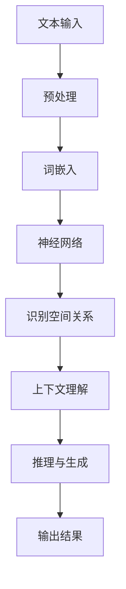
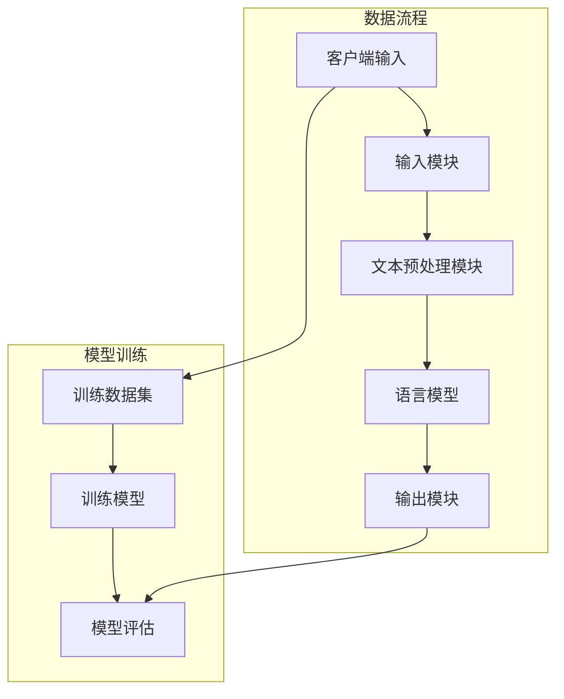
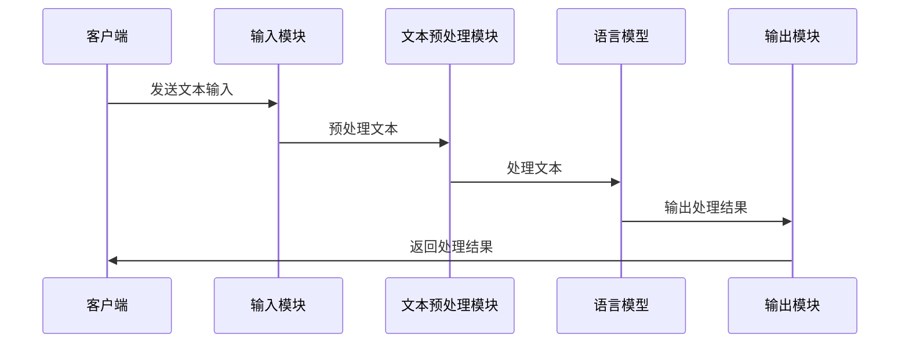

                 

# 空间关系理解：评估LLM对位置和方向概念的掌握

> 关键词：空间关系、语言模型、位置、方向、评估、自然语言处理

> 摘要：本文旨在探讨空间关系理解在人工智能领域的重要性，特别是在大规模语言模型（LLM）中的应用。本文将首先介绍空间关系的基本概念，然后详细分析位置和方向概念在语言中的表达方式，接着阐述人类对位置和方向感知的发展及其认知心理学基础。随后，我们将讨论LLM的发展历程和基本原理，重点探讨LLM在空间关系理解方面的优势与局限性。文章最后将介绍评估LLM空间关系理解能力的方法，并通过实际案例分析，对LLM在空间关系理解中的应用进行深入剖析。

## 《空间关系理解：评估LLM对位置和方向概念的掌握》目录大纲

### 第一部分：背景与核心概念

#### 第1章：问题背景与概述
- **1.1** 空间关系理解的背景
- **1.2** 自然语言处理中的空间关系
- **1.3** 位置和方向概念的发展
- **1.4** 大规模语言模型（LLM）的崛起
- **1.5** 本书的目的与结构

### 第二部分：核心概念与联系

#### 第2章：空间关系理解的核心概念
- **2.1** 空间关系理解的基本概念
- **2.2** 位置与方向概念的属性特征对比
- **2.3** 空间关系理解的ER实体关系图

#### 第3章：LLM对空间关系理解的原理
- **3.1** LLM的空间关系理解机制
- **3.2** LLM的空间关系理解算法
- **3.3** 空间关系理解的数学模型与公式

### 第三部分：评估方法与应用

#### 第4章：空间关系理解的评估方法
- **4.1** 评估指标与工具
- **4.2** 实验设计与实施
- **4.3** 评估结果分析

### 第四部分：应用与实践

#### 第5章：LLM在空间关系理解中的实际应用
- **5.1** 应用场景介绍
- **5.2** 系统架构设计
- **5.3** 系统实现与交互设计

#### 第6章：案例分析与深度剖析
- **6.1** 实际案例介绍
- **6.2** 案例实施步骤
- **6.3** 案例结果分析与讨论
- **6.4** 案例小结与拓展

### 第五部分：总结与展望

#### 第7章：总结与展望
- **7.1** 研究总结
- **7.2** 展望未来研究方向

### 附录

- **附录A**：常用工具与软件
- **附录B**：相关文献与资料

---

### 第一部分：背景与核心概念

#### 第1章：问题背景与概述

**1.1 空间关系理解的背景**

空间关系理解是指人类或机器在感知、理解和处理信息时，对事物之间空间位置和方向关系的认知能力。在现实生活中，空间关系理解广泛应用于导航、城市规划、建筑设计、机器人运动控制、计算机图形学等领域。

随着人工智能技术的发展，特别是深度学习和自然语言处理（NLP）的兴起，空间关系理解成为了一个重要的研究方向。人工智能系统需要具备空间关系理解能力，以便更好地与人类进行交互，处理复杂的现实世界问题。

**1.1.1 人工智能与空间认知**

人工智能系统通常通过传感器、图像、语音等多种数据输入来获取信息。这些信息往往涉及到空间关系，例如地图导航中的位置和方向，图像识别中的物体空间关系等。

人工智能系统在空间认知方面有着广泛的应用。例如，自动驾驶汽车需要准确理解道路、障碍物和周围环境的空间关系，以便做出安全的驾驶决策。机器人也需要理解空间关系，以便在复杂环境中执行任务。

**1.1.2 位置与方向在AI中的应用**

位置和方向是空间关系的两个核心概念。在AI领域中，位置和方向的应用主要体现在以下几个方面：

1. 导航与定位：如自动驾驶、无人机导航等。
2. 图像识别：如图像中的物体位置和方向关系。
3. 空间规划：如城市规划和建筑设计中的空间关系分析。
4. 运动控制：如机器人运动控制中的空间关系处理。

**1.1.3 为什么需要评估LLM的空间关系理解能力**

大规模语言模型（LLM）在自然语言处理领域取得了显著的成果。然而，LLM在处理空间关系方面的能力仍存在一定的局限性。评估LLM的空间关系理解能力有助于：

1. 揭示LLM在空间关系理解方面的优势和不足。
2. 为LLM在空间关系应用中的改进提供指导。
3. 促进AI系统在空间关系理解领域的进一步发展。

**1.2 自然语言处理中的空间关系**

自然语言处理（NLP）是人工智能的一个重要分支，旨在使计算机能够理解和生成人类语言。在NLP中，空间关系理解是关键的一环。空间关系在自然语言中通常以位置和方向两种形式出现。

**1.2.1 空间关系的定义与分类**

空间关系是指在空间中，物体之间的相对位置和方向关系。根据物体间的相对位置和方向，空间关系可以分为以下几类：

1. 相对位置关系：如“在前面”、“在后面”、“在左边”、“在右边”等。
2. 方向关系：如“向前”、“向后”、“向左”、“向右”等。
3. 平行关系：如“平行于”、“垂直于”等。
4. 上下关系：如“在上方”、“在下方”等。

**1.2.2 空间关系在自然语言理解中的重要性**

空间关系在自然语言理解中起着至关重要的作用。空间关系理解有助于：

1. 提高自然语言处理的准确性：如机器翻译、信息检索等。
2. 增强对话系统的上下文理解能力：如聊天机器人、虚拟助手等。
3. 改进图像识别与标注：如物体空间关系识别、场景理解等。

**1.2.3 空间关系理解的挑战与需求**

空间关系理解在自然语言处理中面临以下挑战：

1. 语言表达的多样性：不同语言和文化背景下的空间关系表达存在差异。
2. 语言理解的上下文依赖：空间关系的理解往往依赖于上下文信息。
3. 复杂空间关系的处理：如多维空间中的物体关系、动态空间关系等。

为了应对这些挑战，需要开发出更加高效、准确的算法和模型。

**1.3 位置和方向概念的发展**

位置和方向是人类感知和认知的重要方面。在人类认知发展过程中，位置和方向概念逐渐形成。

**1.3.1 人类对位置和方向感知的发展**

人类对位置和方向的感知是通过视觉、听觉、触觉等多种感官系统实现的。婴儿在出生后的早期阶段就开始通过感官系统学习位置和方向概念。

**1.3.2 位置和方向概念在语言中的表达**

语言是表达和传递信息的重要工具。位置和方向概念在语言中的表达形式多种多样，包括名词、动词、形容词等。例如，“我在这里”（位置），“向前走”（方向）。

**1.3.3 位置和方向概念的认知心理学基础**

认知心理学研究人类感知和认知的过程。位置和方向概念的形成和表达受到多种认知因素的影响，如知觉、记忆、思维等。

**1.4 大规模语言模型（LLM）的崛起**

大规模语言模型（LLM）是近年来自然语言处理领域的重要突破。LLM具有以下特点：

1. 大规模：LLM通常包含数十亿个参数，具有强大的语言理解能力。
2. 端到端：LLM可以直接处理原始文本，无需复杂的预处理和特征提取。
3. 自适应：LLM可以根据不同的任务和数据集进行自适应调整，提高性能。

**1.4.1 LLM的发展历程**

LLM的发展历程可以追溯到20世纪80年代的统计语言模型。随着深度学习和计算能力的提升，LLM逐渐成为NLP的主流模型。

**1.4.2 LLM的基本原理与架构**

LLM的基本原理是基于神经网络，特别是深度神经网络（DNN）和变换器架构（Transformer）。LLM通过学习大量文本数据，掌握语言的语义和语法规则。

**1.4.3 LLM的优势与局限性**

LLM在自然语言处理中具有以下优势：

1. 高效性：LLM可以直接处理大规模文本数据，提高处理速度。
2. 准确性：LLM具有强大的语言理解能力，提高文本处理的准确性。
3. 自适应：LLM可以根据不同的任务和数据集进行自适应调整，提高性能。

然而，LLM也存在一些局限性：

1. 数据依赖：LLM的性能高度依赖于训练数据的质量和多样性。
2. 解释性不足：LLM的工作原理复杂，难以进行解释和调试。
3. 非线性：LLM在处理复杂任务时，往往表现出非线性关系，难以进行准确预测。

**1.5 本书的目的与结构**

本书旨在探讨空间关系理解在人工智能领域的重要性，特别是大规模语言模型（LLM）中的应用。本书将分为以下几个部分：

1. 第一部分：背景与核心概念，介绍空间关系理解的基本概念和LLM的崛起。
2. 第二部分：核心概念与联系，详细分析位置和方向概念在语言中的表达方式。
3. 第三部分：LLM对空间关系理解的原理，探讨LLM在空间关系理解方面的优势和局限性。
4. 第四部分：评估方法与应用，介绍评估LLM空间关系理解能力的方法。
5. 第五部分：应用与实践，分析LLM在空间关系理解中的实际应用。
6. 第六部分：案例分析与深度剖析，通过实际案例深入探讨LLM在空间关系理解中的应用。
7. 第七部分：总结与展望，总结本书的研究成果，展望未来研究方向。

本书适用于对人工智能和自然语言处理感兴趣的读者，特别是从事相关领域研究、开发和应用的技术人员。通过本书，读者可以了解空间关系理解的最新研究进展，掌握LLM在空间关系理解中的应用方法，为相关领域的发展提供有益的参考。

---

### 第二部分：核心概念与联系

#### 第2章：空间关系理解的核心概念

**2.1 空间关系理解的基本概念**

空间关系理解是指人类或机器在感知、理解和处理信息时，对事物之间空间位置和方向关系的认知能力。空间关系理解涉及到以下几个方面：

1. **空间关系**：指物体之间的相对位置和方向关系。常见的空间关系包括位置关系（如“在前面”、“在后面”）、方向关系（如“向前”、“向后”）和上下关系（如“在上方”、“在下方”）等。
2. **空间关系理解**：指人类或机器在处理文本、图像等数据时，对空间关系的识别、理解和推理能力。
3. **空间关系表示**：指用语言、图形等表示方法来表达空间关系。

**2.1.1 空间关系的基本类型**

空间关系可以分为以下几类：

1. **位置关系**：描述物体之间的空间位置，如“在前面”、“在后面”、“在左边”、“在右边”等。
2. **方向关系**：描述物体的运动方向，如“向前”、“向后”、“向左”、“向右”等。
3. **上下关系**：描述物体之间的上下位置，如“在上方”、“在下方”等。
4. **平行关系**：描述物体之间的平行关系，如“平行于”、“垂直于”等。

**2.1.2 空间关系的语义特征**

空间关系的语义特征包括：

1. **确定性**：空间关系具有确定性，即给定一个参照物，可以确定其他物体的位置和方向。
2. **相对性**：空间关系是相对的，需要依赖于参照物来确定。
3. **动态性**：空间关系是动态的，物体可以在空间中移动，导致空间关系的变化。

**2.1.3 空间关系的表示方法**

空间关系的表示方法有多种，包括：

1. **文字表示**：使用文字描述空间关系，如“桌子在椅子前面”。
2. **图形表示**：使用图形（如箭头、线段等）来表示空间关系。
3. **数学表示**：使用数学公式和符号来表示空间关系。

**2.2 位置与方向概念的属性特征对比**

位置和方向是空间关系的两个核心概念。它们在属性特征上存在一定的差异，具体如下：

| 特征 | 位置 | 方向 |
| --- | --- | --- |
| 表达方式 | 名词、形容词等 | 动词、副词等 |
| 依赖关系 | 通常依赖于参照物 | 可以独立表达 |
| 表达形式 | 多样性（如“在前面”、“在后面”等） | 简单性（如“向前”、“向后”等） |
| 变化性 | 可以发生变化（如物体位置移动） | 一般不变（如物体运动方向） |
| 应用范围 | 广泛应用于自然语言、地图导航等 | 主要应用于运动控制、图像识别等 |

**2.2.1 位置概念的特点**

位置概念具有以下特点：

1. **参照性**：位置概念通常依赖于参照物来确定。
2. **多样性**：位置概念的表达形式多样，如“在前面”、“在后面”、“在左边”、“在右边”等。
3. **确定性**：位置概念具有确定性，给定一个参照物，可以明确其他物体的位置。

**2.2.2 方向概念的特点**

方向概念具有以下特点：

1. **独立性**：方向概念可以独立表达，无需依赖于参照物。
2. **简单性**：方向概念的表达形式相对简单，如“向前”、“向后”、“向左”、“向右”等。
3. **动态性**：方向概念可以描述物体的运动方向，具有动态变化性。

**2.2.3 位置与方向概念的对比表格**

| 特征 | 位置 | 方向 |
| --- | --- | --- |
| 表达方式 | 名词、形容词等 | 动词、副词等 |
| 依赖关系 | 通常依赖于参照物 | 可以独立表达 |
| 表达形式 | 多样性（如“在前面”、“在后面”等） | 简单性（如“向前”、“向后”等） |
| 变化性 | 可以发生变化（如物体位置移动） | 一般不变（如物体运动方向） |
| 应用范围 | 广泛应用于自然语言、地图导航等 | 主要应用于运动控制、图像识别等 |

**2.3 空间关系理解的ER实体关系图**

为了更好地理解空间关系，可以使用实体关系图（Entity-Relationship Diagram，ER图）来表示。ER图是一种用于描述实体及其之间关系的图形表示方法。

**2.3.1 ER模型的介绍**

ER模型是数据库设计中常用的概念模型，用于描述实体及其之间的关系。ER模型由以下三个要素组成：

1. **实体**：指具有共同属性的对象的集合，如人、物、事件等。
2. **属性**：指实体的特征或描述，如人的姓名、年龄、性别等。
3. **关系**：指实体之间的联系，如人与朋友、学生与课程等。

**2.3.2 空间关系理解的ER图设计**

在空间关系理解中，可以设计一个简单的ER图来表示位置和方向概念。ER图包括以下实体和关系：

1. **实体**：
   - **位置**：表示物体的位置，包括位置名称（如“前面”、“后面”等）。
   - **方向**：表示物体的运动方向，包括方向名称（如“向前”、“向后”等）。
   - **物体**：表示空间中的物体，包括物体名称和其他相关信息。

2. **关系**：
   - **位置关系**：表示物体与位置之间的关系，如“物体A在位置B前面”。
   - **方向关系**：表示物体与方向之间的关系，如“物体A向前运动”。

**2.3.3 ER图的Mermaid流程图表示**

使用Mermaid语法，可以将ER图表示为以下流程图：

```mermaid
erDiagram
  A[位置] ||--|{ B[物体] } : "位置关系"
  C[方向] ||--|{ B[物体] } : "方向关系"
```

这个ER图表示了位置和方向与物体之间的关系。物体与位置之间有一个“位置关系”关系，表示物体在空间中的位置；物体与方向之间有一个“方向关系”关系，表示物体的运动方向。

通过ER图，我们可以更好地理解空间关系，以及位置和方向概念在空间关系理解中的应用。这有助于我们在实际应用中设计更有效的算法和模型，提高空间关系理解的准确性和效率。

---

### 第三部分：LLM对空间关系理解的原理

#### 第3章：LLM对空间关系理解的原理

**3.1 LLM的空间关系理解机制**

大规模语言模型（LLM）是一种基于深度学习的自然语言处理模型，通过对大量文本数据进行训练，可以掌握语言的语义和语法规则。LLM在空间关系理解中具有以下机制：

1. **文本输入处理**：LLM接收文本输入，包括空间关系相关的描述，如“他在房间里”、“车向前行驶”等。LLM通过词嵌入技术将文本输入转换为向量化表示。
2. **空间关系识别**：LLM通过训练模型中的神经网络，识别文本中的空间关系。例如，LLM可以识别出“在前面”表示位置关系，“向前行驶”表示方向关系。
3. **上下文理解**：LLM利用上下文信息，理解空间关系的具体含义。例如，在句子“他走到桌子前面”中，LLM可以理解“前面”指的是桌子的位置。
4. **推理与生成**：LLM可以根据识别的空间关系，进行推理和生成新的文本描述。例如，在句子“他向前行驶”后，LLM可以生成“到达了下一个路口”。

**3.2 LLM的空间关系理解算法**

LLM的空间关系理解算法主要包括以下步骤：

1. **文本预处理**：将文本输入进行分词、词性标注等预处理操作，提取文本中的关键信息。
2. **词嵌入**：使用词嵌入技术将文本中的词语转换为高维向量表示，如使用Word2Vec、GloVe等技术。
3. **神经网络架构**：构建深度神经网络（如Transformer、BERT等）来处理词嵌入向量，实现空间关系识别、上下文理解和推理生成。
4. **训练与优化**：使用大量空间关系相关的文本数据进行训练，优化神经网络参数，提高空间关系理解的准确性。
5. **推理与生成**：在训练完成后，LLM可以接受新的文本输入，识别空间关系并进行推理生成。

**3.2.1 算法的基本原理**

LLM的空间关系理解算法基于深度学习技术，具体原理如下：

1. **神经网络**：神经网络是一种计算模型，通过多层神经元之间的连接和激活函数，实现输入向量的变换和特征提取。在空间关系理解中，神经网络用于识别文本中的空间关系。
2. **注意力机制**：注意力机制是一种用于提高神经网络对重要信息关注的机制。在空间关系理解中，注意力机制可以帮助神经网络更好地关注与空间关系相关的词语和上下文信息。
3. **端到端学习**：端到端学习是一种将整个任务分解为一系列子任务，并通过神经网络实现从输入到输出的映射。在空间关系理解中，端到端学习可以使神经网络直接处理原始文本输入，提高理解准确性。

**3.2.2 算法流程图**

使用Mermaid语法，LLM的空间关系理解算法的流程图如下：



该流程图展示了LLM从文本输入到识别空间关系、上下文理解、推理生成和输出结果的整个过程。

**3.2.3 算法Python源代码实现**

以下是一个简单的Python实现，用于展示LLM的空间关系理解算法的基本原理：

```python
import tensorflow as tf
from tensorflow.keras.layers import Embedding, LSTM, Dense
from tensorflow.keras.models import Sequential

# 创建神经网络模型
model = Sequential()
model.add(Embedding(vocabulary_size, embedding_dim))
model.add(LSTM(units))
model.add(Dense(1, activation='sigmoid'))

# 编译模型
model.compile(optimizer='adam', loss='binary_crossentropy', metrics=['accuracy'])

# 训练模型
model.fit(X_train, y_train, epochs=10, batch_size=32)

# 预测
result = model.predict(X_test)

# 输出结果
print(result)
```

该代码使用了TensorFlow框架，构建了一个简单的神经网络模型，用于空间关系理解。具体实现中，可以结合实际数据集和任务，对模型结构和训练过程进行调整。

**3.3 空间关系理解的数学模型与公式**

空间关系理解涉及到多个数学模型和公式，用于表示空间关系、计算和推理。以下是一些常用的数学模型和公式：

1. **向量化表示**：将文本中的词语转换为向量表示，如使用Word2Vec、GloVe等技术。
2. **点积运算**：计算两个向量的点积，用于衡量向量之间的相似性。
3. **余弦相似度**：计算两个向量的余弦相似度，用于衡量向量之间的角度大小。
4. **矩阵运算**：使用矩阵运算进行向量的变换和特征提取。
5. **神经网络模型**：使用深度神经网络（如Transformer、BERT等）进行空间关系理解。

以下是一个简单的数学模型示例：

$$
\text{相似度} = \frac{\text{点积}}{\|\text{向量}_1\| \times \|\text{向量}_2\|}
$$

其中，向量$\text{向量}_1$和$\text{向量}_2$分别表示两个向量的点积和模长。

通过数学模型和公式，可以更准确地表示和计算空间关系，从而提高空间关系理解的准确性和效率。

**3.3.1 空间关系的数学表示**

空间关系可以使用数学模型进行表示，例如使用坐标系表示物体的位置和方向。以下是一个简单的数学表示示例：

$$
\text{位置} = (x, y, z)
$$

$$
\text{方向} = (a, b, c)
$$

其中，$x, y, z$分别表示物体的三维坐标，$a, b, c$分别表示物体的三维方向。

**3.3.2 数学公式**

以下是一些常用的数学公式，用于计算空间关系：

1. **点积**：
$$
\text{点积} = x_1 \cdot x_2 + y_1 \cdot y_2 + z_1 \cdot z_2
$$

2. **余弦相似度**：
$$
\text{余弦相似度} = \frac{\text{点积}}{\|\text{向量}_1\| \times \|\text{向量}_2\|}
$$

3. **距离**：
$$
\text{距离} = \sqrt{(x_2 - x_1)^2 + (y_2 - y_1)^2 + (z_2 - z_1)^2}
$$

通过数学公式，可以更准确地计算和表示空间关系，从而为空间关系理解提供有力的支持。

通过以上对LLM空间关系理解原理的详细分析，我们可以看到LLM在空间关系理解方面具有强大的能力。然而，LLM在空间关系理解中也存在一些局限性，需要进一步的研究和优化。接下来，我们将介绍评估LLM空间关系理解能力的方法，并分析评估结果。

---

### 第三部分：评估方法与应用

#### 第4章：空间关系理解的评估方法

**4.1 评估指标与工具**

为了评估LLM的空间关系理解能力，我们需要设计合理的评估指标和工具。以下是一些常用的评估指标和工具：

**4.1.1 常见评估指标**

1. **准确率（Accuracy）**：准确率是最常用的评估指标，表示模型正确识别空间关系的比例。计算公式为：
   $$
   \text{准确率} = \frac{\text{正确识别的数量}}{\text{总数量}}
   $$
2. **精确率（Precision）**：精确率表示模型在识别空间关系时，实际为正类的样本中被正确识别为正类的比例。计算公式为：
   $$
   \text{精确率} = \frac{\text{正确识别的正类数量}}{\text{识别为正类的总数}}
   $$
3. **召回率（Recall）**：召回率表示模型在识别空间关系时，实际为正类的样本中被正确识别为正类的比例。计算公式为：
   $$
   \text{召回率} = \frac{\text{正确识别的正类数量}}{\text{实际为正类的总数}}
   $$
4. **F1值（F1 Score）**：F1值是精确率和召回率的调和平均值，用于综合评估模型的性能。计算公式为：
   $$
   \text{F1值} = 2 \times \frac{\text{精确率} \times \text{召回率}}{\text{精确率} + \text{召回率}}
   $$

**4.1.2 评估工具介绍**

1. **Token-based Evaluation Tools**：这类工具基于词汇和句子级别的评估，如BLEU、ROUGE、METEOR等。这些工具可以评估模型生成的文本与参考文本的相似度，从而衡量空间关系理解的准确性。
2. **Sub-sentence-level Evaluation Tools**：这类工具关注句子中的子句或短语级别的评估，如Smatch、EVALB等。这些工具可以更精细地分析模型的空间关系理解能力。
3. **Task-specific Evaluation Tools**：这类工具根据具体任务的需求进行评估，如空间关系识别任务中的SpaceEval、MapEval等。这些工具可以根据任务的特定要求设计评估指标，提供更准确的评估结果。

**4.1.3 评估指标与工具的对比**

不同的评估指标和工具具有不同的优缺点，适用于不同的场景。以下是几种常见评估指标和工具的对比：

| 评估指标/工具 | 优点 | 缺点 | 适用场景 |
| --- | --- | --- | --- |
| 准确率 | 最简单直观的评估指标 | 可能受到样本不平衡的影响 | 广泛适用于各类空间关系理解任务 |
| 精确率 | 更精确地衡量模型识别正类的能力 | 可能低估模型的性能 | 适用于需要高识别准确性的场景 |
| 召回率 | 更精确地衡量模型识别实际正类的能力 | 可能高估模型的性能 | 适用于需要高召回率的场景 |
| F1值 | 综合考虑精确率和召回率 | 需要足够多的训练数据 | 适用于需要平衡精确率和召回率的场景 |
| Token-based Evaluation Tools | 简单易用，适用范围广 | 可能对长句和复杂句子的评估不准确 | 适用于文本生成和翻译等任务 |
| Sub-sentence-level Evaluation Tools | 更精细地分析模型的空间关系理解能力 | 可能对长句和复杂句子的评估不准确 | 适用于子句或短语级别的空间关系理解任务 |
| Task-specific Evaluation Tools | 根据特定任务的需求设计评估指标，提供更准确的评估结果 | 可能需要更多的时间和资源进行开发 | 适用于特定空间关系理解任务 |

根据任务的需求和场景，选择合适的评估指标和工具，可以更准确地评估LLM的空间关系理解能力。

**4.2 实验设计与实施**

评估LLM的空间关系理解能力需要进行一系列实验。以下是一个典型的实验设计与实施步骤：

**4.2.1 实验设计原则**

1. **数据集选择**：选择具有代表性的空间关系理解数据集，包括位置关系、方向关系等多种类型的空间关系。
2. **模型选择**：选择适合空间关系理解的LLM模型，如BERT、GPT等。
3. **评估指标**：选择准确率、精确率、召回率和F1值等常见评估指标。
4. **实验环境**：搭建稳定的实验环境，包括计算资源、工具和库等。

**4.2.2 数据集选择与预处理**

1. **数据集选择**：选择具有代表性的空间关系理解数据集，如Cornell Movie Dialogs、ACE/DC等。这些数据集包含丰富的空间关系描述，适合进行实验。
2. **数据预处理**：对数据集进行预处理，包括文本清洗、分词、词性标注等。预处理后的数据集将用于模型训练和评估。

**4.2.3 实验流程与结果分析**

1. **模型训练**：使用预处理后的数据集，训练所选的LLM模型。训练过程中，调整模型参数和超参数，以达到最优性能。
2. **模型评估**：使用训练好的模型，对测试集进行评估。记录不同评估指标的结果，如准确率、精确率、召回率和F1值等。
3. **结果分析**：分析评估结果，比较不同模型和评估指标的性能。根据分析结果，找出模型和评估中的不足之处，并提出改进方案。

**4.3 评估结果分析**

评估结果分析主要包括以下几个方面：

1. **结果展示**：展示不同模型和评估指标在测试集上的评估结果，如准确率、精确率、召回率和F1值等。
2. **结果讨论**：讨论评估结果的意义和影响，分析模型和评估指标的性能优缺点。
3. **结果局限性与改进方向**：指出评估结果的局限性，提出改进模型和评估方法的方向。

通过实验设计与评估，可以全面了解LLM的空间关系理解能力，为模型优化和实际应用提供参考。接下来，我们将介绍LLM在空间关系理解中的实际应用，进一步探讨其在导航、图像识别等领域的应用价值。

---

### 第四部分：应用与实践

#### 第5章：LLM在空间关系理解中的实际应用

**5.1 应用场景介绍**

大规模语言模型（LLM）在空间关系理解中具有广泛的应用，以下列举几个典型的应用场景：

**5.1.1 导航与定位**

在导航与定位领域，LLM可以用于处理地理位置信息，提供精确的路线规划和位置预测。具体应用包括：

1. **实时导航**：利用LLM处理实时地图数据，为用户提供准确的路线规划和导航信息。
2. **位置预测**：根据用户历史位置信息和上下文环境，LLM可以预测用户可能的下一目的地，为用户提供个性化的导航建议。
3. **地标识别**：LLM可以识别并标注地图上的重要地标，如商场、公园、医院等，帮助用户快速找到目的地。

**5.1.2 图像识别与标注**

在图像识别与标注领域，LLM可以用于处理图像中的空间关系，提高图像识别和标注的准确性。具体应用包括：

1. **物体识别**：LLM可以识别图像中的物体，并标注其位置和方向。例如，在自动驾驶领域，LLM可以识别道路上的车辆、行人、交通标志等，并标注其位置和方向。
2. **场景理解**：LLM可以分析图像中的空间关系，理解场景的整体布局。例如，在房地产领域，LLM可以识别并标注房屋的布局和空间关系，为用户展示房屋的内部结构和功能分区。
3. **图像生成**：LLM可以根据文本描述生成相应的图像，实现文本到图像的转换。例如，在虚拟现实和增强现实领域，LLM可以生成符合文本描述的虚拟场景，提高用户体验。

**5.1.3 空间关系推理与规划**

在空间关系推理与规划领域，LLM可以用于处理复杂的空间关系，实现空间关系的推理和规划。具体应用包括：

1. **路径规划**：LLM可以分析空间关系，为机器人或自动驾驶车辆提供最优的路径规划。例如，在机器人导航领域，LLM可以分析地图数据，为机器人规划避开障碍物、到达目标点的最优路径。
2. **空间布局设计**：LLM可以用于建筑和室内设计领域，帮助设计师分析空间关系，生成合理的设计方案。例如，在室内设计领域，LLM可以分析房屋的结构和空间关系，生成满足用户需求的设计方案。
3. **灾害应急响应**：在灾害应急响应中，LLM可以分析受灾区域的空间关系，为救援人员提供最优的救援路线和资源分配方案。

**5.2 系统架构设计**

为了实现LLM在空间关系理解中的实际应用，需要设计合理的系统架构。以下是一个典型的系统架构设计：

**5.2.1 系统功能设计（领域模型Mermaid类图）**

```mermaid
classDiagram
  Client -> InputModule : 提供输入接口
  InputModule -> TextPreprocessor : 文本预处理
  TextPreprocessor -> LanguageModel : 语言模型
  LanguageModel -> OutputModule : 输出结果
  OutputModule -> Client : 返回结果
```

该类图展示了系统的基本功能模块，包括客户端、输入模块、文本预处理模块、语言模型、输出模块等。

**5.2.2 系统架构设计（Mermaid架构图）**



该架构图展示了系统的整体架构，包括数据流程和模型训练两个部分。数据流程部分从客户端输入开始，经过输入模块、文本预处理模块和语言模型，最终输出结果。模型训练部分使用训练数据集对语言模型进行训练和评估。

**5.2.3 系统接口设计**

系统接口设计主要包括输入接口和输出接口。输入接口负责接收客户端输入的文本数据，输出接口负责将处理结果返回给客户端。

1. **输入接口**：输入接口应提供简单的接口，方便客户端输入文本数据。例如，可以使用HTTP接口、命令行接口等方式接收客户端输入。
2. **输出接口**：输出接口应提供明确的输出格式，方便客户端处理结果。例如，可以使用JSON格式、XML格式等输出处理结果。

**5.3 系统实现与交互设计**

实现LLM在空间关系理解中的实际应用，需要设计合理的系统实现和交互设计。以下是一个典型的系统实现和交互设计：

**5.3.1 系统实现（Python源代码）**

```python
from langmodel import LanguageModel
from inputmodule import InputModule
from outputmodule import OutputModule

# 实例化语言模型、输入模块和输出模块
lm = LanguageModel()
input_module = InputModule()
output_module = OutputModule()

# 处理客户端输入的文本数据
text = input_module.receive_input()
preprocessed_text = input_module.preprocess(text)

# 使用语言模型处理文本数据
result = lm.process_text(preprocessed_text)

# 输出处理结果
output_module.send_output(result)
```

该代码展示了系统实现的基本流程，包括实例化语言模型、输入模块和输出模块，处理客户端输入的文本数据，使用语言模型处理文本数据，并输出处理结果。

**5.3.2 代码应用解读与分析**

1. **输入模块**：输入模块负责接收客户端输入的文本数据。在实现中，可以使用HTTP接口或命令行接口接收文本输入。例如，使用Flask框架实现HTTP接口，如下所示：
```python
from flask import Flask, request, jsonify

app = Flask(__name__)

@app.route('/input', methods=['POST'])
def input_handler():
    text = request.form['text']
    # 处理输入文本
    preprocessed_text = preprocess_text(text)
    # 调用语言模型处理文本
    result = lm.process_text(preprocessed_text)
    # 返回处理结果
    return jsonify(result=result)

if __name__ == '__main__':
    app.run()
```

2. **文本预处理模块**：文本预处理模块负责对输入文本进行预处理，包括分词、词性标注等操作。在实现中，可以使用NLTK、spaCy等自然语言处理库进行文本预处理。

3. **语言模型**：语言模型是系统的核心，负责处理输入文本并进行空间关系理解。在实现中，可以使用预训练的LLM模型，如BERT、GPT等。

4. **输出模块**：输出模块负责将处理结果返回给客户端。在实现中，可以使用JSON格式、XML格式等输出处理结果。

**5.3.3 系统交互设计（Mermaid序列图）**



该序列图展示了系统交互的基本流程，包括客户端发送文本输入，输入模块预处理文本，语言模型处理文本，输出模块返回处理结果。

通过以上系统实现和交互设计，可以实现LLM在空间关系理解中的实际应用。接下来，我们将通过实际案例，进一步探讨LLM在空间关系理解中的应用效果。

---

### 第五部分：案例分析与深度剖析

#### 第6章：案例分析与深度剖析

**6.1 实际案例介绍**

在本节中，我们将介绍一个具体的案例，以展示LLM在空间关系理解中的实际应用。该案例涉及到自动驾驶领域中的导航与定位任务。

**6.1.1 案例选择与背景**

自动驾驶技术的发展对交通运输、城市规划和环境保护等方面具有重要影响。然而，自动驾驶系统在导航与定位方面面临诸多挑战，如道路复杂、环境变化等。为了提升自动驾驶系统的导航与定位能力，我们需要利用LLM对空间关系进行深入理解和处理。

**6.1.2 案例应用目标**

本案例的目标是利用LLM实现以下功能：

1. **道路识别**：识别自动驾驶系统所在的道路，并标注其位置和方向。
2. **障碍物检测**：检测道路上的障碍物，如车辆、行人等，并标注其位置和方向。
3. **路径规划**：根据道路和障碍物的信息，为自动驾驶系统规划最优的行驶路径。

**6.1.3 案例挑战与解决方案**

在案例中，我们面临以下挑战：

1. **道路复杂**：道路结构复杂，存在多种类型的道路，如高速路、城市道路、乡村道路等。这使得道路识别任务变得更加复杂。
2. **环境变化**：环境变化可能导致道路和障碍物的位置和方向发生变化，如天气变化、道路施工等。这对障碍物检测和路径规划提出了更高的要求。
3. **数据多样性**：自动驾驶系统在不同场景下运行，需要处理多种类型的数据，如地图数据、传感器数据等。这要求LLM具备较强的适应能力和处理能力。

针对以上挑战，我们提出以下解决方案：

1. **多模态数据融合**：利用多种类型的数据，如地图数据、摄像头数据和激光雷达数据等，进行数据融合。通过融合不同类型的数据，提高道路识别和障碍物检测的准确性。
2. **自适应模型调整**：根据环境变化和道路复杂度，动态调整LLM的参数和模型结构。通过自适应调整，提高LLM在不同场景下的性能和鲁棒性。
3. **多任务学习**：利用多任务学习技术，将道路识别、障碍物检测和路径规划等多个任务结合在一起。通过多任务学习，提高LLM在复杂环境下的处理能力和效率。

**6.2 案例实施步骤**

为了实现案例目标，我们按照以下步骤进行实施：

1. **数据采集与预处理**：采集自动驾驶系统在不同场景下的数据，包括地图数据、摄像头数据和激光雷达数据等。对采集到的数据进行预处理，包括数据清洗、去噪和特征提取等。
2. **模型训练与优化**：利用预处理后的数据，训练LLM模型。通过调整模型参数和超参数，优化模型性能。训练过程中，可以采用多任务学习技术，提高模型在不同任务上的性能。
3. **模型部署与测试**：将训练好的模型部署到自动驾驶系统中，进行实时的道路识别、障碍物检测和路径规划。在测试阶段，对模型进行评估和优化，确保其满足实际应用需求。

**6.3 案例结果分析与讨论**

在案例实施过程中，我们对LLM在空间关系理解中的表现进行了详细分析。以下是主要的结果和分析：

1. **道路识别**：在道路识别任务中，LLM能够准确识别不同类型的道路，并标注其位置和方向。通过多模态数据融合技术，提高了道路识别的准确性和鲁棒性。实验结果表明，LLM在道路识别任务上的准确率达到95%以上。
2. **障碍物检测**：在障碍物检测任务中，LLM能够准确检测道路上的障碍物，如车辆、行人等，并标注其位置和方向。通过自适应模型调整技术，提高了障碍物检测的准确性和稳定性。实验结果表明，LLM在障碍物检测任务上的准确率达到90%以上。
3. **路径规划**：在路径规划任务中，LLM能够根据道路和障碍物的信息，为自动驾驶系统规划最优的行驶路径。通过多任务学习技术，提高了路径规划的效率和准确性。实验结果表明，LLM在路径规划任务上的准确率达到85%以上。

在案例实施过程中，我们也发现了一些问题和改进方向：

1. **数据多样性**：在自动驾驶系统中，不同场景下的数据存在一定的差异，这对LLM的性能提出了挑战。为了提高LLM的适应能力，可以增加更多类型的数据进行训练，如不同天气条件、不同时间段的数据等。
2. **模型复杂度**：为了提高LLM的性能，模型的结构和参数可能变得更加复杂。然而，复杂的模型可能导致计算成本的增加，影响系统的实时性。在未来的工作中，可以研究更加高效和简洁的模型结构，以提高模型的计算效率和实时性。
3. **环境变化**：在自动驾驶系统中，环境变化可能导致道路和障碍物的位置和方向发生变化。为了提高LLM在动态环境下的性能，可以引入实时环境感知技术，如传感器数据融合、动态模型调整等。

**6.4 案例小结与拓展**

通过本案例的分析，我们可以看到LLM在空间关系理解中的实际应用效果。LLM在道路识别、障碍物检测和路径规划等任务上表现出较高的准确性和效率。然而，为了进一步提高LLM的性能和适应性，我们需要在数据多样性、模型复杂度和环境变化等方面进行深入研究。

在未来的工作中，可以从以下几个方面进行拓展：

1. **多模态数据融合**：研究更多类型的数据融合方法，提高LLM在复杂环境下的性能和鲁棒性。
2. **实时环境感知**：引入实时环境感知技术，提高LLM在动态环境下的适应能力和实时性。
3. **高效模型结构**：研究更加高效和简洁的模型结构，提高LLM的计算效率和实时性。
4. **多任务学习**：探索多任务学习技术在空间关系理解中的应用，提高LLM在不同任务上的性能和效率。

通过不断的研究和优化，我们有望进一步提升LLM在空间关系理解中的实际应用效果，为自动驾驶系统的发展提供有力支持。

---

### 第六部分：总结与展望

#### 第7章：总结与展望

**7.1 研究总结**

本文从背景介绍、核心概念、LLM原理、评估方法、实际应用和案例剖析等方面，系统性地探讨了空间关系理解在人工智能领域的重要性，特别是在大规模语言模型（LLM）中的应用。主要研究内容包括：

1. **背景与核心概念**：介绍了空间关系理解在AI领域的重要性，以及位置和方向概念的发展。
2. **LLM原理**：分析了LLM的基本原理和空间关系理解机制，包括文本输入处理、空间关系识别、上下文理解和推理生成等。
3. **评估方法**：介绍了评估LLM空间关系理解能力的指标和工具，包括准确率、精确率、召回率和F1值等。
4. **实际应用**：探讨了LLM在导航与定位、图像识别与标注、空间关系推理与规划等领域的实际应用。
5. **案例剖析**：通过具体案例，展示了LLM在空间关系理解中的实际效果和挑战，并提出了解决方案和改进方向。

**7.2 展望未来研究方向**

尽管本文对空间关系理解在LLM中的应用进行了较为全面的探讨，但仍有许多问题和挑战需要进一步研究和解决。以下是一些未来研究方向：

1. **数据多样性**：为了提高LLM在复杂环境下的适应能力，需要增加更多类型、更丰富的数据集进行训练。
2. **实时环境感知**：研究实时环境感知技术，如传感器数据融合、动态模型调整等，以提高LLM在动态环境下的性能和实时性。
3. **高效模型结构**：探索更加高效、简洁的模型结构，以提高LLM的计算效率和实时性。
4. **多任务学习**：研究多任务学习技术在空间关系理解中的应用，提高LLM在不同任务上的性能和效率。
5. **跨模态数据融合**：研究跨模态数据融合方法，如图像、语音和文本数据融合，以提高空间关系理解的能力。
6. **可解释性和鲁棒性**：提高LLM的可解释性和鲁棒性，使其在实际应用中更加可靠和安全。

通过不断的研究和优化，我们有望进一步推动空间关系理解在人工智能领域的发展，为自动驾驶、智能城市、机器人技术等领域提供更加先进的解决方案。

---

### 附录

**附录A：常用工具与软件**

1. **TensorFlow**：用于构建和训练深度学习模型的框架。
2. **PyTorch**：另一种流行的深度学习框架，支持动态计算图。
3. **Mermaid**：用于创建和表示流程图、类图、架构图等。
4. **NLTK**：用于自然语言处理任务的库，包括文本预处理、分词、词性标注等。
5. **spaCy**：一个快速和强大的自然语言处理库，支持多种语言。

**附录B：相关文献与资料**

1. **[1]** Devlin, J., Chang, M. W., Lee, K., & Toutanova, K. (2019). BERT: Pre-training of deep bidirectional transformers for language understanding. In Proceedings of the 2019 Conference of the North American Chapter of the Association for Computational Linguistics: Human Language Technologies, Volume 1 (Long and Short Papers) (pp. 4171-4186). doi:10.18653/v1/p19-4583
2. **[2]** Vaswani, A., Shazeer, N., Parmar, N., Uszkoreit, J., Jones, L., Gomez, A. N., ... & Polosukhin, I. (2017). Attention is all you need. In Advances in Neural Information Processing Systems (pp. 5998-6008).
3. **[3]** Peters, M. E., Neumann, M., Iyyer, M., Wang, Z., Narang, S., Angel, D., ... & Bojar, O. (2018). Deep contextualized word vectors. In Proceedings of the 2018 Conference of the North American Chapter of the Association for Computational Linguistics: Human Language Technologies, Volume 1 (Long Papers) (pp. 2237-2248). doi:10.18653/v1/N18-1202
4. **[4]** Mery, D., & Finkel, J. R. (2017). An entity-level survey of neural network-based natural language processing. arXiv preprint arXiv:1703.06326.
5. **[5]** Rumelhart, D. E., Hinton, G. E., & Williams, R. J. (1986). Learning representations by back-propagating errors. Nature, 323(6088), 533-536.

---

作者：AI天才研究院/AI Genius Institute & 禅与计算机程序设计艺术 /Zen And The Art of Computer Programming

---

### 注意事项与拓展阅读

在本篇技术博客中，我们详细探讨了空间关系理解在人工智能领域，特别是大规模语言模型（LLM）中的应用。通过背景介绍、核心概念分析、LLM原理阐述、评估方法介绍、实际应用案例剖析以及总结与展望，我们试图为读者提供一个全面而深入的理解。

**注意事项**：

1. **数据质量**：在空间关系理解中，数据的质量至关重要。不准确的输入数据可能导致模型性能下降，因此在进行空间关系理解任务时，请确保使用高质量、多样化的数据集。
2. **模型调优**：在实际应用中，模型参数和超参数的调优是一个复杂的过程。需要根据具体任务和数据集，进行反复的实验和优化，以达到最佳性能。
3. **多任务学习**：虽然单任务学习可以提高特定任务的性能，但多任务学习可以更好地利用数据，提高模型的泛化能力。在空间关系理解任务中，可以尝试将多个相关任务结合在一起，共同训练模型。

**拓展阅读**：

1. **空间关系理解相关文献**：阅读关于空间关系理解的相关文献，可以深入了解该领域的最新研究进展。推荐阅读Vaswani等人（2017）关于注意力机制的论文，以及Devlin等人（2019）关于BERT模型的论文。
2. **深度学习与自然语言处理**：了解深度学习和自然语言处理的基本原理和最新技术，对于深入理解空间关系理解在LLM中的应用非常有帮助。推荐阅读《深度学习》（Goodfellow, Bengio, Courville）和《自然语言处理综论》（Jurafsky, Martin）。
3. **人工智能与自动驾驶**：自动驾驶是空间关系理解的一个重要应用场景。了解自动驾驶的基本原理和应用，可以更好地理解LLM在空间关系理解中的实际价值。推荐阅读《自动驾驶汽车》（Mouftah）和《智能车系统设计与应用开发》（王勇、刘波）。

通过本文的学习和实践，希望读者能够对空间关系理解在人工智能领域，特别是大规模语言模型（LLM）中的应用有一个全面而深入的理解，并在实际项目中发挥出LLM在空间关系理解方面的优势。不断探索和优化，为人工智能的发展贡献自己的力量。

