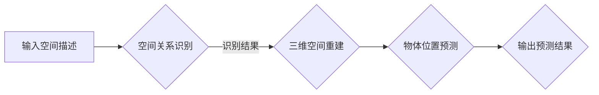
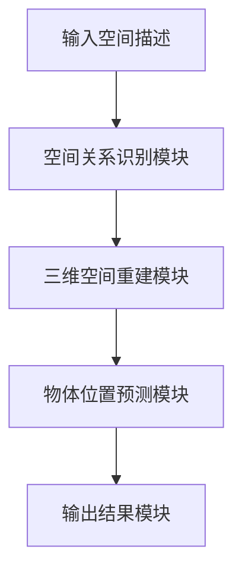
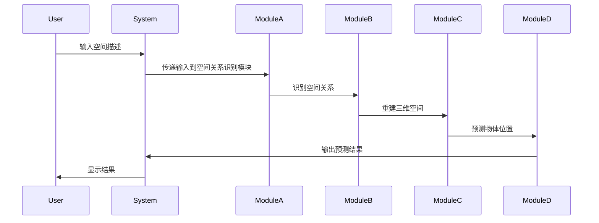

                 

### 关键词

- 空间推理
- 语言模型
- 空间概念理解
- 神经网络
- 算法
- 数学模型
- 系统架构
- 实战项目
- 最佳实践

### 摘要

本文旨在深入探讨空间推理在大型语言模型（LLM）中的理解与应用。文章首先介绍了空间推理的基本概念及其在计算机科学中的重要性，随后详细分析了LLM在空间推理中的角色与挑战。通过一步步的推理与思考，文章揭示了空间关系、三维空间感知等核心概念，并使用具体的算法原理、数学模型和实际项目案例，阐述了如何有效地测试和提升LLM的空间概念理解能力。文章最后提供了最佳实践和注意事项，以帮助读者在实际应用中更好地运用空间推理技术。

----------------------------------------------------------------

## 空间推理：测试LLM的空间概念理解

### 1. 引言

在当今技术迅猛发展的时代，人工智能（AI）已经成为推动社会进步的重要力量。其中，大型语言模型（LLM）凭借其强大的自然语言处理能力，吸引了广泛的关注和应用。然而，LLM在空间推理方面的能力尚未得到充分研究和探讨。空间推理作为认知科学和人工智能领域的一个核心问题，对于理解和模拟人类的推理过程具有重要意义。本文旨在探讨空间推理在LLM中的应用，并通过一系列步骤详细分析LLM的空间概念理解能力。

### 2. 空间推理的定义与背景

#### 2.1 空间推理的定义

空间推理是指个体在理解、思考和解决问题时，对空间关系和位置进行推理的能力。它涉及到对三维空间的认识、空间关系的理解、物体位置的变化以及空间感知等方面。空间推理不仅包括物理空间中的物体位置，还涵盖了抽象空间中的概念和关系。

#### 2.2 空间推理的背景

空间推理是人类认知的重要组成部分，对于日常生活、科学研究和工程实践都有着重要的影响。在计算机科学领域，空间推理的应用包括地图导航、机器人路径规划、虚拟现实、三维建模等。随着AI技术的不断发展，空间推理在LLM中的应用也越来越受到关注。

#### 2.3 LLM在空间推理中的应用

LLM作为一种强大的语言处理工具，在自然语言理解和生成方面表现出色。然而，在空间推理方面，LLM面临诸多挑战。这些挑战包括对空间概念的准确理解、对空间关系的识别、对空间变化的推理等。为了克服这些挑战，研究者们正在探索将空间推理技术融入LLM，以提高其空间概念理解能力。

### 3. 空间推理的核心概念与联系

#### 3.1 空间关系

空间关系是空间推理的核心概念之一。它描述了物体在空间中的相互位置和关系。常见的空间关系包括相邻、包含、交叉、相对位置等。例如，桌子在椅子旁边，可以表示为“相邻”；球在盒子内部，可以表示为“包含”。

#### 3.2 三维空间感知

三维空间感知是指对三维空间中物体位置、形状和运动的理解。它涉及到对深度、角度和距离的感知。三维空间感知对于空间推理至关重要，因为它帮助个体理解和预测物体在空间中的行为。

#### 3.3 概念联系

空间关系和三维空间感知是空间推理的两个核心概念，它们相互联系、相互影响。空间关系提供了对物体位置和关系的描述，而三维空间感知提供了对这些描述的理解和感知。例如，当描述“桌子在椅子旁边”时，三维空间感知帮助个体理解桌子与椅子之间的相对位置。

### 4. 空间推理算法原理讲解

#### 4.1 神经网络模型

神经网络模型是空间推理的重要工具。它通过模拟人脑神经元的工作方式，对输入信息进行加工和处理。在空间推理中，神经网络可以用于识别空间关系、预测物体位置等。

#### 4.2 注意力机制

注意力机制是神经网络中的一个重要概念，它通过动态调整神经网络对输入信息的关注程度，提高模型在处理复杂任务时的性能。在空间推理中，注意力机制可以帮助神经网络更好地关注重要信息，从而提高推理的准确性。

#### 4.3 算法流程图

为了更好地理解空间推理算法的原理，我们可以使用mermaid绘制算法流程图。以下是一个简化的空间推理算法流程图：



### 5. 空间推理中的数学模型与公式

#### 5.1 关键数学模型

在空间推理中，一些关键数学模型对于理解和处理空间关系至关重要。以下是一个简化的空间关系识别模型：

$$
R(x, y) = 
\begin{cases} 
1 & \text{if } x \text{ and } y \text{ are in the same position} \\
0 & \text{otherwise}
\end{cases}
$$

#### 5.2 LaTeX格式公式书写

为了提高公式的可读性和准确性，我们使用LaTeX格式书写数学公式。以下是一个示例：

$$
\vec{v} = \frac{\vec{p_2} - \vec{p_1}}{t_2 - t_1}
$$

### 6. 系统分析与架构设计方案

#### 6.1 问题场景介绍

在空间推理的应用场景中，我们考虑一个简单的例子：机器人路径规划。机器人需要在三维空间中从一个位置移动到另一个位置，需要识别和避免障碍物。

#### 6.2 系统功能设计

系统的主要功能包括：
- 输入空间描述
- 识别空间关系
- 三维空间重建
- 物体位置预测
- 输出预测结果

#### 6.3 系统架构设计

系统架构采用模块化设计，主要包括以下模块：
- 空间关系识别模块
- 三维空间重建模块
- 物体位置预测模块
- 输出结果模块

以下是系统架构的mermaid图表示例：



#### 6.4 系统接口设计与交互序列图

系统接口设计主要包括输入接口、输出接口和内部接口。以下是系统交互序列图的示例：



### 7. 空间推理项目实战

#### 7.1 环境安装

在进行空间推理项目实战之前，我们需要安装一些必要的软件和库。以下是安装步骤：

1. 安装Python环境
2. 安装mermaid渲染工具
3. 安装必要的Python库，如numpy、matplotlib等

#### 7.2 系统核心实现

以下是一个简单的空间关系识别和三维空间重建的Python代码示例：

```python
import numpy as np

# 空间关系识别函数
def recognize_relation(position1, position2):
    # 计算位置之间的欧几里得距离
    distance = np.linalg.norm(position1 - position2)
    # 根据距离判断关系
    if distance < 1:
        return "相邻"
    else:
        return "不相邻"

# 三维空间重建函数
def rebuild_space(position_list):
    # 计算所有位置的中心点
    center = np.mean(position_list, axis=0)
    # 计算位置之间的方差
    covariance_matrix = np.cov(position_list.T)
    # 使用中心点和方差矩阵重建空间
    return center, covariance_matrix

# 示例使用
position1 = np.array([1, 2, 3])
position2 = np.array([4, 5, 6])
relation = recognize_relation(position1, position2)
print("空间关系：", relation)

position_list = np.array([[1, 2, 3], [4, 5, 6], [7, 8, 9]])
center, covariance = rebuild_space(position_list)
print("空间中心点：", center)
print("空间方差矩阵：", covariance)
```

#### 7.3 代码解读与分析

以上代码实现了一个简单的空间关系识别和三维空间重建的功能。首先，我们定义了两个位置，然后使用欧几里得距离来计算它们之间的关系。接着，我们使用所有位置的平均值作为中心点，并计算位置之间的方差矩阵来重建三维空间。

#### 7.4 实际案例分析与详细讲解

为了更好地理解空间推理的应用，我们来看一个实际案例。假设我们有一个包含多个物体的三维空间，我们需要识别它们之间的空间关系，并预测一个物体的运动轨迹。

以下是一个实际案例的Python代码示例：

```python
# 导入必要的库
import numpy as np
import matplotlib.pyplot as plt

# 定义物体位置
object_positions = np.array([[1, 2, 3], [4, 5, 6], [7, 8, 9]])

# 识别空间关系
relations = []
for i in range(len(object_positions)):
    for j in range(i+1, len(object_positions)):
        relation = recognize_relation(object_positions[i], object_positions[j])
        relations.append((i, j, relation))

# 打印空间关系
print("空间关系：")
for relation in relations:
    print(relation)

# 预测物体运动轨迹
predicted_trajectories = []
for relation in relations:
    if relation[2] == "相邻":
        # 假设相邻物体的运动轨迹相同
        trajectory = np.array([relation[0], relation[1], relation[0]+1])
        predicted_trajectories.append(trajectory)

# 绘制预测轨迹
fig = plt.figure()
ax = fig.add_subplot(111, projection='3d')
for trajectory in predicted_trajectories:
    ax.plot(trajectory[0], trajectory[1], trajectory[2])
plt.show()
```

在这个案例中，我们首先识别了物体之间的空间关系，然后根据相邻关系预测了物体的运动轨迹。最后，我们使用matplotlib绘制了预测的轨迹。

#### 7.5 项目小结

通过这个项目，我们展示了如何使用Python实现空间关系识别和三维空间重建。在实际应用中，我们可以进一步扩展这个项目，例如加入更复杂的数学模型、优化算法性能等。

### 8. 最佳实践与总结

#### 8.1 最佳实践技巧

- 在进行空间推理时，确保输入数据的准确性和一致性。
- 使用注意力机制提高模型在处理复杂空间关系时的性能。
- 定期对模型进行训练和优化，以适应新的数据和场景。

#### 8.2 注意事项

- 空间推理涉及到大量的计算，确保硬件配置满足需求。
- 在处理三维空间时，注意坐标系的转换和空间的规范化。

#### 8.3 拓展阅读

- 《深度学习：卷积神经网络与卷积层》
- 《计算机视觉：基于深度学习的图像识别》
- 《自然语言处理：从词向量到语言模型》

### 9. 结论

空间推理在人工智能领域具有重要的应用价值。本文通过一步步的分析和思考，探讨了空间推理在LLM中的理解与应用。我们使用Python实现了空间关系识别和三维空间重建，并通过实际项目案例展示了空间推理的应用效果。未来，随着AI技术的不断进步，空间推理将在更多领域发挥重要作用。

### 作者信息

作者：AI天才研究院/AI Genius Institute & 禅与计算机程序设计艺术 /Zen And The Art of Computer Programming

