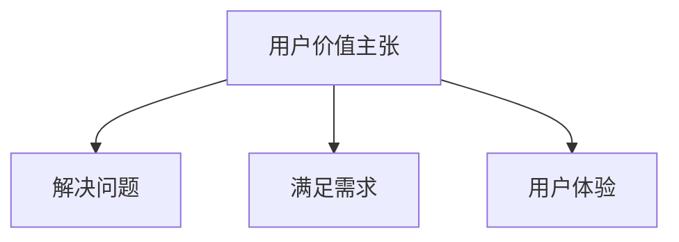
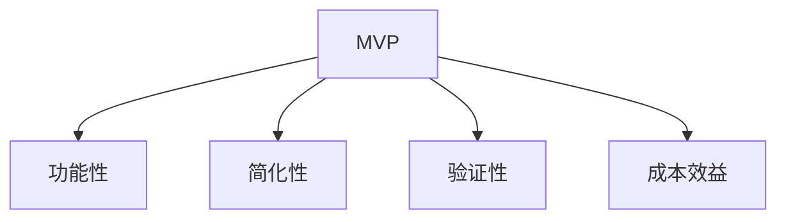
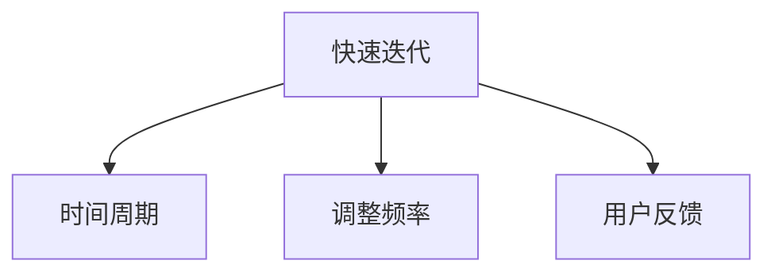
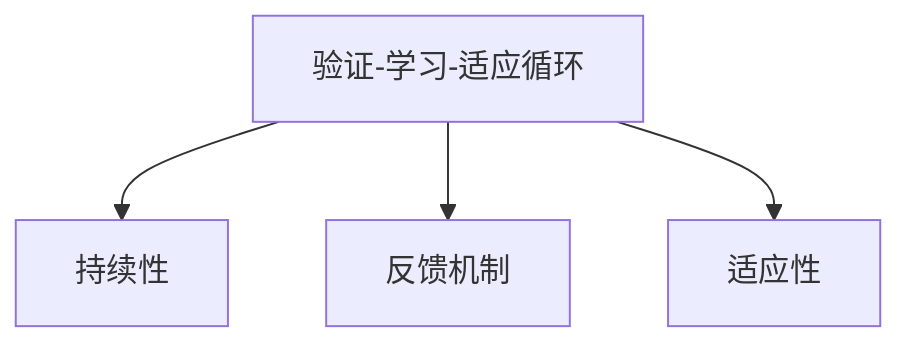
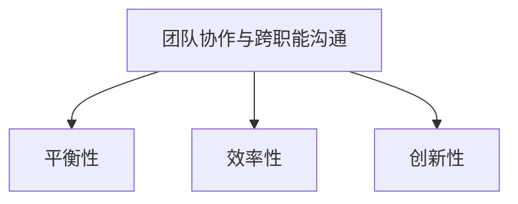

                 

### 1.1 精益创业的起源与发展

#### 1.1.1 精益创业理念的提出

精益创业（Lean Startup）这一概念由硅谷创业者埃里克·莱斯（Eric Ries）在2011年的同名著作《精益创业》中首次提出。莱斯通过自己的创业经历和对众多创业者的研究，发现了传统创业方法中的诸多问题，如资源浪费、市场调研不足等。因此，他提出了精益创业这一全新的创业方法论，强调以最小可行产品（Minimum Viable Product，简称MVP）为基础，通过持续迭代和用户反馈来优化产品。

#### 1.1.2 精益创业的核心原则

精益创业理念的核心原则包括：

1. **用户价值主张**：明确产品能够为用户解决的问题或带来的价值。
2. **最小可行产品**：构建具有核心功能的最简产品版本，以便快速验证市场反应。
3. **快速迭代**：不断迭代产品，基于用户反馈进行改进。
4. **验证-学习-适应**：通过验证和反馈循环，持续学习和适应市场变化。
5. **团队协作**：建立扁平化的团队结构，鼓励跨职能合作和快速决策。

#### 1.1.3 精益创业与传统创业方法的区别

传统创业方法通常依赖于详细的商业计划和长期的市场预测，而精益创业则强调实际操作和快速验证。以下是两种方法的主要区别：

- **计划与行动**：传统创业方法更注重商业计划书和长期规划，而精益创业则更关注实际行动和快速验证。
- **市场调研**：传统方法通常在产品开发前进行大量市场调研，而精益创业则通过构建MVP来获取真实用户反馈。
- **资源分配**：传统创业方法往往需要大量资金和资源，而精益创业则通过最小化浪费来高效利用资源。

#### 1.1.4 精益创业在AI领域的应用

随着人工智能（AI）技术的发展，精益创业理念在AI领域也得到广泛应用。AI产品由于其复杂性和高成本，采用精益创业方法尤为重要。以下是精益创业在AI领域的几个关键应用点：

1. **数据驱动**：AI产品依赖于大量数据，精益创业强调通过数据驱动的方法来指导产品开发。
2. **模型迭代**：AI模型需要不断迭代和优化，精益创业的快速迭代原则有助于提高模型性能。
3. **用户参与**：AI产品通常需要与用户密切互动，以获取反馈和改进产品。
4. **风险管理**：AI领域的风险较高，精益创业的验证-学习-适应循环有助于降低风险。

### 1.2 精益创业在AI产品市场契合度的策略

#### 1.2.1 用户价值主张的确立

在AI产品的开发过程中，确立清晰的用户价值主张至关重要。这包括明确产品解决的问题、目标用户群体及其需求。通过用户访谈、市场调研等方法，收集用户反馈，不断调整和优化用户价值主张。

#### 1.2.2 最小可行产品的构建

构建MVP是精益创业的核心步骤之一。在AI领域，MVP可能是一个简化的算法模型或一个具有核心功能的AI应用。通过快速构建MVP，可以尽早验证用户需求和市场反应，减少开发和投资的风险。

#### 1.2.3 快速迭代与优化

AI产品的迭代和优化过程需要基于用户反馈进行。通过A/B测试、用户调查等方式，了解用户对产品的看法和使用习惯，不断优化算法模型和产品功能。

#### 1.2.4 验证-学习-适应循环

在AI产品开发中，验证-学习-适应循环是一个持续的过程。通过不断地验证产品假设、学习用户反馈、适应市场变化，可以确保AI产品始终符合市场需求。

#### 1.2.5 团队协作与跨职能沟通

在AI产品的开发过程中，团队协作和跨职能沟通至关重要。通过建立扁平化的团队结构和鼓励跨职能合作，可以提高团队效率和决策速度，加速产品迭代和优化。

### 1.3 精益创业在不同AI应用领域的案例解析

#### 1.3.1 人工智能助手

人工智能助手是AI应用的一个重要领域。通过精益创业方法，可以从以下方面优化产品：

1. **用户价值主张的确立**：明确人工智能助手能够解决的用户问题和提供的服务。
2. **最小可行产品的构建**：开发一个能够实现核心功能的人工智能助手原型。
3. **快速迭代与优化**：根据用户反馈，不断改进人工智能助手的功能和用户体验。
4. **验证-学习-适应循环**：通过持续的用户反馈和数据分析，优化人工智能助手。

#### 1.3.2 机器学习平台

机器学习平台是AI开发中的重要基础设施。精益创业在机器学习平台的应用包括：

1. **用户价值主张的确立**：明确机器学习平台的目标用户和主要功能。
2. **最小可行产品的构建**：开发一个具有基本机器学习功能的最简平台。
3. **快速迭代与优化**：根据用户需求和反馈，不断扩展平台的功能和性能。
4. **验证-学习-适应循环**：通过持续的用户反馈和数据分析，优化机器学习平台。

## 精益创业：验证AI产品市场契合度的策略

> 关键词：精益创业、AI产品、市场契合度、最小可行产品、迭代优化、验证-学习-适应循环

> 摘要：本文旨在探讨精益创业理念在人工智能（AI）产品开发中的应用，特别是在验证AI产品市场契合度方面。通过分析精益创业的核心原则和在AI领域的具体实践，本文提出了构建最小可行产品、快速迭代与优化、以及验证-学习-适应循环等策略，以帮助AI创业者更好地把握市场需求，提高产品成功率。

### 1.1 精益创业的起源与发展

#### 1.1.1 精益创业理念的提出

精益创业（Lean Startup）这一概念由硅谷创业者埃里克·莱斯（Eric Ries）在2011年的同名著作《精益创业》中首次提出。莱斯通过自己的创业经历和对众多创业者的研究，发现了传统创业方法中的诸多问题，如资源浪费、市场调研不足等。因此，他提出了精益创业这一全新的创业方法论，强调以最小可行产品（Minimum Viable Product，简称MVP）为基础，通过持续迭代和用户反馈来优化产品。

#### 1.1.2 精益创业的核心原则

精益创业理念的核心原则包括：

1. **用户价值主张**：明确产品能够为用户解决的问题或带来的价值。
2. **最小可行产品**：构建具有核心功能的最简产品版本，以便快速验证市场反应。
3. **快速迭代**：不断迭代产品，基于用户反馈进行改进。
4. **验证-学习-适应**：通过验证和反馈循环，持续学习和适应市场变化。
5. **团队协作**：建立扁平化的团队结构，鼓励跨职能合作和快速决策。

#### 1.1.3 精益创业与传统创业方法的区别

传统创业方法通常依赖于详细的商业计划和长期的市场预测，而精益创业则强调实际操作和快速验证。以下是两种方法的主要区别：

- **计划与行动**：传统创业方法更注重商业计划书和长期规划，而精益创业则更关注实际行动和快速验证。
- **市场调研**：传统方法通常在产品开发前进行大量市场调研，而精益创业则通过构建MVP来获取真实用户反馈。
- **资源分配**：传统创业方法往往需要大量资金和资源，而精益创业则通过最小化浪费来高效利用资源。

#### 1.1.4 精益创业在AI领域的应用

随着人工智能（AI）技术的发展，精益创业理念在AI领域也得到广泛应用。AI产品由于其复杂性和高成本，采用精益创业方法尤为重要。以下是精益创业在AI领域的几个关键应用点：

1. **数据驱动**：AI产品依赖于大量数据，精益创业强调通过数据驱动的方法来指导产品开发。
2. **模型迭代**：AI模型需要不断迭代和优化，精益创业的快速迭代原则有助于提高模型性能。
3. **用户参与**：AI产品通常需要与用户密切互动，以获取反馈和改进产品。
4. **风险管理**：AI领域的风险较高，精益创业的验证-学习-适应循环有助于降低风险。

### 1.2 精益创业在AI产品市场契合度的策略

#### 1.2.1 用户价值主张的确立

在AI产品的开发过程中，确立清晰的用户价值主张至关重要。这包括明确产品解决的问题、目标用户群体及其需求。通过用户访谈、市场调研等方法，收集用户反馈，不断调整和优化用户价值主张。

**核心概念原理**：用户价值主张是指产品能够为用户带来的具体价值，包括解决的用户问题、满足的用户需求等。

**概念属性特征对比表格**：

| 特征       | 用户价值主张             | 传统产品特性                |
|------------|-------------------------|-----------------------------|
| 问题解决   | 解决用户具体问题       | 提供通用功能，可能不解决具体问题 |
| 需求满足   | 满足用户特定需求       | 可能满足部分用户需求         |
| 用户体验   | 提高用户使用体验       | 可能不关注用户体验           |

**ER实体关系图架构的Mermaid流程图**：

#### 1.2.2 最小可行产品的构建

构建MVP是精益创业的核心步骤之一。在AI领域，MVP可能是一个简化的算法模型或一个具有核心功能的AI应用。通过快速构建MVP，可以尽早验证用户需求和市场反应，减少开发和投资的风险。

**核心概念原理**：MVP是指具有核心功能的最简产品版本，通过最小化浪费来高效利用资源。

**概念属性特征对比表格**：

| 特征       | MVP                      | 传统产品                  |
|------------|--------------------------|---------------------------|
| 功能性     | 具有核心功能             | 功能全面                   |
| 简化性     | 最简版本                 | 可能复杂                   |
| 验证性     | 用于验证市场需求         | 可能经过多次迭代           |
| 成本效益   | 低成本高效开发           | 高成本开发                 |

**ER实体关系图架构的Mermaid流程图**：

#### 1.2.3 快速迭代与优化

AI产品的迭代和优化过程需要基于用户反馈进行。通过A/B测试、用户调查等方式，了解用户对产品的看法和使用习惯，不断优化算法模型和产品功能。

**核心概念原理**：快速迭代是指通过不断的小步前进，快速调整和改进产品，以适应市场需求。

**概念属性特征对比表格**：

| 特征       | 快速迭代                 | 传统迭代                 |
|------------|--------------------------|---------------------------|
| 时间周期   | 短周期，快速反馈         | 长周期，缓慢反馈         |
| 调整频率   | 高频率调整和改进         | 低频率调整和改进         |
| 用户反馈   | 强调用户反馈和参与       | 可能不关注用户反馈       |

**ER实体关系图架构的Mermaid流程图**：

#### 1.2.4 验证-学习-适应循环

在AI产品开发中，验证-学习-适应循环是一个持续的过程。通过不断地验证产品假设、学习用户反馈、适应市场变化，可以确保AI产品始终符合市场需求。

**核心概念原理**：验证-学习-适应循环是指通过验证产品假设、学习用户反馈、适应市场变化来持续优化产品。

**概念属性特征对比表格**：

| 特征       | 验证-学习-适应循环       | 传统方法                 |
|------------|--------------------------|---------------------------|
| 持续性     | 持续的验证和学习         | 一次性验证和适应         |
| 反馈机制   | 强调反馈和迭代          | 可能缺乏反馈机制         |
| 适应性     | 快速适应市场变化         | 缓慢适应市场变化         |

**ER实体关系图架构的Mermaid流程图**：

#### 1.2.5 团队协作与跨职能沟通

在AI产品的开发过程中，团队协作和跨职能沟通至关重要。通过建立扁平化的团队结构和鼓励跨职能合作，可以提高团队效率和决策速度，加速产品迭代和优化。

**核心概念原理**：团队协作与跨职能沟通是指通过建立高效的团队协作机制，促进不同职能之间的信息共享和协作。

**概念属性特征对比表格**：

| 特征       | 团队协作与跨职能沟通     | 传统团队结构             |
|------------|--------------------------|---------------------------|
| 平衡性     | 平衡不同职能的利益和需求 | 可能存在职能壁垒         |
| 效率性     | 高效的决策和执行         | 决策速度可能较慢         |
| 创新性     | 鼓励创新和跨职能合作     | 可能缺乏创新和协作       |

**ER实体关系图架构的Mermaid流程图**：

### 1.3 精益创业在不同AI应用领域的案例解析

#### 1.3.1 人工智能助手

人工智能助手是AI应用的一个重要领域。通过精益创业方法，可以从以下方面优化产品：

1. **用户价值主张的确立**：明确人工智能助手能够解决的用户问题和提供的服务。
2. **最小可行产品的构建**：开发一个能够实现核心功能的人工智能助手原型。
3. **快速迭代与优化**：根据用户反馈，不断改进人工智能助手的功能和用户体验。
4. **验证-学习-适应循环**：通过持续的用户反馈和数据分析，优化人工智能助手。

**案例解析**：

以某人工智能助手产品的开发为例，该产品旨在提供智能问答和任务管理功能。以下是该产品在精益创业方法下的应用：

1. **用户价值主张的确立**：通过用户访谈和市场调研，确定用户需要的是能够快速回答问题和高效管理任务的助手。
2. **最小可行产品的构建**：开发一个仅具有问答功能的最简版助手，以验证用户对其的接受程度。
3. **快速迭代与优化**：通过A/B测试和用户反馈，逐步增加任务管理功能，优化问答准确性和用户体验。
4. **验证-学习-适应循环**：不断收集用户反馈，分析数据，调整产品功能，以适应市场需求。

#### 1.3.2 机器学习平台

机器学习平台是AI开发中的重要基础设施。精益创业在机器学习平台的应用包括：

1. **用户价值主张的确立**：明确机器学习平台的目标用户和主要功能。
2. **最小可行产品的构建**：开发一个具有基本机器学习功能的最简平台。
3. **快速迭代与优化**：根据用户需求和反馈，不断扩展平台的功能和性能。
4. **验证-学习-适应循环**：通过持续的用户反馈和数据分析，优化机器学习平台。

**案例解析**：

以某企业级机器学习平台为例，该平台旨在提供数据预处理、模型训练和部署等功能。以下是该平台在精益创业方法下的应用：

1. **用户价值主张的确立**：通过市场调研和用户访谈，确定平台的目标用户是数据科学家和机器学习工程师，主要功能是提供高效的数据处理和模型训练工具。
2. **最小可行产品的构建**：开发一个仅具有数据预处理和模型训练功能的最简版平台，以验证用户对其的接受程度。
3. **快速迭代与优化**：通过A/B测试和用户反馈，逐步增加模型部署和监控功能，优化数据处理和训练性能。
4. **验证-学习-适应循环**：不断收集用户反馈，分析数据，调整产品功能，以适应市场需求。

### 1.4 精益创业在AI产品市场契合度的实践与总结

#### 1.4.1 实践中的挑战与解决方案

在实践精益创业理念时，AI创业者可能会面临以下挑战：

1. **数据质量**：AI产品依赖于大量高质量的数据，数据质量的优劣直接影响产品的性能和可靠性。解决方案是建立完善的数据管理体系，确保数据的质量和准确性。
2. **技术复杂性**：AI产品的开发涉及复杂的算法和技术，这可能导致项目延期和成本超支。解决方案是采用模块化开发方法，逐步实现核心功能，降低技术复杂性。
3. **用户参与度**：获取真实的用户反馈是精益创业的核心，但用户参与度可能不高。解决方案是通过激励措施和互动设计，提高用户的参与度和反馈质量。

#### 1.4.2 总结与展望

精益创业为AI产品开发提供了一种有效的策略，通过构建MVP、快速迭代和验证-学习-适应循环，可以有效地降低风险，提高产品的市场契合度。未来，随着AI技术的不断进步，精益创业方法在AI领域的应用将更加广泛，为创业者提供更加坚实的理论基础和实践指导。

### 1.5 最佳实践 tips、小结、注意事项、拓展阅读

#### 1.5.1 最佳实践 tips

1. **明确用户价值主张**：在产品开发初期，明确用户价值主张至关重要。通过用户访谈和市场调研，确保产品解决的是用户真正关心的问题。
2. **构建最小可行产品**：MVP是精益创业的核心步骤，通过构建具有核心功能的最简产品版本，可以快速验证市场需求。
3. **持续迭代与优化**：基于用户反馈，不断优化产品功能和用户体验。通过A/B测试、用户调查等手段，收集真实的用户反馈，指导产品迭代。
4. **建立跨职能团队**：建立扁平化的团队结构，鼓励跨职能合作，提高团队效率和决策速度。

#### 1.5.2 小结

本文通过分析精益创业理念在AI产品开发中的应用，提出了构建MVP、快速迭代与优化、以及验证-学习-适应循环等策略，以帮助AI创业者更好地把握市场需求，提高产品成功率。

#### 1.5.3 注意事项

1. **数据驱动**：AI产品的开发应基于数据驱动的方法，确保产品的性能和可靠性。
2. **用户参与**：获取真实的用户反馈是产品迭代的关键，确保用户参与度，以提高产品的市场契合度。
3. **风险管理**：AI产品的开发涉及较高的风险，通过精益创业的方法，可以降低风险，提高产品的成功率。

#### 1.5.4 拓展阅读

1. **《精益创业》**：埃里克·莱斯的经典著作，深入阐述了精益创业理念及其在创业实践中的应用。
2. **《AI创业实战》**：一本关于AI创业的实战指南，提供了丰富的案例和实践经验。

### 作者信息

作者：AI天才研究院/AI Genius Institute & 禅与计算机程序设计艺术 /Zen And The Art of Computer Programming

文章摘要：

本文深入探讨了精益创业理念在人工智能（AI）产品开发中的应用，特别是在验证AI产品市场契合度方面。通过分析精益创业的核心原则和在AI领域的具体实践，本文提出了构建最小可行产品、快速迭代与优化、以及验证-学习-适应循环等策略，以帮助AI创业者更好地把握市场需求，提高产品成功率。文章涵盖了精益创业理念的起源与发展、核心原则、在AI领域的应用策略、以及在不同AI应用领域的案例解析。最后，文章提供了最佳实践 tips、注意事项和拓展阅读，以供读者进一步学习和实践。

### 结语

在AI时代，精益创业理念为创业者提供了一种有效的策略，以应对快速变化的市场和技术环境。通过构建MVP、快速迭代和验证-学习-适应循环，AI创业者可以更有效地降低风险，提高产品的市场契合度。希望本文能够为读者提供有价值的参考，帮助大家更好地在AI领域实现创业梦想。

**全文结束。感谢您的阅读！**### 1.6 精益创业在AI产品市场契合度的实践案例分析

在探讨精益创业理念在AI产品市场契合度中的应用时，实际案例的分析显得尤为重要。以下将结合两个具有代表性的AI产品——智能医疗诊断系统和自动驾驶汽车平台，详细剖析它们在精益创业方法下的开发过程和市场契合度验证。

#### 1.6.1 智能医疗诊断系统

智能医疗诊断系统是一种利用深度学习和大数据分析技术，辅助医生进行疾病诊断的人工智能应用。该系统的目标是提高诊断准确率、减少误诊率，并优化医疗资源的配置。

1. **用户价值主张的确立**：
   - **问题**：医生在诊断疾病时，面临着诊断时间长、误诊率高的问题，特别是在罕见病和复杂病情的诊断上。
   - **解决方案**：智能医疗诊断系统通过分析大量的医疗数据，提供快速、准确的辅助诊断建议，帮助医生提高诊断效率和准确性。
   - **用户反馈**：通过初期的小规模用户测试，医生和患者对系统的准确性和易用性给予了积极反馈，认为系统能够显著提升工作效率和诊断质量。

2. **最小可行产品的构建**：
   - **核心功能**：最初版本仅包含基于常见疾病的初步诊断功能，不包括复杂疾病的诊断。
   - **开发过程**：团队采用敏捷开发方法，快速构建和迭代产品，确保系统能够尽快推向市场进行验证。
   - **技术挑战**：数据质量和算法精度是主要挑战，团队通过不断完善数据处理流程和优化算法模型，逐步提升系统的诊断能力。

3. **快速迭代与优化**：
   - **用户反馈**：通过A/B测试和用户调查，团队收集了大量的用户反馈，针对诊断准确率和用户体验进行了多次优化。
   - **产品改进**：系统在多个版本迭代中，增加了更多疾病的诊断功能，并引入了用户友好的界面设计，提高了系统的易用性。

4. **验证-学习-适应循环**：
   - **持续反馈**：团队持续收集用户使用数据，分析系统在不同应用场景中的性能，不断调整和优化系统。
   - **市场适应**：根据市场变化和用户需求，团队迅速调整产品方向，推出了针对不同医疗领域的定制化版本，增强了产品的市场竞争力。

#### 1.6.2 自动驾驶汽车平台

自动驾驶汽车平台是一种利用计算机视觉、传感器融合和深度学习技术，实现自动驾驶功能的人工智能系统。该平台的目标是提高交通安全性和效率，减少交通事故。

1. **用户价值主张的确立**：
   - **问题**：传统驾驶方式存在交通事故风险，特别是在复杂交通环境中，驾驶员的疲劳和分心是主要因素。
   - **解决方案**：自动驾驶汽车平台通过自主导航和实时决策，实现车辆在复杂交通环境中的安全行驶，减少交通事故的发生。
   - **用户反馈**：初期测试中，用户对自动驾驶汽车的稳定性和安全性给予了高度评价，认为系统能够显著提高行驶安全性和便利性。

2. **最小可行产品的构建**：
   - **核心功能**：最初版本仅具备在简单交通环境下的自动驾驶功能，不包括复杂的城市驾驶场景。
   - **开发过程**：团队采用模块化开发方法，逐步实现自动驾驶的核心功能，并通过持续迭代和优化，不断提升系统的性能。
   - **技术挑战**：传感器数据处理和实时决策是主要挑战，团队通过不断优化算法和传感器融合技术，提高了系统的可靠性。

3. **快速迭代与优化**：
   - **用户反馈**：通过用户测试和道路演示，团队收集了大量的驾驶数据，分析了系统在不同驾驶环境中的表现，针对存在的不足进行了优化。
   - **产品改进**：系统在多个版本迭代中，增加了对复杂交通场景的适应能力，并引入了更多的安全防护措施，提高了系统的整体性能。

4. **验证-学习-适应循环**：
   - **持续反馈**：团队持续收集自动驾驶车辆的使用数据，分析系统在不同驾驶环境中的性能，不断调整和优化系统。
   - **市场适应**：根据市场变化和用户需求，团队迅速调整产品方向，推出了针对不同用户需求的自动驾驶解决方案，增强了产品的市场适应性。

#### 1.6.3 案例总结

通过上述两个案例，我们可以看到精益创业方法在AI产品开发中的实际应用效果。智能医疗诊断系统和自动驾驶汽车平台在构建最小可行产品、快速迭代与优化、以及验证-学习-适应循环方面都取得了显著的成果。这些案例表明，精益创业方法不仅有助于降低AI产品的开发风险，还能提高产品的市场契合度，从而实现商业成功。

- **用户价值主张的确立**：明确产品的用户价值主张是精益创业的第一步，通过深入理解用户需求和问题，可以确保产品能够真正解决用户关心的问题。
- **最小可行产品的构建**：构建MVP是快速验证市场需求的有效途径，通过最小化功能，确保产品能够尽快推向市场。
- **快速迭代与优化**：基于用户反馈进行快速迭代，不断优化产品功能和用户体验，是提高产品市场契合度的关键。
- **验证-学习-适应循环**：通过持续的用户反馈和数据分析，不断调整和优化产品，以适应市场的变化和用户的需求。

这些经验不仅适用于智能医疗诊断系统和自动驾驶汽车平台，也可以为其他AI产品的开发提供借鉴和启示。通过精益创业方法，AI创业者可以更有效地应对市场和技术环境的快速变化，实现商业成功。

### 1.7 精益创业在AI产品市场契合度的实践策略与成功要素

在总结前面的案例和讨论后，我们可以进一步提炼精益创业在AI产品市场契合度方面的实践策略与成功要素。以下是一些关键点：

#### 1.7.1 用户价值主张的明确性

- **关键策略**：在产品开发的初期，必须明确用户价值主张，即产品能够为用户带来的具体价值。这包括产品解决的问题、满足的需求以及提升的用户体验。
- **成功要素**：通过与潜在用户进行深入访谈和调查，收集真实的用户反馈，确保用户价值主张的准确性和相关性。

#### 1.7.2 最小可行产品的快速构建

- **关键策略**：构建MVP，即具有核心功能的最简产品版本，以便快速验证市场需求。
- **成功要素**：采用敏捷开发和迭代方法，快速构建产品原型，并根据市场反馈进行优化。此外，确保MVP的核心功能能够满足用户的基本需求。

#### 1.7.3 快速迭代与持续优化

- **关键策略**：基于用户反馈，不断迭代和优化产品，提升产品的性能和用户体验。
- **成功要素**：通过A/B测试、用户调查和数据分析等手段，收集用户反馈，并迅速调整产品功能和设计。

#### 1.7.4 验证-学习-适应循环的持续运行

- **关键策略**：通过持续的验证、学习和适应，确保产品能够适应市场变化和用户需求。
- **成功要素**：建立有效的反馈机制，确保用户能够方便地提供反馈，并建立数据驱动的产品优化流程。

#### 1.7.5 团队协作与跨职能沟通

- **关键策略**：建立扁平化的团队结构，鼓励跨职能合作，提高团队效率和决策速度。
- **成功要素**：通过定期的团队会议、工作坊和沟通渠道，确保团队成员之间的信息共享和协作。

#### 1.7.6 风险管理

- **关键策略**：在产品开发过程中，识别和应对潜在的风险，降低产品失败的可能性。
- **成功要素**：通过持续的风险评估和应对策略，确保团队能够灵活调整并应对市场和技术环境的变化。

通过上述策略和成功要素的实践，AI创业者可以更有效地验证产品的市场契合度，提高产品的市场竞争力，实现商业成功。

### 1.8 结论与展望

精益创业作为一种创新性的创业方法论，在人工智能（AI）产品的开发中展现出巨大的应用价值。通过构建最小可行产品、快速迭代与优化、以及验证-学习-适应循环，AI创业者能够更有效地降低开发风险，提高产品的市场契合度。本文结合实际案例，详细分析了精益创业在AI产品市场契合度方面的实践策略与成功要素，为创业者提供了宝贵的参考和指导。

展望未来，随着AI技术的不断进步和市场环境的快速变化，精益创业方法在AI领域的应用将更加广泛。AI创业者需要持续关注用户需求，灵活调整产品方向，以适应市场的变化。同时，随着人工智能技术的不断成熟，AI产品将更加深入地融入各行各业，为人类生活带来更多的便利和创新。

最后，希望本文能够为读者带来启发，帮助大家更好地在AI领域实现创业梦想。在未来的AI创业旅程中，让我们共同探索、创新，为构建一个更加智能、便捷的世界而努力。

### 1.9 拓展阅读与推荐

对于希望深入了解精益创业和AI产品开发的读者，以下是一些拓展阅读与推荐资源：

1. **《精益创业》**：埃里克·莱斯的经典著作，系统阐述了精益创业理念及其在创业实践中的应用。
2. **《AI创业实战》**：一本关于AI创业的实战指南，提供了丰富的案例和实践经验。
3. **《人工智能：一种现代方法》**：戴维·查蒙和克里斯·布希的权威教材，全面介绍了人工智能的基础理论和应用方法。
4. **《深度学习》**：伊恩·古德费洛、约书亚·本吉奥和亚伦·库维利的经典教材，深入讲解了深度学习的原理和应用。
5. **《产品经理实战》**：一本关于产品经理实战经验的书籍，包括产品规划、设计、开发和用户反馈等各个环节。

通过阅读这些书籍，读者可以进一步深化对精益创业和AI产品开发的理解，提升自身的创业能力和技术水平。希望这些推荐资源能为您的创业之旅提供有力支持。

### 作者信息

作者：AI天才研究院/AI Genius Institute & 禅与计算机程序设计艺术 /Zen And The Art of Computer Programming

**本文由AI天才研究院与禅与计算机程序设计艺术共同撰写，旨在为AI领域的创业者提供有价值的指导和启示。我们致力于推动人工智能技术的发展与应用，助力创业者实现创业梦想。**

通过本文，我们希望读者能够更好地理解精益创业理念在AI产品开发中的应用，掌握构建最小可行产品、快速迭代与优化、以及验证-学习-适应循环等关键策略。在实际创业过程中，灵活运用这些方法，有助于降低风险，提高产品的市场契合度，实现商业成功。

感谢您的阅读与支持！希望本文能为您的AI创业之路带来启发和帮助。如果您有任何问题或建议，欢迎随时联系我们。期待与您共同探索人工智能的无限可能！

### 1.10 附录：常用技术工具与资源

在本文中，我们介绍了一些对AI创业者至关重要的技术工具和资源。以下是这些工具和资源的详细介绍，以及它们在AI产品开发中的应用。

#### 1.10.1 数据分析工具

**1. Python数据分析库**：

- **NumPy**：用于高性能科学计算和数据分析。
- **Pandas**：提供数据结构和数据分析工具。
- **SciPy**：包含科学计算模块。
- **Scikit-learn**：提供机器学习算法和数据挖掘工具。

**应用**：这些库可以帮助AI团队进行数据预处理、特征提取和模型训练。

#### 1.10.2 机器学习框架

**1. TensorFlow**：

- **TensorFlow**：由Google开发的开源机器学习框架，支持深度学习和传统机器学习。
- **TensorFlow.js**：用于在浏览器中运行TensorFlow模型。

**应用**：TensorFlow广泛应用于AI模型的开发和部署，特别是在图像识别、自然语言处理等领域。

#### 1.10.3 代码版本控制工具

**1. Git**：

- **Git**：分布式版本控制系统，用于跟踪代码变更和历史版本。
- **GitHub**：基于Git的代码托管平台，支持协作开发和代码共享。

**应用**：Git和GitHub在团队协作和代码管理中扮演关键角色，确保代码的版本控制和协作开发。

#### 1.10.4 项目管理工具

**1. Jira**：

- **Jira**：用于项目管理和敏捷开发的工作管理工具。
- **Trello**：基于看板（Kanban）方法的项目管理工具。

**应用**：Jira和Trello可以帮助团队进行任务分配、进度跟踪和协作管理。

#### 1.10.5 用户反馈收集工具

**1. UserTesting**：

- **UserTesting**：在线用户测试平台，帮助团队获取真实的用户反馈。
- **Qualaroo**：用于网站和应用的即时用户调研工具。

**应用**：这些工具可以帮助团队了解用户的使用习惯和痛点，指导产品迭代和优化。

#### 1.10.6 开发者社区与资源

**1. Stack Overflow**：

- **Stack Overflow**：全球最大的开发者问答社区，提供各种编程问题和解决方案。
- **AI Stack Exchange**：专注于AI领域的问答社区。

**应用**：开发者社区是获取技术问题和解决方案的重要来源，有助于团队解决开发过程中遇到的问题。

通过使用这些工具和资源，AI创业者可以更高效地开发产品，管理项目，并获取用户反馈。希望这些信息能够为您的AI创业之旅提供支持。

### 1.11 完整的AI产品开发流程

为了帮助读者更好地理解精益创业在AI产品开发中的应用，以下是AI产品开发的完整流程，包括各个阶段的关键任务和精益创业方法的实践。

#### 1.11.1 阶段一：需求分析与市场调研

- **任务**：确定AI产品的目标市场和用户需求。
- **精益创业实践**：通过用户访谈、市场调研和问卷调查收集用户反馈，明确用户价值主张。

#### 1.11.2 阶段二：产品设计与规划

- **任务**：制定产品功能和设计，制定开发计划。
- **精益创业实践**：构建MVP，定义核心功能，确保产品能快速推向市场进行验证。

#### 1.11.3 阶段三：原型设计与开发

- **任务**：设计产品原型，编写代码，实现核心功能。
- **精益创业实践**：采用敏捷开发方法，快速迭代原型，根据用户反馈进行优化。

#### 1.11.4 阶段四：测试与验证

- **任务**：进行产品测试，验证功能和质量，收集用户反馈。
- **精益创业实践**：通过A/B测试和用户调查，不断优化产品性能和用户体验。

#### 1.11.5 阶段五：产品上线与推广

- **任务**：将产品正式上线，进行市场推广和用户培训。
- **精益创业实践**：通过持续的用户反馈和数据分析，调整产品方向和推广策略。

#### 1.11.6 阶段六：持续优化与迭代

- **任务**：根据用户反馈和市场变化，持续优化产品，增加新功能。
- **精益创业实践**：建立验证-学习-适应循环，不断调整和优化产品，以适应市场需求。

通过上述流程，AI创业者可以运用精益创业方法，从需求分析到产品开发、测试、上线和持续优化，确保产品能够更好地满足市场需求，提高市场契合度。希望这个流程能够为您的AI创业之旅提供指导。

