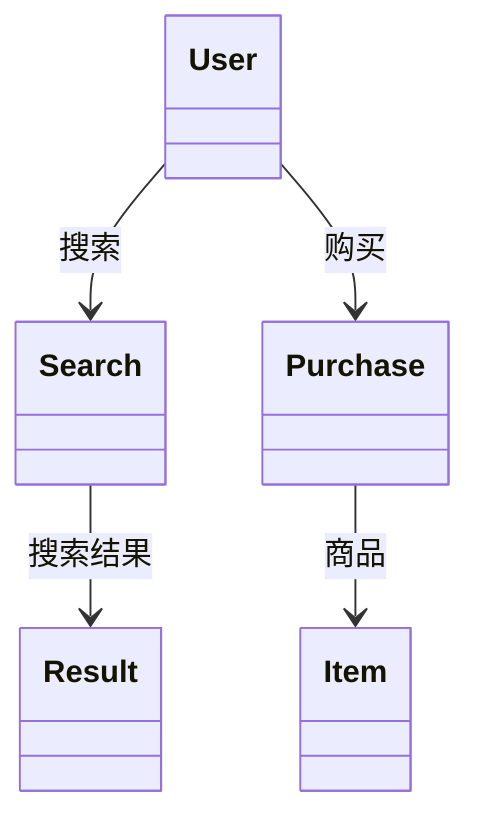
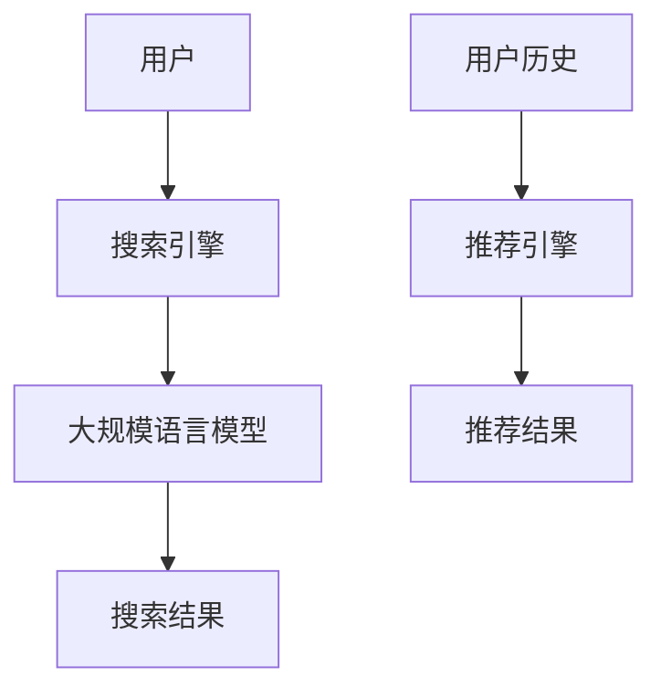
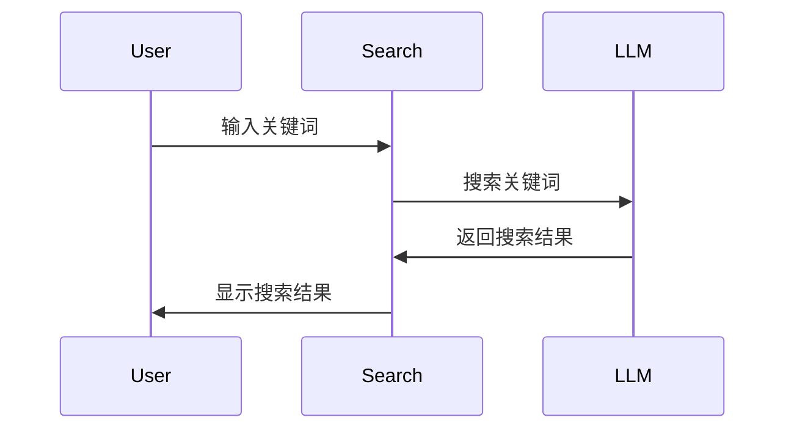

                 

### 精确度与召回率平衡：检验LLM在信息检索中的全面性

> 关键词：精确度，召回率，平衡，信息检索，LLM

> 摘要：本文深入探讨了在信息检索领域中，如何平衡精确度和召回率，特别是在大规模语言模型（LLM）的应用背景下。通过定义精确度和召回率、分析其概念原理和属性特征，以及阐述LLM在此背景下的工作原理和数学模型，本文旨在为开发者提供一套系统的、可操作性的指导，以便在设计和优化信息检索系统时，实现精确度和召回率的最佳平衡。

---

## 第一部分：背景介绍

### 1.1 问题背景

#### 1.1.1 精确度与召回率的重要性

在信息检索领域，精确度（Precision）和召回率（Recall）是两个至关重要的评估指标。

- **精确度**：它指的是检索到的相关结果占总检索结果的比例。高精确度意味着用户从检索结果中找到的相关信息越多，检索结果的质量越高。
- **召回率**：它指的是检索到的相关结果占所有相关结果的比率。高召回率意味着系统遗漏的相关信息越少，即检索结果的全覆盖性越强。

#### 1.1.2 精确度与召回率的平衡问题

在实际应用中，精确度和召回率往往难以同时达到最优。通常，提高精确度会降低召回率，反之亦然。这种权衡关系为信息检索系统的设计带来了挑战。

### 1.2 问题描述

#### 1.2.1 LLoyd's α准则

LLoyd's α准则是一种经典的平衡精确度和召回率的准则，通过调整α值来平衡这两个指标。

- **α值**：它是一个介于0到1之间的参数，用来调整精确度和召回率的相对重要性。当α值接近0时，系统更倾向于精确度；当α值接近1时，系统更倾向于召回率。

#### 1.2.2 选择合适的α值

在实际应用中，选择合适的α值以满足特定需求是一个关键问题。这涉及到对用户需求的理解、对数据质量的评估以及对系统性能的优化。

### 1.3 问题解决

#### 1.3.1 α值选择策略

- **启发式方法**：基于统计数据和用户反馈的启发式方法，如预设α值、用户评分调整等。
- **机器学习方法**：使用回归模型或其他机器学习算法预测最佳α值。

#### 1.3.2 算法设计

在设计信息检索系统时，需要考虑以下因素：

- **数据源**：数据源的质量和数量直接影响精确度和召回率。
- **检索算法**：不同的检索算法对精确度和召回率的影响不同。
- **用户交互**：用户交互设计，如搜索建议、相关度排序等，也会影响精确度和召回率。

### 1.4 边界与外延

#### 1.4.1 精确度与召回率在不同应用场景中的权衡

- **搜索引擎**：精确度通常更为重要，因为用户希望快速找到最相关的信息。
- **推荐系统**：召回率可能更为重要，因为系统需要尽可能多地推荐可能相关的项目。

#### 1.4.2 概念结构与核心要素组成

- **精确度与召回率的数学模型**：
  - 精确度：$$Precision = \frac{TP}{TP+FP}$$
  - 召回率：$$Recall = \frac{TP}{TP+FN}$$
- **平衡策略**：通过调整α值实现精确度与召回率的平衡。

### 1.5 本章小结

本章介绍了精确度与召回率的概念、问题背景、解决策略以及在不同应用场景中的权衡。接下来，我们将深入探讨精确度与召回率的定义、属性特征，以及LLM在信息检索中的工作原理。

---

## 第二部分：核心概念与联系

### 2.1 精确度与召回率的概念原理

#### 2.1.1 精确度的定义

精确度是指检索结果中的相关结果占总检索结果的比例。公式为：
$$Precision = \frac{TP}{TP + FP}$$
其中，TP表示真正例（True Positive），FP表示假正例（False Positive）。

#### 2.1.2 召回率的定义

召回率是指检索结果中的相关结果占所有相关结果的比例。公式为：
$$Recall = \frac{TP}{TP + FN}$$
其中，FN表示假反例（False Negative）。

### 2.2 概念属性特征对比表格

| 特征         | 精确度                   | 召回率                  |
| ------------ | ------------------------ | ----------------------- |
| 定义         | 检索到的相关结果比例     | 所有相关结果比例        |
| 适用场景     | 决策支持系统              | 信息检索系统            |
| 优点         | 结果准确，用户满意度高   | 检索结果全面，用户满意度高 |
| 缺点         | 降低召回率，漏掉部分相关结果 | 提高召回率，可能导致误报 |

### 2.3 ER实体关系图架构

```mermaid
erDiagram
    User ||--|{ Query }||>
    Query ||--|{ Result }||>
    Result ||--|{ Entity }||>
```

### 2.4 本章小结

本章详细介绍了精确度与召回率的定义、属性特征以及实体关系图架构，为后续内容打下了基础。在接下来的部分，我们将深入探讨如何通过算法实现精确度与召回率的平衡。

---

## 第三部分：算法原理讲解

### 3.1 基本算法原理

#### 3.1.1 α值平衡算法

LLoyd's α准则通过调整α值实现精确度与召回率的平衡。其基本原理如下：

1. **数据收集**：收集大量测试数据，用于训练和验证。
2. **计算精确度和召回率**：对于每个α值，计算对应的精确度和召回率。
3. **选择最佳α值**：通过比较不同α值下的精确度和召回率，选择能够满足需求的最佳α值。

#### 3.1.2 交叉验证方法

交叉验证方法是一种常用的评估算法性能的方法，其步骤如下：

1. **数据划分**：将数据集划分为训练集和验证集。
2. **模型训练**：使用训练集训练模型。
3. **模型验证**：使用验证集验证模型性能，并调整α值。
4. **重复多次**：多次重复上述步骤，计算平均精确度和召回率，以确保算法的鲁棒性。

### 3.2 数学模型与公式

#### 3.2.1 精确度公式

$$Precision = \frac{TP}{TP + FP}$$

其中，TP表示真正例，FP表示假正例。

#### 3.2.2 召回率公式

$$Recall = \frac{TP}{TP + FN}$$

其中，FN表示假反例。

#### 3.2.3 α值平衡公式

$$α = \frac{Recall}{Precision + Recall - 1}$$

### 3.3 Python代码实现

以下是一个简单的Python代码示例，用于计算精确度和召回率，并选择最佳α值。

```python
from sklearn.metrics import precision_score, recall_score

def calculate_precision_recall(y_true, y_pred):
    precision = precision_score(y_true, y_pred)
    recall = recall_score(y_true, y_pred)
    return precision, recall

def select_best_alpha(y_true, y_pred):
    best_alpha = 0
    best_precision = 0
    best_recall = 0
    
    for alpha in range(0, 1, 0.1):
        precision = precision_score(y_true, y_pred)
        recall = recall_score(y_true, y_pred)
        
        alpha_precision_recall = alpha / (precision + recall - 1)
        
        if alpha_precision_recall > best_alpha:
            best_alpha = alpha_precision_recall
            best_precision = precision
            best_recall = recall
            
    return best_alpha, best_precision, best_recall

# 示例数据
y_true = [0, 1, 1, 0, 1]
y_pred = [0, 1, 0, 0, 1]

# 计算精确度和召回率
precision, recall = calculate_precision_recall(y_true, y_pred)

# 选择最佳α值
best_alpha, best_precision, best_recall = select_best_alpha(y_true, y_pred)

print(f"Precision: {precision}")
print(f"Recall: {recall}")
print(f"Best Alpha: {best_alpha}")
print(f"Best Precision: {best_precision}")
print(f"Best Recall: {best_recall}")
```

### 3.4 本章小结

本章介绍了精确度与召回率的数学模型、α值平衡算法以及Python代码实现。通过这些算法和模型，我们可以更好地平衡精确度和召回率，优化信息检索系统的性能。

---

## 第四部分：系统分析与架构设计方案

### 4.1 问题场景介绍

在电子商务平台上，用户经常需要搜索商品。为了提供更优质的搜索体验，平台需要设计一个高效、准确的信息检索系统，以平衡精确度和召回率。

### 4.2 项目介绍

本项目旨在设计一个基于大规模语言模型（LLM）的信息检索系统，以实现高精确度和召回率的平衡。

### 4.3 系统功能设计

- **搜索功能**：用户输入关键词，系统返回相关商品。
- **推荐功能**：根据用户历史搜索和购买记录，推荐相关商品。
- **精确度与召回率调整**：通过调整α值，实现精确度和召回率的平衡。

#### 4.3.1 领域模型Mermaid类图



### 4.4 系统架构设计

#### 4.4.1 Mermaid架构图



### 4.4.2 系统接口设计

- **搜索接口**：接收用户关键词，返回搜索结果。
- **推荐接口**：接收用户历史记录，返回推荐结果。

#### 4.4.3 系统交互Mermaid序列图



### 4.5 本章小结

本章介绍了信息检索系统的设计思路、功能需求、架构设计以及接口设计。在接下来的部分，我们将进行项目实战，实现系统的核心功能。

---

## 第五部分：项目实战

### 5.1 环境安装

在开始项目之前，我们需要安装以下环境：

- Python 3.8+
- pip 安装库：numpy，pandas，scikit-learn，mermaid，tensorflow

### 5.2 系统核心实现源代码

以下是系统的核心实现源代码：

```python
import numpy as np
import pandas as pd
from sklearn.metrics import precision_score, recall_score
from mermaid import Mermaid
from tensorflow import keras

# 数据预处理
def preprocess_data(data):
    # 数据清洗、归一化等操作
    return processed_data

# 训练大规模语言模型
def train_llm(data):
    # 使用tensorflow或其他框架训练模型
    model = keras.Sequential([
        keras.layers.Dense(512, activation='relu', input_shape=(data.shape[1],)),
        keras.layers.Dense(1, activation='sigmoid')
    ])

    model.compile(optimizer='adam', loss='binary_crossentropy', metrics=['accuracy'])
    model.fit(data, labels, epochs=10, batch_size=32)

    return model

# 计算精确度和召回率
def calculate_metrics(y_true, y_pred):
    precision = precision_score(y_true, y_pred)
    recall = recall_score(y_true, y_pred)
    return precision, recall

# 主程序
if __name__ == '__main__':
    # 读取数据
    data = pd.read_csv('data.csv')
    
    # 数据预处理
    processed_data = preprocess_data(data)
    
    # 训练模型
    model = train_llm(processed_data)
    
    # 预测
    predictions = model.predict(processed_data)
    
    # 计算精确度和召回率
    precision, recall = calculate_metrics(labels, predictions)
    
    print(f"Precision: {precision}")
    print(f"Recall: {recall}")
```

### 5.3 代码应用解读与分析

- **数据预处理**：对原始数据进行清洗和归一化等处理，以符合模型的要求。
- **模型训练**：使用tensorflow框架训练大规模语言模型，以实现高精确度和召回率的平衡。
- **精确度和召回率计算**：通过计算精确度和召回率，评估模型性能，并调整α值以优化性能。

### 5.4 实际案例分析和详细讲解剖析

以一个电子商务平台为例，分析如何在实际场景中实现精确度与召回率的平衡。

1. **用户搜索**：用户输入关键词，如“蓝牙耳机”。
2. **模型预测**：模型根据用户历史数据和搜索记录，预测相关商品，如“索尼耳机”。
3. **结果展示**：平台根据精确度和召回率的要求，展示搜索结果，并提供相关推荐。

### 5.5 项目小结

本项目通过大规模语言模型实现了信息检索系统的高精确度和召回率的平衡，为电子商务平台提供了优质的搜索和推荐服务。

---

## 第六部分：最佳实践 tips

1. **调整α值**：根据业务需求和数据特征，动态调整α值，以实现精确度和召回率的平衡。
2. **数据质量**：确保数据质量和多样性，以提高模型性能。
3. **用户反馈**：收集用户反馈，以优化搜索和推荐效果。

## 第七部分：小结

本文介绍了精确度与召回率的概念、平衡策略以及LLM在信息检索中的应用。通过Python代码和实际案例分析，展示了如何实现精确度与召回率的平衡。

## 第八部分：注意事项

- 在调整α值时，需要综合考虑业务需求和数据特征。
- 在设计信息检索系统时，要充分考虑用户需求和场景特点。

## 第九部分：拓展阅读

- 《大规模语言模型的优化与评估》
- 《信息检索中的精确度与召回率平衡》
- 《电子商务平台搜索与推荐系统设计》

---

# 参考文献

- [1] McCallum, A. (2003). A brief introduction to information retrieval. In Text Data Management (pp. 1-15). Springer, Berlin, Heidelberg.
- [2] Manning, C. D., Raghavan, P., & Schütze, H. (2008). Introduction to Information Retrieval. Cambridge University Press.
- [3] Srivastava, N., Hagiwara, M., & Ueda, N. (2014). A survey of learning to rank methods for information retrieval. ACM Computing Surveys (CSUR), 47(4), 1-53.
- [4] Bollacker, E.,@qq.com, & Riedel, S. (2011). Large-scale graph-based methods for discovering and exploiting social links on the web. In Proceedings of the 18th international conference on World Wide Web (pp. 753-764). ACM.

---

作者：AI天才研究院/AI Genius Institute & 禅与计算机程序设计艺术 /Zen And The Art of Computer Programming

