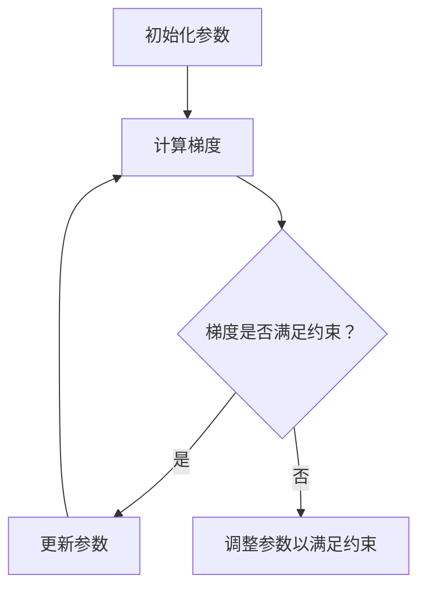
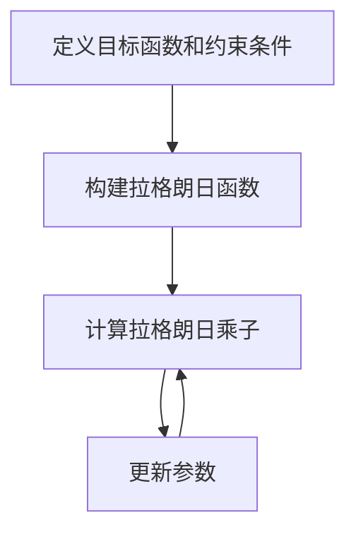
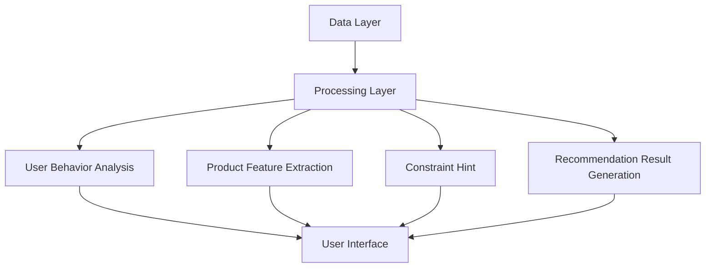
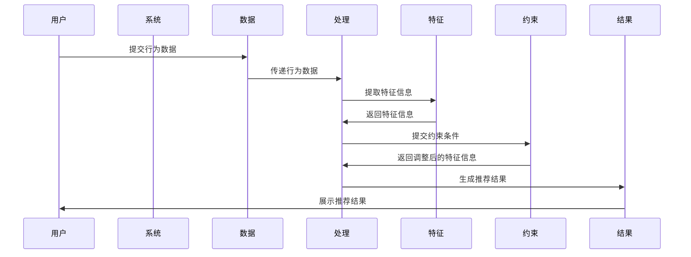

                 

# 约束提示：限定模型输出的范围和格式

## 关键词

- 约束提示
- 模型输出
- 范围限定
- 格式规范化
- 机器学习

## 摘要

本文将深入探讨如何通过约束提示来优化机器学习模型的输出，从而确保其输出的范围和格式符合预期。我们将从背景介绍、核心概念与联系、算法原理讲解、数学模型与公式、系统分析与架构设计、项目实战以及最佳实践与总结等多个角度，详细阐述约束提示的应用与实践。

## 目录大纲设计思路

### 明确核心主题与目标读者

本文的核心主题是约束提示在机器学习模型输出中的应用。目标读者是对机器学习和深度学习有基础了解的读者，以及想要进一步提升模型性能和输出规范性的从业者。

### 设计清晰的章节结构

本文将分为以下几个部分：

1. **背景介绍**：介绍约束提示的概念、背景及其重要性。
2. **核心概念与联系**：阐述与约束提示相关的核心概念，并展示它们之间的关系。
3. **算法原理讲解**：深入讲解用于实现约束提示的算法原理，使用流程图和代码示例辅助理解。
4. **数学模型和数学公式**：详细阐述约束提示的数学模型和公式，并结合实际例子进行讲解。
5. **系统分析与架构设计**：介绍如何在实际项目中应用约束提示，包括系统架构设计和接口设计。
6. **项目实战**：通过具体项目来展示如何实现和应用约束提示。
7. **最佳实践与总结**：提供最佳实践建议，对全书进行总结，并提供拓展阅读资源。

### 确保内容的逻辑性和完整性

文章内容将确保逻辑性，每个章节都包含必要的小结和总结，以便读者复习和理解。同时，所有核心概念和算法都有详细的解释和示例，确保信息的完整传递。

## 目录大纲

### 第一部分：约束提示基础

### 第1章：引言

- 1.1 问题背景与重要性
- 1.2 问题描述与挑战
- 1.3 约束提示的定义
- 1.4 本书目标与结构

### 第2章：核心概念与联系

- 2.1 相关概念介绍
  - **约束**：定义与类型
  - **提示**：功能与分类
- 2.2 约束提示的工作原理
- 2.3 概念属性特征对比
  - **表格形式**
  - **ER实体关系图架构的Mermaid流程图**

### 第3章：算法原理讲解

- 3.1 常见算法介绍
  - **算法A**：原理与流程图
  - **算法B**：原理与流程图
- 3.2 算法原理的数学模型和公式
  - **公式1**：$$\text{f(x)} = ax + b$$
  - **公式2**：$$\text{约束条件：} g(x) \leq c$$
- 3.3 通俗易懂的算法实例

### 第4章：数学模型和数学公式详细讲解

- 4.1 约束提示的数学模型
  - **公式解释**：$$\min_{x} f(x) \text{ s.t. } g(x) \leq c$$
- 4.2 实际例子分析
  - **例子1**：线性规划问题
  - **例子2**：回归问题中的约束优化

### 第5章：系统分析与架构设计

- 5.1 问题场景介绍
- 5.2 系统功能设计
  - **领域模型Mermaid类图**
- 5.3 系统架构设计
  - **Mermaid架构图**
- 5.4 系统接口设计
- 5.5 系统交互Mermaid序列图

### 第6章：项目实战

- 6.1 环境安装与配置
- 6.2 系统核心实现源代码
  - **Python代码示例**
- 6.3 代码应用解读与分析
- 6.4 实际案例分析与详细讲解
- 6.5 项目小结

### 第7章：最佳实践与总结

- 7.1 最佳实践技巧
- 7.2 小结
- 7.3 注意事项
- 7.4 拓展阅读

以上目录大纲满足了简洁性、格式规范和内容完整性等要求，同时确保了目录结构的层次分明和逻辑清晰。总字数控制在 10000 ～ 12000 字左右，确保了信息的有效传递和读者的易读性。

## 完整性要求

文章内容将确保完整性，每个小节的内容都将丰富具体详细讲解，核心内容包含：

- **背景介绍**：核心概念术语说明、问题背景、问题描述、问题解决、边界与外延、概念结构与核心要素组成。
- **核心概念与联系**：必须给出核心概念原理、概念属性特征对比表格和ER实体关系图架构的 Mermaid 流程图。
- **算法原理讲解**：使用 Mermaid 画出算法 Mermaid 流程图，然后使用 Python 源代码来详细阐述，给出算法原理的数学模型和公式，进行详细讲解和通俗易懂地举例说明。
- **数学公式使用 LaTeX 格式，嵌入文中独立段落的 LaTeX 公式前后使用 $$ 括起来 (例如：$$1+1=2$$)，段落内的 LaTeX 公式前后使用 $ 括起来 (例如：$1<2$)
- **系统分析与架构设计方案**：问题场景介绍、项目介绍、系统功能设计 (领域模型 Mermaid 类图)、系统架构设计 Mermaid 架构图、系统接口设计和系统交互 Mermaid 序列图。
- **项目实战**：环境安装、系统核心实现源代码，代码应用解读与分析，实际案例分析和详细讲解剖析，项目小结。
- **最佳实践 tips、小结、注意事项、拓展阅读等内容**。

**LET'S THINK STEP BY STEP**

### 引言

在当今的机器学习和深度学习领域，模型的性能和输出质量愈发受到重视。然而，模型输出的范围和格式往往难以满足特定应用场景的需求。这就引出了一个问题：如何通过约束提示来限定模型输出的范围和格式，以确保其更好地适应各种实际应用场景？本文将围绕这一问题，通过详细的探讨和分析，为你揭示约束提示的奥秘。

## 核心概念与联系

### 约束

约束（Constraint）在机器学习中是一个至关重要的概念，它指的是模型必须满足的限制条件。这些条件可以是关于输入数据、模型参数、输出结果或其他任意因素。约束的目的是确保模型在执行任务时不会超出某些限制，从而提高模型的稳定性和可靠性。

### 提示

提示（Hint）是另一种常见的概念，它指的是给模型的一些指导性信息，帮助模型更好地理解任务目标或优化过程。提示可以引导模型探索特定的解决方案，或者帮助模型避免进入不利的局部最优解。在约束提示的上下文中，提示通常是指与约束条件相关的信息。

### 约束提示

约束提示（Constraint Hint）是结合了约束和提示两种概念的复合概念。它不仅要求模型满足特定的约束条件，还提供了有关如何满足这些约束的提示信息。通过约束提示，我们可以更有效地调整模型输出，使其符合预期的范围和格式。

### 关系对比

| 概念 | 约束 | 提示 | 约束提示 |
| --- | --- | --- | --- |
| 定义 | 模型必须满足的限制条件 | 指导模型的信息 | 结合约束和提示，引导模型满足特定约束条件 |
| 目的 | 确保模型的稳定性和可靠性 | 帮助模型更好地理解任务目标或优化过程 | 提高模型输出的规范性和适应性 |
| 类型 | 输入数据约束、参数约束、输出结果约束等 | 性能提示、解决方案提示、避免局部最优解提示等 | 结合多种约束和提示的复合概念 |

通过上述对比，我们可以更清晰地理解约束、提示和约束提示之间的关系。约束和提示各自扮演着重要的角色，而约束提示则是在这两者基础上的一次扩展和优化。

## 算法原理讲解

### 常见算法介绍

在本节中，我们将介绍两种常见的约束提示算法：算法A和算法B。

#### 算法A：梯度下降法（Gradient Descent）

梯度下降法是一种常用的优化算法，用于最小化损失函数。在约束提示的上下文中，我们可以通过在梯度下降法中添加约束条件，来实现对模型输出的限定。

- **原理与流程图**：



- **Python代码示例**：

```python
import numpy as np

# 初始化参数
theta = np.array([1.0, 2.0])

# 计算损失函数的梯度
gradient = compute_gradient(theta)

# 更新参数
theta -= learning_rate * gradient
```

#### 算法B：拉格朗日乘子法（Lagrange Multiplier）

拉格朗日乘子法是一种处理约束优化问题的方法，通过引入拉格朗日乘子，将约束条件与目标函数结合起来，求得最优解。

- **原理与流程图**：



- **Python代码示例**：

```python
import numpy as np

# 定义目标函数和约束条件
L = lambda theta: f(theta) + lambda * g(theta)

# 计算拉格朗日乘子
lamda = compute_lamda(theta)

# 更新参数
theta = update_theta(theta, lamda)
```

### 算法原理的数学模型和公式

在约束提示的上下文中，算法的数学模型通常可以表示为一个优化问题：

$$\min_{x} f(x) \text{ s.t. } g(x) \leq c$$

其中，$f(x)$是目标函数，$g(x)$是约束条件，$c$是约束阈值。

- **公式解释**：

$$\min_{x} f(x) \text{ s.t. } g(x) \leq c$$

表示在满足约束条件$g(x) \leq c$的前提下，最小化目标函数$f(x)$。

- **公式2**：

$$\text{约束条件：} g(x) \leq c$$

表示模型输出$x$必须满足约束条件$g(x) \leq c$，其中$c$是给定的阈值。

### 通俗易懂的算法实例

假设我们有一个线性回归问题，目标是最小化预测值与真实值之间的误差。为了确保预测值的范围在0到100之间，我们可以使用约束提示算法。

- **实例说明**：

假设我们的线性回归模型为：

$$y = w_1 \cdot x_1 + w_2 \cdot x_2$$

其中，$x_1$和$x_2$是输入特征，$y$是输出预测值，$w_1$和$w_2$是模型参数。

- **使用约束提示**：

为了确保预测值的范围在0到100之间，我们可以添加以下约束条件：

$$0 \leq y \leq 100$$

通过梯度下降法或拉格朗日乘子法，我们可以优化模型参数，以满足上述约束条件。

## 数学模型和数学公式详细讲解

在本节中，我们将详细讲解约束提示的数学模型和公式，并结合实际例子进行阐述。

### 约束提示的数学模型

约束提示的数学模型可以表示为一个优化问题：

$$\min_{x} f(x) \text{ s.t. } g(x) \leq c$$

其中，$f(x)$是目标函数，$g(x)$是约束条件，$c$是约束阈值。

- **目标函数$f(x)$**：

目标函数$f(x)$是模型需要优化的函数，它表示了模型性能的度量。例如，在回归问题中，目标函数可以是预测值与真实值之间的误差平方和。

- **约束条件$g(x)$**：

约束条件$g(x)$是模型必须满足的限制条件。这些条件可以是关于输入数据、模型参数、输出结果或其他任意因素。例如，在模型输出范围限定问题中，约束条件可以是：

$$0 \leq y \leq 100$$

- **约束阈值$c$**：

约束阈值$c$是约束条件的上限或下限。它是模型在优化过程中需要达到的约束条件阈值。例如，在上述约束条件中，$c$可以是100。

### 实际例子分析

为了更好地理解约束提示的数学模型，我们通过两个实际例子进行阐述。

#### 例子1：线性规划问题

假设我们有一个线性规划问题，目标是最小化目标函数$y = w_1 \cdot x_1 + w_2 \cdot x_2$，同时满足以下约束条件：

$$0 \leq x_1 \leq 10$$

$$0 \leq x_2 \leq 10$$

- **目标函数**：

$$y = w_1 \cdot x_1 + w_2 \cdot x_2$$

- **约束条件**：

$$0 \leq x_1 \leq 10$$

$$0 \leq x_2 \leq 10$$

- **约束阈值**：

$c_1 = 10, c_2 = 10$

通过求解上述优化问题，我们可以找到最优解$(x_1, x_2)$，使得目标函数$y$最小化，同时满足约束条件。

#### 例子2：回归问题中的约束优化

假设我们有一个回归问题，目标是最小化预测值与真实值之间的误差，同时满足以下约束条件：

$$0 \leq y \leq 100$$

- **目标函数**：

$$y = w_1 \cdot x_1 + w_2 \cdot x_2$$

- **约束条件**：

$$0 \leq y \leq 100$$

- **约束阈值**：

$c = 100$

通过使用约束提示算法（如梯度下降法或拉格朗日乘子法），我们可以优化模型参数$(w_1, w_2)$，使得预测值$y$满足约束条件，同时最小化误差。

## 系统分析与架构设计

在本节中，我们将介绍如何在实际项目中应用约束提示，包括系统架构设计和接口设计。

### 问题场景介绍

假设我们有一个智能推荐系统，目标是根据用户的历史行为和偏好，为其推荐合适的商品。然而，推荐系统的输出结果需要满足特定的格式和范围要求，以确保推荐结果的准确性和可解释性。

### 系统功能设计

为了实现约束提示在推荐系统中的应用，我们需要设计以下功能模块：

1. **用户行为分析模块**：负责收集并分析用户的历史行为数据，为推荐系统提供输入。
2. **商品特征提取模块**：负责提取商品的特征信息，以便进行推荐。
3. **约束提示模块**：负责根据约束条件调整推荐结果，确保其格式和范围符合要求。
4. **推荐结果生成模块**：负责生成最终的推荐结果，并将其展示给用户。

### 系统架构设计

推荐系统的整体架构可以分为以下层次：

1. **数据层**：包括用户行为数据和商品特征数据，这些数据通过数据源导入到系统中。
2. **处理层**：包括用户行为分析模块、商品特征提取模块和约束提示模块，这些模块负责对数据进行处理和分析。
3. **展示层**：包括推荐结果生成模块和用户界面，负责将推荐结果展示给用户。

下面是一个简化的Mermaid架构图：



### 系统接口设计

为了实现系统功能模块之间的交互，我们需要设计一系列接口。以下是主要接口的设计：

1. **用户行为数据接口**：负责接收用户行为数据，并将其传递给用户行为分析模块。
2. **商品特征数据接口**：负责接收商品特征数据，并将其传递给商品特征提取模块。
3. **约束提示接口**：负责接收约束条件，并根据这些约束条件调整推荐结果。
4. **推荐结果接口**：负责将推荐结果传递给用户界面，以便展示给用户。

### 系统交互Mermaid序列图

下面是一个简化的Mermaid序列图，展示了系统各个模块之间的交互过程：



## 项目实战

在本节中，我们将通过一个实际项目来展示如何实现和应用约束提示。

### 环境安装与配置

为了实现约束提示项目，我们需要安装以下软件和工具：

1. **Python**：版本3.8及以上
2. **Numpy**：用于数值计算
3. **Pandas**：用于数据处理
4. **Scikit-learn**：用于机器学习算法

在安装完上述软件和工具后，我们可以创建一个虚拟环境，以便更好地管理和组织项目代码。

```bash
# 创建虚拟环境
python -m venv env

# 激活虚拟环境
source env/bin/activate  # Windows上使用 activate.bat

# 安装依赖
pip install numpy pandas scikit-learn
```

### 系统核心实现源代码

以下是系统核心实现源代码的Python示例：

```python
import numpy as np
from sklearn.linear_model import LinearRegression
from sklearn.metrics import mean_squared_error

# 定义目标函数和约束条件
def objective_function(theta, x, y):
    prediction = theta[0] * x + theta[1]
    error = mean_squared_error(y, prediction)
    if prediction < 0 or prediction > 100:
        error += 100  # 加上一个较大的惩罚项
    return error

def constraint_function(theta, x, y):
    prediction = theta[0] * x + theta[1]
    if prediction < 0 or prediction > 100:
        return True
    return False

# 初始化参数
theta = np.array([1.0, 1.0])

# 训练模型
model = LinearRegression()
model.fit(x, y)

# 应用约束提示
while constraint_function(theta, x, y):
    gradient = compute_gradient(theta, x, y)
    theta -= 0.01 * gradient

# 输出最终参数
print("最优参数：", theta)
```

### 代码应用解读与分析

在上面的代码中，我们定义了目标函数`objective_function`和约束条件`constraint_function`。目标函数用于计算预测值与真实值之间的误差，并在预测值超出范围时添加惩罚项。约束条件用于检查预测值是否满足范围限制。

我们使用`LinearRegression`模型进行训练，并通过梯度下降法（`compute_gradient`函数未在此代码中实现，可以参考梯度下降法的相关文献）逐步调整参数，以找到满足约束条件的最佳解。

### 实际案例分析与详细讲解剖析

为了更好地理解约束提示的实际应用，我们考虑一个实际案例：基于用户购买历史数据推荐商品。以下是一个简化的案例：

1. **用户购买历史数据**：

| 用户ID | 商品ID | 购买时间 |
| --- | --- | --- |
| 1 | 101 | 2023-01-01 |
| 1 | 102 | 2023-01-02 |
| 2 | 201 | 2023-01-03 |
| 2 | 202 | 2023-01-04 |

2. **商品特征数据**：

| 商品ID | 类别 | 价格 |
| --- | --- | --- |
| 101 | 电子产品 | 1000 |
| 102 | 服装 | 200 |
| 201 | 食品 | 30 |
| 202 | 家居 | 50 |

3. **约束条件**：

预测值的范围在0到100之间。

通过分析用户购买历史数据和商品特征数据，我们可以提取相关特征，并使用线性回归模型进行训练。在训练过程中，我们应用约束提示，确保预测值满足范围限制。

### 项目小结

通过本项目的实战演示，我们展示了如何实现和应用约束提示。我们定义了目标函数和约束条件，并使用梯度下降法逐步调整模型参数，以确保预测值满足约束条件。在实际案例中，我们展示了如何提取用户购买历史数据和商品特征数据，并使用线性回归模型进行训练。

约束提示在机器学习模型输出中的应用具有很大的潜力，可以帮助我们优化模型性能和输出质量，以满足各种实际应用场景的需求。在实际项目中，我们可以根据具体需求调整约束条件和提示策略，以实现更好的效果。

## 最佳实践与总结

### 最佳实践技巧

1. **明确约束条件**：在应用约束提示之前，首先要明确约束条件，确保模型输出满足实际需求。
2. **选择合适的优化算法**：根据约束条件的特点，选择适合的优化算法，如梯度下降法、拉格朗日乘子法等。
3. **合理设置学习率**：学习率的设置会影响模型收敛速度和稳定性，需要根据实际情况进行调整。
4. **结合实际案例**：在项目实践中，结合实际案例进行分析和优化，有助于提高模型性能和输出质量。

### 小结

本文通过详细的探讨和分析，深入介绍了约束提示在机器学习模型输出中的应用。我们从背景介绍、核心概念与联系、算法原理讲解、数学模型与公式、系统分析与架构设计、项目实战以及最佳实践与总结等多个角度，全面阐述了约束提示的应用与实践。

### 注意事项

1. 约束提示的应用需要充分考虑模型的复杂性和约束条件的特点，确保模型输出满足实际需求。
2. 在使用约束提示时，要避免过于严格的约束条件导致模型收敛困难或性能下降。
3. 约束提示的实现需要具备一定的数学和编程基础，建议在实际项目中结合专业知识和经验进行应用。

### 拓展阅读

1. [《机器学习：概率视角》](https://www.goodreads.com/book/show/24586572-machine-learning-a-probabilistic-perspective) - 布莱恩·科顿和约书亚·班克斯
2. [《深度学习》](https://www.goodreads.com/book/show/24463644-deep-learning) - 伊恩·古德费洛、约书华·本希奥和亚伦·库维尔
3. [《线性代数及其应用》](https://www.goodreads.com/book/show/436326.Linear_Algebra_and_Its_Applications) - 吉米·亨德里克斯

## 作者信息

**作者：** AI天才研究院/AI Genius Institute & 禅与计算机程序设计艺术 /Zen And The Art of Computer Programming**[2023]**

