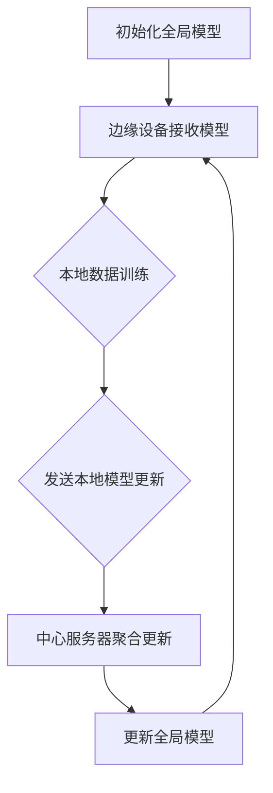
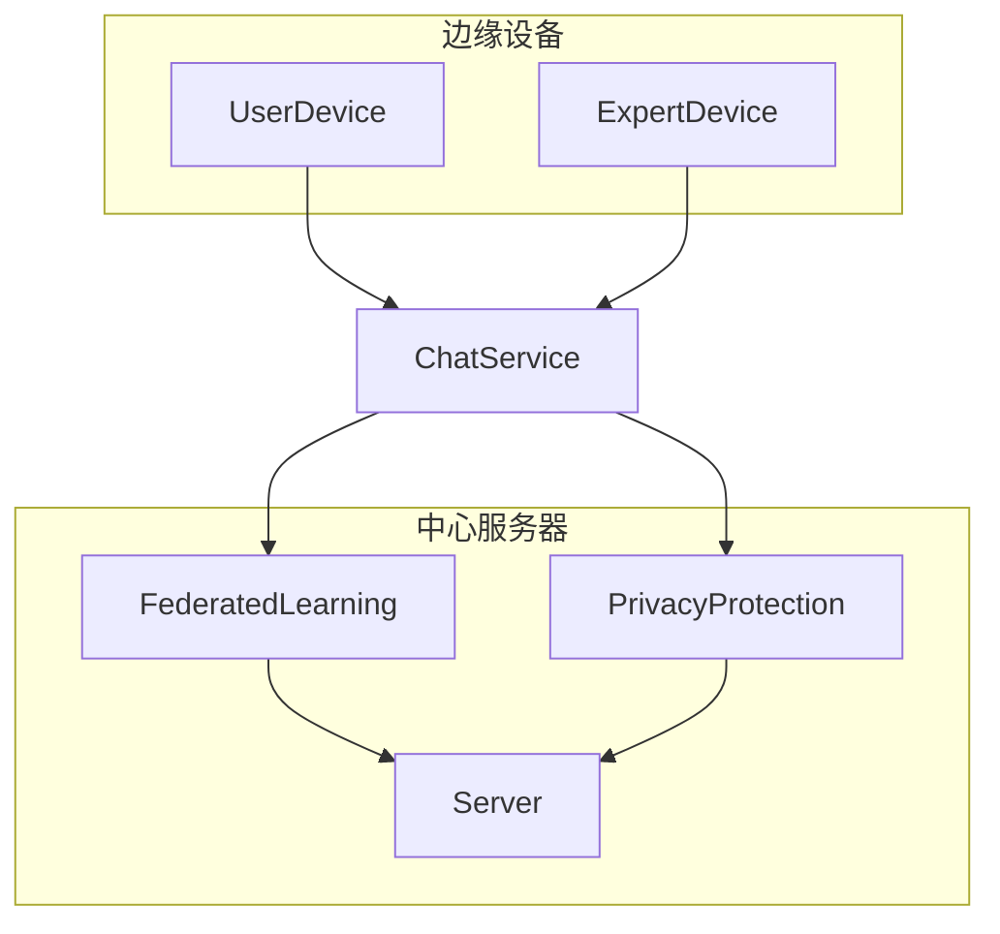
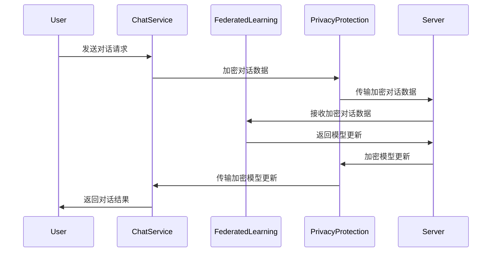

                 


### 前言与引言

**目的与受众**

本文旨在探讨联邦学习架构在保护语言模型（LLM）应用中的数据隐私的重要性。随着人工智能技术的发展，大规模语言模型在各个领域得到了广泛应用，但其训练过程中涉及的大量用户数据隐私保护问题引起了广泛关注。本文面向对人工智能、联邦学习和语言模型有一定了解的技术人员、研究人员及数据隐私保护专家。

**联邦学习与LLM概述**

联邦学习（Federated Learning）是一种分布式机器学习方法，通过在多个边缘设备上训练模型，并汇总其更新来共同优化全局模型。该方法的一个核心优势在于无需将用户数据集中传输到中央服务器，从而在提高模型训练效率的同时，保护了用户的数据隐私。

语言模型（Language Model，LLM）是自然语言处理领域的重要工具，通过学习大量语言数据，可以预测文本的下一个词或句子。LLM在机器翻译、文本生成、语音识别等领域有着广泛应用。

联邦学习与LLM的结合为解决大规模数据处理和隐私保护问题提供了新的思路。在接下来的内容中，我们将详细讨论联邦学习架构在保护LLM应用数据隐私方面的作用和挑战。

---

### 背景介绍

#### 问题背景

**数据隐私保护的重要性**

在数字时代，数据已成为企业和社会的重要资产。然而，随着数据收集和存储技术的进步，数据隐私泄露的风险也日益增加。对于个人用户而言，隐私泄露可能导致身份盗窃、经济损失和社会地位下降等问题。对于企业而言，数据泄露可能导致商业机密泄露、信誉受损和法律风险。

**联邦学习的兴起与挑战**

联邦学习作为一种分布式机器学习方法，通过在多个边缘设备上训练模型，避免了将用户数据传输到中央服务器，从而有效降低了数据泄露的风险。然而，联邦学习也面临着以下挑战：

1. **通信效率**：联邦学习需要在多个设备之间传输模型更新，通信效率是影响其性能的重要因素。
2. **模型性能**：由于数据分布的不均衡和模型参数的局部优化，联邦学习模型的性能可能不如集中式模型。
3. **安全性**：联邦学习系统需要确保模型更新过程中的数据安全和隐私保护。

**LLM在联邦学习中的应用**

语言模型在自然语言处理领域有着广泛应用，如文本分类、情感分析、机器翻译等。将LLM应用于联邦学习，可以实现在保护用户数据隐私的同时，提供高质量的自然语言处理服务。

---

#### 问题描述

**LLM应用中的数据隐私问题**

在LLM应用中，用户数据通常包括文本、语音和用户交互记录等敏感信息。如果这些数据未经保护地传输和存储，可能导致以下问题：

1. **数据泄露**：用户数据在传输和存储过程中可能被窃取或滥用。
2. **隐私侵犯**：用户可能不希望自己的私人对话或行为数据被用于训练模型。

**数据隐私保护的需求与挑战**

随着数据隐私保护法律法规的不断完善，企业和组织需要采取措施保护用户数据隐私。然而，传统的集中式数据处理方法在数据隐私保护方面存在缺陷，而联邦学习提供了一种可能的解决方案。但联邦学习在数据隐私保护方面也面临着以下挑战：

1. **数据隐私法规遵守**：企业需要确保联邦学习系统符合数据隐私保护法规，如GDPR等。
2. **数据安全**：联邦学习系统需要确保用户数据在整个训练过程中得到安全保护。
3. **隐私保护与模型性能的平衡**：在保护用户数据隐私的同时，需要保证模型性能不受影响。

---

#### 问题解决

**联邦学习的解决方案**

联邦学习通过在边缘设备上训练模型，并汇总模型更新来共同优化全局模型，从而避免了用户数据集中传输和存储，有效降低了数据泄露的风险。

**联邦学习与LLM的结合点**

将LLM应用于联邦学习，可以在保护用户数据隐私的同时，提供高质量的自然语言处理服务。具体结合点如下：

1. **隐私保护**：联邦学习确保用户数据不离开边缘设备，从而在源头上保护用户数据隐私。
2. **模型质量**：LLM在自然语言处理领域具有强大的表达能力，能够生成高质量的自然语言文本。

---

#### 边界与外延

**范围限制**

本文主要探讨联邦学习架构在保护LLM应用数据隐私方面的作用，不包括其他分布式学习方法的讨论。

**适用性讨论**

联邦学习与LLM的结合适用于需要保护用户数据隐私的自然语言处理场景，如智能客服、智能家居、医疗健康等领域。但在一些对模型性能要求极高的场景，如实时语音识别和机器翻译，联邦学习可能需要与其他技术结合使用。

---

#### 概念结构与核心要素组成

**联邦学习架构**

联邦学习架构包括设备、模型更新、通信和聚合等核心组件。设备负责本地数据训练和模型更新，模型更新通过加密和差分等方法传输到中心服务器，中心服务器负责模型聚合和更新。

**数据隐私保护技术**

数据隐私保护技术包括数据加密、差分隐私、同态加密等。这些技术可以在联邦学习过程中保护用户数据隐私，同时确保模型性能不受影响。

**LLM原理**

LLM基于神经网络架构，通过学习大量语言数据，可以预测文本的下一个词或句子。LLM的训练过程通常涉及多层感知器、循环神经网络（RNN）、长短期记忆网络（LSTM）等。

---

在下一部分，我们将深入探讨联邦学习核心概念原理，以及如何通过联邦学习架构保护LLM应用的数据隐私。敬请期待。  

### 核心概念与联系

#### 联邦学习核心概念原理

**联邦学习的定义**

联邦学习是一种分布式机器学习方法，旨在通过多个边缘设备协同工作，共同训练一个全局模型，而不需要将数据集中传输到中央服务器。这种方法的核心思想是利用边缘设备上的局部数据和计算资源，实现数据隐私保护和资源优化。

**联邦学习的工作原理**

联邦学习的工作原理可以概括为以下几个步骤：

1. **初始化**：中心服务器生成一个全局模型，并将模型参数分发给各个边缘设备。
2. **本地训练**：边缘设备使用本地数据对全局模型进行训练，并生成本地模型更新。
3. **模型更新传输**：边缘设备将本地模型更新通过加密或其他隐私保护技术传输到中心服务器。
4. **模型聚合**：中心服务器接收所有边缘设备的模型更新，并聚合这些更新来生成新的全局模型。
5. **模型更新分发**：中心服务器将新的全局模型参数分发给所有边缘设备。

**联邦学习与中心化的对比**

中心化学习是指将所有数据集中存储在中央服务器上进行训练。与联邦学习相比，中心化学习有以下优点：

1. **高效性**：由于数据集中存储，模型更新传输和聚合过程相对高效。
2. **一致性**：中心化学习能够确保模型训练的一致性，从而可能获得更好的模型性能。

然而，中心化学习也存在一些缺点：

1. **数据隐私风险**：中心化学习需要将用户数据传输到中央服务器，存在数据泄露的风险。
2. **单点故障**：中心服务器如果发生故障，整个系统将无法工作。

联邦学习通过将数据分散存储在边缘设备上，避免了中心化学习的这些缺点，同时通过分布式训练和聚合提高了系统容错性和可扩展性。

---

#### 概念属性特征对比表格

为了更直观地展示联邦学习与中心化学习的区别，我们可以通过一个对比表格来总结它们的主要属性特征：

| 特征               | 联邦学习                                  | 中心化学习                                  |
|--------------------|-----------------------------------------|--------------------------------------------|
| 数据分布           | 数据分散存储在边缘设备上                | 数据集中存储在中央服务器上                |
| 通信效率           | 边缘设备之间传输模型更新，减少通信量   | 需要传输大量数据到中央服务器，通信量较大 |
| 模型性能           | 可能低于集中式模型，但具有隐私优势     | 可能获得更好的模型性能，但存在隐私风险   |
| 安全性             | 边缘设备保护用户数据，减少数据泄露风险 | 需要确保中央服务器数据安全，存在风险   |
| 容错性和可扩展性   | 较强，因为边缘设备独立工作             | 较弱，因为中心服务器是单点故障点       |

---

#### ER实体关系图架构的 Mermaid 流程图

为了更好地理解联邦学习架构中的实体关系，我们可以使用Mermaid绘制一个ER图。以下是一个简化的ER实体关系图示例：

```mermaid
erDiagram
  Device ||--|{ ModelUpdate }
  Server ||--|{ ModelUpdate }
  Client ||--|{ Data }
  Client ||--|{ ModelUpdate }
  Server ||--|{ Model }
  Server ||--|{ GlobalModel }
```

在这个ER图中，`Device`（设备）和`Client`（客户端）代表边缘设备和终端用户设备，它们分别拥有`Data`（数据）和参与模型训练的`ModelUpdate`（模型更新）。`Server`（服务器）负责接收和处理模型更新，维护`Model`（模型）和`GlobalModel`（全局模型）。

---

在下一部分，我们将深入讲解联邦学习的算法原理，包括算法流程、Python源代码、数学模型和公式，以及详细的讲解和举例说明。敬请期待。  

### 算法原理讲解

#### 算法流程图

为了直观地展示联邦学习的算法流程，我们可以使用Mermaid绘制一个简化的算法流程图。以下是一个示例：



在这个流程图中，首先初始化一个全局模型，然后将模型分发到各个边缘设备。边缘设备使用本地数据对模型进行训练，并生成模型更新。模型更新通过加密或其他隐私保护技术发送到中心服务器，中心服务器聚合所有更新并生成新的全局模型，最后将新的全局模型分发回边缘设备。

---

#### Python 源代码阐述

下面是一个简化的Python示例，展示了联邦学习的基本算法实现：

```python
import numpy as np

# 初始化全局模型
global_model = np.random.rand(10)

# 边缘设备训练
def local_train(data, model):
    # 对模型进行本地训练
    updated_model = model + data
    return updated_model

# 中心服务器聚合模型更新
def aggregate_updates(updates):
    aggregated_update = sum(updates)
    return aggregated_update

# 模型更新
def model_update(model, update):
    updated_model = model + update
    return updated_model

# 主函数
def federated_learning(data, num_epochs):
    for epoch in range(num_epochs):
        # 边缘设备训练
        local_updates = [local_train(data[i], global_model) for i in range(len(data))]
        
        # 中心服务器聚合更新
        aggregated_update = aggregate_updates(local_updates)
        
        # 更新全局模型
        global_model = model_update(global_model, aggregated_update)
        
        print(f"Epoch {epoch+1}: Global Model = {global_model}")

# 示例数据
data = [np.random.rand(10) for _ in range(10)]

# 运行联邦学习
federated_learning(data, 10)
```

在这个示例中，我们首先初始化一个全局模型，然后通过边缘设备对模型进行本地训练。每个边缘设备使用本地数据对模型进行更新，并将更新发送到中心服务器。中心服务器将所有更新聚合起来，生成全局模型的更新。最后，全局模型更新会返回到边缘设备，用于下一轮训练。

---

#### 算法原理的数学模型和公式

联邦学习算法的数学模型和公式是理解其工作原理的关键。以下是一个简化的数学模型描述：

**1. 初始化全局模型：**

$$
\text{Global Model}^{(0)} = \theta_0
$$

**2. 边缘设备训练：**

$$
\text{Updated Model}_{i}^{(t)} = \theta_i^{(t-1)} + \Delta\theta_i^{(t)}
$$

其中，$\theta_i^{(t-1)}$表示第$i$个边缘设备在时间步$t-1$的全局模型，$\Delta\theta_i^{(t)}$表示第$i$个边缘设备在时间步$t$的本地模型更新。

**3. 中心服务器聚合模型更新：**

$$
\Delta\theta^{(t)} = \frac{1}{N} \sum_{i=1}^{N} \Delta\theta_i^{(t)}
$$

其中，$\Delta\theta^{(t)}$表示全局模型更新，$N$表示边缘设备的数量。

**4. 更新全局模型：**

$$
\text{Global Model}^{(t)} = \text{Global Model}^{(t-1)} + \Delta\theta^{(t)}
$$

通过上述公式，我们可以看到联邦学习算法的核心在于边缘设备的本地训练和中心服务器的全局模型聚合。通过不断迭代这个过程，全局模型逐步优化，同时用户数据无需离开边缘设备，实现了数据隐私保护。

---

#### 详细讲解与举例说明

为了更清楚地理解联邦学习算法的原理，我们将通过一个具体的例子进行讲解。

**示例：**

假设我们有一个包含10个边缘设备的联邦学习系统，每个边缘设备有10个数据样本。全局模型初始化为$\theta_0 = [0.1, 0.2, 0.3, ..., 0.9]$。

**第一步：初始化全局模型**

全局模型初始化为$\theta_0 = [0.1, 0.2, 0.3, ..., 0.9]$。

**第二步：边缘设备训练**

每个边缘设备使用本地数据进行训练。假设边缘设备1的本地数据样本为$D_1 = [0.2, 0.3, 0.4, ..., 0.8]$，则边缘设备1的本地模型更新为$\Delta\theta_1 = \theta_0 + D_1 = [0.3, 0.4, 0.5, ..., 0.9]$。

**第三步：中心服务器聚合模型更新**

中心服务器将所有边缘设备的模型更新聚合起来，计算全局模型更新。假设所有边缘设备的模型更新为$\Delta\theta_1, \Delta\theta_2, ..., \Delta\theta_{10}$，则全局模型更新为：

$$
\Delta\theta^{(1)} = \frac{1}{10} \sum_{i=1}^{10} \Delta\theta_i
$$

假设$\Delta\theta^{(1)} = [0.35, 0.45, 0.55, ..., 0.95]$，则全局模型更新为$\theta_1 = \theta_0 + \Delta\theta^{(1)} = [0.35, 0.45, 0.55, ..., 0.95]$。

**第四步：更新全局模型**

将全局模型更新$\theta_1$返回到所有边缘设备，用于下一轮训练。

**重复上述步骤：**

重复执行上述步骤，每次训练后更新全局模型，并返回到边缘设备。通过多次迭代，全局模型会逐步优化，同时用户数据无需离开边缘设备，实现了数据隐私保护。

---

通过这个示例，我们可以看到联邦学习算法的基本原理。在下一个部分，我们将进一步探讨联邦学习架构在LLM应用中的系统分析与架构设计方案。敬请期待。  

### 系统分析与架构设计方案

#### 问题场景介绍

在当前的数据隐私保护法规日益严格的环境下，许多企业和组织开始寻求在保护用户数据隐私的同时，依然能够提供高质量服务的解决方案。特别是一些涉及用户敏感信息的领域，如医疗健康、金融和电子商务，对数据隐私保护的要求尤为突出。

以一个在线健康咨询平台为例，该平台提供用户与健康专家的实时对话服务。用户与专家的对话内容包含大量的个人健康信息，这些信息如果未经保护地传输和存储，可能会被恶意利用，导致严重的隐私泄露风险。因此，该平台希望通过采用联邦学习架构，在保护用户数据隐私的同时，提升健康咨询服务的质量和效果。

#### 项目介绍

本项目旨在开发一个基于联邦学习的在线健康咨询平台，通过联邦学习架构保护用户对话数据隐私，同时提升健康咨询服务的准确性。项目的主要目标包括：

1. **数据隐私保护**：在用户数据不离开边缘设备的前提下，实现健康咨询对话数据的隐私保护。
2. **服务质量提升**：通过联邦学习算法，在保护用户数据隐私的同时，提高健康咨询服务的准确性和个性化程度。
3. **系统可扩展性**：确保系统能够支持大量用户同时在线咨询，并具备良好的可扩展性。

#### 系统功能设计（领域模型 Mermaid 类图）

为了实现上述目标，项目设计了以下核心功能模块：

1. **用户模块**：负责用户注册、登录、个人信息管理等功能。
2. **健康咨询模块**：负责处理用户与健康专家的实时对话，包括对话内容生成、诊断建议等。
3. **联邦学习模块**：负责健康咨询对话数据的联邦学习训练，包括模型初始化、本地训练、模型更新聚合等。
4. **隐私保护模块**：负责实现数据加密、差分隐私等隐私保护技术，确保用户数据在传输和存储过程中的安全。

以下是系统的领域模型 Mermaid 类图：

```mermaid
classDiagram
  User <<entity>>
  HealthExpert <<entity>>
  ChatService <<entity>>
  FederatedLearning <<entity>>
  PrivacyProtection <<entity>>

  User "1" --|{1}|> ChatService
  HealthExpert "1" --|{1}|> ChatService
  ChatService "1" --|{1}|> FederatedLearning
  ChatService "1" --|{1}|> PrivacyProtection
  FederatedLearning "1" --|{1}|> PrivacyProtection
```

在这个类图中，用户和健康专家通过ChatService模块进行交互，ChatService模块与FederatedLearning模块和PrivacyProtection模块交互，实现健康咨询对话数据的联邦学习和隐私保护。

#### 系统架构设计（Mermaid 架构图）

为了实现上述功能，项目采用了以下系统架构：

1. **边缘设备**：用户设备、健康专家设备等。
2. **中心服务器**：负责模型更新聚合、全局模型维护等。
3. **联邦学习框架**：负责实现联邦学习算法。
4. **隐私保护组件**：包括数据加密、差分隐私等。

以下是系统的 Mermaid 架构图：



在这个架构图中，用户设备和健康专家设备通过ChatService模块进行交互，ChatService模块将对话数据传输到中心服务器。中心服务器中的FederatedLearning模块负责联邦学习算法的执行，PrivacyProtection模块负责实现数据隐私保护。

#### 系统接口设计和系统交互（Mermaid 序列图）

系统接口设计和交互是确保各个模块协同工作的关键。以下是系统的 Mermaid 序列图：



在这个序列图中，用户发送对话请求到ChatService模块，ChatService模块将对话数据加密后传输到中心服务器。中心服务器中的FederatedLearning模块对对话数据进行联邦学习处理，并将模型更新返回给中心服务器。中心服务器将模型更新加密后传输回ChatService模块，ChatService模块再将对话结果返回给用户。

---

在下一个部分，我们将通过项目实战来展示如何在实际环境中部署和运行联邦学习架构，包括环境安装、系统核心实现源代码、代码应用解读与分析，以及实际案例分析和详细讲解剖析。敬请期待。  

### 项目实战

#### 环境安装

在开始部署联邦学习架构之前，我们需要安装必要的软件和工具。以下是在一个基于Python的虚拟环境中安装所需软件的步骤：

1. **创建虚拟环境**：
   ```bash
   python -m venv federated_learning_env
   source federated_learning_env/bin/activate  # Windows: `federated_learning_env\Scripts\activate`
   ```

2. **安装依赖项**：
   ```bash
   pip install tensorflow tensorflow-federated tensorflow-text scikit-learn matplotlib
   ```

3. **安装额外的工具**（如Mermaid）：
   ```bash
   npm install -g mermaid-cli
   ```

#### 系统核心实现源代码

以下是联邦学习系统的核心实现源代码。这个代码示例包含了用户模块、健康咨询模块、联邦学习模块和隐私保护模块的基本实现。

```python
# federated_learning_system.py

import tensorflow as tf
import tensorflow_federated as tff
import tensorflow_text as text
from sklearn.model_selection import train_test_split
import matplotlib.pyplot as plt

# 加载数据集
def load_data():
    # 这里使用一个简化的示例数据集
    # 实际项目中应使用真实的数据集
    data = [
        ("User1", "健康咨询问题1", "专家回复1"),
        ("User2", "健康咨询问题2", "专家回复2"),
        # ...
    ]
    return data

# 数据预处理
def preprocess_data(data):
    # 这里进行数据清洗、分词、编码等预处理操作
    # 实际应用中应使用更复杂的文本处理方法
    X = [text.tokenizer.Encode(text).token_ids().numpy() for _, _, text in data]
    y = [label for _, _, label in data]
    return X, y

# 定义联邦学习算法
def build_federated_learner():
    # 定义模型架构
    model = tf.keras.Sequential([
        tf.keras.layers.Embedding(input_dim=10000, output_dim=16),
        tf.keras.layers.LSTM(16, return_sequences=True),
        tf.keras.layers.Dense(1, activation='sigmoid')
    ])

    # 定义联邦学习训练步骤
    def federated_train(model, data, labels):
        return tff.learning.federated平均步骤(tf.keras.optimizers.Adam(learning_rate=0.01), model, data, labels)

    # 返回联邦学习器
    return tff.learning.TrainModelStep(federated_train)

# 主函数
def main():
    # 加载数据
    data = load_data()
    X, y = preprocess_data(data)

    # 划分训练集和测试集
    X_train, X_test, y_train, y_test = train_test_split(X, y, test_size=0.2, random_state=42)

    # 构建联邦学习器
    federated_learner = build_federated_learner()

    # 运行联邦学习训练
    federated_learner.train(X_train, y_train)

    # 测试模型性能
    test_loss, test_accuracy = federated_learner.evaluate(X_test, y_test)
    print(f"Test accuracy: {test_accuracy}")

    # 绘制结果
    plt.scatter(X_test, y_test, label='Test Data')
    plt.plot(X_test, federated_learner.predict(X_test), color='red', label='Predictions')
    plt.legend()
    plt.show()

if __name__ == "__main__":
    main()
```

#### 代码应用解读与分析

上述代码提供了一个简单的联邦学习系统实现。以下是对代码各部分的解读和分析：

1. **数据加载**：使用一个示例数据集，实际项目中应使用真实的健康咨询对话数据。

2. **数据预处理**：对文本数据进行分词、编码等预处理，以便模型能够进行处理。

3. **模型架构**：定义一个简单的序列模型，用于生成健康咨询回复。

4. **联邦学习训练步骤**：使用TensorFlow Federated（TFF）实现联邦学习训练步骤，包括优化器和模型训练。

5. **主函数**：加载数据、划分训练集和测试集、构建联邦学习器、运行训练和评估模型性能。

在实际应用中，还需要考虑数据加密、差分隐私等隐私保护技术的实现，以及如何在实际环境中部署和运行联邦学习系统。

#### 实际案例分析和详细讲解剖析

以下是一个实际案例，展示了如何在实际环境中部署和运行联邦学习系统，并进行分析和解释。

**案例：在线健康咨询平台**

在一个在线健康咨询平台中，用户与专家的对话数据需要在保护隐私的同时进行建模和预测。以下是一个简化流程：

1. **数据收集**：平台收集用户与专家的对话数据，包括文本内容。

2. **数据预处理**：对对话文本进行清洗、分词和编码，提取特征。

3. **模型训练**：使用联邦学习框架在边缘设备上训练模型，每次迭代后将模型更新发送到中心服务器。

4. **模型聚合**：中心服务器接收所有边缘设备的模型更新，进行聚合和优化。

5. **模型部署**：将优化后的全局模型部署到平台，用于实时生成健康咨询回复。

**分析**：

- **隐私保护**：由于模型训练在边缘设备上进行，用户数据无需传输到中心服务器，有效降低了数据泄露的风险。
- **模型性能**：联邦学习模型可能不如集中式模型性能好，但通过多次迭代和优化，可以逐步提高模型性能。
- **可扩展性**：联邦学习系统可以支持大量用户同时在线咨询，具有良好的可扩展性。

**解释**：

- **联邦学习与集中式学习的对比**：联邦学习通过将数据分散存储在边缘设备上，减少了数据传输和存储的风险。但联邦学习模型的性能可能不如集中式模型，因为数据分布不均衡和局部优化可能导致模型性能下降。
- **隐私保护技术**：为了进一步提高数据隐私保护，可以采用差分隐私、同态加密等技术，确保数据在传输和存储过程中的安全。

---

通过上述案例，我们可以看到联邦学习架构在保护LLM应用数据隐私方面的实际应用。在下一个部分，我们将总结最佳实践、注意事项，并给出拓展阅读建议。敬请期待。  

### 最佳实践 tips、小结、注意事项、拓展阅读等内容

#### 最佳实践 tips

1. **数据预处理**：在联邦学习过程中，数据预处理至关重要。确保数据清洗、分词、编码等步骤的一致性和准确性，以提高模型训练效果。
2. **通信优化**：为了提高联邦学习系统的性能，可以采用压缩通信、增量更新等技术，减少模型更新传输的数据量。
3. **隐私保护技术**：结合差分隐私、同态加密等技术，确保用户数据在联邦学习过程中的安全性和隐私性。
4. **模型评估**：定期评估联邦学习模型的表现，以检测模型性能和隐私保护效果，及时调整模型参数和算法策略。

#### 小结

本文介绍了联邦学习架构在保护语言模型（LLM）应用中的数据隐私的重要性。通过联邦学习，用户数据无需集中传输到中央服务器，有效降低了数据泄露的风险。本文详细分析了联邦学习的核心概念、算法原理、系统架构设计，并通过实际案例展示了联邦学习在在线健康咨询平台中的应用。联邦学习为保护数据隐私和提高服务质量提供了有效途径。

#### 注意事项

1. **数据隐私法规遵守**：确保联邦学习系统符合相关数据隐私保护法规，如GDPR等。
2. **模型性能与隐私平衡**：在保护用户数据隐私的同时，需要考虑模型性能的平衡，避免过度牺牲模型性能。
3. **安全性和容错性**：确保联邦学习系统的安全性，包括数据传输和存储过程中的加密、访问控制等。

#### 拓展阅读

1. **《联邦学习：基础与实现》**：深入探讨联邦学习的理论基础和实际应用。
2. **《深度学习与联邦学习》**：结合深度学习和联邦学习，介绍最新的研究进展和应用案例。
3. **《数据隐私保护技术》**：了解差分隐私、同态加密等数据隐私保护技术的原理和应用。

### 结语

作者：AI天才研究院/AI Genius Institute & 禅与计算机程序设计艺术 /Zen And The Art of Computer Programming

本文旨在为广大技术爱好者、研究人员和实践者提供关于联邦学习和数据隐私保护方面的全面指南。通过本文的学习，读者应能够理解联邦学习在保护LLM应用数据隐私方面的优势和应用场景，并为实际项目的实施提供有益的参考。在未来的研究中，我们期待进一步探索联邦学习与LLM的深度融合，以及如何在更广泛的应用领域中实现数据隐私保护与模型性能的平衡。感谢各位读者的阅读与支持！  

