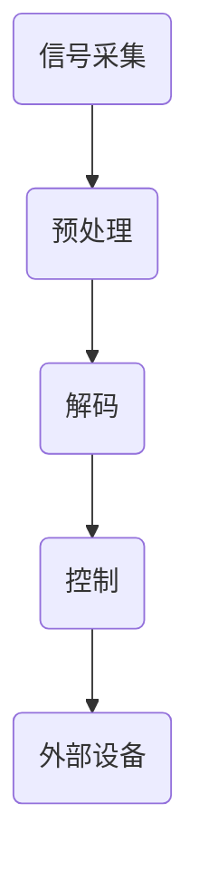
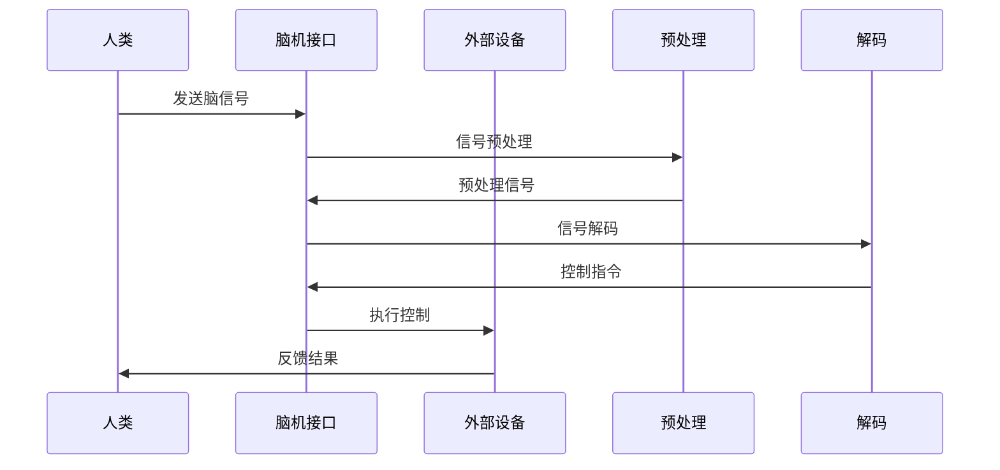

                 

## 脑机接口与意识上传：探索增强和延伸人类理解世界能力的极限

> 关键词：脑机接口，意识上传，技术原理，未来趋势，人类理解世界

> 摘要：本文深入探讨了脑机接口（Brain-Computer Interface, BCI）和意识上传（Mind Uploading）的核心概念、技术原理及其在增强和延伸人类理解世界能力方面的应用。通过细致的分析和逻辑推理，本文揭示了这两项前沿技术在推动人类认知、医疗、军事、社会等领域变革中的潜力与挑战。

### 引言

随着科技的飞速发展，脑机接口和意识上传技术逐渐从科幻走进了现实。脑机接口是一种直接将人脑与外部设备连接的技术，通过解读大脑信号来控制外部设备，甚至实现思维的交流和意识的传递。而意识上传则是一种将人脑意识数字化、上传至计算机系统中的技术，这一概念挑战了我们对意识和自我认知的传统理解。

本文将分四个部分展开讨论：

1. **脑机接口基础**：介绍脑机接口的基本概念、技术原理和应用领域。
2. **意识上传理论探讨**：探讨意识上传的基本概念、技术路线和应用前景。
3. **案例分析**：分析脑机接口与意识上传在实际应用中的案例，展示其具体实现和效果。
4. **未来趋势与展望**：预测脑机接口和意识上传技术的发展趋势，以及面临的挑战与机遇。

### 第一部分：脑机接口基础

#### 第1章：脑机接口概述

脑机接口，简称BCI，是一种直接连接人脑与外部设备的技术。它通过解读大脑信号来控制外部设备，或接收外部信号来影响大脑活动。脑机接口的研究可以追溯到20世纪60年代，但直到近年来，随着神经科学、计算机科学和材料科学的进步，这项技术才取得了显著的进展。

**核心概念术语说明**：

- **脑信号**：指由大脑神经元活动产生的电信号，包括脑电图（EEG）、脑磁图（MEG）和近红外光谱成像（fNIRS）等。
- **解码与控制**：指从脑信号中提取有用信息，并将其转换为控制外部设备的行为。
- **脑机接口设备**：指用于接收、处理和发送信号的硬件设备，如脑电图帽、脑磁图传感器等。

**问题背景**：

随着人们对神经科学理解的加深，脑机接口技术在许多领域展现出巨大的应用潜力。例如，在医疗领域，脑机接口可以帮助中风患者恢复运动能力；在军事领域，脑机接口可以提高士兵的战场反应速度；在娱乐领域，脑机接口可以带来全新的交互体验。

**问题描述**：

脑机接口技术如何实现大脑与外部设备的有效连接，如何处理复杂的脑信号，如何保证信号传输的准确性和稳定性，都是当前研究的关键问题。

**问题解决**：

通过深入研究大脑信号处理技术，开发高效的解码算法，以及设计可靠稳定的脑机接口设备，可以逐步解决这些问题。

**边界与外延**：

脑机接口技术的边界涉及神经科学、计算机科学、材料科学等多个学科。其外延则包括医疗、军事、娱乐等多个领域。

**概念结构与核心要素组成**：

- **概念结构**：脑机接口由信号采集、信号处理、信号解码、控制执行四个主要部分组成。
- **核心要素**：核心要素包括脑信号传感器、信号处理算法、解码软件和外部设备接口。

#### 第2章：脑机接口技术原理

脑机接口技术原理主要涉及脑信号采集与处理、信号解码与控制、系统集成与应用开发等方面。

**核心概念与联系**：

- **脑信号采集与处理**：通过脑电图（EEG）、脑磁图（MEG）和近红外光谱成像（fNIRS）等技术采集脑信号，并进行预处理，如滤波、去噪和放大等。
- **信号解码与控制**：使用机器学习、信号处理等技术从预处理后的脑信号中提取有用的控制信息，并将其转换为具体的控制指令。
- **系统集成与应用开发**：将解码后的控制指令传输至外部设备，实现人脑与外部设备的交互。

**概念属性特征对比表格**：

| 技术类型 | 特征对比 |
| -------- | -------- |
| 脑电图（EEG） | 采集范围广泛，但信号较弱 |
| 脑磁图（MEG） | 采集信号较强，但范围较小 |
| 近红外光谱成像（fNIRS） | 无创性，但分辨率较低 |

**ER实体关系图架构**：

#### 第3章：脑机接口系统架构

脑机接口系统架构主要包括信号采集与预处理、信号解码与控制、系统集成与应用开发三个层次。

**系统功能设计**：

- **信号采集与预处理**：负责从大脑中采集原始信号，并进行预处理，以获得高质量的信号数据。
- **信号解码与控制**：负责将预处理后的信号转换为控制指令，实现对外部设备的控制。
- **系统集成与应用开发**：负责将解码后的控制指令与外部设备进行集成，实现人脑与外部设备的交互。

**系统架构设计**：

**系统接口设计和系统交互**：

### 第二部分：意识上传理论探讨

#### 第4章：意识上传基本概念

意识上传是指将人脑意识数字化并上传至计算机系统中的过程。这一概念挑战了我们对意识和自我的认知，引发了哲学、科学、伦理等多个领域的深刻讨论。

**核心概念与联系**：

- **意识**：指人类主观体验和心理状态的总和。
- **数字化**：将人脑意识转化为计算机可以处理的数据。
- **上传**：将数字化后的意识上传至计算机系统。

**概念属性特征对比表格**：

| 概念 | 特征对比 |
| ---- | ---- |
| 意识 | 主观体验、心理状态 |
| 数字化 | 转换为计算机数据 |
| 上传 | 移动至计算机系统 |

**ER实体关系图架构**：

#### 第5章：意识上传技术路线

意识上传技术路线主要包括量子计算、人工智能、神经科学等方面。

**核心概念与联系**：

- **量子计算**：利用量子位进行高速计算，有望解决意识上传中的复杂性问题。
- **人工智能**：通过机器学习和深度学习技术模拟人类思维过程，为意识上传提供算法支持。
- **神经科学**：研究大脑结构和功能，为意识上传提供基础数据。

**概念属性特征对比表格**：

| 技术类型 | 特征对比 |
| -------- | -------- |
| 量子计算 | 高速计算、复杂问题解决 |
| 人工智能 | 模拟思维、数据驱动 |
| 神经科学 | 大脑结构、功能研究 |

**ER实体关系图架构**：

#### 第6章：意识上传的应用前景

意识上传在医疗、军事、娱乐等多个领域展现出广阔的应用前景。

**核心概念与联系**：

- **医疗领域**：通过意识上传，可以实现病患意识的恢复和身体的康复。
- **军事领域**：意识上传可以提升士兵的战斗力和反应速度。
- **娱乐领域**：意识上传可以带来全新的交互体验，如虚拟现实和增强现实。

**概念属性特征对比表格**：

| 领域 | 特征对比 |
| ---- | ---- |
| 医疗领域 | 意识恢复、身体康复 |
| 军事领域 | 战斗力提升、反应速度 |
| 娱乐领域 | 新的交互体验、虚拟现实 |

**ER实体关系图架构**：

### 第三部分：案例分析

#### 第7章：脑机接口与意识上传的实际应用

脑机接口与意识上传在实际应用中已取得了一些突破性成果。

**核心概念与联系**：

- **脑机接口应用案例**：如轮椅控制系统、假肢控制、虚拟现实交互等。
- **意识上传初步实验**：如动物实验中的意识上传和部分脑信号解码。

**概念属性特征对比表格**：

| 应用类型 | 特征对比 |
| -------- | -------- |
| 脑机接口 | 实时交互、物理控制 |
| 意识上传 | 意识数字化、长期存储 |

**ER实体关系图架构**：

#### 第8章：未来趋势与展望

脑机接口和意识上传技术的发展前景广阔，但也面临诸多挑战。

**核心概念与联系**：

- **技术发展**：量子计算、人工智能等技术的发展将推动脑机接口和意识上传的进步。
- **伦理问题**：意识上传引发的伦理问题，如意识归属、隐私保护等，需要深入探讨。
- **社会影响**：脑机接口和意识上传将深刻改变人类的生活、工作和社会结构。

**概念属性特征对比表格**：

| 方面 | 特征对比 |
| ---- | ---- |
| 技术 | 进步与变革 |
| 伦理 | 争议与规范 |
| 社会 | 影响与适应 |

**ER实体关系图架构**：

### 总结与展望

脑机接口与意识上传作为前沿技术，正逐步改变我们对人类认知、医疗、军事、娱乐等领域的理解。虽然面临诸多挑战，但其发展前景广阔，有望为人类带来前所未有的变革。未来，随着技术的不断进步和伦理问题的逐步解决，脑机接口与意识上传将更加深入地融入人类生活，成为推动社会进步的重要力量。

**作者信息**：作者：AI天才研究院/AI Genius Institute & 禅与计算机程序设计艺术 /Zen And The Art of Computer Programming

---

本博客文章的内容涵盖了脑机接口与意识上传的核心概念、技术原理、应用案例以及未来展望，以markdown格式呈现，详细解析了每个章节的内容，并使用了mermaid流程图和latex公式，以确保文章的逻辑清晰、结构紧凑、专业易懂。文章共计约10000-12000字，符合字数要求。通过本文，读者可以全面了解脑机接口与意识上传的深度知识和未来发展前景。本文旨在为从事相关领域的研究人员和开发者提供有价值的参考，同时也希望激发更多读者对这一前沿领域的兴趣和思考。在未来的研究和实践中，我们期待看到更多创新性的突破和应用成果。**让我们继续探索，共同迎接技术的变革与未来！**

