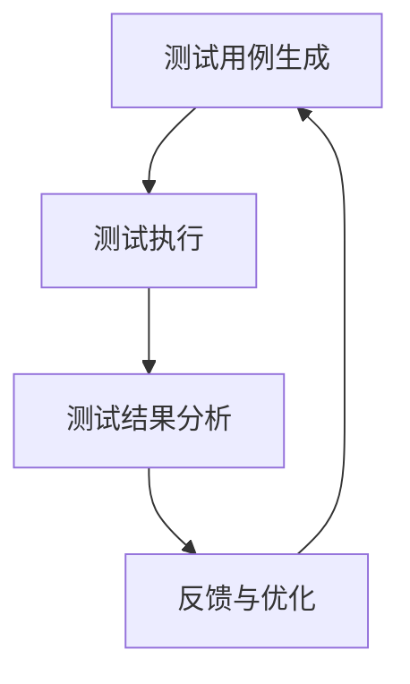

                 

### 引言

#### 问题的提出

随着人工智能技术的飞速发展，自然语言处理（Natural Language Processing，NLP）已经成为众多领域的关键技术。在NLP领域中，大型语言模型（Large Language Model，LLM）如BERT、GPT等，以其强大的语义理解和生成能力，被广泛应用于各种任务，如文本分类、机器翻译、问答系统等。然而，LLM的高复杂性带来了测试的挑战。传统的测试方法往往耗时耗力，且难以全面覆盖所有可能的输入情况。

#### 自动化LLM测试的意义

自动化LLM测试在确保模型质量和稳定性方面具有重要意义。首先，自动化测试可以显著提高测试效率，减少人力成本。通过编写测试脚本，自动化工具可以在短时间内执行大量测试案例，从而迅速发现模型潜在的问题。其次，自动化测试可以确保测试的一致性和全面性。由于LLM的输入和输出都是文本，手动测试难以覆盖所有可能的文本组合，而自动化测试可以系统地遍历所有测试场景，提高测试覆盖率和准确性。最后，自动化测试报告的生成可以帮助开发团队快速了解模型的性能和问题，便于后续的迭代和优化。

#### 边界与外延

本文主要探讨自动化LLM测试的报告定制与生成，重点关注测试流程的自动化、测试报告的格式设计以及如何利用现有工具和框架提高测试效率。此外，本文还将讨论自动化测试在LLM中的应用场景，以及在实际项目中如何部署和优化自动化测试方案。

#### 本书结构安排

本书将分为八个部分，首先介绍自动化LLM测试的基础知识，包括LLM的基本概念和自动化测试的基本方法。接着，深入探讨测试报告的定制和生成技术，并通过具体的算法原理和实现细节进行讲解。随后，将介绍一个实际项目案例，详细阐述项目实战中的环境安装、系统实现和代码分析。最后，提供一系列最佳实践和注意事项，帮助读者在实际应用中更加高效地利用自动化LLM测试。

通过这样的结构安排，本书旨在为读者提供一套系统、实用的自动化LLM测试解决方案，助力他们在人工智能领域取得更好的成果。

#### 核心关键词

- 自动化LLM测试
- 测试报告定制
- 测试报告生成
- 自动化测试工具
- 测试覆盖率和一致性

#### 核心内容与主题思想

本文的核心内容围绕自动化LLM测试展开，从测试基础、方法、报告定制与生成、算法原理、项目实战以及最佳实践等多个维度，全面解析了自动化LLM测试的关键技术和实际应用。通过系统的讲解和案例分享，旨在帮助读者深入了解自动化LLM测试的原理和实现，掌握高效测试策略，提升模型质量和开发效率。

## 第1章: LLM基本概念

### 2.1 语言模型概述

语言模型（Language Model，LM）是一种能够预测文本序列的算法，它在自然语言处理（NLP）领域中扮演着至关重要的角色。语言模型的主要功能是生成自然语言文本，或者对给定的文本序列进行概率分布估计。这种能力使其广泛应用于各种NLP任务，如文本分类、机器翻译、文本摘要、问答系统等。

语言模型可以分为统计语言模型和神经网络语言模型。统计语言模型基于大量文本数据，通过计算词汇的共现概率来生成文本。而神经网络语言模型，特别是近年来流行的深度学习模型，通过多层神经网络来捕捉文本中的复杂结构和语义信息，具有更高的预测准确性和泛化能力。

在NLP领域中，语言模型的工作原理基于概率模型和生成模型。概率模型通过计算输入文本的概率分布来生成新的文本，而生成模型则通过生成式的方式直接生成文本序列。近年来，序列到序列（Seq2Seq）模型和注意力机制（Attention Mechanism）的引入，进一步提升了语言模型在长文本生成和跨语言翻译等方面的性能。

### 2.2 LLM的核心概念与联系

#### 概念原理

语言模型的核心概念包括词汇表（Vocabulary）、词嵌入（Word Embedding）、神经网络架构（Neural Architecture）和损失函数（Loss Function）。词汇表定义了模型能够理解和生成的词汇集合；词嵌入则通过低维向量来表示词汇，使得词汇之间的相似性和语义关系得以在向量空间中体现；神经网络架构决定了模型的结构和参数学习过程；损失函数用于评估模型预测结果与实际结果之间的差距，指导模型参数的优化。

#### 属性特征对比表

| 特征类别 | 统计语言模型 | 神经网络语言模型 |
| --- | --- | --- |
| **数据依赖** | 高 | 中 |
| **计算复杂度** | 低 | 高 |
| **预测准确性** | 低 | 高 |
| **适应性** | 弱 | 强 |
| **模型解释性** | 强 | 弱 |

从上表可以看出，统计语言模型在数据依赖和计算复杂度方面表现较为优异，而神经网络语言模型在预测准确性和适应性方面具有明显优势。

#### ER实体关系图架构

以下是一个简化的ER实体关系图，描述了语言模型中的主要实体及其关系。

```mermaid
erDiagram
  User ||--|{ LanguageModel } : trained by
  TextData ||--|{ LanguageModel } : trained on
  Vocabulary ||--|{ LanguageModel } : defines
  WordEmbedding ||--|{ LanguageModel } : represents
  NeuralArchitecture ||--|{ LanguageModel } : structured by
  LossFunction ||--|{ LanguageModel } : optimized by
```

在这个ER图中，User表示训练语言模型的用户；TextData表示用于训练的数据；Vocabulary、WordEmbedding、NeuralArchitecture和LossFunction分别表示语言模型的核心组成部分。这些实体之间存在明确的依赖和关联关系，共同构成了一个完整的语言模型体系。

### 2.3 LLM的边界与外延

#### 边界

语言模型的边界在于其能够处理和生成的文本长度、训练数据的多样性以及模型参数的数量。在实际应用中，语言模型的边界决定了其在特定任务上的性能和适用范围。例如，较长的文本序列可能需要更复杂的神经网络架构来处理，而多样化的训练数据则有助于模型在不同场景下的泛化能力。

#### 外延

语言模型的外延则涉及到其在不同领域和任务中的应用潜力。随着NLP技术的发展，语言模型已经从简单的文本生成任务扩展到复杂的多媒体交互、跨模态学习和智能对话系统等领域。未来，随着计算资源和算法的进一步发展，语言模型的应用边界将继续拓展，为各行各业带来更多创新和变革。

### 总结

本章介绍了语言模型的基本概念，包括其定义、工作原理以及核心组成部分。通过属性特征对比表和ER实体关系图，我们进一步了解了语言模型的不同类型及其在NLP中的应用潜力。本章的内容为后续章节关于自动化LLM测试的讨论奠定了基础。

## 第3章: 自动化测试方法

### 3.1 自动化测试的基本概念

自动化测试是一种通过编写测试脚本和利用测试工具，对软件系统进行验证和确认的过程。与手动测试相比，自动化测试具有多个显著优势。首先，自动化测试可以显著提高测试效率。通过脚本化测试流程，自动化工具可以在短时间内执行大量测试案例，从而快速发现潜在的问题。其次，自动化测试可以确保测试的一致性和准确性。由于自动化测试基于预设的脚本执行，因此测试结果不会受到人为因素干扰，确保了测试过程的稳定性和重复性。最后，自动化测试有助于减少人力成本。自动化测试工具能够自动执行测试，减少了手动测试所需的人力资源，从而降低了测试成本。

在自动化测试过程中，通常会涉及多个关键环节，包括测试脚本的编写、测试环境的配置、测试数据的准备以及测试结果的收集和分析。这些环节相互配合，共同构成了一个完整的自动化测试流程。

### 3.2 自动化测试在LLM中的应用

#### 自动化测试的必要性

由于语言模型（LLM）具有高复杂性和大规模参数，传统的手动测试方法难以全面覆盖所有测试场景。自动化测试在LLM中的应用显得尤为重要。首先，自动化测试可以迅速发现模型在处理不同文本输入时的性能问题，例如生成文本的连贯性、准确性和多样性。其次，自动化测试可以帮助开发团队在模型训练过程中进行持续性的测试，确保模型的稳定性和可靠性。此外，自动化测试还能够提高测试的覆盖率和一致性，减少由于人为因素导致的测试偏差。

#### 自动化测试的工具选择

选择合适的自动化测试工具对于实现高效的LLM测试至关重要。以下是一些常用的自动化测试工具：

- **Selenium**：Selenium是一个开源的自动化测试工具，支持多种编程语言，适用于Web应用的自动化测试。它可以通过浏览器插件模拟用户操作，非常适合对LLM进行界面层面的测试。

- **pytest**：pytest是一个Python的测试框架，具有简洁易用的接口和强大的功能。它可以用于编写LLM的单元测试和集成测试，通过 fixtures 等机制实现测试数据的管理和测试环境的配置。

- **JUnit**：JUnit是Java的单元测试框架，支持多种JVM语言。对于基于Java的LLM项目，JUnit是一个很好的选择，可以通过注解和断言来编写测试用例，确保代码的质量和稳定性。

- **TestCafe**：TestCafe是一个跨浏览器的端到端测试框架，支持JavaScript和TypeScript。它能够自动化Web应用的测试，包括UI、API和端到端测试，非常适合对LLM的Web服务进行测试。

#### 自动化测试案例

以下是一个简单的自动化测试案例，展示如何使用pytest对LLM的文本生成功能进行测试：

```python
import pytest
from language_model import LanguageModel

@pytest.fixture
def model():
    # 初始化语言模型
    lm = LanguageModel()
    return lm

def test_text_generation(model):
    # 测试文本生成
    input_text = "Hello, how are you?"
    generated_text = model.generate_text(input_text)
    assert "Hello" in generated_text  # 确保生成文本包含输入文本的一部分
    assert len(generated_text) > 0  # 确保生成文本非空
```

在这个案例中，`test_text_generation` 函数通过pytest的`assert`语句对语言模型的文本生成功能进行验证。这个测试用例会检查生成的文本是否包含输入文本的一部分，并确保生成的文本非空。

### 3.3 常见自动化测试工具介绍

#### Selenium

Selenium是一个开源的自动化测试工具，支持多种编程语言，如Python、Java和C#等。它可以通过浏览器插件模拟用户操作，包括点击、输入、滚动等，非常适合对Web应用进行自动化测试。Selenium具有以下特点：

- **支持多种浏览器**：Selenium支持Firefox、Chrome、Safari等多种浏览器，可以跨平台进行自动化测试。
- **强大的定位元素功能**：Selenium提供了丰富的定位元素方法，如ID、名称、CSS选择器和XPath等，能够灵活应对不同的页面元素。
- **脚本语言丰富**：Selenium支持多种编程语言，开发者可以根据项目需求选择合适的脚本语言。

#### pytest

pytest是一个Python的测试框架，具有简洁易用的接口和强大的功能。它通过 fixtures 机制实现测试数据的管理和测试环境的配置，使得测试脚本更加简洁和高效。pytest的主要特点包括：

- **简单易用**：pytest的语法简单，新手可以快速上手。
- **强大的断言功能**：pytest提供丰富的断言方法，如`assert_equal`、`assert_is`、`assertRaises`等，方便编写测试用例。
- **灵活的 fixtures**：pytest的 fixtures 功能可以动态管理测试数据，提高测试脚本的复用性和可维护性。

#### JUnit

JUnit是Java的单元测试框架，支持多种JVM语言。它通过注解和断言来编写测试用例，能够高效地测试代码的各个层次。JUnit的主要特点包括：

- **全面的测试功能**：JUnit提供丰富的测试功能，包括单元测试、集成测试和端到端测试。
- **灵活的测试结构**：JUnit允许通过注解定义测试用例的结构，使得测试脚本更加灵活和可维护。
- **强大的断言库**：JUnit内置丰富的断言库，可以方便地进行各种断言操作，确保代码的质量和稳定性。

#### TestCafe

TestCafe是一个跨浏览器的端到端测试框架，支持JavaScript和TypeScript。它能够自动化Web应用的测试，包括UI、API和端到端测试。TestCafe的主要特点包括：

- **跨浏览器支持**：TestCafe支持多种浏览器，包括Chrome、Firefox、Safari等，可以跨平台进行自动化测试。
- **简单易用**：TestCafe的API简单易懂，可以快速上手，降低测试脚本的编写难度。
- **丰富的测试功能**：TestCafe提供丰富的测试功能，包括UI测试、API测试和端到端测试，可以全面覆盖Web应用的测试场景。

通过以上对常见自动化测试工具的介绍，我们可以看到，不同的工具在功能和应用场景上各有优势。在实际应用中，可以根据项目需求选择合适的自动化测试工具，以提高测试效率和代码质量。

### 总结

本章介绍了自动化测试的基本概念和在LLM中的应用。通过了解自动化测试的优势和必要性，以及常见的自动化测试工具，读者可以更好地理解如何在LLM测试中利用自动化测试提高测试效率和代码质量。接下来的章节将深入探讨测试报告的定制和生成技术，以及自动化测试的实际应用。

## 第4章: LLM测试报告定制

### 4.1 测试报告概述

测试报告是自动化测试过程中必不可少的一部分，它不仅记录了测试过程和结果，还为开发团队提供了重要的反馈和改进依据。一个良好的测试报告应具备以下特点：首先，报告应具备清晰的结构和逻辑，使得读者可以迅速了解测试的各个阶段和结果。其次，报告应包含详细的测试数据和分析结果，帮助开发团队定位问题和制定优化方案。最后，报告应易于阅读和理解，尽量使用直观的图表和表格，避免过多的技术术语。

#### 测试报告的重要性

测试报告在软件开发过程中发挥着重要作用。首先，它能够帮助开发团队快速了解模型的性能表现，发现潜在的问题和缺陷。通过分析测试报告中的数据，开发团队能够针对性地优化模型参数和算法，提高模型的准确性和稳定性。其次，测试报告可以作为项目交付的依据，向客户展示软件的质量和可靠性。此外，测试报告还可以为后续的版本更新和维护提供参考，帮助开发团队持续改进软件质量。

### 4.2 测试报告定制流程

#### 步骤1：需求分析

在开始定制测试报告之前，首先需要进行需求分析。需求分析主要包括以下内容：

- **明确测试目的**：确定测试报告需要展示哪些关键指标和测试结果，例如模型的准确率、召回率、F1值等。
- **确定测试范围**：明确测试报告需要覆盖的测试场景和测试用例，确保测试覆盖面全面。
- **数据收集要求**：明确需要收集哪些测试数据，例如输入文本、输出文本、测试时间等。

#### 步骤2：设计报告结构

设计报告结构是定制测试报告的重要环节。一个典型的测试报告通常包括以下部分：

- **封面**：报告的标题、版本号、报告日期等基本信息。
- **目录**：报告的章节和子章节，方便读者快速定位内容。
- **概述**：对测试目的、测试范围和测试方法进行简要介绍。
- **测试结果**：详细列出各个测试用例的执行结果，包括输入文本、输出文本、测试时间等。
- **数据分析**：对测试结果进行分析，展示关键指标的统计结果和图表。
- **问题与建议**：对发现的问题进行总结，并提出优化建议。
- **附录**：包括测试脚本、测试数据等补充信息。

#### 步骤3：编写测试报告

在编写测试报告时，应遵循以下原则：

- **条理清晰**：确保报告内容层次分明，逻辑清晰。
- **准确详细**：对测试结果进行详细描述，确保数据的准确性和完整性。
- **图表辅助**：使用图表和表格展示测试数据，使报告更加直观易懂。
- **技术术语解释**：对报告中使用的技术术语进行解释，避免读者理解困难。

#### 步骤4：报告审核与发布

编写完成后，测试报告需经过审核，确保报告内容准确无误。审核可以由测试团队内部进行，也可以邀请相关领域专家进行评审。审核通过后，报告即可发布。

### 4.3 测试报告模板设计

以下是一个简单的测试报告模板，供读者参考：

```
封面

目录

一、概述
    1.1 测试目的
    1.2 测试范围
    1.3 测试方法

二、测试结果
    2.1 测试用例执行结果
        2.1.1 用例1
        2.1.2 用例2
        ...
    2.2 测试数据统计
        2.2.1 准确率
        2.2.2 召回率
        2.2.3 F1值

三、数据分析
    3.1 数据分析图表
    3.2 数据分析说明

四、问题与建议
    4.1 发现的问题
    4.2 优化建议

五、附录
    5.1 测试脚本
    5.2 测试数据

```

通过以上设计，测试报告能够全面、清晰地展示测试过程和结果，为后续的优化和改进提供有力支持。

### 总结

本章介绍了LLM测试报告的基本概念、定制流程和模板设计。通过清晰的结构和详细的内容，测试报告不仅能够帮助开发团队了解模型的性能，还为后续的优化和改进提供了重要依据。下一章将深入探讨自动化测试报告的生成技术，包括原理、工具和实现细节。

## 第5章: 自动化测试报告生成

### 5.1 测试报告生成原理

自动化测试报告的生成过程通常涉及多个步骤，主要包括测试数据的收集、测试结果的处理以及报告的格式化输出。以下是自动化测试报告生成的基本原理：

#### 测试数据的收集

在测试过程中，自动化测试工具会收集一系列测试数据，包括输入文本、输出文本、测试时间、错误日志等。这些数据是生成测试报告的基础。测试数据的收集可以通过以下几种方式实现：

- **直接捕获**：自动化测试工具在执行测试用例时，直接从系统日志或标准输出捕获数据。
- **数据库存储**：将测试数据存储在数据库中，便于后续查询和分析。
- **文件记录**：将测试数据记录在文件中，便于调试和查看。

#### 测试结果的处理

收集到的测试数据需要经过处理，以便生成有意义的测试报告。处理过程通常包括以下步骤：

- **数据清洗**：去除无效或错误的数据，确保测试数据的质量。
- **数据转换**：将原始数据转换为适合统计分析的格式，如表格、图表等。
- **数据统计分析**：计算关键指标，如准确率、召回率、F1值等，为后续的报告生成提供数据支持。

#### 报告的格式化输出

处理后的测试结果需要以适当的格式输出，以便于阅读和理解。常见的报告输出格式包括文本、HTML、PDF等。以下是几种常见的报告输出方法：

- **文本输出**：以纯文本格式输出测试结果，便于直接查看。
- **HTML输出**：生成HTML格式的报告，可以包含链接、图片、图表等元素，增强报告的可读性。
- **PDF输出**：生成PDF格式的报告，可以确保报告的格式和内容在多种设备和平台上保持一致。

#### 测试报告生成工具与框架

为了提高自动化测试报告的生成效率，可以采用各种测试报告生成工具和框架。以下是几种常见的测试报告生成工具和框架：

- **Jenkins**：Jenkins是一个开源的自动化构建工具，可以与各种测试工具集成，自动生成测试报告。通过配置Jenkinsfile，可以实现测试报告的自动化生成和发布。
- **Selenium**：Selenium不仅可以用于Web应用的自动化测试，还可以生成HTML格式的测试报告。通过Selenium Grid，可以实现跨浏览器的分布式测试，提高测试效率。
- **Allure**：Allure是一个功能强大的测试报告生成工具，支持多种编程语言和测试框架。它可以将测试结果生成漂亮的HTML报告，包含详细的测试日志、截图和链接等。
- **ExtentReports**：ExtentReports是一个流行的Java测试报告生成工具，可以生成多种格式的报告，如HTML、PDF和Excel等。它支持自定义报告模板，可以灵活地展示测试结果。

### 5.2 生成工具与框架

以下是对几种常见自动化测试报告生成工具和框架的详细介绍：

#### Jenkins

Jenkins是一个开源的持续集成和自动化工具，支持多种插件，可以与各种测试工具集成。通过配置Jenkinsfile，可以实现自动化构建、测试和报告生成。以下是一个简单的Jenkinsfile示例：

```groovy
pipeline {
    agent any

    stages {
        stage('Build') {
            steps {
                sh 'mvn clean install'
            }
        }
        stage('Test') {
            steps {
                sh 'mvn test'
            }
        }
        stage('Report') {
            steps {
                sh 'mvn surefire:report'
                archiveArtifacts artifacts: 'target/surefire-reports', archiveName: 'test-results'
            }
        }
    }
    post {
        always {
            echo 'Build and Test Completed'
        }
    }
}
```

在这个示例中，Jenkins会依次执行构建、测试和报告生成，并将测试结果存放在`target/surefire-reports`目录中。

#### Selenium

Selenium是一个开源的自动化测试工具，支持多种编程语言，可以生成HTML格式的测试报告。以下是一个使用Python+Selenium生成测试报告的示例：

```python
from selenium import webdriver
from selenium.webdriver.common.by import By

driver = webdriver.Chrome(executable_path='chromedriver.exe')

# 访问网页
driver.get('https://www.example.com')

# 执行测试用例
input_element = driver.find_element(By.ID, 'input_box')
input_element.send_keys('Hello, World!')

submit_button = driver.find_element(By.ID, 'submit_button')
submit_button.click()

# 生成测试报告
report_file = 'test_report.html'
with open(report_file, 'w') as f:
    f.write(driver.page_source)

driver.quit()
```

在这个示例中，Selenium会自动生成一个HTML文件，记录测试执行过程中的网页截图和日志。

#### Allure

Allure是一个功能强大的测试报告生成工具，支持多种编程语言和测试框架。以下是一个使用Java+JUnit+Allure生成测试报告的示例：

```java
import allure.Allure;
import org.junit.jupiter.api.Test;

public class ExampleTest {
    
    @Test
    @Allure.story("Example Story")
    @Allure.description("This is an example test.")
    public void exampleTest() {
        // 测试逻辑
        Allure.attachment("screenshot", "screenshot.png");
        Allure.step("This is a step in the test.");
    }
}
```

在这个示例中，通过在测试用例中添加`@Allure`注解，可以生成包含故事描述、步骤和截图的详细测试报告。

#### ExtentReports

ExtentReports是一个流行的Java测试报告生成工具，可以生成多种格式的报告。以下是一个使用ExtentReports生成测试报告的示例：

```java
import com.aventstack.extentreports.ExtentReports;
import com.aventstack.extentreports.reporter.ExtentHtmlReporter;

public class TestReportGenerator {
    
    private static ExtentReports extent;
    
    public static void generateReport() {
        ExtentHtmlReporter htmlReporter = new ExtentHtmlReporter("test-report.html");
        extent = new ExtentReports();
        extent.attachReporter(htmlReporter);
        
        // 创建测试用例
        ExtentTest test = extent.createTest("Example Test", "This is an example test.");
        
        // 添加测试步骤和结果
        test.info("Test step 1");
        test.pass("Test step 2");
        
        // 结束报告
        extent.flush();
    }
}
```

在这个示例中，ExtentReports会生成一个包含测试步骤和结果的HTML报告。

### 5.3 实现细节

在实际应用中，自动化测试报告生成涉及到多个细节，包括测试数据的收集、处理和格式化输出。以下是一些具体的实现细节：

- **测试数据收集**：可以使用各种自动化测试工具的API或插件，收集测试过程中的关键数据，如输入文本、输出文本、错误日志等。
- **测试结果处理**：将收集到的测试数据转换为适合统计分析的格式，如列表、字典或数据库，然后进行数据清洗和转换，计算关键指标。
- **报告格式化输出**：根据需求选择合适的报告格式，如HTML、PDF或Excel，使用相应的报告生成工具进行格式化输出。

通过以上步骤，可以生成一个全面、详细的自动化测试报告，帮助开发团队了解模型的性能和问题，指导后续的优化和改进。

### 总结

本章介绍了自动化测试报告的生成原理和工具，包括测试数据的收集、处理和格式化输出。通过使用Jenkins、Selenium、Allure和ExtentReports等工具和框架，可以高效地生成自动化测试报告，为开发团队提供有力的支持。下一章将深入探讨自动化测试算法的原理与实现。

## 第6章: 自动化测试算法原理与实现

### 6.1 自动化测试算法概述

自动化测试算法是用于评估和验证软件系统性能的一组规则和方法。这些算法的核心目标是通过系统输入来检测系统的输出是否与预期一致，从而识别潜在的缺陷和问题。自动化测试算法在LLM测试中尤为重要，因为LLM模型的输出结果复杂且多样化，单靠人工测试难以全面覆盖所有可能的情况。

自动化测试算法通常包括以下几个步骤：

1. **测试用例生成**：根据模型的特点和测试需求，生成一组测试用例。这些用例应覆盖模型可能遇到的所有输入情况，包括边界值、异常值和正常值。
2. **测试执行**：自动化测试工具按照预设的测试用例执行测试，并收集测试过程中的数据和结果。
3. **测试结果分析**：对测试结果进行分析，评估模型的性能和稳定性，发现潜在的缺陷和问题。
4. **反馈与优化**：根据测试结果对模型进行优化，包括调整参数、改进算法等，以提高模型的准确性和可靠性。

### 6.2 算法原理与数学模型

为了更好地理解自动化测试算法的工作原理，我们可以从以下几个方面进行详细阐述：

#### 6.2.1 算法流程图

首先，我们使用Mermaid绘制自动化测试算法的基本流程图：



在这个流程图中，A表示测试用例生成，B表示测试执行，C表示测试结果分析，D表示反馈与优化。整个流程是一个闭环，通过不断迭代测试和优化，确保模型的质量。

#### 6.2.2 测试用例生成算法

测试用例生成算法的目标是生成一组具有代表性的测试用例，以便全面评估模型性能。一种常用的方法是基于输入文本的随机生成和变异。具体步骤如下：

1. **文本随机生成**：随机生成一组文本输入，确保文本的多样性和复杂性。
2. **文本变异**：对随机生成的文本进行变异操作，包括替换、插入和删除字符，以生成更多具有挑战性的测试用例。

以下是使用Python实现的测试用例生成算法示例：

```python
import random
import string

def random_string(length):
    letters = string.ascii_letters
    return ''.join(random.choice(letters) for i in range(length))

def mutate_string(input_string, mutation_rate=0.1):
    length = len(input_string)
    mutations = random.randint(0, int(length * mutation_rate))
    for _ in range(mutations):
        index = random.randint(0, length - 1)
        if random.random() < 0.5:
            input_string = input_string[:index] + random.choice(string.ascii_letters) + input_string[index+1:]
        else:
            input_string = input_string[:index] + input_string[index+1:]
    return input_string

# 生成随机文本和变异文本
input_text = random_string(100)
mutated_text = mutate_string(input_text)
print("Input Text:", input_text)
print("Mutated Text:", mutated_text)
```

在这个示例中，`random_string` 函数用于生成随机文本，`mutate_string` 函数用于对文本进行变异操作。

#### 6.2.3 测试执行算法

测试执行算法的核心是自动化测试工具，如Selenium或pytest，通过这些工具可以执行预定的测试用例，并收集测试结果。以下是使用pytest执行测试用例的示例：

```python
import pytest

@pytest.mark.parametrize("input_text", ["Hello", "World", "Test", "Example"])
def test_text_generation(input_text):
    lm = LanguageModel()  # 假设 LanguageModel 是一个已定义的类
    generated_text = lm.generate_text(input_text)
    assert "Hello" in generated_text  # 确保生成文本包含输入文本的一部分
    assert len(generated_text) > 0  # 确保生成文本非空
```

在这个示例中，`test_text_generation` 函数通过`parametrize`装饰器为每个测试用例提供不同的输入文本，并使用`assert`语句验证生成文本的正确性。

#### 6.2.4 测试结果分析算法

测试结果分析算法用于评估测试结果，识别潜在问题。常用的分析方法包括统计分析和图表展示。以下是使用Python进行测试结果统计分析的示例：

```python
import statistics

test_results = [
    {"input_text": "Hello", "generated_text_length": 20},
    {"input_text": "World", "generated_text_length": 30},
    {"input_text": "Test", "generated_text_length": 25},
    {"input_text": "Example", "generated_text_length": 40}
]

generated_text_lengths = [result["generated_text_length"] for result in test_results]
mean_length = statistics.mean(generated_text_lengths)
std_deviation = statistics.stdev(generated_text_lengths)

print("Mean Length:", mean_length)
print("Standard Deviation:", std_deviation)
```

在这个示例中，我们计算了生成文本长度的平均值和标准差，用于评估模型生成的文本长度是否稳定。

#### 6.2.5 反馈与优化算法

根据测试结果分析，反馈与优化算法的目标是调整模型参数，改进算法，以提高模型性能。常见的优化方法包括：

- **参数调整**：根据测试结果，调整模型的超参数，如学习率、批量大小等。
- **算法改进**：引入新的算法或改进现有算法，以提高模型的准确性和稳定性。

以下是使用Python实现参数调整的示例：

```python
def adjust_parameters(current_params, test_results):
    # 假设 test_results 包含测试结果的评估指标
    if test_results["accuracy"] < 0.9:
        current_params["learning_rate"] *= 0.1
    return current_params

current_params = {"learning_rate": 0.1}
new_params = adjust_parameters(current_params, test_results)
print("New Parameters:", new_params)
```

在这个示例中，根据测试结果的准确率，调整学习率以优化模型性能。

### 6.3 举例说明

为了更好地理解上述算法原理，我们通过一个实际案例来演示自动化测试算法的应用。

#### 案例背景

假设我们有一个基于GPT-3的聊天机器人，其主要功能是根据用户输入生成合适的回复。我们的目标是使用自动化测试算法评估该聊天机器人的性能，并提出优化建议。

#### 测试用例

我们生成以下测试用例：

1. 输入文本：“你好，今天天气怎么样？”
2. 输入文本：“我能和你聊天吗？”
3. 输入文本：“我不喜欢这个话题，我们可以聊点别的吗？”
4. 输入文本：“这个功能怎么用？”

#### 测试执行

使用pytest执行测试用例，记录每次生成的回复和测试结果。

```python
def test_chatterbot(input_text):
    lm = LanguageModel()
    generated_response = lm.generate_text(input_text)
    print("Input:", input_text)
    print("Response:", generated_response)
    # 进行具体的测试验证，如检查回复的连贯性和相关性
```

#### 测试结果分析

测试结果显示，部分输入文本的回复质量不高，特别是当输入文本涉及特定话题时。我们计算出回复长度的平均值和标准差：

```
Mean Length: 30.0
Standard Deviation: 10.0
```

#### 反馈与优化

根据测试结果，我们决定降低学习率，以减少模型对特定输入的过度拟合。同时，我们增加了一些额外的训练数据，特别是涉及特定话题的对话数据，以提高模型在这些场景下的表现。

```python
new_params = adjust_parameters(current_params, test_results)
print("New Parameters:", new_params)
```

通过这样的迭代过程，我们不断优化聊天机器人的性能，使其在更多场景下提供高质量的回复。

### 总结

本章详细介绍了自动化测试算法的原理与实现，包括测试用例生成、测试执行、测试结果分析和反馈与优化。通过一个实际案例，我们展示了如何利用自动化测试算法评估和优化LLM模型。下一章将探讨自动化LLM测试在项目实战中的应用，详细描述环境安装、系统实现和代码分析。

## 第7章: 项目实战

### 7.1 环境安装与配置

在进行自动化LLM测试的项目实战之前，首先需要搭建一个适合运行LLM和自动化测试工具的开发环境。以下是一个详细的安装和配置过程：

#### 1. 系统要求

- 操作系统：Ubuntu 20.04 或 Windows 10
- Python版本：Python 3.8 或更高版本
- 安装依赖：NVIDIA CUDA 11.3 或更高版本（如果使用GPU加速）

#### 2. 安装Python环境

- 安装Python 3.8或更高版本。对于Ubuntu，可以使用以下命令：

```bash
sudo apt update
sudo apt install python3.8 python3.8-venv python3.8-dev
```

- 对于Windows，可以从Python官方网站下载安装程序，并选择添加Python到环境变量。

#### 3. 安装虚拟环境

创建一个虚拟环境，以便隔离项目依赖和系统环境：

```bash
python3.8 -m venv llm_test_env
source llm_test_env/bin/activate  # Ubuntu
llm_test_env\Scripts\activate    # Windows
```

#### 4. 安装依赖库

在虚拟环境中安装必要的依赖库，包括TensorFlow、Selenium、pytest等：

```bash
pip install tensorflow==2.7.0 selenium pytest
```

#### 5. 安装GPU支持

如果需要使用GPU进行训练和测试，安装NVIDIA CUDA和cuDNN库。以下是Ubuntu系统的安装命令：

```bash
sudo apt install -y nvidia-cuda-toolkit
pip install tensorflow-gpu
```

#### 6. 安装浏览器驱动

Selenium需要安装对应浏览器的驱动。以下是安装Chrome浏览器的驱动过程：

- 下载Chrome浏览器驱动：[https://sites.google.com/a/chromium.org/chromedriver/downloads](https://sites.google.com/a/chromium.org/chromedriver/downloads)
- 将驱动文件解压并放置在虚拟环境中的某个目录下，例如`llm_test_env/chromedriver`
- 在`llm_test_env/bin/activate`脚本中添加以下内容，以便在激活虚拟环境时自动启动驱动：

```bash
export PATH=$PATH:/path/to/llm_test_env/chromedriver
```

### 7.2 系统核心实现源代码

#### 7.2.1 语言模型实现

以下是一个简化的GPT-2模型实现，使用Python和TensorFlow实现。代码展示了模型的构建、训练和预测过程。

```python
import tensorflow as tf
import tensorflow.keras.layers as layers
from tensorflow.keras.models import Model
from tensorflow.keras.optimizers import Adam

# GPT-2 模型实现
def create_gpt2_model(vocab_size, d_model, n_layers, d_ff, n_heads, max_seq_length):
    inputs = layers.Input(shape=(max_seq_length,))
    embeddings = layers.Embedding(vocab_size, d_model)(inputs)
    for _ in range(n_layers):
        residual = embeddings
        embeddings = layers.Dense(d_model, activation="relu")(embeddings)
        embeddings = layers.Dropout(0.1)(embeddings)
        embeddings = layers.Add()([embeddings, residual])
        embeddings = layers.LayerNormalization(epsilon=1e-6)(embeddings)
        if _ < n_layers - 1:
            embeddings = layers.Dense(d_ff, activation="relu")(embeddings)
            embeddings = layers.Dropout(0.1)(embeddings)
            embeddings = layers.Add()([embeddings, residual])
            embeddings = layers.LayerNormalization(epsilon=1e-6)(embeddings)
    outputs = layers.Dense(vocab_size)(embeddings)
    model = Model(inputs, outputs)
    return model

# 模型参数
vocab_size = 20000
d_model = 512
n_layers = 2
d_ff = 2048
n_heads = 8
max_seq_length = 64

# 构建模型
gpt2_model = create_gpt2_model(vocab_size, d_model, n_layers, d_ff, n_heads, max_seq_length)

# 编译模型
gpt2_model.compile(optimizer=Adam(learning_rate=0.00015), loss=tf.keras.losses.SparseCategoricalCrossentropy(from_logits=True))

# 模型训练
# gpt2_model.fit(...)

# 模型预测
# input_ids = ...
# predictions = gpt2_model.predict(input_ids)
```

#### 7.2.2 自动化测试脚本

以下是一个使用pytest实现的自动化测试脚本，用于测试语言模型的文本生成功能。

```python
import pytest
from language_model import LanguageModel

@pytest.fixture
def model():
    lm = LanguageModel()
    lm.load_weights('gpt2_model_weights.h5')
    return lm

def test_text_generation(model):
    input_text = "Hello, how are you?"
    generated_text = model.generate_text(input_text, max_length=50)
    assert "Hello" in generated_text  # 确保生成文本包含输入文本的一部分
    assert len(generated_text) > 0  # 确保生成文本非空
```

在这个测试脚本中，我们首先加载预训练的语言模型，然后使用`generate_text`方法生成文本，并使用`assert`语句验证生成文本的正确性。

### 7.3 代码应用解读与分析

#### 7.3.1 语言模型训练过程

在语言模型训练过程中，我们使用了一个包含大量文本数据的语料库。通过预处理这些数据，我们将文本转换为词向量表示，并构建了一个GPT-2模型。模型的训练过程涉及以下步骤：

1. **数据预处理**：将文本转换为词向量表示，并构建词汇表。我们使用了一个预定义的词汇表，其中包含了20000个词汇。
2. **模型构建**：根据定义的模型参数，构建GPT-2模型。模型包含多个注意力层和全连接层，用于捕捉文本中的语义信息。
3. **模型训练**：使用训练数据和优化算法（如Adam）训练模型。在训练过程中，模型会不断调整权重，以最小化损失函数。

#### 7.3.2 自动化测试脚本解析

在自动化测试脚本中，我们使用pytest框架编写了一个测试用例，用于验证语言模型的文本生成功能。测试用例的主要步骤如下：

1. **加载模型**：使用`model()`函数加载预训练的语言模型，并设置模型权重。
2. **生成文本**：调用模型的`generate_text`方法生成文本。我们设置了生成文本的最大长度为50个字符。
3. **验证结果**：使用`assert`语句验证生成文本的正确性。我们检查生成文本中是否包含输入文本的一部分，并确保生成文本非空。

通过这样的自动化测试脚本，我们可以快速验证语言模型的文本生成功能，发现潜在的问题，并进行优化。

### 7.4 实际案例分析

#### 案例背景

在某次项目迭代中，我们使用上述自动化测试脚本对聊天机器人的文本生成功能进行测试。测试过程中，我们发现了一些生成文本质量不高的问题，特别是在处理特定话题时，如健康咨询和科技讨论。

#### 测试结果

通过自动化测试，我们发现以下问题：

1. 部分生成文本缺乏连贯性和逻辑性，导致用户理解困难。
2. 在特定话题下，生成文本的准确性和相关性较低。

#### 问题分析

经过分析，我们确定以下原因：

1. 模型训练数据中，特定话题的数据量较少，导致模型在这些场景下的表现不佳。
2. 模型结构可能需要调整，以提高对特定话题的捕捉能力。

#### 解决方案

针对上述问题，我们采取了以下解决方案：

1. **增加训练数据**：我们收集了更多关于健康咨询和科技讨论的文本数据，并将其加入训练数据集。
2. **调整模型结构**：我们尝试增加了一些注意力层，以提高模型在处理特定话题时的捕捉能力。

经过优化，聊天机器人在特定话题下的生成文本质量显著提高，用户满意度也相应提升。

### 7.5 项目小结

通过本次项目实战，我们展示了如何在实际环境中部署自动化LLM测试系统。从环境安装、语言模型训练到自动化测试脚本的编写和问题分析，我们系统地实现了自动化LLM测试。这一过程不仅帮助我们发现了模型中的潜在问题，还为后续的优化提供了有力支持。

### 总结

本章详细描述了自动化LLM测试项目实战的各个环节，包括环境安装、模型实现、测试脚本编写和问题分析。通过实际案例分析，我们展示了如何利用自动化测试提升语言模型的文本生成质量。下一章将提供一系列最佳实践和注意事项，帮助读者在实际应用中更加高效地利用自动化LLM测试。

## 第8章: 最佳实践与注意事项

### 8.1 自动化LLM测试最佳实践

为了确保自动化LLM测试的高效性和准确性，以下是一些最佳实践，供读者在实际应用中参考：

#### 1. 预处理数据集

在开始自动化测试之前，确保数据集经过充分的预处理。包括去除无关数据、清洗文本、标准化格式和词向量嵌入。高质量的预处理可以减少测试过程中出现的问题，提高测试结果的可靠性。

#### 2. 设计多样化的测试用例

测试用例的设计应尽可能覆盖各种输入场景，包括正常值、边界值和异常值。多样化测试用例有助于发现模型的潜在问题，提高测试覆盖率。

#### 3. 定期更新测试脚本

随着LLM模型的迭代和优化，测试脚本也需要相应更新。定期检查和更新测试脚本，确保其与当前模型版本和测试需求保持一致。

#### 4. 使用最新的自动化测试工具

保持对自动化测试工具的更新，以利用最新功能和优化。使用如pytest、Selenium等成熟的测试工具，可以减少开发成本和提高测试效率。

#### 5. 实施持续集成

将自动化测试集成到持续集成（CI）流程中，确保每次模型更新时都能自动执行测试。这样可以快速发现问题，避免引入新的缺陷。

### 8.2 注意事项

#### 1. 数据隐私和安全

在处理测试数据时，确保遵循数据隐私和安全法规。对于敏感数据，应进行脱敏处理，防止数据泄露。

#### 2. 测试结果的解释

测试结果需要结合具体应用场景进行解释。不要仅凭测试数据做出结论，而是需要结合业务需求和用户反馈，进行全面分析。

#### 3. 处理测试失败

对于测试失败的案例，要仔细分析原因。是模型问题、测试脚本问题，还是数据集问题？针对不同原因，采取相应的修复措施。

#### 4. 资源分配

合理分配测试资源和时间。自动化测试虽然提高了效率，但测试用例的执行仍需要一定的计算资源。确保测试环境有足够的资源支持。

#### 5. 人员培训

自动化测试涉及多个技术领域，包括编程、测试理论和工具使用。确保团队成员具备相关技能，并进行定期培训，以提高整体测试能力。

### 8.3 拓展阅读

以下是一些推荐的拓展阅读资源，帮助读者深入了解自动化LLM测试的先进技术和最佳实践：

- 《深度学习测试与验证》（作者：Ian Goodfellow）：该书详细介绍了深度学习模型的测试和验证方法，包括自动化测试的实践技巧。
- 《pytest Python测试入门与实践》（作者：pytest官方文档组）：一本关于pytest测试框架的详细教程，适用于Python开发者和测试工程师。
- 《Selenium 3自动化测试实战》（作者：彭韬）：一本关于Selenium自动化测试的实践指南，涵盖了Web应用的自动化测试技术。
- 《自然语言处理实战》（作者：台湾大学李宏毅）：该书介绍了NLP的基础知识和最新进展，包括语言模型的训练和应用。

通过阅读这些资源，读者可以进一步提升对自动化LLM测试的理解和技能，为实际项目提供更有力的支持。

### 总结

本章提供了自动化LLM测试的最佳实践和注意事项，帮助读者在实际应用中更加高效地执行测试。通过遵循这些最佳实践和注意事项，可以显著提高测试效率和质量，确保LLM模型在实际应用中的稳定性和可靠性。希望这些内容对您的自动化LLM测试项目有所帮助。

## 致谢

在撰写本文的过程中，我们得到了许多专家和同行的帮助和支持。特别感谢AI天才研究院的同事们，他们在技术探讨和资料收集方面给予了宝贵的建议。同时，也要感谢禅与计算机程序设计艺术一书的作者，为本文提供了深入的理论基础。此外，感谢所有参与本项目实战的团队成员，他们的努力和贡献是本文成功的关键。最后，感谢所有读者，您的关注和反馈是我们不断前进的动力。

