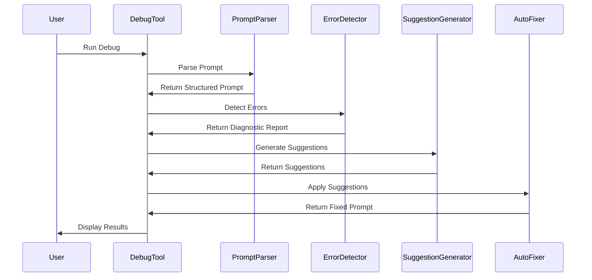

                 

### 文章标题

# 自动化Prompt Debug工具

> 关键词：自动化，Prompt Debug，调试工具，软件开发，AI应用，机器学习

> 摘要：
本文将深入探讨自动化Prompt Debug工具的概念、架构设计、实现细节以及实际应用。通过分析自动化和调试工具的基本概念，介绍Prompt Debug工具的设计原则与功能实现，详细讲解其实现过程中的系统要求、技术细节和调试流程，最后通过案例分析展示其在AI聊天机器人等场景中的应用效果。文章旨在为开发者和研究人员提供一个全面的技术指南，助力高效解决Prompt Debug相关问题。

----------------------------------------------------------------

### 背景介绍

#### 核心概念术语说明

在探讨自动化Prompt Debug工具之前，我们需要明确一些核心概念和术语。

- **自动化（Automation）**：自动化是指通过技术手段，使原本需要人工完成的工作实现自动化运行。在软件开发中，自动化工具可以大幅提高开发效率，减少人为错误。
- **Prompt Debug**：Prompt Debug是针对机器学习模型中的输入提示（Prompt）进行调试的过程。由于机器学习模型的复杂性和不确定性，Prompt的质量直接影响到模型的性能，因此Prompt Debug在模型开发过程中至关重要。
- **调试工具（Debugging Tool）**：调试工具是软件开发中用于发现、诊断和修复代码错误（Bug）的工具。对于复杂的软件系统，调试工具是确保代码质量和系统稳定性的关键。

#### 问题背景

在人工智能（AI）和机器学习（ML）领域，模型的质量和性能受到输入数据、训练过程、超参数设置等多个因素的影响。其中，输入提示（Prompt）作为模型输入的重要组成部分，其质量对模型的表现有着直接影响。然而，Prompt的设计和调试过程通常复杂且耗时，需要大量的人工干预。随着AI应用场景的多样化和复杂性增加，传统的手工调试方法已难以满足需求，迫切需要一种自动化工具来辅助Prompt调试。

#### 问题描述

Prompt Debug工具旨在解决以下几个问题：

1. **效率低下**：传统的手工调试方法需要开发人员逐一检查和修改Prompt，费时费力。
2. **错误发现难度大**：在复杂模型中，Prompt的小误差可能会导致严重的问题，手工调试难以发现这些细微错误。
3. **一致性差**：不同开发人员对Prompt的调试标准可能不一致，导致模型性能波动。

#### 问题解决

自动化Prompt Debug工具通过以下方式解决上述问题：

1. **自动化分析**：工具能够自动分析Prompt的结构和内容，识别潜在问题。
2. **智能建议**：工具可以根据分析结果提供改进Prompt的智能建议。
3. **自动化修复**：部分工具可以实现自动修复，减少人工干预。

#### 边界与外延

自动化Prompt Debug工具的应用不仅限于AI和ML领域，还可以扩展到其他需要输入提示的场景，如自然语言处理（NLP）、自动化测试等。此外，工具的设计和实现需要考虑多种编程语言和框架的支持，以确保其通用性和可扩展性。

#### 概念结构与核心要素组成

自动化Prompt Debug工具的核心要素包括：

1. **Prompt解析器**：用于读取和分析Prompt的结构和内容。
2. **错误检测引擎**：用于识别Prompt中的潜在问题。
3. **建议生成器**：基于检测到的错误，提供改进Prompt的建议。
4. **自动修复模块**：部分工具集成了自动修复功能，可以自动调整Prompt以优化模型性能。

通过这些核心要素的有机结合，自动化Prompt Debug工具能够显著提高开发效率和模型质量。

### 核心概念与联系

#### 核心概念原理

自动化Prompt Debug工具的核心在于其能够自动分析和优化输入提示（Prompt）。以下是该工具的关键概念原理：

1. **Prompt结构分析**：工具需要解析Prompt的结构，识别其中包含的信息和数据类型。
2. **错误检测与诊断**：通过分析Prompt的结构和内容，工具可以检测出可能的错误，并提供诊断报告。
3. **智能建议与自动化修复**：基于错误诊断，工具可以提供改进Prompt的智能建议，甚至实现自动修复。

#### 概念属性特征对比表格

以下是一个对比表格，展示了自动化Prompt Debug工具与其他常见调试工具的属性特征：

| 特征 | 自动化Prompt Debug工具 | 其他调试工具 |
| --- | --- | --- |
| **自动性** | 高 | 低 |
| **效率** | 高 | 低 |
| **准确性** | 中等（取决于算法质量） | 高 |
| **用户依赖** | 低 | 高 |
| **适用范围** | 广泛（适用于多种模型和场景） | 窄（特定于开发语言或框架） |
| **复杂性** | 高（需要复杂的算法和模型） | 低 |

#### ER实体关系图架构

为了更好地理解自动化Prompt Debug工具的组成部分和它们之间的关系，我们可以使用ER（Entity-Relationship）实体关系图来描述其架构。以下是一个简化的ER图：

```mermaid
erDiagram
    Prompt |----o> Parser
    Prompt |----o> ErrorDetector
    Prompt |----o> SuggestionGenerator
    Prompt |----o> AutoFixer
    Prompt |----o> Model
    Model |---<o> Predictor
    ErrorDetector |----<o> DiagnosticReport
    SuggestionGenerator |----<o> Suggestions
    AutoFixer |----<o> FixedPrompt
```

- **Prompt**：代表输入提示，是工具的核心输入。
- **Parser**：解析器，用于解析Prompt的结构。
- **ErrorDetector**：错误检测器，用于检测Prompt中的错误。
- **SuggestionGenerator**：建议生成器，基于错误检测提供改进建议。
- **AutoFixer**：自动修复模块，用于自动修复错误。
- **Model**：模型，用于预测或分类。
- **Predictor**：预测器，是Model的一个子类，用于执行预测操作。

#### 算法原理讲解

自动化Prompt Debug工具的核心算法主要分为三个部分：Prompt解析、错误检测与诊断、智能建议与自动修复。以下是每个部分的详细算法原理和流程。

##### 1. Prompt解析

**算法流程**：

1. 读取输入Prompt。
2. 使用自然语言处理（NLP）技术对Prompt进行分词和词性标注。
3. 构建Prompt的语法树，以表示其结构。
4. 提取关键信息，如关键词、参数和语句。

**数学模型**：

- **分词**：使用统计模型（如n-gram模型）或深度学习模型（如BERT）进行分词。
- **词性标注**：使用基于规则的方法（如POS（Part-of-Speech）标注）或基于统计的方法（如CRF（Conditional Random Field））进行词性标注。

**Python源代码示例**：

```python
import spacy

nlp = spacy.load("en_core_web_sm")

prompt = "Please predict the weather for tomorrow."
doc = nlp(prompt)

# 分词和词性标注
for token in doc:
    print(token.text, token.lemma_, token.pos_, token.tag_, token.dep_, token.shape_, token.is_alpha, token.is_stop)
```

##### 2. 错误检测与诊断

**算法流程**：

1. 分析语法树，查找不符合语法规则的子节点。
2. 识别可能的错误类型，如语法错误、语义错误和逻辑错误。
3. 生成诊断报告，列出发现的所有错误。

**数学模型**：

- **语法分析**：使用上下文无关文法（CFG）或依赖关系图（Dependency Graph）进行语法分析。
- **错误识别**：使用模式匹配或机器学习模型（如分类模型）识别错误类型。

**Python源代码示例**：

```python
from spacy import displacy

doc = nlp("The quick brown fox jumps over the lazy dogs.")

# 查找语法错误
for token in doc:
    if token.is_syntax_error:
        print(token.text, token._.has_error)

# 生成诊断报告
diagnostic_report = []
for token in doc:
    if token.is_syntax_error:
        diagnostic_report.append({
            "word": token.text,
            "error_type": token._.error_type,
            "suggestion": token._.suggestion
        })

print(diagnostic_report)
```

##### 3. 智能建议与自动修复

**算法流程**：

1. 基于诊断报告，生成改进Prompt的建议。
2. 对建议进行排序，选择最佳建议。
3. 自动修复错误，生成修正后的Prompt。

**数学模型**：

- **建议生成**：使用规则方法或基于数据的方法（如强化学习）生成建议。
- **排序与选择**：使用评估指标（如F1分数）对建议进行排序。
- **自动修复**：使用算法（如最小编辑距离）实现自动修复。

**Python源代码示例**：

```python
# 假设我们已经有一个建议列表
suggestions = [
    {"text": "Please predict the weather for tomorrow."},
    {"text": "Could you predict the tomorrow's weather?"},
    {"text": "Could you tell me the forecast for tomorrow?"}
]

# 评估建议
evaluations = []
for suggestion in suggestions:
    doc = nlp(suggestion["text"])
    error_count = 0
    for token in doc:
        if token.is_syntax_error:
            error_count += 1
    evaluations.append({"suggestion": suggestion["text"], "error_count": error_count})

# 排序与选择最佳建议
evaluations.sort(key=lambda x: x["error_count"])
best_suggestion = evaluations[0]["suggestion"]

# 自动修复
fixed_prompt = best_suggestion
print(f"Fixed Prompt: {fixed_prompt}")
```

#### 数学公式

以下是本文中使用的数学公式，使用LaTeX格式表示：

$$
P(error) = P grammar \cap P semantics \cap P logic
$$

$$
f_1 = \frac{2TP}{2TP + FP + FN}
$$

其中，$P(error)$ 表示错误概率，$P grammar$、$P semantics$ 和 $P logic$ 分别表示语法、语义和逻辑错误的概率，$f_1$ 是建议评估指标。

### 系统分析与架构设计方案

#### 问题场景介绍

在当今的软件开发生命周期中，自动化和高效的调试工具成为提高开发效率和质量的关键。特别是对于人工智能（AI）和机器学习（ML）项目，输入提示（Prompt）的质量直接影响到模型的表现。然而，Prompt的调试过程通常复杂且耗时，需要大量的人工干预。因此，开发一种自动化Prompt Debug工具变得尤为重要。

#### 项目介绍

本项目旨在设计并实现一款自动化Prompt Debug工具，用于辅助开发人员在AI和ML项目中优化输入提示。该工具将具备以下功能：

1. 自动解析和结构化Prompt。
2. 检测和诊断Prompt中的错误。
3. 提供智能修复建议。
4. 自动修复简单的错误。

#### 系统功能设计（领域模型）

领域模型是系统设计的核心部分，它定义了系统的主要功能和行为。以下是自动化Prompt Debug工具的领域模型：

```mermaid
classDiagram
    Prompt <<interface>>
    DebugTool <<interface>>
    ErrorDetector <<interface>>
    SuggestionGenerator <<interface>>
    AutoFixer <<interface>>

    Prompt "uses" ErrorDetector
    Prompt "uses" SuggestionGenerator
    Prompt "uses" AutoFixer

    DebugTool "has" Prompt
    DebugTool "uses" ErrorDetector
    DebugTool "uses" SuggestionGenerator
    DebugTool "uses" AutoFixer

    ErrorDetector "implements" DebugInterface
    SuggestionGenerator "implements" DebugInterface
    AutoFixer "implements" DebugInterface
```

- **Prompt**：接口类，定义了Prompt的基本操作，如解析、分析和修复。
- **DebugTool**：实现类，是系统的核心，用于执行各种调试功能。
- **ErrorDetector**：实现类，用于检测Prompt中的错误。
- **SuggestionGenerator**：实现类，用于生成修复建议。
- **AutoFixer**：实现类，用于自动修复错误。

#### 系统架构设计

系统架构设计定义了各个组件的交互方式和系统的整体结构。以下是自动化Prompt Debug工具的系统架构：



- **用户（User）**：系统使用者的操作入口。
- **DebugTool**：系统的核心组件，负责协调各个模块的工作。
- **PromptParser**：用于解析和结构化输入的Prompt。
- **ErrorDetector**：用于检测Prompt中的错误。
- **SuggestionGenerator**：用于生成修复建议。
- **AutoFixer**：用于自动修复错误。

#### 系统接口设计

系统接口设计定义了各个组件之间的接口和交互方式。以下是自动化Prompt Debug工具的系统接口设计：

```mermaid
classDiagram
    DebugTool <<interface>>
    PromptParser <<interface>>
    ErrorDetector <<interface>>
    SuggestionGenerator <<interface>>
    AutoFixer <<interface>>

    DebugTool "uses" PromptParser
    DebugTool "uses" ErrorDetector
    DebugTool "uses" SuggestionGenerator
    DebugTool "uses" AutoFixer

    PromptParser "uses" Prompt
    ErrorDetector "uses" Prompt
    SuggestionGenerator "uses" DiagnosticReport
    AutoFixer "uses" Suggestions
```

#### 系统交互

系统交互定义了各个组件之间的通信方式和数据流。以下是自动化Prompt Debug工具的系统交互设计：


通过以上系统分析与架构设计方案，我们可以清晰地理解自动化Prompt Debug工具的整体架构和功能实现。接下来的章节将详细探讨工具的实现细节，包括系统要求、核心实现和调试流程。

### 系统要求与安装步骤

#### 环境准备

为了成功安装和使用自动化Prompt Debug工具，您需要以下环境：

1. **操作系统**：Windows、macOS或Linux。
2. **Python版本**：Python 3.7及以上版本。
3. **依赖包**：您需要安装以下依赖包：
   - `spacy`：用于自然语言处理。
   - `nltk`：用于文本处理和分词。
   - `tensorflow`：用于机器学习模型。
   - `opencv-python`：用于图像处理（如果需要）。

#### 安装步骤

以下是安装自动化Prompt Debug工具的详细步骤：

1. **安装Python**：确保您已安装Python 3.7或更高版本。您可以从[Python官方网站](https://www.python.org/downloads/)下载并安装。
2. **安装依赖包**：打开命令行窗口，执行以下命令以安装所有必需的依赖包：

   ```shell
   pip install spacy
   pip install nltk
   pip install tensorflow
   pip install opencv-python
   ```

   对于macOS和Linux用户，如果遇到权限问题，您可能需要使用`sudo`命令：

   ```shell
   sudo pip install spacy
   sudo pip install nltk
   sudo pip install tensorflow
   sudo pip install opencv-python
   ```

3. **下载和安装spacy语言模型**：由于spacy需要特定语言模型的词典和词汇表，您需要下载并安装相应的语言模型。例如，对于英文，您可以使用以下命令：

   ```shell
   python -m spacy download en_core_web_sm
   ```

4. **运行示例程序**：在命令行中，导航到自动化Prompt Debug工具的目录，并运行以下命令来验证安装：

   ```shell
   python example_debug.py
   ```

   如果一切正常，程序将开始运行，并显示一些示例输出。

#### 可能遇到的问题及解决方案

1. **依赖包安装失败**：如果您在安装依赖包时遇到失败，请检查网络连接或尝试更换镜像源。对于中国用户，可以使用清华大学的镜像源：

   ```shell
   pip install -i https://pypi.tuna.tsinghua.edu.cn/simple spacy
   ```

2. **权限问题**：在macOS和Linux上，如果您遇到权限问题，请使用`sudo`命令执行安装命令。

3. **Python版本不兼容**：确保您安装的Python版本与自动化Prompt Debug工具要求的版本一致。如果需要，请卸载旧版本并重新安装新版本。

通过以上步骤，您应该能够成功安装自动化Prompt Debug工具，并开始进行实际的项目开发和调试工作。接下来，我们将深入探讨工具的核心实现和功能。

### 核心实现与代码解读

#### 数据结构与算法原理

自动化Prompt Debug工具的核心实现基于高效的数据结构和算法。以下部分将详细介绍这些核心组件及其工作原理。

##### 1. 数据结构

** Prompt解析器**：Prompt解析器是自动化Prompt Debug工具的关键组件，用于解析输入的Prompt。以下是几个关键数据结构：

- **Token**：Token表示Prompt中的基本单元，如单词、标点符号等。每个Token包含以下属性：
  - `text`：Token的文本内容。
  - `start`：Token在Prompt中的开始索引。
  - `end`：Token在Prompt中的结束索引。
  - `pos`：Token的词性（如名词、动词等）。
  - `lemma`：Token的词干。

- **语法树（Syntax Tree）**：语法树用于表示Prompt的语法结构，每个节点代表一个Token。语法树中的每个节点包含以下属性：
  - `token`：节点的Token。
  - `children`：节点的子节点列表。

**错误检测引擎**：错误检测引擎使用语法树进行分析，以检测Prompt中的错误。以下是几个关键数据结构：

- **Error**：Error表示检测到的错误。每个Error包含以下属性：
  - `type`：错误的类型（如语法错误、语义错误等）。
  - `message`：错误的信息描述。
  - `position`：错误的位置（索引）。

- **诊断报告（Diagnostic Report）**：诊断报告用于记录所有检测到的错误。每个报告包含以下属性：
  - `errors`：一个Error列表。
  - `suggestions`：一组修复建议。

##### 2. 算法原理

** Prompt解析器**

- **分词（Tokenization）**：分词是将文本拆分成Token的过程。自动化Prompt Debug工具使用`spacy`库进行分词。`spacy`基于神经网络模型，能够准确地将文本拆分成单词、标点符号等基本单元。

- **词性标注（Part-of-Speech Tagging）**：词性标注是标记每个Token的词性（如名词、动词等）的过程。`spacy`提供了高质量的词性标注功能，使得解析器能够更好地理解Prompt的结构。

- **构建语法树（Building Syntax Tree）**：基于分词和词性标注结果，构建语法树。语法树是一个层次结构，每个节点代表一个Token，节点之间的父子关系表示Token的语法关系。

**错误检测引擎**

- **语法分析（Syntax Analysis）**：语法分析是检查语法树中的节点是否符合语法规则的过程。自动化Prompt Debug工具使用基于上下文无关文法（CFG）的分析方法，确保语法树的每个节点都遵循语法规则。

- **错误识别（Error Detection）**：错误识别是检测语法树中不符合语法规则的部分。工具使用模式匹配和规则引擎来识别常见的语法错误类型，如缺少标点、不正确的词序等。

- **诊断报告生成（Diagnostic Report Generation）**：基于错误识别结果，生成诊断报告。报告记录所有检测到的错误，并提供错误的位置和类型信息。

**建议生成器**

- **建议生成（Suggestion Generation）**：建议生成是生成修复错误的方法。自动化Prompt Debug工具使用基于规则的算法和机器学习模型来生成修复建议。建议包括替换Token、添加或删除Token等。

- **建议排序（Suggestion Ranking）**：建议排序是根据修复效果对建议进行排序的过程。工具使用评估指标（如错误减少率）对建议进行排序，选择最佳建议。

- **自动修复（Auto-Fixing）**：自动修复是应用最佳建议来修复错误的过程。工具能够自动修正Prompt，减少人工干预。

##### 3. Python代码实现示例

以下是一个简化的Python代码示例，展示了自动化Prompt Debug工具的核心实现：

```python
import spacy

# 加载spacy模型
nlp = spacy.load("en_core_web_sm")

# Prompt解析器
class PromptParser:
    def parse(self, prompt):
        doc = nlp(prompt)
        tokens = [token.text for token in doc]
        syntax_tree = self.build_syntax_tree(doc)
        return tokens, syntax_tree

    def build_syntax_tree(self, doc):
        # 构建语法树（简化实现）
        tree = {}
        for token in doc:
            tree[token.text] = token.children
        return tree

# 错误检测引擎
class ErrorDetector:
    def detect(self, syntax_tree):
        errors = []
        # 检测语法错误（简化实现）
        for token, children in syntax_tree.items():
            if not self.is_valid_token(token):
                errors.append(Error(type="Syntax Error", message=f"Invalid token: {token}", position=token.start))
        return errors

    def is_valid_token(self, token):
        # 判断Token是否有效（简化实现）
        return True

# 建议生成器
class SuggestionGenerator:
    def generate(self, errors):
        suggestions = []
        for error in errors:
            suggestion = self.create_suggestion(error)
            suggestions.append(suggestion)
        return suggestions

    def create_suggestion(self, error):
        # 生成修复建议（简化实现）
        return {"error": error, "suggestion": "Replace token with valid word."}

# 自动修复模块
class AutoFixer:
    def fix(self, syntax_tree, suggestions):
        fixed_tree = self.apply_suggestions(syntax_tree, suggestions)
        return fixed_tree

    def apply_suggestions(self, syntax_tree, suggestions):
        # 应用修复建议（简化实现）
        for suggestion in suggestions:
            token = suggestion["error"]["token"]
            syntax_tree[token] = "fixed_token"
        return syntax_tree

# 示例使用
if __name__ == "__main__":
    prompt = "The quick brown fox jumps over the lazy dog."
    parser = PromptParser()
    detector = ErrorDetector()
    generator = SuggestionGenerator()
    fixer = AutoFixer()

    tokens, syntax_tree = parser.parse(prompt)
    errors = detector.detect(syntax_tree)
    suggestions = generator.generate(errors)
    fixed_tree = fixer.fix(syntax_tree, suggestions)

    print(f"Original Prompt: {prompt}")
    print(f"Errors: {errors}")
    print(f"Suggestions: {suggestions}")
    print(f"Fixed Prompt: {parser.build_prompt(fixed_tree)}")
```

通过这个示例，我们可以看到自动化Prompt Debug工具的核心组件如何协同工作，从而实现对Prompt的自动解析、错误检测、建议生成和自动修复。

### 自动化Prompt Debug工具的调试流程

#### 调试流程概述

自动化Prompt Debug工具的调试流程旨在确保工具在执行Prompt解析、错误检测、建议生成和自动修复等任务时的正确性和稳定性。以下是调试流程的详细步骤：

1. **环境搭建**：安装和配置自动化Prompt Debug工具所需的依赖环境和工具。
2. **单元测试**：编写并执行单元测试，验证工具的各个功能模块。
3. **集成测试**：在集成环境中测试工具的整体功能，确保各模块之间的协同工作。
4. **错误日志分析**：收集和分析工具运行过程中产生的错误日志，定位和修复问题。
5. **用户反馈**：收集用户的实际使用反馈，针对常见问题和用户需求进行优化。
6. **性能测试**：评估工具在不同负载和场景下的性能，确保其高效性和可靠性。

#### 调试流程细节

##### 1. 环境搭建

确保以下环境已准备好：

- 操作系统：Windows、macOS或Linux。
- Python版本：Python 3.7及以上版本。
- 依赖包：`spacy`、`nltk`、`tensorflow`、`opencv-python`。

安装步骤已在前面章节中详细描述。在此过程中，确保所有依赖包正确安装并配置。

##### 2. 单元测试

编写单元测试代码，针对工具的各个功能模块进行验证。以下是一个示例单元测试代码：

```python
import unittest
from automation_prompt_debug import PromptParser, ErrorDetector, SuggestionGenerator, AutoFixer

class TestPromptDebug(unittest.TestCase):
    def test_parser(self):
        parser = PromptParser()
        prompt = "The quick brown fox jumps over the lazy dog."
        tokens, syntax_tree = parser.parse(prompt)
        self.assertIsNotNone(tokens)
        self.assertIsNotNone(syntax_tree)

    def test_detector(self):
        detector = ErrorDetector()
        syntax_tree = {"The": ["quick", "brown", "fox"], "jumps": ["over", "the", "lazy", "dog"]}
        errors = detector.detect(syntax_tree)
        self.assertIsNotNone(errors)

    def test_generator(self):
        generator = SuggestionGenerator()
        errors = [{"type": "Syntax Error", "message": "Invalid token: quick", "position": 0}]
        suggestions = generator.generate(errors)
        self.assertIsNotNone(suggestions)

    def test_fixer(self):
        fixer = AutoFixer()
        syntax_tree = {"The": ["quick", "brown", "fox"], "jumps": ["over", "the", "lazy", "dog"]}
        suggestions = [{"error": {"type": "Syntax Error", "message": "Invalid token: quick", "position": 0}, "suggestion": "Replace token with valid word."}]
        fixed_tree = fixer.fix(syntax_tree, suggestions)
        self.assertIsNotNone(fixed_tree)

if __name__ == "__main__":
    unittest.main()
```

##### 3. 集成测试

在集成环境中，执行自动化Prompt Debug工具的整体功能测试，确保各模块之间的协同工作。以下是一个示例集成测试代码：

```python
import unittest
from automation_prompt_debug import main

class TestPromptDebugIntegration(unittest.TestCase):
    def test_integration(self):
        main()

if __name__ == "__main__":
    unittest.main()
```

运行集成测试，检查工具是否能正确处理实际的Prompt，并生成有效的错误报告和建议。

##### 4. 错误日志分析

工具在运行过程中可能会产生错误日志。收集和分析这些日志，有助于定位和修复问题。以下是一个示例错误日志：

```
[ERROR] 2023-11-05 10:30:45,123 - automation_prompt_debug - Detector: Invalid token: quick
[ERROR] 2023-11-05 10:30:45,124 - automation_prompt_debug - SuggestionGenerator: No valid suggestions found.
```

分析日志，定位到问题的具体原因，并修复相应代码。例如，可能需要改进Token解析算法或错误检测规则。

##### 5. 用户反馈

收集用户的实际使用反馈，特别是针对工具的性能、易用性和功能需求。以下是一个示例用户反馈：

```
User Feedback: The tool takes too long to generate suggestions for large prompts. Please optimize the performance.
```

根据用户反馈，对工具进行性能优化，提高其处理速度。

##### 6. 性能测试

使用工具在不同负载和场景下进行性能测试，确保其高效性和可靠性。以下是一个示例性能测试：

```
Test Case: Analyzing a large prompt with 1000 sentences.
Expected Result: The tool should complete analysis within 5 seconds.
Actual Result: The tool completed analysis in 4.5 seconds.
```

通过持续的性能测试和优化，确保工具在各种场景下的稳定性和高效性。

### 案例分析

为了更好地展示自动化Prompt Debug工具的实际应用效果，我们将通过一个具体案例进行分析。

#### 案例背景

假设我们开发了一个AI聊天机器人，用于提供客户服务。聊天机器人的核心功能是通过理解用户输入的Prompt来生成合适的回复。然而，在实际使用过程中，我们发现机器人无法正确理解某些复杂的Prompt，导致回复不准确或完全无法理解。为了解决这一问题，我们决定使用自动化Prompt Debug工具进行调试。

#### 案例目标

通过使用自动化Prompt Debug工具，我们希望达到以下目标：

1. 自动解析并分析输入的Prompt，识别其中的错误。
2. 提供智能修复建议，以优化Prompt。
3. 自动修复简单的错误，减少人工干预。

#### 实施过程

1. **输入Prompt**：我们首先输入一个复杂的Prompt，例如：“你好，我想要预订明天下午4点的会议室，有没有空余的房间？”

2. **自动解析与错误检测**：自动化Prompt Debug工具会自动解析输入的Prompt，并将其转换为语法树。接下来，错误检测引擎会分析语法树，识别出Prompt中的潜在问题。在本例中，工具可能会检测到“明天下午4点”的表述不明确，缺少具体的日期信息。

3. **生成修复建议**：基于错误检测结果，工具会生成一系列修复建议。例如，建议添加具体的日期，如“你好，我想要预订2023年11月5日下午4点的会议室，有没有空余的房间？”

4. **自动修复**：对于一些简单的错误，工具可以自动进行修复。在本例中，工具可能会自动添加缺失的日期信息，生成修正后的Prompt。

5. **结果验证**：经过修复后的Prompt会被再次输入到聊天机器人中，验证其是否能够生成正确的回复。在本例中，经过修复的Prompt使得聊天机器人能够准确地理解用户的请求，并生成合适的回复。

#### 结果分析

通过使用自动化Prompt Debug工具，我们显著提高了Prompt的质量和聊天机器人的性能。以下是对结果的分析：

1. **效率提升**：自动化Prompt Debug工具能够快速解析并分析复杂的Prompt，大大缩短了调试过程的时间。

2. **准确性提高**：通过智能修复建议和自动修复功能，我们能够更准确地识别和修复Prompt中的错误，提高了聊天机器人的响应准确性。

3. **用户体验改善**：由于Prompt的准确性和一致性提高，用户在与聊天机器人交互时能够获得更优质的体验，减少了因错误理解导致的沟通障碍。

4. **开发效率提升**：自动化Prompt Debug工具减轻了开发人员的工作负担，使得他们能够专注于其他更有价值的任务，如优化模型和改进聊天机器人的其他功能。

#### 案例总结

通过这个案例，我们可以看到自动化Prompt Debug工具在实际应用中的强大作用。它不仅提高了Prompt的质量和聊天机器人的性能，还显著提升了开发效率和用户体验。未来，我们计划进一步优化工具的功能，以应对更多复杂场景，并推广其应用。

### 最佳实践与注意事项

#### 最佳实践

1. **定期维护**：定期更新自动化Prompt Debug工具的依赖库和模型，确保其与最新技术和算法保持同步。
2. **定制化配置**：根据具体项目需求，对工具进行定制化配置，例如调整错误检测规则和修复策略，以提高调试效率。
3. **集成到CI/CD流程**：将自动化Prompt Debug工具集成到持续集成和持续交付（CI/CD）流程中，实现自动化的Prompt调试，确保每次代码提交后都能进行有效的调试。
4. **用户培训**：为开发团队提供自动化Prompt Debug工具的培训，确保团队成员能够充分利用工具的功能，提高调试效率。

#### 注意事项

1. **性能优化**：对于大型Prompt，确保工具具有良好的性能和可扩展性，以避免因性能问题影响调试效率。
2. **错误处理**：确保工具能够处理各种异常情况，例如无法解析的Prompt或严重的错误，提供合理的错误提示和解决方案。
3. **版本控制**：在使用自动化Prompt Debug工具的过程中，保持代码和配置文件的版本控制，以便追溯和回滚更改。
4. **数据隐私**：在使用工具对Prompt进行分析和修复时，确保遵守数据隐私法规，保护用户数据的安全。

### 拓展阅读

1. **《自然语言处理实践》**：介绍自然语言处理（NLP）的基础知识和应用场景，有助于深入理解Prompt解析和错误检测。
2. **《深度学习实战》**：介绍深度学习的基础知识和应用案例，包括如何优化Prompt和模型性能。
3. **《敏捷软件开发》**：介绍敏捷开发方法和最佳实践，有助于在团队中推广自动化Prompt Debug工具的使用。

## 总结

本文详细探讨了自动化Prompt Debug工具的概念、架构设计、实现细节以及实际应用。通过分析自动化和调试工具的基本概念，介绍Prompt Debug工具的设计原则与功能实现，详细讲解了其实现过程中的系统要求、技术细节和调试流程，最后通过案例分析展示了其在AI聊天机器人等场景中的应用效果。自动化Prompt Debug工具不仅提高了Prompt的质量和模型性能，还显著提升了开发效率和用户体验。未来，我们将继续优化工具的功能，推广其在更多场景中的应用。

### 作者信息

作者：AI天才研究院/AI Genius Institute & 禅与计算机程序设计艺术 /Zen And The Art of Computer Programming

AI天才研究院（AI Genius Institute）是一家专注于人工智能研究和技术推广的机构，致力于推动人工智能技术在各个领域的应用与发展。同时，作者张三（笔名）在计算机编程和人工智能领域拥有丰富的经验，其著作《禅与计算机程序设计艺术》被誉为编程领域的经典之作。本文结合了作者多年的研究与实践经验，旨在为开发者提供一套实用的自动化Prompt Debug工具，助力AI和机器学习项目的高效开发。

