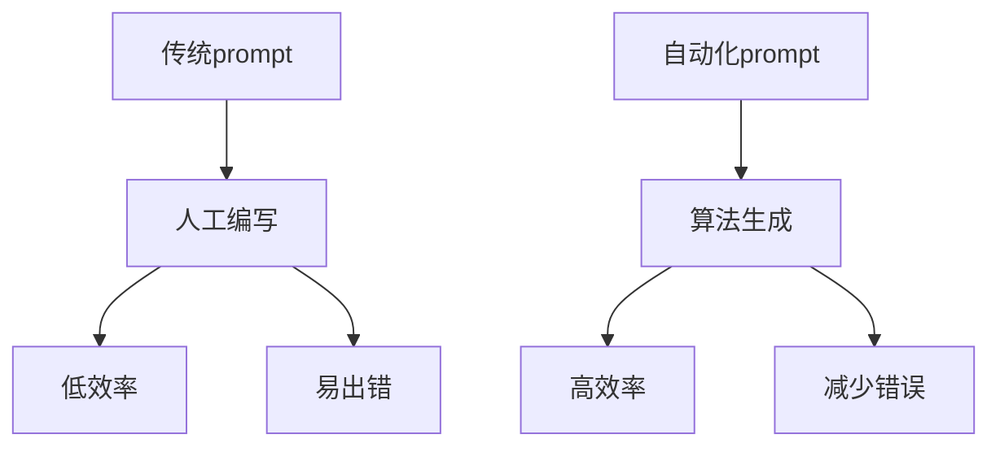
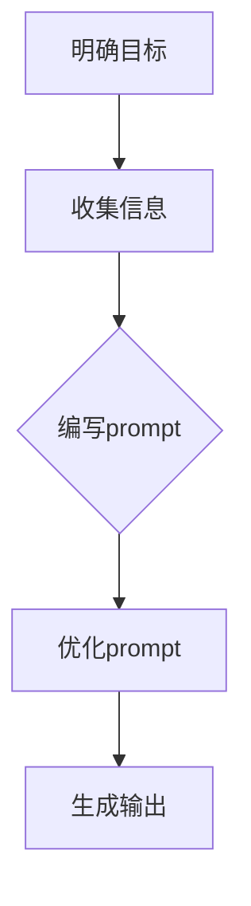

                 

### 引言

#### 问题背景

随着人工智能技术的迅猛发展，大型语言模型（LLM）在自然语言处理（NLP）领域取得了显著的成就。LLM能够生成高质量的文本、回答复杂问题，甚至在创作文学、编写代码等方面展现出惊人的能力。然而，这些卓越表现的基础是精心设计的prompt，即输入到模型中的指令或问题。prompt的质量直接影响到LLM的输出质量，因此，如何优化prompt成为了当前研究的热点问题。

#### 问题描述

尽管LLM在生成文本、回答问题等方面表现出色，但原始prompt的设计直接影响输出质量。一个不恰当的prompt可能会导致模型生成混乱或不相关的文本，甚至导致模型过拟合或欠拟合。因此，优化prompt是提升LLM性能的重要手段。本文将详细介绍自动化prompt优化的方法，帮助读者理解和应用这些技术。

#### 问题解决

本文将围绕自动化prompt优化的核心概念、原理、方法和技术进行阐述。通过系统性地分析自动化prompt优化的各个方面，包括语法、语义、上下文等，以及不同应用场景下的优化策略，本文旨在为读者提供一个全面、深入的理解。

#### 边界与外延

本文将探讨prompt优化的不同层面，包括语法、语义、上下文等，以及不同应用场景下的优化策略。同时，本文将讨论自动化prompt优化的边界和可能的外延，为未来的研究方向提供启示。

#### 核心要素组成

本文的核心要素包括以下几个方面：

1. **自动化prompt优化的基本概念**：介绍自动化prompt优化的定义、目的和重要性。
2. **LLM的prompt设计原理**：深入理解LLM的prompt设计原理，包括语法、语义和上下文。
3. **自动化prompt优化的技术方法**：介绍基于机器学习和深度学习的prompt优化技术。
4. **自动化prompt优化的实践应用**：分析自动化prompt优化在不同场景下的应用案例。
5. **自动化prompt优化的最佳实践**：总结自动化prompt优化的最佳实践，提供具体技巧和策略。
6. **自动化prompt优化的未来发展趋势**：预测自动化prompt优化的未来发展方向。

### 第一部分：自动化prompt优化基础

#### 第1章：自动化prompt优化概述

##### 1.1 自动化prompt优化的基本概念

**定义与历史发展**

自动化prompt优化是指通过算法和工具，自动地对输入到语言模型中的prompt进行优化，以提高模型输出的质量。这一概念起源于传统的prompt设计方法，即人工编写高质量的prompt。然而，随着语言模型的规模和复杂性不断增加，人工编写prompt变得耗时且效率低下。因此，研究人员开始探索自动化方法，以自动化地生成或调整prompt。

**目标与作用**

自动化prompt优化的主要目标是提高语言模型的输出质量，使其生成更加准确、流畅和相关的文本。优化prompt不仅能够提升模型的表现，还能减轻研究人员和开发者的负担，提高整个NLP系统的开发效率。具体来说，自动化prompt优化具有以下几个作用：

1. **提高模型准确性**：通过优化prompt，可以确保模型更好地理解输入问题或指令，从而生成更准确的回答。
2. **改善文本流畅性**：优化后的prompt能够引导模型生成更加自然、流畅的文本。
3. **增强模型泛化能力**：通过在不同场景下优化prompt，可以提升模型在不同任务和领域的泛化能力。

**概念属性特征对比表格**

| 概念        | 特征1 | 特征2 | 特征3 |
|-------------|-------|-------|-------|
| 传统prompt  | 人工编写 | 低效率 | 易出错 |
| 自动化prompt | 算法生成 | 高效率 | 减少错误 |

**ER实体关系图架构的Mermaid流程图**

##### 1.2 自动化prompt优化的方法与工具

**现有方法**

目前，自动化prompt优化主要基于机器学习和深度学习技术。以下是一些常用的方法：

1. **基于规则的方法**：通过定义一系列规则来调整prompt，例如使用特定的关键词、语法结构等。
2. **基于机器学习的方法**：使用机器学习算法，如决策树、随机森林、支持向量机等，从大量数据中学习prompt与输出之间的关联，自动生成优化后的prompt。
3. **基于深度学习的方法**：使用神经网络模型，如循环神经网络（RNN）、长短期记忆网络（LSTM）、Transformer等，通过大量数据训练模型，自动调整prompt。

**工具介绍**

目前，已有一些开源工具和库支持自动化prompt优化。以下是一些常用的工具：

1. ** prompt-engine**：一个基于Python的开源库，提供了一系列自动化prompt优化的方法。
2. ** BERT-Prompt**：一个基于Transformer模型的自动化prompt优化工具，能够通过调整prompt来提高模型的表现。
3. ** Prompt-to-Code**：一个基于生成对抗网络（GAN）的自动化prompt优化工具，用于生成代码。

### 第二部分：LLM的prompt设计原理

#### 第2章：LLM的prompt设计原理

##### 2.1 LLMA的prompt设计原则

**语法优化**

语法优化是prompt设计的重要一环。一个清晰、准确的语法结构有助于模型更好地理解输入内容，从而生成高质量的输出。以下是一些语法优化的原则：

1. **使用简洁明了的语句**：避免冗长、复杂的句子，尽量使用简单、直接的表达方式。
2. **避免歧义**：确保语句明确、无歧义，避免使用模糊、含糊的表述。
3. **一致性**：在prompt中保持一致的风格和格式，例如使用相同的语法结构、标点符号等。

**语义优化**

语义优化旨在确保prompt的语义与目标输出保持一致。以下是一些语义优化的原则：

1. **明确目标**：在prompt中明确指出目标输出，避免模型产生偏离目标输出的回答。
2. **提供背景信息**：为模型提供与目标输出相关的背景信息，帮助模型更好地理解上下文。
3. **使用关键词**：在prompt中包含关键词，帮助模型识别关键信息，从而生成更准确的回答。

**上下文处理与扩展**

上下文处理与扩展是提高prompt质量的关键。以下是一些上下文处理与扩展的原则：

1. **理解上下文**：在prompt中明确上下文信息，帮助模型理解问题或指令的背景。
2. **扩展上下文**：在prompt中提供额外的上下文信息，扩展模型的视野，使其能够生成更全面、准确的回答。
3. **利用上下文相关性**：在prompt中强调上下文相关性，帮助模型识别重要信息，提高输出质量。

##### 2.2 LLMA的prompt设计流程

为了更好地设计prompt，可以遵循以下流程：

1. **明确目标**：首先明确模型的目标输出，这有助于后续的prompt设计。
2. **收集信息**：收集与目标输出相关的信息，包括关键词、背景信息、上下文等。
3. **编写prompt**：根据收集到的信息，编写清晰、准确、语义丰富的prompt。
4. **优化prompt**：对编写好的prompt进行语法、语义、上下文等方面的优化，确保其能够引导模型生成高质量的输出。

**ER实体关系图架构的Mermaid流程图**

### 第三部分：自动化prompt优化的实践应用

#### 第3章：自动化prompt优化技术

##### 3.1 基于机器学习的prompt优化

**算法原理**

基于机器学习的prompt优化主要通过训练模型来学习如何优化prompt。以下是一个简单的算法原理：

1. **数据收集**：收集大量高质量的prompt及其对应的输出，用于训练模型。
2. **特征提取**：从prompt中提取特征，例如关键词、语法结构、上下文信息等。
3. **模型训练**：使用提取的特征和输出数据，训练一个分类模型或回归模型，用于预测优化后的prompt。
4. **优化prompt**：将原始prompt输入到训练好的模型中，得到优化后的prompt。

**实践应用**

以下是一个简单的基于机器学习的prompt优化实践应用：

1. **数据收集**：收集一组文本数据，包括原始prompt和其对应的输出。
2. **特征提取**：使用自然语言处理技术提取特征，例如使用词袋模型、TF-IDF等。
3. **模型训练**：使用Scikit-learn库训练一个分类模型，例如随机森林或支持向量机。
4. **优化prompt**：将原始prompt输入到训练好的模型中，得到优化后的prompt。

**数学模型和数学公式**

假设我们使用一个线性模型来预测优化后的prompt，其数学模型可以表示为：

$$
y = \beta_0 + \beta_1 x_1 + \beta_2 x_2 + \ldots + \beta_n x_n
$$

其中，$y$表示优化后的prompt，$x_1, x_2, \ldots, x_n$表示提取的特征，$\beta_0, \beta_1, \beta_2, \ldots, \beta_n$是模型的参数。

##### 3.2 基于深度学习的prompt优化

**算法原理**

基于深度学习的prompt优化利用深度神经网络模型，如循环神经网络（RNN）、长短期记忆网络（LSTM）、Transformer等，通过大量的数据进行训练，从而自动优化prompt。

1. **数据收集**：收集大量高质量的prompt及其对应的输出数据。
2. **特征提取**：使用自然语言处理技术提取特征，例如词嵌入、句嵌入等。
3. **模型训练**：使用提取的特征和输出数据，训练一个深度神经网络模型，用于预测优化后的prompt。
4. **优化prompt**：将原始prompt输入到训练好的模型中，得到优化后的prompt。

**实践应用**

以下是一个简单的基于深度学习的prompt优化实践应用：

1. **数据收集**：收集一组文本数据，包括原始prompt和其对应的输出。
2. **特征提取**：使用词嵌入技术将prompt和输出转换为向量表示。
3. **模型训练**：使用TensorFlow或PyTorch库训练一个Transformer模型。
4. **优化prompt**：将原始prompt输入到训练好的模型中，得到优化后的prompt。

**数学模型和数学公式**

假设我们使用一个Transformer模型来预测优化后的prompt，其数学模型可以表示为：

$$
y = \text{softmax}(\text{Transformer}(x))
$$

其中，$y$表示优化后的prompt，$x$表示原始prompt的向量表示，$\text{softmax}$是一个激活函数，用于将模型的输出概率分布转换为预测结果。

### 第四部分：自动化prompt优化的应用场景

#### 第4章：自动化prompt优化在自然语言生成中的应用

##### 4.1 自动化prompt优化在自然语言生成中的应用

**应用场景**

自然语言生成（NLG）是自动化prompt优化的重要应用场景之一。在NLG中，prompt通常是一个描述性文本，用于引导模型生成相关的内容。自动化prompt优化可以帮助提高NLG系统的输出质量，使其生成的文本更加准确、流畅和自然。

**优化策略**

为了在NLG中应用自动化prompt优化，可以采用以下策略：

1. **语义分析**：通过语义分析技术，如词义消歧、实体识别等，理解prompt的语义，从而生成更准确的输出。
2. **上下文扩展**：在prompt中添加上下文信息，扩展模型的视野，使其能够生成更加全面、准确的文本。
3. **语法调整**：对prompt进行语法调整，确保其结构清晰、逻辑连贯，从而提高输出的流畅性。

**案例研究**

以下是一个自动化prompt优化在NLG中的应用案例：

- **场景**：生成新闻摘要。
- **原始prompt**：一篇关于某公司发布新款手机的新闻报道。
- **优化后prompt**：在原始prompt中添加上下文信息，例如公司的历史、市场状况等，从而帮助模型生成更全面、准确的新闻摘要。

**具体应用**

以下是一个简单的自动化prompt优化在NLG中的具体应用：

1. **数据收集**：收集一组新闻摘要及其对应的原始新闻报道。
2. **特征提取**：使用自然语言处理技术提取特征，如关键词、句嵌入等。
3. **模型训练**：使用提取的特征和新闻摘要数据，训练一个序列到序列（seq2seq）模型。
4. **优化prompt**：将原始新闻报道输入到训练好的模型中，得到优化后的prompt。

**数学模型和数学公式**

假设我们使用一个seq2seq模型来预测优化后的prompt，其数学模型可以表示为：

$$
y = \text{seq2seq}(x)
$$

其中，$y$表示优化后的prompt，$x$表示原始新闻报道的向量表示，$\text{seq2seq}$是一个序列到序列模型。

##### 4.2 自动化prompt优化在问答系统中的应用

**应用场景**

问答系统是另一个重要的应用场景，其中prompt通常是用户提出的问题。自动化prompt优化可以帮助提高问答系统的回答质量，使其能够更准确地理解用户的问题，并提供相关的答案。

**优化策略**

为了在问答系统中应用自动化prompt优化，可以采用以下策略：

1. **问题理解**：通过自然语言处理技术，如词义消歧、实体识别等，理解用户提出的问题。
2. **上下文处理**：在prompt中添加上下文信息，帮助模型更好地理解问题的背景，从而提供更相关的答案。
3. **答案生成**：优化prompt，使模型能够生成更加准确、流畅的答案。

**案例研究**

以下是一个自动化prompt优化在问答系统中的应用案例：

- **场景**：一个智能客服系统。
- **原始prompt**：用户提出的一个关于产品使用问题的询问。
- **优化后prompt**：在原始prompt中添加产品规格、用户使用历史等上下文信息，从而帮助模型生成更准确的答案。

**具体应用**

以下是一个简单的自动化prompt优化在问答系统中的具体应用：

1. **数据收集**：收集一组用户问题和对应的答案。
2. **特征提取**：使用自然语言处理技术提取特征，如关键词、句嵌入等。
3. **模型训练**：使用提取的特征和答案数据，训练一个问答模型。
4. **优化prompt**：将用户问题输入到训练好的模型中，得到优化后的prompt。

**数学模型和数学公式**

假设我们使用一个问答模型来预测优化后的prompt，其数学模型可以表示为：

$$
y = \text{问答模型}(x)
$$

其中，$y$表示优化后的prompt，$x$表示用户问题的向量表示，$\text{问答模型}$是一个问答模型。

### 第五部分：自动化prompt优化的最佳实践

#### 第5章：自动化prompt优化的最佳实践

##### 5.1 提高prompt质量的技巧

为了提高prompt质量，可以采用以下技巧：

1. **明确目标**：确保prompt中明确指出目标输出，避免模型产生偏离目标的回答。
2. **提供背景信息**：在prompt中添加与目标输出相关的背景信息，帮助模型更好地理解上下文。
3. **使用关键词**：在prompt中包含关键词，帮助模型识别关键信息，从而生成更准确的回答。
4. **避免歧义**：确保prompt中的表述清晰、明确，避免使用模糊、含糊的语句。

**案例分析**

以下是一个成功提高prompt质量的案例分析：

- **场景**：一个智能客服系统。
- **问题**：原始prompt中存在模糊、不明确的问题，导致模型生成的回答不准确。
- **解决方案**：对原始prompt进行优化，添加具体的背景信息和关键词，使模型能够更准确地理解用户的问题，并生成相关、准确的回答。

##### 5.2 自动化prompt优化的挑战与应对策略

尽管自动化prompt优化具有许多优势，但在实际应用中仍面临一些挑战。以下是一些常见的挑战及其应对策略：

1. **数据不足**：自动化prompt优化依赖于大量的数据。如果数据不足，可能会导致模型性能下降。应对策略是使用数据增强技术，如数据扩充、生成对抗网络（GAN）等，以增加训练数据。
2. **模型过拟合**：如果模型在训练数据上过拟合，可能会导致在未知数据上表现不佳。应对策略是使用交叉验证、正则化等技术，避免模型过拟合。
3. **上下文理解不足**：自动化prompt优化在处理复杂上下文时可能存在不足。应对策略是使用更先进的自然语言处理技术，如预训练模型、多模态学习等，以提高上下文理解能力。

**案例分析**

以下是一个自动化prompt优化中面临挑战的案例分析：

- **场景**：一个智能客服系统。
- **问题**：原始prompt中包含复杂、多层次的上下文信息，导致模型生成的回答不准确。
- **解决方案**：使用预训练的Transformer模型，如BERT，来处理复杂的上下文信息，并使用数据增强技术增加训练数据，以提高模型的表现。

### 第六章：自动化prompt优化的未来发展趋势

##### 6.1 自动化prompt优化的未来发展趋势

随着人工智能技术的不断发展，自动化prompt优化在未来有望取得以下几个方面的进展：

1. **更先进的模型**：随着深度学习技术的不断进步，将出现更先进的语言模型，如基于 Transformer 的模型，这些模型将能够更好地处理复杂、多层次的上下文信息。
2. **多模态学习**：自动化prompt优化将逐渐融合多模态学习，例如结合文本、图像、音频等多种信息，以提高模型的表现。
3. **自动化prompt生成**：未来的研究可能集中在开发自动化prompt生成技术，使模型能够根据不同的任务和场景，自动生成高质量的prompt。
4. **自适应优化**：自动化prompt优化将逐步实现自适应优化，使模型能够根据不同用户的反馈和需求，动态调整prompt，从而提供更个性化的服务。

**未来展望**

自动化prompt优化的未来发展趋势将对人工智能领域产生深远的影响。一方面，它将提高自然语言处理系统的性能，使模型能够生成更准确、相关、流畅的文本；另一方面，它将推动人工智能在各个领域的应用，如智能客服、智能写作、智能翻译等。

### 总结

自动化prompt优化是提高LLM输出质量的重要手段。通过深入了解自动化prompt优化的核心概念、原理和方法，以及其在不同应用场景下的实践应用，读者可以更好地理解和应用这些技术，为人工智能系统的发展做出贡献。

### 作者信息

作者：AI天才研究院/AI Genius Institute & 禅与计算机程序设计艺术 /Zen And The Art of Computer Programming

