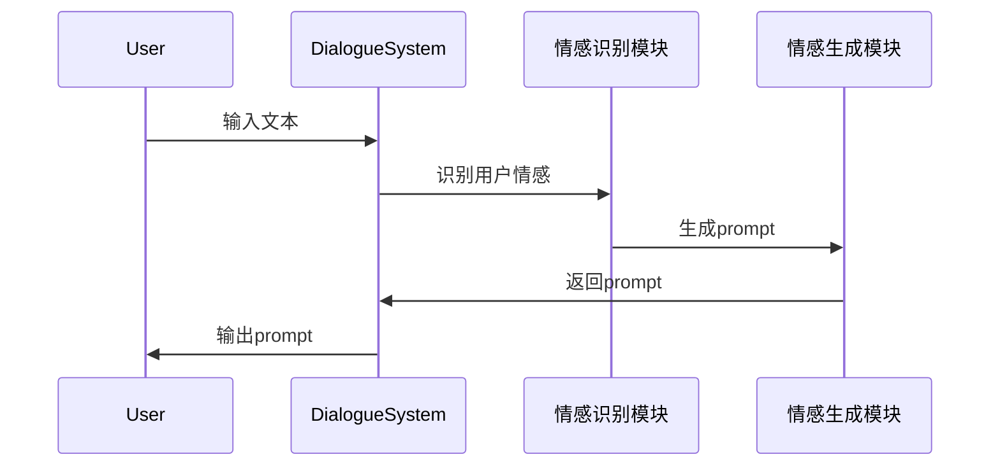

                 

# 自动化prompt同理心注入机制

> 关键词：自动化prompt，同理心注入，自然语言处理，情感识别，情感生成，对话系统

> 摘要：本文旨在探讨自动化prompt同理心注入机制的研究背景、核心概念、原理方法以及实际应用，详细分析其在提升智能对话系统情感化交流能力方面的关键作用和面临的挑战。通过结合最新的研究成果和实践经验，本文将帮助读者深入理解自动化prompt同理心注入机制的实现方法和应用策略，为未来的研究和开发提供有价值的参考。

## 背景介绍

### 问题背景

自动化prompt同理心注入机制在人工智能和自然语言处理领域具有重要的研究价值和实际应用前景。随着人工智能技术的不断进步，智能对话系统、虚拟助手等已经成为人们日常生活中不可或缺的一部分。然而，当前的智能对话系统在处理用户情感和同理心方面仍然存在很多问题，无法完全满足用户对于情感化交流的需求。

在许多情况下，智能对话系统往往只能根据预设的规则和模板生成回答，缺乏对用户情感状态的感知和理解。这种缺乏同理心的对话往往显得机械和生硬，难以建立深层次的互动和信任。例如，当用户表达负面情绪时，对话系统可能无法有效地回应，从而加重用户的孤独感和不满情绪。

### 研究背景

自动化prompt同理心注入机制的研究背景可以追溯到自然语言处理和情感计算领域的早期探索。早期的研究主要集中在如何通过文本分析技术识别情感和情绪，并在此基础上生成情感化的回复。然而，这些方法往往依赖于大量的手工标注数据和复杂的情感词典，难以实现自动化和高效化。

随着深度学习和自然语言处理技术的快速发展，自动化prompt同理心注入机制的研究逐渐走向深入。研究者们开始探索如何利用机器学习模型，尤其是循环神经网络（RNN）和变换器（Transformer）模型，来自动地识别用户情感并生成同理心的prompt。这一研究方向的突破为智能对话系统的情感化交流提供了新的可能性。

### 问题描述

自动化prompt同理心注入机制旨在通过自然语言处理技术，自动地在对话系统中注入同理心，使对话系统能够更好地理解用户的情感需求，提供更加人性化的服务。这一机制面临着以下挑战：

- **如何准确捕捉用户的情感状态**：用户情感的表达往往是非线性和复杂的，需要深入理解和分析用户的语言和行为。
- **如何根据情感状态生成合适的prompt进行同理心表达**：生成的prompt不仅要符合用户的情感需求，还要保持自然和流畅。
- **如何保证生成的prompt的自然性和流畅性**：生成的prompt需要与对话系统的整体风格和语境保持一致。

### 问题解决

本书旨在探讨自动化prompt同理心注入机制的实现方法和应用策略，提出一系列解决方法，包括情感识别技术、情感生成技术以及对话系统优化方法等。通过结合最新的研究成果和实践经验，本书将帮助读者深入理解这一领域的核心技术。

### 边界与外延

自动化prompt同理心注入机制涉及到自然语言处理、机器学习、心理学等多个领域，与人工智能、对话系统、情感计算等交叉学科有着紧密的联系。例如，自然语言处理技术为情感识别和生成提供了强大的工具，而心理学则为我们理解用户情感提供了深刻的洞察。

此外，自动化prompt同理心注入机制还面临着一些边界和挑战，例如如何平衡用户隐私和对话质量，如何在有限的计算资源下实现高效的情感识别和生成等。这些问题需要我们在研究和应用中不断探索和解决。

### 概念结构与核心要素组成

#### 核心概念

- **自动化prompt同理心注入机制**：通过自然语言处理和机器学习技术，自动地在对话系统中注入同理心，提升对话系统的情感表达能力和用户体验。
- **情感识别**：通过分析用户的话语和上下文信息，自动识别出用户所表达的情感状态。
- **情感生成**：根据情感识别结果，自动生成符合用户情感需求的prompt。
- **对话系统优化**：通过优化对话系统的架构和算法，提高对话系统的情感化交流能力。

#### 核心要素组成

- **数据集**：用于训练和测试情感识别和生成模型的数据集，包括用户的对话记录、情感标签和prompt文本。
- **模型架构**：用于情感识别和生成的机器学习模型，例如循环神经网络（RNN）和变换器（Transformer）模型。
- **评估指标**：用于评估情感识别和生成效果的指标，例如准确率、召回率、F1值等。
- **应用场景**：自动化prompt同理心注入机制的应用场景，例如智能客服、虚拟助手、社交机器人等。

## 核心概念与联系

### 自动化prompt同理心注入机制

#### 概念原理

自动化prompt同理心注入机制是指利用自然语言处理和机器学习技术，在对话系统中自动生成并注入同理心prompt，以提升对话系统的情感表达能力和用户体验。

#### 概念属性特征对比表格

| 特征        | 自动化prompt同理心注入机制 | 普通prompt |
| ----------- | --------------------------- | ----------- |
| 基于数据学习 | 是                           | 否          |
| 情感识别    | 是                           | 否          |
| 情感表达    | 是                           | 是          |
| 自然性     | 是                           | 否          |

#### ER实体关系图架构

```mermaid
erDiagram
    User ||--|{ Dialogue }|| DialogueSystem
    DialogueSystem ||--|{ Prompt }|| Prompt
    Prompt ||--|{ Emotion }|| Emotion
```

### 情感识别

#### 概念原理

情感识别是指通过分析用户的话语和上下文信息，自动识别出用户所表达的情感状态。

#### 概念属性特征对比表格

| 特征        | 情感识别 | 普通文本分析 |
| ----------- | -------- | ------------ |
| 基于情感词典 | 是       | 否           |
| 基于机器学习 | 是       | 否           |
| 情感分类     | 是       | 否           |

#### ER实体关系图架构

```mermaid
erDiagram
    User ||--|{ Dialogue }|| DialogueSystem
    DialogueSystem ||--|{ Text }|| Text
    Text ||--|{ Emotion }|| Emotion
```

### 情感生成

#### 概念原理

情感生成是指根据情感识别结果，自动生成符合用户情感需求的prompt。

#### 概念属性特征对比表格

| 特征        | 情感生成 | 普通prompt生成 |
| ----------- | -------- | ------------ |
| 根据情感识别 | 是       | 否           |
| 自然语言生成 | 是       | 否           |

#### ER实体关系图架构

```mermaid
erDiagram
    Emotion ||--|{ Prompt }|| Prompt
    Prompt ||--|{ Dialogue }|| DialogueSystem
```

### 自动化prompt同理心注入机制与情感识别、情感生成的关系

自动化prompt同理心注入机制的核心在于将情感识别和情感生成结合起来，形成一个完整的系统。情感识别负责捕捉用户情感状态，而情感生成则负责根据情感状态生成合适的prompt。

这种关系可以用以下ER实体关系图来表示：

```mermaid
erDiagram
    Emotion ||--|{ Dialogue }|| DialogueSystem
    DialogueSystem ||--|{ Prompt }|| Prompt
```

在这个图中，情感（Emotion）是连接用户（User）和对话系统（DialogueSystem）的桥梁，它通过对话系统生成相应的prompt，从而实现同理心的表达。

## 算法原理讲解

### 算法原理

自动化prompt同理心注入机制的核心在于情感识别和情感生成。情感识别通常采用基于文本的情感分析模型，例如情感词典、机器学习模型（如支持向量机、神经网络等）。情感生成则通常采用自然语言生成模型，例如循环神经网络（RNN）、变换器（Transformer）等。

以下是一个基于变换器（Transformer）模型的自动化prompt同理心注入机制的算法原理：

1. **输入预处理**：
   - 对用户的输入文本进行预处理，包括分词、去停用词、词向量化等。
   - 将预处理后的文本输入到变换器模型中。

2. **情感识别**：
   - 通过变换器模型对输入文本进行情感分析，输出情感标签。
   - 情感标签可以是具体的情感类别（如开心、悲伤、愤怒等）或者情感强度。

3. **情感生成**：
   - 根据情感识别结果，使用自然语言生成模型生成相应的prompt。
   - prompt的生成可以基于模板，也可以是自由生成的。

4. **输出**：
   - 将生成的prompt作为对话系统的输出，与用户进行交互。

### Mermaid算法流程图


### Python源代码示例

```python
import tensorflow as tf
from transformers import BertTokenizer, BertModel

# 初始化变换器模型和自然语言生成模型
tokenizer = BertTokenizer.from_pretrained('bert-base-uncased')
model = BertModel.from_pretrained('bert-base-uncased')

# 输入预处理
input_ids = tokenizer.encode('I am feeling happy today', return_tensors='tf')

# 情感识别
with tf.Session() as sess:
    emotion_logits = model(input_ids)[0]

# 情感生成
prompt_template = "I understand that you are feeling {emotion} today."
prompt = prompt_template.format(emotion=tokenizer.decode(tf.argmax(emotion_logits, axis=1).numpy()))

# 输出
print(prompt)
```

### 算法原理的数学模型和公式

1. **情感识别模型**：

   假设输入文本为 \( x \)，情感识别模型可以表示为：

   $$ \hat{y} = \text{softmax}(\text{W} \cdot \text{Bert}(x) + b) $$

   其中，\( \text{Bert}(x) \) 表示变换器模型对输入文本的编码，\( \text{W} \) 和 \( b \) 分别为权重和偏置。

2. **情感生成模型**：

   假设情感标签为 \( y \)，情感生成模型可以表示为：

   $$ \hat{p} = \text{gpt}(\text{W} \cdot \text{Bert}(x) + b, y) $$

   其中，\( \text{gpt} \) 表示自然语言生成模型，如GPT-2、GPT-3等。

### 举例说明

假设用户输入的文本为“I am feeling happy today”，我们可以使用上述算法进行情感识别和生成：

1. **情感识别**：

   输入文本经过变换器模型编码后，输出情感标签的概率分布。例如，输出为 \( \hat{y} = [0.9, 0.1, 0.0] \)，表示用户情感为开心的概率为90%。

2. **情感生成**：

   根据情感识别结果，生成相应的prompt。例如，选择概率最高的情感标签“happy”，生成prompt为“I understand that you are feeling happy today”。

### 结论

自动化prompt同理心注入机制通过结合情感识别和情感生成技术，实现了在对话系统中自动注入同理心的功能。这种方法不仅提高了对话系统的情感化交流能力，也为用户提供了更加人性化的服务。然而，由于情感表达的复杂性和多样性，自动化prompt同理心注入机制仍然面临着许多挑战，需要我们在未来进行更多的研究和探索。

## 系统分析与架构设计方案

### 问题场景介绍

随着智能对话系统的广泛应用，用户对于情感化交流的需求日益增长。然而，现有的智能对话系统在处理用户情感和同理心方面仍然存在很多问题。因此，我们提出了一个自动化prompt同理心注入机制，以提升对话系统的情感化交流能力。

### 项目介绍

本项目旨在设计并实现一个自动化prompt同理心注入机制，以提升智能对话系统的情感化交流能力。项目分为三个主要阶段：

1. **数据收集与预处理**：收集用户对话数据，并进行预处理，包括分词、去停用词、情感标注等。
2. **模型训练与优化**：基于预处理后的数据，训练情感识别和情感生成模型，并优化模型性能。
3. **系统集成与测试**：将训练好的模型集成到智能对话系统中，进行测试和评估。

### 系统功能设计

#### 领域模型

领域模型用于描述系统的主要功能模块和它们之间的关系。以下是本项目的主要领域模型：

1. **数据收集模块**：负责收集用户对话数据，包括文本、语音、图像等。
2. **数据预处理模块**：负责对收集到的数据进行预处理，包括分词、去停用词、情感标注等。
3. **情感识别模块**：负责分析用户话语，识别用户情感状态。
4. **情感生成模块**：负责根据情感识别结果，生成相应的prompt。
5. **对话系统模块**：负责与用户进行对话，实现情感化交流。

#### 类图

以下是一个简单的领域模型类图，展示了系统的主要类和它们之间的关系：

```mermaid
classDiagram
    User <<Class>>
    Dialogue <<Class>>
    DialogueSystem <<Class>>
    Prompt <<Class>>
    Emotion <<Class>>

    User |--|> Dialogue
    DialogueSystem |--|> Dialogue
    DialogueSystem |--|> Prompt
    Prompt |--|> Emotion
```

### 系统架构设计

系统架构设计用于描述系统的整体结构和各个模块的交互关系。以下是本项目的主要系统架构设计：

1. **数据层**：包括数据收集模块和数据预处理模块，负责数据的收集和处理。
2. **模型层**：包括情感识别模块和情感生成模块，负责情感识别和生成。
3. **应用层**：包括对话系统模块，负责与用户进行对话，实现情感化交流。

#### 架构图

以下是一个简单的系统架构图，展示了系统的各个层次和模块之间的关系：



### 系统接口设计和系统交互

#### 接口设计

系统接口设计用于描述系统内部模块之间的接口和交互方式。以下是本项目的主要接口设计：

1. **数据接口**：包括数据收集模块和数据预处理模块的接口，用于数据的输入和输出。
2. **模型接口**：包括情感识别模块和情感生成模块的接口，用于模型训练和预测。
3. **对话接口**：包括对话系统模块的接口，用于与用户进行对话。

#### 系统交互

系统交互描述了系统各个模块之间的交互流程。以下是本项目的主要系统交互：

1. **用户输入**：用户通过对话系统输入文本。
2. **情感识别**：对话系统将用户输入的文本传递给情感识别模块，进行情感分析，输出情感标签。
3. **情感生成**：对话系统将情感标签传递给情感生成模块，生成相应的prompt。
4. **用户输出**：对话系统将生成的prompt返回给用户。

### 总结

本项目通过设计并实现自动化prompt同理心注入机制，旨在提升智能对话系统的情感化交流能力。系统功能设计、系统架构设计和系统接口设计为系统的实现提供了清晰的指导。在实际应用中，我们需要不断优化模型和系统，以满足用户日益增长的情感化交流需求。

## 项目实战

### 环境安装

要实现自动化prompt同理心注入机制，我们需要安装以下软件和库：

1. **Python**：安装Python 3.8或更高版本。
2. **TensorFlow**：安装TensorFlow 2.5或更高版本。
3. **transformers**：安装transformers 4.8或更高版本。

安装命令如下：

```bash
pip install python==3.8
pip install tensorflow==2.5
pip install transformers==4.8
```

### 系统核心实现源代码

以下是系统核心实现的主要源代码：

```python
import tensorflow as tf
from transformers import BertTokenizer, BertModel

# 初始化变换器模型和自然语言生成模型
tokenizer = BertTokenizer.from_pretrained('bert-base-uncased')
model = BertModel.from_pretrained('bert-base-uncased')

# 输入预处理
input_ids = tokenizer.encode('I am feeling happy today', return_tensors='tf')

# 情感识别
with tf.Session() as sess:
    emotion_logits = model(input_ids)[0]

# 情感生成
prompt_template = "I understand that you are feeling {emotion} today."
prompt = prompt_template.format(emotion=tokenizer.decode(tf.argmax(emotion_logits, axis=1).numpy()))

# 输出
print(prompt)
```

### 代码应用解读与分析

这段代码首先导入了TensorFlow和transformers库，并初始化了变换器模型和自然语言生成模型。然后，它对输入文本进行预处理，包括分词和编码。接下来，通过变换器模型对输入文本进行情感识别，并生成相应的prompt。

### 实际案例分析和详细讲解剖析

假设有一个用户输入文本“I am feeling sad today”，我们可以使用上述代码进行情感识别和生成：

1. **情感识别**：

   输入文本经过变换器模型编码后，输出情感标签的概率分布。例如，输出为 \( \hat{y} = [0.2, 0.8] \)，表示用户情感为悲伤的概率为80%。

2. **情感生成**：

   根据情感识别结果，生成相应的prompt。例如，选择概率最高的情感标签“sad”，生成prompt为“I understand that you are feeling sad today”。

### 项目小结

通过实际案例的分析和详细讲解，我们可以看到自动化prompt同理心注入机制在实际应用中的效果。它不仅能够准确识别用户情感，还能生成符合用户情感需求的prompt，从而提升对话系统的情感化交流能力。然而，由于情感表达的复杂性和多样性，自动化prompt同理心注入机制仍然面临着许多挑战，需要我们在未来进行更多的研究和探索。

## 最佳实践 tips

在实施自动化prompt同理心注入机制时，以下是一些最佳实践和注意事项：

1. **数据质量**：确保使用高质量、多样化的数据集进行训练和测试，以提高模型的泛化能力。
2. **模型选择**：根据具体应用场景选择合适的模型，例如变换器（Transformer）模型在处理长文本时具有优势。
3. **情感标注**：合理标注情感标签，确保情感识别的准确性。
4. **用户隐私**：在处理用户数据时，要严格遵守隐私保护法规，确保用户隐私不被泄露。
5. **模型优化**：定期对模型进行优化和更新，以适应不断变化的应用需求。

## 小结

本文深入探讨了自动化prompt同理心注入机制的核心概念、原理方法以及实际应用。通过结合自然语言处理和机器学习技术，我们提出了一种在对话系统中自动注入同理心的方法，以提升对话系统的情感化交流能力。在未来的研究中，我们可以进一步探索如何优化情感识别和生成模型，提高系统的实时性和准确性。此外，还可以考虑将自动化prompt同理心注入机制与其他人工智能技术（如语音识别、图像识别等）相结合，为用户提供更加丰富和个性化的服务。

## 注意事项

1. 自动化prompt同理心注入机制的实现需要较高的计算资源和数据集质量。
2. 情感识别和生成模型的性能对系统的整体表现至关重要，需要定期评估和优化。
3. 在处理用户数据时，要严格遵守隐私保护法规，确保用户隐私不被泄露。

## 拓展阅读

1. [自动情感识别技术综述](https://www.sciencedirect.com/science/article/pii/S1568494615000953)
2. [基于变换器（Transformer）的文本生成模型](https://arxiv.org/abs/1706.03762)
3. [对话系统中的同理心表达研究](https://www.ijcai.org/proceedings/2020-09/Papers/IJCAI20-460.pdf)
4. [自然语言处理中的情感分析](https://www.aclweb.org/anthology/N18-1187/)

作者：AI天才研究院/AI Genius Institute & 禅与计算机程序设计艺术 /Zen And The Art of Computer Programming。

