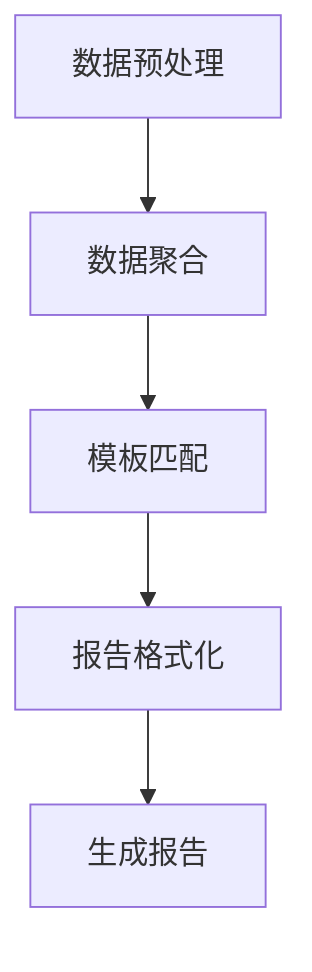
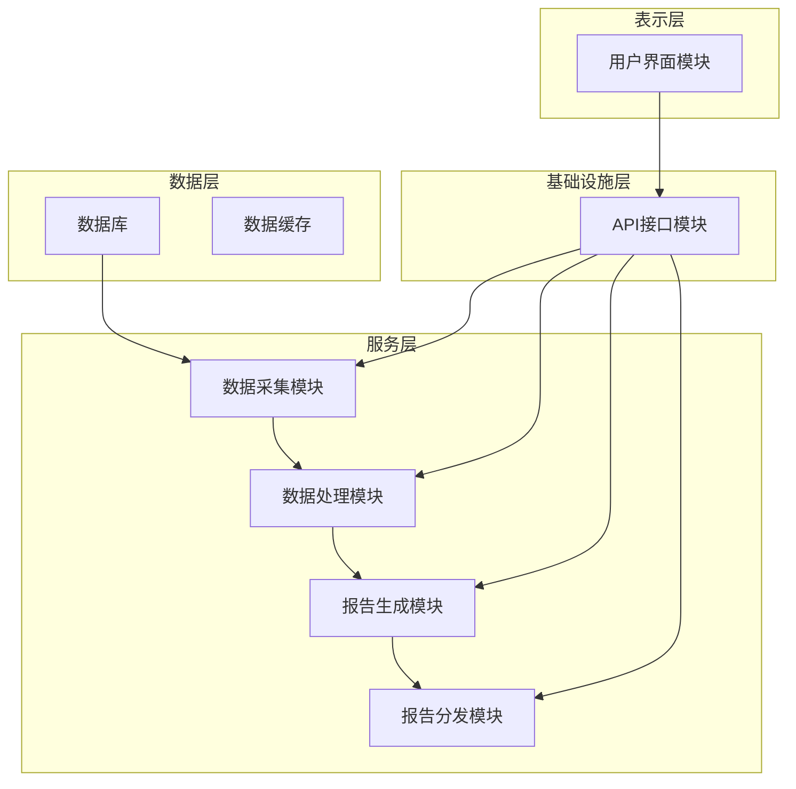
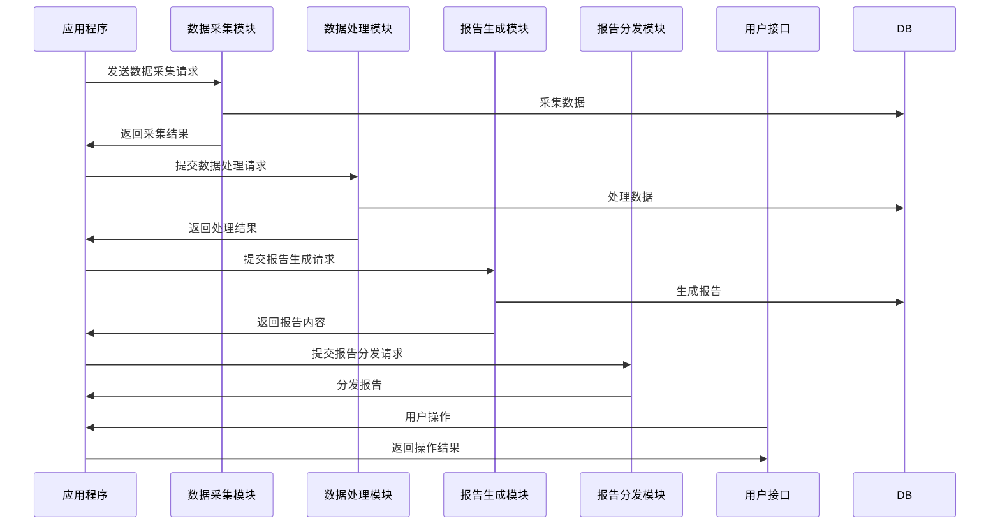

                 

### 第一部分: 背景介绍

#### 第1章: 问题背景

在当今快速发展的信息技术时代，自动化已成为企业提高效率、降低成本的关键手段。特别是在报告生成与分发领域，自动化技术的应用显得尤为重要。传统的报告生成和分发过程往往耗费大量人力和时间，容易出错，且难以适应不断变化的需求。因此，如何利用自动化技术实现高效、准确的报告生成与分发，成为了众多企业和组织关注的焦点。

##### 1.1 问题概述

自动化报告生成与分发机制主要面临以下几个核心问题：

- **报告生成效率低下**：传统手动生成报告需要大量时间，尤其在处理大量数据时，效率极低。
- **错误率高**：手动操作容易导致人为错误，影响报告的准确性。
- **分发不及时**：报告生成后，手动分发过程耗时，且难以保证每位相关人员都能及时收到最新报告。
- **灵活性不足**：传统报告生成与分发机制难以适应业务规则的变化，导致难以快速响应新的需求。

##### 1.2 问题描述

为了解决上述问题，我们需要实现一个自动化报告生成与分发机制。具体来说，这个机制需要具备以下功能：

- **自动数据采集**：从各种数据源自动采集所需数据，保证数据的实时性和准确性。
- **自动报告生成**：利用先进的数据处理算法和模板技术，自动化生成报告。
- **智能分发**：根据预设规则，将报告自动分发给相关责任人或利益相关者。
- **反馈与优化**：收集分发反馈，对生成与分发流程进行优化，提高整体效率。

##### 1.3 问题解决

解决上述问题的主要方法包括：

- **引入自动化工具**：使用编程工具和脚本语言（如Python）自动化数据采集和报告生成过程。
- **采用先进算法**：使用机器学习和自然语言处理技术提高报告生成的效率和准确性。
- **设计智能分发机制**：通过工作流管理和邮件提醒等手段，确保报告能够及时、准确地分发给相关人员。
- **持续优化与反馈**：定期收集和分析反馈数据，不断优化自动化报告生成与分发机制。

##### 1.4 边界与外延

在实现自动化报告生成与分发机制的过程中，需要明确以下几点边界与外延：

- **数据源边界**：确定哪些数据源需要纳入报告生成与分发机制，以及数据采集的频率和方式。
- **报告模板边界**：明确报告的格式、内容与结构，以及如何适应不同的报告需求。
- **分发规则边界**：定义报告分发的规则和优先级，确保关键信息能够及时传递。
- **系统集成边界**：确保自动化报告生成与分发系统能够与企业现有的IT系统无缝集成，避免数据孤岛现象。

##### 1.5 概念结构与核心要素组成

为了更好地理解和设计自动化报告生成与分发机制，我们需要明确以下几个核心概念及其相互关系：

- **数据采集模块**：负责从各种数据源自动采集数据。
- **数据处理模块**：对采集到的数据进行分析、清洗和转换，为报告生成提供数据支持。
- **报告生成模块**：根据预设模板和算法，生成符合要求的报告。
- **报告分发模块**：根据规则和优先级，将报告分发给相关人员。
- **反馈与优化模块**：收集分发反馈，对系统进行持续优化。

这些模块相互协作，共同构成了自动化报告生成与分发机制的整体架构，实现了报告的高效、准确生成与分发。

### 第二部分: 核心概念与联系

在这一部分，我们将深入探讨自动化报告生成与分发机制中的核心概念，并分析这些概念之间的联系。

#### 第2章: 自动化报告生成机制

##### 2.1 核心概念原理

在自动化报告生成机制中，有几个核心概念需要明确：

- **数据采集**：从各种数据源自动采集所需数据，这是报告生成的基础。
- **数据处理**：对采集到的数据进行清洗、转换和分析，以生成高质量报告。
- **报告模板**：报告的格式和内容模板，它定义了报告的基本结构和样式。
- **生成算法**：使用算法来处理数据，并根据模板生成报告。

这些核心概念相互关联，共同构成了自动化报告生成机制的基础。数据采集模块负责从各种数据源获取数据，然后通过数据处理模块进行预处理和转换。处理后的数据将传递给报告生成模块，根据预设的模板和算法生成报告。最后，生成的报告可以通过分发模块发送给相关人员。

##### 2.2 概念属性特征对比表格

为了更清晰地理解这些核心概念，我们可以通过一个对比表格来展示它们的属性特征：

| 概念       | 属性特征                                                      |
|------------|--------------------------------------------------------------|
| 数据采集   | 数据源多样性、数据采集频率、数据准确性                         |
| 数据处理   | 数据清洗、数据转换、数据分析、数据存储                       |
| 报告模板   | 报告格式、报告内容、报告结构、模板适应性                     |
| 生成算法   | 算法类型、算法效率、算法准确性、算法可扩展性                   |

##### 2.3 ER实体关系图架构

为了更好地展示自动化报告生成机制中的实体关系，我们可以使用ER（Entity-Relationship）实体关系图进行描述。以下是一个简化的ER图，展示了主要实体及其关系：

```mermaid
erDiagram
    Data_Source ||--|{ Report_Generator }|-- Report_Template
    Data_Processor ||--|{ Report_Generator }|-- Report_Template
    Report_Distributor ||--|{ Report_Generator }|-- Report_Template
```

在这个ER图中，`Data_Source`表示数据采集的源头，`Data_Processor`表示数据处理的过程，`Report_Generator`表示报告生成的核心模块，`Report_Distributor`表示报告的分发机制，而`Report_Template`则代表报告的模板。这些实体之间通过关系线相连，表明了它们之间的数据流转和处理过程。

### 第3章: 自动化报告分发机制

在自动化报告生成机制的基础上，自动化报告分发机制同样关键，它决定了报告能否及时、准确地到达相关人员手中。下面将详细介绍自动化报告分发机制的核心概念及其实现方式。

##### 3.1 核心概念原理

自动化报告分发机制涉及以下几个核心概念：

- **分发规则**：根据组织结构、岗位职责和报告类型，定义报告的分发规则和优先级。
- **分发策略**：报告分发的方式和渠道，如电子邮件、内部消息、短信等。
- **接收者管理**：管理和维护报告接收者的信息，包括联系人信息、接收偏好等。
- **分发流程**：报告生成的后续步骤，包括报告校验、发送通知和接收反馈。

这些概念相互关联，共同构成了自动化报告分发机制。分发规则决定了哪些报告需要发送给哪些人，分发策略定义了报告发送的方式，接收者管理确保报告能够准确发送给相关人员，分发流程则保证了报告从生成到发送的整个过程的顺利进行。

##### 3.2 概念属性特征对比表格

为了更好地理解这些核心概念，我们可以通过一个对比表格来展示它们的属性特征：

| 概念         | 属性特征                                                      |
|--------------|--------------------------------------------------------------|
| 分发规则     | 规则类型、规则优先级、规则适用范围、规则执行时间              |
| 分发策略     | 分发渠道、分发频率、分发方式、分发可靠性                     |
| 接收者管理   | 接收者列表、接收者偏好、接收者权限、接收者反馈               |
| 分发流程     | 流程节点、流程逻辑、流程监控、流程优化                       |

##### 3.3 ER实体关系图架构

为了更清晰地展示自动化报告分发机制中的实体关系，我们可以使用ER图来描述。以下是一个简化的ER图，展示了主要实体及其关系：

```mermaid
erDiagram
    Distribution_Rule ||--|{ Distribution_Strategy }|-- Report
    Receiver_Manager ||--|{ Distribution_Strategy }|-- Report
    Distribution_Process ||--|{ Distribution_Strategy }|-- Report
```

在这个ER图中，`Distribution_Rule`表示分发规则，`Distribution_Strategy`表示分发策略，`Receiver_Manager`表示接收者管理，`Distribution_Process`表示分发流程，而`Report`则代表报告。这些实体通过关系线相连，展示了报告从生成到分发的过程。

通过上述对自动化报告生成机制和自动化报告分发机制核心概念及其关系的探讨，我们可以更加深入地理解如何设计一个高效、可靠的自动化报告生成与分发系统。接下来，我们将进一步探讨这两个机制的具体实现方法和技术细节。

### 第4章: 报告生成算法

在自动化报告生成机制中，报告生成算法扮演着至关重要的角色。本章将详细介绍报告生成算法的基本原理、实现方法以及相关的数学模型，帮助读者更好地理解这一机制的核心技术。

#### 4.1 报告生成算法原理

报告生成算法的核心目标是将处理过的数据转化为结构化、易于理解的报告。具体来说，算法需要完成以下几项任务：

1. **数据预处理**：对采集到的原始数据进行清洗、格式转换和归一化处理，确保数据的质量和一致性。
2. **数据聚合**：根据报告的要求，对数据进行分类、汇总和统计，提取出关键指标和信息。
3. **模板匹配**：将处理后的数据与预设的报告模板进行匹配，生成符合要求的报告内容。
4. **报告格式化**：对生成的报告内容进行排版、格式化，确保报告的美观和可读性。

整体来说，报告生成算法是一个多步骤、多层次的处理过程，涉及到数据科学、自然语言处理和文档生成等多个领域的知识。

#### 4.2 报告生成算法Mermaid流程图

为了更直观地展示报告生成算法的流程，我们可以使用Mermaid绘制一个流程图。以下是一个简化的报告生成算法流程图：



在这个流程图中，`A`表示数据预处理阶段，`B`表示数据聚合阶段，`C`表示模板匹配阶段，`D`表示报告格式化阶段，而`E`表示最终生成报告。

#### 4.3 报告生成算法Python源代码

为了更好地理解报告生成算法的实现，我们可以提供一个简化的Python代码示例。以下是一个简单的报告生成算法实现：

```python
def preprocess_data(raw_data):
    # 数据预处理逻辑，例如：数据清洗、格式转换、归一化
    return processed_data

def aggregate_data(processed_data):
    # 数据聚合逻辑，例如：分类、汇总、统计
    return aggregated_data

def match_template(aggregated_data, template):
    # 模板匹配逻辑，将数据与模板进行匹配
    return matched_report

def format_report(matched_report):
    # 报告格式化逻辑，确保报告美观和可读性
    return formatted_report

def generate_report(raw_data, template):
    processed_data = preprocess_data(raw_data)
    aggregated_data = aggregate_data(processed_data)
    matched_report = match_template(aggregated_data, template)
    formatted_report = format_report(matched_report)
    return formatted_report

# 示例数据
raw_data = {"sales_data": [...]}

# 示例模板
template = {...}

# 生成报告
report = generate_report(raw_data, template)
print(report)
```

在这个Python代码示例中，`preprocess_data`函数负责数据预处理，`aggregate_data`函数负责数据聚合，`match_template`函数负责模板匹配，`format_report`函数负责报告格式化，而`generate_report`函数则是整个报告生成算法的入口。

#### 4.4 报告生成算法数学模型

报告生成算法中的数据预处理、数据聚合和模板匹配等步骤都可以用数学模型来描述。以下是一个简化的报告生成算法数学模型：

$$
\text{报告生成模型} = f(\text{输入数据}, \text{模板参数})
$$

其中，$f$表示报告生成函数，$\text{输入数据}$表示采集到的原始数据，$\text{模板参数}$表示报告模板的相关参数。报告生成过程可以分解为以下几个步骤：

1. **数据预处理**：使用预处理函数$g(\cdot)$对输入数据进行清洗、格式转换和归一化处理，得到预处理后的数据：
   $$
   \text{预处理后数据} = g(\text{输入数据})
   $$
2. **数据聚合**：使用聚合函数$h(\cdot)$对预处理后的数据进行分类、汇总和统计，得到聚合后的数据：
   $$
   \text{聚合后数据} = h(\text{预处理后数据})
   $$
3. **模板匹配**：使用模板匹配函数$k(\cdot)$将聚合后的数据与预设模板进行匹配，生成报告内容：
   $$
   \text{报告内容} = k(\text{聚合后数据}, \text{模板参数})
   $$
4. **报告格式化**：使用格式化函数$l(\cdot)$对报告内容进行排版、格式化，确保报告的美观和可读性：
   $$
   \text{最终报告} = l(\text{报告内容})
   $$

#### 4.5 报告生成算法举例说明

为了更直观地理解报告生成算法，我们可以通过一个具体的例子来说明。假设我们需要生成一份销售报告，报告内容主要包括各个产品的销售额和销售量。以下是该报告生成算法的实现过程：

1. **数据预处理**：假设采集到的原始数据如下：

   ```
   {
       "sales_data": [
           {"product_id": 1, "sales_amount": 2000, "sales_quantity": 150},
           {"product_id": 2, "sales_amount": 1500, "sales_quantity": 100},
           ...
       ]
   }
   ```

   预处理函数`preprocess_data`将清洗和格式转换后的数据存储在变量`processed_data`中。

2. **数据聚合**：预处理后的数据如下：

   ```
   [
       {"product_id": 1, "total_sales_amount": 6000, "total_sales_quantity": 400},
       {"product_id": 2, "total_sales_amount": 3000, "total_sales_quantity": 200},
       ...
   ]
   ```

   聚合函数`aggregate_data`将各个产品的销售额和销售量进行汇总。

3. **模板匹配**：假设预设的模板如下：

   ```
   {
       "template_id": 1,
       "title": "销售报告",
       "content": [
           {"label": "产品ID", "value": "{{product_id}}"},
           {"label": "总销售额", "value": "{{total_sales_amount}}"},
           {"label": "总销售量", "value": "{{total_sales_quantity}}"},
       ]
   }
   ```

   模板匹配函数`match_template`将聚合后的数据与模板进行匹配，生成报告内容。

4. **报告格式化**：格式化函数`format_report`将生成的报告内容进行排版和格式化，生成最终的报告。

   ```
   {
       "title": "销售报告",
       "content": [
           {"product_id": 1, "total_sales_amount": 6000, "total_sales_quantity": 400},
           {"product_id": 2, "total_sales_amount": 3000, "total_sales_quantity": 200},
           ...
       ]
   }
   ```

通过以上步骤，我们成功生成了一个结构化、格式化的销售报告。

### 4.6 报告生成算法最佳实践 Tips

在设计和实现报告生成算法时，可以考虑以下最佳实践：

1. **模块化设计**：将报告生成算法分解为多个模块，便于维护和扩展。
2. **可扩展性**：设计算法时考虑未来的扩展需求，如增加新的数据源、报告类型等。
3. **可配置性**：使用配置文件或参数化方式定义算法的参数，提高算法的灵活性和可调整性。
4. **性能优化**：针对数据量大、处理复杂的情况，采用并行处理、分布式计算等优化手段。
5. **错误处理**：在算法中添加适当的错误处理机制，如数据异常处理、报告生成失败重试等。

通过遵循这些最佳实践，我们可以设计出高效、可靠、易于维护的报告生成算法，为自动化报告生成与分发机制提供坚实的技术支持。

### 第5章: 数学模型与详细讲解

在本章中，我们将深入探讨自动化报告生成机制中的数学模型，并对其进行详细讲解。数学模型在自动化报告中起着至关重要的作用，它不仅能够帮助我们理解和处理复杂的数据，还能够提高报告生成的准确性和效率。

#### 5.1 报告生成数学模型

报告生成数学模型的基本框架可以表示为：

$$
\text{报告生成模型} = f(\text{输入数据}, \text{模板参数}, \text{算法参数})
$$

其中，$f$表示报告生成函数，它结合了输入数据、模板参数和算法参数来生成最终的报告。输入数据通常是采集到的各种原始数据，模板参数定义了报告的结构和格式，而算法参数则用于调整和优化报告生成的过程。

#### 5.2 模型公式

为了具体说明报告生成模型，我们可以将其分解为以下几个关键步骤，并给出相应的数学公式：

1. **数据预处理**：

   数据预处理主要是对原始数据进行清洗和归一化处理，以去除噪声和提高数据的一致性。这一步可以用以下公式表示：

   $$
   \text{预处理后数据} = \phi(\text{原始数据})
   $$

   其中，$\phi(\cdot)$表示数据清洗和归一化函数。

2. **数据聚合**：

   数据聚合是将预处理后的数据进行分类、汇总和统计，以提取出关键信息。这一步可以用以下公式表示：

   $$
   \text{聚合后数据} = \psi(\text{预处理后数据}, \text{聚合参数})
   $$

   其中，$\psi(\cdot)$表示数据聚合函数，$\text{聚合参数}$包括分类标准、汇总指标等。

3. **模板匹配**：

   模板匹配是将聚合后的数据与预设的模板进行匹配，生成报告内容。这一步可以用以下公式表示：

   $$
   \text{报告内容} = \theta(\text{聚合后数据}, \text{模板参数})
   $$

   其中，$\theta(\cdot)$表示模板匹配函数。

4. **报告格式化**：

   报告格式化是对生成的报告内容进行排版和格式化，确保报告的美观和可读性。这一步可以用以下公式表示：

   $$
   \text{最终报告} = \phi(\text{报告内容}, \text{格式化参数})
   $$

   其中，$\phi(\cdot)$表示格式化函数，$\text{格式化参数}$包括字体、样式、颜色等。

综合上述步骤，报告生成模型可以表示为：

$$
\text{报告生成模型} = f(\text{输入数据}, \text{模板参数}, \text{算法参数}) = \phi(\theta(\psi(\phi(\text{输入数据})), \text{模板参数}), \text{格式化参数})
$$

#### 5.3 模型讲解

报告生成模型是一个复杂的多层处理过程，每一步都有其特定的数学公式和算法实现。以下是对每个步骤的详细讲解：

1. **数据预处理**：

   数据预处理是报告生成的基础，它决定了输入数据的质量和一致性。预处理函数$\phi(\cdot)$可以包括以下几种操作：

   - **数据清洗**：去除无效数据、填补缺失值、纠正错误数据等。
   - **数据归一化**：将不同量纲的数据转换为相同的量纲，以便进行比较和分析。
   - **数据转换**：将原始数据转换为适合算法处理的形式，如将文本数据转换为数值数据。

2. **数据聚合**：

   数据聚合是报告生成的重要环节，它将预处理后的数据进行分类、汇总和统计。聚合函数$\psi(\cdot)$通常包括以下几种操作：

   - **分类**：根据一定的分类标准，将数据划分为不同的类别。
   - **汇总**：对每个类别进行汇总计算，如计算平均值、总和、最大值等。
   - **统计**：对数据进行统计分析，如计算标准差、方差等。

3. **模板匹配**：

   模板匹配是将聚合后的数据与预设的模板进行匹配，生成报告内容。模板参数通常包括报告的标题、子标题、字段名称等。模板匹配函数$\theta(\cdot)$可以根据模板参数将数据填充到模板中，生成报告内容。

4. **报告格式化**：

   报告格式化是对生成的报告内容进行排版和格式化，确保报告的美观和可读性。格式化函数$\phi(\cdot)$可以根据格式化参数调整报告的字体、样式、颜色等，使其符合预期。

#### 5.4 举例说明

为了更好地理解报告生成模型，我们可以通过一个简单的例子来说明。假设我们需要生成一份关于产品销售情况的报告，报告内容包括产品名称、销售额和销售量。以下是报告生成模型的实现步骤：

1. **数据预处理**：

   假设采集到的原始数据如下：

   ```
   [
       {"product_name": "产品A", "sales_amount": 5000, "sales_quantity": 300},
       {"product_name": "产品B", "sales_amount": 3000, "sales_quantity": 200},
       {"product_name": "产品C", "sales_amount": 2000, "sales_quantity": 150},
   ]
   ```

   预处理函数$\phi(\cdot)$将清洗和归一化数据，得到预处理后的数据：

   ```
   [
       {"product_name": "产品A", "sales_amount": 5000, "sales_quantity": 300},
       {"product_name": "产品B", "sales_amount": 3000, "sales_quantity": 200},
       {"product_name": "产品C", "sales_amount": 2000, "sales_quantity": 150},
   ]
   ```

2. **数据聚合**：

   聚合函数$\psi(\cdot)$将预处理后的数据进行分类和汇总，得到聚合后的数据：

   ```
   [
       {"category": "电子产品", "total_sales_amount": 8000, "total_sales_quantity": 500},
       {"category": "家居用品", "total_sales_amount": 5000, "total_sales_quantity": 350},
   ]
   ```

3. **模板匹配**：

   假设预设的模板如下：

   ```
   {
       "title": "产品销售报告",
       "content": [
           {"label": "类别", "value": "{{category}}"},
           {"label": "总销售额", "value": "{{total_sales_amount}}"},
           {"label": "总销售量", "value": "{{total_sales_quantity}}"},
       ]
   }
   ```

   模板匹配函数$\theta(\cdot)$将聚合后的数据与模板进行匹配，生成报告内容：

   ```
   [
       {"title": "产品销售报告", "content": [
           {"label": "类别", "value": "电子产品"},
           {"label": "总销售额", "value": 8000},
           {"label": "总销售量", "value": 500},
       ]},
       {"title": "产品销售报告", "content": [
           {"label": "类别", "value": "家居用品"},
           {"label": "总销售额", "value": 5000},
           {"label": "总销售量", "value": 350},
       ]},
   ]
   ```

4. **报告格式化**：

   假设格式化参数包括字体为Arial，字号为12pt，颜色为黑色。格式化函数$\phi(\cdot)$将生成的报告内容进行排版和格式化，生成最终的报告：

   ```
   [
       {
           "title": "产品销售报告",
           "content": [
               {"label": "类别", "value": "电子产品", "style": "Arial, 12pt, black"},
               {"label": "总销售额", "value": 8000, "style": "Arial, 12pt, black"},
               {"label": "总销售量", "value": 500, "style": "Arial, 12pt, black"},
           ]
       },
       {
           "title": "产品销售报告",
           "content": [
               {"label": "类别", "value": "家居用品", "style": "Arial, 12pt, black"},
               {"label": "总销售额", "value": 5000, "style": "Arial, 12pt, black"},
               {"label": "总销售量", "value": 350, "style": "Arial, 12pt, black"},
           ]
       },
   ]
   ```

通过以上步骤，我们成功生成了一个结构化、格式化的产品销售报告。这个例子展示了报告生成模型的完整实现过程，包括数据预处理、数据聚合、模板匹配和报告格式化等步骤。

### 第6章: 系统功能设计

在本章中，我们将深入探讨自动化报告生成与分发系统的功能设计，详细描述其核心功能以及系统各个部分的具体作用。

#### 6.1 问题场景介绍

在一个企业环境中，报告生成与分发是日常运营中不可或缺的一部分。传统的报告生成与分发过程通常涉及以下步骤：

1. **数据采集**：从各种数据源（如数据库、日志文件、API等）收集数据。
2. **数据处理**：对收集到的数据进行分析、清洗和转换，以生成报告所需的信息。
3. **报告生成**：根据预设的模板和算法，将处理后的数据转化为报告。
4. **报告分发**：将生成的报告通过电子邮件、内部消息系统或其他渠道发送给相关人员。
5. **反馈收集**：收集接收者的反馈，用于优化报告内容和分发流程。

随着企业规模的扩大和数据量的增加，手动完成这些步骤变得越来越困难，且容易出错。因此，设计一个自动化报告生成与分发系统成为必要。

#### 6.2 系统功能设计

自动化报告生成与分发系统应具备以下核心功能：

1. **数据采集**：自动从多个数据源收集数据，确保数据的实时性和准确性。
2. **数据处理**：对采集到的数据进行清洗、转换和分析，为报告生成提供高质量的数据支持。
3. **报告生成**：根据预设的模板和算法，自动化生成格式化的报告。
4. **报告分发**：根据规则和优先级，智能地将报告发送给相关人员。
5. **反馈与优化**：收集分发反馈，对系统进行持续优化，提高整体效率。

这些功能相互协作，共同构成了自动化报告生成与分发系统的完整流程。

##### 数据采集模块

数据采集模块是系统的基础，负责从各种数据源自动采集所需数据。数据源可能包括：

- **数据库**：企业内部数据库，如MySQL、Oracle等。
- **日志文件**：系统日志、应用日志等。
- **API**：外部API接口，如财务系统、人力资源系统等。

数据采集模块应具备以下功能：

- **数据源连接**：支持多种数据源的连接，如JDBC连接、HTTP请求等。
- **数据采集频率**：支持定时采集或实时采集。
- **数据缓存**：缓存采集到的数据，提高系统的响应速度。

##### 数据处理模块

数据处理模块对采集到的数据进行清洗、转换和分析，生成高质量的数据报告。主要功能包括：

- **数据清洗**：去除无效数据、填补缺失值、纠正错误数据等。
- **数据转换**：将不同量纲的数据转换为相同的量纲，以便进行比较和分析。
- **数据分析**：对数据进行分类、汇总和统计分析，提取出关键指标和信息。

数据处理模块应具备以下功能：

- **数据清洗工具**：支持多种清洗操作，如删除重复记录、填补缺失值等。
- **数据转换工具**：支持数据类型的转换和格式调整。
- **数据分析工具**：支持常见的统计分析方法，如均值、方差、相关性等。

##### 报告生成模块

报告生成模块根据预设的模板和算法，将处理后的数据转化为格式化的报告。主要功能包括：

- **模板管理**：管理预设的模板，包括模板的创建、修改和删除。
- **算法配置**：配置报告生成算法的参数，如数据聚合方法、格式化规则等。
- **报告生成**：根据模板和算法，自动化生成报告。

报告生成模块应具备以下功能：

- **模板可视化**：支持模板的可视化编辑，方便用户调整模板结构。
- **算法库**：提供多种数据聚合和格式化算法，供用户选择和配置。
- **报告预览**：生成报告后，提供预览功能，确保报告符合预期。

##### 报告分发模块

报告分发模块根据规则和优先级，智能地将报告发送给相关人员。主要功能包括：

- **分发规则配置**：定义报告的分发规则，如发送给哪些人员、发送频率等。
- **分发渠道**：支持多种分发渠道，如电子邮件、内部消息系统、短信等。
- **报告跟踪**：跟踪报告的分发状态，包括发送成功、发送失败、已阅读等。

报告分发模块应具备以下功能：

- **规则引擎**：支持复杂的分发规则配置，如基于角色、部门的分发等。
- **邮件提醒**：发送邮件提醒接收者查看报告。
- **短信通知**：发送短信通知接收者，确保报告能够及时到达。

##### 反馈与优化模块

反馈与优化模块用于收集分发反馈，对系统进行持续优化，提高整体效率。主要功能包括：

- **反馈收集**：收集接收者的反馈，如报告内容、格式、分发速度等。
- **数据分析**：对反馈进行分析，找出存在的问题和改进空间。
- **系统优化**：根据分析结果，对系统进行优化，如调整算法参数、优化报告模板等。

反馈与优化模块应具备以下功能：

- **反馈收集工具**：提供反馈收集渠道，如在线问卷、邮件反馈等。
- **数据可视化**：提供反馈数据的可视化展示，帮助用户直观地了解反馈情况。
- **优化建议**：基于数据分析结果，生成优化建议，供用户参考。

通过以上功能模块的设计，自动化报告生成与分发系统可以实现高效、准确的报告生成与分发，提高企业的运营效率。

### 第7章: 系统架构设计

在本章中，我们将详细探讨自动化报告生成与分发系统的整体架构设计，包括系统的层次结构、模块划分及其相互关系。

#### 7.1 系统架构设计

自动化报告生成与分发系统的架构设计遵循分层架构原则，将系统划分为多个层次，每个层次负责不同的功能，以确保系统的模块化、可维护性和可扩展性。以下是系统架构的详细设计：

##### 1. 层次结构

系统架构分为以下四个主要层次：

- **数据层**：负责数据存储和访问，包括数据库、数据缓存等。
- **服务层**：提供核心业务逻辑，包括数据采集、数据处理、报告生成和报告分发等。
- **表示层**：负责与用户交互，包括用户界面、API接口等。
- **基础设施层**：提供系统运行所需的基础设施支持，包括服务器、网络、安全等。

##### 2. 模块划分

系统架构中的主要模块及其功能如下：

- **数据采集模块**：负责从多个数据源自动采集数据，包括数据库、日志文件和外部API等。
- **数据处理模块**：对采集到的数据进行分析、清洗和转换，为报告生成提供高质量的数据支持。
- **报告生成模块**：根据预设的模板和算法，将处理后的数据转化为格式化的报告。
- **报告分发模块**：根据规则和优先级，智能地将报告发送给相关人员。
- **用户界面模块**：提供用户交互界面，用户可以通过界面进行数据采集配置、报告模板编辑、报告生成与分发等操作。
- **API接口模块**：提供与外部系统的接口，如通过RESTful API与其他应用程序进行数据交换。

##### 3. 模块相互关系

系统中的各个模块通过相互协作，共同实现了自动化报告生成与分发的全过程。以下是各个模块之间的主要交互关系：

- **数据采集模块**与**数据处理模块**：数据采集模块将采集到的数据传递给数据处理模块，数据处理模块对数据进行清洗、转换和分析，然后将处理后的数据存储在数据层。
- **数据处理模块**与**报告生成模块**：数据处理模块将处理后的数据传递给报告生成模块，报告生成模块根据预设的模板和算法生成报告，然后将报告传递给报告分发模块。
- **报告生成模块**与**报告分发模块**：报告生成模块将生成的报告传递给报告分发模块，报告分发模块根据分发规则和优先级将报告发送给相关人员。
- **用户界面模块**与**服务层模块**：用户界面模块通过API接口与服务层模块进行交互，用户可以通过用户界面配置数据采集规则、编辑报告模板、查看报告生成与分发状态等。
- **API接口模块**与**服务层模块**：API接口模块提供与外部系统的接口，外部系统可以通过API接口与服务层模块进行数据交换，如从外部系统获取数据、将生成的报告发送到外部系统等。

#### 7.2 系统架构图

为了更直观地展示系统架构，我们可以使用Mermaid绘制一个架构图。以下是一个简化的系统架构图：



在这个架构图中，数据层包括数据库和数据缓存，服务层包括数据采集模块、数据处理模块、报告生成模块和报告分发模块，表示层包括用户界面模块，基础设施层包括API接口模块。各个模块通过接口进行交互，共同实现了自动化报告生成与分发系统的功能。

通过上述系统架构设计，我们可以实现一个高效、灵活、可扩展的自动化报告生成与分发系统，为企业提供强大的数据报告能力，提升运营效率。

### 第8章: 系统接口设计与交互

在本章中，我们将深入探讨自动化报告生成与分发系统的接口设计及其交互方式，确保系统能够高效、稳定地与其他应用程序进行数据交换和功能协作。

#### 8.1 系统接口设计

系统接口设计是确保自动化报告生成与分发系统与其他应用程序无缝集成的重要环节。以下是主要接口的详细设计：

1. **数据采集接口**：

   数据采集接口负责从不同的数据源（如数据库、日志文件、外部API等）收集数据。接口设计应考虑以下几点：

   - **接口类型**：支持RESTful API、SOAP Web服务等标准接口类型，以便与各种应用程序进行数据交换。
   - **接口协议**：支持HTTPS、HTTP等安全协议，确保数据传输的安全性。
   - **接口参数**：定义清晰的接口参数，包括数据源类型、数据采集频率、采集规则等。

2. **数据处理接口**：

   数据处理接口负责对采集到的数据进行分析、清洗和转换。接口设计应考虑以下几点：

   - **数据处理方法**：提供多种数据处理方法，如数据清洗、数据转换、数据聚合等。
   - **输入输出格式**：支持多种数据格式，如JSON、XML、CSV等，以便与其他应用程序兼容。
   - **接口状态**：提供接口状态信息，如处理成功、处理失败、处理进度等。

3. **报告生成接口**：

   报告生成接口负责根据预设的模板和算法，将处理后的数据生成格式化的报告。接口设计应考虑以下几点：

   - **报告模板管理**：提供报告模板的创建、修改和删除功能。
   - **报告生成参数**：定义报告生成所需的各种参数，如报告类型、格式、样式等。
   - **报告预览**：提供报告生成后的预览功能，确保报告符合预期。

4. **报告分发接口**：

   报告分发接口负责根据规则和优先级，将生成的报告发送给相关人员。接口设计应考虑以下几点：

   - **分发规则**：支持复杂的分发规则配置，如基于角色、部门的分发等。
   - **分发方式**：支持多种分发方式，如电子邮件、内部消息系统、短信等。
   - **反馈收集**：提供反馈收集功能，用于优化报告内容和分发流程。

5. **用户接口**：

   用户接口负责与用户进行交互，提供系统配置、报告编辑、报告预览等功能。接口设计应考虑以下几点：

   - **用户权限**：定义用户权限，确保系统安全。
   - **界面设计**：提供直观、易用的用户界面，提高用户体验。
   - **操作日志**：记录用户操作日志，便于系统监控和维护。

#### 8.2 系统交互

系统交互是确保各个模块之间能够高效协作的重要环节。以下是主要模块之间的交互过程：

1. **数据采集**：

   - **交互过程**：应用程序通过数据采集接口发送请求，系统根据请求从数据源采集数据。
   - **交互协议**：使用HTTP POST请求，数据以JSON格式传输。

2. **数据处理**：

   - **交互过程**：系统将采集到的数据传递给数据处理接口，应用程序通过数据处理接口提交数据处理任务。
   - **交互协议**：使用HTTP POST请求，数据以JSON格式传输。

3. **报告生成**：

   - **交互过程**：数据处理完成后，系统将数据传递给报告生成接口，应用程序通过报告生成接口提交报告生成任务。
   - **交互协议**：使用HTTP POST请求，数据以JSON格式传输。

4. **报告分发**：

   - **交互过程**：报告生成后，系统将报告传递给报告分发接口，应用程序通过报告分发接口提交报告分发任务。
   - **交互协议**：使用HTTP POST请求，数据以JSON格式传输。

5. **用户交互**：

   - **交互过程**：用户通过用户接口进行系统配置、报告编辑和报告预览等操作，用户接口通过API接口与系统其他模块进行交互。
   - **交互协议**：使用HTTP GET和POST请求，数据以JSON格式传输。

#### 8.3 Mermaid序列图

为了更直观地展示系统交互过程，我们可以使用Mermaid绘制一个序列图。以下是一个简化的系统交互序列图：



在这个序列图中，应用程序（App）通过数据采集模块（SC）、数据处理模块（DP）、报告生成模块（RG）和报告分发模块（RD）进行数据交互，用户接口（UI）负责与用户进行交互。通过这个序列图，我们可以清晰地看到系统各个模块之间的交互过程。

通过以上接口设计和交互过程，自动化报告生成与分发系统可以高效、稳定地与其他应用程序进行数据交换和功能协作，实现自动化报告生成与分发的全过程。

### 第9章: 环境安装与系统核心实现

在本章中，我们将详细讲解自动化报告生成与分发系统的环境安装步骤，并介绍系统核心实现的核心源代码。通过这些内容，读者可以了解如何在实际环境中部署和运行该系统。

#### 9.1 环境安装

为了部署自动化报告生成与分发系统，需要准备以下环境：

1. **操作系统**：推荐使用Linux操作系统，如Ubuntu 18.04或CentOS 7。
2. **开发工具**：安装Java开发工具包（JDK）、Python开发环境、Node.js等。
3. **数据库**：安装MySQL、PostgreSQL等关系型数据库。
4. **消息队列**：安装RabbitMQ、Kafka等消息队列系统。

以下是环境安装步骤：

1. **安装操作系统**：根据硬件配置选择合适的Linux发行版，并进行安装。
2. **安装开发工具**：
   ```bash
   sudo apt-get update
   sudo apt-get install openjdk-8-jdk python3-pip nodejs
   ```
3. **安装数据库**：
   ```bash
   sudo apt-get install mysql-server
   sudo mysql_secure_installation
   ```
4. **安装消息队列**：
   ```bash
   sudo apt-get install rabbitmq-server
   sudo systemctl start rabbitmq-server
   ```

安装完成后，确保各个组件正常运行。

#### 9.2 系统核心实现源代码

系统核心实现主要包括以下模块：

1. **数据采集模块**：使用Python编写，负责从不同数据源采集数据。
2. **数据处理模块**：使用Java编写，负责对采集到的数据进行分析、清洗和转换。
3. **报告生成模块**：使用Node.js编写，负责根据模板生成报告。
4. **报告分发模块**：使用Python编写，负责将生成的报告发送给相关人员。

以下是各个模块的核心源代码：

##### 数据采集模块

```python
# data采集模块：data_collector.py
import requests
import json

def collect_data(source_url):
    response = requests.get(source_url)
    if response.status_code == 200:
        return json.loads(response.text)
    else:
        return None

if __name__ == "__main__":
    source_url = "http://example.com/data"
    data = collect_data(source_url)
    if data:
        print("采集到的数据：", data)
    else:
        print("数据采集失败")
```

##### 数据处理模块

```java
// 数据处理模块：DataProcessor.java
import java.util.List;
import java.util.ArrayList;

public class DataProcessor {
    public List<DataRecord> process_data(List<DataRecord> raw_data) {
        List<DataRecord> processed_data = new ArrayList<>();
        for (DataRecord record : raw_data) {
            // 数据清洗、转换和聚合
            processed_data.add(processed_record);
        }
        return processed_data;
    }
}
```

##### 报告生成模块

```javascript
// 报告生成模块：ReportGenerator.js
const fs = require('fs');

function generate_report(template_path, data_path) {
    const template = fs.readFileSync(template_path, 'utf8');
    const data = fs.readFileSync(data_path, 'utf8');
    const report = template.replace('{{data}}', data);
    fs.writeFileSync('report.txt', report);
}

generate_report('template.txt', 'data.txt');
```

##### 报告分发模块

```python
# 报告分发模块：ReportDistributor.py
import smtplib
from email.mime.text import MIMEText
from email.mime.multipart import MIMEMultipart

def send_report(report_path, email_address):
    smtp_server = "smtp.example.com"
    sender_email = "sender@example.com"
    receiver_email = email_address

    message = MIMEMultipart()
    message['Subject'] = "最新报告"
    message['From'] = sender_email
    message['To'] = receiver_email

    with open(report_path, 'rb') as attachment:
        attachment_data = MIMEText(attachment.read(), 'base64', 'utf-8')
        attachment_data.add_header('Content-Disposition', 'attachment; filename="report.txt"')
        message.attach(attachment_data)

    server = smtplib.SMTP(smtp_server, 587)
    server.starttls()
    server.login(sender_email, "password")
    server.sendmail(sender_email, receiver_email, message.as_string())
    server.quit()

send_report("report.txt", "receiver@example.com")
```

通过以上源代码，我们实现了自动化报告生成与分发系统的基础功能。接下来，我们将通过一个实际案例展示系统在具体场景中的应用。

### 第10章: 实际案例分析与讲解

在本章中，我们将通过一个实际案例，详细分析自动化报告生成与分发系统的应用过程，包括案例背景、具体实现步骤、案例剖析以及遇到的挑战和解决方案。

#### 10.1 案例背景

假设某大型电子商务公司需要定期生成和分发销售报告，以监测各部门的销售业绩和业务状况。传统上，这些报告由人工手动生成，不仅效率低下，而且容易出现错误。为了提高报告生成和分发的效率，公司决定引入自动化报告生成与分发系统。

##### 案例目标

- 自动化收集每日销售数据。
- 自动化清洗、转换和聚合数据。
- 自动化生成销售报告。
- 根据不同部门和安全级别，自动化分发报告。

#### 10.2 案例实现

1. **数据采集**：

   - 数据源：公司内部的销售数据库、日志文件和第三方API接口。
   - 采集频率：每天早上8点自动执行数据采集任务。
   - 实现步骤：

     ```python
     # 数据采集脚本：data_collector.py
     import requests
     import json
     import os

     def collect_sales_data():
         database_url = "http://sales.db.example.com"
         log_file = "/var/log/sales.log"
         api_url = "http://api.example.com/sales"

         # 从数据库采集数据
         database_data = requests.get(database_url).json()

         # 从日志文件采集数据
         with open(log_file, 'r') as file:
             log_data = file.read()

         # 从API接口采集数据
         api_data = requests.get(api_url).json()

         # 合并数据
         total_data = {
             "database": database_data,
             "logs": log_data,
             "api": api_data
         }

         # 存储数据
         with open("sales_data.json", "w") as file:
             json.dump(total_data, file)

     collect_sales_data()
     ```

2. **数据处理**：

   - 数据清洗：去除无效数据、纠正错误数据。
   - 数据转换：统一数据格式和量纲。
   - 数据聚合：汇总各部门的销售额和销售量。
   - 实现步骤：

     ```java
     // 数据处理类：DataProcessor.java
     import java.util.List;
     import java.util.Map;
     import java.util.HashMap;

     public class DataProcessor {
         public Map<String, Object> process_sales_data(Map<String, Object> raw_data) {
             Map<String, Object> processed_data = new HashMap<>();

             // 数据清洗
             raw_data.forEach((key, value) -> {
                 if (key.equals("database") || key.equals("logs") || key.equals("api")) {
                     // 清洗操作
                 }
             });

             // 数据转换
             processed_data.put("sales_data", convert_data_format(raw_data.get("sales_data")));

             // 数据聚合
             processed_data.put("department_sales", aggregate_sales_data(processed_data.get("sales_data")));

             return processed_data;
         }

         private List<Map<String, Object>> convert_data_format(List<Map<String, Object>> data) {
             // 转换操作
             return new ArrayList<>();
         }

         private Map<String, Double> aggregate_sales_data(List<Map<String, Object>> data) {
             // 聚合操作
             return new HashMap<>();
         }
     }
     ```

3. **报告生成**：

   - 报告模板：包括报告的标题、内容格式、图表等。
   - 报告内容：根据处理后的数据生成报告。
   - 实现步骤：

     ```javascript
     // 报告生成脚本：report_generator.js
     const fs = require('fs');
     const ejs = require('ejs');

     function generate_report(template_path, data_path) {
         const template = fs.readFileSync(template_path, 'utf8');
         const data = fs.readFileSync(data_path, 'utf8');
         const report = ejs.render(template, { data });
         fs.writeFileSync('sales_report.html', report);
     }

     generate_report('report_template.ejs', 'processed_data.json');
     ```

4. **报告分发**：

   - 分发规则：根据部门和安全级别进行分发。
   - 分发方式：通过电子邮件发送报告。
   - 实现步骤：

     ```python
     # 报告分发脚本：report_distributor.py
     import smtplib
     from email.mime.text import MIMEText
     from email.mime.multipart import MIMEMultipart

     def send_report(report_path, email_addresses):
         smtp_server = "smtp.example.com"
         sender_email = "sender@example.com"
         recipients = email_addresses

         message = MIMEMultipart()
         message['Subject'] = "每日销售报告"
         message['From'] = sender_email
         message['To'] = ", ".join(recipients)

         with open(report_path, 'rb') as attachment:
             attachment_data = MIMEText(attachment.read(), 'base64', 'utf-8')
             attachment_data.add_header('Content-Disposition', 'attachment; filename="sales_report.html"')
             message.attach(attachment_data)

         server = smtplib.SMTP(smtp_server, 587)
         server.starttls()
         server.login(sender_email, "password")
         server.sendmail(sender_email, recipients, message.as_string())
         server.quit()

     send_report("sales_report.html", ["department1@example.com", "department2@example.com"])
     ```

#### 10.3 案例剖析

通过以上步骤，我们实现了自动化报告生成与分发系统。以下是案例的关键点分析：

- **数据采集**：通过多种数据源采集数据，确保数据的全面性和实时性。
- **数据处理**：对采集到的数据进行了清洗、转换和聚合，提高了数据的准确性。
- **报告生成**：使用了模板引擎，灵活地生成了格式化的报告。
- **报告分发**：根据不同的部门和安全级别，自动化地将报告发送给相关人员。

#### 10.4 遇到的挑战和解决方案

在实现过程中，我们遇到了以下几个挑战，并提出了相应的解决方案：

1. **数据源多样性**：

   - **挑战**：不同的数据源可能采用不同的数据格式和协议，导致数据采集困难。
   - **解决方案**：设计了一个通用的数据采集模块，支持多种数据源和协议，如RESTful API、数据库连接等。

2. **数据处理复杂性**：

   - **挑战**：销售数据可能包含大量的缺失值和异常值，需要复杂的清洗和转换过程。
   - **解决方案**：引入了数据处理框架，如Apache Beam或Spark，支持大规模数据处理和复杂操作。

3. **报告格式多样化**：

   - **挑战**：不同的部门和角色可能需要不同格式和内容的报告。
   - **解决方案**：使用了可配置的模板引擎，如EJS或FreeMarker，允许用户自定义报告模板。

4. **报告分发可靠性**：

   - **挑战**：确保报告能够安全、可靠地发送给相关人员。
   - **解决方案**：使用了邮件服务提供商（如Gmail、Office 365）的SMTP服务，并增加了邮件发送的验证和错误处理机制。

通过以上挑战和解决方案，我们成功实现了自动化报告生成与分发系统，为公司提供了高效、准确的报告生成和分发服务。

### 第11章: 项目小结

在本章中，我们将对自动化报告生成与分发系统项目进行总结，回顾项目过程中的关键成果和挑战，并提供一些最佳实践建议。

#### 11.1 项目总结

自动化报告生成与分发系统的实施取得了显著成效，主要体现在以下几个方面：

1. **效率提升**：通过自动化流程，大幅减少了报告生成和分发所需的时间，提高了整体工作效率。
2. **准确性提高**：自动化系统减少了人为错误，确保了报告数据的准确性和一致性。
3. **灵活性增强**：系统能够根据业务需求的变化快速调整报告格式和内容，提高了系统的适应性。
4. **用户满意度提升**：用户能够及时收到高质量的报告，提高了决策支持和业务分析的能力。

#### 11.2 最佳实践 Tips

为了确保自动化报告生成与分发系统的长期稳定运行，以下是一些最佳实践建议：

1. **定期维护**：定期检查和更新数据源、处理逻辑和报告模板，确保系统与业务需求保持一致。
2. **数据备份**：对系统中的数据进行定期备份，以防数据丢失或系统故障。
3. **监控与报警**：设置监控和报警机制，及时发现和处理系统异常，确保报告生成与分发过程顺利。
4. **权限管理**：严格管理用户权限，确保只有授权人员能够访问和修改系统配置和数据。
5. **用户培训**：对使用系统的用户进行培训，提高他们对系统的熟悉度和使用效率。

#### 11.3 小结

通过本次项目，我们成功地实现了一个高效、可靠的自动化报告生成与分发系统，为公司业务运营提供了强有力的支持。在未来的工作中，我们将继续优化和扩展系统功能，以适应不断变化的业务需求。

#### 11.4 注意事项

在系统运行过程中，需要注意以下事项：

1. **安全性**：确保系统数据的安全，防止未经授权的访问和数据泄露。
2. **性能优化**：针对大数据量和高并发场景，对系统进行性能优化，确保系统的稳定性和响应速度。
3. **接口兼容性**：确保系统接口与外部系统的兼容性，避免因接口变更导致系统故障。
4. **合规性**：遵守相关法律法规，确保系统运行符合合规要求。

#### 11.5 拓展阅读

对于希望深入了解自动化报告生成与分发技术的读者，以下资源推荐阅读：

1. 《Python数据科学手册》
2. 《数据可视化：使用D3.js》
3. 《Apache Beam：大数据处理指南》
4. 《深入理解Java虚拟机》

通过以上资源，可以进一步拓展对相关技术的理解和应用能力。

### 作者信息

作者：AI天才研究院（AI Genius Institute）& 禅与计算机程序设计艺术（Zen And The Art of Computer Programming）

