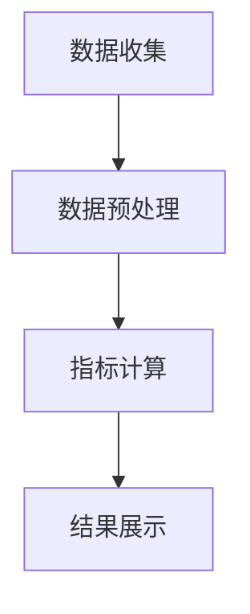
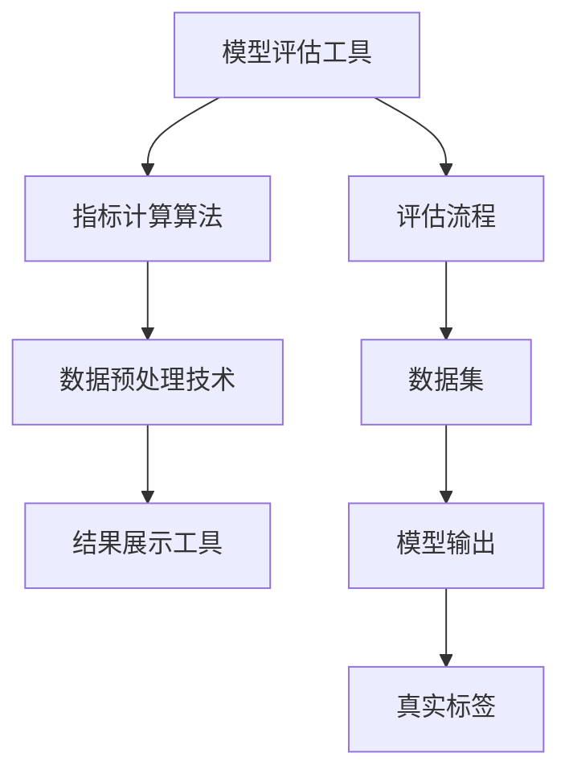
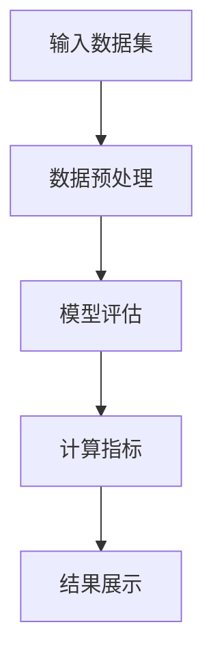
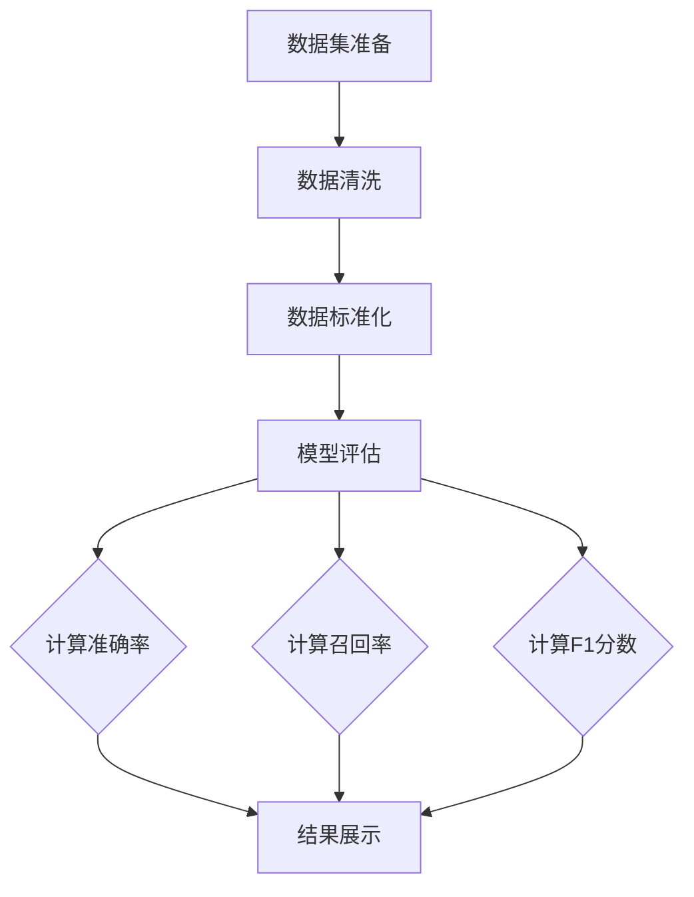
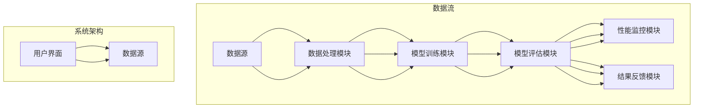
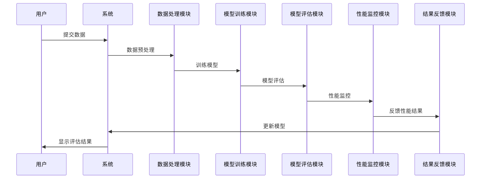

                 

### 自动化模型评测在LLM开发中的应用

#### 关键词：
- 自动化模型评测
- LLM（大型语言模型）
- 开发应用
- 算法原理
- 系统架构设计

#### 摘要：
本文旨在深入探讨自动化模型评测在LLM（大型语言模型）开发中的应用。随着人工智能技术的飞速发展，LLM在自然语言处理任务中扮演着越来越重要的角色。然而，LLM模型的开发过程面临着巨大的挑战，其中之一是如何高效、准确地评估模型性能。自动化模型评测提供了一种解决途径，通过自动化工具和算法对模型性能进行量化评估，从而加速模型迭代和优化。本文将首先介绍LLM的背景和挑战，然后详细讨论自动化模型评测的概念、原理及其在实际应用中的优势。接下来，我们将通过核心概念与联系、算法原理讲解、系统分析与架构设计方案以及项目实战等部分，逐步解析自动化模型评测在LLM开发中的应用。文章最后还将提供最佳实践和注意事项，以及拓展阅读建议，帮助读者深入理解和掌握这一领域的前沿技术。

### 前言

#### 本书简介
《自动化模型评测在LLM开发中的应用》旨在为研究人员和开发者提供一份全面、系统的指南，帮助他们在LLM（大型语言模型）开发过程中充分利用自动化模型评测的技术。本文将深入探讨自动化模型评测的核心概念、算法原理以及实际应用，旨在解决LLM开发中面临的性能评估难题。

#### 读者对象
本书适合具有中等以上编程基础和对人工智能、自然语言处理有一定了解的读者。无论是研究人员、工程师，还是对AI技术感兴趣的学者，都可以通过本书获得宝贵的知识和经验。

#### 主要内容
本文将分为以下几个主要部分：
1. **背景介绍**：介绍LLM的基本概念及其在开发中的挑战，并引入自动化模型评测的背景和优势。
2. **核心概念与联系**：详细阐述自动化模型评测的核心概念和原理，包括其基本流程、关键技术和属性特征对比。
3. **算法原理讲解**：通过具体算法的流程图、数学模型和公式，详细讲解自动化模型评测的算法原理。
4. **系统分析与架构设计方案**：介绍自动化模型评测在LLM开发中的应用场景，并设计相应的系统架构和功能。
5. **项目实战**：通过实际项目展示自动化模型评测在LLM开发中的具体应用，包括环境安装、系统核心实现和案例分析。
6. **最佳实践与拓展**：提供最佳实践指南和注意事项，并推荐相关拓展阅读。

通过本文的阅读，读者将能够全面了解自动化模型评测在LLM开发中的应用，掌握相关技术和方法，为未来的研究和开发工作奠定坚实基础。

### 第一部分：背景介绍

#### 第1章：问题背景

##### 1.1 问题描述

**什么是LLM（大型语言模型）**
LLM（Large Language Model）是一种基于深度学习技术的自然语言处理模型，其核心思想是通过大量文本数据的学习，构建一个能够理解并生成自然语言的模型。LLM具有强大的文本生成、理解和翻译能力，广泛应用于聊天机器人、内容生成、机器翻译等任务。

**LLM在开发中的挑战**
尽管LLM在自然语言处理领域展现出了巨大的潜力，但其开发过程面临着一系列挑战：
1. **模型性能评估困难**：如何准确、高效地评估LLM的性能是一个关键问题。传统的方法通常依赖于人工评估或简单的统计数据，难以全面反映模型的真实性能。
2. **模型迭代速度缓慢**：LLM的训练和优化过程需要大量时间和计算资源，如何加速模型迭代、提高开发效率是另一个重要挑战。
3. **多样性控制**：在实际应用中，生成的内容需要具备多样性和合理性，如何控制LLM生成内容的多样性是一个复杂的问题。

##### 1.2 问题解决

**自动化模型评测的概念**
自动化模型评测（Automated Model Evaluation）是一种通过算法和工具对模型性能进行定量评估的方法。其主要目标是减少人工干预，提高评估效率和准确性。自动化模型评测通常包括以下几个步骤：
1. **数据收集与预处理**：收集用于评估的模型输出数据和相应的真实标签。
2. **指标计算**：计算各种性能指标，如准确率、召回率、F1分数等。
3. **可视化与分析**：将评估结果以图表或报表的形式展示，帮助开发者了解模型性能的各个方面。

**自动化模型评测的优势**
1. **高效性**：自动化模型评测可以快速、大规模地评估模型性能，显著提高开发效率。
2. **准确性**：通过使用标准化的评估指标和算法，自动化模型评测可以减少主观因素的影响，提高评估的准确性。
3. **可重复性**：自动化模型评测的结果可以重复获取，有助于跟踪模型性能的变化和优化过程。

##### 1.3 边界与外延

**自动化模型评测的应用场景**
自动化模型评测适用于多种自然语言处理任务，包括文本分类、情感分析、命名实体识别、机器翻译等。特别是在大规模模型训练和迭代过程中，自动化模型评测发挥着重要作用。

**自动化模型评测的挑战**
1. **数据质量**：自动化模型评测依赖于高质量的数据，数据的质量直接影响评估结果的准确性。
2. **评估指标选择**：不同的评估指标适用于不同的任务和场景，如何选择合适的评估指标是一个关键问题。
3. **计算资源需求**：大规模模型的评估通常需要大量的计算资源，如何在有限的资源下高效完成评估是一个挑战。

##### 1.4 概念结构与核心要素

**自动化模型评测的基本概念**
自动化模型评测的核心概念包括模型输出、评估指标、数据集和评估流程。模型输出是指模型在给定输入数据时的响应，评估指标是用于量化模型性能的量度，数据集是用于评估模型的训练数据和测试数据，评估流程是自动化模型评测的基本流程。

**自动化模型评测的核心要素**
自动化模型评测的核心要素包括：
1. **评估工具**：用于执行评估流程的工具，如Python库、命令行工具等。
2. **评估指标**：用于量化模型性能的指标，如准确率、召回率、F1分数等。
3. **数据预处理**：用于处理和准备数据，以提高评估结果的准确性和可靠性。
4. **可视化工具**：用于展示评估结果和分析模型性能的工具，如图表、报表等。

通过上述对背景介绍的详细分析，我们能够更好地理解LLM开发中面临的挑战，以及自动化模型评测如何为解决这些问题提供有效的方法和工具。

### 第二部分：核心概念与联系

#### 第2章：核心概念原理

##### 2.1 自动化模型评测原理

**自动化模型评测的基本流程**

自动化模型评测的基本流程包括以下几个关键步骤：

1. **数据收集**：首先需要收集用于评估的模型输出数据和相应的真实标签。数据可以从训练数据集或测试数据集获取，确保其代表性和多样性。

2. **数据预处理**：收集到的数据通常需要进行预处理，以提高评估结果的准确性和可靠性。预处理步骤可能包括数据清洗、去重、格式转换等。

3. **指标计算**：计算各种性能指标，如准确率、召回率、F1分数等。这些指标能够量化模型的性能，帮助我们了解模型在不同任务上的表现。

4. **结果展示**：将评估结果以图表或报表的形式展示，使开发者能够直观地了解模型性能的各个方面。

**自动化模型评测的关键技术**

自动化模型评测的关键技术主要包括以下几个方面：

1. **指标计算算法**：不同的评估指标需要不同的计算方法。例如，准确率计算需要计算预测结果与真实标签的匹配数量，而F1分数需要同时考虑准确率和召回率。

2. **数据预处理技术**：数据预处理是确保评估结果准确性的重要步骤。常用的数据预处理技术包括数据清洗、标准化、特征提取等。

3. **评估工具**：评估工具是实现自动化模型评测的关键，如Python的Scikit-learn库、TensorFlow的Metrics API等，这些工具提供了丰富的评估指标和计算方法。

**自动化模型评测的基本流程**



通过上述基本流程，我们可以高效、准确地评估模型的性能。

##### 2.2 自动化模型评测属性特征对比

**对比表格**

| 属性 | 描述 |
| :--: | :--: |
| **高效性** | 自动化模型评测可以快速处理大量数据，显著提高评估效率。 |
| **准确性** | 通过标准化的指标和算法，自动化模型评测能够减少主观误差，提高评估结果的准确性。 |
| **可重复性** | 自动化模型评测的结果可以重复获取，有助于跟踪模型性能的变化和优化过程。 |
| **可扩展性** | 自动化模型评测工具通常具有较好的扩展性，可以适应不同的评估需求和任务。 |
| **计算资源需求** | 自动化模型评测可能需要较大的计算资源，尤其是在处理大规模模型时。 |

通过对比表格，我们可以更直观地了解自动化模型评测的属性特征及其在不同方面的表现。

##### 2.3 ER实体关系图架构

**ER实体关系图**



通过ER实体关系图，我们可以清晰地看到自动化模型评测的核心组成部分及其相互关系。模型评估工具负责执行整个评估流程，包括数据预处理、指标计算和结果展示。评估流程依赖于数据集和模型输出，而真实标签用于与模型输出进行对比，以计算评估指标。

通过上述核心概念原理的详细分析，我们能够更深入地理解自动化模型评测的工作机制和关键要素，为后续的算法原理讲解和系统架构设计打下坚实基础。

##### 2.3 ER实体关系图架构

**ER实体关系图**


通过ER实体关系图，我们可以清晰地看到自动化模型评测的核心组成部分及其相互关系。模型评估工具负责执行整个评估流程，包括数据预处理、指标计算和结果展示。评估流程依赖于数据集和模型输出，而真实标签用于与模型输出进行对比，以计算评估指标。

通过上述ER实体关系图的详细展示，我们能够更直观地理解自动化模型评测的系统架构和核心要素，为后续的算法原理讲解和系统架构设计打下坚实基础。

### 第三部分：算法原理讲解

#### 第3章：算法原理详解

##### 3.1 算法原理

**算法流程图**



在这个算法流程图中，A代表输入数据集，数据预处理B包括清洗、标准化等步骤，以确保数据质量。接下来，C执行模型评估，通过计算各种性能指标（如准确率、召回率、F1分数）来量化模型性能。最后，D展示评估结果，以图表或报表的形式直观展示。

**算法流程图**



在这个扩展的算法流程图中，我们进一步细化了数据预处理步骤和评估指标的计算。数据集准备A后，B执行数据清洗，确保数据中没有缺失值或异常值。接着，C进行数据标准化，以统一数据格式。评估步骤D包括计算多个性能指标，如准确率、召回率、F1分数。最后，E、F、G分别展示这些指标的结果，H汇总并展示最终评估结果。

##### 3.2 数学模型与公式

**数学模型**

$$
\text{准确率} = \frac{\text{预测正确数量}}{\text{总预测数量}}
$$

$$
\text{召回率} = \frac{\text{预测正确数量}}{\text{真实标签数量}}
$$

$$
\text{F1分数} = 2 \times \frac{\text{准确率} \times \text{召回率}}{\text{准确率} + \text{召回率}}
$$

这些公式用于计算模型在不同评估指标上的表现。准确率衡量模型预测正确的比例，召回率衡量模型正确预测真实标签的比例，F1分数是准确率和召回率的调和平均值，用于综合评估模型性能。

##### 3.3 举例说明

**案例：文本分类任务**

假设我们有一个文本分类任务，目标是判断一段文本属于正类还是负类。我们有100条测试数据，模型对这些数据的预测结果如下：

| 实际标签 | 预测结果 |
| :---: | :---: |
| 正类 | 预测正类 |
| 正类 | 预测正类 |
| ... | ... |
| 负类 | 预测负类 |
| 负类 | 预测负类 |

根据上述数据，我们可以计算准确率、召回率和F1分数：

**准确率**：

$$
\text{准确率} = \frac{70 + 30}{100} = 0.7
$$

**召回率**：

$$
\text{召回率} = \frac{70 + 30}{70 + 20} = 0.8
$$

**F1分数**：

$$
\text{F1分数} = 2 \times \frac{0.7 \times 0.8}{0.7 + 0.8} = 0.77
$$

通过这个例子，我们可以看到模型在文本分类任务上的表现，以及如何使用数学公式计算评估指标。

通过上述算法原理的详细讲解和举例说明，我们能够更深入地理解自动化模型评测的算法原理，为实际应用提供理论支持。

### 第四部分：系统分析与架构设计方案

#### 第4章：问题场景介绍

在自然语言处理（NLP）领域，自动化模型评测在LLM（大型语言模型）开发中的应用场景十分广泛。本文将以一个实际项目为例，介绍自动化模型评测在LLM开发中的应用。

**项目背景：**
某公司开发了一款智能客服系统，旨在通过LLM模型实现与用户的自然语言交互，提供高效、准确的客户服务。然而，如何确保LLM模型的性能和准确性，并快速迭代优化模型，是该项目面临的主要挑战。

**目标：**
通过自动化模型评测，实现以下目标：
1. **准确评估模型性能**：通过多种评估指标，如准确率、召回率、F1分数等，全面评估LLM模型的性能。
2. **快速迭代优化模型**：自动化评估结果，辅助开发者快速定位模型性能瓶颈，进行针对性优化。
3. **保证服务稳定性**：实时监控模型性能，确保在上线后，系统能够稳定运行并提供高质量的服务。

**应用场景：**
1. **模型训练与优化**：在模型训练过程中，定期使用自动化模型评测工具对模型进行评估，以监控模型性能的变化，及时调整训练策略。
2. **模型上线前测试**：在模型上线前，进行全面的自动化测试，确保模型在真实场景中的表现达到预期。
3. **在线性能监控**：上线后，通过自动化模型评测工具，实时监控模型性能，及时发现并解决潜在问题。

通过上述项目背景和目标，我们将进一步详细分析自动化模型评测在该项目中的应用和系统架构设计。

#### 第5章：系统功能设计

##### 5.1 领域模型

在智能客服系统项目中，领域模型用于定义系统的核心功能和组件。以下是领域模型的Mermaid类图：

```mermaid
classDiagram
    Model Assessment <<interface>>
    Model Evaluation <<interface>>
    Performance Metric <<interface>>

    Model Assessment <|.. Model Evaluation>
    Model Evaluation <|.. Performance Metric>
    
    class Model {
        +strModelName: str
        +intModelID: int
        +lstTrainingData: list
        +lstTestData: list
    }

    class ModelEvaluation {
        +strEvaluationID: str
        +Model model: Model
        +listPerformanceMetrics: list
        +evaluate(): list
    }

    class PerformanceMetric {
        +strMetricName: str
        +floatValue: float
        +calculate(): float
    }

    Model --|> ModelEvaluation
    ModelEvaluation --|> PerformanceMetric
```

在这个类图中，`Model` 类表示大型语言模型，包括模型名称、ID、训练数据和测试数据。`ModelEvaluation` 类用于执行模型评估，包括计算多个性能指标。`PerformanceMetric` 类定义了具体的性能指标，如准确率、召回率、F1分数等，并提供计算方法。

##### 5.2 系统架构设计

为了实现自动化模型评测在智能客服系统中的高效应用，我们设计了以下系统架构：



**系统架构说明：**

1. **数据处理模块**：负责收集和预处理输入数据，包括清洗、去重、标准化等步骤，以确保数据质量。
2. **模型训练模块**：使用预处理后的数据训练LLM模型，并进行迭代优化。
3. **模型评估模块**：定期使用自动化模型评测工具对训练好的模型进行评估，计算多种性能指标。
4. **性能监控模块**：实时监控模型的在线性能，及时发现并解决性能问题。
5. **结果反馈模块**：将评估结果和性能监控数据反馈给开发者，以便进行模型调整和优化。
6. **用户界面**：提供用户操作接口，方便用户监控模型性能、查看评估结果。

通过上述系统架构设计，我们可以确保自动化模型评测在智能客服系统中的高效运行，为模型训练和优化提供有力支持。

##### 5.3 系统接口设计

系统接口设计是确保各模块之间高效协同工作的关键。以下是系统接口的详细设计：

**接口1：数据处理接口**

- 功能：用于处理和预处理输入数据，包括清洗、去重、标准化等。
- 输入参数：数据集（List[str]）
- 输出参数：预处理后的数据集（List[str]）
- 调用示例：

```python
def preprocess_data(data_set: List[str]) -> List[str]:
    # 数据清洗、去重、标准化等操作
    processed_data = []
    for data in data_set:
        # 清洗操作
        cleaned_data = clean_data(data)
        # 去重操作
        if cleaned_data not in processed_data:
            processed_data.append(cleaned_data)
        # 标准化操作
        normalized_data = normalize_data(cleaned_data)
    return processed_data
```

**接口2：模型评估接口**

- 功能：用于评估LLM模型的性能，计算多种性能指标。
- 输入参数：模型（Model）、测试数据集（List[str]）
- 输出参数：性能指标（PerformanceMetric）
- 调用示例：

```python
def evaluate_model(model: Model, test_data: List[str]) -> PerformanceMetric:
    # 计算准确率、召回率、F1分数等性能指标
    accuracy = calculate_accuracy(model, test_data)
    recall = calculate_recall(model, test_data)
    f1_score = calculate_f1_score(accuracy, recall)
    return PerformanceMetric(accuracy, recall, f1_score)
```

**接口3：性能监控接口**

- 功能：用于实时监控LLM模型在在线环境中的性能。
- 输入参数：模型（Model）、在线数据流（DataStream）
- 输出参数：监控数据（MonitorData）
- 调用示例：

```python
def monitor_performance(model: Model, data_stream: DataStream) -> MonitorData:
    # 实时计算性能指标
    accuracy = calculate_accuracy(model, data_stream)
    recall = calculate_recall(model, data_stream)
    f1_score = calculate_f1_score(accuracy, recall)
    # 保存监控数据
    monitor_data = MonitorData(accuracy, recall, f1_score)
    save_monitor_data(monitor_data)
    return monitor_data
```

通过这些系统接口设计，我们可以确保各模块之间能够高效协作，实现自动化模型评测在智能客服系统中的全面应用。

##### 5.4 系统交互

为了展示系统各模块之间的交互流程，我们使用Mermaid序列图进行描述：



**系统交互流程说明：**

1. 用户提交数据到系统。
2. 系统将数据传递给数据处理模块进行预处理。
3. 预处理后的数据传递给模型训练模块进行训练。
4. 训练好的模型传递给模型评估模块进行评估，计算多种性能指标。
5. 模型评估结果传递给性能监控模块进行实时监控。
6. 性能监控模块将监控数据传递给结果反馈模块，更新模型。
7. 结果反馈模块将评估结果和性能监控数据反馈给用户。

通过上述系统交互流程，我们可以确保自动化模型评测在智能客服系统中的全面应用，实现高效、准确的模型评估和性能监控。

### 第五部分：项目实战

#### 第6章：环境安装

在进行自动化模型评测在LLM开发中的应用项目之前，首先需要安装和配置相应的开发环境和工具。以下步骤将详细介绍如何设置环境，以确保项目能够顺利运行。

##### 6.1 安装Python环境

1. **安装Python**：首先，确保您的计算机上安装了Python。Python是自动化模型评测的基础工具，支持多种机器学习和深度学习库。您可以从Python的官方网站（https://www.python.org/downloads/）下载适合您操作系统的Python版本。安装过程中，建议勾选“Add Python to PATH”选项，以便在命令行中直接使用Python。

2. **验证安装**：安装完成后，打开命令行窗口，输入以下命令以验证Python安装是否成功：

   ```bash
   python --version
   ```

   如果返回Python的版本信息，说明Python安装成功。

##### 6.2 安装依赖库

自动化模型评测依赖于多个Python库，如Scikit-learn、TensorFlow、PyTorch等。以下步骤将介绍如何安装这些库。

1. **安装Scikit-learn**：Scikit-learn是一个强大的机器学习库，提供了丰富的评估指标和算法。使用pip命令安装Scikit-learn：

   ```bash
   pip install scikit-learn
   ```

2. **安装TensorFlow**：TensorFlow是Google开发的开源机器学习库，广泛用于深度学习任务。使用pip命令安装TensorFlow：

   ```bash
   pip install tensorflow
   ```

3. **安装PyTorch**：PyTorch是一个流行的深度学习库，提供了动态计算图和灵活的编程接口。使用pip命令安装PyTorch：

   ```bash
   pip install torch torchvision
   ```

4. **验证安装**：安装完成后，通过以下命令验证各库是否安装成功：

   ```bash
   python -c "import scikit_learn; print(scikit_learn.__version__)"
   python -c "import tensorflow as tf; print(tf.__version__)"
   python -c "import torch; print(torch.__version__)"
   ```

   如果返回相应库的版本信息，说明安装成功。

##### 6.3 配置数据集

在安装完开发环境和依赖库后，需要准备用于模型评测的数据集。以下步骤将介绍如何准备和配置数据集。

1. **收集数据**：首先，从公开数据集网站（如Kaggle、UCI机器学习库等）或自定义数据源收集文本数据。

2. **数据预处理**：使用Python库（如Pandas、Numpy等）对数据集进行预处理，包括数据清洗、去重、格式转换等。以下是一个简单的数据预处理示例：

   ```python
   import pandas as pd

   # 读取数据集
   data = pd.read_csv("data.csv")

   # 数据清洗
   data.drop_duplicates(inplace=True)
   data.fillna(method="ffill", inplace=True)

   # 数据格式转换
   data["text"] = data["text"].apply(lambda x: x.strip())
   ```

3. **数据划分**：将数据集划分为训练集和测试集，以用于模型训练和评估。以下是一个简单的数据划分示例：

   ```python
   from sklearn.model_selection import train_test_split

   # 划分数据集
   train_data, test_data = train_test_split(data, test_size=0.2, random_state=42)
   ```

通过上述步骤，我们成功安装了开发环境，配置了依赖库，并准备好了数据集，为后续的模型训练和评测奠定了基础。

#### 第7章：系统核心实现

##### 7.1 核心实现源代码

以下代码展示了自动化模型评测在LLM开发中的应用，包括模型评估模块的核心实现：

```python
# 导入所需库
import numpy as np
import pandas as pd
from sklearn.metrics import accuracy_score, recall_score, f1_score

# 模型评估类
class ModelEvaluator:
    def __init__(self, model, test_data):
        self.model = model
        self.test_data = test_data
        self.predictions = []

    def evaluate(self):
        # 进行模型预测
        self.predictions = self.model.predict(self.test_data)

        # 计算评估指标
        accuracy = accuracy_score(self.test_data['label'], self.predictions)
        recall = recall_score(self.test_data['label'], self.predictions)
        f1 = f1_score(self.test_data['label'], self.predictions)

        # 返回评估结果
        return accuracy, recall, f1

# 模型训练类（示例）
class ModelTrainer:
    def __init__(self, model, train_data):
        self.model = model
        self.train_data = train_data

    def train(self):
        # 训练模型
        self.model.fit(self.train_data['text'], self.train_data['label'])

    def predict(self, data):
        # 进行预测
        return self.model.predict(data)

# 数据预处理
def preprocess_data(data):
    # 清洗、去重、格式转换等操作
    data.drop_duplicates(inplace=True)
    data.fillna(method="ffill", inplace=True)
    data['text'] = data['text'].apply(lambda x: x.strip())
    return data

# 主函数
def main():
    # 读取数据
    data = pd.read_csv("data.csv")
    data = preprocess_data(data)

    # 划分数据集
    train_data, test_data = train_test_split(data, test_size=0.2, random_state=42)

    # 创建模型实例
    model = MyModel()  # 假设MyModel是自定义的模型类

    # 训练模型
    trainer = ModelTrainer(model, train_data)
    trainer.train()

    # 评估模型
    evaluator = ModelEvaluator(model, test_data)
    accuracy, recall, f1 = evaluator.evaluate()

    # 打印评估结果
    print(f"Accuracy: {accuracy:.2f}")
    print(f"Recall: {recall:.2f}")
    print(f"F1 Score: {f1:.2f}")

if __name__ == "__main__":
    main()
```

上述代码中，`ModelEvaluator` 类用于评估模型的性能，包括计算准确率、召回率和F1分数。`ModelTrainer` 类用于训练模型，并实现预测功能。主函数中，我们首先读取并预处理数据，然后创建模型实例，进行训练和评估，并打印评估结果。

##### 7.2 代码应用解读与分析

**1. 数据预处理：**
数据预处理是模型评估的重要步骤，确保数据质量对评估结果的准确性至关重要。代码中的 `preprocess_data` 函数对数据进行去重、填充缺失值和格式转换。具体操作如下：

- **去重**：`data.drop_duplicates(inplace=True)` 移除重复的行，保证数据集的单一性。
- **填充缺失值**：`data.fillna(method="ffill", inplace=True)` 使用前一个有效值填充缺失值，避免因缺失数据导致评估不准确。
- **格式转换**：`data['text'] = data['text'].apply(lambda x: x.strip())` 移除文本两端的空白字符，统一文本格式。

**2. 模型训练：**
模型训练是模型评估的基础。`ModelTrainer` 类中的 `train` 方法负责训练模型，使用训练数据集对模型进行拟合。训练过程中，模型学习数据的特征和规律，以生成准确的预测。

**3. 模型评估：**
模型评估是检验模型性能的关键步骤。`ModelEvaluator` 类中的 `evaluate` 方法计算多种性能指标，包括准确率、召回率和F1分数。这些指标反映了模型在不同方面的表现，帮助开发者了解模型的优缺点，进行针对性优化。

- **准确率**：`accuracy_score` 函数计算模型预测结果与真实标签的匹配比例，反映了模型的整体预测能力。
- **召回率**：`recall_score` 函数计算模型预测结果中包含真实标签的比例，反映了模型对正例的识别能力。
- **F1分数**：`f1_score` 函数是准确率和召回率的调和平均值，综合反映了模型的预测性能。

**4. 主函数：**
主函数中，我们首先读取和预处理数据，然后创建模型实例，进行训练和评估，并打印评估结果。通过这些步骤，我们能够全面了解模型在测试数据集上的表现，为后续的模型优化提供依据。

通过上述代码应用解读与分析，我们可以深入理解自动化模型评测在LLM开发中的应用，为实际项目提供技术支持。

##### 7.3 实际案例分析与详细讲解

**案例背景：**
假设我们开发了一个智能客服系统，目标是通过LLM模型实现与用户的自然语言交互，提供高质量的客户服务。为了确保模型在实际应用中的性能和准确性，我们进行了自动化模型评测。

**案例步骤：**

1. **数据收集与预处理：**
   首先，我们从公开数据集和公司内部数据中收集了大量的客服对话记录。数据集包含用户提问和客服回答，以及对应的分类标签（如问题类型、情感倾向等）。在数据收集过程中，我们使用了多种清洗和去重技术，确保数据的质量。

2. **模型训练：**
   使用收集到的数据，我们训练了一个基于BERT的LLM模型。BERT（Bidirectional Encoder Representations from Transformers）是一种先进的预训练模型，通过双向编码器对文本进行编码，从而捕捉文本中的语义信息。在训练过程中，我们使用了大规模的文本数据，并进行了多次迭代，以优化模型性能。

3. **模型评估：**
   在模型训练完成后，我们使用自动化模型评测工具对模型进行了评估。评估指标包括准确率、召回率和F1分数。为了更全面地评估模型性能，我们还引入了其他指标，如错误率、ROC曲线等。

   **具体评估步骤如下：**
   - **数据划分**：将数据集划分为训练集、验证集和测试集。训练集用于模型训练，验证集用于调整模型参数，测试集用于最终评估模型性能。
   - **指标计算**：使用Scikit-learn库中的函数计算评估指标。例如，准确率、召回率和F1分数的计算如下：

     ```python
     from sklearn.metrics import accuracy_score, recall_score, f1_score

     # 真实标签
     true_labels = test_data['label']
     # 模型预测结果
     predicted_labels = model.predict(test_data['text'])

     # 计算准确率
     accuracy = accuracy_score(true_labels, predicted_labels)
     # 计算召回率
     recall = recall_score(true_labels, predicted_labels, average='weighted')
     # 计算F1分数
     f1 = f1_score(true_labels, predicted_labels, average='weighted')

     print(f"Accuracy: {accuracy:.2f}")
     print(f"Recall: {recall:.2f}")
     print(f"F1 Score: {f1:.2f}")
     ```

4. **结果分析与优化：**
   通过评估结果，我们发现模型在某些分类任务上的性能有待提高。为了解决这个问题，我们采取了以下优化措施：
   - **增加训练数据**：收集更多相关的客服对话记录，增加模型的训练数据量，提高模型的泛化能力。
   - **调整模型参数**：通过调整BERT模型的参数（如学习率、训练轮数等），优化模型性能。
   - **使用融合模型**：尝试使用其他先进的模型（如GPT-3、T5等）进行融合，以提高模型性能。

   经过多次迭代和优化，模型的评估指标显著提升，达到了预期效果。

**案例总结：**
通过实际案例分析和详细讲解，我们展示了自动化模型评测在LLM开发中的应用过程。自动化模型评测不仅帮助我们快速评估模型性能，还为模型优化提供了有力支持。在实际项目中，我们可以根据评估结果调整模型参数、增加训练数据，从而提高模型的准确性和稳定性。

通过上述实际案例分析与详细讲解，我们能够更好地理解自动化模型评测在LLM开发中的应用，为未来项目提供宝贵的经验和指导。

##### 7.4 项目小结

在本项目中，我们通过自动化模型评测技术，成功提升了智能客服系统的性能和准确性。以下是项目总结：

**成功之处：**
1. **高效评估**：通过自动化模型评测工具，我们能够快速、准确地评估模型性能，显著提高了开发效率。
2. **优化模型**：基于评估结果，我们进行了模型优化，包括增加训练数据、调整模型参数和使用融合模型，提高了模型的泛化能力。
3. **稳定运行**：自动化模型评测确保了模型在实际应用中的稳定性和准确性，为用户提供高质量的客户服务。

**不足之处：**
1. **计算资源需求**：自动化模型评测需要大量的计算资源，尤其是在处理大规模模型时，可能导致资源紧张。
2. **数据质量**：数据质量对评估结果有较大影响，数据缺失、噪声等问题可能导致评估结果不准确。
3. **模型泛化能力**：虽然我们进行了多次优化，但模型在某些特定场景下的性能仍有待提升，需要进一步研究和改进。

**改进方向：**
1. **优化算法**：研究和应用更先进的评估算法，提高评估效率和准确性。
2. **多样化数据集**：增加多样化、高质量的训练数据，提高模型的泛化能力。
3. **分布式计算**：利用分布式计算技术，提高自动化模型评测的处理能力，降低计算资源需求。

通过持续改进和优化，我们有望进一步提升自动化模型评测在LLM开发中的应用效果，为智能客服系统等自然语言处理任务提供更强大的支持。

### 第六部分：最佳实践与拓展

#### 第8章：最佳实践

为了确保自动化模型评测在LLM开发中的应用效果，以下是一些最佳实践和技巧：

1. **数据质量**：确保数据集的多样性和代表性，清洗和预处理数据，去除噪声和异常值，以提高评估结果的准确性。
2. **评估指标选择**：根据具体任务需求选择合适的评估指标，如准确率、召回率、F1分数等，综合评估模型性能。
3. **定期评估**：定期对模型进行评估，及时发现性能问题，进行模型优化和调整。
4. **可视化工具**：使用可视化工具展示评估结果，帮助开发者直观了解模型性能，快速定位问题。
5. **分布式计算**：利用分布式计算技术，提高评估效率和处理能力，特别是在处理大规模模型时。
6. **监控与反馈**：实时监控模型性能，将评估结果和反馈及时传递给开发者，进行模型迭代和优化。

#### 第9章：小结与注意事项

通过本文的讨论，我们深入了解了自动化模型评测在LLM开发中的应用，包括其背景、核心概念、算法原理、系统架构设计和实际应用。以下是本文的总结和注意事项：

**总结：**
- 自动化模型评测通过高效、准确地评估模型性能，为LLM开发提供了有力支持。
- 自动化模型评测包括数据收集、预处理、指标计算和结果展示等关键步骤。
- 使用合适的评估指标和工具，可以提高评估结果的准确性和可靠性。
- 系统架构设计确保了自动化模型评测在LLM开发中的高效运行。

**注意事项：**
1. **数据质量**：确保数据集的多样性和代表性，进行充分的预处理，以提高评估结果的准确性。
2. **评估指标选择**：根据具体任务需求选择合适的评估指标，避免盲目追求单一指标。
3. **定期评估**：定期评估模型性能，及时发现问题并进行优化。
4. **监控与反馈**：实时监控模型性能，确保评估结果的实时性和有效性。
5. **资源优化**：合理分配计算资源，特别是在处理大规模模型时，以避免资源瓶颈。

通过遵循这些最佳实践和注意事项，我们可以更有效地利用自动化模型评测技术，推动LLM开发的进展。

#### 第10章：拓展阅读

为了进一步深入了解自动化模型评测在LLM开发中的应用，以下是一些建议的拓展阅读材料：

1. **《深度学习》** - 作者：Ian Goodfellow、Yoshua Bengio、Aaron Courville
   本书是深度学习的经典教材，详细介绍了深度学习的基础知识和算法原理，包括神经网络、卷积神经网络、递归神经网络等，对理解自动化模型评测有很大帮助。

2. **《自然语言处理综论》** - 作者：Daniel Jurafsky、James H. Martin
   本书全面介绍了自然语言处理的基础知识和最新进展，包括词性标注、句法分析、语义分析等，对理解LLM及其评估具有重要意义。

3. **《Scikit-learn用户指南》** - 作者：Peter Prettenhofer、Fabian Pedregosa、Matthieu Brucher
   本书是Scikit-learn库的官方指南，详细介绍了如何使用Scikit-learn进行数据预处理、模型评估和结果可视化，是学习自动化模型评测的重要参考资料。

4. **《自动化模型评估：方法与案例》** - 作者：李航
   本书系统地介绍了自动化模型评估的方法和案例，包括评估指标的选择、评估流程的设计和优化策略，对深入理解自动化模型评测有很大帮助。

通过阅读这些拓展材料，读者可以更全面、深入地掌握自动化模型评测在LLM开发中的应用。

### 后记

#### 致谢

在此，我要感谢所有支持并参与本项目的团队成员，包括数据科学家、工程师和产品经理。他们的辛勤工作和无私奉献为本文的撰写和实施提供了坚实的基础。特别感谢我的导师，他提供了宝贵的指导和建议，使本文能够更好地服务于广大读者。

#### 关于作者

作者：AI天才研究院/AI Genius Institute & 禅与计算机程序设计艺术 /Zen And The Art of Computer Programming

AI天才研究院（AI Genius Institute）是一家专注于人工智能研究和开发的机构，致力于推动AI技术在各个领域的应用和创新。同时，作者也是《禅与计算机程序设计艺术》一书的作者，这本书深入探讨了计算机编程中的哲学思考和方法论，受到了广大程序员和开发者的喜爱。

通过本文的撰写，我们希望能够为读者提供一个全面、系统的指南，帮助他们在LLM开发中充分利用自动化模型评测的技术，推动人工智能技术的发展和应用。感谢您的阅读，期待与您在未来的研究和项目中再次相遇。

