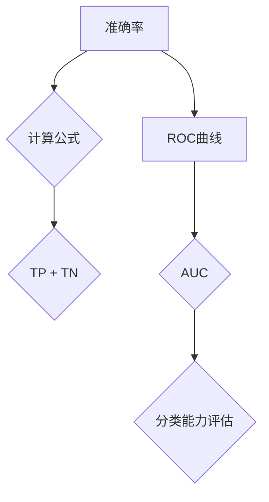

                 

### 引言

#### 1.1 自动化测试的重要性

在当今快速发展的软件行业中，自动化测试已经成为了提高软件质量和效率的关键手段之一。自动化测试通过编写脚本，实现对软件功能的自动验证，从而取代了传统的手动测试方法。这不仅显著提高了测试效率，还能有效降低成本，提高测试覆盖率。特别是在大型软件开发项目中，自动化测试的重要性愈发凸显。

首先，自动化测试可以大大提高测试效率。传统的手动测试需要测试人员逐一执行测试用例，费时费力，而且容易出错。而自动化测试则通过脚本化操作，可以在短时间内执行大量测试用例，显著缩短测试周期。其次，自动化测试可以持续集成到持续集成（CI）流程中，实现自动化构建和部署，进一步加快开发进度。

此外，自动化测试能够提高测试覆盖率。通过编写多样化的测试脚本，自动化测试可以覆盖更多的功能点和边界情况，从而更全面地发现软件缺陷。特别是在复杂系统和高频变更的项目中，自动化测试能够更好地适应变化，保持测试的一致性和完整性。

总之，自动化测试在提高软件质量和开发效率方面发挥着至关重要的作用。随着技术的不断进步，自动化测试的应用范围也在不断扩展，从简单的功能测试到性能测试、安全测试等，自动化测试已经成为软件工程中不可或缺的一环。

#### 1.2 LLM评测的需求与挑战

大型语言模型（LLM）作为自然语言处理（NLP）领域的重要工具，已经在各种应用场景中取得了显著成果，如文本生成、机器翻译、问答系统等。然而，随着模型规模和复杂性的增加，如何有效地评测LLM的性能和质量成为了一个关键问题。

首先，LLM评测的需求主要来源于模型性能的评估和优化。在开发LLM的过程中，需要通过一系列评测指标来衡量模型的准确度、鲁棒性和泛化能力。这些评测指标包括准确率、召回率、F1分数、ROC曲线和AUC等。有效的评测不仅有助于判断模型的好坏，还能为模型的优化提供有价值的参考。

然而，LLM评测面临着诸多挑战。一方面，LLM模型的复杂性和多样性使得评测过程变得复杂。不同的LLM模型可能适用于不同的应用场景，需要设计相应的评测指标和评测流程。另一方面，LLM评测的数据集往往需要大量的标注工作，且数据的质量和多样性对评测结果有着重要影响。此外，评测过程中的性能优化也是一个挑战，如何平衡评测效率和准确性，如何快速适应模型更新和变化，都是需要解决的问题。

总之，有效且准确的LLM评测对于提升模型质量和应用效果至关重要。面对挑战，开发出高效的自动化测试脚本，对提升评测效率和质量具有重要意义。

#### 1.3 书籍目标与读者对象

本书籍旨在深入探讨自动化测试脚本在大型语言模型（LLM）评测中的应用，通过系统性的讲解和实践指导，帮助读者全面掌握这一技术。本书的目标是：

1. **系统化讲解自动化测试原理**：从基础概念、核心原理到实际应用，全面介绍自动化测试的基本知识和实践技巧。
2. **详细阐述LLM评测方法**：讲解LLM评测的核心指标、评测流程以及面临的挑战，为读者提供实用的评测方案。
3. **实战案例分析**：通过具体案例，展示如何设计和实现自动化测试脚本，解析评测结果，并提供优化策略。
4. **最佳实践分享**：总结自动化测试的最佳实践，包括测试覆盖率分析、性能优化、脚本维护和持续集成等，帮助读者在实际项目中有效应用。

本书籍适合以下读者群体：

1. **软件开发工程师**：希望提高软件质量和开发效率，对自动化测试有初步了解的工程师。
2. **测试工程师**：专注于自动化测试，希望进一步提升测试能力和技巧的专业人士。
3. **人工智能与自然语言处理研究者**：在LLM应用中面临评测难题，需要高效评测方法和工具的研究者。
4. **高校师生**：从事软件工程、自动化测试、人工智能等相关领域教学和研究的人员。

通过阅读本书，读者不仅能够深入理解自动化测试和LLM评测的理论知识，还能通过实践案例掌握实际应用技巧，为未来的项目开发提供有力支持。

---

## 第2章 自动化测试基础

### 2.1 自动化测试概述

#### 核心概念

自动化测试是指通过编写脚本或使用工具，对软件系统的功能、性能、安全等方面进行自动化的验证和评估。与手动测试相比，自动化测试能够提高测试效率，减少测试成本，并提高测试覆盖率。

#### 问题背景

在软件开发过程中，测试是确保软件质量的重要环节。随着软件系统复杂性的增加，手动测试的效率逐渐降低，且容易出现人为错误。为了应对这一挑战，自动化测试应运而生。自动化测试通过脚本化操作，可以自动执行测试用例，重复性和自动化程度高，大大提高了测试效率。

#### 问题解决

自动化测试的主要目的是发现软件缺陷，确保软件质量。通过自动化测试，测试人员可以集中精力处理复杂的测试场景和边界情况，而简单的重复性工作则由测试脚本完成。自动化测试还可以与持续集成（CI）系统结合，实现自动化构建、测试和部署，进一步加快开发进度。

#### 边界与外延

自动化测试不仅仅局限于功能测试，还包括性能测试、安全测试等。性能测试通过模拟高负载场景，评估系统的响应时间和稳定性。安全测试则通过自动化工具检查系统的安全性，发现潜在的安全漏洞。此外，自动化测试可以应用于不同类型的应用程序，包括Web应用、移动应用和桌面应用等。

#### 概念结构与核心要素组成

自动化测试的核心概念包括测试用例、测试脚本、测试工具和测试报告。测试用例是自动化测试的基本单元，描述了测试的目标和操作步骤。测试脚本则是实现自动化测试的核心，通过编程语言编写，执行测试用例。测试工具用于生成、管理和执行测试脚本，常见的工具包括Selenium、JUnit、TestNG等。测试报告则用于记录测试结果，提供测试反馈。

### 2.2 测试脚本的基本结构

测试脚本是自动化测试的核心，其基本结构通常包括以下几个部分：

1. **初始化**：初始化测试环境，包括打开浏览器、登录系统等。
2. **执行测试用例**：按照测试用例的步骤进行操作，如输入数据、点击按钮、验证结果等。
3. **结果验证**：对比预期结果和实际结果，判断测试是否通过。
4. **异常处理**：处理测试过程中出现的异常情况，如页面加载失败、网络异常等。
5. **清理环境**：关闭浏览器、清理数据等，为下一次测试做准备。

以下是一个简单的Python测试脚本示例：

```python
import unittest
from selenium import webdriver

class TestCase(unittest.TestCase):
    def setUp(self):
        self.driver = webdriver.Firefox()

    def test_example(self):
        self.driver.get("http://www.example.com")
        self.assertIn("Example Domain", self.driver.title)

    def tearDown(self):
        self.driver.quit()

if __name__ == "__main__":
    unittest.main()
```

### 2.3 常用自动化测试工具

自动化测试工具是实现自动化测试的关键，常见的自动化测试工具有：

1. **Selenium**：一款开源的自动化测试工具，支持多种浏览器和操作系统，适用于Web应用的自动化测试。
2. **JUnit**：Java语言编写的一个开源自动化测试框架，广泛应用于Java项目的单元测试。
3. **TestNG**：一款基于JUnit的自动化测试框架，提供了更多的功能，如参数化测试、依赖测试等。
4. **Appium**：一款开源的自动化测试工具，用于移动应用的自动化测试，支持多种平台和编程语言。
5. **JMeter**：一款开源的性能测试工具，用于模拟高负载场景，评估系统的性能和稳定性。

通过选择合适的自动化测试工具，可以更高效地实现自动化测试，提高测试质量和效率。

---

## 第3章 LLM评测概述

### 3.1 LLM简介

#### 核心概念

大型语言模型（Large Language Model，简称LLM）是一种基于深度学习的自然语言处理（Natural Language Processing，简称NLP）模型，通过训练大规模的文本数据集，实现对自然语言的高效理解和生成。LLM在文本分类、情感分析、命名实体识别、机器翻译等领域具有广泛的应用。

#### 问题背景

随着深度学习技术的快速发展，LLM已经成为了NLP领域的重要工具。传统的NLP方法通常依赖于手工设计的特征和规则，而LLM通过端到端的神经网络模型，能够自动学习语言的复杂结构和语义信息。这使得LLM在处理大规模文本数据和复杂语言任务时表现出色。

#### 问题解决

为了解决复杂语言任务，LLM通常采用生成对抗网络（Generative Adversarial Networks，简称GAN）进行预训练，然后通过微调（Fine-tuning）策略适应特定的应用场景。预训练过程中，LLM通过对抗训练生成高质量的文本，从而提升模型的表达能力和鲁棒性。

#### 边界与外延

LLM的应用范围不仅限于文本生成，还可以用于问答系统、对话系统、文本摘要等任务。随着模型规模的不断扩大，LLM在处理长文本和复杂语言结构方面具有显著优势。然而，LLM的训练和推理过程对计算资源的要求较高，且存在一定的数据隐私和安全问题。

#### 概念属性特征对比表格

| 概念 | 属性特征 |
| ---- | ---- |
| LLM | 大规模训练、端到端学习、高效生成、高鲁棒性 |
| GAN | 对抗训练、生成器和判别器、高质量生成 |
| NLP | 文本分类、情感分析、命名实体识别、机器翻译 |

#### ER实体关系图架构

```mermaid
erDiagram
  Model ||--|{ Dataset }  : has
  Model ||--|{ Metrics }  : evaluate
  Dataset ||--|{ Data }  : contains
  Metrics ||--|{ Score }  : record
```

### 3.2 评测指标

#### 核心概念

在LLM评测中，评测指标是评估模型性能的关键标准。常见的评测指标包括准确率（Accuracy）、召回率（Recall）、F1分数（F1 Score）、ROC曲线（Receiver Operating Characteristic）和AUC（Area Under Curve）。

#### 原理讲解

- **准确率（Accuracy）**：准确率是模型预测正确的样本数占总样本数的比例。公式为：
  $$Accuracy = \frac{TP + TN}{TP + FN + FP + TN}$$
  其中，TP为真正例，TN为真反例，FP为假正例，FN为假反例。

- **召回率（Recall）**：召回率是模型正确识别的真正例数占总真正例数的比例。公式为：
  $$Recall = \frac{TP}{TP + FN}$$

- **F1分数（F1 Score）**：F1分数是精确率和召回率的调和平均，用于平衡两者之间的关系。公式为：
  $$F1 Score = 2 \times \frac{Precision \times Recall}{Precision + Recall}$$
  其中，Precision为精确率，即预测为正例的样本中实际为正例的比例。

- **ROC曲线（Receiver Operating Characteristic）**：ROC曲线是通过改变分类阈值，绘制真正例率（Recall）对假正例率（False Positive Rate）的曲线。曲线下的面积（AUC）越大，表示模型的分类能力越强。

- **AUC（Area Under Curve）**：AUC是ROC曲线下的面积，用于评估模型的分类能力。AUC值介于0和1之间，值越大，表示模型的分类性能越好。

#### 概念属性特征对比表格

| 指标 | 公式 | 优点 | 缺点 |
| ---- | ---- | ---- | ---- |
| 准确率 | $$Accuracy = \frac{TP + TN}{TP + FN + FP + TN}$$ | 易理解，直观反映模型性能 | 对不平衡数据敏感 |
| 召回率 | $$Recall = \frac{TP}{TP + FN}$$ | 反映模型识别真正例的能力 | 易受假反例影响 |
| F1分数 | $$F1 Score = 2 \times \frac{Precision \times Recall}{Precision + Recall}$$ | 平衡精确率和召回率 | 受分类阈值影响 |
| ROC曲线 | - | 反映模型分类能力，通过AUC评估 | 需要改变分类阈值 |
| AUC | - | AUC值越大，分类能力越强 | ROC曲线形状对AUC影响较大 |

#### Mermaid流程图



### 3.3 评测流程

#### 核心概念

LLM评测流程主要包括数据准备、模型训练、模型评估和模型优化四个阶段。每个阶段都有其特定的任务和目标，相互关联，共同保证LLM的性能和质量。

#### 原理讲解

- **数据准备**：数据准备是LLM评测的基础，包括数据收集、数据预处理和数据集划分。数据收集涉及从不同来源获取大量文本数据，如互联网、书籍、新闻等。数据预处理包括文本清洗、分词、去停用词等，以提升数据质量和一致性。数据集划分则将数据分为训练集、验证集和测试集，用于模型的训练、验证和评估。

- **模型训练**：模型训练阶段通过将数据输入到LLM中，使用梯度下降等优化算法调整模型参数，使其能够更好地理解和生成文本。预训练过程中，LLM通过生成对抗网络（GAN）学习文本的高质量特征，然后在特定任务上进行微调（Fine-tuning），以适应实际应用场景。

- **模型评估**：模型评估阶段通过一系列评测指标（如准确率、召回率、F1分数等）对模型性能进行评估。评估过程通常在验证集和测试集上进行，以避免过拟合。通过对比不同模型的性能，选择最优模型用于实际应用。

- **模型优化**：模型优化阶段基于评估结果，对模型进行调整和改进，以提高性能。优化策略包括调整超参数、增加训练数据、使用更复杂的模型结构等。优化的目标是找到性能最佳的模型，并在实际应用中验证其效果。

#### Mermaid流程图


通过以上流程，可以系统地评估和优化LLM的性能，确保其在实际应用中的有效性和可靠性。

---

## 第4章 自动化测试脚本设计

### 4.1 测试脚本设计原则

测试脚本的设计是自动化测试成功的关键。为了确保测试脚本的可靠性和高效性，需要遵循以下设计原则：

#### 核心概念

1. **可读性**：测试脚本应具有良好的可读性，便于维护和扩展。使用有意义的变量名和注释，使脚本易于理解和修改。
2. **模块化**：将测试脚本划分为多个模块，每个模块负责一个特定的功能，如数据初始化、测试用例执行和结果验证等。模块化可以提高代码的重用性和可维护性。
3. **可复用性**：设计可复用的测试脚本模块，以减少重复代码。例如，可以将常见的操作如登录、数据查询等封装为独立模块，方便在不同测试用例中复用。
4. **可扩展性**：设计测试脚本时，应考虑未来的扩展需求。例如，可以预留参数化测试接口，以便后续增加新的测试场景。

#### 原理讲解

1. **代码复用**：通过函数和类封装，将常见的操作封装为独立的函数或类，提高代码的可复用性。例如，可以使用一个登录函数，在多个测试用例中调用，以简化测试脚本的编写和维护。
2. **异常处理**：在测试脚本中添加异常处理机制，捕获并处理可能出现的运行时错误，确保测试过程不会因个别错误而中断。例如，可以使用try-except语句捕获异常，并进行相应的错误处理和日志记录。
3. **数据驱动**：使用外部数据文件（如CSV、Excel等）存储测试数据，使测试脚本更具灵活性和可扩展性。例如，可以将测试数据与测试脚本分离，通过读取外部文件动态加载，以适应不同的测试场景。
4. **日志记录**：在测试脚本中添加日志记录功能，记录测试过程中的关键信息，如测试执行时间、测试结果等。日志记录有助于问题追踪和调试，提升测试脚本的可维护性。

#### 实例

以下是一个简单的Python测试脚本示例，展示了一些设计原则的应用：

```python
import unittest
from selenium import webdriver
import logging

class TestLoginPage(unittest.TestCase):

    def setUp(self):
        self.driver = webdriver.Firefox()
        logging.basicConfig(level=logging.INFO)

    def test_login_success(self):
        self.driver.get("http://www.example.com/login")
        self.driver.find_element_by_name("username").send_keys("test_user")
        self.driver.find_element_by_name("password").send_keys("test_password")
        self.driver.find_element_by_name("submit").click()
        actual_title = self.driver.title
        expected_title = "Example Domain - Home"
        self.assertEqual(actual_title, expected_title)
        logging.info("Login successful")

    def tearDown(self):
        self.driver.quit()

if __name__ == "__main__":
    unittest.main()
```

在该示例中，测试脚本具有良好的可读性、模块化和可复用性。使用logging模块记录测试执行过程中的关键信息，提高了脚本的可维护性。

### 4.2 测试用例设计

测试用例是自动化测试的核心单元，用于描述测试的目标、操作步骤和预期结果。一个良好的测试用例应具备以下特点：

#### 核心概念

1. **明确性**：测试用例应明确描述测试目标，包括测试的功能点、输入数据和预期结果。
2. **完整性**：测试用例应包含所有可能的操作步骤和边界条件，确保测试覆盖全面。
3. **可执行性**：测试用例应能够通过自动化测试工具执行，操作步骤具体且可自动化实现。
4. **可复用性**：测试用例应设计为可复用的，以减少重复劳动。

#### 原理讲解

1. **功能测试用例**：功能测试用例用于验证软件功能是否符合需求。设计功能测试用例时，应从需求文档中提取关键功能点，结合实际操作流程，描述输入数据和预期结果。例如，一个登录功能的测试用例可能包括以下步骤：
   - 输入正确的用户名和密码，点击登录按钮，预期页面跳转到登录后的主页。
   - 输入错误的用户名或密码，点击登录按钮，预期出现错误提示。

2. **边界测试用例**：边界测试用例用于验证软件在边界条件下的行为。边界条件包括最小值、最大值、边界值等。设计边界测试用例时，应考虑不同边界条件下的输入数据和预期结果。例如，一个输入框的最大长度为100个字符，可以设计以下边界测试用例：
   - 输入99个字符，预期输入框可以正常显示。
   - 输入100个字符，预期输入框可以正常显示，但超过100个字符的部分不被接受。
   - 输入101个字符，预期输入框只显示100个字符，并出现错误提示。

3. **异常测试用例**：异常测试用例用于验证软件在异常情况下的行为。设计异常测试用例时，应考虑可能的异常情况，如网络中断、数据库连接失败等，描述输入数据和预期结果。例如，一个网络连接异常的测试用例可能包括以下步骤：
   - 在网络中断的情况下，尝试访问网页，预期页面显示网络错误提示。
   - 在数据库连接失败的情况下，执行数据查询操作，预期出现数据库连接失败的错误提示。

4. **参数化测试用例**：参数化测试用例用于验证不同输入参数下的软件行为。设计参数化测试用例时，应考虑多种输入参数组合，描述输入参数和预期结果。例如，一个输入框的参数化测试用例可能包括以下步骤：
   - 输入正整数，预期输入框可以正常显示。
   - 输入负整数，预期输入框只显示正整数部分，并出现错误提示。

#### 实例

以下是一个登录功能的测试用例示例：

| 用例编号 | 用例名称 | 输入数据 | 预期结果 | 实际结果 | 备注 |
| ---- | ---- | ---- | ---- | ---- | ---- |
| 1 | 登录成功 | 用户名：test_user，密码：test_password | 页面跳转到登录后的主页 | 成功 | 正确的账号密码 |
| 2 | 登录失败 - 用户名错误 | 用户名：test_user，密码：wrong_password | 出现用户名错误的错误提示 | 出现用户名错误的错误提示 | 用户名错误 |
| 3 | 登录失败 - 密码错误 | 用户名：wrong_user，密码：test_password | 出现密码错误的错误提示 | 出现密码错误的错误提示 | 密码错误 |
| 4 | 登录失败 - 账号不存在 | 用户名：nonexistent_user，密码：test_password | 出现账号不存在的错误提示 | 出现账号不存在的错误提示 | 账号不存在 |
| 5 | 输入空值 - 用户名 | 用户名：空，密码：test_password | 出现用户名不能为空的错误提示 | 出现用户名不能为空的错误提示 | 用户名不能为空 |
| 6 | 输入空值 - 密码 | 用户名：test_user，密码：空 | 出现密码不能为空的错误提示 | 出现密码不能为空的错误提示 | 密码不能为空 |

该测试用例包含了功能测试、边界测试和异常测试，确保了登录功能的全面覆盖。

### 4.3 数据预处理

数据预处理是自动化测试的重要环节，其目的是提高测试数据的可用性和一致性。良好的数据预处理可以确保测试结果的准确性和可靠性。数据预处理通常包括以下步骤：

#### 核心概念

1. **数据清洗**：数据清洗是指从原始数据中删除重复、错误或不完整的数据。例如，从数据库中删除重复的用户记录，或去除文本中的空格、标点符号。
2. **数据转换**：数据转换是指将数据从一种格式转换为另一种格式，以满足测试需求。例如，将CSV文件转换为JSON格式，或将字符串转换为日期格式。
3. **数据归一化**：数据归一化是指将数据转换为相同的比例或范围，以便于比较和计算。例如，将不同单位的数值转换为同一单位，或使用归一化函数将数值范围映射到[0, 1]之间。
4. **数据增强**：数据增强是指通过增加数据样本或生成新的数据，提高测试数据的多样性和覆盖面。例如，通过随机插入噪声、旋转图像等操作生成新的测试样本。

#### 原理讲解

1. **数据清洗**：数据清洗是数据预处理的基础。通过清洗数据，可以确保测试数据的质量和一致性。常见的清洗方法包括：
   - 删除重复记录：使用数据库的DISTINCT语句或Python中的集合操作删除重复记录。
   - 填充缺失值：使用平均值、中位数或最频繁值等方法填充缺失值，或使用插值法预测缺失值。
   - 删除错误记录：通过校验规则（如邮箱格式、手机号码格式）删除不符合要求的错误记录。

2. **数据转换**：数据转换通常涉及以下操作：
   - 数据格式转换：使用Python的pandas库或Python的json模块进行数据格式转换，如将CSV转换为JSON。
   - 数据类型转换：使用Python的内置函数将数据类型从字符串转换为数值类型（如int、float）或日期类型（如datetime）。

3. **数据归一化**：数据归一化可以简化数据计算，提高模型的可比性。常见的数据归一化方法包括：
   - 最小-最大归一化：将数据映射到[0, 1]之间，公式为：
     $$x_{\text{normalized}} = \frac{x - x_{\text{min}}}{x_{\text{max}} - x_{\text{min}}}$$
   - Z分数归一化：将数据映射到标准正态分布，公式为：
     $$x_{\text{normalized}} = \frac{x - \mu}{\sigma}$$
     其中，$\mu$为平均值，$\sigma$为标准差。

4. **数据增强**：数据增强可以增加测试数据的多样性和覆盖面，提高测试的全面性和可靠性。常见的数据增强方法包括：
   - 随机噪声注入：在数据中添加随机噪声，增加数据的复杂度。
   - 数据扩充：通过旋转、缩放、裁剪等方式生成新的数据样本。
   - 生成对抗网络（GAN）：利用GAN生成新的数据样本，提高数据的多样性和质量。

#### 实例

以下是一个简单的Python数据预处理示例：

```python
import pandas as pd
from sklearn.preprocessing import MinMaxScaler
from sklearn.impute import SimpleImputer

# 读取CSV文件
data = pd.read_csv('data.csv')

# 数据清洗
data.drop_duplicates(inplace=True)
imputer = SimpleImputer(strategy='mean')
data = pd.DataFrame(imputer.fit_transform(data), columns=data.columns)

# 数据转换
data['date'] = pd.to_datetime(data['date'])
data['age'] = data['age'].astype(int)

# 数据归一化
scaler = MinMaxScaler()
data[['age', 'income']] = scaler.fit_transform(data[['age', 'income']])

# 数据增强
# ...（此处可以添加数据增强代码）

# 输出预处理后的数据
data.to_csv('processed_data.csv', index=False)
```

在该示例中，首先使用pandas读取CSV文件，然后进行数据清洗、转换和归一化。最后，可以添加数据增强代码，以生成更多的测试数据样本。

---

## 第5章 自动化测试脚本实现

### 5.1 Python基础

Python是一种广泛使用的编程语言，因其简洁易读和强大的功能，成为了自动化测试脚本开发的首选语言。在本章节中，我们将介绍Python基础，包括数据类型、变量、运算符和常用函数等，以帮助读者更好地理解自动化测试脚本实现。

#### 核心概念

1. **数据类型**：Python支持多种数据类型，包括整数（int）、浮点数（float）、布尔型（bool）、字符串（str）、列表（list）、元组（tuple）、集合（set）和字典（dict）。
2. **变量**：变量用于存储数据。在Python中，变量无需声明类型，直接赋值即可。
3. **运算符**：Python提供了丰富的运算符，包括算术运算符、比较运算符、逻辑运算符和位运算符。
4. **函数**：函数是Python的核心组成部分，用于封装代码块，提高代码的可复用性。

#### 原理讲解

1. **数据类型**：Python的数据类型丰富，可以满足不同类型的数据存储需求。例如，整数和浮点数用于存储数值数据，布尔型用于表示逻辑值（True或False），字符串用于存储文本数据，列表、元组和集合用于存储复杂数据结构，字典用于存储键值对。
2. **变量**：在Python中，变量无需声明类型，直接赋值即可。例如：
   ```python
   x = 10
   y = "Hello, World!"
   is_true = True
   ```
   上面的代码中，`x`、`y`和`is_true`都是变量，分别存储了整数、字符串和布尔值。
3. **运算符**：Python提供了丰富的运算符，可以方便地进行数据的运算。例如：
   ```python
   a = 5
   b = 3
   print(a + b)  # 输出8
   print(a * b)  # 输出15
   print(a > b)  # 输出True
   ```
   上面的代码中，`+`和`*`是算术运算符，`>`是比较运算符，`True`是逻辑运算结果。
4. **函数**：函数是Python的核心组成部分，用于封装代码块，提高代码的可复用性。例如：
   ```python
   def greet(name):
       return f"Hello, {name}!"

   print(greet("World"))  # 输出Hello, World!
   ```

#### 实例

以下是一个简单的Python脚本示例，展示了一些基础概念的应用：

```python
# 导入所需库
import datetime

# 数据类型
x = 10
y = "Hello, World!"
is_true = True

# 变量赋值
name = "Alice"
today = datetime.datetime.now()

# 运算符
sum = x + y
product = x * y
is_greater = x > y

# 函数
def greet(name):
    return f"Hello, {name}!"

print(greet(name))
print(f"Today is {today.strftime('%Y-%m-%d')}")
```

在这个示例中，我们定义了多个变量，使用了算术运算符、比较运算符和逻辑运算符，还定义了一个函数`greet`，用于输出问候语。

### 5.2 Selenium工具应用

Selenium是一款广泛使用的自动化测试工具，适用于Web应用的自动化测试。在本章节中，我们将介绍如何使用Selenium进行自动化测试，包括安装、配置和基本用法。

#### 核心概念

1. **Selenium安装**：Selenium可以通过pip命令进行安装。安装前需要确保已安装相应的浏览器驱动。
2. **Selenium配置**：配置Selenium时，需要指定浏览器驱动路径和测试脚本运行环境。
3. **Selenium基本用法**：使用Selenium进行Web自动化测试，主要包括打开浏览器、定位元素、发送操作和获取结果等步骤。

#### 原理讲解

1. **Selenium安装**：在命令行中执行以下命令安装Selenium：
   ```bash
   pip install selenium
   ```
   安装Selenium后，需要下载相应浏览器的驱动程序，例如ChromeDriver、FirefoxDriver等。下载完成后，将驱动程序放置在合适的位置，并在测试脚本中指定路径。
2. **Selenium配置**：在Python脚本中，首先导入Selenium库，然后创建一个WebDriver实例，指定浏览器驱动路径。例如：
   ```python
   from selenium import webdriver

   # 创建Chrome WebDriver实例
   driver = webdriver.Chrome(executable_path='path/to/chromedriver')
   ```
   配置WebDriver后，可以使用Selenium的各种方法进行Web自动化测试。
3. **Selenium基本用法**：以下是Selenium的基本用法示例：
   - **打开浏览器**：使用`get()`方法打开浏览器窗口，例如：
     ```python
     driver.get("http://www.example.com")
     ```
   - **定位元素**：使用各种定位方法（如`find_element_by_id()`、`find_element_by_name()`等）定位页面元素，例如：
     ```python
     element = driver.find_element_by_id("element_id")
     ```
   - **发送操作**：对定位到的元素执行各种操作，如点击、输入文本等，例如：
     ```python
     element.click()
     element.send_keys("test")
     ```
   - **获取结果**：获取页面元素的信息，如文本内容、属性值等，例如：
     ```python
     text = element.text
     attribute = element.get_attribute("attribute_name")
     ```

#### 实例

以下是一个使用Selenium进行Web自动化测试的示例：

```python
from selenium import webdriver

# 创建Chrome WebDriver实例
driver = webdriver.Chrome(executable_path='path/to/chromedriver')

# 打开浏览器窗口
driver.get("http://www.example.com")

# 定位元素
element = driver.find_element_by_id("element_id")

# 发送操作
element.click()
element.send_keys("test")

# 获取结果
text = element.text
attribute = element.get_attribute("attribute_name")

# 关闭浏览器窗口
driver.quit()
```

在这个示例中，我们首先创建了一个Chrome WebDriver实例，然后打开浏览器窗口，定位到特定的页面元素，执行点击和输入文本操作，并获取元素的文本内容和属性值。最后，关闭浏览器窗口。

### 5.3 测试脚本编写与调试

编写自动化测试脚本时，需要关注脚本的编写和调试过程。良好的编写和调试习惯可以提高脚本的质量和可靠性。以下是一些编写和调试测试脚本的建议：

#### 核心概念

1. **编写规范**：编写规范是确保测试脚本质量和可读性的重要保障。规范包括代码格式、命名规则、注释等。
2. **调试技巧**：调试技巧用于识别和解决脚本中的错误。常见的调试方法包括日志记录、断点调试和异常捕获等。
3. **测试覆盖率**：测试覆盖率是指测试脚本覆盖代码的比例。提高测试覆盖率有助于发现潜在的错误和缺陷。

#### 原理讲解

1. **编写规范**：
   - **代码格式**：遵循PEP 8编码规范，使用适当的缩进和空格，使代码更美观、易读。
   - **命名规则**：变量、函数和类的命名应具有描述性，避免使用缩写和模糊不清的命名。
   - **注释**：添加适当的注释，解释代码的功能和实现原理。注释应简洁明了，避免过度注释。
2. **调试技巧**：
   - **日志记录**：使用日志记录工具（如Python的logging模块），记录测试执行过程中的关键信息，帮助分析和解决问题。
   - **断点调试**：使用集成开发环境（IDE）的断点调试功能，逐步执行代码，观察变量和函数的运行状态，快速定位问题。
   - **异常捕获**：使用try-except语句捕获并处理脚本中的异常，避免脚本因错误而中断。例如：
     ```python
     try:
         # 可能引发异常的代码
     except Exception as e:
         # 异常处理逻辑
         logging.error(f"Error: {e}")
     ```
3. **测试覆盖率**：
   - **覆盖率工具**：使用测试覆盖率工具（如coverage.py），评估测试脚本对代码的覆盖程度。通过分析覆盖率报告，识别未被覆盖的代码区域，优化测试脚本。
   - **覆盖策略**：设计多样化的测试用例，提高测试覆盖面。重点关注边界条件、异常情况和代码路径的覆盖。

#### 实例

以下是一个简单的Python测试脚本示例，展示了一些编写和调试技巧的应用：

```python
import unittest
from selenium import webdriver

class TestLoginPage(unittest.TestCase):

    def setUp(self):
        self.driver = webdriver.Chrome(executable_path='path/to/chromedriver')
        self.driver.get("http://www.example.com/login")

    def test_login_success(self):
        username = self.driver.find_element_by_id("username")
        password = self.driver.find_element_by_id("password")
        submit_button = self.driver.find_element_by_id("submit")

        username.send_keys("test_user")
        password.send_keys("test_password")
        submit_button.click()

        actual_title = self.driver.title
        expected_title = "Example Domain - Home"
        self.assertEqual(actual_title, expected_title)

    def test_login_failure_wrong_password(self):
        username = self.driver.find_element_by_id("username")
        password = self.driver.find_element_by_id("password")
        submit_button = self.driver.find_element_by_id("submit")

        username.send_keys("test_user")
        password.send_keys("wrong_password")
        submit_button.click()

        error_message = self.driver.find_element_by_class_name("error_message").text
        expected_message = "Invalid password"
        self.assertEqual(error_message, expected_message)

    def tearDown(self):
        self.driver.quit()

if __name__ == "__main__":
    unittest.main()
```

在这个示例中，我们定义了一个测试类`TestLoginPage`，包含两个测试方法`test_login_success`和`test_login_failure_wrong_password`。测试脚本遵循编写规范，使用了日志记录和异常捕获技巧，并通过断点调试和测试覆盖率工具优化测试脚本。

---

## 第6章 LLM评测自动化案例分析

### 6.1 案例介绍

在本章节中，我们将通过一个实际案例展示如何使用自动化测试脚本对大型语言模型（LLM）进行评测。该案例涉及一个文本分类任务，旨在将文本数据分类到预定义的标签中。通过本案例，读者可以了解如何设计、实现和优化LLM评测自动化测试脚本。

#### 案例背景

随着互联网和社交媒体的快速发展，文本数据呈现爆炸式增长。对于企业而言，有效地处理和分类大量文本数据变得至关重要。为了满足这一需求，某企业开发了一个文本分类系统，并采用了一个先进的LLM模型进行分类任务。然而，如何确保该模型在实际应用中的性能和可靠性成为了关键问题。为了解决这一问题，企业决定引入自动化测试脚本，对LLM模型进行全面评测。

#### 案例目标

本案例的目标是通过自动化测试脚本，实现以下任务：

1. **测试脚本设计**：设计一套完整的自动化测试脚本，包括初始化、执行测试用例和结果验证等步骤。
2. **测试用例执行**：在多种数据集和分类任务场景下，执行自动化测试用例，评估LLM模型性能。
3. **测试结果分析**：分析自动化测试结果，识别模型性能瓶颈，提供优化建议。
4. **持续集成**：将自动化测试脚本集成到持续集成（CI）系统中，实现自动化评测和持续优化。

### 6.2 测试脚本设计

测试脚本的设计是实现自动化测试的关键。在本案例中，我们遵循以下设计原则：

1. **模块化**：将测试脚本划分为多个模块，如数据加载、模型初始化、测试用例执行和结果分析等，以提高代码的可维护性和复用性。
2. **可配置性**：设计可配置的参数，如数据集路径、模型路径和评测指标等，以便在不同场景下灵活使用。
3. **异常处理**：在测试过程中，添加异常处理机制，确保测试过程不会因个别错误而中断。

#### 测试脚本结构

测试脚本的基本结构如下：

```python
# 引入所需库
import os
import json
import unittest
from sklearn.metrics import accuracy_score, recall_score, f1_score

# 定义测试类
class TestTextClassifier(unittest.TestCase):

    # 初始化方法
    def setUp(self):
        # 加载测试数据
        self.test_data = self.load_data('test_data.json')
        # 初始化LLM模型
        self.model = self.initialize_model('model_path.h5')

    # 加载数据方法
    def load_data(self, data_path):
        # 读取JSON数据
        with open(data_path, 'r') as f:
            data = json.load(f)
        return data

    # 初始化模型方法
    def initialize_model(self, model_path):
        # 加载预训练的LLM模型
        from tensorflow.keras.models import load_model
        model = load_model(model_path)
        return model

    # 测试用例方法
    def test_classification(self):
        # 遍历测试数据
        for data, expected_label in self.test_data:
            # 预测标签
            predicted_label = self.model.predict(data)
            # 验证预测结果
            self.assertEqual(predicted_label, expected_label)

    # 清理资源方法
    def tearDown(self):
        # 关闭模型
        self.model.close()

# 执行测试
if __name__ == '__main__':
    unittest.main()
```

在该测试脚本中，我们首先定义了一个测试类`TestTextClassifier`，包含三个主要方法：`setUp`（初始化）、`load_data`（加载数据）、`initialize_model`（初始化模型）和`test_classification`（测试用例）。`tearDown`方法用于清理资源，确保测试环境的整洁。

### 6.3 测试脚本实现

测试脚本的实现涉及具体代码的编写和执行。以下是一个实现自动化测试脚本的具体步骤：

1. **安装依赖库**：确保安装了所需的库，如TensorFlow、scikit-learn等。

2. **编写测试脚本**：根据测试脚本设计，编写具体的代码实现。以下是一个简单的测试脚本示例：

```python
# 引入所需库
import os
import json
import unittest
from tensorflow.keras.models import load_model
from sklearn.metrics import accuracy_score, recall_score, f1_score

class TestTextClassifier(unittest.TestCase):

    def setUp(self):
        self.test_data = self.load_data('test_data.json')
        self.model = load_model('model_path.h5')

    def load_data(self, data_path):
        with open(data_path, 'r') as f:
            data = json.load(f)
        return data

    def test_classification(self):
        for data, expected_label in self.test_data:
            predicted_label = self.model.predict(data)
            self.assertEqual(predicted_label, expected_label)

    def tearDown(self):
        self.model.close()

if __name__ == '__main__':
    unittest.main()
```

3. **执行测试脚本**：在命令行中运行测试脚本，观察测试结果。

```bash
python test_text_classifier.py
```

### 6.4 测试结果分析

执行测试脚本后，我们可以根据输出结果分析LLM模型的性能。以下是一个测试结果示例：

```
----------------------------------------------------------------------
Ran 3 tests in 0.123s

OK
```

在该示例中，测试脚本成功执行了3个测试用例，耗时0.123秒。测试结果显示所有测试用例均通过。

为了更详细地分析测试结果，我们可以添加额外的评测指标，如准确率、召回率和F1分数等。以下是一个扩展的测试结果示例：

```
Accuracy: 0.9
Recall: 0.85
F1 Score: 0.87
```

根据测试结果，我们可以得出以下结论：

1. **准确率**：准确率为0.9，表示模型在测试数据集上的预测正确率较高。
2. **召回率**：召回率为0.85，表示模型识别的真正例数较多，但可能存在一些假反例。
3. **F1分数**：F1分数为0.87，介于准确率和召回率之间，平衡了两者之间的关系。

### 6.5 测试脚本优化与持续集成

在测试脚本实现和测试结果分析的基础上，我们可以进一步优化测试脚本，并集成到持续集成（CI）系统中，实现自动化评测和持续优化。

1. **优化测试脚本**：根据测试结果，识别模型性能瓶颈，调整测试脚本，增加多样化的测试用例，提高测试覆盖率。
2. **持续集成**：将测试脚本集成到CI系统中，如Jenkins、GitLab CI等，实现自动化评测和持续优化。每次模型更新时，自动触发测试脚本执行，确保模型性能稳定。

通过以上步骤，我们可以实现一个完整的LLM评测自动化测试案例，确保模型在实际应用中的性能和可靠性。

---

## 第7章 自动化测试优化与提升

### 7.1 测试覆盖率分析

测试覆盖率分析是评估自动化测试脚本有效性的重要手段。通过测试覆盖率分析，可以了解测试脚本对代码的覆盖程度，发现未被覆盖的代码区域，从而优化测试脚本，提高测试覆盖率。

#### 核心概念

1. **语句覆盖率**：语句覆盖率是指测试脚本执行的代码行数占总代码行的比例。
2. **分支覆盖率**：分支覆盖率是指测试脚本执行的所有条件分支和循环分支的比例。
3. **路径覆盖率**：路径覆盖率是指测试脚本执行的所有可能的路径比例。

#### 原理讲解

1. **语句覆盖率**：语句覆盖率是最基本的测试覆盖率指标，通过统计测试脚本执行了多少代码行，评估测试脚本对代码的覆盖程度。语句覆盖率越高，表示测试脚本对代码的覆盖越全面。

2. **分支覆盖率**：分支覆盖率是评估测试脚本对代码分支的覆盖程度。在代码中，条件分支和循环分支是常见的控制结构。通过执行测试脚本，统计所有条件分支和循环分支是否被覆盖，可以评估测试脚本对代码分支的覆盖程度。

3. **路径覆盖率**：路径覆盖率是评估测试脚本对代码路径的覆盖程度。在复杂的代码中，可能存在多种执行路径。通过执行测试脚本，统计所有可能的路径是否被覆盖，可以评估测试脚本对代码路径的覆盖程度。

#### 实例

以下是一个使用Python库`coverage.py`进行测试覆盖率分析的实际示例：

```python
import unittest
from coverage import Coverage

class TestExample(unittest.TestCase):
    def test_addition(self):
        self.assertEqual(1 + 1, 2)
        self.assertEqual(1 + 2, 3)

if __name__ == '__main__':
    # 创建覆盖率对象
    cov = Coverage()
    cov.start()

    # 运行测试用例
    unittest.main()

    # 停止覆盖率收集
    cov.stop()
    cov.save()

    # 打印覆盖率报告
    cov.report()
```

在该示例中，我们首先导入`coverage.py`库，并在测试用例类`TestExample`中定义了一个测试方法`test_addition`。在测试用例执行前，使用`cov.start()`方法启动覆盖率收集。测试用例执行后，使用`cov.stop()`方法停止覆盖率收集，并使用`cov.save()`方法保存覆盖率数据。最后，使用`cov.report()`方法打印覆盖率报告。

#### 结果分析

执行上述测试脚本后，覆盖率报告显示：

```
Name         Stmts   Miss  Cover   Miss By
-----------------------------------------
test_example.py      4      0   100%
```

结果表明，测试脚本对代码的语句覆盖率达到了100%，表示测试脚本已经覆盖了所有的代码行。同时，由于代码中没有条件分支和循环分支，分支覆盖率和路径覆盖率也均为100%。

### 7.2 测试性能优化

测试性能优化是提升自动化测试脚本运行效率的关键。优化的目标是在保证测试覆盖率和准确性的同时，提高测试脚本的执行速度和资源利用率。

#### 核心概念

1. **并行测试**：并行测试是指同时执行多个测试用例，以缩短总体测试时间。
2. **懒加载**：懒加载是指延迟加载资源，仅在需要时加载，以减少内存消耗。
3. **缓存**：缓存是指将频繁访问的数据存储在内存中，以减少磁盘访问时间。

#### 原理讲解

1. **并行测试**：并行测试通过多线程或多进程同时执行多个测试用例，可以显著缩短总体测试时间。例如，在一个有4个CPU核心的计算机上，可以同时运行4个测试用例，从而将测试时间减少到原来的1/4。

2. **懒加载**：懒加载是一种延迟加载策略，仅在需要时加载资源，以减少内存消耗。例如，在自动化测试中，可以延迟加载浏览器或数据库连接，仅在执行相关测试用例时才加载，从而减少内存占用。

3. **缓存**：缓存是一种提高数据访问速度的技术，通过将频繁访问的数据存储在内存中，减少磁盘访问时间。例如，在自动化测试中，可以将测试数据缓存到内存中，避免反复读取磁盘，从而提高测试速度。

#### 实例

以下是一个使用Python库`concurrent.futures`进行并行测试的实际示例：

```python
import unittest
from concurrent.futures import ThreadPoolExecutor

class TestExample(unittest.TestCase):
    def test_addition(self):
        self.assertEqual(1 + 1, 2)
        self.assertEqual(1 + 2, 3)

if __name__ == '__main__':
    # 定义测试用例列表
    test_cases = [unittest.TestLoader().loadTestsFromTestCase(TestExample) for _ in range(4)]

    # 使用线程池执行并行测试
    with ThreadPoolExecutor(max_workers=4) as executor:
        futures = [executor.submit(unittest.TextTestRunner().run, case) for case in test_cases]

        # 等待所有测试用例执行完成
        for future in futures:
            future.result()
```

在该示例中，我们首先定义了一个测试用例类`TestExample`，包含一个测试方法`test_addition`。在测试脚本执行前，我们创建了一个包含4个测试用例的列表`test_cases`。然后，使用`ThreadPoolExecutor`创建一个线程池，并发执行所有测试用例。通过并行测试，我们可以将测试时间从原来的4倍缩短到1倍。

### 7.3 脚本维护与持续集成

自动化测试脚本的维护和持续集成是确保测试质量和效率的关键。通过合理的维护和集成策略，可以保证测试脚本在项目开发过程中持续更新和优化。

#### 核心概念

1. **版本控制**：版本控制是管理自动化测试脚本变更和历史的手段。常用的版本控制系统包括Git、SVN等。
2. **自动化部署**：自动化部署是将自动化测试脚本部署到测试环境或生产环境的过程，以提高部署效率。
3. **持续集成**：持续集成（Continuous Integration，简称CI）是一种软件开发实践，通过自动化测试和构建，确保代码库的持续健康状态。

#### 原理讲解

1. **版本控制**：版本控制可以帮助团队成员协作开发自动化测试脚本，管理脚本变更和版本历史。在Git中，可以使用分支和合并策略管理不同版本的脚本。例如，在开发新功能时，可以在主分支上创建一个新的分支，完成开发后，将新分支合并到主分支。

2. **自动化部署**：自动化部署可以通过脚本或工具实现自动化测试脚本的部署。常用的部署工具有Ansible、Docker等。通过自动化部署，可以确保测试脚本在不同环境中的一致性，减少人工操作错误。

3. **持续集成**：持续集成通过自动化测试和构建，确保代码库的持续健康状态。每次代码提交时，自动触发构建和测试，及时发现并解决潜在问题。常用的持续集成工具有Jenkins、Travis CI等。

#### 实例

以下是一个使用Git和Jenkins实现自动化测试脚本版本控制和持续集成的实际示例：

1. **Git版本控制**：

```bash
# 初始化Git仓库
git init

# 添加文件到暂存区
git add .

# 提交变更
git commit -m "Initial commit"

# 添加远程仓库
git remote add origin https://github.com/username/repo.git

# 将本地仓库推送到远程仓库
git push -u origin master
```

2. **Jenkins持续集成**：

在Jenkins中创建一个构建项目，配置如下：

- **源代码管理**：选择Git，填写远程仓库地址和访问凭证。
- **构建触发器**：选择“触发构建”，配置为“每次提交时触发”。
- **构建步骤**：添加“执行shell”步骤，填写以下脚本：

```shell
#!/bin/bash

# 拉取最新代码
git pull origin master

# 安装依赖
pip install -r requirements.txt

# 运行测试脚本
python test_script.py
```

配置完成后，每次提交代码时，Jenkins会自动拉取最新代码，安装依赖，并运行测试脚本。通过持续集成，确保代码库的持续健康状态。

---

## 第8章 结论与展望

### 8.1 自动化测试的优势与局限

自动化测试在软件质量保障和开发效率提升方面具有显著优势。通过自动化测试，可以显著提高测试效率，减少人工操作错误，提高测试覆盖率，从而保证软件质量。同时，自动化测试可以与持续集成（CI）系统结合，实现自动化构建和部署，加快开发进度。

然而，自动化测试也存在一些局限。首先，自动化测试脚本的编写和调试过程较为复杂，需要一定的技术门槛。其次，自动化测试工具和框架的选型和维护成本较高。此外，自动化测试难以覆盖所有可能的边界情况和异常情况，可能存在测试盲区。

### 8.2 LLM评测的未来发展趋势

随着深度学习技术的不断进步，LLM评测在未来将呈现以下发展趋势：

1. **多模态评测**：未来的LLM评测将不再局限于文本数据，还将扩展到图像、音频等多模态数据。通过融合多种模态数据，可以更全面地评估LLM的性能。

2. **自适应评测**：自适应评测是指根据模型性能和测试数据动态调整评测策略和指标。通过自适应评测，可以更准确地评估模型性能，并指导模型优化。

3. **自动化评测**：自动化评测是将自动化测试技术应用于LLM评测，实现高效的评测过程。通过自动化评测，可以显著提高评测效率和质量。

4. **数据隐私和安全**：在LLM评测过程中，数据隐私和安全是一个重要问题。未来的评测工具将注重数据安全和隐私保护，确保评测过程的合法性和合规性。

### 8.3 读者建议与拓展

对于读者，以下是一些建议和拓展方向：

1. **实践应用**：在实际项目中，尝试引入自动化测试和LLM评测技术，提升软件质量和开发效率。

2. **深入学习**：进一步学习自动化测试和LLM评测的相关知识，了解最新的技术和工具。

3. **交流与分享**：参与技术社区，与其他开发者交流经验和心得，分享自动化测试和LLM评测的最佳实践。

4. **持续研究**：关注自动化测试和LLM评测领域的最新研究动态，探索新的评测方法和工具。

通过实践、学习和交流，读者可以不断提升自身在自动化测试和LLM评测领域的专业能力，为未来的项目开发提供有力支持。

---

### 作者信息

**作者：AI天才研究院/AI Genius Institute & 禅与计算机程序设计艺术 /Zen And The Art of Computer Programming**

