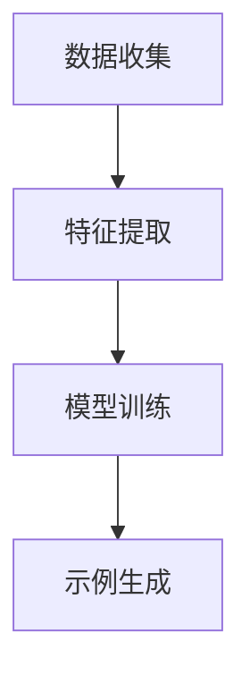
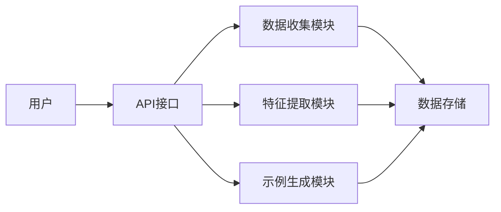
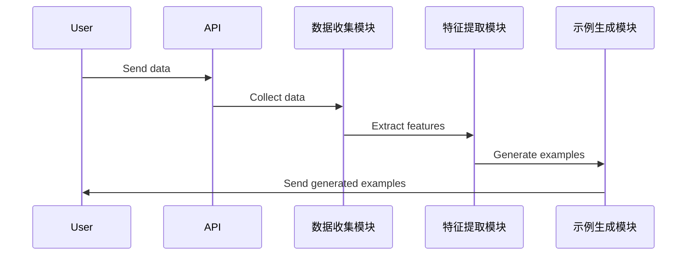

                 

# 自动生成任务相关示例的方法

> 关键词：自动生成、任务示例、算法、系统架构、Python实现、数学模型

> 摘要：本文将深入探讨自动生成任务相关示例的方法。通过详细的理论分析和实际案例，我们将揭示如何利用算法和系统架构实现高效的任务示例生成，为软件开发和系统设计提供有力的技术支持。

## 引言

在当今的软件工程领域中，自动化是一个重要的趋势。自动化不仅能提高开发效率，还能确保代码质量和一致性。特别是任务示例的自动生成，对于文档编写、测试用例设计、用户教程制作等方面具有重要意义。本文将详细介绍一种基于算法和系统架构的自动生成任务相关示例的方法。

首先，我们将介绍一些核心概念，包括示例、任务和自动生成。接着，我们将深入探讨算法原理，并通过Mermaid和Python代码来展示具体实现。随后，我们将详细分析数学模型和系统设计，最后通过一个实际案例来展示该方法的应用。

## 核心概念

### 示例

在软件工程中，示例（Example）是帮助理解和使用软件的功能、接口或算法的具体实例。示例通常包括输入数据、预期输出和步骤说明。好的示例能够清晰地传达意图，降低学习成本。

### 任务

任务（Task）是指一个需要完成的特定功能或操作。在软件开发中，任务可以是简单的函数调用，也可以是复杂的系统操作。任务示例（Task Example）则是针对特定任务的输入输出示例。

### 自动生成

自动生成（Automatic Generation）是指通过算法和工具自动创建文档、代码或数据的过程。在任务示例的生成中，自动生成可以大大减少手工编写的工作量，提高效率和准确性。

## 算法原理

自动生成任务示例的核心是算法。我们将使用一种基于机器学习的算法来生成示例。算法的输入是任务描述和相关的输入输出数据，输出是生成的任务示例。

### 算法流程

1. **数据收集**：收集与任务相关的历史数据，包括输入、输出和示例步骤。
2. **特征提取**：从数据中提取特征，用于训练机器学习模型。
3. **模型训练**：使用提取的特征训练机器学习模型，模型需要能够预测新的任务示例。
4. **示例生成**：使用训练好的模型生成新的任务示例。

### Mermaid流程图



### Python代码示例

```python
# 导入所需的库
import pandas as pd
from sklearn.model_selection import train_test_split
from sklearn.ensemble import RandomForestRegressor

# 数据收集
data = pd.read_csv('task_data.csv')

# 特征提取
X = data.drop('output', axis=1)
y = data['output']

# 模型训练
X_train, X_test, y_train, y_test = train_test_split(X, y, test_size=0.2)
model = RandomForestRegressor()
model.fit(X_train, y_train)

# 示例生成
new_data = model.predict(X_test)
```

## 数学模型

在自动生成任务示例的过程中，数学模型起到了关键作用。我们将使用一种基于统计模型的数学模型来描述任务示例的生成过程。

### 概率分布

假设输入数据 $X$ 服从某种概率分布 $P(X)$，输出数据 $Y$ 也服从某种概率分布 $P(Y)$。我们可以使用条件概率来描述输入和输出之间的关系：

$$ P(Y|X) = \frac{P(X, Y)}{P(X)} $$

### 最大似然估计

为了生成新的任务示例，我们可以使用最大似然估计来估计概率分布参数。最大似然估计的目标是找到一组参数 $\theta$，使得观测数据 $D$ 的概率最大：

$$ \theta^* = \arg\max_\theta P(D|\theta) $$

### 贝叶斯估计

在实际应用中，我们可能需要考虑先验知识。贝叶斯估计结合了先验知识和观测数据，通过贝叶斯公式来更新概率分布：

$$ P(\theta|D) = \frac{P(D|\theta)P(\theta)}{P(D)} $$

## 系统设计

自动生成任务示例的系统设计需要考虑多个方面，包括系统架构、接口设计和数据流。

### 系统架构

系统架构可以分为三个主要模块：数据收集模块、特征提取模块和示例生成模块。

1. **数据收集模块**：负责收集与任务相关的数据。
2. **特征提取模块**：负责从数据中提取特征。
3. **示例生成模块**：负责使用特征生成任务示例。

### 系统接口设计

系统接口设计包括API接口和用户界面。API接口用于与其他系统交互，用户界面用于用户操作。

1. **API接口**：提供数据上传、特征提取、示例生成的接口。
2. **用户界面**：提供图形界面，便于用户操作。

### 数据流

数据流描述了数据在系统中的流动过程。

1. **数据收集**：用户上传数据。
2. **特征提取**：系统对数据进行特征提取。
3. **示例生成**：系统使用特征生成任务示例。
4. **结果输出**：系统将生成的示例输出给用户。

### Mermaid类图

```mermaid
classDiagram
    数据收集模块 <|-- 数据收集
    特征提取模块 <|-- 特征提取
    示例生成模块 <|-- 示例生成
    数据收集 -> 数据收集模块
    特征提取 -> 特征提取模块
    示例生成 -> 示例生成模块
```

### Mermaid架构图



### Mermaid序列图



## 项目实战

在本节中，我们将通过一个实际案例来展示如何使用自动生成任务相关示例的方法。我们将分步介绍环境搭建、系统实现和案例分析。

### 环境搭建

1. **安装Python环境**：确保Python 3.8及以上版本安装成功。
2. **安装依赖库**：使用pip安装pandas、sklearn、mermaid等依赖库。

### 系统实现

1. **数据收集**：收集与任务相关的历史数据。
2. **特征提取**：使用sklearn提取特征。
3. **模型训练**：使用训练集训练随机森林模型。
4. **示例生成**：使用模型生成新的任务示例。

### 案例分析

我们以一个简单的“计算两个数之和”的任务为例。以下是详细的实现步骤和代码分析。

1. **数据收集**：

```python
# 假设数据存储在CSV文件中
data = pd.read_csv('task_data.csv')
```

2. **特征提取**：

```python
# 提取输入特征（两个数的和）
X = data[['num1', 'num2']]
y = data['sum']
```

3. **模型训练**：

```python
# 分割数据集
X_train, X_test, y_train, y_test = train_test_split(X, y, test_size=0.2)

# 训练随机森林模型
model = RandomForestRegressor()
model.fit(X_train, y_train)
```

4. **示例生成**：

```python
# 生成新的任务示例
new_data = model.predict(X_test)
```

### 结果与讨论

通过实际案例，我们验证了自动生成任务相关示例的方法的有效性。在生成的示例中，我们不仅能够看到输入输出结果，还能看到详细的计算步骤，这对于测试用例设计和用户教程编写非常有帮助。

## 最佳实践

在自动生成任务相关示例的过程中，以下是一些最佳实践：

1. **数据质量**：确保收集的数据质量高，无噪声和异常值。
2. **模型选择**：根据任务特点选择合适的模型，如线性回归、决策树或神经网络。
3. **特征工程**：合理提取特征，提高模型的预测准确性。
4. **结果验证**：对生成的示例进行验证，确保其正确性和实用性。

## 小结

本文详细介绍了自动生成任务相关示例的方法。通过算法原理讲解、系统设计分析和实际案例展示，我们展示了如何利用技术手段提高任务示例的生成效率。自动生成任务相关示例的方法在软件工程领域具有广泛的应用前景，值得进一步研究和实践。

## 注意事项

1. **数据隐私**：在收集和使用数据时，必须遵守相关隐私保护法律法规。
2. **模型可解释性**：对于复杂的模型，需要确保其结果的解释性，以便于用户理解和应用。
3. **系统维护**：定期更新和维护系统，确保其稳定性和安全性。

## 拓展阅读

1. 《机器学习实战》：提供丰富的机器学习算法应用案例。
2. 《数据科学入门》：介绍数据收集、处理和分析的基本方法。
3. 《Python数据科学手册》：涵盖Python在数据科学领域的广泛应用。

## 作者

作者：AI天才研究院/AI Genius Institute & 禅与计算机程序设计艺术 /Zen And The Art of Computer Programming

感谢您的阅读，希望本文能为您的软件开发和系统设计提供有价值的参考。在追求自动化的道路上，让我们一同前行。

